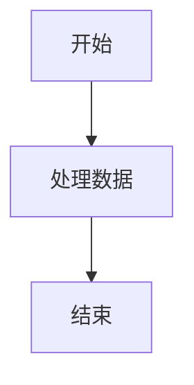

# CLAUDE.md

This file provides guidance to Claude Code (claude.ai/code) when working with code in this repository.

## 项目概述

这是一个 PinPet SDK 的文档项目，使用 Docsify 构建在线技术文档。项目包含两个主要文档区域：
使用的 docsify 工具的代码在: https://github.com/docsifyjs/docsify


- `notes/` - 测试用的文档,不对外公开的
- `doc/` - 核心 PinPet SDK 技术文档

参考带翻译的示例网站: https://shd101wyy.github.io/markdown-preview-enhanced/#/

## 常用开发命令

### 启动 Docsify 文档服务器

```bash
# 启动 notes 目录的文档服务
cd notes && docsify serve .

# 启动 doc 目录的文档服务  
cd doc && docsify serve .

# 指定端口启动服务
docsify serve . --port 3000
```

### 安装 Docsify CLI（首次使用）

```bash
npm i -g docsify-cli
```

## 项目架构

### 文档结构

```
spin-book/
├── Docsify部署指南.md      # Docsify 完整配置指南
├── notes/                  # PinPet SDK 技术文档
│   ├── README.md          # 主导航页面
│   ├── _sidebar.md        # 侧边栏导航配置
│   ├── index.html         # 自定义样式的 Docsify 配置
│   ├── PinPet-SDK简介.md
│   ├── API_DOC_CN.md      # API 接口文档
│   ├── PinPetSdk接口文档.md
│   ├── 工程说明.md         # SDK 模块化架构说明
│   └── [其他技术文档]
└── doc/                    # 产品文档
    ├── README.md          # 基础导航
    ├── index.html         # 标准 Docsify 配置
    └── [产品说明文档]
```

### PinPet SDK 架构设计

根据 `工程说明.md`，SDK 采用模块化类设计：

**核心架构：**
- `PinPetSdk` 主类：管理连接、钱包、程序ID
- 模块化设计：trading、orders、curve、preview 等功能模块
- 跨平台兼容：支持 Node.js 和浏览器环境
- 未来计划：发布到 npmjs

**预期文件结构：**
```
src/
├── sdk.js                 # 主 SDK 类
├── modules/               # 功能模块
│   ├── trading.js        # 交易模块
│   ├── orders.js         # 订单模块
│   ├── curve.js          # 曲线模块
│   └── preview.js        # 预览模块
├── core/                  # 核心功能
└── utils/                 # 工具函数
```

## 文档特性

### 支持的功能
- KaTeX 数学公式渲染（行内 `$` 和块级 `$$`）
- Mermaid 图表支持（流程图、序列图等）
- 全文搜索功能
- 中文内容支持
- 自定义主题样式（在 notes/index.html 中）

### 数学公式语法
- 行内公式：`$P = \frac{S \cdot R}{L + S}$`
- 块级公式：`$$f(x) = ax^2 + bx + c$$`

### Mermaid 图表语法


## 文档维护

### 添加新文档
1. 在相应目录（notes/ 或 doc/）创建 .md 文件
2. 更新对应的 README.md 导航链接
3. 更新 _sidebar.md 侧边栏导航

### 部署选项
- 本地开发：使用 `docsify serve`
- GitHub Pages：推送到 GitHub 并启用 Pages
- Netlify：连接仓库自动部署
- 自定义服务器：上传文件并配置 HTML5 History API

## 重要文件

- `Docsify部署指南.md` - 完整的 Docsify 配置和部署说明
- `notes/index.html` - 带自定义样式的 Docsify 配置
- `notes/_sidebar.md` - 主要文档的侧边栏导航
- `工程说明.md` - SDK 架构设计文档