```mermaid
graph LR
    subgraph "Supply and Demand Balance"
        A[🍎🍎🍎 Many Apple Coins] -.-> B[Low Price]
        C[🍌🍌🍌 Many Banana Coins] -.-> D[Low Price]
        E[🍎 Few Apple Coins] -.-> F[High Price]
        G[🍌 Few Banana Coins] -.-> H[High Price]
    end

    style A fill:#ffcdd2
    style B fill:#ffcdd2
    style C fill:#fff9c4
    style D fill:#fff9c4
    style E fill:#c8e6c9
    style F fill:#c8e6c9
    style G fill:#e1f5fe
    style H fill:#e1f5fe
```

# AMM Market Making Mechanism Guide - Understanding Automated Market Makers from Scratch

## Table of Contents
1. [What is AMM?](#what-is-amm)
2. [The Story of Traditional Exchanges](#the-story-of-traditional-exchanges)
3. [The Magical World of AMM](#the-magical-world-of-amm)
4. [Mathematical Principles Simplified](#mathematical-principles-simplified)
5. [Illustrated AMM Working Principles](#illustrated-amm-working-principles)
6. [What is Slippage?](#what-is-slippage)
7. [Why Use AMM?](#why-use-amm)
8. [Real Case Studies](#real-case-studies)
9. [Summary](#summary)

---

## What is AMM?

Imagine you want to trade apples for bananas, but you can't find anyone who specifically wants apples. Now, if there's a "magical juice machine" where you put in apples and it automatically gives you the corresponding amount of bananas, that's the basic concept of AMM (Automated Market Maker)!

**AMM = Automated Market Maker**

Simply put, AMM is an intelligent, never-sleeping "trading robot" that allows you to exchange different tokens anytime, anywhere, without needing to wait for other people to trade with you.

---

## The Story of Traditional Exchanges

### 📖 Xiao Ming's Trading Troubles

Xiao Ming wants to trade his 100 Apple Coins for some Banana Coins. On a traditional exchange:

1. **Place Order and Wait**: Xiao Ming places an order "I want to buy Banana Coins with 100 Apple Coins, price 1:2"
2. **Wait for Buyers**: Xiao Ming must wait until someone wants to sell Banana Coins at the right price
3. **Possibly Wait Long**: If no one wants to sell, Xiao Ming might wait hours or even days
4. **Price Fluctuation**: During the waiting period, prices might change, and Xiao Ming could miss the best opportunity

### Problems with Traditional Exchanges:
- ⏰ **Need to Wait**: Must wait for someone willing to trade
- 📊 **Insufficient Liquidity**: Unpopular tokens are hard to trade
- 💰 **Price Instability**: Large orders easily cause dramatic price swings
- 🌙 **Time Constraints**: Exchanges have operating hours

---

## The Magical World of AMM

### 🏪 The Magical Automatic Store

Now, imagine there's a magical automatic store (AMM) that works like this:

1. **Always Open**: 24-hour operation, never closes
2. **Instant Trading**: Whatever you want, you can buy immediately
3. **Automatic Pricing**: Prices adjust automatically based on inventory
4. **No Waiting**: No need to wait for other customers

### 🏦 Liquidity Pool = Super Warehouse

The core of AMM is the "liquidity pool," like a huge two-compartment warehouse:

### 🤖 Automatic Pricing Robot

AMM has a super smart pricing robot that follows a simple rule:

**🔢 Magic Formula: Apple Coin Quantity × Banana Coin Quantity = Fixed Value (k)**

This formula ensures:
- The more people buy, the higher the price
- The more people sell, the lower the price
- There's always inventory to buy and prices to sell

---

## Mathematical Principles Simplified

### 🧮 Constant Product Formula

Don't be scared by "mathematics" - it's actually very simple!

Suppose our magical warehouse has:
- Apple Coins: 100 pieces
- Banana Coins: 200 pieces
- Magic number k = 100 × 200 = 20,000

**Rule: No matter how you trade, the k value must remain 20,000!**

### 📊 Trading Example

**Xiao Ming wants to trade 10 Apple Coins for Banana Coins:**

1. **Before Trading**:
   - Apple Coins: 100 pieces
   - Banana Coins: 200 pieces
   - k = 100 × 200 = 20,000

2. **Xiao Ming Inputs 10 Apple Coins**:
   - New Apple Coin quantity: 100 + 10 = 110 pieces
   - Must maintain k = 20,000
   - So: 110 × New Banana Coin quantity = 20,000
   - New Banana Coin quantity = 20,000 ÷ 110 = 181.8 pieces

3. **Xiao Ming Gets**:
   - Banana Coins: 200 - 181.8 = 18.2 pieces
   - Traded 10 Apple Coins for 18.2 Banana Coins

---

## Illustrated AMM Working Principles

### 🎢 Price Curve Chart

AMM price changes are like a roller coaster, following a special curve:

```mermaid
graph TD
    subgraph "AMM Price Change Chart"
        A[Many Apple Coins<br/>Few Banana Coins<br/>🍎🍎🍎🍎🍎<br/>🍌<br/>Banana Coins are expensive]
        B[Balanced State<br/>🍎🍎🍎<br/>🍌🍌🍌<br/>Moderate price]
        C[Few Apple Coins<br/>Many Banana Coins<br/>🍎<br/>🍌🍌🍌🍌🍌<br/>Apple Coins are expensive]
    end
    
    A -.-> B -.-> C
    
    style A fill:#ffebee
    style B fill:#e8f5e8
    style C fill:#fff3e0
```

### 📈 Supply and Demand Chart

Imagine the two sides of a balance:

---

## What is Slippage?

### 🛒 Supermarket Shopping Analogy

Imagine you go to a supermarket to buy apples:

**Traditional Supermarket (Centralized Exchange):**
- Listed price: $5/pound
- Buy 1 pound: $5
- Buy 100 pounds: Still $5/pound
- But there might not be that much inventory!

**Magical Supermarket (AMM):**
- 1st pound: $5
- 2nd pound: $5.1 (inventory decreases, price rises)
- 3rd pound: $5.2
- The more you buy, the faster the price rises!

### 📊 Slippage Impact Chart

### 🎯 Slippage Calculation Example

Suppose the pool has 1000 Apple Coins and 2000 Banana Coins:

1. **Buy 10 Banana Coins**: Slippage about 0.25%
2. **Buy 100 Banana Coins**: Slippage about 2.5%
3. **Buy 500 Banana Coins**: Slippage about 14%

**Conclusion: The more you buy, the higher the average price per coin!**

---

## Why Use AMM?

### 🌟 AMM's Super Advantages

#### 1. 🚀 Instant Trading
- **Traditional Method**: Might wait hours to find a trading partner
- **AMM Method**: Complete trades in seconds

#### 2. 🌍 24/7 All Day
- **Traditional Exchanges**: Have operating hours, closed on holidays
- **AMM**: Never closes, trade anytime

#### 3. 🎯 No Need for Matching
- **Traditional Method**: Need buyers and sellers to match prices
- **AMM**: As long as there are coins in the pool, you can trade

#### 4. 💎 Support for Niche Tokens
- **Traditional Exchanges**: Unpopular coins might have no traders
- **AMM**: As long as a pool is created, you can trade

### 📊 Comparison Table

| Feature | Traditional Exchange | AMM |
|---------|---------------------|-----|
| Trading Speed | Need to wait for matching ⏳ | Instant completion ⚡ |
| Operating Hours | Limited 🕐 | 24/7 🌍 |
| Liquidity | Depends on user orders 👥 | Algorithm guaranteed 🤖 |
| Price Discovery | Order book 📋 | Mathematical formula 🧮 |
| Slippage | Depends on order depth 📊 | Depends on trade size 📈 |

---

## Real Case Studies

### 🎮 Game Token Trading Story

#### Background Setting
Xiao Gang is in a blockchain game and wants to exchange game tokens:
- 🗡️ Warrior Coins (for buying weapons)
- 🏹 Archer Coins (for buying bows)

#### Scenario 1: Traditional Exchange

```mermaid
sequenceDiagram
    participant Xiao Gang
    participant Exchange
    participant Other Players
    
    Xiao Gang->>Exchange: Want to trade 100 Warrior Coins for Archer Coins
    Exchange->>Xiao Gang: No one is selling Archer Coins
    Xiao Gang->>Exchange: Place order and wait...
    Note over Xiao Gang: Waiting 2 hours...
    Other Players->>Exchange: I want to sell 50 Archer Coins
    Exchange->>Xiao Gang: Can only buy half
    Xiao Gang->>Xiao Gang: 😭 Game is over
```

#### Scenario 2: AMM

```mermaid
sequenceDiagram
    participant Xiao Gang
    participant AMM Pool
    
    Xiao Gang->>AMM Pool: Want to trade 100 Warrior Coins for Archer Coins
    AMM Pool->>AMM Pool: Quickly calculate price
    AMM Pool->>Xiao Gang: Immediately give you 180 Archer Coins!
    Xiao Gang->>Xiao Gang: 😄 Can continue playing right away
```

### 🍕 Pizza Shop Analogy

**Traditional Mode (Finding Friends to Exchange Coins):**
- You want Bitcoin, need to find someone who specifically wants your Ethereum
- Might have to shout in groups: Anyone want to trade Bitcoin for Ethereum?
- Might wait half a day with no response

**AMM Mode (Vending Machine):**
- Like a super intelligent vending machine
- Insert Ethereum, immediately get Bitcoin
- Price calculated automatically, no haggling needed

### 📱 Mobile App Analogy

Imagine a magical coin exchange app:

---

## Summary

### 🎯 Key Points Review

1. **AMM is like a magical vending machine**
   - Insert one type of coin, immediately get another type
   - Works 24 hours, never rests

2. **Constant product formula is the core**
   - x × y = k (the never-changing magic number)
   - This formula makes prices auto-adjust

3. **Slippage is a normal phenomenon**
   - The more you buy, the more the price rises
   - Just like things getting more expensive the more you buy at the supermarket

4. **AMM is more convenient than traditional exchanges**
   - No waiting for people, instant trading
   - Supports all coin types
   - Always has liquidity

### 🌈 Future Outlook

AMM technology is still continuously developing:
- More intelligent pricing algorithms
- Lower slippage
- More innovative features

### 🎓 Advice for Beginners

1. **Start with small amounts**: Practice with small funds first
2. **Understand slippage**: Be careful with slippage on large trades
3. **Compare more**: Different AMMs might have different prices
4. **Keep learning**: The DeFi world changes rapidly

---

## Appendix: Frequently Asked Questions

### ❓ FAQ

**Q1: Will AMM run out of coins to exchange?**
A1: Theoretically no! As long as there are coins in the pool, you can trade. But prices might be very high.

**Q2: Why are prices sometimes very different?**
A2: Because pool sizes are different. Small pools have large price fluctuations, large pools are relatively stable.

**Q3: Is AMM safe?**
A3: The code is open source, but be careful to choose audited platforms.

**Q4: How are fees calculated?**
A4: Usually 0.1-1% of the trading amount, automatically deducted from trading results.

**Q5: Can I cancel a transaction?**
A5: You can cancel before blockchain confirmation, but you'll pay cancellation fees.

Remember: Investment involves risks, trade cautiously! Learn first, then practice, start with small amounts! 🚀 