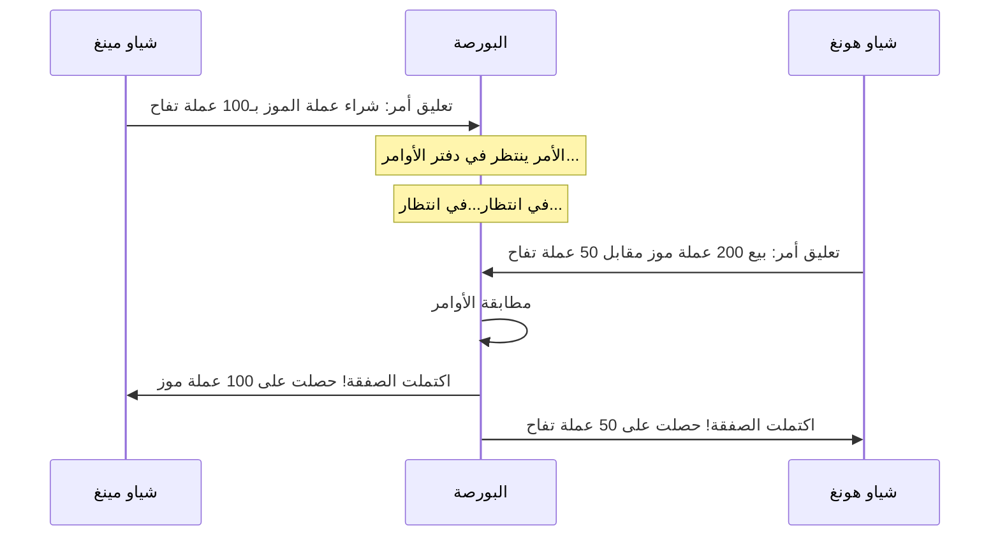
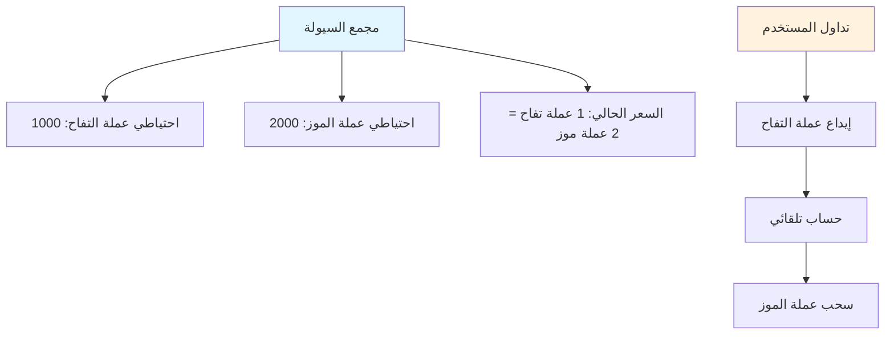
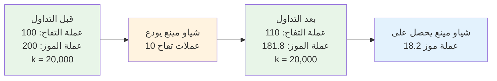
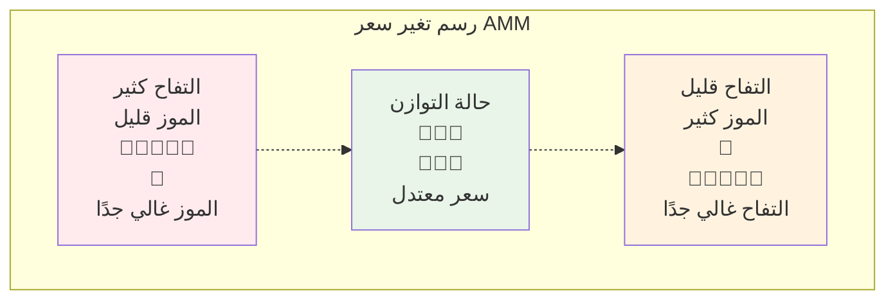
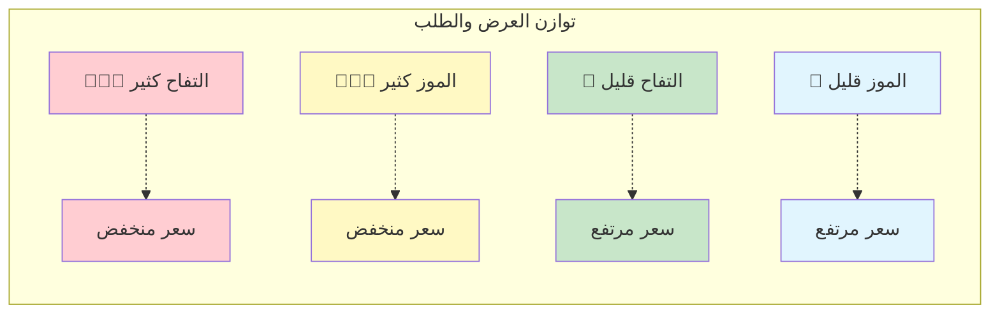
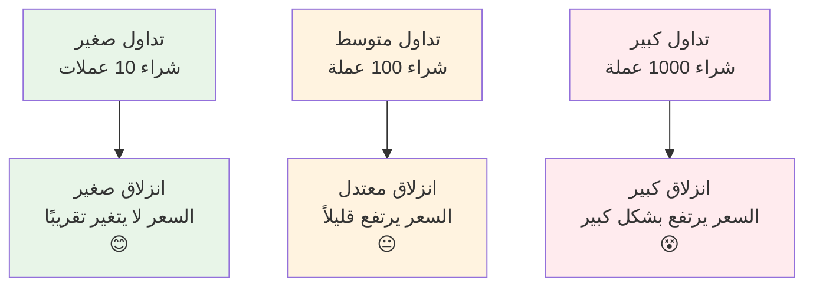
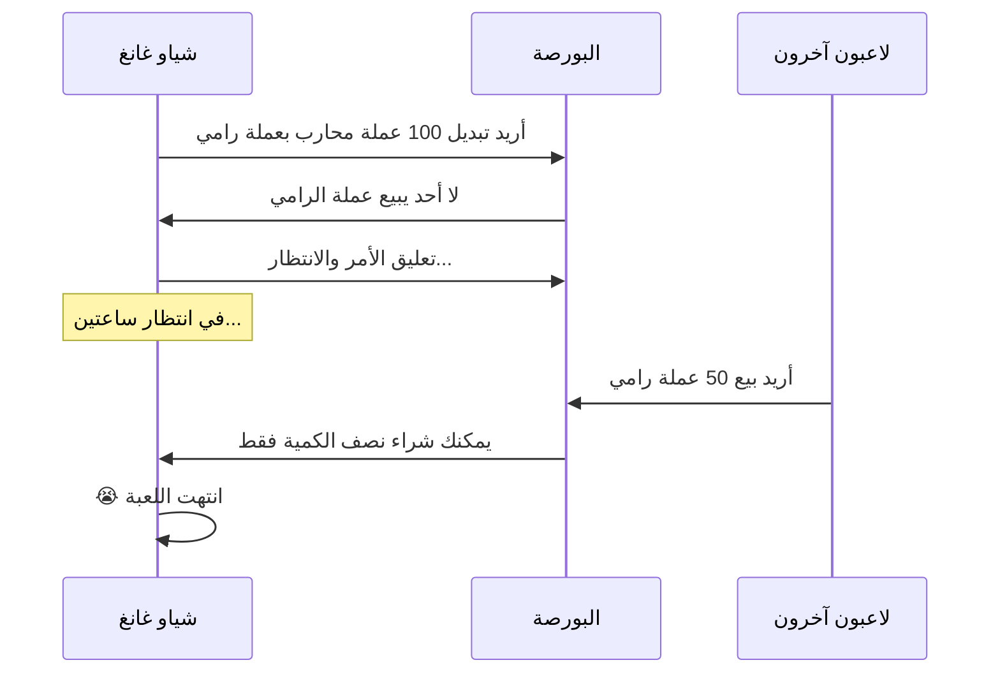
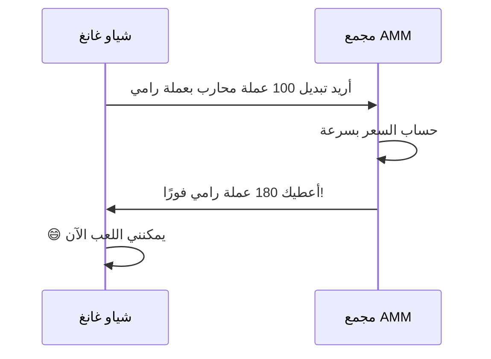
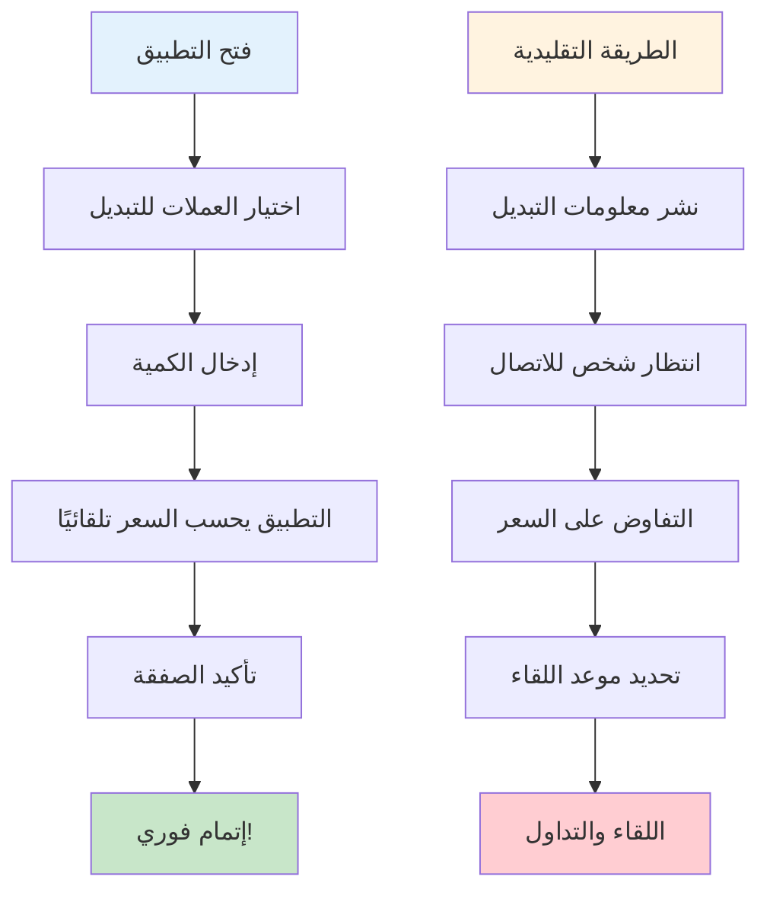

# دليل آلية صناعة السوق AMM - فهم صانع السوق الآلي من الصفر

## الفهرس
1. [ما هو AMM؟](#ما-هو-amm)
2. [قصة البورصة التقليدية](#قصة-البورصة-التقليدية)
3. [العالم السحري لـ AMM](#العالم-السحري-لـ-amm)
4. [المبادئ الرياضية - النسخة المبسطة](#المبادئ-الرياضية---النسخة-المبسطة)
5. [شرح مبدأ عمل AMM بالرسوم](#شرح-مبدأ-عمل-amm-بالرسوم)
6. [ما هو الانزلاق السعري؟](#ما-هو-الانزلاق-السعري)
7. [لماذا نستخدم AMM؟](#لماذا-نستخدم-amm)
8. [تحليل الحالات العملية](#تحليل-الحالات-العملية)
9. [الخلاصة](#الخلاصة)

---

## ما هو AMM؟

تخيل أنك تريد مبادلة التفاح بالموز، لكنك لا تجد شخصًا يريد التفاح بالضبط. الآن، لو كان هناك "عصارة سحرية"، تضع فيها التفاح، وتعطيك تلقائيًا الكمية المناسبة من الموز، هذا هو المفهوم الأساسي لـ AMM (صانع السوق الآلي)!

**AMM = Automated Market Maker (صانع السوق الآلي)**

ببساطة، AMM هو "روبوت تداول" ذكي لا يتوقف أبدًا، يمكنك من مبادلة الرموز المختلفة في أي وقت وأي مكان، دون الحاجة للانتظار حتى يأتي شخص آخر للتداول معك.

---

## قصة البورصة التقليدية

### 📖 مشكلة التداول لدى شياو مينغ

شياو مينغ يريد مبادلة 100 عملة تفاح لديه ببعض عملات الموز. في البورصة التقليدية:

1. **تعليق الأمر والانتظار**: يعلق شياو مينغ أمرًا "أريد شراء عملة الموز بـ 100 عملة تفاح، السعر 1:2"
2. **انتظار المشتري**: يجب على شياو مينغ الانتظار حتى يأتي شخص يريد بيع عملة الموز بسعر مناسب
3. **قد ينتظر طويلاً**: إذا لم يرد أحد البيع، قد ينتظر شياو مينغ ساعات أو حتى أيام
4. **تقلب الأسعار**: خلال فترة الانتظار قد يتغير السعر، وقد يفوت شياو مينغ أفضل توقيت

### مشاكل البورصة التقليدية:
- ⏰ **الحاجة للانتظار**: يجب انتظار شخص راغب في التداول
- 📊 **نقص السيولة**: الرموز غير الشائعة يصعب تداولها
- 💰 **عدم استقرار الأسعار**: الأوامر الكبيرة تسبب تقلبات سعرية حادة
- 🌙 **قيود الوقت**: البورصات لها ساعات عمل محددة

---

## العالم السحري لـ AMM

### 🏪 المتجر الآلي السحري

الآن، تخيل أن هناك متجرًا آليًا سحريًا (AMM)، يعمل بهذه الطريقة:

1. **مفتوح دائمًا**: يعمل 24 ساعة، لا يغلق أبدًا
2. **تداول فوري**: ما تريده، تحصل عليه فورًا
3. **تسعير تلقائي**: الأسعار تتعدل تلقائيًا حسب المخزون
4. **لا حاجة للانتظار**: لا تحتاج لانتظار عملاء آخرين

### 🏦 مجمع السيولة = المستودع الفائق

جوهر AMM هو "مجمع السيولة"، مثل مستودع ضخم بقسمين:

### 🤖 روبوت التسعير الآلي

لدى AMM روبوت تسعير ذكي للغاية، يتبع قاعدة بسيطة:

**🔢 الصيغة السحرية: كمية عملة التفاح × كمية عملة الموز = قيمة ثابتة (k)**

هذه الصيغة تضمن:
- كلما زاد عدد المشترين، ارتفع السعر
- كلما زاد عدد البائعين، انخفض السعر
- دائمًا هناك مخزون للشراء، وسعر للبيع

---

## المبادئ الرياضية - النسخة المبسطة

### 🧮 صيغة الحاصل الثابت

لا تخف من "الرياضيات" - إنها بسيطة جدًا!

لنفترض أن مستودعنا السحري يحتوي على:
- عملة التفاح: 100
- عملة الموز: 200
- الرقم السحري k = 100 × 200 = 20,000

**القاعدة: مهما كانت التداولات، يجب أن تبقى قيمة k عند 20,000!**

### 📊 مثال على التداول

**شياو مينغ يريد مبادلة 10 عملات تفاح بعملة الموز:**

1. **قبل التداول**:
   - عملة التفاح: 100
   - عملة الموز: 200
   - k = 100 × 200 = 20,000

2. **شياو مينغ يودع 10 عملات تفاح**:
   - كمية عملة التفاح الجديدة: 100 + 10 = 110
   - يجب الحفاظ على k = 20,000
   - إذن: 110 × كمية عملة الموز الجديدة = 20,000
   - كمية عملة الموز الجديدة = 20,000 ÷ 110 = 181.8

3. **شياو مينغ يحصل على**:
   - عملة الموز: 200 - 181.8 = 18.2
   - استبدل 10 عملات تفاح بـ 18.2 عملة موز

---

## شرح مبدأ عمل AMM بالرسوم

### 🎢 رسم منحنى السعر

تغير سعر AMM مثل الأفعوانية، يتبع منحنى خاص:

### 📈 رسم العرض والطلب

تخيل كفتي الميزان:

---

## ما هو الانزلاق السعري؟

### 🛒 تشبيه التسوق في السوبرماركت

تخيل أنك تذهب للسوبرماركت لشراء التفاح:

**السوبرماركت التقليدي (البورصة المركزية):**
- السعر المعلن: 5 يوان/رطل
- شراء 1 رطل: 5 يوان
- شراء 100 رطل: لا يزال 5 يوان/رطل
- لكن قد لا يكون هناك مخزون كافٍ!

**السوبرماركت السحري (AMM):**
- الرطل الأول: 5 يوان
- الرطل الثاني: 5.1 يوان (نقص المخزون، ارتفاع السعر)
- الرطل الثالث: 5.2 يوان
- كلما اشتريت أكثر، ارتفع السعر أسرع!

### 📊 رسم تأثير الانزلاق السعري

### 🎯 مثال حساب الانزلاق السعري

لنفترض أن المجمع يحتوي على 1000 عملة تفاح و 2000 عملة موز:

1. **شراء 10 عملات موز**: انزلاق حوالي 0.25%
2. **شراء 100 عملة موز**: انزلاق حوالي 2.5%
3. **شراء 500 عملة موز**: انزلاق حوالي 14%

**الخلاصة: كلما اشتريت أكثر، ارتفع متوسط سعر كل عملة!**

---

## لماذا نستخدم AMM؟

### 🌟 المزايا الفائقة لـ AMM

#### 1. 🚀 تداول فوري
- **الطريقة التقليدية**: قد تنتظر ساعات للعثور على طرف للتداول
- **طريقة AMM**: إتمام التداول في ثوانٍ

#### 2. 🌍 متاح 24/7 طوال الأسبوع
- **البورصة التقليدية**: لها ساعات عمل، تغلق في العطلات
- **AMM**: لا يغلق أبدًا، يمكن التداول في أي وقت

#### 3. 🎯 لا حاجة للمطابقة
- **الطريقة التقليدية**: تحتاج لمطابقة أسعار البائع والمشتري
- **AMM**: طالما يوجد عملات في المجمع يمكن التداول

#### 4. 💎 دعم الرموز النادرة
- **البورصة التقليدية**: الرموز غير الشائعة قد لا يكون لها متداولون
- **AMM**: طالما تم إنشاء مجمع يمكن التداول

### 📊 جدول المقارنة

| الميزة | البورصة التقليدية | AMM |
|------|-----------|-----|
| سرعة التداول | تحتاج انتظار المطابقة ⏳ | فوري ⚡ |
| ساعات العمل | محدودة 🕐 | 24/7 🌍 |
| السيولة | تعتمد على أوامر المستخدمين 👥 | مضمونة بالخوارزمية 🤖 |
| اكتشاف السعر | دفتر الأوامر 📋 | صيغة رياضية 🧮 |
| الانزلاق السعري | يعتمد على عمق الأوامر 📊 | يعتمد على حجم التداول 📈 |

---

## تحليل الحالات العملية

### 🎮 قصة تداول رموز اللعبة

#### الخلفية
شياو غانغ في لعبة بلوكتشين، يريد تبديل رموز اللعبة:
- 🗡️ عملة المحارب (لشراء الأسلحة)
- 🏹 عملة الرامي (لشراء الأقواس)

#### السيناريو الأول: البورصة التقليدية

#### السيناريو الثاني: AMM

### 🍕 تشبيه متجر البيتزا

**النمط التقليدي (إيجاد صديق للتبديل):**
- تريد بيتكوين، تحتاج للعثور على شخص يريد إيثريوم الخاص بك تحديدًا
- قد تضطر للصراخ في المجموعة: هل أحد يريد تبديل بيتكوين بإيثريوم؟
- قد تنتظر نصف يوم دون رد

**نمط AMM (آلة البيع الذاتي):**
- مثل آلة بيع ذاتية ذكية للغاية
- أودع إيثريوم، واحصل على بيتكوين فورًا
- السعر يُحسب تلقائيًا، لا حاجة للمساومة

### 📱 تشبيه تطبيق الهاتف

تخيل تطبيق تبديل عملات سحري:

---

## الخلاصة

### 🎯 مراجعة النقاط الأساسية

1. **AMM مثل آلة بيع ذاتية سحرية**
   - أودع عملة واحدة، واحصل فورًا على عملة أخرى
   - تعمل 24 ساعة، لا تتوقف أبدًا

2. **صيغة الحاصل الثابت هي الجوهر**
   - x × y = k (الرقم السحري الذي لا يتغير)
   - هذه الصيغة تجعل السعر يتعدل تلقائيًا

3. **الانزلاق السعري ظاهرة طبيعية**
   - كلما اشتريت أكثر، ارتفع السعر أكثر
   - مثل التسوق في السوبرماركت، كلما اشتريت أكثر كان أغلى

4. **AMM أكثر ملاءمة من البورصة التقليدية**
   - لا حاجة لانتظار الآخرين، تداول فوري
   - يدعم جميع أنواع العملات
   - سيولة دائمة

### 🌈 التوقعات المستقبلية

تقنية AMM لا تزال في تطور مستمر:
- خوارزميات تسعير أكثر ذكاءً
- انزلاق سعري أقل
- المزيد من الميزات المبتكرة

### 🎓 نصائح للمبتدئين

1. **ابدأ بمبالغ صغيرة**: تدرب بأموال قليلة أولاً
2. **افهم الانزلاق السعري**: انتبه للانزلاق في التداولات الكبيرة
3. **قارن كثيرًا**: قد تختلف أسعار AMM المختلفة
4. **تعلم باستمرار**: عالم DeFi يتغير بسرعة

---

## الملحق: الأسئلة الشائعة

### ❓ FAQ

**س1: هل ستنفد عملات AMM؟**
ج1: نظريًا لا! طالما توجد عملات في المجمع يمكن التداول. لكن السعر قد يكون مرتفعًا جدًا.

**س2: لماذا أحيانًا يكون الفرق في السعر كبيرًا؟**
ج2: بسبب اختلاف حجم المجمعات. المجمعات الصغيرة تقلباتها كبيرة، المجمعات الكبيرة أكثر استقرارًا نسبيًا.

**س3: هل AMM آمن؟**
ج3: الكود مفتوح المصدر، لكن احرص على اختيار منصات تمت مراجعتها.

**س4: كيف تُحسب الرسوم؟**
ج4: عادة 0.1-1% من مبلغ التداول، تُخصم تلقائيًا من نتيجة التداول.

**س5: هل يمكن إلغاء الصفقة؟**
ج5: يمكن الإلغاء قبل تأكيد البلوكتشين، لكن يجب دفع رسوم الإلغاء.

تذكر: الاستثمار به مخاطر، التداول يتطلب الحذر! تعلم أولاً، ثم مارس، ابدأ بمبالغ صغيرة! 🚀
