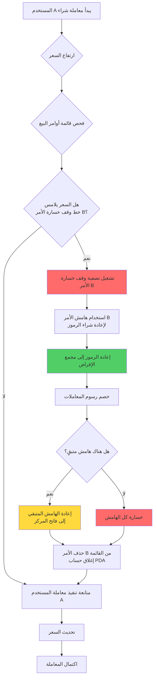
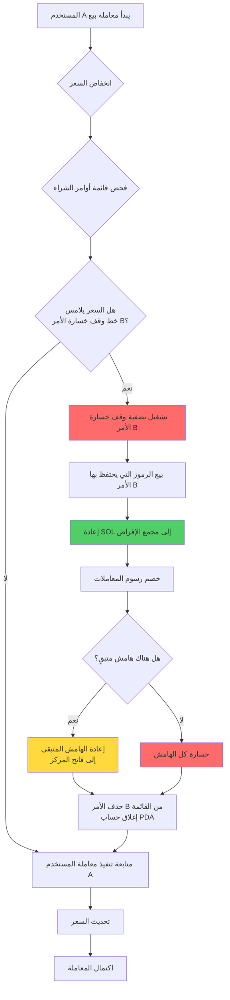
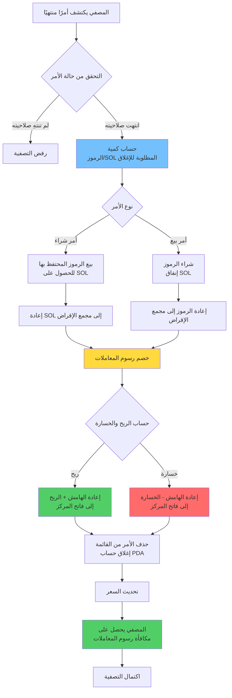
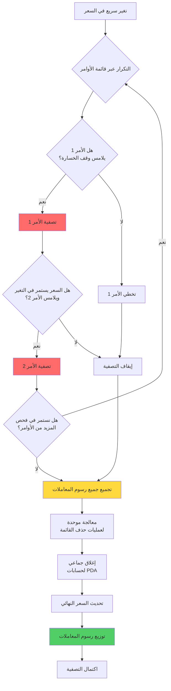

# ⚡ شرح وظيفة التصفية القسرية (الإفلاس) في PinPet

## 📋 نظرة عامة على الوظيفة

التصفية القسرية هي آلية التحكم في المخاطر الأساسية في بروتوكول PinPet لحماية استقرار النظام. يوفر النظام طريقتين لتشغيل التصفية القسرية:

1. **⏰ التشغيل الزمني**: عندما يتجاوز أمر التداول بالرافعة المالية وقت الاحتفاظ بالمركز المحدد، يمكن لأي شخص تشغيل التصفية القسرية
2. **🎯 التشغيل السعري**: عندما يلامس سعر السوق خط سعر وقف الخسارة للأمر، يتم تشغيل تصفية وقف الخسارة تلقائيًا

تضمن آلية الحماية المزدوجة هذه سيولة البروتوكول وأمان الأموال، مع حماية فاتح المركز من الخسائر المفرطة.

## ⚙️ الخصائص الأساسية

### 1. 🔄 آلية التشغيل المزدوجة

#### ⏰ التشغيل الزمني
- **✅ الإغلاق العادي**: خلال فترة الاحتفاظ بالأمر، يمكن لفاتح المركز فقط إغلاق المركز بشكل نشط
- **⏱️ التصفية عند الانتهاء**: بعد انتهاء صلاحية الأمر، يمكن لأي شخص تنفيذ عملية التصفية القسرية
- **🔍 التحقق من الوقت**: يحدد النظام تلقائيًا ما إذا كان الأمر قد انتهت صلاحيته من خلال الطابع الزمني على السلسلة

#### 🎯 التشغيل السعري (تصفية وقف الخسارة)
- **📉 وقف خسارة الشراء**: عندما ينخفض السعر ويلامس خط سعر وقف الخسارة لأمر الشراء، يتم إغلاق المركز تلقائيًا
- **📈 وقف خسارة البيع**: عندما يرتفع السعر ويلامس خط سعر وقف الخسارة لأمر البيع، يتم إغلاق المركز تلقائيًا
- **🔄 التشغيل السلبي**: يتم تنفيذ تصفية وقف الخسارة المشغلة بالسعر تلقائيًا عندما يتداول مستخدمون آخرون
- **⚠️ استنفاد الهامش**: عند وقف الخسارة، يُستخدم الهامش لسداد القروض، وعادةً لا يحصل فاتح المركز على ربح أو يخسر كل الهامش

### 2. 📊 دعم أنواع الأوامر

| نوع الأمر | شرط التشغيل السعري | شرط التشغيل الزمني | اتجاه القائمة المرتبطة | معالجة الأصول |
|---------|------------|------------|---------|---------|
| 📈 أمر الشراء | انخفاض السعر يلامس خط وقف الخسارة | انتهاء صلاحية الأمر | Down | إعادة SOL المقترض |
| 📉 أمر البيع | ارتفاع السعر يلامس خط وقف الخسارة | انتهاء صلاحية الأمر | Up | إعادة الرموز المقترضة |

### 3. 👥 أدوار المشاركين

- **👤 فاتح المركز**: المستخدم الذي ينشئ أمر الرافعة المالية، يمتلك حق الإغلاق الحصري قبل انتهاء صلاحية الأمر
- **🔨 المصفي**: أي مستخدم من طرف ثالث، يمكنه تنفيذ التصفية النشطة بعد انتهاء صلاحية الأمر
- **💼 المتداول**: قد تؤدي معاملات البيع والشراء للمستخدمين الآخرين إلى تشغيل تصفية وقف الخسارة السعرية
- **🤖 البروتوكول**: يدير تلقائيًا أموال مجمع الإقراض، ويضمن دوران الأموال بشكل طبيعي

## 🔄 سير العمل

### 📊 جدول مقارنة العمليات

| مرحلة العملية | ⏰ الإغلاق المشغل بالوقت | 🎯 وقف الخسارة المشغل بالسعر |
|---------|------------|------------|
| شرط التشغيل | انتهاء صلاحية الأمر | السعر يلامس خط وقف الخسارة |
| توقيت التشغيل | المصفي يبدأ بشكل نشط | يتم التشغيل تلقائيًا أثناء التداول |
| التحقق من الصلاحيات | يمكن لأي شخص التنفيذ | تنفيذ تلقائي (لا يتطلب صلاحيات) |
| تسوية الربح والخسارة | قد يكون ربحًا أو خسارة | عادةً خسارة كل الهامش |
| معالجة الهامش | إعادة الهامش المتبقي | يُستخدم لسداد القروض |

### 📉 عملية تصفية وقف الخسارة لأمر البيع (التشغيل السعري)



### 📈 عملية تصفية وقف الخسارة لأمر الشراء (التشغيل السعري)



### ⏰ عملية تصفية الأمر المنتهي (التشغيل الزمني)



### 💥 عملية التصفية المتسلسلة الجماعية



## 💰 آلية الرسوم

### 💵 تكوين رسوم المعاملات

| نوع الرسوم | من يدفع | معدل الرسوم | الغرض |
|---------|---------|------|------|
| رسوم المعاملات | فاتح المركز | وفقًا لمعدل الأمر | تعويض مزودي السيولة |
| رسوم التصفية | فاتح المركز | وفقًا لمعدل الأمر | مكافأة منفذ التصفية |

### 🤝 توزيع رسوم المعاملات

يتم توزيع جميع رسوم المعاملات بين الطرفين وفقًا لنسبة التقسيم (fee_split) المحددة في البروتوكول:

- **🤝 الشريك**: يحصل على نسبة معينة من رسوم المعاملات
- **🔧 مزود التكنولوجيا**: يحصل على رسوم المعاملات المتبقية

يتم تعيين نسبة التوزيع من قبل المسؤول عند إنشاء مجمع السيولة، بقيمة تتراوح من 0 إلى 100.

## 💸 قواعد تسوية الأموال

### ⏰ التصفية المشغلة بالوقت (انتهاء صلاحية الأمر)

#### ✅ حالة الربح
عندما يكون هناك ربح في الأمر:
- يسترد فاتح المركز الهامش + جزء الربح
- يتم خصم رسوم المعاملات ورسوم التصفية
- يجب أن يكون عنوان التسوية هو عنوان فاتح المركز

#### ❌ حالة الخسارة
عندما يتكبد الأمر خسارة:
- يتم خصم الخسارة من الهامش
- يُعاد الهامش المتبقي إلى فاتح المركز
- يتم خصم رسوم المعاملات ورسوم التصفية

#### 🧮 صيغ التسوية
**📈 ربح وخسارة أمر الشراء**:
```
الربح = SOL المكتسب من البيع + الهامش - SOL المقترض - رسوم المعاملات
```

**📉 ربح وخسارة أمر البيع**:
```
الربح = SOL المقفل - SOL المنفق على إعادة الشراء - رسوم المعاملات
```

### 🎯 وقف الخسارة المشغل بالسعر (التصفية التلقائية)

#### 🛡️ معالجة الهامش
- يُستخدم الهامش أولاً لسداد مجمع الإقراض
- يُستخدم الرصيد بالكامل بعد خصم رسوم المعاملات لإغلاق المركز
- عادةً لا يحصل فاتح المركز على ربح أو يخسر كل الهامش

#### 🧮 صيغ التسوية
**📈 وقف خسارة أمر الشراء**:
```
الهامش المتبقي = الهامش - إعادة SOL المقترض - رسوم المعاملات
إذا كان الهامش المتبقي > 0، يُعاد إلى فاتح المركز
إذا كان الهامش المتبقي ≤ 0، خسارة كل الهامش
```

**📉 وقف خسارة أمر البيع**:
```
تكلفة إعادة الشراء = SOL المنفق على إعادة شراء الرموز + رسوم المعاملات
الهامش المتبقي = الهامش - تكلفة إعادة الشراء
إذا كان الهامش المتبقي > 0، يُعاد إلى فاتح المركز
إذا كان الهامش المتبقي ≤ 0، خسارة كل الهامش
```

### 📊 مقارنة سيناريوهات التسوية

| نوع السيناريو | توقيت التسوية | إمكانية الربح | إعادة الهامش | مصدر رسوم المعاملات |
|---------|---------|----------|----------|----------|
| ✅ الإغلاق النشط | عملية فاتح المركز | ربح أو خسارة | رأس المال + الربح أو خصم الخسارة | يدفعها فاتح المركز |
| ⏰ التصفية عند الانتهاء | انتهاء صلاحية الأمر | ربح أو خسارة | رأس المال + الربح أو خصم الخسارة | يدفعها فاتح المركز |
| 🎯 تصفية وقف الخسارة | تشغيل سعري | عادةً خسارة | الرصيد بعد خصم الهامش | يُخصم من الهامش |

## 🔗 إدارة القائمة المرتبطة

### 📋 بنية قائمة الأوامر المرتبطة

يستخدم النظام قائمة مرتبطة مزدوجة لإدارة الأوامر في انتظار الإغلاق:

- **📈 قائمة أوامر الشراء (Down)**: مرتبة من الأعلى إلى الأدنى سعرًا
- **📉 قائمة أوامر البيع (Up)**: مرتبة من الأدنى إلى الأعلى سعرًا

### 🔧 عمليات القائمة المرتبطة

```
فحص العقدة الرأسية → تأكيد موضع الأمر
    ↓
التحقق من علاقات العقد السابقة واللاحقة
    ↓
حذف العقدة الحالية → تحديث مؤشرات العقد السابقة واللاحقة
    ↓
تحديث مؤشر رأس القائمة
```

### 💥 التصفية الجماعية

عندما تؤدي معاملة واحدة إلى تشغيل وقف خسارة أوامر متعددة:
1. التكرار عبر قائمة الأوامر بالترتيب
2. تنفيذ إغلاق المركز لكل أمر منتهٍ بالتسلسل
3. تجميع جميع رسوم إغلاق المراكز
4. إجراء تسوية موحدة للأموال

## 🛡️ آليات الأمان

### 🔐 التحقق من الصلاحيات

| عنصر التحقق | الشرط الزمني | متطلبات الصلاحيات |
|-------|---------|---------|
| الإغلاق النشط | الأمر لم تنتهِ صلاحيته | يجب أن يكون فاتح المركز نفسه |
| الإغلاق القسري | انتهت صلاحية الأمر | يمكن لأي شخص التنفيذ |
| عنوان التسوية | في أي وقت | يجب أن يكون عنوان فاتح المركز |

### 🔢 أمان القيم

- تستخدم جميع الحسابات طرق checked_* الآمنة لمنع الفيضان
- تستخدم حسابات رسوم المعاملات خوارزمية عالية الدقة لضمان الدقة
- التحقق من سلامة قائمة الأوامر المرتبطة لمنع تلف البيانات

### 💎 أمان الأموال

- التحقق التلقائي من إعادة أموال مجمع الإقراض
- فحص كفاية أموال المجمع
- الحماية من الإغلاق المتكرر

## 🎬 سيناريوهات التطبيق الفعلية

### 🎯 السيناريو الأول: التصفية العادية عند الانتهاء (التشغيل الزمني)

1. فتح المستخدم A مركز شراء بمضاعف 5x عند السعر 100، الهامش 1 SOL، وقت الاحتفاظ 24 ساعة
2. بعد 24 ساعة ارتفع السعر إلى 120، الأمر يحقق ربحًا حوالي 1 SOL
3. اكتشف المستخدم B انتهاء صلاحية الأمر، ونفذ الإغلاق القسري
4. يبيع النظام تلقائيًا الرموز، ويسدد القروض، ويخصم رسوم المعاملات 0.1 SOL
5. يستلم المستخدم A رأس المال 1 SOL + الربح 1 SOL - رسوم المعاملات 0.1 SOL = 1.9 SOL

### 🚨 السيناريو الثاني: تصفية وقف الخسارة المشغلة بالسعر

1. فتح المستخدم C مركز بيع بمضاعف 3x عند السعر 100، الهامش 2 SOL
2. تم تعيين خط سعر وقف الخسارة عند 130 (يُحسب تلقائيًا عند فتح المركز)
3. اشترى المستخدم D كمية كبيرة من الرموز، ارتفع السعر بسرعة إلى 135
4. لامس السعر خط وقف خسارة المستخدم C، النظام يصفي الأمر C تلقائيًا
5. استخدام الهامش 2 SOL لإعادة شراء الرموز وإعادتها إلى مجمع الإقراض
6. بعد خصم رسوم المعاملات 0.1 SOL، يُعاد 0.2 SOL المتبقي إلى المستخدم C
7. خسر المستخدم C مبلغ 1.8 SOL، واستمرت معاملة شراء المستخدم D في الاكتمال

### 💥 السيناريو الثالث: التصفية المتسلسلة لوقف الخسارة

1. ارتفع السعر بسرعة، مما أدى إلى تشغيل خطوط وقف الخسارة لأوامر بيع متعددة
2. قدم المستخدم E معاملة شراء، ارتفع السعر من 100 إلى 150
3. اكتشف النظام الحاجة إلى تصفية 5 أوامر بيع
4. تنفيذ عمليات إغلاق وقف الخسارة بالتسلسل حسب ترتيب السعر
5. كل أمر يستخدم الهامش لإعادة شراء الرموز وسداد القروض على حدة
6. أخيرًا يتم خصم رسوم المعاملات المجمعة بشكل موحد، وإعادة الهامش المتبقي
7. معاملة شراء المستخدم E تكتمل في النهاية

### 📊 السيناريو الرابع: تصفية وقف الخسارة بعد الإغلاق الجزئي

1. فتح المستخدم F مركز شراء بـ 1000 رمز، الهامش 5 SOL
2. أغلق بشكل نشط 500 رمز وحقق ربحًا 2 SOL، تبقى 500 رمز في المركز
3. استمر السعر في الانخفاض، ولامس خط وقف خسارة المركز المتبقي
4. ينفذ النظام تلقائيًا تصفية وقف الخسارة للـ 500 رمز المتبقية
5. بعد خصم القروض ورسوم المعاملات، حقق المستخدم F ربحًا إجماليًا قدره 0.5 SOL

## ❓ الأسئلة الشائعة

### Q1: ⏰ ما الفرق بين التشغيل الزمني و 🎯 التشغيل السعري؟

A:
- **⏰ التشغيل الزمني**: بعد انتهاء صلاحية الأمر، يحتاج المصفي إلى بدء المعاملة بشكل نشط لتنفيذ إغلاق المركز، قد يربح أو يخسر فاتح المركز
- **🎯 التشغيل السعري**: عندما يلامس السعر خط وقف الخسارة، يتم التنفيذ تلقائيًا أثناء معاملات المستخدمين الآخرين، وعادةً يخسر فاتح المركز الهامش

الآليتان مستقلتان عن بعضهما البعض، قد يتم تشغيل وقف الخسارة السعري أولاً، أو قد يتم تصفية الأمر عند انتهاء صلاحيته أولاً.

### Q2: 🎯 كيف يتم تحديد خط سعر وقف الخسارة؟

A: يتم حساب خط سعر وقف الخسارة تلقائيًا عند فتح المركز بناءً على مضاعف الرافعة المالية والهامش:
- **📈 أمر الشراء**: سعر وقف الخسارة = سعر فتح المركز × (1 - 1/مضاعف الرافعة)
- **📉 أمر البيع**: سعر وقف الخسارة = سعر فتح المركز × (1 + 1/مضاعف الرافعة)

على سبيل المثال: شراء بمضاعف 5x، سعر الفتح 100، سعر وقف الخسارة حوالي 80؛ بيع بمضاعف 3x، سعر الفتح 100، سعر وقف الخسارة حوالي 133.

### Q3: 🔔 هل سأتلقى إشعارًا عند تشغيل وقف الخسارة السعري؟

A: ❌ لا. تصفية وقف الخسارة يتم تشغيلها بشكل سلبي عند تداول المستخدمين الآخرين، ولن يقوم النظام بإشعارك مسبقًا. الاقتراحات:
- 🔍 راقب حالة أوامرك من خلال الاستماع إلى الأحداث على السلسلة
- 📊 استخدم أدوات الطرف الثالث لمراقبة مخاطر المراكز
- ⚠️ اضبط مضاعف الرافعة بشكل معقول، لتجنب تشغيل وقف الخسارة بسهولة

### Q4: ⏰ متى سيتم إجبار الأمر على الإغلاق بعد انتهاء صلاحيته؟

A: بعد انتهاء صلاحية الأمر، يمكن لأي شخص إجباره على الإغلاق فورًا، ولا توجد فترة سماح إضافية. لكن يحتاج المصفي إلى بدء المعاملة بشكل نشط. يُنصح بإغلاق المركز بشكل نشط قبل انتهاء صلاحية الأمر للحفاظ على المزيد من السيطرة.

### Q5: 💰 هل سيتم فرض رسوم إضافية على الإغلاق القسري؟

A: ✅ لا. سواء كان التشغيل الزمني أو السعري، يتم فرض رسوم المعاملات وفقًا لمعدل الرسوم المحدد عند فتح الأمر، وهو نفس الإغلاق العادي.

### Q6: ⚠️ هل سيُفقد كل الهامش عند تصفية وقف الخسارة؟

A: ليس بالضرورة. على الرغم من أن الهامش عادةً ما يُفقد معظمه عند تصفية وقف الخسارة، ولكن إذا:
- ✅ عند تشغيل وقف الخسارة، يلامس السعر خط وقف الخسارة بالضبط
- 📊 تقلبات السوق ليست كبيرة، وتكلفة التصفية منخفضة
- 💵 رسوم المعاملات منخفضة

فقد يكون هناك رصيد هامش صغير يُعاد إلى فاتح المركز. لكن في معظم الحالات، تصفية وقف الخسارة تعني خسائر كبيرة.

### Q7: 🔢 كم عدد الأوامر التي يمكن تصفيتها في معاملة واحدة؟

A: نظريًا، يمكن لمعاملة واحدة تصفية 6 أوامر كحد أقصى (الطول الأقصى لمصفوفة الأوامر في النظام). يعتمد عدد التصفية الفعلي على:
- **🎯 التشغيل السعري**: يعتمد على عدد الأوامر التي تلامس خط وقف الخسارة ضمن نطاق تغير السعر
- **⏰ التشغيل الزمني**: يعتمد على عدد الأوامر المنتهية التي يختار المصفي تصفيتها

### Q8: 🔀 كيف يتم تحديد ترتيب التصفية؟

A: يتم تحديد ترتيب التصفية من خلال بنية قائمة الأوامر المرتبطة:
- **📈 أوامر الشراء**: تصفيتها بالتسلسل من الأعلى إلى الأدنى سعرًا (عند انخفاض السعر)
- **📉 أوامر البيع**: تصفيتها بالتسلسل من الأدنى إلى الأعلى سعرًا (عند ارتفاع السعر)

يضمن هذا الترتيب تصفية الأوامر التي تلامس خط وقف الخسارة أولاً، بما يتوافق مع الترتيب الطبيعي لتغيرات الأسعار.

### Q9: 🛡️ كيف يمكنني تجنب تصفية وقف الخسارة؟

A: يُنصح باتخاذ التدابير التالية:
- **⚙️ رافعة معقولة**: استخدم مضاعف رافعة منخفض (2-3x)، لترك مساحة أكبر لتقلبات الأسعار
- **💰 جني الأرباح في الوقت المناسب**: أغلق المركز بشكل نشط عندما يحقق الأمر ربحًا، لقفل الأرباح
- **👀 راقب السوق**: راقب عن كثب تغيرات الأسعار، أغلق المركز بشكل نشط قبل الاقتراب من خط وقف الخسارة
- **📊 بناء المركز على دفعات**: لا تفتح المركز الكامل دفعة واحدة، احتفظ بمساحة للتعديل

### Q10: ❓ ماذا سيحدث إذا كانت الأموال غير كافية عند التصفية؟

A: يتحقق النظام من كفاية أموال المجمع قبل التصفية. إذا كانت الأموال غير كافية، ستفشل المعاملة وتتراجع، ولن يتم تنفيذ أي عملية. هذا الموقف نادر الحدوث، لأن تصميم البروتوكول يضمن توازن الأموال.

### Q11: 🔓 هل سيتم إغلاق حساب PDA بعد الإغلاق القسري؟

A: ✅ نعم، بعد اكتمال الإغلاق القسري، سيتم إغلاق حساب PDA ذي الصلة تلقائيًا، وسيتم إرجاع الإيجار إلى الدافع. بالنسبة لـ:
- **⏰ التشغيل الزمني**: يُعاد الإيجار إلى منفذ التصفية
- **🎯 التشغيل السعري**: يُعاد الإيجار إلى المستخدم الذي شغل المعاملة

### Q12: 🔄 هل سيتغير سعر وقف الخسارة للأمر بعد الإغلاق الجزئي؟

A: نعم. بعد الإغلاق الجزئي، سيتم إعادة حساب سعر وقف الخسارة للأمر بناءً على المركز المتبقي. نظرًا لانخفاض المركز، سيكون سعر وقف الخسارة أقرب إلى السعر الحالي، وستزداد المخاطر نسبيًا.

### Q13: 💥 عند تقلب السعر بشكل حاد، هل ستحدث تصفيات متسلسلة؟

A: ⚠️ نعم. عندما تتقلب الأسعار بسرعة، قد يتم تشغيل تصفيات وقف الخسارة المتسلسلة:
1. يخترق السعر خط وقف خسارة معين
2. يتم تشغيل الدفعة الأولى من تصفيات الأوامر
3. التصفية نفسها تدفع السعر للاستمرار في التغير
4. يتم تشغيل الدفعة التالية من تصفيات الأوامر

هذا الموقف يحدث بسهولة أكبر في المناطق ذات الرافعة المالية العالية والأوامر الكثيفة، لذلك يُنصح باستخدام الرافعة المالية العالية بحذر.

### Q14: ❌ ما هي عواقب فشل التصفية؟

A: إذا فشلت معاملة التصفية لسبب ما (مثل خطأ في المعاملات، أو عدم كفاية الأموال، إلخ)، ستتراجع المعاملة ولن تؤثر على النظام. سيبقى أمر فاتح المركز على حاله، ويمكن:
- ⏳ انتظار محاولة التصفية التالية
- ✅ إغلاق المركز بشكل نشط بنفسه
- 🎯 انتظار معاملة أخرى لتشغيل وقف الخسارة السعري

### Q15: 🚫 هل يمكن إلغاء تصفية وقف الخسارة التي تم تشغيلها بالفعل؟

A: ❌ لا. تصفية وقف الخسارة تُنفذ تلقائيًا في معاملات المستخدمين الآخرين، وبمجرد أن يلامس السعر خط وقف الخسارة، ستبدأ عملية التصفية على الفور، ولا يمكن مقاطعتها أو إلغاؤها. هذا لحماية حتمية البروتوكول ومنع المخاطر النظامية.
