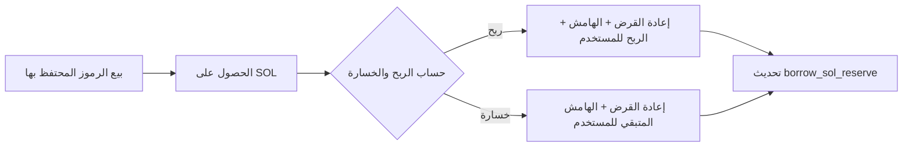
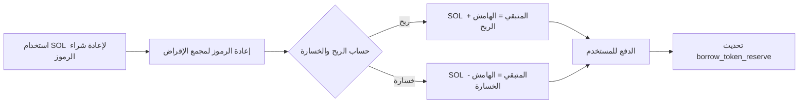
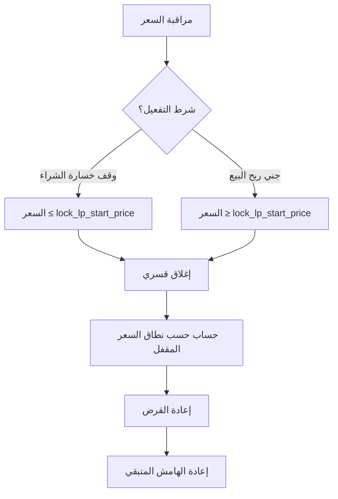
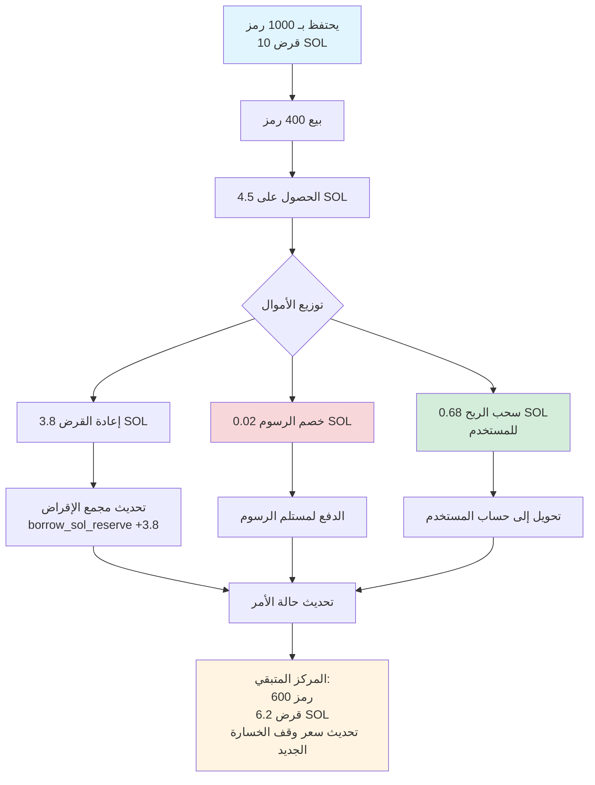
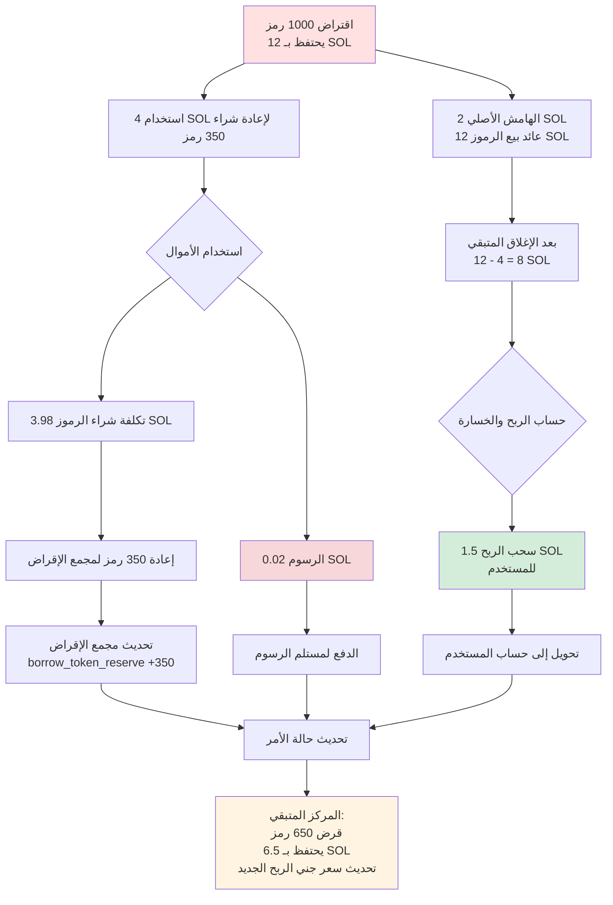

# 🏦 مقدمة عن وظيفة مجمع الإقراض

## أولاً، 📋 نظرة عامة

مجمع الإقراض في PinPet هو وحدة أساسية تدعم التداول بالرافعة المالية، ويوفر للمستخدمين خدمات إقراض SOL والرموز لتحقيق وظائف الشراء (Long) والبيع (Short). يعتمد مجمع الإقراض على آلية **مجمع احتياطي افتراضي**، مستقل عن مجمع السيولة في التداول الفوري، مما يضمن أن التداول بالرافعة المالية لا يؤثر على التشغيل الطبيعي لسوق التداول الفوري.

## ثانياً، 🎭 الدور المزدوج لمجمع الإقراض

### 2.1 💰 كمجمع تمويل
- **مجمع إقراض SOL**: يوفر قروض SOL للمتداولين الذين يفتحون مراكز شراء
- **مجمع إقراض الرموز**: يوفر قروض الرموز للمتداولين الذين يفتحون مراكز بيع

### 2.2 📦 إدارة الاحتياطي
يحافظ مجمع الإقراض على احتياطيين افتراضيين مستقلين:

| نوع الاحتياطي | الوصف | الغرض |
|---------|------|------|
| `borrow_sol_reserve` | احتياطي SOL الافتراضي | للمتداولين الذين يفتحون مراكز شراء |
| `borrow_token_reserve` | احتياطي الرموز الافتراضي | للمتداولين الذين يفتحون مراكز بيع |

هذه الاحتياطيات هي **دفاتر حسابات افتراضية**، والأموال الفعلية مخزنة في مجمع السيولة الفوري، ويتم تحقيق العزل من خلال آلية قفل نطاق السعر.

## ثالثاً، 🔄 عملية الإقراض في التداول بالرافعة المالية

### 3.1 📈 التداول بالشراء (Long) - اقتراض SOL لشراء الرموز

#### ⬆️ مرحلة فتح المركز


**العملية التفصيلية**:
1. **استثمار المستخدم**: دفع الهامش (مثال 0.5 SOL) 💵
2. **إقراض المجمع**: اقتراض SOL من `borrow_sol_reserve` (مثال 4.5 SOL) 💸
3. **تنفيذ الصفقة**: استخدام إجمالي 5 SOL لشراء الرموز على AMM ⚙️
4. **قفل نطاق السعر**: تسجيل نطاق السعر عند الشراء، يستخدم لحساب إغلاق المركز 🔒
5. **تسجيل الأمر**: إنشاء `MarginOrder`، تسجيل مبلغ القرض، الهامش، كمية الرموز المحتفظ بها 📝


#### ⬇️ مرحلة إغلاق المركز


**تسوية الأموال**:
- إجمالي SOL المحصل من بيع الرموز = `output_sol` 💰
- خصم رسوم التداول 💸
- إعادة القرض لمجمع الإقراض: `borrow_amount` يعود إلى `borrow_sol_reserve` ⬅️
- عائد المستخدم = الإجمالي - القرض - الهامش ✅

### 3.2 📉 التداول بالبيع (Short) - اقتراض الرموز وبيعها مقابل SOL

#### ⬆️ مرحلة فتح المركز


**العملية التفصيلية**:
1. **استثمار المستخدم**: دفع هامش SOL 💵
2. **إقراض المجمع**: اقتراض الرموز من `borrow_token_reserve` 💎
3. **تنفيذ الصفقة**: بيع الرموز للحصول على SOL، إيداعها في مجمع الأموال ⚙️
4. **قفل نطاق السعر**: تسجيل نطاق السعر عند البيع 🔒
5. **تسجيل الأمر**: إنشاء `MarginOrder`، تسجيل كمية الرموز المقترضة، الهامش، SOL المحتفظ به 📝


#### ⬇️ مرحلة إغلاق المركز


**تسوية الأموال**:
- إجمالي SOL المطلوب لإعادة شراء الرموز = `required_sol` + الرسوم 💰
- إعادة القرض لمجمع الإقراض: `borrow_amount` (رموز) يعود إلى `borrow_token_reserve` ⬅️
- عائد المستخدم = SOL المحصل من بيع الرموز عند فتح المركز - SOL المستخدم لشراء الرموز عند إغلاق المركز - الهامش ✅

## رابعاً، 💸 آلية السداد في مجمع الإقراض

### 4.1 ✅ سداد عند إغلاق المركز النشط
عندما يغلق المستخدم المركز بشكل نشط، ينفذ النظام السداد تلقائياً:

| نوع الصفقة | أصل السداد | مصدر السداد | الاحتياطي المعاد |
|---------|---------|---------|---------|
| إغلاق مركز شراء | SOL | من بيع الرموز | `borrow_sol_reserve` |
| إغلاق مركز بيع | رموز | من إعادة شراء الرموز | `borrow_token_reserve` |

**أولوية السداد**:
1. خصم رسوم التداول 💸
2. إعادة رأس المال المقترض ⬅️
3. إعادة الهامش 💰
4. توزيع الأرباح/معالجة الخسائر 📊

### 4.2 ⚠️ سداد عند التصفية القسرية
عندما يصل السعر إلى سعر وقف الخسارة/جني الربح، يقوم النظام بإغلاق المركز قسرياً تلقائياً:



**حماية التصفية** 🛡️:
- من خلال قفل نطاق السعر، يضمن أنه حتى إذا تقلب سعر السوق بشكل كبير، يمكن إغلاق المركز بالسعر المحدد مسبقاً
- تصميم الهامش يضمن أمان أموال مجمع الإقراض

### 4.3 ⏰ تصفية عند الانتهاء
بعد انتهاء صلاحية الأمر، يمكن لأي شخص تفعيل إغلاق المركز:

- أمر الشراء: وقت الانتهاء `end_time` = وقت فتح المركز + `borrow_duration` ⏱️
- أمر البيع: نفس الشيء
- بعد الانتهاء، يتم إغلاق المركز قسرياً بسعر السوق الحالي، وإعادة القرض ⚡

## خامساً، 🛡️ آلية أمان أموال مجمع الإقراض

### 5.1 💼 متطلبات الهامش
- **الهامش الأدنى**: `MIN_MARGIN_SOL_AMOUNT` (معامل النظام) 💰
- **نسبة الهامش**: تُحسب ديناميكياً بناءً على مضاعف الرافعة المالية ونطاق تقلب السعر 📊
- **استخدام الهامش**: لتغطية الخسائر في حالة تحرك السعر بشكل غير مواتٍ 🔒

### 5.2 🔐 قفل نطاق السعر
كل أمر يقفل سيولة نطاق سعر محدد:

```
قفل الشراء: [lock_lp_start_price, lock_lp_end_price] (نطاق انخفاض السعر)
قفل البيع: [lock_lp_start_price, lock_lp_end_price] (نطاق ارتفاع السعر)
```

هذا يضمن وجود سيولة كافية لإعادة القرض عند إغلاق المركز. ✅

### 5.3 ✔️ فحص الاحتياطي
قبل فتح المركز، يفحص النظام:

| عنصر الفحص | الشرط | رمز الخطأ |
|-------|------|-------|
| احتياطي SOL | `required_borrow_sol ≤ borrow_sol_reserve` | `InsufficientBorrowingReserve` |
| احتياطي الرموز | `required_borrow_token ≤ borrow_token_reserve` | `InsufficientBorrowingReserve` |


## سادساً، 💸 آلية الرسوم

### 6.1 📊 رسوم التداول بالرافعة المالية
- **معدل الرسوم**: `borrow_fee` (مثال 0.5% = 50 نقطة أساس) 💰
- **توقيت الرسوم**: تُحصل عند فتح وإغلاق المركز ⏰
- **توزيع الرسوم**:
  - الشريك: نسبة `fee_split` (مثال 80%) 🤝
  - مزود التقنية: 100% - `fee_split` (مثال 20%) ⚙️

### 6.2 ⚡ رسوم التصفية القسرية
- عند تفعيل التصفية، يتم تحصيل `borrow_fee` إضافي كرسوم تصفية 💸
- تُستخدم لتحفيز الأطراف الثالثة على تنفيذ التصفية عند الانتهاء 🎯

## سابعاً، 🎯 وظيفة الإغلاق الجزئي

يمكن للمستخدم إغلاق المركز جزئياً، لإدارة المخاطر بمرونة: ⚙️

### 7.1 📈 إغلاق جزئي لمركز الشراء



**تفاصيل تحديث الأمر**:

| الحقل | قبل الإغلاق | بعد الإغلاق | الوصف |
|-----|-------|-------|------|
| `position_asset_amount` | 1000 رمز | 600 رمز | المركز المتبقي |
| `borrow_amount` | 10 SOL | 6.2 SOL | القرض المتبقي |
| `lock_lp_start_price` | سعر وقف الخسارة الأصلي | سعر وقف الخسارة الجديد | يُعاد حسابه حسب المركز الجديد |
| `realized_sol_amount` | 0 SOL | 0.68 SOL | تراكم الأرباح المحققة |

### 7.2 📉 إغلاق جزئي لمركز البيع



**تفاصيل تحديث الأمر**:

| الحقل | قبل الإغلاق | بعد الإغلاق | الوصف |
|-----|-------|-------|------|
| `borrow_amount` | 1000 رمز | 650 رمز | القرض المتبقي (رموز) |
| `position_asset_amount` | 12 SOL | 6.5 SOL | SOL المحتفظ به المتبقي |
| `lock_lp_start_price` | سعر جني الربح الأصلي | سعر جني الربح الجديد | يُعاد حسابه حسب المركز الجديد |
| `realized_sol_amount` | 0 SOL | 1.5 SOL | تراكم الأرباح المحققة |

### 7.3 ⚠️ حد أدنى للمركز
بعد الإغلاق الجزئي، يجب أن يكون المركز المتبقي ≥ `MIN_TRADE_TOKEN_AMOUNT * 2`، لمنع إنشاء مراكز صغيرة جداً لا يمكن تصفيتها.

## ثامناً، 🔗 العلاقة بين مجمع الإقراض ومجمع السيولة

### 8.1 🔒 عزل الأموال
- **مجمع السيولة الفوري**: `lp_sol_reserve` + `lp_token_reserve`
- **مجمع الإقراض الافتراضي**: `borrow_sol_reserve` + `borrow_token_reserve`

على الرغم من أن الأموال الفعلية جميعها في نفس `pool_sol_account` و `pool_token_account`، يتم تحقيق العزل المنطقي من خلال آلية قفل نطاق السعر. 🛡️

### 8.2 🔄 مزامنة السعر
- التداول الفوري والتداول بالرافعة المالية يشتركان في نفس `price` (سعر السوق الحالي) 💹
- بعد تحديث السعر، يعيد النظام حساب احتياطي السيولة: `price_to_reserves(price)` ⚙️

### 8.3 🤝 تكامل السيولة
- نطاق السعر المقفل للتداول بالرافعة المالية لا يشارك في التداول الفوري 🔐
- التداول الفوري يمكن أن يؤدي إلى تفعيل التصفية القسرية لأوامر الرافعة المالية، مما يحرر السيولة ⚡

## تاسعاً، ✨ المزايا الرئيسية

| الميزة | الوصف | الفائدة |
|-----|------|------|
| احتياطي افتراضي | مجمع الإقراض هو سجل محاسبي، وليس مجمع أموال فعلي | كفاءة رأس المال عالية، لا حاجة لتمويل إضافي |
| قفل نطاق السعر | سعر الإغلاق يمكن التنبؤ به | يقلل من مخاطر التصفية، يحمي مجمع الإقراض |
| إقراض ثنائي الاتجاه | يدعم إقراض SOL والرموز في كلا الاتجاهين | وظائف الشراء والبيع كاملة |
| إغلاق جزئي | تعديل المراكز بمرونة | تجربة مستخدم جيدة، مخاطر قابلة للتحكم |
| تصفية عند الانتهاء | حد زمني + حافز للأطراف الثالثة | يضمن إعادة الأموال في الوقت المناسب |


