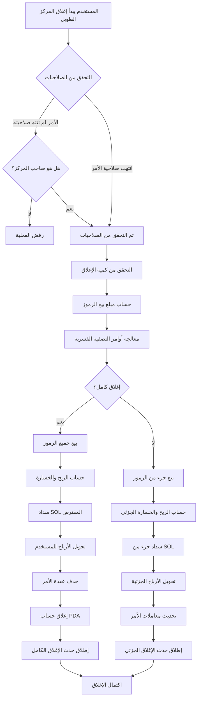
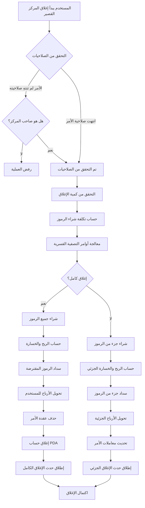

# 💼 مقدمة منتج وظيفة إغلاق المراكز بالرافعة المالية في PinPet

## 1. 📋 نظرة عامة على الوظيفة

### 🤔 ما هو إغلاق المركز؟

إغلاق المركز هو عملية يقوم فيها المستخدم بإغلاق مركز التداول بالرافعة المالية الذي يحتفظ به. في منصة PinPet، عندما يفتح المستخدم مركزًا، يتم إنشاء أمر ضمان يسجل علاقة الاقتراض ومعلومات المركز. تقوم عملية إغلاق المركز بتسوية هذا الأمر، وسداد القرض، وتسوية الأرباح والخسائر للمستخدم.

### 💡 لماذا نحتاج إلى إغلاق المركز؟

| سبب الإغلاق | الوصف |
|---------|------|
| **🎯 جني الأرباح/وقف الخسارة** | إغلاق المستخدم للمركز بشكل نشط لتأمين الأرباح أو الحد من الخسائر |
| **⏰ انتهاء صلاحية الأمر** | بعد انتهاء الصلاحية، يمكن لأي شخص تشغيل إغلاق المركز لإعادة موارد الاقتراض |
| **💰 إدارة رأس المال** | تحرير الضمان، وتعديل استراتيجية التداول بمرونة |
| **🛡️ التحكم في المخاطر** | تجنب خسائر أكبر بسبب تقلبات السوق |

### 📊 أنواع إغلاق المركز

- **🔚 إغلاق كامل**: إغلاق المركز بالكامل دفعة واحدة، وتسوية جميع الأرباح والخسائر
- **✂️ إغلاق جزئي**: إغلاق المركز على دفعات، وتحقيق أرباح جزئية، والاحتفاظ بالمركز المتبقي

## 2. 📈 وظيفة إغلاق المركز الطويل (Close Long)

### 📝 وصف الوظيفة

إغلاق المركز الطويل هو في الأساس عملية **بيع الرموز**. عندما فتح المستخدم مركزًا طويلاً سابقًا، اقترض SOL لشراء الرموز، وعند إغلاق المركز، يحتاج إلى بيع الرموز لاستبدالها بـ SOL لسداد القرض.

### 🔄 مخطط سير العمل



### ⚙️ شرح المعاملات الرئيسية

| اسم المعامل | الاستخدام | قيمة مثال |
|---------|---------|--------|
| `sell_token_amount` | كمية الرموز المراد بيعها (قيمة غير دقيقة، قد يكون هناك انحراف طفيف) | 1000000 (1 رمز) |
| `min_sol_output` | الحد الأدنى لكمية SOL المتوقع الحصول عليها بعد البيع (حماية الانزلاق) | 50000000 (0.05 SOL) |
| `prev_order_id` | موضع فهرس الأمر السابق في القائمة المرتبطة | 2 |
| `close_order_id` | فهرس الأمر المراد إغلاقه في مصفوفة الأوامر | 5 |
| `next_order_id` | موضع فهرس الأمر التالي في القائمة المرتبطة | 7 |
| `close_order_address` | عنوان أمر الإغلاق (للتحقق الأمني) | "Abc123..." |

### 🧮 شرح حساب الربح والخسارة

#### 🔚 سيناريو الإغلاق الكامل

**صيغة الحساب**:

```
ربح SOL = (SOL المحصل من البيع) + (SOL الضمان) - (SOL المقترض)
```

**خطوات الحساب**:
1. بيع جميع الرموز المحتفظ بها، والحصول على SOL (بعد خصم الرسوم)
2. إضافة الضمان المدفوع عند فتح المركز
3. طرح SOL المقترض عند فتح المركز
4. الرقم الموجب هو ربح، والرقم السالب هو خسارة

#### ✂️ سيناريو الإغلاق الجزئي

**صيغة الحساب**:

```
الربح الحالي = (SOL من البيع الحالي) + (إجمالي الضمان) + (SOL من البيع المستقبلي للرموز المتبقية) - (إجمالي قرض SOL)
```

**خطوات الحساب**:
1. حساب SOL المحصل من بيع الرموز في هذه المرة
2. حساب SOL الذي يمكن الحصول عليه من بيع الرموز المتبقية بسعر وقف الخسارة الجديد (بعد خصم الرسوم)
3. إجمالي الأصول = المحصل الحالي + الضمان + المحصل المتبقي
4. طرح إجمالي القرض، للحصول على الربح الجزئي
5. سداد جزء من القرض، ويستمر الضمان المتبقي في المركز

### 💹 مقارنة سيناريوهات الربح والخسارة

| السيناريو | سعر الفتح | سعر الإغلاق | رموز المركز | SOL المقترض | الضمان | SOL من البيع | نتيجة الربح/الخسارة |
|------|---------|---------|---------|---------|--------|-------------|---------|
| **🟢 سيناريو الربح** | 0.05 SOL | 0.08 SOL | 100 رمز | 5 SOL | 0.5 SOL | 8 SOL | +2.5 SOL |
| **🔴 سيناريو الخسارة** | 0.05 SOL | 0.03 SOL | 100 رمز | 5 SOL | 0.5 SOL | 3 SOL | -1.5 SOL |
| **⚖️ سيناريو التعادل** | 0.05 SOL | 0.055 SOL | 100 رمز | 5 SOL | 0.5 SOL | 5.5 SOL | 0 SOL |

## 3. 📉 وظيفة إغلاق المركز القصير (Close Short)

### 📝 وصف الوظيفة

إغلاق المركز القصير هو في الأساس عملية **شراء الرموز**. عندما فتح المستخدم مركزًا قصيرًا سابقًا، اقترض الرموز وباعها للحصول على SOL، وعند إغلاق المركز، يحتاج إلى استخدام SOL لشراء الرموز مرة أخرى لسداد القرض.

### 🔄 مخطط سير العمل



### ⚙️ شرح المعاملات الرئيسية

| اسم المعامل | الاستخدام | قيمة مثال |
|---------|---------|--------|
| `buy_token_amount` | كمية الرموز المراد شراؤها | 1000000 (1 رمز) |
| `max_sol_amount` | الحد الأقصى لكمية SOL المستعد لدفعها (حماية الانزلاق) | 60000000 (0.06 SOL) |
| `prev_order_id` | موضع فهرس الأمر السابق في القائمة المرتبطة | 1 |
| `close_order_id` | فهرس الأمر المراد إغلاقه في مصفوفة الأوامر | 3 |
| `next_order_id` | موضع فهرس الأمر التالي في القائمة المرتبطة | 6 |
| `close_order_address` | عنوان أمر الإغلاق (للتحقق الأمني) | "Def456..." |

### 🧮 شرح حساب الربح والخسارة

#### 🔚 سيناريو الإغلاق الكامل

**صيغة الحساب**:

```
ربح SOL = (SOL من بيع الرموز عند الفتح بما في ذلك الرسوم) - (SOL المنفق لإعادة شراء الرموز عند الإغلاق) - (الرسوم)
```

**خطوات الحساب**:
1. استخدام SOL لإعادة شراء جميع الرموز المقترضة
2. إعادة الرموز المقترضة إلى مجمع الإقراض
3. الحساب: محصول البيع عند الفتح - تكلفة الشراء عند الإغلاق - الرسوم
4. الرقم الموجب هو ربح، والرقم السالب هو خسارة

#### ✂️ سيناريو الإغلاق الجزئي

**صيغة الحساب**:

```
الربح الحالي = (نطاق إعادة الشراء الحالي بما في ذلك الرسوم) - (SOL الفعلي المنفق في إعادة الشراء) - (رسوم إعادة الشراء)
```

**خطوات الحساب**:
1. حساب تكلفة إعادة شراء جزء من الرموز في هذه المرة (بما في ذلك الرسوم)
2. حساب تكلفة إعادة شراء الرموز المتبقية في المستقبل (بما في ذلك الرسوم)
3. الربح الحالي = الواجب دفعه هذه المرة - الفعلي المنفق
4. سداد جزء من الرموز، وتحديث معاملات الأمر
5. يستمر الضمان المتبقي في المركز

### 💹 مقارنة سيناريوهات الربح والخسارة

| السيناريو | سعر الفتح | سعر الإغلاق | الرموز المقترضة | SOL من البيع | الضمان | تكلفة الشراء SOL | نتيجة الربح/الخسارة |
|------|---------|---------|---------|-------------|--------|-------------|---------|
| **🟢 سيناريو الربح** | 0.08 SOL | 0.05 SOL | 100 رمز | 8 SOL | 0.5 SOL | 5 SOL | +2.5 SOL |
| **🔴 سيناريو الخسارة** | 0.05 SOL | 0.08 SOL | 100 رمز | 5 SOL | 0.5 SOL | 8 SOL | -2.5 SOL |
| **⚖️ سيناريو التعادل** | 0.06 SOL | 0.06 SOL | 100 رمز | 6 SOL | 0.5 SOL | 6 SOL | -0.06 SOL (رسوم) |

## 4. ⏰ توقيت واستراتيجية إغلاق المركز

### 🎯 توقيت الإغلاق النشط

| نوع التوقيت | السيناريو المناسب | الاستراتيجية المقترحة |
|---------|---------|---------|
| **📈 إغلاق جني الأرباح** | السعر يصل إلى الهدف المتوقع | إغلاق جزئي لتأمين الأرباح، والاحتفاظ بالمركز المتبقي |
| **🛑 إغلاق وقف الخسارة** | السعر ينخفض عن مستوى وقف الخسارة | إغلاق كامل في الوقت المناسب، والسيطرة على الخسائر |
| **🔧 تعديل المركز** | تغير اتجاه السوق | تقليل أو زيادة المركز، وتحسين هيكل المركز |
| **⏳ إغلاق قبل انتهاء الصلاحية** | الاقتراب من وقت انتهاء صلاحية الأمر | إغلاق نشط لتجنب التصفية القسرية |

### ⚡ الإغلاق السلبي (التصفية القسرية)

**شروط التنفيذ**:
- ⏰ انتهى وقت انتهاء صلاحية الأمر
- 👥 يمكن لأي مستخدم تشغيل التصفية
- 💵 يمكن للمصفي الحصول على مكافأة رسوم معينة

**⚠️ تحذير من المخاطر**:
- 📉 قد يتم إغلاق المركز قسريًا بسعر غير مواتٍ بعد انتهاء الصلاحية
- 💡 يُنصح بإدارة المركز بشكل نشط قبل انتهاء الصلاحية

## 5. 📖 أمثلة على حالات الاستخدام

### 🟢 السيناريو الأول: إغلاق مركز طويل مربح

**الخلفية**:
- فتح المستخدم مركزًا طويلاً بسعر 0.05 SOL، وشراء 100 رمز
- اقترض 4.5 SOL، ودفع 0.5 SOL كضمان
- السعر الحالي ارتفع إلى 0.08 SOL

**العملية**:
1. قرر المستخدم إغلاق المركز بالكامل لتأمين الأرباح
2. بيع 100 رمز، والحصول على حوالي 8 SOL (بعد خصم الرسوم)
3. سداد قرض 4.5 SOL
4. استعادة ضمان 0.5 SOL
5. صافي الربح: 8 - 4.5 + 0.5 (الضمان تم حسابه عند فتح المركز) = حوالي 3 SOL

**✅ النتيجة**: تحقيق معدل عائد بنسبة 60% بنجاح

### 🔴 السيناريو الثاني: إغلاق مركز قصير بوقف خسارة

**الخلفية**:
- فتح المستخدم مركزًا قصيرًا بسعر 0.05 SOL، واقترض وباع 100 رمز، والحصول على 5 SOL
- دفع 0.5 SOL كضمان
- ارتفع السعر إلى 0.08 SOL، وتم الوصول إلى سعر وقف الخسارة

**العملية**:
1. وقف الخسارة الطارئ وإغلاق المركز
2. استخدام 8 SOL لإعادة شراء 100 رمز (بما في ذلك الرسوم)
3. إعادة 100 رمز إلى مجمع الإقراض
4. ضمان 0.5 SOL + محصول الفتح 5 SOL = 5.5 SOL من الأموال المتاحة
5. صافي الخسارة: 5.5 - 8 = -2.5 SOL

**✅ النتيجة**: وقف الخسارة في الوقت المناسب، وتجنب خسائر أكبر

### ✂️ السيناريو الثالث: إغلاق جزئي لتعديل المركز

**الخلفية**:
- يحتفظ المستخدم بمركز طويل بـ 200 رمز
- ارتفع السعر بنسبة 30%
- يريد المستخدم تأمين جزء من الأرباح، لكنه يواصل الاحتفاظ بالمركز متفائلاً بالسوق

**العملية**:
1. إغلاق جزئي لـ 100 رمز
2. سداد جزء من قرض SOL
3. الحصول على أرباح جزئية محولة إلى الحساب
4. الاحتفاظ بالـ 100 رمز المتبقية
5. تحديث معاملات الأمر، وتعديل مستوى وقف الخسارة

**✅ النتيجة**: تحقيق استراتيجية مرنة لإدارة المركز

## 6. ⚠️ ملاحظات وقيود

### 🚫 قيود العمليات

| نوع القيد | المتطلبات المحددة | الشرح |
|---------|---------|------|
| **🔐 التحقق من الصلاحيات** | عندما لا ينتهي الأمر، يمكن فقط لفاتح المركز إغلاقه | حماية أمان أصول المستخدم |
| **💳 عنوان التسوية** | يجب أن يكون عنوان محفظة فاتح المركز | يمكن للأموال فقط العودة إلى العنوان الأصلي |
| **📏 الحد الأدنى لحجم التداول** | عند الإغلاق الجزئي لا يقل عن ضعفي الحد الأدنى لحجم التداول | تجنب أوامر الغبار |
| **📊 الكمية المتبقية** | بعد الإغلاق الجزئي لا تقل عن الحد الأدنى لحجم التداول | ضمان صلاحية الأمر |

### ⚠️ تحذير من المخاطر

#### 📉 مخاطر الانزلاق
- قد يختلف سعر التنفيذ الفعلي عند الإغلاق عن المتوقع
- يُنصح بتعيين معاملات حماية الانزلاق المناسبة
- يكون تأثير الانزلاق أكثر وضوحًا عند إغلاق مراكز كبيرة

#### 💸 تكاليف الرسوم
- كل إغلاق يتطلب دفع رسوم المعاملات
- الإغلاق المتكرر يزيد من التكاليف
- الإغلاق الجزئي يتطلب رسومًا مرتين (الحالية + الإغلاق الكامل المستقبلي)

#### ⏰ مخاطر الوقت
- بعد انتهاء الصلاحية يمكن لأي شخص تشغيل الإغلاق
- قد يتم التصفية بسعر غير مواتٍ
- يُنصح بإدارة الأوامر القريبة من انتهاء الصلاحية مسبقًا

#### 🌊 مخاطر السوق
- قد تؤدي تقلبات الأسعار السريعة إلى توقيت سيئ للإغلاق
- في الظروف القاسية قد يحدث تصفية
- يُنصح بتعيين مستوى وقف خسارة معقول

### 💡 توصيات أفضل الممارسات

1. **🛡️ تعيين وقف خسارة معقول**: خطط لمستوى وقف الخسارة عند فتح المركز، ونفذه بصرامة
2. **✂️ إغلاق على دفعات**: يُنصح بإغلاق المراكز الكبيرة على دفعات، لتقليل تأثير السوق
3. **⏰ الانتباه لوقت انتهاء الصلاحية**: إدارة الأوامر القريبة من انتهاء الصلاحية بشكل نشط قبل 1-2 يوم
4. **💰 التحكم في الرسوم**: تجنب عمليات الإغلاق الجزئي المتكررة جدًا
5. **📊 مراقبة عمق السوق**: التحقق من سيولة السوق قبل إغلاق مراكز كبيرة

### 🔒 ضمانات الأمان التقنية

- **✅ التحقق من العنوان**: التحقق من عنوان الأمر عند الإغلاق، لمنع تشغيل الأمر الخاطئ
- **🔐 فحص الصلاحيات**: التحقق من الصلاحيات متعدد المستويات، لضمان أن المستخدمين المصرح لهم فقط يمكنهم العمل
- **🛡️ حماية الفيضان**: جميع حسابات القيم الرقمية تستخدم طريقة checked الآمنة
- **⚛️ العمليات الذرية**: جميع الخطوات في عملية الإغلاق يتم تنفيذها بشكل ذري، لمنع عدم تناسق الحالة

---

## 📚 الملحق: شرح المصطلحات

| المصطلح | الشرح |
|------|------|
| **PDA** | Program Derived Address، عنوان مشتق من البرنامج، يستخدم لتخزين بيانات الأمر |
| **الضمان** | SOL المدفوع من المستخدم عند فتح المركز، كضمان للمخاطر |
| **مجمع الإقراض** | المجمع الافتراضي الذي يوفر أموال الرافعة المالية |
| **سعر وقف الخسارة** | عتبة السعر التي يتم فيها إغلاق الأمر قسريًا |
| **خصم الرسوم** | خصم الرسوم الذي يتم التمتع به بعد استيفاء الشروط |
| **التصفية القسرية** | آلية الإغلاق التلقائي للأمر بعد انتهاء الصلاحية |
| **عقدة القائمة المرتبطة** | موضع الأمر في القائمة المرتبطة، يستخدم لإدارة عدة أوامر بكفاءة |

---

*هذا المستند هو مقدمة لوظائف المنتج، ولا يتضمن تفاصيل التنفيذ التقنية. للحصول على معلومات حول التنفيذ التقني، يرجى الرجوع إلى كود المشروع والوثائق التقنية.*
