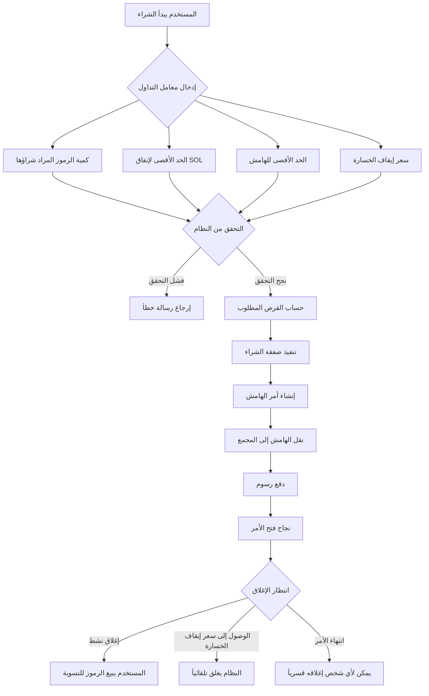
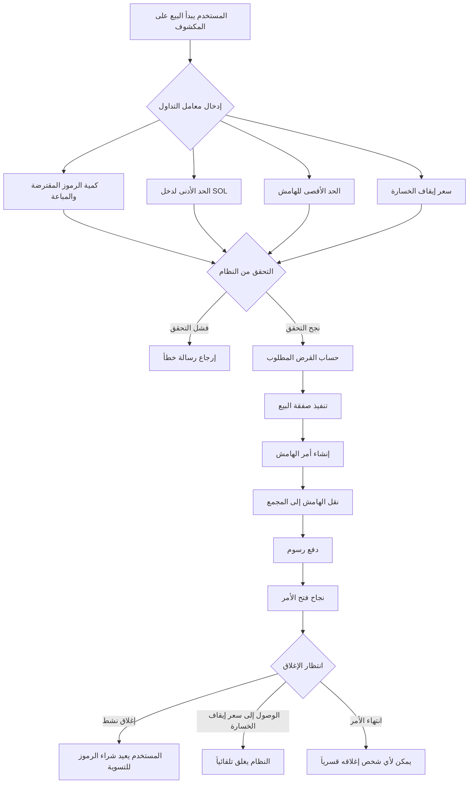
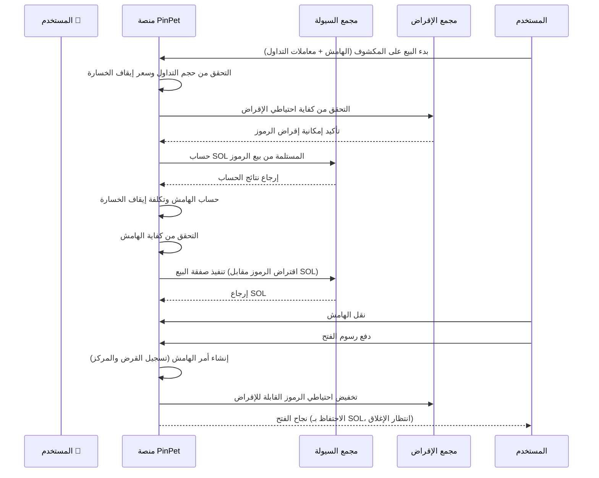
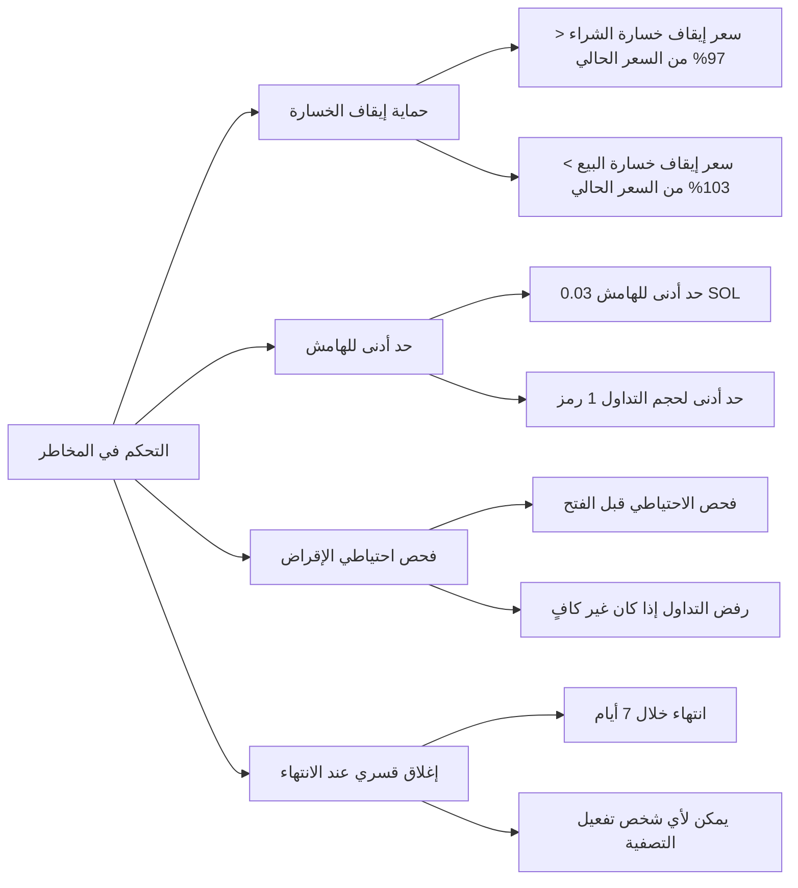

# 📊 مقدمة منتج فتح مراكز الرافعة المالية في PinPet

## 1. نظرة عامة على الوظيفة 🎯

### ما هي تداول الرافعة المالية 💹

تداول الرافعة المالية هو أداة مالية تستخدم الأموال المقترضة لتضخيم حجم التداول، مما يسمح للمستخدمين بالتحكم في أصول ذات قيمة أكبر باستخدام هامش أقل. توفر منصة PinPet نوعين من تداول الرافعة المالية: الشراء (Long) والبيع على المكشوف (Short)، مما يتيح للمستخدمين تحقيق الأرباح سواء ارتفع سعر الرمز أو انخفض.

### المفاهيم الأساسية 💡

- **الهامش (Margin)** 💰: أموال SOL التي يستثمرها المستخدم بنفسه كضمان للتداول
- **الاقتراض (Borrow)** 💵: الأصول المقترضة من المنصة (اقتراض SOL للشراء، اقتراض الرموز للبيع على المكشوف)
- **سعر إيقاف الخسارة (Stop Loss Price)** 🛡️: عندما يصل السعر إلى هذا المستوى، يقوم النظام تلقائياً بإغلاق المركز للتحكم في المخاطر
- **إغلاق المركز (Close Position)** 🔄: عملية إعادة القرض وتسوية الأرباح والخسائر

### أنواع الرافعة المالية 📈📉

| نوع التداول | توقعات السوق | الأصول المقترضة | الأصول المحتفظ بها | شرط الربح |
|---------|---------|---------|---------|---------|
| الشراء (Long) 🟢 | صعودي ⬆️ | اقتراض SOL | الاحتفاظ بالرموز | ارتفاع سعر الرمز |
| البيع على المكشوف (Short) 🔴 | هبوطي ⬇️ | اقتراض الرموز | الاحتفاظ بـ SOL | انخفاض سعر الرمز |

---

## 2. تداول الشراء (Long)🟢📈

### شرح الوظيفة ✨

الشراء يعني أن المستخدم متفائل بارتفاع سعر الرمز في المستقبل، من خلال اقتراض SOL من المنصة لشراء المزيد من الرموز، ثم بيعها بعد ارتفاع السعر لسداد القرض وتحقيق الربح.

### تدفق عمليات المستخدم 🔄



### مخطط تدفق تداول الشراء 📋


### شرح المعاملات الرئيسية 📝

| اسم المعامل | الشرح | قيمة مثال | الشروط |
|---------|------|--------|---------|
| buy_token_amount | كمية الرموز المراد شراؤها | 1,000,000 (1 رمز) | لا تقل عن الحد الأدنى للتداول (1 رمز) |
| max_sol_amount | الحد الأقصى لكمية SOL المراد دفعها | 100,000,000 (0.1 SOL) | قد يكون الفعلي أقل (حماية الانزلاق) |
| margin_sol_max | الحد الأقصى للهامش الذي يرغب المستخدم في استثماره | 50,000,000 (0.05 SOL) | لا يقل عن 0.03 SOL |
| close_price | سعر إيقاف الخسارة (سعر تشغيل الإغلاق التلقائي) | 95% من السعر الحالي | يجب أن يكون أقل من 97% من السعر الحالي |
| borrow_amount | مبلغ القرض الفعلي المحسوب من النظام | 50,000,000 (0.05 SOL) | لا يتجاوز احتياطي مجمع الإقراض |
| position_asset_amount | كمية الرموز في المركز | 1,000,000 (1 رمز) | تساوي كمية الرموز المشتراة |

### منطق حساب الهامش 🧮

الهدف من الهامش هو ضمان قدرة المستخدم على سداد القرض عند إغلاق المركز بإيقاف الخسارة. صيغة الحساب كما يلي:

```
الهامش الفعلي = إجمالي تكلفة الشراء - العائد عند الإغلاق بسعر إيقاف الخسارة (بعد خصم الرسوم)
```

**مثال توضيحي:**

افترض أن السعر الحالي للرمز هو 0.1 SOL/Token:

1. يريد المستخدم شراء 1 رمز، يحتاج حوالي 0.1 SOL
2. يستثمر المستخدم هامش 0.05 SOL، ويقترض 0.05 SOL
3. تعيين سعر إيقاف الخسارة عند 0.095 SOL/Token (95% من السعر الحالي)
4. حساب النظام: إذا تم بيع 1 رمز بسعر 0.095، بعد خصم الرسوم ستحصل على حوالي 0.0945 SOL
5. حساب الهامش: 0.1 - 0.0945 = 0.0055 SOL (الهامش المطلوب فعلياً)
6. 0.05 SOL المقدمة من المستخدم أكبر من 0.0055 SOL، يتم تلبية شروط الفتح

### تحذيرات المخاطر ⚠️

- **تفعيل إيقاف الخسارة** 🛑: عندما ينخفض سعر الرمز إلى سعر إيقاف الخسارة، يبيع النظام تلقائياً الرموز لسداد القرض، وسيفقد المستخدم الهامش
- **انتهاء الأمر** ⏰: إذا لم يتم إغلاق المركز خلال فترة الإقراض (الافتراضي 7 أيام)، يمكن لأي شخص إغلاقه قسرياً، وقد يتم تصفيته بسعر غير مواتٍ
- **تكلفة الاقتراض** 💸: الفتح والإغلاق يتطلبان دفع رسوم (الافتراضي 0.25%)

---

## 3. تداول البيع على المكشوف (Short)🔴📉

### شرح الوظيفة ✨

البيع على المكشوف يعني أن المستخدم يتوقع انخفاض سعر الرمز في المستقبل، من خلال اقتراض الرموز من المنصة وبيعها فوراً للحصول على SOL، ثم إعادة شراء الرموز بعد انخفاض السعر لسداد القرض وتحقيق الربح.

### تدفق عمليات المستخدم 🔄



### مخطط تدفق تداول البيع على المكشوف 📋



### شرح المعاملات الرئيسية 📝

| اسم المعامل | الشرح | قيمة مثال | الشروط |
|---------|------|--------|---------|
| borrow_sell_token_amount | كمية الرموز المراد اقتراضها وبيعها | 1,000,000 (1 رمز) | لا تقل عن الحد الأدنى للتداول (1 رمز) |
| min_sol_output | الحد الأدنى المتوقع من SOL بعد البيع | 90,000,000 (0.09 SOL) | قد يكون الفعلي أكثر (حماية الانزلاق) |
| margin_sol_max | الحد الأقصى للهامش الذي يرغب المستخدم في استثماره | 50,000,000 (0.05 SOL) | لا يقل عن 0.03 SOL |
| close_price | سعر إيقاف الخسارة (سعر تشغيل الإغلاق التلقائي) | 105% من السعر الحالي | يجب أن يكون أعلى من 103% من السعر الحالي |
| borrow_amount | مبلغ القرض الفعلي المحسوب من النظام | 1,000,000 (1 رمز) | لا يتجاوز احتياطي مجمع الإقراض |
| position_asset_amount | كمية SOL في المركز | 95,000,000 (0.095 SOL) | تساوي SOL المستلمة بعد البيع (بعد خصم الرسوم) |

### منطق حساب الهامش 🧮

هامش البيع على المكشوف يستخدم لضمان قدرة المستخدم على إعادة شراء الرموز لسداد القرض عند إغلاق المركز بإيقاف الخسارة. صيغة الحساب كما يلي:

```
الهامش الفعلي = تكلفة إعادة الشراء عند الإغلاق بسعر إيقاف الخسارة (مع الرسوم) - العائد من البيع (بعد خصم الرسوم)
```

**مثال توضيحي:**

افترض أن السعر الحالي للرمز هو 0.1 SOL/Token:

1. يقترض المستخدم 1 رمز ويبيعه، بعد خصم الرسوم يحصل على حوالي 0.0975 SOL
2. تعيين سعر إيقاف الخسارة عند 0.105 SOL/Token (105% من السعر الحالي)
3. حساب النظام: إذا تم إعادة شراء 1 رمز بسعر 0.105، مع الرسوم سيحتاج حوالي 0.1053 SOL
4. حساب الهامش: 0.1053 - 0.0975 = 0.0078 SOL (الهامش المطلوب فعلياً)
5. يحتاج المستخدم إلى استثمار 0.0078 SOL على الأقل كهامش
6. المستخدم يقدم 0.05 SOL كهامش، أكبر من 0.0078 SOL، يتم تلبية شروط الفتح

### تحذيرات المخاطر ⚠️

- **تفعيل إيقاف الخسارة** 🛑: عندما يرتفع سعر الرمز إلى سعر إيقاف الخسارة، يشتري النظام تلقائياً الرموز لسداد القرض، وسيفقد المستخدم الهامش
- **مخاطر غير محدودة** ⛔: نظرياً يمكن أن يرتفع سعر الرمز بشكل غير محدود، مخاطر البيع على المكشوف أكبر من الشراء
- **انتهاء الأمر** ⏰: إذا لم يتم إغلاق المركز خلال فترة الإقراض (الافتراضي 7 أيام)، يمكن لأي شخص إغلاقه قسرياً
- **تكلفة الاقتراض** 💸: الفتح والإغلاق يتطلبان دفع رسوم (الافتراضي 0.25%)

---

## 4. مخاطر وعوائد تداول الرافعة المالية 📊💰

### تأثير تضخيم العوائد 📈💎

الميزة الأساسية لتداول الرافعة المالية هي التحكم في نطاق أكبر من الأصول برأس مال أقل، وبالتالي تضخيم العوائد.

**مثال عائد الشراء:**

افترض أن المستخدم يستثمر 0.05 SOL كهامش للشراء 1 رمز:

| السيناريو | سعر الفتح | سعر الإغلاق | قيمة المركز | مبلغ السداد | صافي العائد | نسبة العائد |
|------|--------|--------|----------|----------|--------|--------|
| ارتفاع صغير | 0.1 | 0.11 | 0.11 SOL | 0.05 SOL | 0.06 SOL | +120% |
| ارتفاع كبير | 0.1 | 0.15 | 0.15 SOL | 0.05 SOL | 0.10 SOL | +200% |
| انخفاض صغير | 0.1 | 0.095 | 0.095 SOL | 0.05 SOL | 0.045 SOL | -10% |
| تفعيل إيقاف الخسارة | 0.1 | 0.095 | 0.095 SOL | 0.05 SOL | 0.045 SOL | -10% |

**مثال عائد البيع على المكشوف:**

افترض أن المستخدم يستثمر 0.05 SOL كهامش للبيع على المكشوف 1 رمز:

| السيناريو | سعر الفتح | سعر الإغلاق | قيمة المركز | تكلفة إعادة الشراء | صافي العائد | نسبة العائد |
|------|--------|--------|----------|----------|--------|--------|
| انخفاض صغير | 0.1 | 0.09 | 0.0975 SOL | 0.09 SOL | 0.0075 SOL | +15% |
| انخفاض كبير | 0.1 | 0.05 | 0.0975 SOL | 0.05 SOL | 0.0475 SOL | +95% |
| ارتفاع صغير | 0.1 | 0.105 | 0.0975 SOL | 0.105 SOL | -0.0075 SOL | -15% |
| تفعيل إيقاف الخسارة | 0.1 | 0.105 | 0.0975 SOL | 0.1053 SOL | -0.0078 SOL | -16% |

### عوامل المخاطر ⚠️

#### 1. مخاطر تقلب الأسعار 📉📈

- **مخاطر الشراء** 🟢: انخفاض سعر الرمز أكثر من سعر إيقاف الخسارة، فقدان كامل الهامش
- **مخاطر البيع على المكشوف** 🔴: ارتفاع سعر الرمز أكثر من سعر إيقاف الخسارة، فقدان كامل الهامش
- **التقلبات الحادة** ⚡: التقلبات الكبيرة في السعر خلال فترة قصيرة قد تؤدي إلى إيقاف خسارة سريع

#### 2. مخاطر السيولة 💧

- **نضوب مجمع الإقراض** 📛: إذا كان احتياطي مجمع الإقراض غير كافٍ، لا يمكن فتح المركز
- **خسارة الانزلاق** 📊: حجم التداول الكبير قد يؤدي إلى انحراف السعر الفعلي عن المتوقع

#### 3. مخاطر الوقت ⏰

- **انتهاء الأمر** 🔔: إذا لم يتم إغلاق المركز خلال 7 أيام، يمكن لأي شخص إغلاقه قسرياً، وقد يتم تصفيته بسعر غير مواتٍ
- **تكلفة الاحتفاظ** 💸: الاحتفاظ بالمركز طويل الأمد يتطلب تحمل تكاليف الوقت وعدم اليقين في السوق

#### 4. المخاطر النظامية 🔧

- **حساب السعر** 🧮: بناءً على خوارزمية المنتج الثابت، الصفقات الكبيرة قد تواجه انزلاقاً كبيراً
- **تراكم الرسوم** 💰: الرسوم المتراكمة من فتح وإغلاق المراكز المتعددة ستؤثر على الأرباح

### تدابير التحكم في المخاطر 🛡️

توفر منصة PinPet آليات متعددة للتحكم في المخاطر:



---

## 5. أمثلة على حالات الاستخدام 💼

### السيناريو الأول: الشراء في سوق صاعد 🟢⬆️

**الخلفية** 📖: شياو مينغ يرى أن رمز Meme معين لديه اتجاه صعودي، السعر الحالي 0.1 SOL

**خطوات العملية** 🎯:
1. شياو مينغ يستثمر 0.1 SOL كهامش
2. يقترض 0.1 SOL (المنصة تقرض لشياو مينغ)
3. يستخدم مجموع 0.2 SOL لشراء 2 رمز
4. تعيين سعر إيقاف الخسارة عند 0.095 SOL (إيقاف تلقائي إذا انخفض تحته)

**حالة الربح** 💰📈: ارتفع الرمز إلى 0.15 SOL
- بيع 2 رمز للحصول على 0.3 SOL (بعد خصم الرسوم حوالي 0.2985 SOL)
- سداد القرض 0.1 SOL، يتبقى 0.1985 SOL
- خصم الهامش 0.1 SOL، صافي الربح 0.0985 SOL (حوالي +98.5%)

**حالة إيقاف الخسارة** 🛑📉: انخفض الرمز إلى 0.095 SOL (تفعيل إيقاف الخسارة)
- بيع تلقائي لـ 2 رمز للحصول على 0.19 SOL (بعد خصم الرسوم حوالي 0.1895 SOL)
- سداد القرض 0.1 SOL، يتبقى 0.0895 SOL
- خسارة الهامش 0.1 - 0.0895 = 0.0105 SOL (حوالي -10.5%)

### السيناريو الثاني: البيع على المكشوف في سوق هابط 🔴⬇️

**الخلفية** 📖: شياو هونغ تعتقد أن سعر رمز معين مرتفع جداً، السعر الحالي 0.2 SOL، تستعد للبيع على المكشوف

**خطوات العملية** 🎯:
1. شياو هونغ تستثمر 0.15 SOL كهامش
2. تقترض 1 رمز (المنصة تقرض لشياو هونغ)
3. تبيع فوراً 1 رمز للحصول على 0.2 SOL (بعد خصم الرسوم حوالي 0.195 SOL)
4. تعيين سعر إيقاف الخسارة عند 0.21 SOL (إيقاف تلقائي إذا ارتفع فوقه)

**حالة الربح** 💰📉: انخفض الرمز إلى 0.15 SOL
- استخدام 0.15 SOL لإعادة شراء 1 رمز (مع الرسوم حوالي 0.1504 SOL)
- سداد القرض 1 رمز
- يتبقى 0.195 - 0.1504 = 0.0446 SOL
- إضافة الهامش 0.15 SOL، المجموع 0.1946 SOL (صافي الربح 0.0446 SOL، حوالي +29.7%)

**حالة إيقاف الخسارة** 🛑📈: ارتفع الرمز إلى 0.21 SOL (تفعيل إيقاف الخسارة)
- إعادة شراء تلقائية لـ 1 رمز بـ 0.21 SOL (مع الرسوم حوالي 0.2105 SOL)
- سداد القرض 1 رمز
- إنفاق 0.2105 SOL، لكن البيع حصل فقط على 0.195 SOL
- خسارة 0.0155 SOL، خصم من الهامش (حوالي -10.3%)

### السيناريو الثالث: التداول في نطاق 🔄📊

**الخلفية** 📖: شياو قانغ ماهر في التداول قصير الأمد، يقوم بعمليات متكررة عندما يتقلب سعر الرمز في نطاق 0.08 - 0.12 SOL

**الاستراتيجية** 🎯:
- الشراء عندما يقترب السعر من 0.08 SOL، تعيين إيقاف الخسارة عند 0.075 SOL
- البيع على المكشوف عندما يقترب السعر من 0.12 SOL، تعيين إيقاف الخسارة عند 0.125 SOL
- الإغلاق النشط عند تحقيق ربح 5-10% في كل مرة

**الميزة** ✅: استخدام الرافعة المالية لتضخيم عوائد تقلبات النطاق

**المخاطر** ⚠️: قد يحدث إيقاف خسارة عند كسر النطاق، يحتاج إلى تنفيذ صارم للانضباط

---

## 6. ملاحظات وقيود 📌

### قيود التداول 🔒

| بند القيد | القيمة | الشرح |
|---------|------|------|
| الحد الأدنى لكمية الرموز المتداولة | 1 Token (1,000,000 وحدة أصغر) | منع حجم التداول الصغير جداً |
| الحد الأدنى للهامش | 0.03 SOL (30,000,000 lamports) | ضمان حجم تداول ذي معنى |
| سعر إيقاف خسارة الشراء | أقل من 97% من السعر الحالي | مساحة إيقاف خسارة لا تقل عن 3% |
| سعر إيقاف خسارة البيع | أعلى من 103% من السعر الحالي | مساحة إيقاف خسارة لا تقل عن 3% |
| الحد الأقصى لفترة الإقراض | 7 أيام (604,800 ثانية) | يمكن إغلاقه قسرياً بعد الانتهاء |
| الحد الأقصى لمجمع الإقراض | تعديل ديناميكي بناءً على حجم مجمع السيولة | رفض التداول عند عدم كفاية الاحتياطي |

### شرح الرسوم 💸

**أنواع الرسوم** 📊:
- رسوم الفتح: الافتراضي 0.25% (borrow_fee)
- رسوم الإغلاق: الافتراضي 0.25% (borrow_fee)
- توزيع الرسوم: الشركاء ومقدمو التكنولوجيا يحصلون على حصة نسبية

**حساب الرسوم** 🧮:
- فتح الشراء: رسوم على مبلغ SOL المشتراة
- فتح البيع على المكشوف: رسوم على مبلغ SOL المباعة
- الإغلاق: رسوم على مبلغ التداول

### توصيات أفضل الممارسات 💡

#### 1. تعيين إيقاف الخسارة بشكل معقول 🛡️

- **لا تكن جشعاً للغاية**: لا ينبغي تعيين سعر إيقاف الخسارة قريباً جداً (قرب حد 3%)
- **اترك مساحة عازلة**: مع الأخذ في الاعتبار التقلبات قصيرة الأمد، إعطاء مساحة إيقاف خسارة 5-10% أكثر أماناً
- **جني الأرباح في الوقت المناسب**: الإغلاق النشط بعد تحقيق الربح المتوقع، لا تنتظر الإغلاق القسري

#### 2. التحكم في حجم المركز 📊

- **تنويع الاستثمار** 🎯: لا تضع كل الأموال في أمر واحد
- **بناء المركز تدريجياً** ➡️: يمكن فتح مراكز صغيرة متعددة لتقليل مخاطر كل مرة
- **احتفظ بأموال** 💰: احتفظ ببعض الأموال للتعامل مع احتياجات إضافة الهامش (وظيفة مستقبلية)

#### 3. اختيار التوقيت المناسب ⏰

- **سيولة كافية** 💧: افتح المركز عندما يكون احتياطي مجمع الإقراض كافياً
- **تجنب التقلبات الحادة** ⚡: التقلبات الكبيرة في الأسعار تسهل تفعيل إيقاف الخسارة
- **انتبه لوقت الانتهاء** 🔔: لا تقترب فترة الاحتفاظ المتوقعة من حد 7 أيام

#### 4. مراقبة حالة الأمر 👀

- **فحص منتظم** 🔍: فحص حالة الأمر مرة واحدة على الأقل يومياً
- **تنبيه السعر** 🚨: اتخاذ قرار في الوقت المناسب عندما يقترب السعر من سعر إيقاف الخسارة
- **إغلاق نشط** ✅: لا تنتظر إيقاف الخسارة التلقائي من النظام، الإغلاق النشط يمكن أن يتجنب الانزلاق

### الأسئلة الشائعة ❓

**س1: هل سيتم إرجاع الهامش؟**

ج: نعم. عند الإغلاق النشط، إذا كان هناك ربح، يتم إرجاع الهامش مع الربح معاً؛ إذا تم تفعيل إيقاف الخسارة، سيتم إرجاع الهامش المتبقي (قد يكون صفراً).

**س2: هل يمكن الإغلاق مبكراً؟**

ج: نعم. قبل انتهاء الأمر، يمكن للمستخدم الإغلاق النشط في أي وقت، دون عقوبة إضافية.

**س3: ماذا يحدث بعد انتهاء الأمر؟**

ج: بعد انتهاء الأمر، يمكن لأي شخص تفعيل الإغلاق القسري. يُنصح بالإغلاق النشط قبل الانتهاء لتجنب التصفية بسعر غير مواتٍ.

**س4: ماذا لو كان احتياطي مجمع الإقراض غير كافٍ؟**

ج: إذا كان احتياطي مجمع الإقراض غير كافٍ، سيرفض النظام الفتح. يُنصح بالانتظار حتى يغلق مستخدمون آخرون مراكزهم لتحرير الاحتياطي، أو اختيار زوج تداول آخر.

**س5: كيف يتم حساب الرسوم؟**

ج: يتم فرض الرسوم بنسبة معينة من مبلغ التداول (الافتراضي 0.25%). يتم فرض رسوم مرة واحدة عند الفتح ومرة عند الإغلاق، بإجمالي حوالي 0.5% من التكلفة.

**س6: هل يمكن تعديل سعر إيقاف الخسارة؟**

ج: الإصدار الحالي لا يدعم تعديل سعر إيقاف الخسارة. يُنصح بتعيين سعر إيقاف الخسارة بحذر عند الفتح.

---

## 7. الخلاصة 📝

توفر وظيفة فتح مراكز الرافعة المالية في PinPet للمستخدمين أدوات مرنة للشراء والبيع على المكشوف، مما يمكنهم من تحقيق الأرباح سواء ارتفع سعر الرمز أو انخفض. من خلال الاستخدام المعقول للهامش وآلية إيقاف الخسارة، يمكن للمستخدمين تضخيم العوائد مع التحكم في المخاطر.

**المزايا الأساسية** ✨:
- **التداول في الاتجاهين** 🔄: الربح من الشراء والبيع على المكشوف
- **تضخيم الرافعة المالية** 📈: رأس مال صغير يحقق عوائد كبيرة
- **إيقاف خسارة تلقائي** 🛡️: آلية حماية السعر تقلل المخاطر
- **إغلاق مرن** ✅: تسوية نشطة في أي وقت

**تحذيرات المخاطر** ⚠️:
- ⛔ تداول الرافعة المالية يحمل مخاطر عالية، قد تخسر كل الهامش
- 📚 يُرجى فهم آلية التداول بشكل كامل قبل القيام بالعمليات
- 💡 يُنصح بالبدء بمبالغ صغيرة، وتراكم الخبرة تدريجياً
- 🚫 لا تستثمر أموالاً تتجاوز قدرتك على التحمل

نتمنى لك تداولاً موفقاً! 🎉
