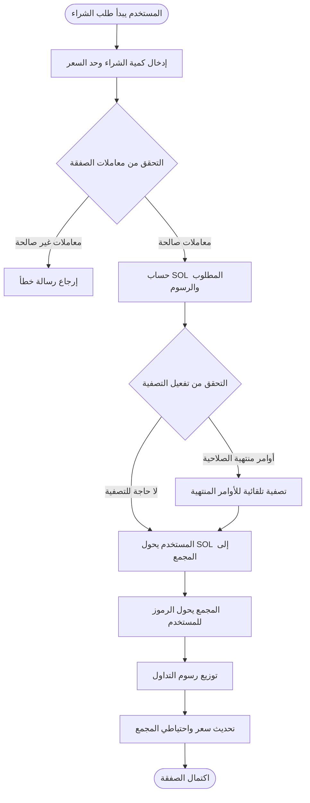
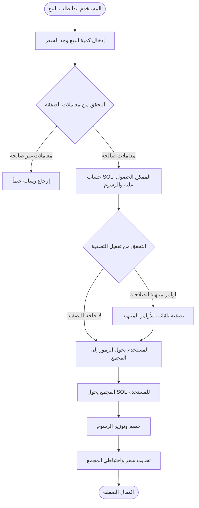

# 💱 مقدمة عن وظيفة التداول الفوري في PinPet

## 📊 نظرة عامة على الوظيفة

التداول الفوري هو إحدى الوظائف الأساسية في منصة PinPet، حيث يسمح للمستخدمين بشراء وبيع الرموز مباشرة في مجمعات السيولة اللامركزية. على عكس نموذج دفتر الأوامر التقليدي، تستخدم PinPet آلية صانع السوق الآلي (AMM)، بناءً على خوارزمية المنتج الثابت (x × y = k) لتحديد سعر التداول تلقائياً.

**✨ الميزات الأساسية:**
- **⚡ التنفيذ الفوري**: لا حاجة للانتظار لمطابقة البائع والمشتري، يتم إتمام الصفقة على الفور
- **🔍 التسعير الشفاف**: يتم حساب الأسعار تلقائياً بواسطة الخوارزمية، بشكل علني وشفاف
- **🌊 السيولة المستمرة**: يمكن التداول في أي وقت طالما توجد أصول كافية في المجمع
- **🛡️ حماية من الانزلاق السعري**: يمكن للمستخدمين تعيين حدود السعر القصوى/الدنيا لمنع تقلبات الأسعار غير الطبيعية

---

## 🛒 عملية تداول الشراء (Buy)

### 👤 خطوات عملية المستخدم

يسمح تداول الشراء للمستخدمين باستخدام SOL (الرمز الأصلي لـ Solana) لشراء رموز المشروع.

### 🔑 شرح المعاملات الرئيسية

| اسم المعامل | الوصف | قيمة مثال | ملاحظات |
|---------|---------|--------|------|
| buy_token_amount | كمية الرموز المراد شراؤها | 1000000 (رمز واحد) | القيمة الدنيا: 1000000 (رمز واحد) |
| max_sol_amount | الحد الأقصى لمبلغ SOL المستعد لدفعه | 50000000 (0.05 SOL) | يستخدم لمنع الانزلاق السعري المفرط |
| lp_pairs | لقطة حالة مجمع السيولة | [{sol: 30, token: 1000000}] | يتم توفيره تلقائياً من الواجهة الأمامية |

### ⚙️ منطق تنفيذ الصفقة

1. **التحقق من المعاملات**
   - التحقق من أن كمية الشراء تصل إلى الحد الأدنى للتداول (رمز واحد)
   - التحقق من توافق حالة مجمع السيولة مع البلوكشين

2. **حساب السعر**
   - بناءً على احتياطي المجمع الحالي، استخدام صيغة المنتج الثابت لحساب SOL المطلوب
   - حساب المبلغ الفعلي المدفوع بما في ذلك الرسوم
   - التحقق من أن سعر التنفيذ الفعلي لا يتجاوز القيمة القصوى المحددة من المستخدم

3. **آلية التصفية التلقائية**
   - إذا كانت الصفقة ستؤدي إلى عبور السعر لأسعار تصفية بعض أوامر الرافعة المالية، يقوم النظام بتصفية هذه الأوامر تلقائياً
   - يتم توزيع رسوم التصفية على المنصة والشركاء

4. **تحويل الأموال**
   - حساب المستخدم ← مجمع السيولة: تحويل SOL (بما في ذلك الرسوم)
   - مجمع السيولة ← حساب المستخدم: تحويل الرموز

5. **توزيع الرسوم**
   - توزيع بنسب محددة مسبقاً للشركاء ومقدمي التكنولوجيا
   - يمكن للمسؤول تكوين معدل الرسوم الافتراضي

6. **تحديث الحالة**
   - تحديث السعر الحالي لمجمع السيولة
   - إعادة حساب احتياطي SOL والرموز في المجمع
   - التحقق من تفعيل خصم الرسوم

---

## 💸 عملية تداول البيع (Sell)

### 👤 خطوات عملية المستخدم

يسمح تداول البيع للمستخدمين ببيع الرموز المملوكة واستبدالها بـ SOL.

### 🔑 شرح المعاملات الرئيسية

| اسم المعامل | الوصف | قيمة مثال | ملاحظات |
|---------|---------|--------|------|
| sell_token_amount | كمية الرموز المراد بيعها | 1000000 (رمز واحد) | القيمة الدنيا: 1000000 (رمز واحد) |
| min_sol_output | الحد الأدنى لمبلغ SOL المتوقع الحصول عليه | 20000000 (0.02 SOL) | يستخدم لمنع الانزلاق السعري المفرط |
| lp_pairs | لقطة حالة مجمع السيولة | [{sol: 30, token: 1000000}] | يتم توفيره تلقائياً من الواجهة الأمامية |

### ⚙️ منطق تنفيذ الصفقة

1. **التحقق من المعاملات**
   - التحقق من أن كمية البيع تصل إلى الحد الأدنى للتداول (رمز واحد)
   - التحقق من كفاية رصيد حساب الرموز للمستخدم
   - تأكيد صحة حالة مجمع السيولة

2. **حساب السعر**
   - بناءً على احتياطي المجمع الحالي، استخدام صيغة المنتج الثابت لحساب SOL الممكن الحصول عليه
   - حساب المبلغ الفعلي بعد خصم الرسوم
   - التحقق من أن سعر التنفيذ الفعلي لا يقل عن القيمة الدنيا المحددة من المستخدم

3. **آلية التصفية التلقائية**
   - إذا كانت الصفقة ستؤدي إلى عبور السعر لأسعار تصفية بعض أوامر الرافعة المالية، يقوم النظام بتصفية هذه الأوامر تلقائياً
   - توزيع رسوم التصفية ومكافآت التصفية

4. **تحويل الأموال**
   - حساب المستخدم ← مجمع السيولة: تحويل الرموز
   - مجمع السيولة ← حساب المستخدم: تحويل SOL (بعد خصم الرسوم)

5. **معالجة الرسوم**
   - خصم الرسوم من SOL المستحق
   - توزيع بنسب محددة للشركاء ومقدمي التكنولوجيا

6. **تحديث الحالة**
   - تحديث السعر الحالي لمجمع السيولة (انخفاض السعر)
   - إعادة حساب احتياطي SOL والرموز في المجمع
   - التحقق من تفعيل خصم الرسوم

---

## 💡 أمثلة على حالات الاستخدام

### 📈 السيناريو الأول: صفقة شراء عادية

**الخلفية:**
- السعر الحالي: رمز واحد = 0.03 SOL
- المستخدم يريد شراء 10 رموز
- معدل الرسوم: 1%

**عملية التشغيل:**
1. المستخدم يحدد كمية الشراء: 10,000,000 (10 رموز)
2. المستخدم يحدد الحد الأقصى للدفع: 0.35 SOL (350,000,000)
3. النظام يحسب الاحتياج الفعلي: 0.303 SOL (بما في ذلك الرسوم)
4. التحقق من السعر ناجح (لم يتجاوز الحد الأقصى)
5. تنفيذ الصفقة:
   - المستخدم يدفع 0.303 SOL
   - يحصل على 10 رموز
   - رسوم 0.003 SOL توزع على المنصة
6. السعر بعد التنفيذ يرتفع إلى: 0.0303 SOL/رمز

---

### 📉 السيناريو الثاني: البيع يؤدي لتصفية تلقائية

**الخلفية:**
- السعر الحالي: رمز واحد = 0.05 SOL
- يوجد أمر شراء طويل، سعر التصفية عند 0.048 SOL
- المستخدم يريد بيع 50 رمز

**عملية التشغيل:**
1. المستخدم يحدد كمية البيع: 50,000,000 (50 رمز)
2. المستخدم يحدد الحد الأدنى للدخل: 2.3 SOL
3. النظام يكتشف أن البيع سيؤدي لانخفاض السعر تحت 0.048 SOL
4. النظام يصفي أمر الشراء الطويل تلقائياً:
   - حساب أرباح وخسائر الأمر
   - تحصيل رسوم التصفية
   - إغلاق حساب الأمر، استرداد الإيجار
5. متابعة تنفيذ صفقة البيع:
   - المستخدم يحول 50 رمز
   - يحصل على 2.4 SOL (بعد خصم الرسوم)
6. السعر بعد التنفيذ يهبط إلى: 0.047 SOL/رمز

---

### 🛡️ السيناريو الثالث: تفعيل حماية الانزلاق السعري

**الخلفية:**
- السعر الحالي: رمز واحد = 0.02 SOL
- المستخدم يريد شراء 1000 رمز
- مجمع السيولة صغير، الصفقات الكبيرة ستسبب انزلاق سعري كبير

**عملية التشغيل:**
1. المستخدم يحدد كمية الشراء: 1,000,000,000 (1000 رمز)
2. المستخدم يحدد الحد الأقصى للدفع: 21 SOL
3. النظام يحسب الاحتياج الفعلي: 22.5 SOL (بما في ذلك الرسوم)
4. فشل التحقق من السعر (تجاوز حد المستخدم الأقصى)
5. تم رفض الصفقة، إرجاع رسالة خطأ
6. يمكن للمستخدم الاختيار:
   - زيادة حد الدفع الأقصى
   - تقليل كمية الشراء
   - الشراء على دفعات

---

## ⚠️ ملاحظات وقيود هامة

### 🚫 قيود التداول

| بند القيد | المتطلبات المحددة | سبب التوضيح |
|---------|---------|---------|
| الحد الأدنى لحجم التداول | 1,000,000 (رمز واحد) | لمنع الصفقات الصغيرة جداً من التأثير على كفاءة النظام |
| الحد الأقصى لمعدل الرسوم | 10% | حماية المستخدمين من الرسوم المفرطة |
| فحص السيولة | يجب توفير لقطة حالة المجمع الحالية | ضمان اتساق حالة البلوكشين وخارجه |
| حماية الانزلاق السعري | يجب ملء max_sol_amount / min_sol_output | منع الخسائر الناتجة عن تقلبات الأسعار غير الطبيعية |

### ⚠️ تنبيهات المخاطر

1. **📊 مخاطر تقلبات الأسعار**
   - الصفقات الكبيرة ستسبب انزلاق سعري كبير
   - يُنصح بتقسيم الصفقات الكبيرة على دفعات لتقليل تكلفة التأثير
   - تحديد مستوى تحمل معقول للانزلاق السعري

2. **💰 تكلفة الرسوم**
   - كل صفقة ستنتج رسوم
   - الصفقات الصغيرة المتكررة ستراكم تكاليف رسوم عالية
   - يُنصح بدمج الصفقات لتقليل التكاليف

3. **💧 مخاطر السيولة**
   - عند نقص السيولة، قد لا تكتمل الصفقات الكبيرة
   - احتياطي المجمع سيؤثر على سعر التنفيذ
   - انتبه لحالة احتياطي SOL والرموز في المجمع

4. **🔄 تأثير التصفية التلقائية**
   - الصفقات قد تؤدي إلى تصفية تلقائية لأوامر الرافعة المالية
   - التصفية ستستهلك جزءاً من السيولة
   - قد تؤثر على سعر التنفيذ النهائي

### 🔧 المتطلبات التقنية

**👛 متطلبات جانب المستخدم:**
- امتلاك محفظة Solana (مثل Phantom، Solflare)
- وجود SOL كافي في الحساب للتداول ودفع رسوم المعاملات
- يجب إنشاء حساب رمز مطابق قبل تداول الرموز (يتم عادة بشكل تلقائي من الواجهة الأمامية)

**💵 مكونات رسوم التداول:**
- رسوم شبكة Solana: حوالي 0.000005 SOL (رسوم توقيع المعاملة)
- رسوم التداول: تُحصل كنسبة مئوية من مبلغ التداول (يتم تكوينها من قبل المسؤول)
- إيجار الحساب: إذا كان يجب إنشاء حساب جديد، دفعة واحدة (قابلة للاسترداد)

### ❓ أسئلة شائعة

**س: هل سأخسر الرسوم إذا فشلت الصفقة؟**
ج: ✅ لا. إذا تم رفض الصفقة بسبب فشل التحقق من المعاملات، لن يتم خصم أي رسوم، سيتم استهلاك كمية صغيرة فقط من رسوم شبكة Solana (حوالي 0.000005 SOL).

**س: كيف أحصل على أفضل سعر تنفيذ؟**
ج: 💡 تداول في الفترات التي تتوفر فيها سيولة كافية، تجنب حجم التداول الكبير جداً في صفقة واحدة، انتبه لنسبة SOL/Token في المجمع، اختر التوقيت المناسب للتداول.

**س: هل ستؤثر التصفية التلقائية على صفقتي؟**
ج: ⚠️ ربما. إذا تسببت صفقتك في تصفية أوامر رافعة مالية لأشخاص آخرين، ستستهلك جزءاً من السيولة، وقد يؤدي ذلك إلى انحراف طفيف بين سعر التنفيذ الفعلي والمتوقع، ولكنه سيبقى ضمن نطاق الانزلاق السعري الذي حددته.

**س: ما هي الأسباب الشائعة لرفض الصفقة؟**
ج: ❌ الأسباب الشائعة تشمل:
- كمية الشراء أو البيع أقل من الحد الأدنى للتداول (رمز واحد)
- سعر التنفيذ الفعلي يتجاوز نطاق حماية الانزلاق السعري الذي حددته
- رصيد الحساب غير كافٍ (SOL أو رموز)
- لقطة حالة مجمع السيولة منتهية الصلاحية (يجب على الواجهة الأمامية إعادة الحصول عليها)

**س: كيف يتم حساب وتوزيع الرسوم؟**
ج: 💰 يتم تحصيل الرسوم بنسبة معينة من مبلغ التداول (افتراضياً 1%، قابل للتعديل من قبل المسؤول)، وبعد التحصيل يتم التوزيع بنسب محددة مسبقاً للشركاء ومقدمي التكنولوجيا. في بعض الحالات قد تستفيد من خصم على الرسوم.

---

## 🔗 الوظائف ذات الصلة

- **📊 التداول بالرافعة المالية**: استخدام آلية الإقراض لإجراء صفقات شراء/بيع طويلة
- **💧 إدارة السيولة**: عرض وإدارة حالة مجمعات السيولة
- **🪙 إنشاء الرموز**: إنشاء أزواج تداول رموز جديدة
- **📋 إدارة الأوامر**: عرض وإدارة أوامر التداول بالرافعة المالية

---

*📝 ملاحظة: هذا المستند هو شرح لوظيفة المنتج، ولا يتضمن تفاصيل التنفيذ التقني. للحصول على معلومات متعلقة بالتطوير، يرجى الرجوع إلى الوثائق التقنية للمشروع.*
