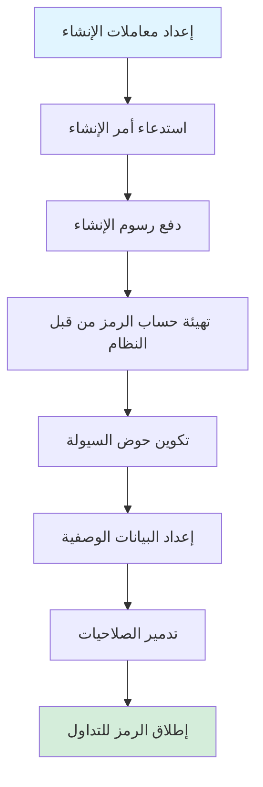
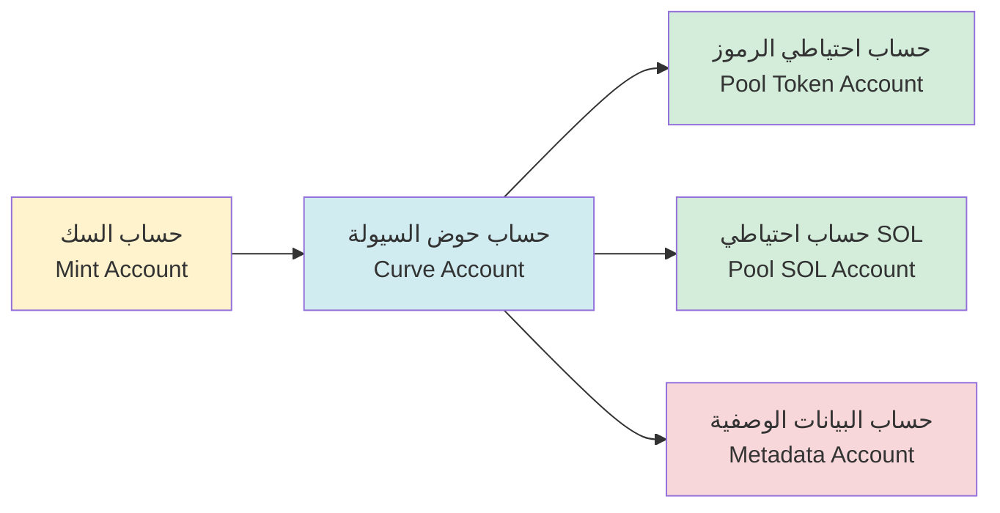
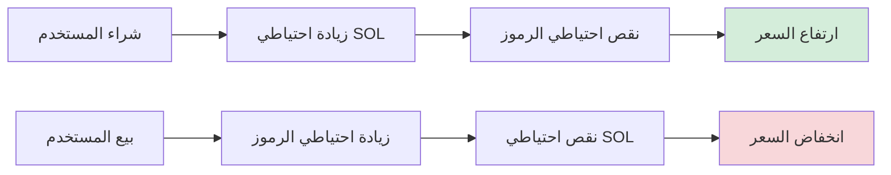

# 🪙 مقدمة عن وظيفة إنشاء الرموز في PinPet

## أولاً، 📋 نظرة عامة على الوظيفة

### 💎 ما هو إنشاء الرموز

إنشاء الرموز هو أحد الوظائف الأساسية لمنصة PinPet، والتي تتيح للمستخدمين إصدار رموز SPL جديدة (رموز معيار بلوكشين Solana) وتكوين سوق التداول تلقائياً بنقرة واحدة. من خلال هذه الوظيفة، يمكن للمستخدمين إنشاء رموز بسرعة مع بيانات وصفية كاملة ودعم السيولة التلقائي وقدرة التداول الفوري، دون الحاجة إلى فهم عميق لتقنية البلوكشين المعقدة.

### ❓ لماذا نحتاج إلى إنشاء الرموز

**⚠️ نقاط الألم في إصدار الرموز التقليدي:**
- يتطلب معرفة تقنية متخصصة (برمجة Solana، معيار SPL Token)
- تكوين يدوي لصلاحيات السك، وحمامات السيولة، والبيانات الوصفية وغيرها من الخطوات المتعددة
- نقص السيولة الفورية وسوق التداول
- إعدادات الأمان المعقدة (تدمير الصلاحيات، منع الزيادة في الإصدار، إلخ)

**✅ مزايا إنشاء الرموز في PinPet:**
- **⚡ إصدار بنقرة واحدة**: يتطلب فقط توفير ثلاث معلومات أساسية: اسم الرمز، والرمز، والأيقونة
- **🚀 إطلاق فوري**: يمكن التداول فور الانتهاء من الإنشاء، دون انتظار تراكم السيولة
- **🔒 تكوين أمان تلقائي**: تدمير تلقائي لصلاحيات السك والتجميد، لمنع الزيادة الخبيثة في الإصدار
- **🏦 سوق تداول مدمج**: يعتمد على خوارزمية AMM للمنتج الثابت، ويدعم التداول الفوري والتداول بالرافعة المالية
- **✔️ بيانات وصفية متوافقة**: متوافق مع معيار Metaplex، يتم التعرف عليه تلقائياً من قبل المحافظ وبورصات التداول

### ⭐ الميزات الأساسية

| الميزة | الوصف |
|------|------|
| معيار الرمز | SPL Token (المعيار الرسمي لـ Solana) |
| الدقة | 6 منازل عشرية (1 رمز = 1,000,000 وحدة أصغر) |
| الإمداد الكلي | 1,609,500,000,000,000 وحدة (إمداد ثابت، غير قابل للزيادة) |
| معيار البيانات الوصفية | Metaplex Token Metadata |
| السعر الأولي | حوالي 0.0000000000279589934762 SOL/رمز |
| نموذج السيولة | AMM للمنتج الثابت (x × y = k) |

---

## ثانياً، 🔄 عملية إنشاء الرموز

### 👤 خطوات العملية للمستخدم



### 📊 شرح تفصيلي للعملية

#### 📝 المرحلة الأولى: إعداد المعاملات
يحتاج المستخدم إلى توفير ثلاث معاملات أساسية:

| المعامل | النوع | الوصف | مثال |
|------|------|------|------|
| name | سلسلة نصية | الاسم الكامل للرمز | "PinPet Token" |
| symbol | سلسلة نصية | رمز الرمز (3-10 أحرف) | "PINPET" |
| uri | سلسلة نصية | رابط ملف JSON للبيانات الوصفية | "https://example.com/metadata.json" |

#### 🔧 المرحلة الثانية: تهيئة الحساب
يقوم النظام تلقائياً بإنشاء وتكوين الحسابات التالية:



#### 💧 المرحلة الثالثة: تهيئة حوض السيولة
يقوم النظام تلقائياً بتكوين حوضين من الأموال:

**1. حوض السيولة الفوري (LP Pool)**
- احتياطي الرموز: 1,073,000,000,000,000 وحدة
- احتياطي SOL: 30 SOL (رصيد افتراضي)
- SOL الفعلي: 10,000 lamports (لمنع نقص الرصيد)
- الغرض: دعم التداول الفوري (الشراء/البيع)

**2. حوض الإقراض بالرافعة المالية (Borrow Pool)**
- احتياطي الرموز: 536,500,000,000,000 وحدة
- احتياطي SOL: 10,000,000 SOL (رصيد افتراضي)
- الغرض: دعم تداول الهامش (الشراء بالرافعة/البيع على المكشوف)

**📊 مخطط توزيع الأموال:**
```
💰 الإمداد الكلي: 1,609,500,000,000,000 وحدة
├── حوض السيولة الفوري: 1,073,000,000,000,000 (66.67%)
└── حوض الإقراض بالرافعة:  536,500,000,000,000 (33.33%)
```

#### 📄 المرحلة الرابعة: إنشاء البيانات الوصفية
يستدعي النظام برنامج Metaplex Token Metadata لإنشاء البيانات الوصفية للرمز:

| حقل البيانات الوصفية | المحتوى | الوصف |
|-----------|------|------|
| name | الاسم المقدم من المستخدم | اسم الرمز المعروض في المحفظة |
| symbol | الرمز المقدم من المستخدم | الاختصار للرمز |
| uri | الرابط المقدم من المستخدم | يشير إلى JSON يحتوي على الأيقونة والوصف وغيرها |
| creators | عنوان المُنشئ | تحديد منشئ الرمز، حالة غير موثقة |
| seller_fee_basis_points | 0 | معدل الإتاوات (مضبوط على 0) |
| is_mutable | true | السماح بتحديث البيانات الوصفية |

**📋 مثال على تنسيق JSON القياسي للبيانات الوصفية:**
```json
{
  "name": "PinPet Token",
  "symbol": "PINPET",
  "description": "رمز صادر بناءً على منصة PinPet",
  "image": "https://example.com/logo.png",
  "attributes": [],
  "properties": {
    "files": [
      {
        "uri": "https://example.com/logo.png",
        "type": "image/png"
      }
    ]
  }
}
```

#### 🔒 المرحلة الخامسة: تدمير الصلاحيات
لضمان أمان الرمز وعدم قابليته للتعديل، يقوم النظام تلقائياً بتنفيذ:

| العملية | الهدف | التأثير |
|------|------|------|
| تدمير صلاحية السك | منع الزيادة في الإصدار | تأمين الإمداد الكلي بشكل دائم |
| تدمير صلاحية التجميد | منع تجميد حسابات المستخدمين | قابلية دوران الرمز بشكل دائم |

#### 💵 المرحلة السادسة: تكوين الرسوم
يقرأ النظام إعدادات الرسوم من حساب معاملات الشريك:

| نوع الرسوم | القيمة الافتراضية | الوصف |
|---------|--------|------|
| رسوم التداول الفوري | 1% | يتم خصمها عند الشراء والبيع |
| رسوم تداول الهامش | 0.25% | يتم خصمها عند التداول بالرافعة المالية |
| علامة خصم الرسوم | 0 (سعر أصلي) | يمكن تعديلها تلقائياً بناءً على حجم التداول |
| نسبة توزيع الرسوم | 20%/80% | نسبة التقسيم بين الجهة التقنية/الشريك |

---

## ثالثاً، 💧 آلية حوض السيولة

### 🔢 صيغة المنتج الثابت

يعتمد PinPet على نموذج صانع السوق الآلي (AMM)، الصيغة الأساسية هي:

```
x × y = k
```

حيث:
- **x**: احتياطي SOL
- **y**: احتياطي الرموز
- **k**: المنتج الثابت (القيمة الأولية = 30 × 1,073,000,000 = 32,190,000,000)

### 💰 حساب السعر الأولي

```
السعر الأولي = احتياطي SOL ÷ احتياطي الرموز
         = 30 ÷ 1,073,000,000
         ≈ 0.0000000279589934762 SOL/رمز
```

### 📈 آلية تغيير السعر



### 🛡️ حماية انزلاق السعر

لحماية حوض السيولة، يعتمد النظام آليات أمان متعددة:

| إجراء الحماية | الوصف |
|---------|------|
| عامل الدقة | يستخدم السعر عامل دقة 10^26، لتجنب أخطاء التقريب |
| فحص التجاوز | جميع العمليات الحسابية تستخدم طرق `checked_*` لمنع التجاوز |
| الحد الأعلى للسعر | الحد الأقصى للسعر مقيد بـ 50,000,000,000,000,000,000,000,000,000 |
| الحد الأدنى للسعر | الحد الأدنى للسعر مقيد بـ 0.000000001 (لمنع القسمة على صفر) |

---

## رابعاً، 📝 شرح البيانات الوصفية للرمز

### ✅ معيار Metaplex

يستخدم PinPet معيار Metaplex Token Metadata v5.1.1، لضمان توافق الرمز في نظام Solana البيئي:

**✨ مزايا المعيار:**
- 💳 التعرف التلقائي من قبل المحافظ الرئيسية (Phantom، Solflare)
- 🔄 الحصول التلقائي على المعلومات من منصات DEX (Jupiter، Raydium)
- 🎨 الفهرسة التلقائية من قبل أسواق ومجمعات NFT
- 🔍 العرض الكامل من قبل متصفحات البلوكشين (Solscan، Solana Explorer)

### 🗂️ هيكل حساب البيانات الوصفية

```
عنوان حساب البيانات الوصفية (PDA)
├── البذور المشتقة: ["metadata", Metaplex Program ID, Mint Address]
├── المحتوى المخزن:
│   ├── اسم الرمز
│   ├── رمز الرمز
│   ├── URI (رابط JSON للبيانات الوصفية)
│   ├── معلومات المنشئ
│   ├── إعدادات الإتاوات
│   └── معلومات المجموعة (اختياري)
└── الصلاحيات:
    ├── صلاحية التحديث: حساب حوض السيولة (PDA)
    └── القابلية للتغيير: true (السماح بالتحديث)
```

### 🌐 توصيات استضافة URI

| طريقة الاستضافة | المزايا | العيوب | السيناريو المناسب |
|---------|------|------|---------|
| IPFS | لامركزي، تخزين دائم | سرعة الوصول بطيئة نسبياً | مشاريع طويلة الأجل |
| Arweave | تخزين دائم، سرعة عالية | يتطلب دفع | رموز عالية القيمة |
| التخزين السحابي (AWS S3/CDN) | سرعة عالية، رخيص | مركزي، قد يفشل | اختبار أو مشاريع قصيرة الأجل |

---

## خامساً، 🎯 أمثلة على حالات الاستخدام

### 🚀 السيناريو 1: فريق ناشئ يصدر رمز المشروع

**الحاجة:**
يرغب فريق ناشئ في Web3 في إصدار رمز حوكمة لمشروع DeFi الخاص به

**تدفق العملية:**
1. تصميم أيقونة الرمز ووثيقة الوصف
2. تحميل JSON للبيانات الوصفية إلى IPFS
3. إعداد المعاملات:
   - name: "SuperDeFi Governance Token"
   - symbol: "SDEFI"
   - uri: "https://ipfs.io/ipfs/QmXXX..."
4. استدعاء أمر الإنشاء في PinPet، ودفع رسوم إنشاء قليلة
5. إطلاق الرمز فوراً، يمكن لأعضاء الفريق والمجتمع التداول فوراً

**✅ المزايا:**
- ⚡ لا حاجة لكتابة عقود ذكية
- 💧 سوق سيولة مدمج
- 🔒 الأمان مضمون من البروتوكول

---

### 🎉 السيناريو 2: إصدار رمز Meme للمجتمع

**الحاجة:**
يرغب المجتمع في إصدار رمز Meme موضوعي للترفيه والتداول

**تدفق العملية:**
1. تصويت المجتمع لتحديد اسم الرمز والأيقونة
2. استخدام استضافة صور مجانية لاستضافة الصورة
3. إعداد المعاملات:
   - name: "Doge to the Moon"
   - symbol: "DMOON"
   - uri: "https://cloudinary.com/dmoon.json"
4. بدء الإنشاء من قبل أي عضو في المجتمع
5. بدء التداول فوراً من قبل أعضاء المجتمع

**✅ المزايا:**
- 💰 إصدار سريع بتكلفة منخفضة
- 👥 لا حاجة لخلفية تقنية
- 🔒 آلية حماية تلقائية ضد الزيادة في الإصدار

---

### 🎨 السيناريو 3: مشروع NFT يصدر رمز منفعة

**الحاجة:**
يرغب فريق مشروع NFT في إصدار رمز منفعة مصاحب للنظام البيئي للحوافز

**تدفق العملية:**
1. تصميم صورة الرمز التي تتناسب مع نمط NFT
2. إعداد ورقة بيضاء مفصلة للرمز
3. استخدام Arweave للتخزين الدائم للبيانات الوصفية
4. إعداد المعاملات:
   - name: "CryptoArt Utility Token"
   - symbol: "CART"
   - uri: "ar://abc123..."
5. إنشاء الرمز وإعداد حساب استلام الرسوم
6. يمكن لحاملي NFT الحصول على مكافآت الرمز من خلال الإيداع

**✅ المزايا:**
- 💾 تخزين دائم للبيانات الوصفية
- 🔗 تكامل سلس مع نظام NFT البيئي
- 📊 دعم نماذج اقتصادية معقدة

---

## سادساً، ⚠️ ملاحظات وقيود

### 📝 التحضيرات قبل الإنشاء

| عنصر الفحص | الوصف |
|--------|------|
| رصيد المحفظة | التأكد من وجود SOL كافٍ لدفع رسوم الإنشاء (حوالي 0.01-0.05 SOL) |
| تحضير البيانات الوصفية | ملف JSON تم تحميله ويمكن الوصول إليه |
| معلومات الرمز | الاسم والرمز يتوافقان مع المعايير، بدون غموض |
| حساب الشريك | تم إنشاء حساب معاملات الشريك (يحتاج إلى إنشاء في المرة الأولى) |

### 🚫 قيود إنشاء الرموز

**⚙️ القيود التقنية:**
- دقة الرمز ثابتة عند 6 منازل عشرية، لا يمكن تعديلها بعد الإنشاء
- الإمداد الكلي ثابت، لا يمكن زيادته بعد تدمير صلاحية السك
- تكوين السيولة الأولية ثابت، لا يمكن تخصيصه

**🔒 القيود الأمنية:**
- الحد الأعلى لمعدل الرسوم هو 10%، سيفشل الإنشاء إذا تجاوز ذلك
- صلاحية تحديث البيانات الوصفية تعود لحساب حوض السيولة
- تم تدمير صلاحية التجميد، لا يمكن تجميد حسابات المستخدمين

**💰 القيود الاقتصادية:**
- السعر الأولي محسوب بواسطة الخوارزمية، لا يمكن تخصيصه
- نسبة توزيع السيولة ثابتة (فوري 66.67%، رافعة مالية 33.33%)
- احتياطي SOL هو رصيد افتراضي، لا يمكن سحبه مباشرة

### ❓ الأسئلة الشائعة

**💵 س1: كم تكلفة إنشاء الرمز؟**
ج: الرسوم الرئيسية تشمل إيجار الحساب (حوالي 0.01-0.03 SOL) ورسوم المعاملة (حوالي 0.00001 SOL)، بإجمالي حوالي 0.01-0.05 SOL.

**✏️ س2: هل يمكن تعديل اسم أو رمز الرمز بعد الإنشاء؟**
ج: يمكن التعديل عن طريق تحديث محتوى ملف JSON الذي يشير إليه URI للبيانات الوصفية، لكن الاسم والرمز المسجلين على السلسلة غير قابلين للتغيير.

**🔒 س3: كيف يمكن ضمان أمان الرمز؟**
ج: النظام يدمر تلقائياً صلاحيات السك والتجميد، مما يضمن ثبات الإمداد وعدم قابليته للتعديل. يُنصح باستخدام التخزين اللامركزي (IPFS/Arweave) لاستضافة البيانات الوصفية.

**❗ س4: كيف يمكن التعامل مع فشل الإنشاء؟**
ج: فحص رصيد المحفظة، وتنسيق المعاملات، وحالة حساب الشريك. الأخطاء الشائعة تشمل تجاوز معدل الرسوم، وURI غير صالح، إلخ.

**🗑️ س5: هل يمكن تدمير الرمز؟**
ج: لا يمكن تدمير حساب الرمز نفسه، ولكن يمكن قفل الرمز بشكل دائم عن طريق نقله إلى عنوان الثقب الأسود (0x000...).

### 💡 توصيات أفضل الممارسات

1. **استضافة البيانات الوصفية**: إعطاء الأولوية لاستخدام التخزين اللامركزي مثل IPFS أو Arweave، لتجنب فشل الروابط
2. **تسمية الرموز**: بسيطة وواضحة، تجنب الخلط مع المشاريع المعروفة، ومنع انتهاك حقوق الملكية
3. **تصميم الأيقونة**: استخدام صور عالية الجودة (يُنصح بـ 512x512 بكسل)، تتناسب مع تحديد الرمز
4. **تحضير الورقة البيضاء**: تضمين وصف تفصيلي للمشروع وخارطة الطريق في JSON الذي يشير إليه URI
5. **بناء المجتمع**: إنشاء حسابات وسائل التواصل الاجتماعي في الوقت المناسب بعد الإنشاء، لتعزيز شهرة الرمز
6. **الامتثال**: التأكد من أن غرض الرمز قانوني، وتجنب انتهاك القوانين واللوائح المحلية

---

## سابعاً، 🔧 الدعم التقني

### 📍 عناوين الحسابات ذات الصلة

| نوع الحساب | قاعدة الاشتقاق | الوصف |
|---------|---------|------|
| حساب حوض السيولة | `["borrowing_curve", mint_address]` | إدارة السيولة ومعاملات التداول |
| حساب احتياطي الرموز | `["pool_token", mint_address]` | تخزين الرموز في حوض السيولة |
| حساب احتياطي SOL | `["pool_sol", mint_address]` | تخزين SOL في حوض السيولة |
| حساب البيانات الوصفية | Metaplex standard PDA | تخزين البيانات الوصفية للرمز |

### 🖥️ واجهة البرنامج

**✨ أمر الإنشاء:**
```
اسم الدالة: create
المعاملات:
  - name: String (اسم الرمز)
  - symbol: String (رمز الرمز)
  - uri: String (URI للبيانات الوصفية)
```

**📡 الاستماع للأحداث:**
بعد نجاح الإنشاء، يتم إصدار حدث `TokenCreatedEvent`، يتضمن المعلومات التالية:
- عنوان حساب السك
- عنوان حساب حوض السيولة
- إعدادات الرسوم
- اسم الرمز، والرمز، وURI

---

## 🎯 الخلاصة

توفر وظيفة إنشاء الرموز في PinPet للمستخدمين حلاً 🔒 آمناً و⚡ مريحاً و💰 منخفض التكلفة لإصدار الرموز. من خلال تكوين السيولة التلقائي وإدارة البيانات الوصفية القياسية، يمكن للمستخدمين إكمال إنشاء الرمز في غضون دقائق وإطلاقه للتداول على الفور، دون القلق بشأن التفاصيل التقنية ومشاكل الأمان.

سواء كان 🚀 فريق ناشئ يصدر رمز مشروع، أو 🎉 مجتمع ينشئ رمز Meme، أو 🎨 مشروع NFT مع رمز منفعة مصاحب، يمكن لـ PinPet تقديم الدعم الكامل، مما يجعل إصدار الرموز بسيطاً وفعالاً.
