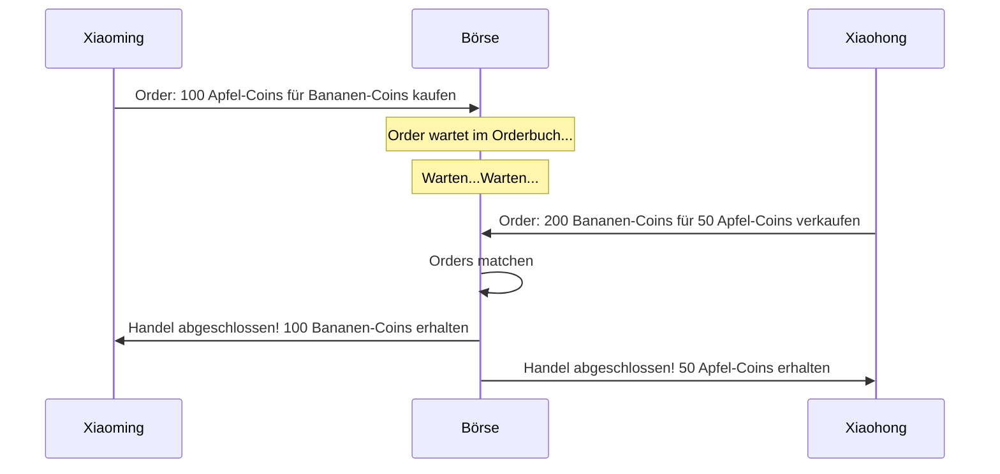
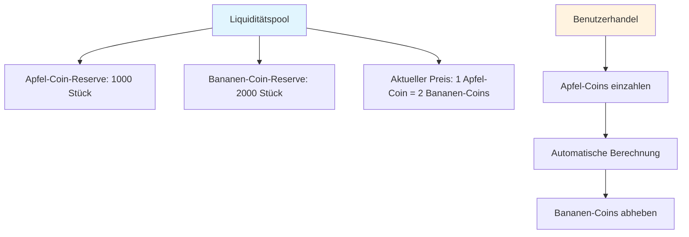
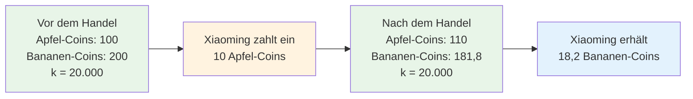
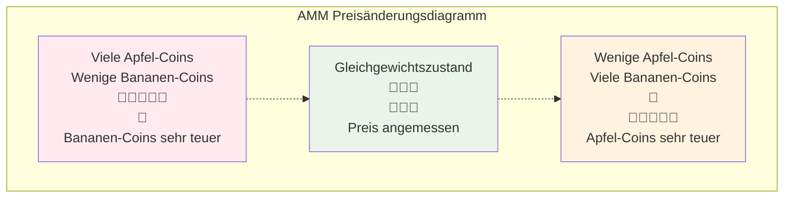
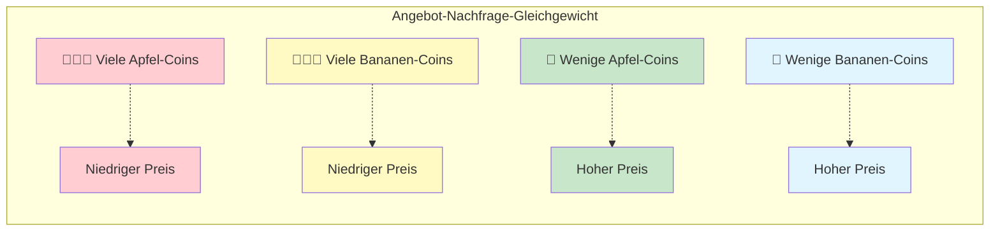
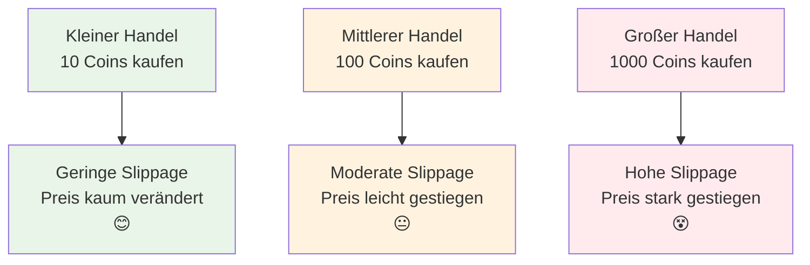
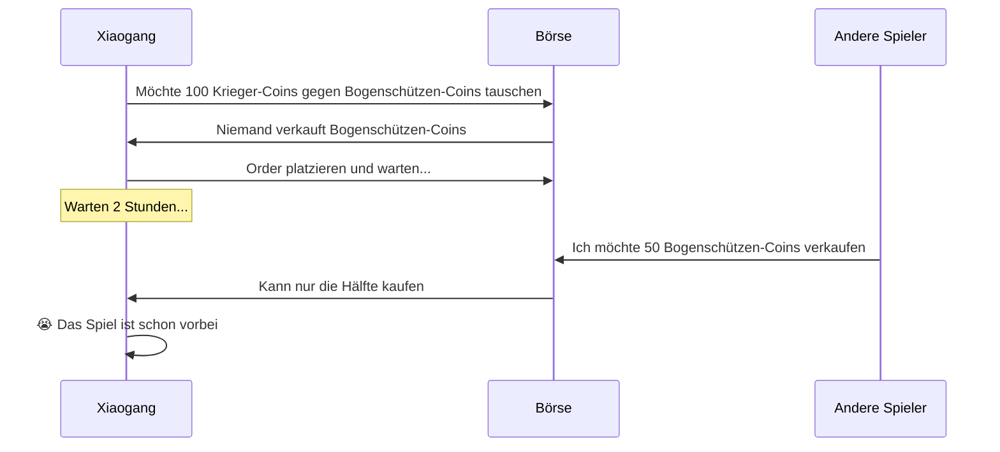
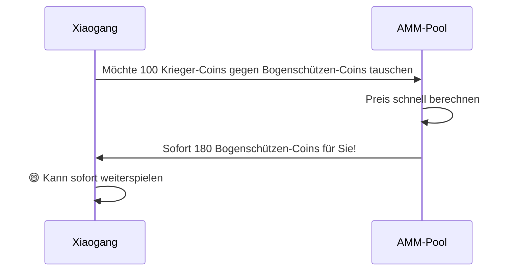
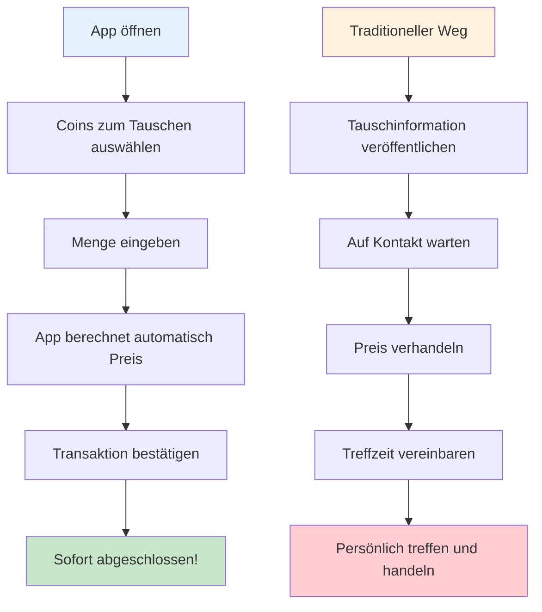

# AMM Market-Making-Mechanismus Leitfaden - Automated Market Maker von Grund auf verstehen

## Inhaltsverzeichnis
1. [Was ist AMM?](#was-ist-amm)
2. [Die Geschichte traditioneller Börsen](#die-geschichte-traditioneller-börsen)
3. [Die wunderbare Welt von AMM](#die-wunderbare-welt-von-amm)
4. [Mathematische Prinzipien vereinfacht](#mathematische-prinzipien-vereinfacht)
5. [AMM-Funktionsweise illustriert](#amm-funktionsweise-illustriert)
6. [Was ist Slippage?](#was-ist-slippage)
7. [Warum AMM verwenden?](#warum-amm-verwenden)
8. [Praktische Fallstudienanalyse](#praktische-fallstudienanalyse)
9. [Zusammenfassung](#zusammenfassung)

---

## Was ist AMM?

Stellen Sie sich vor, Sie möchten Äpfel gegen Bananen tauschen, aber Sie finden niemanden, der genau Ihre Äpfel haben möchte. Wenn es jetzt eine "magische Saftmaschine" gäbe, in die Sie Äpfel hineingeben und sie Ihnen automatisch die entsprechende Menge an Bananen gibt - das ist das Grundkonzept von AMM (Automated Market Maker)!

**AMM = Automated Market Maker (Automatischer Market Maker)**

Einfach ausgedrückt ist AMM ein intelligenter, niemals ruhender "Handelsroboter", der es Ihnen ermöglicht, jederzeit und überall verschiedene Token zu tauschen, ohne darauf warten zu müssen, dass andere Personen mit Ihnen handeln.

---

## Die Geschichte traditioneller Börsen

### 📖 Xiaomings Handelsprobleme

Xiaoming möchte seine 100 Apfel-Coins gegen einige Bananen-Coins tauschen. An traditionellen Börsen:

1. **Order platzieren und warten**: Xiaoming platziert eine Order "Ich möchte 100 Apfel-Coins kaufen für Bananen-Coins, Preis 1:2"
2. **Auf Käufer warten**: Xiaoming muss warten, bis jemand Bananen-Coins zum richtigen Preis verkaufen möchte
3. **Möglicherweise lange Wartezeit**: Wenn niemand verkaufen möchte, kann Xiaoming Stunden oder sogar Tage warten müssen
4. **Preisschwankungen**: Während der Wartezeit können sich die Preise ändern, Xiaoming könnte den besten Zeitpunkt verpassen

### Probleme traditioneller Börsen:
- ⏰ **Wartezeit erforderlich**: Muss warten, bis jemand handeln möchte
- 📊 **Unzureichende Liquidität**: Nischen-Token sind schwer zu handeln
- 💰 **Instabile Preise**: Große Orders können zu drastischen Preisschwankungen führen
- 🌙 **Zeitbeschränkungen**: Börsen haben Öffnungszeiten

---

## Die wunderbare Welt von AMM

### 🏪 Der magische Automaten-Shop

Stellen Sie sich jetzt einen magischen Automaten-Shop (AMM) vor, der so funktioniert:

1. **Immer geöffnet**: 24-Stunden-Betrieb, schließt nie
2. **Sofortiger Handel**: Was Sie wollen, können Sie sofort kaufen
3. **Automatische Preisfindung**: Preise passen sich automatisch dem Bestand an
4. **Keine Wartezeit**: Keine Notwendigkeit, auf andere Kunden zu warten

### 🏦 Liquiditätspool = Super-Lager

Das Herzstück von AMM ist der "Liquiditätspool", wie ein riesiges zweigeteiltes Lager:

### 🤖 Automatischer Preisroboter

AMM hat einen superintelligenten Preisroboter, der einer einfachen Regel folgt:

**🔢 Magische Formel: Apfel-Coin-Menge × Bananen-Coin-Menge = Fester Wert (k)**

Diese Formel stellt sicher:
- Je mehr Käufer, desto höher der Preis
- Je mehr Verkäufer, desto niedriger der Preis
- Es gibt immer Bestand zum Kaufen und Preise zum Verkaufen

---

## Mathematische Prinzipien vereinfacht

### 🧮 Konstante Produktformel

Lassen Sie sich nicht von "Mathematik" abschrecken - es ist eigentlich ganz einfach!

Angenommen, unser magisches Lager hat:
- Apfel-Coins: 100 Stück
- Bananen-Coins: 200 Stück
- Magische Zahl k = 100 × 200 = 20.000

**Regel: Unabhängig vom Handel muss der k-Wert bei 20.000 bleiben!**

### 📊 Handelsbeispiel

**Xiaoming möchte 10 Apfel-Coins gegen Bananen-Coins tauschen:**

1. **Vor dem Handel**:
   - Apfel-Coins: 100 Stück
   - Bananen-Coins: 200 Stück
   - k = 100 × 200 = 20.000

2. **Xiaoming zahlt 10 Apfel-Coins ein**:
   - Neue Apfel-Coin-Menge: 100 + 10 = 110 Stück
   - k muss bei 20.000 bleiben
   - Also: 110 × neue Bananen-Coin-Menge = 20.000
   - Neue Bananen-Coin-Menge = 20.000 ÷ 110 = 181,8 Stück

3. **Xiaoming erhält**:
   - Bananen-Coins: 200 - 181,8 = 18,2 Stück
   - 10 Apfel-Coins gegen 18,2 Bananen-Coins getauscht

---

## AMM-Funktionsweise illustriert

### 🎢 Preiskurvendiagramm

Die Preisänderung von AMM ist wie eine Achterbahn und folgt einer speziellen Kurve:

### 📈 Angebot-Nachfrage-Diagramm

Stellen Sie sich die beiden Seiten einer Waage vor:

---

## Was ist Slippage?

### 🛒 Supermarkt-Shopping-Analogie

Stellen Sie sich vor, Sie gehen in den Supermarkt, um Äpfel zu kaufen:

**Traditioneller Supermarkt (zentralisierte Börse):**
- Ausgezeichneter Preis: 5 Euro/kg
- 1 kg kaufen: 5 Euro
- 100 kg kaufen: immer noch 5 Euro/kg
- Aber möglicherweise nicht so viel Bestand!

**Magischer Supermarkt (AMM):**
- 1. kg: 5 Euro
- 2. kg: 5,1 Euro (Bestand reduziert, Preis steigt)
- 3. kg: 5,2 Euro
- Je mehr Sie kaufen, desto schneller steigt der Preis!

### 📊 Slippage-Auswirkungsdiagramm

### 🎯 Slippage-Berechnungsbeispiel

Angenommen, der Pool hat 1000 Apfel-Coins und 2000 Bananen-Coins:

1. **10 Bananen-Coins kaufen**: Slippage ca. 0,25%
2. **100 Bananen-Coins kaufen**: Slippage ca. 2,5%
3. **500 Bananen-Coins kaufen**: Slippage ca. 14%

**Fazit: Je mehr Sie kaufen, desto höher ist der durchschnittliche Preis pro Coin!**

---

## Warum AMM verwenden?

### 🌟 Super-Vorteile von AMM

#### 1. 🚀 Sofortiger Handel
- **Traditioneller Weg**: Möglicherweise Stunden warten, um einen Handelspartner zu finden
- **AMM-Weg**: Handel in Sekunden abgeschlossen

#### 2. 🌍 Rund um die Uhr 24/7
- **Traditionelle Börsen**: Haben Öffnungszeiten, an Feiertagen geschlossen
- **AMM**: Schließt nie, jederzeit handelbar

#### 3. 🎯 Kein Matching erforderlich
- **Traditioneller Weg**: Benötigt Käufer- und Verkäuferpreisübereinstimmung
- **AMM**: Solange Coins im Pool sind, kann gehandelt werden

#### 4. 💎 Unterstützt Nischen-Token
- **Traditionelle Börsen**: Nischen-Coins haben möglicherweise keine Händler
- **AMM**: Solange ein Pool erstellt wurde, kann gehandelt werden

### 📊 Vergleichstabelle

| Merkmal | Traditionelle Börse | AMM |
|---------|---------------------|-----|
| Handelsgeschwindigkeit | Warten auf Matching erforderlich ⏳ | Sofort abgeschlossen ⚡ |
| Öffnungszeiten | Begrenzt 🕐 | 24/7 🌍 |
| Liquidität | Abhängig von Benutzerorders 👥 | Algorithmisch garantiert 🤖 |
| Preisfindung | Orderbuch 📋 | Mathematische Formel 🧮 |
| Slippage | Abhängig von Ordertiefe 📊 | Abhängig von Handelsvolumen 📈 |

---

## Praktische Fallstudienanalyse

### 🎮 Spiel-Token-Handelsgeschichte

#### Hintergrundszenario
Xiaogang möchte in einem Blockchain-Spiel Spiel-Token tauschen:
- 🗡️ Krieger-Coins (zum Kauf von Waffen)
- 🏹 Bogenschützen-Coins (zum Kauf von Bögen)

#### Szenario 1: Traditionelle Börse

#### Szenario 2: AMM

### 🍕 Pizza-Shop-Analogie

**Traditioneller Modus (Freunde finden zum Tauschen):**
- Sie möchten Bitcoin, müssen jemanden finden, der genau Ihre Ethereum haben möchte
- Möglicherweise in der Gruppe rufen: Will jemand Bitcoin gegen Ethereum tauschen?
- Möglicherweise den halben Tag warten ohne Antwort

**AMM-Modus (Verkaufsautomat):**
- Wie ein superintelligenter Verkaufsautomat
- Ethereum einwerfen, sofort Bitcoin erhalten
- Preis automatisch berechnet, kein Feilschen nötig

### 📱 Smartphone-App-Analogie

Stellen Sie sich eine magische Tausch-App vor:

---

## Zusammenfassung

### 🎯 Kernpunkte im Überblick

1. **AMM ist wie ein magischer Verkaufsautomat**
   - Einen Coin einwerfen, sofort einen anderen erhalten
   - 24 Stunden im Betrieb, ruht nie

2. **Die konstante Produktformel ist der Kern**
   - x × y = k (magische Zahl, die sich nie ändert)
   - Diese Formel passt den Preis automatisch an

3. **Slippage ist normal**
   - Je mehr Sie kaufen, desto mehr steigt der Preis
   - Wie im Supermarkt: Je mehr Sie kaufen, desto teurer

4. **AMM ist bequemer als traditionelle Börsen**
   - Keine Wartezeit, sofortiger Handel
   - Unterstützt alle Coin-Typen
   - Immer Liquidität vorhanden

### 🌈 Zukunftsausblick

AMM-Technologie entwickelt sich ständig weiter:
- Intelligentere Preisalgorithmen
- Geringere Slippage
- Mehr innovative Funktionen

### 🎓 Anfängerempfehlungen

1. **Mit kleinen Beträgen beginnen**: Erst mit kleinem Kapital üben
2. **Slippage verstehen**: Bei großen Handelsvolumina auf Slippage achten
3. **Vergleichen**: Verschiedene AMMs können unterschiedliche Preise haben
4. **Kontinuierliches Lernen**: Die DeFi-Welt verändert sich schnell

---

## Anhang: Häufig gestellte Fragen

### ❓ FAQ

**F1: Können die Coins in AMM ausgehen?**
A1: Theoretisch nein! Solange Coins im Pool sind, kann gehandelt werden. Der Preis kann jedoch sehr hoch sein.

**F2: Warum gibt es manchmal große Preisunterschiede?**
A2: Wegen unterschiedlicher Poolgrößen. Kleine Pools haben große Preisschwankungen, große Pools sind relativ stabil.

**F3: Ist AMM sicher?**
A3: Der Code ist Open Source, aber achten Sie darauf, geprüfte Plattformen zu wählen.

**F4: Wie werden Gebühren berechnet?**
A4: Normalerweise 0,1-1% des Handelsbetrags, automatisch vom Handelsergebnis abgezogen.

**F5: Kann eine Transaktion storniert werden?**
A5: Vor der On-Chain-Bestätigung kann storniert werden, aber es fallen Stornierungsgebühren an.

Denken Sie daran: Investieren birgt Risiken, handeln Sie mit Vorsicht! Erst lernen, dann praktizieren, mit kleinen Beträgen beginnen! 🚀
