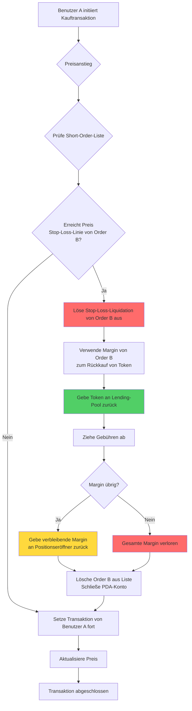
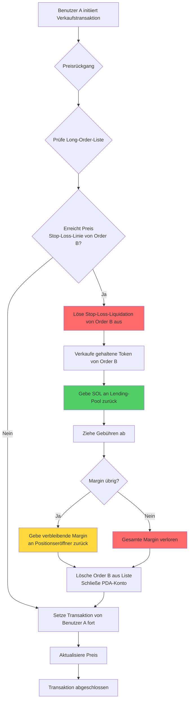
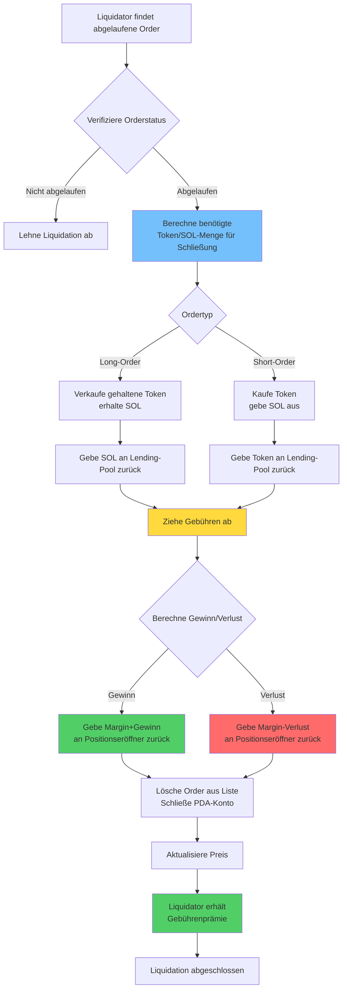
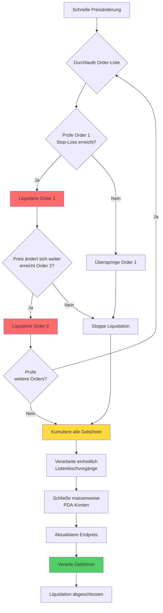

# ⚡ PinPet Zwangsliquidation (Liquidierung) Funktionsbeschreibung

## 📋 Funktionsübersicht

Die Zwangsliquidation ist ein Kernrisikokontrollmechanismus im PinPet-Protokoll zum Schutz der Systemstabilität. Das System bietet zwei Arten von Zwangsliquidationsauslösern:

1. **⏰ Zeitauslöser**: Wenn eine gehebelte Handelsorder die vorgeschriebene Haltezeit überschreitet, kann jeder eine Zwangsliquidation auslösen
2. **🎯 Preisauslöser**: Wenn der Marktpreis die Stop-Loss-Preislinie der Order erreicht, wird automatisch eine Stop-Loss-Liquidation ausgelöst

Dieser doppelte Schutzmechanismus gewährleistet die Liquidität und Kapitalsicherheit des Protokolls und schützt gleichzeitig den Positionseröffner vor übermäßigen Verlusten.

## ⚙️ Kernfunktionen

### 1. 🔄 Dualer Auslösemechanismus

#### ⏰ Zeitauslöser
- **✅ Normale Schließung**: Während der Orderhaltedauer kann nur der Positionseröffner selbst die Position aktiv schließen
- **⏱️ Ablaufliquidation**: Nach Ablauf der Order kann jeder eine Zwangsliquidation durchführen
- **🔍 Zeitverifizierung**: Das System beurteilt automatisch anhand des On-Chain-Zeitstempels, ob die Order abgelaufen ist

#### 🎯 Preisauslöser (Stop-Loss-Liquidation)
- **📉 Long-Stop-Loss**: Wenn der Preis fällt und die Stop-Loss-Preislinie einer Long-Order erreicht, erfolgt eine automatische Schließung
- **📈 Short-Stop-Loss**: Wenn der Preis steigt und die Stop-Loss-Preislinie einer Short-Order erreicht, erfolgt eine automatische Schließung
- **🔄 Passiver Auslöser**: Preisausgelöste Stop-Loss-Liquidationen werden automatisch beim Handel anderer Benutzer ausgeführt
- **⚠️ Margin-Erschöpfung**: Bei Stop-Loss wird die Margin zur Rückzahlung des Darlehens verwendet, der Positionseröffner hat normalerweise keinen Gewinn oder verliert die gesamte Margin

### 2. 📊 Unterstützte Ordertypen

| Ordertyp | Preisauslösebedingung | Zeitauslösebedingung | Listenrichtung | Asset-Verarbeitung |
|---------|------------|------------|---------|---------|
| 📈 Long-Order | Preis fällt auf Stop-Loss-Linie | Order abgelaufen | Down | Rückzahlung geliehener SOL |
| 📉 Short-Order | Preis steigt auf Stop-Loss-Linie | Order abgelaufen | Up | Rückzahlung geliehener Token |

### 3. 👥 Teilnehmerrollen

- **👤 Positionseröffner**: Benutzer, der gehebelte Order erstellt hat, hat vor Ablauf der Order exklusives Schließungsrecht
- **🔨 Liquidator**: Jeder Drittbenutzer, kann nach Ablauf der Order aktive Liquidation durchführen
- **💼 Händler**: Kauf-/Verkaufstransaktionen anderer Benutzer können Preis-Stop-Loss-Liquidationen auslösen
- **🤖 Protokoll**: Verwaltet automatisch Lending-Pool-Mittel, um einen normalen Kapitalfluss sicherzustellen

## 🔄 Arbeitsablauf

### 📊 Vergleichstabelle der Abläufe

| Ablaufphase | ⏰ Zeitauslöser-Schließung | 🎯 Preisauslöser-Stop-Loss |
|---------|------------|------------|
| Auslösebedingung | Order abgelaufen | Preis erreicht Stop-Loss-Linie |
| Auslösezeitpunkt | Liquidator initiiert aktiv | Passiv bei Handel ausgelöst |
| Berechtigungsverifizierung | Jeder kann ausführen | Automatische Ausführung (keine Berechtigung erforderlich) |
| Gewinn-/Verlustabrechnung | Kann Gewinn oder Verlust sein | Normalerweise Verlust der gesamten Margin |
| Margin-Verarbeitung | Rückgabe verbleibender Margin | Verwendet zur Darlehenrückzahlung |

### 📉 Short-Order Stop-Loss-Liquidationsablauf (Preisauslöser)



### 📈 Long-Order Stop-Loss-Liquidationsablauf (Preisauslöser)



### ⏰ Ablaufliquidationsablauf der Order (Zeitauslöser)



### 💥 Massen-Kettenliquidationsablauf



## 💰 Gebührenmechanismus

### 💵 Gebührenstruktur

| Gebührentyp | Gebührenpflichtig | Gebührensatz | Verwendung |
|---------|---------|------|------|
| Transaktionsgebühr | Positionseröffner | Nach Ordergebührensatz | Kompensation für Liquiditätsanbieter |
| Liquidationsgebühr | Positionseröffner | Nach Ordergebührensatz | Belohnung für Liquidationsausführer |

### 🤝 Gebührenverteilung

Alle Gebühren werden gemäß dem im Protokoll konfigurierten Aufteilungsverhältnis (fee_split) zwischen zwei Parteien verteilt:

- **🤝 Partner**: Erhält einen bestimmten Anteil der Gebühren
- **🔧 Technologieanbieter**: Erhält verbleibende Gebühren

Das Aufteilungsverhältnis wird vom Administrator beim Erstellen des Liquiditätspools festgelegt, Wertebereich 0-100.

## 💸 Kapitalabrechnungsregeln

### ⏰ Zeitauslöser-Liquidation (Order abgelaufen)

#### ✅ Gewinnsituation
Bei Ordergewinn:
- Positionseröffner erhält Margin + Gewinnanteil zurück
- Abzug von Transaktions- und Liquidationsgebühren
- Abrechnungsadresse muss Positionseröffneradresse sein

#### ❌ Verlustsituation
Bei Orderverlust:
- Verlust wird von Margin abgezogen
- Verbleibende Margin wird an Positionseröffner zurückgegeben
- Abzug von Transaktions- und Liquidationsgebühren

#### 🧮 Abrechnungsformeln
**📈 Long-Order-Gewinn/-Verlust**:
```
Gewinn = Verkaufserlös SOL + Margin - Geliehene SOL - Gebühren
```

**📉 Short-Order-Gewinn/-Verlust**:
```
Gewinn = Gesperrte SOL - Rückkaufkosten SOL - Gebühren
```

### 🎯 Preisauslöser-Stop-Loss (Automatische Liquidation)

#### 🛡️ Margin-Verarbeitung
- Margin wird vorrangig zur Rückzahlung an Lending-Pool verwendet
- Nach Abzug der Transaktionsgebühren wird gesamter Saldo zur Schließung verwendet
- Normalerweise hat Positionseröffner keinen Gewinn oder verliert gesamte Margin

#### 🧮 Abrechnungsformeln
**📈 Long-Order-Stop-Loss**:
```
Verbleibende Margin = Margin - Rückzahlung geliehener SOL - Gebühren
Wenn verbleibende Margin > 0, Rückgabe an Positionseröffner
Wenn verbleibende Margin ≤ 0, gesamte Margin verloren
```

**📉 Short-Order-Stop-Loss**:
```
Rückkaufkosten = Token-Rückkaufkosten SOL + Gebühren
Verbleibende Margin = Margin - Rückkaufkosten
Wenn verbleibende Margin > 0, Rückgabe an Positionseröffner
Wenn verbleibende Margin ≤ 0, gesamte Margin verloren
```

### 📊 Vergleich der Abrechnungsszenarien

| Szenariotyp | Abrechnungszeitpunkt | Gewinnmöglichkeit | Margin-Rückgabe | Gebührenquelle |
|---------|---------|----------|----------|----------|
| ✅ Aktive Schließung | Positionseröffner-Operation | Gewinn oder Verlust möglich | Kapital+Gewinn oder Abzug Verlust | Positionseröffner zahlt |
| ⏰ Ablaufliquidation | Order abgelaufen | Gewinn oder Verlust möglich | Kapital+Gewinn oder Abzug Verlust | Positionseröffner zahlt |
| 🎯 Stop-Loss-Liquidation | Preisauslöser | Normalerweise Verlust | Saldo nach Margin-Abzug | Von Margin abgezogen |

## 🔗 Listenverwaltung

### 📋 Order-Listenstruktur

Das System verwendet doppelt verkettete Listen zur Verwaltung zu schließender Orders:

- **📈 Long-Order-Liste (Down)**: Sortiert von hohem zu niedrigem Preis
- **📉 Short-Order-Liste (Up)**: Sortiert von niedrigem zu hohem Preis

### 🔧 Listenoperationen

```
Kopfknotenprüfung → Bestätige Orderposition
    ↓
Verifiziere Vorgänger-/Nachfolger-Beziehung
    ↓
Lösche aktuellen Knoten → Aktualisiere Vorgänger-/Nachfolger-Zeiger
    ↓
Aktualisiere Listenkopfzeiger
```

### 💥 Massenliquidation

Wenn eine Transaktion mehrere Order-Stop-Losses auslöst:
1. Durchlaufe Order-Liste in Reihenfolge
2. Führe Schließung für jede abgelaufene Order nacheinander aus
3. Kumuliere alle Schließungsgebühren
4. Führe einheitliche Kapitalabrechnug durch

## 🛡️ Sicherheitsmechanismus

### 🔐 Berechtigungsverifizierung

| Verifizierung | Zeitbedingung | Berechtigungsanforderung |
|-------|---------|---------|
| Aktive Schließung | Order nicht abgelaufen | Muss Positionseröffner selbst sein |
| Zwangsliquidation | Order abgelaufen | Jeder kann ausführen |
| Abrechnungsadresse | Jederzeit | Muss Positionseröffneradresse sein |

### 🔢 Numerische Sicherheit

- Alle Berechnungen verwenden sichere checked_*-Methoden, um Überläufe zu verhindern
- Gebührenberechnung verwendet hochpräzise Algorithmen, um Genauigkeit sicherzustellen
- Verifiziere Order-Listen-Integrität, um Datenbeschädigung zu verhindern

### 💎 Kapitalsicherheit

- Automatische Verifizierung der Lending-Pool-Mittelrückzahlung
- Prüfung der Pool-Mittelzulänglichkeit
- Schutz vor doppelter Schließung

## 🎬 Praktische Anwendungsszenarien

### 🎯 Szenario 1: Normale Ablaufliquidation (Zeitauslöser)

1. Benutzer A eröffnet 5x Long-Position bei Preis 100, Margin 1 SOL, Haltedauer 24 Stunden
2. Nach 24 Stunden steigt Preis auf 120, Order hat ca. 1 SOL Gewinn
3. Benutzer B entdeckt abgelaufene Order, führt Zwangsliquidation aus
4. System verkauft automatisch Token, zahlt Darlehen zurück, zieht Gebühren von 0,1 SOL ab
5. Benutzer A erhält Kapital 1 SOL + Gewinn 1 SOL - Gebühren 0,1 SOL = 1,9 SOL

### 🚨 Szenario 2: Preisauslöser-Stop-Loss-Liquidation

1. Benutzer C eröffnet 3x Short-Position bei Preis 100, Margin 2 SOL
2. Stop-Loss-Preislinie auf 130 gesetzt (automatisch bei Eröffnung berechnet)
3. Benutzer D kauft große Menge Token, Preis steigt schnell auf 135
4. Preis erreicht Stop-Loss-Linie von Benutzer C, System liquidiert automatisch Order C
5. Verwendet Margin 2 SOL zum Rückkauf von Token zur Rückzahlung an Lending-Pool
6. Zieht Gebühren von 0,1 SOL ab, verbleibende 0,2 SOL werden an Benutzer C zurückgegeben
7. Benutzer C verliert 1,8 SOL, Kauftransaktion von Benutzer D wird fortgesetzt

### 💥 Szenario 3: Ketten-Stop-Loss-Liquidation

1. Preis steigt schnell, löst mehrere Short-Order-Stop-Loss-Linien aus
2. Benutzer E reicht Kauftransaktion ein, Preis steigt von 100 auf 150
3. System erkennt, dass 5 Short-Orders liquidiert werden müssen
4. Führt Stop-Loss-Schließungen nacheinander nach Preisreihenfolge aus
5. Jede Order kauft separat mit Margin Token zurück, zahlt Darlehen zurück
6. Zieht schließlich einheitlich kumulierte Gebühren ab, gibt verbleibende Margin zurück
7. Kauftransaktion von Benutzer E wird schließlich abgeschlossen

### 📊 Szenario 4: Stop-Loss-Liquidation nach Teilschließung

1. Benutzer F eröffnet Long-Position über 1000 Token, Margin 5 SOL
2. Schließt aktiv 500 Token mit Gewinn von 2 SOL, verbleibende 500 Token in Position
3. Preis fällt weiter, erreicht Stop-Loss-Linie der verbleibenden Position
4. System führt automatisch Stop-Loss-Liquidation der verbleibenden 500 Token aus
5. Nach Abzug von Darlehen und Gebühren hat Benutzer F insgesamt 0,5 SOL Gewinn

## ❓ Häufig gestellte Fragen

### Q1: ⏰ Was ist der Unterschied zwischen Zeitauslöser und 🎯 Preisauslöser?

A:
- **⏰ Zeitauslöser**: Nach Ablauf der Order muss Liquidator aktiv Transaktion zur Schließung initiieren, Positionseröffner kann Gewinn oder Verlust haben
- **🎯 Preisauslöser**: Wenn Preis Stop-Loss-Linie erreicht, automatische Ausführung während Transaktionen anderer Benutzer, Positionseröffner verliert normalerweise Margin

Beide Mechanismen sind unabhängig, Order kann zuerst Preis-Stop-Loss auslösen oder zuerst nach Ablauf liquidiert werden.

### Q2: 🎯 Wie wird die Stop-Loss-Preislinie bestimmt?

A: Stop-Loss-Preislinie wird bei Eröffnung automatisch basierend auf Hebel und Margin berechnet:
- **📈 Long-Order**: Stop-Loss-Preis = Eröffnungspreis × (1 - 1/Hebel)
- **📉 Short-Order**: Stop-Loss-Preis = Eröffnungspreis × (1 + 1/Hebel)

Beispiel: 5x Long, Eröffnungspreis 100, Stop-Loss-Preis ca. 80; 3x Short, Eröffnungspreis 100, Stop-Loss-Preis ca. 133.

### Q3: 🔔 Erhalte ich eine Benachrichtigung bei Preisauslöser-Stop-Loss?

A: ❌ Nein. Stop-Loss-Liquidation wird passiv bei Transaktionen anderer Benutzer ausgelöst, System benachrichtigt nicht im Voraus. Empfehlungen:
- 🔍 Überwache eigenen Orderstatus durch On-Chain-Events
- 📊 Verwende Drittanbieter-Tools zur Überwachung von Positionsrisiken
- ⚠️ Setze Hebel angemessen, um Stop-Loss-Auslösung zu vermeiden

### Q4: ⏰ Wie lange nach Ablauf der Order wird sie zwangsliquidiert?

A: Nach Ablauf der Order kann sie sofort von jedem zwangsliquidiert werden, ohne zusätzliche Kulanzfrist. Erfordert jedoch aktive Initiierung durch Liquidator. Empfohlen, vor Ablauf der Order aktiv zu schließen, um mehr Kontrolle zu behalten.

### Q5: 💰 Werden bei Zwangsliquidation zusätzliche Gebühren erhoben?

A: ✅ Keine zusätzlichen Gebühren. Ob Zeitauslöser oder Preisauslöser, Gebühren werden nach dem bei Ordereröffnung festgelegten Gebührensatz erhoben, gleich wie bei normaler Schließung.

### Q6: ⚠️ Wird bei Stop-Loss-Liquidation die gesamte Margin verloren?

A: Nicht unbedingt. Obwohl bei Stop-Loss-Liquidation normalerweise der Großteil der Margin verloren geht, aber wenn:
- ✅ Preis erreicht Stop-Loss-Linie genau bei Auslösung
- 📊 Marktvolatilität ist gering, Liquidationskosten sind niedrig
- 💵 Gebühren sind niedrig

Dann kann möglicherweise ein kleiner Margin-Saldo an Positionseröffner zurückgegeben werden. In den meisten Fällen bedeutet Stop-Loss-Liquidation jedoch erhebliche Verluste.

### Q7: 🔢 Wie viele Orders können in einer Transaktion liquidiert werden?

A: Theoretisch können maximal 6 Orders in einer Transaktion liquidiert werden (maximale Order-Array-Länge des Systems). Tatsächliche Liquidationsanzahl hängt ab von:
- **🎯 Preisauslöser**: Abhängig davon, wie viele Orders im Preisänderungsbereich Stop-Loss-Linie erreichen
- **⏰ Zeitauslöser**: Abhängig davon, wie viele abgelaufene Orders Liquidator liquidieren möchte

### Q8: 🔀 Wie wird die Liquidationsreihenfolge bestimmt?

A: Liquidationsreihenfolge wird durch Order-Listenstruktur bestimmt:
- **📈 Long-Orders**: Liquidation nacheinander von hohem zu niedrigem Preis (bei Preisrückgang)
- **📉 Short-Orders**: Liquidation nacheinander von niedrigem zu hohem Preis (bei Preisanstieg)

Diese Reihenfolge stellt sicher, dass Orders, die zuerst Stop-Loss-Linie erreichen, zuerst liquidiert werden, entspricht natürlicher Reihenfolge der Preisänderung.

### Q9: 🛡️ Wie vermeide ich Stop-Loss-Liquidation?

A: Empfohlene Maßnahmen:
- **⚙️ Angemessener Hebel**: Verwende niedrigeren Hebel (2-3x), lasse mehr Raum für Preisschwankungen
- **💰 Rechtzeitige Gewinnmitnahme**: Schließe Position bei Ordergewinn rechtzeitig aktiv, sichere Gewinn
- **👀 Marktbeobachtung**: Beobachte Preisänderungen genau, schließe aktiv vor Erreichen der Stop-Loss-Linie
- **📊 Gestaffelte Positionseröffnung**: Eröffne nicht gesamte Position auf einmal, behalte Anpassungsspielraum

### Q10: ❓ Was passiert bei unzureichenden Mitteln bei Liquidation?

A: System verifiziert vor Liquidation Pool-Mittelzulänglichkeit. Bei unzureichenden Mitteln schlägt Transaktion fehl und wird zurückgerollt, keine Operation wird ausgeführt. Dies kommt selten vor, da Protokolldesign Mittelbalance sicherstellt.

### Q11: 🔓 Wird PDA-Konto nach Zwangsliquidation geschlossen?

A: ✅ Ja, nach Abschluss der Zwangsliquidation wird zugehöriges PDA-Konto automatisch geschlossen, Miete wird an Zahler zurückerstattet. Für:
- **⏰ Zeitauslöser**: Miete wird an Liquidationsausführer zurückerstattet
- **🎯 Preisauslöser**: Miete wird an auslösenden Transaktionsbenutzer zurückerstattet

### Q12: 🔄 Ändert sich Stop-Loss-Preis der Order nach Teilschließung?

A: Ja. Nach Teilschließung wird Stop-Loss-Preis der Order basierend auf verbleibender Position neu berechnet. Da Position reduziert ist, wird Stop-Loss-Preis näher am aktuellen Preis sein, Risiko erhöht sich relativ.

### Q13: 💥 Kommt es bei starker Preisvolatilität zu Kettenliquidierungen?

A: ⚠️ Ja. Bei schnellen Preisschwankungen können Ketten-Stop-Loss-Liquidationen ausgelöst werden:
1. Preis durchbricht eine Stop-Loss-Linie
2. Löst erste Charge von Order-Liquidationen aus
3. Liquidation selbst treibt Preis weiter
4. Löst nächste Charge von Order-Liquidationen aus

Dies tritt häufiger in Bereichen mit hohem Hebel und dichten Orders auf, daher wird empfohlen, hohen Hebel vorsichtig zu verwenden.

### Q14: ❌ Was sind die Folgen einer fehlgeschlagenen Liquidation?

A: Wenn Liquidationstransaktion aus irgendeinem Grund fehlschlägt (wie Parameterfehler, unzureichende Mittel usw.), wird Transaktion zurückgerollt, ohne Auswirkungen auf System. Order des Positionseröffners bleibt unverändert, kann:
- ⏳ Auf nächsten Liquidationsversuch warten
- ✅ Selbst aktiv schließen
- 🎯 Auf andere Transaktionen warten, die Preis-Stop-Loss auslösen

### Q15: 🚫 Kann bereits ausgelöste Stop-Loss-Liquidation storniert werden?

A: ❌ Nein. Stop-Loss-Liquidation wird automatisch in Transaktionen anderer Benutzer ausgeführt, sobald Preis Stop-Loss-Linie erreicht, beginnt Liquidationsprozess sofort und kann nicht unterbrochen oder storniert werden. Dies dient dem Schutz der Protokolldeterminismus und zur Verhinderung systemischer Risiken.
