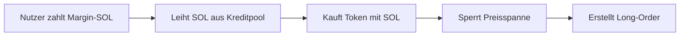
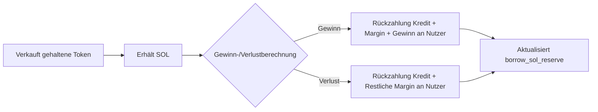
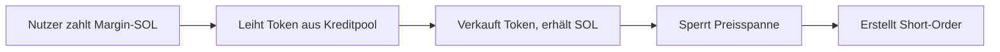
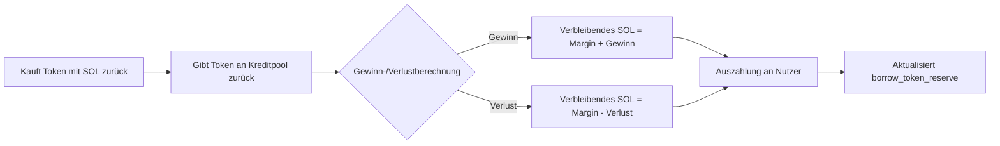
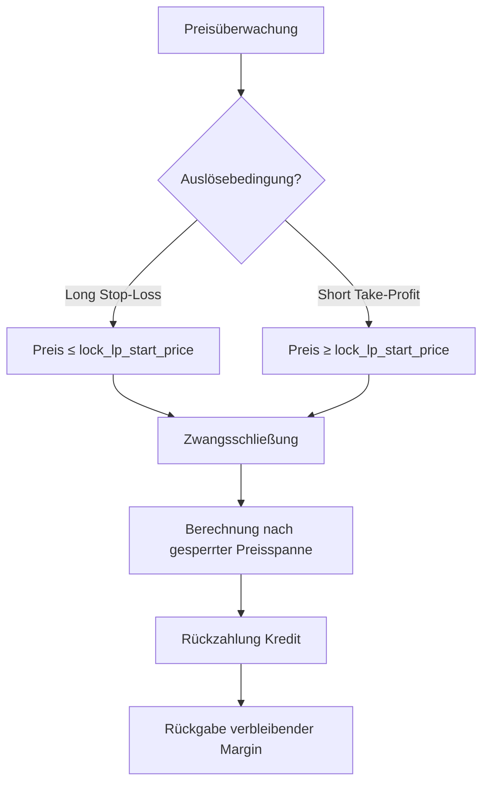
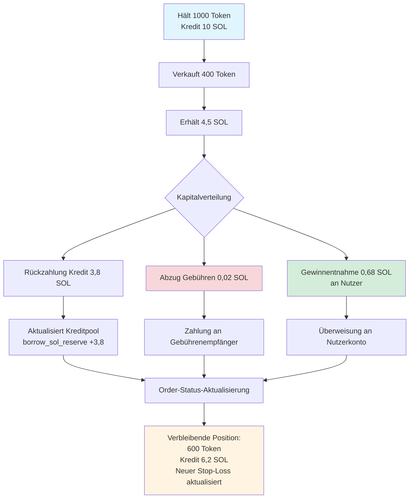
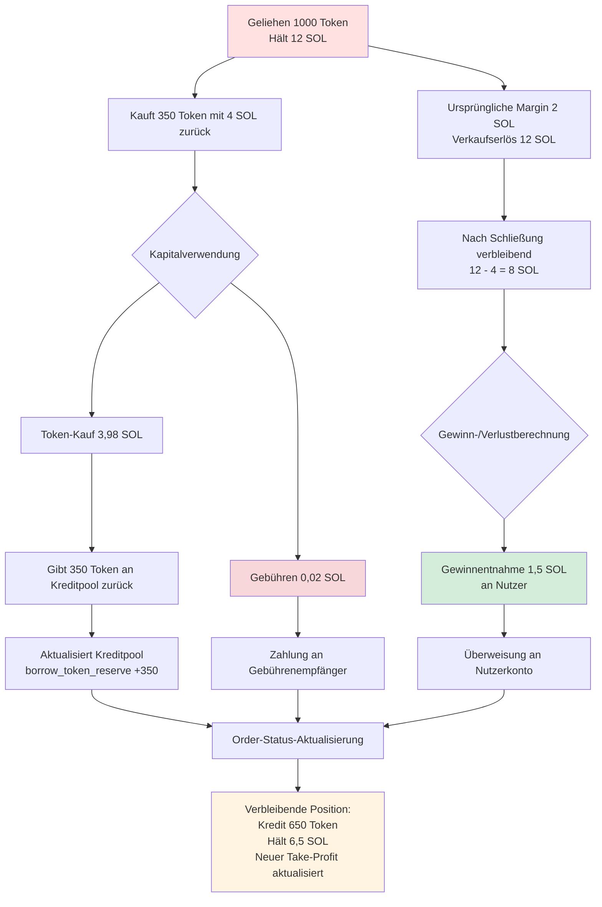

# 🏦 Einführung in die Kreditpool-Funktion

## I. 📋 Überblick

Der PinPet-Kreditpool ist das Kernmodul zur Unterstützung des Hebel-Handels und bietet Nutzern Kredit- und Verleihdienstleistungen für SOL und Token, um Long- und Short-Funktionen zu realisieren. Der Kreditpool verwendet einen **virtuellen Reservepool-Mechanismus**, der unabhängig vom Liquiditätspool des Spot-Handels ist, um sicherzustellen, dass der Hebel-Handel den normalen Betrieb des Spot-Marktes nicht beeinträchtigt.

## II. 🎭 Die doppelte Rolle des Kreditpools

### 2.1 💰 Als Kapitalpool
- **SOL-Kreditpool**: Stellt SOL-Kredite für Long-Händler bereit
- **Token-Kreditpool**: Stellt Token-Kredite für Short-Händler bereit

### 2.2 📦 Reservenverwaltung
Der Kreditpool verwaltet zwei unabhängige virtuelle Reserven:

| Reserventyp | Beschreibung | Verwendungszweck |
|---------|------|------|
| `borrow_sol_reserve` | Virtuelle SOL-Reserve | Für Long-Händler zum Ausleihen |
| `borrow_token_reserve` | Virtuelle Token-Reserve | Für Short-Händler zum Ausleihen |

Diese Reserven sind **virtuelle Buchhaltungseinträge**. Die tatsächlichen Mittel werden im Spot-Liquiditätspool gespeichert und durch den Preisspannen-Sperrmechanismus isoliert.

## III. 🔄 Kreditprozess beim Hebel-Handel

### 3.1 📈 Long-Position (Long) - SOL leihen, Token kaufen

#### ⬆️ Eröffnungsphase


**Detaillierter Ablauf**:
1. **Nutzereinsatz**: Zahlt Margin (z.B. 0,5 SOL) 💵
2. **Kreditpool-Auszahlung**: Leiht SOL aus `borrow_sol_reserve` (z.B. 4,5 SOL) 💸
3. **Handelsausführung**: Kauft Token mit insgesamt 5 SOL am AMM ⚙️
4. **Preisspannen-Sperrung**: Erfasst die Preisspanne beim Kauf für die Schließungsberechnung 🔒
5. **Orderaufzeichnung**: Erstellt `MarginOrder`, erfasst Kreditbetrag, Margin, gehaltene Token-Menge 📝


#### ⬇️ Schließungsphase


**Kapitalabrechnung**:
- Gesamt-SOL aus Token-Verkauf = `output_sol` 💰
- Abzug Handelsgebühren 💸
- Rückzahlung an Kreditpool: `borrow_amount` zurück an `borrow_sol_reserve` ⬅️
- Nutzergewinn = Gesamt - Kredit - Margin ✅

### 3.2 📉 Short-Position (Short) - Token leihen, verkaufen gegen SOL

#### ⬆️ Eröffnungsphase


**Detaillierter Ablauf**:
1. **Nutzereinsatz**: Zahlt Margin-SOL 💵
2. **Kreditpool-Auszahlung**: Leiht Token aus `borrow_token_reserve` 💎
3. **Handelsausführung**: Verkauft Token, erhält SOL, zahlt in Pool ein ⚙️
4. **Preisspannen-Sperrung**: Erfasst die Preisspanne beim Verkauf 🔒
5. **Orderaufzeichnung**: Erstellt `MarginOrder`, erfasst geliehene Token-Menge, Margin, gehaltenes SOL 📝


#### ⬇️ Schließungsphase


**Kapitalabrechnung**:
- Erforderliches Gesamt-SOL für Token-Rückkauf = `required_sol` + Gebühren 💰
- Rückzahlung an Kreditpool: `borrow_amount` (Token) zurück an `borrow_token_reserve` ⬅️
- Nutzergewinn = SOL aus Eröffnungsverkauf - SOL für Schließungskauf - Margin ✅

## IV. 💸 Rückzahlungsmechanismus des Kreditpools

### 4.1 ✅ Aktive Schließungs-Rückzahlung
Bei aktiver Schließung durch den Nutzer führt das System automatisch die Rückzahlung aus:

| Handelstyp | Rückzahlungs-Asset | Rückzahlungsquelle | Rückgabe-Reserve |
|---------|---------|---------|---------|
| Long-Position schließen | SOL | Erlös aus Token-Verkauf | `borrow_sol_reserve` |
| Short-Position schließen | Token | Zurückgekaufte Token | `borrow_token_reserve` |

**Rückzahlungspriorität**:
1. Abzug Handelsgebühren 💸
2. Rückzahlung Kreditprinzip ⬅️
3. Rückgabe Margin 💰
4. Verteilung Gewinn/Behandlung Verlust 📊

### 4.2 ⚠️ Zwangsliquidations-Rückzahlung
Wenn der Preis den Stop-Loss/Take-Profit-Preis erreicht, führt das System automatisch eine Zwangsschließung durch:



**Liquidationsschutz** 🛡️:
- Durch Sperrung der Preisspanne wird sichergestellt, dass selbst bei starken Marktpreisschwankungen die Schließung zum vorbestimmten Preis erfolgen kann
- Das Margin-Design gewährleistet die Sicherheit der Kreditpool-Mittel

### 4.3 ⏰ Verfallsliquidation
Nach Ablauf der Order kann jeder die Schließung auslösen:

- Long-Order: Verfallszeit `end_time` = Eröffnungszeit + `borrow_duration` ⏱️
- Short-Order: Gleich wie oben
- Nach Ablauf erfolgt Zwangsschließung zum aktuellen Marktpreis, Rückzahlung des Kredits ⚡

## V. 🛡️ Sicherheitsmechanismus für Kreditpool-Mittel

### 5.1 💼 Margin-Anforderungen
- **Mindest-Margin**: `MIN_MARGIN_SOL_AMOUNT` (Systemparameter) 💰
- **Margin-Verhältnis**: Dynamisch berechnet basierend auf Hebel-Multiplikator und Preisschwankungsbereich 📊
- **Margin-Verwendung**: Deckung von Verlusten bei ungünstigen Preisbewegungen 🔒

### 5.2 🔐 Preisspannen-Sperrung
Jede Order sperrt die Liquidität einer bestimmten Preisspanne:

```
Long-Sperrung: [lock_lp_start_price, lock_lp_end_price] (Preisrückgangsbereich)
Short-Sperrung: [lock_lp_start_price, lock_lp_end_price] (Preisanstiegsbereich)
```

Dies gewährleistet ausreichende Liquidität zur Kreditrückzahlung bei Schließung. ✅

### 5.3 ✔️ Reservenprüfung
Vor der Eröffnung prüft das System:

| Prüfpunkt | Bedingung | Fehlercode |
|-------|------|-------|
| SOL-Reserve | `required_borrow_sol ≤ borrow_sol_reserve` | `InsufficientBorrowingReserve` |
| Token-Reserve | `required_borrow_token ≤ borrow_token_reserve` | `InsufficientBorrowingReserve` |


## VI. 💸 Gebührenmechanismus

### 6.1 📊 Hebel-Handelsgebühren
- **Gebührensatz**: `borrow_fee` (z.B. 0,5% = 50 Basispunkte) 💰
- **Gebührenzeitpunkt**: Wird sowohl bei Eröffnung als auch bei Schließung erhoben ⏰
- **Gebührenverteilung**:
  - Partner: `fee_split` Anteil (z.B. 80%) 🤝
  - Technologieanbieter: 100% - `fee_split` (z.B. 20%) ⚙️

### 6.2 ⚡ Zwangsliquidationsgebühren
- Bei Auslösung der Liquidation wird zusätzlich `borrow_fee` als Liquidationsgebühr erhoben 💸
- Dient zur Anreizschaffung für Dritte zur Durchführung von Verfallsliquidationen 🎯

## VII. 🎯 Teilschließungsfunktion

Nutzer können Positionen teilweise schließen, um Risiken flexibel zu managen: ⚙️

### 7.1 📈 Teilschließung Long-Position



**Order-Aktualisierungsdetails**:

| Feld | Vor Schließung | Nach Schließung | Beschreibung |
|-----|-------|-------|------|
| `position_asset_amount` | 1000 Token | 600 Token | Verbleibende Position |
| `borrow_amount` | 10 SOL | 6,2 SOL | Verbleibender Kredit |
| `lock_lp_start_price` | Ursprünglicher Stop-Loss | Neuer Stop-Loss | Neu berechnet für neue Position |
| `realized_sol_amount` | 0 SOL | 0,68 SOL | Kumulierter realisierter Gewinn |

### 7.2 📉 Teilschließung Short-Position



**Order-Aktualisierungsdetails**:

| Feld | Vor Schließung | Nach Schließung | Beschreibung |
|-----|-------|-------|------|
| `borrow_amount` | 1000 Token | 650 Token | Verbleibender Kredit (Token) |
| `position_asset_amount` | 12 SOL | 6,5 SOL | Verbleibendes SOL |
| `lock_lp_start_price` | Ursprünglicher Take-Profit | Neuer Take-Profit | Neu berechnet für neue Position |
| `realized_sol_amount` | 0 SOL | 1,5 SOL | Kumulierter realisierter Gewinn |

### 7.3 ⚠️ Mindestpositionslimit
Nach Teilschließung muss die verbleibende Position ≥ `MIN_TRADE_TOKEN_AMOUNT * 2` sein, um nicht liquidierbare Kleinstpositionen zu verhindern.

## VIII. 🔗 Beziehung zwischen Kreditpool und Liquiditätspool

### 8.1 🔒 Kapitalisolierung
- **Spot-Liquiditätspool**: `lp_sol_reserve` + `lp_token_reserve`
- **Virtueller Kreditpool**: `borrow_sol_reserve` + `borrow_token_reserve`

Obwohl sich die tatsächlichen Mittel in demselben `pool_sol_account` und `pool_token_account` befinden, wird durch den Preisspannen-Sperrmechanismus eine logische Isolierung erreicht. 🛡️

### 8.2 🔄 Preissynchronisation
- Spot-Handel und Hebel-Handel teilen denselben `price` (aktueller Marktpreis) 💹
- Nach Preisaktualisierung berechnet das System die Liquiditätsreserven neu: `price_to_reserves(price)` ⚙️

### 8.3 🤝 Liquiditätskomplementarität
- Die von Hebel-Handel gesperrte Preisspanne nimmt nicht am Spot-Handel teil 🔐
- Spot-Handel kann Zwangsschließung von Hebel-Orders auslösen und Liquidität freigeben ⚡

## IX. ✨ Hauptvorteile

| Merkmal | Beschreibung | Vorteil |
|-----|------|------|
| Virtuelle Reserven | Kreditpool ist Buchhaltungseintrag, kein tatsächlicher Kapitalpool | Hohe Kapitaleffizienz, keine zusätzliche Kapitalzufuhr erforderlich |
| Preisspannen-Sperrung | Vorhersagbarer Schließungspreis | Reduziert Liquidationsrisiko, schützt Kreditpool |
| Bidirektionale Kredite | Unterstützt bidirektionale Kredite für SOL und Token | Vollständige Long- und Short-Funktionen |
| Teilschließung | Flexible Positionsanpassung | Gute Benutzererfahrung, kontrollierbares Risiko |
| Verfallsliquidation | Zeitbeschränkung + Drittanreize | Gewährleistet rechtzeitige Kapitalrückgabe |


