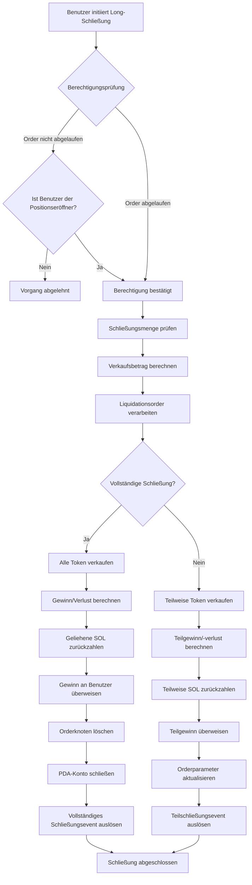
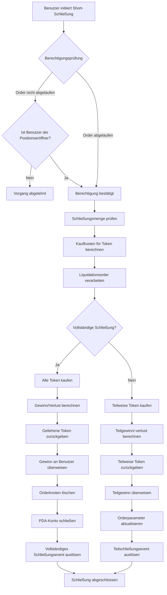

# 💼 PinPet Produkteinführung: Leverage-Positionsschließung

## 1. 📋 Funktionsübersicht

### 🤔 Was ist Positionsschließung?

Positionsschließung bezeichnet den Vorgang, bei dem ein Benutzer seine gehaltene Leverage-Handelsposition schließt. Auf der PinPet-Plattform wird beim Öffnen einer Position eine Margin-Order erstellt, die die Kreditbeziehung und Positionsinformationen aufzeichnet. Der Schließungsvorgang verrechnet diese Order, zahlt das Darlehen zurück und überweist Gewinne oder Verluste an den Benutzer.

### 💡 Warum ist Positionsschließung notwendig?

| Schließungsgrund | Erklärung |
|---------|------|
| **🎯 Take-Profit/Stop-Loss** | Benutzer schließt Position aktiv, um Gewinne zu sichern oder Verluste zu begrenzen |
| **⏰ Orderablauf** | Nach Ablauf kann jeder die Schließung auslösen, um geliehene Ressourcen zurückzugeben |
| **💰 Kapitalmanagement** | Freisetzung von Margin für flexible Anpassung der Handelsstrategie |
| **🛡️ Risikokontrolle** | Vermeidung größerer Verluste durch Marktschwankungen |

### 📊 Arten der Positionsschließung

- **🔚 Vollständige Schließung**: Schließt die gesamte Position auf einmal und verrechnet alle Gewinne/Verluste
- **✂️ Teilweise Schließung**: Schrittweises Schließen der Position, um Teilgewinne zu realisieren und die verbleibende Position zu behalten

## 2. 📈 Long-Position schließen (Close Long)

### 📝 Funktionsbeschreibung

Das Schließen einer Long-Position ist im Wesentlichen ein **Token-Verkaufsvorgang**. Der Benutzer hat beim Öffnen der Long-Position SOL geliehen und Token gekauft. Beim Schließen müssen die Token verkauft werden, um SOL zurückzuerhalten und das Darlehen zurückzuzahlen.

### 🔄 Ablaufdiagramm



### ⚙️ Wichtige Parameter

| Parametername | Verwendungszweck | Beispielwert |
|---------|---------|--------|
| `sell_token_amount` | Zu verkaufende Token-Menge (kein exakter Wert, kann geringfügig abweichen) | 1000000 (1 Token) |
| `min_sol_output` | Mindesterwartete SOL-Menge nach Verkauf (Slippage-Schutz) | 50000000 (0.05 SOL) |
| `prev_order_id` | Indexposition der vorherigen Order in der verketteten Liste | 2 |
| `close_order_id` | Index der zu schließenden Order im Order-Array | 5 |
| `next_order_id` | Indexposition der nächsten Order in der verketteten Liste | 7 |
| `close_order_address` | Adresse der zu schließenden Order (zur Sicherheitsüberprüfung) | "Abc123..." |

### 🧮 Gewinn-/Verlustberechnung

#### 🔚 Vollständige Schließung

**Berechnungsformel**:

```
Gewinn SOL = (Erhaltene SOL aus Verkauf) + (Margin SOL) - (Geliehene SOL)
```

**Berechnungsschritte**:
1. Alle gehaltenen Token verkaufen und SOL erhalten (nach Abzug der Gebühren)
2. Beim Öffnen hinterlegte Margin hinzufügen
3. Beim Öffnen geliehene SOL abziehen
4. Positiv = Gewinn, Negativ = Verlust

#### ✂️ Teilweise Schließung

**Berechnungsformel**:

```
Aktueller Gewinn = (Aktueller Verkaufserlös SOL) + (Gesamte Margin) + (Zukünftig verkaufbare SOL aus verbleibenden Token) - (Gesamtes Darlehen SOL)
```

**Berechnungsschritte**:
1. Aus diesem Verkauf erhaltene SOL berechnen
2. Aus verbleibenden Token zum neuen Stop-Loss-Preis verkaufbare SOL berechnen (nach Gebühren)
3. Gesamtvermögen = Aktuelle Einnahmen + Margin + Verbleibende erwartete Einnahmen
4. Gesamtes Darlehen abziehen, um Teilgewinn zu erhalten
5. Teilweise Darlehen zurückzahlen, verbleibende Margin bleibt in Position

### 💹 Gewinn-/Verlustszenarien im Vergleich

| Szenario | Eröffnungspreis | Schließungspreis | Gehaltene Token | Geliehene SOL | Margin | Verkaufserlös SOL | Gewinn/Verlust |
|------|---------|---------|---------|---------|--------|-------------|---------|
| **🟢 Gewinnszenario** | 0.05 SOL | 0.08 SOL | 100 Token | 5 SOL | 0.5 SOL | 8 SOL | +2.5 SOL |
| **🔴 Verlustszenario** | 0.05 SOL | 0.03 SOL | 100 Token | 5 SOL | 0.5 SOL | 3 SOL | -1.5 SOL |
| **⚖️ Break-Even-Szenario** | 0.05 SOL | 0.055 SOL | 100 Token | 5 SOL | 0.5 SOL | 5.5 SOL | 0 SOL |

## 3. 📉 Short-Position schließen (Close Short)

### 📝 Funktionsbeschreibung

Das Schließen einer Short-Position ist im Wesentlichen ein **Token-Kaufvorgang**. Der Benutzer hat beim Öffnen der Short-Position Token geliehen und verkauft, um SOL zu erhalten. Beim Schließen müssen mit SOL Token zurückgekauft werden, um das Darlehen zurückzuzahlen.

### 🔄 Ablaufdiagramm



### ⚙️ Wichtige Parameter

| Parametername | Verwendungszweck | Beispielwert |
|---------|---------|--------|
| `buy_token_amount` | Zu kaufende Token-Menge | 1000000 (1 Token) |
| `max_sol_amount` | Maximal zu zahlende SOL-Menge (Slippage-Schutz) | 60000000 (0.06 SOL) |
| `prev_order_id` | Indexposition der vorherigen Order in der verketteten Liste | 1 |
| `close_order_id` | Index der zu schließenden Order im Order-Array | 3 |
| `next_order_id` | Indexposition der nächsten Order in der verketteten Liste | 6 |
| `close_order_address` | Adresse der zu schließenden Order (zur Sicherheitsüberprüfung) | "Def456..." |

### 🧮 Gewinn-/Verlustberechnung

#### 🔚 Vollständige Schließung

**Berechnungsformel**:

```
Gewinn SOL = (Beim Öffnen erhaltene SOL aus Token-Verkauf inkl. Gebühren) - (Kosten für Rückkauf der Token beim Schließen) - (Gebühren)
```

**Berechnungsschritte**:
1. Mit SOL alle geliehenen Token zurückkaufen
2. Geliehene Token an den Leihpool zurückgeben
3. Berechnung: Verkaufserlös beim Öffnen - Kaufkosten beim Schließen - Gebühren
4. Positiv = Gewinn, Negativ = Verlust

#### ✂️ Teilweise Schließung

**Berechnungsformel**:

```
Aktueller Gewinn = (Aktuelles Rückkauf-Intervall inkl. Gebühren) - (Tatsächliche Rückkaufkosten SOL) - (Rückkaufgebühren)
```

**Berechnungsschritte**:
1. Kosten für Rückkauf der teilweisen Token berechnen (inkl. Gebühren)
2. Kosten für zukünftigen Rückkauf der verbleibenden Token berechnen (inkl. Gebühren)
3. Aktueller Gewinn = Sollkosten - Tatsächliche Kosten
4. Teilweise Token zurückgeben, Orderparameter aktualisieren
5. Verbleibende Margin bleibt in Position

### 💹 Gewinn-/Verlustszenarien im Vergleich

| Szenario | Eröffnungspreis | Schließungspreis | Geliehene Token | Verkaufserlös SOL | Margin | Rückkaufkosten SOL | Gewinn/Verlust |
|------|---------|---------|---------|-------------|--------|-------------|---------|
| **🟢 Gewinnszenario** | 0.08 SOL | 0.05 SOL | 100 Token | 8 SOL | 0.5 SOL | 5 SOL | +2.5 SOL |
| **🔴 Verlustszenario** | 0.05 SOL | 0.08 SOL | 100 Token | 5 SOL | 0.5 SOL | 8 SOL | -2.5 SOL |
| **⚖️ Break-Even-Szenario** | 0.06 SOL | 0.06 SOL | 100 Token | 6 SOL | 0.5 SOL | 6 SOL | -0.06 SOL (Gebühren) |

## 4. ⏰ Zeitpunkt und Strategie der Positionsschließung

### 🎯 Aktiver Schließungszeitpunkt

| Zeitpunkttyp | Anwendungsbereich | Empfohlene Strategie |
|---------|---------|---------|
| **📈 Take-Profit-Schließung** | Preis erreicht erwartetes Ziel | Teilweise Schließung zur Gewinnsicherung, verbleibende Position halten |
| **🛑 Stop-Loss-Schließung** | Preis fällt unter Stop-Loss | Rechtzeitige vollständige Schließung zur Verlustbegrenzung |
| **🔧 Positionsanpassung** | Veränderung des Markttrends | Position reduzieren oder erhöhen, Positionsstruktur optimieren |
| **⏳ Schließung vor Ablauf** | Nahe an Orderablaufzeit | Aktive Schließung zur Vermeidung von Zwangsliquidation |

### ⚡ Passive Schließung (Zwangsliquidation)

**Auslösebedingungen**:
- ⏰ Orderablaufzeit ist überschritten
- 👥 Jeder Benutzer kann Liquidation auslösen
- 💵 Liquidierer kann eine Gebührenbelohnung erhalten

**⚠️ Risikohinweis**:
- 📉 Nach Ablauf kann Zwangsschließung zu ungünstigem Preis erfolgen
- 💡 Empfehlung: Position vor Ablauf aktiv verwalten

## 5. 📖 Anwendungsbeispiele

### 🟢 Szenario 1: Long-Position mit Gewinn schließen

**Hintergrund**:
- Benutzer eröffnet Long-Position zu 0.05 SOL, kauft 100 Token
- Leiht 4.5 SOL, zahlt 0.5 SOL Margin
- Aktueller Preis steigt auf 0.08 SOL

**Vorgang**:
1. Benutzer entscheidet sich für vollständige Schließung zur Gewinnsicherung
2. Verkauft 100 Token, erhält ca. 8 SOL (nach Gebührenabzug)
3. Zahlt 4.5 SOL Darlehen zurück
4. Erhält 0.5 SOL Margin zurück
5. Nettogewinn: 8 - 4.5 + 0.5 (Margin bereits bei Eröffnung einkalkuliert) = ca. 3 SOL

**✅ Ergebnis**: Erfolgreiche Erzielung von 60% Rendite

### 🔴 Szenario 2: Short-Position mit Stop-Loss schließen

**Hintergrund**:
- Benutzer eröffnet Short-Position zu 0.05 SOL, leiht und verkauft 100 Token, erhält 5 SOL
- Zahlt 0.5 SOL Margin
- Preis steigt auf 0.08 SOL, Stop-Loss erreicht

**Vorgang**:
1. Benutzer schließt notfallmäßig mit Stop-Loss
2. Kauft mit 8 SOL 100 Token zurück (inkl. Gebühren)
3. Gibt 100 Token an Leihpool zurück
4. Margin 0.5 SOL + Verkaufserlös beim Öffnen 5 SOL = 5.5 SOL verfügbare Mittel
5. Nettoverlust: 5.5 - 8 = -2.5 SOL

**✅ Ergebnis**: Rechtzeitiger Stop-Loss, größere Verluste vermieden

### ✂️ Szenario 3: Teilweise Schließung zur Positionsanpassung

**Hintergrund**:
- Benutzer hält Long-Position mit 200 Token
- Preis ist bereits um 30% gestiegen
- Benutzer möchte Teilgewinn sichern, aber weiter halten wegen positiver Erwartung

**Vorgang**:
1. Teilweise Schließung von 100 Token
2. Teilweise SOL-Darlehen zurückzahlen
3. Teilgewinn auf Konto erhalten
4. Verbleibende 100 Token bleiben in Position
5. Orderparameter aktualisiert, Stop-Loss-Preis angepasst

**✅ Ergebnis**: Flexible Positionsverwaltungsstrategie umgesetzt

## 6. ⚠️ Wichtige Hinweise und Einschränkungen

### 🚫 Betriebsbeschränkungen

| Beschränkungstyp | Spezifische Anforderung | Erklärung |
|---------|---------|------|
| **🔐 Berechtigungsprüfung** | Vor Ablauf der Order kann nur der Eröffner schließen | Schutz der Benutzervermögen |
| **💳 Abrechnungsadresse** | Muss die Wallet-Adresse des Eröffners sein | Gelder können nur an ursprüngliche Adresse zurück |
| **📏 Mindesthandelsvolumen** | Bei teilweiser Schließung nicht unter dem 2-fachen Mindesthandelsvolumen | Vermeidung von Dust-Orders |
| **📊 Verbleibende Menge** | Nach teilweiser Schließung nicht weniger als Mindesthandelsvolumen | Gewährleistung der Ordergültigkeit |

### ⚠️ Risikohinweise

#### 📉 Slippage-Risiko
- Der tatsächliche Ausführungspreis beim Schließen kann von der Erwartung abweichen
- Empfehlung: Angemessene Slippage-Schutzparameter festlegen
- Bei großen Schließungen ist Slippage-Einfluss deutlicher

#### 💸 Gebührenkosten
- Jede Schließung erfordert Zahlung von Transaktionsgebühren
- Häufiges Schließen erhöht die Kosten
- Teilweise Schließung erfordert zwei Gebühren (aktuell + zukünftige vollständige Schließung)

#### ⏰ Zeitrisiko
- Nach Ablauf kann jeder die Schließung auslösen
- Mögliche Liquidation zu ungünstigem Preis
- Empfehlung: Orders, die bald ablaufen, rechtzeitig verwalten

#### 🌊 Marktrisiko
- Schnelle Preisschwankungen können zu ungünstigem Schließungszeitpunkt führen
- In extremen Marktlagen kann Liquidation eintreten
- Empfehlung: Angemessenen Stop-Loss festlegen

### 💡 Best-Practice-Empfehlungen

1. **🛡️ Angemessenen Stop-Loss festlegen**: Bereits bei Eröffnung Stop-Loss-Preis planen und strikt einhalten
2. **✂️ Gestaffelte Schließung**: Bei großen Positionen gestaffelte Schließung empfohlen, um Marktauswirkung zu reduzieren
3. **⏰ Ablaufzeit beachten**: 1-2 Tage vor Ablauf Orders aktiv verwalten
4. **💰 Gebühren kontrollieren**: Zu häufige teilweise Schließungen vermeiden
5. **📊 Markttiefe überwachen**: Vor großen Schließungen Marktliquidität prüfen

### 🔒 Technische Sicherheitsgarantien

- **✅ Adressvalidierung**: Bei Schließung wird Orderadresse validiert, um Fehler bei falscher Order zu verhindern
- **🔐 Berechtigungsprüfung**: Mehrfache Berechtigungsprüfung, um sicherzustellen, dass nur autorisierte Benutzer agieren können
- **🛡️ Überlaufschutz**: Alle numerischen Berechnungen verwenden sichere checked-Methoden
- **⚛️ Atomare Operationen**: Alle Schritte im Schließungsprozess werden atomar ausgeführt, um Zustandsinkonsistenzen zu verhindern

---

## 📚 Anhang: Begriffserklärungen

| Begriff | Erklärung |
|------|------|
| **PDA** | Program Derived Address, programmabgeleitete Adresse zur Speicherung von Orderdaten |
| **Margin** | Beim Öffnen der Position vom Benutzer hinterlegte SOL als Risikoabsicherung |
| **Leihpool** | Virtueller Pool, der Leverage-Mittel bereitstellt |
| **Stop-Loss-Preis** | Preisschwellenwert, bei dem Order zwangsweise geschlossen wird |
| **Gebührenrabatt** | Gebührenvergünstigung bei Erfüllung bestimmter Bedingungen |
| **Zwangsliquidation** | Mechanismus zur automatischen Schließung nach Orderablauf |
| **Listen-Knoten** | Position der Order in der verketteten Liste für effiziente Verwaltung mehrerer Orders |

---

*Dieses Dokument ist eine Produkteinführung und enthält keine technischen Implementierungsdetails. Für technische Implementierung siehe Projektcode und technische Dokumentation.*
