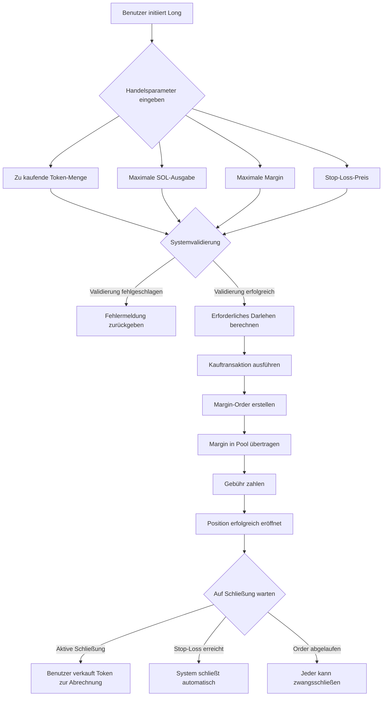
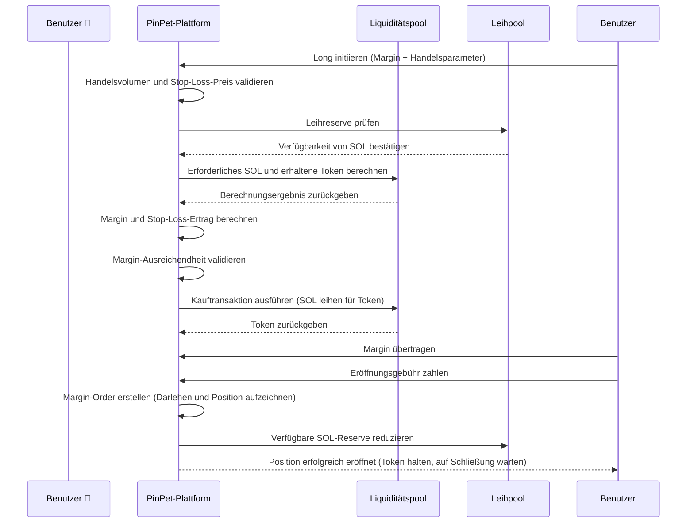
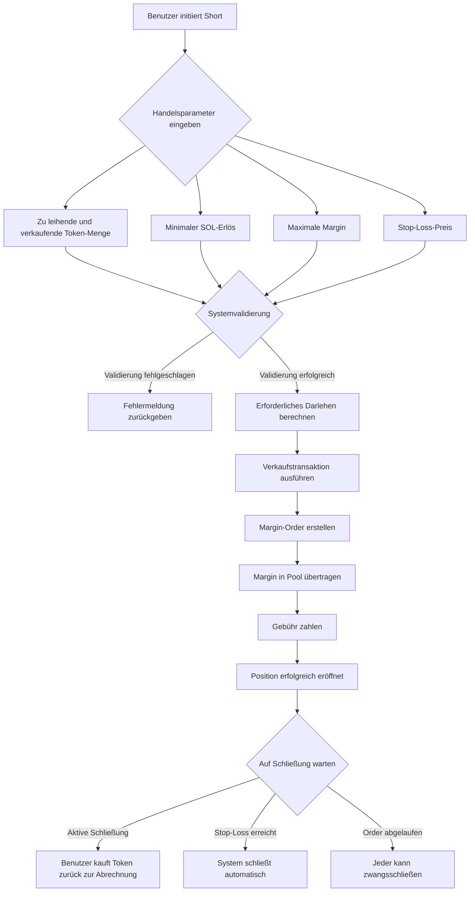
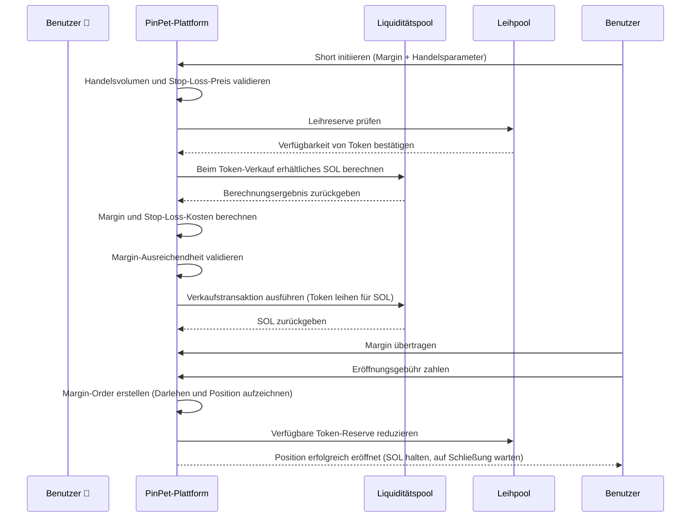
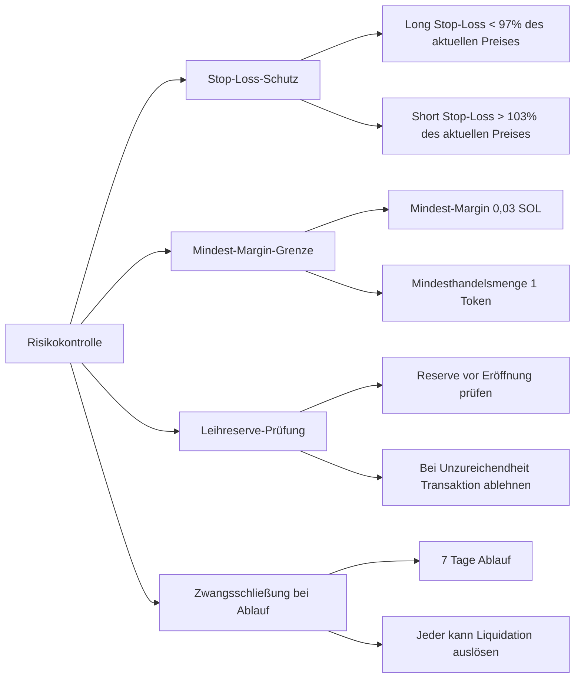

# 📊 PinPet Hebelhandel-Funktionsprodukteinführung

## 1. Funktionsübersicht 🎯

### Was ist Hebelhandel 💹

Hebelhandel ist ein Finanzinstrument, das geliehene Mittel nutzt, um das Handelsvolumen zu vergrößern, und es Benutzern ermöglicht, mit geringerer Margin größere Vermögenswerte zu kontrollieren. Die PinPet-Plattform bietet sowohl Long- als auch Short-Hebelhandel an, sodass Benutzer sowohl bei steigenden als auch bei fallenden Token-Preisen profitieren können.

### Kernkonzepte 💡

- **Margin (Sicherheitsleistung)** 💰: Das vom Benutzer investierte SOL-Kapital als Sicherheit für den Handel
- **Borrow (Darlehen)** 💵: Von der Plattform geliehene Vermögenswerte (Long leiht SOL, Short leiht Token)
- **Stop Loss Price (Stop-Loss-Preis)** 🛡️: Wenn dieser Preis erreicht wird, schließt das System automatisch die Position zur Risikokontrolle
- **Close Position (Position schließen)** 🔄: Vorgang zur Rückzahlung des Darlehens und Abrechnung von Gewinnen/Verlusten

### Hebelarten 📈📉

| Handelstyp | Markterwartung | Geliehener Vermögenswert | Gehaltener Vermögenswert | Gewinnbedingung |
|---------|---------|---------|---------|---------|
| Long (Kaufposition) 🟢 | Bullish ⬆️ | SOL leihen | Token halten | Token-Preis steigt |
| Short (Verkaufsposition) 🔴 | Bearish ⬇️ | Token leihen | SOL halten | Token-Preis fällt |

---

## 2. Long-Handel (Kaufposition) 🟢📈

### Funktionsbeschreibung ✨

Long bedeutet, dass der Benutzer auf einen zukünftigen Preisanstieg des Tokens setzt, indem er SOL von der Plattform leiht, um mehr Token zu kaufen. Nach dem Preisanstieg werden die Token verkauft, das Darlehen zurückgezahlt und ein Gewinn erzielt.

### Benutzer-Workflow 🔄



### Long-Handels-Ablaufdiagramm 📋



### Schlüsselparameter-Erklärung 📝

| Parametername | Beschreibung | Beispielwert | Einschränkungen |
|---------|------|--------|---------|
| buy_token_amount | Gewünschte Token-Kaufmenge | 1.000.000 (1 Token) | Nicht unter Mindesthandelsmenge (1 Token) |
| max_sol_amount | Maximale zu zahlende SOL-Menge | 100.000.000 (0,1 SOL) | Tatsächlich möglicherweise weniger (Slippage-Schutz) |
| margin_sol_max | Maximale Benutzer-Margin | 50.000.000 (0,05 SOL) | Nicht unter 0,03 SOL |
| close_price | Stop-Loss-Preis (automatischer Schließauslöser) | 95% des aktuellen Preises | Muss unter 97% des aktuellen Preises liegen |
| borrow_amount | Vom System berechnete tatsächliche Darlehensmenge | 50.000.000 (0,05 SOL) | Darf Leihpool-Reserve nicht überschreiten |
| position_asset_amount | Gehaltene Token-Menge | 1.000.000 (1 Token) | Entspricht gekauften Token |

### Margin-Berechnungslogik 🧮

Die Margin dient dazu, sicherzustellen, dass der Benutzer beim Stop-Loss das Darlehen zurückzahlen kann. Die Berechnungsformel lautet:

```
Tatsächliche Margin = Gesamtkosten für Token-Kauf - Erlös bei Stop-Loss-Schließung (nach Abzug der Gebühren)
```

**Beispiel:**

Angenommen, der aktuelle Token-Preis beträgt 0,1 SOL/Token:

1. Benutzer möchte 1 Token kaufen, benötigt ca. 0,1 SOL
2. Benutzer investiert 0,05 SOL Margin, leiht 0,05 SOL
3. Stop-Loss-Preis auf 0,095 SOL/Token (95% des aktuellen Preises) gesetzt
4. System berechnet: Verkauf von 1 Token bei 0,095, nach Abzug der Gebühren ca. 0,0945 SOL
5. Margin berechnen: 0,1 - 0,0945 = 0,0055 SOL (erforderliche Margin)
6. Vom Benutzer bereitgestellte 0,05 SOL > 0,0055 SOL, Eröffnungsbedingung erfüllt

### Risikohinweise ⚠️

- **Stop-Loss-Auslösung** 🛑: Wenn der Token-Preis auf den Stop-Loss-Preis fällt, verkauft das System automatisch Token zur Darlehensrückzahlung, Benutzer verliert Margin
- **Order-Ablauf** ⏰: Nach Ablauf der Leihfrist (Standard 7 Tage) ohne Schließung kann jeder zwangsschließen, möglicherweise zu ungünstigem Preis
- **Leihkosten** 💸: Sowohl Eröffnung als auch Schließung erfordern Gebühren (Standard 0,25%)

---

## 3. Short-Handel (Verkaufsposition) 🔴📉

### Funktionsbeschreibung ✨

Short bedeutet, dass der Benutzer auf einen zukünftigen Preisrückgang des Tokens setzt, indem er Token von der Plattform leiht und sofort gegen SOL verkauft. Nach dem Preisrückgang werden Token zurückgekauft, das Darlehen zurückgezahlt und ein Gewinn erzielt.

### Benutzer-Workflow 🔄



### Short-Handels-Ablaufdiagramm 📋



### Schlüsselparameter-Erklärung 📝

| Parametername | Beschreibung | Beispielwert | Einschränkungen |
|---------|------|--------|---------|
| borrow_sell_token_amount | Gewünschte zu leihende und verkaufende Token-Menge | 1.000.000 (1 Token) | Nicht unter Mindesthandelsmenge (1 Token) |
| min_sol_output | Erwarteter minimaler SOL-Erlös nach Verkauf | 90.000.000 (0,09 SOL) | Tatsächlich möglicherweise mehr (Slippage-Schutz) |
| margin_sol_max | Maximale Benutzer-Margin | 50.000.000 (0,05 SOL) | Nicht unter 0,03 SOL |
| close_price | Stop-Loss-Preis (automatischer Schließauslöser) | 105% des aktuellen Preises | Muss über 103% des aktuellen Preises liegen |
| borrow_amount | Vom System berechnete tatsächliche Darlehensmenge | 1.000.000 (1 Token) | Darf Leihpool-Reserve nicht überschreiten |
| position_asset_amount | Gehaltene SOL-Menge | 95.000.000 (0,095 SOL) | Entspricht erhaltener SOL nach Verkauf (nach Gebühren) |

### Margin-Berechnungslogik 🧮

Die Short-Margin dient dazu, sicherzustellen, dass der Benutzer beim Stop-Loss Token zurückkaufen kann, um das Darlehen zurückzuzahlen. Die Berechnungsformel lautet:

```
Tatsächliche Margin = Rückkaufkosten bei Stop-Loss (inkl. Gebühren) - Erlös beim Verkauf (nach Gebühren)
```

**Beispiel:**

Angenommen, der aktuelle Token-Preis beträgt 0,1 SOL/Token:

1. Benutzer leiht 1 Token und verkauft, erhält nach Gebühren ca. 0,0975 SOL
2. Stop-Loss-Preis auf 0,105 SOL/Token (105% des aktuellen Preises) gesetzt
3. System berechnet: Rückkauf von 1 Token bei 0,105, mit Gebühren ca. 0,1053 SOL erforderlich
4. Margin berechnen: 0,1053 - 0,0975 = 0,0078 SOL (erforderliche Margin)
5. Benutzer muss mindestens 0,0078 SOL als Margin investieren
6. Benutzer stellt 0,05 SOL Margin bereit, > 0,0078 SOL, Eröffnungsbedingung erfüllt

### Risikohinweise ⚠️

- **Stop-Loss-Auslösung** 🛑: Wenn der Token-Preis auf den Stop-Loss-Preis steigt, kauft das System automatisch Token zurück zur Darlehensrückzahlung, Benutzer verliert Margin
- **Unbegrenztes Risiko** ⛔: Theoretisch kann der Token-Preis unbegrenzt steigen, Short-Risiko ist höher als Long
- **Order-Ablauf** ⏰: Nach Ablauf der Leihfrist (Standard 7 Tage) ohne Schließung kann jeder zwangsschließen
- **Leihkosten** 💸: Sowohl Eröffnung als auch Schließung erfordern Gebühren (Standard 0,25%)

---

## 4. Risiken und Gewinne des Hebelhandels 📊💰

### Gewinnverstärkungseffekt 📈💎

Der Kernvorteil des Hebelhandels besteht darin, mit weniger Kapital größere Vermögenswerte zu kontrollieren und dadurch Gewinne zu verstärken.

**Long-Gewinn-Beispiel:**

Angenommen, Benutzer investiert 0,05 SOL Margin für Long von 1 Token:

| Szenario | Eröffnungspreis | Schließpreis | Positionswert | Rückzahlungsbetrag | Nettogewinn | Rendite |
|------|--------|--------|----------|----------|--------|--------|
| Leichter Anstieg | 0,1 | 0,11 | 0,11 SOL | 0,05 SOL | 0,06 SOL | +120% |
| Starker Anstieg | 0,1 | 0,15 | 0,15 SOL | 0,05 SOL | 0,10 SOL | +200% |
| Leichter Rückgang | 0,1 | 0,095 | 0,095 SOL | 0,05 SOL | 0,045 SOL | -10% |
| Stop-Loss ausgelöst | 0,1 | 0,095 | 0,095 SOL | 0,05 SOL | 0,045 SOL | -10% |

**Short-Gewinn-Beispiel:**

Angenommen, Benutzer investiert 0,05 SOL Margin für Short von 1 Token:

| Szenario | Eröffnungspreis | Schließpreis | Positionswert | Rückkaufkosten | Nettogewinn | Rendite |
|------|--------|--------|----------|----------|--------|--------|
| Leichter Rückgang | 0,1 | 0,09 | 0,0975 SOL | 0,09 SOL | 0,0075 SOL | +15% |
| Starker Rückgang | 0,1 | 0,05 | 0,0975 SOL | 0,05 SOL | 0,0475 SOL | +95% |
| Leichter Anstieg | 0,1 | 0,105 | 0,0975 SOL | 0,105 SOL | -0,0075 SOL | -15% |
| Stop-Loss ausgelöst | 0,1 | 0,105 | 0,0975 SOL | 0,1053 SOL | -0,0078 SOL | -16% |

### Risikofaktoren ⚠️

#### 1. Preisvolatilitätsrisiko 📉📈

- **Long-Risiko** 🟢: Token-Preis fällt über Stop-Loss-Preis hinaus, gesamte Margin geht verloren
- **Short-Risiko** 🔴: Token-Preis steigt über Stop-Loss-Preis hinaus, gesamte Margin geht verloren
- **Starke Volatilität** ⚡: Schnelle Preisschwankungen können zu schnellem Stop-Loss führen

#### 2. Liquiditätsrisiko 💧

- **Leihpool-Erschöpfung** 📛: Wenn Leihpool-Reserve unzureichend ist, kann Position nicht eröffnet werden
- **Slippage-Verlust** 📊: Zu großes Handelsvolumen kann zu tatsächlichem Ausführungspreis abweichend von Erwartung führen

#### 3. Zeitrisiko ⏰

- **Order-Ablauf** 🔔: Nach 7 Tagen ohne Schließung kann jeder zwangsschließen, möglicherweise zu ungünstigem Preis
- **Haltekosten** 💸: Langfristige Positionen haben Zeitkosten und Marktunsicherheit

#### 4. Systemrisiko 🔧

- **Preisberechnung** 🧮: Basierend auf Constant-Product-Algorithmus, große Transaktionen können größere Slippage haben
- **Gebührenkumulation** 💰: Mehrfaches Öffnen/Schließen kumuliert Gebühren und erodiert Gewinne

### Risikokontrollmaßnahmen 🛡️

Die PinPet-Plattform bietet mehrere Risikokontrollmechanismen:



---

## 5. Anwendungsbeispiele 💼

### Szenario 1: Bullische Long-Position 🟢⬆️

**Hintergrund** 📖: Xiaoming sieht einen Aufwärtstrend bei einem Meme-Token, aktueller Preis 0,1 SOL

**Schritte** 🎯:
1. Xiaoming investiert 0,1 SOL Margin
2. Leiht 0,1 SOL (Plattform leiht an Xiaoming)
3. Kauft mit insgesamt 0,2 SOL 2 Token
4. Setzt Stop-Loss-Preis auf 0,095 SOL (automatischer Stop bei Unterschreitung)

**Gewinnsituation** 💰📈: Token steigt auf 0,15 SOL
- Verkauf von 2 Token ergibt 0,3 SOL (nach Gebühren ca. 0,2985 SOL)
- Rückzahlung von 0,1 SOL Darlehen, verbleiben 0,1985 SOL
- Nach Abzug von 0,1 SOL Margin, Nettogewinn 0,0985 SOL (ca. +98,5%)

**Stop-Loss-Situation** 🛑📉: Token fällt auf 0,095 SOL (Stop-Loss ausgelöst)
- Automatischer Verkauf von 2 Token ergibt 0,19 SOL (nach Gebühren ca. 0,1895 SOL)
- Rückzahlung von 0,1 SOL Darlehen, verbleiben 0,0895 SOL
- Margin-Verlust 0,1 - 0,0895 = 0,0105 SOL (ca. -10,5%)

### Szenario 2: Bearische Short-Position 🔴⬇️

**Hintergrund** 📖: Xiaohong hält den Token-Preis für überhöht, aktueller Preis 0,2 SOL, bereitet Short vor

**Schritte** 🎯:
1. Xiaohong investiert 0,15 SOL Margin
2. Leiht 1 Token (Plattform leiht an Xiaohong)
3. Verkauft sofort 1 Token für 0,2 SOL (nach Gebühren ca. 0,195 SOL)
4. Setzt Stop-Loss-Preis auf 0,21 SOL (automatischer Stop bei Überschreitung)

**Gewinnsituation** 💰📉: Token fällt auf 0,15 SOL
- Rückkauf von 1 Token mit 0,15 SOL (inkl. Gebühren ca. 0,1504 SOL)
- Rückzahlung von 1 Token Darlehen
- Verbleiben 0,195 - 0,1504 = 0,0446 SOL
- Plus 0,15 SOL Margin, gesamt 0,1946 SOL (Nettogewinn 0,0446 SOL, ca. +29,7%)

**Stop-Loss-Situation** 🛑📈: Token steigt auf 0,21 SOL (Stop-Loss ausgelöst)
- Automatischer Rückkauf von 1 Token mit 0,21 SOL (inkl. Gebühren ca. 0,2105 SOL)
- Rückzahlung von 1 Token Darlehen
- Ausgaben 0,2105 SOL, aber beim Verkauf nur 0,195 SOL erhalten
- Verlust 0,0155 SOL, Margin abgezogen (ca. -10,3%)

### Szenario 3: Swing-Trading 🔄📊

**Hintergrund** 📖: Xiaogang ist gut im Kurzfristhandel, bei Token-Preis 0,08 - 0,12 SOL Bereich wiederholt operieren

**Strategie** 🎯:
- Bei Preis nahe 0,08 SOL Long, Stop-Loss 0,075 SOL setzen
- Bei Preis nahe 0,12 SOL Short, Stop-Loss 0,125 SOL setzen
- Bei 5-10% Gewinn aktiv Position schließen

**Vorteil** ✅: Hebel nutzen, um Bereichsschwankungsgewinne zu verstärken

**Risiko** ⚠️: Bei Durchbruch des Bereichs möglicher Stop-Loss, strenge Disziplin erforderlich

---

## 6. Hinweise und Einschränkungen 📌

### Handelsbeschränkungen 🔒

| Beschränkungsposten | Wert | Beschreibung |
|---------|------|------|
| Mindest-Token-Handelsmenge | 1 Token (1.000.000 Mindesteinheiten) | Zu kleines Handelsvolumen vermeiden |
| Mindest-Margin | 0,03 SOL (30.000.000 Lamports) | Sinnvolle Handelsgröße garantieren |
| Long Stop-Loss-Preis | Unter 97% des aktuellen Preises | Mindestens 3% Stop-Loss-Raum |
| Short Stop-Loss-Preis | Über 103% des aktuellen Preises | Mindestens 3% Stop-Loss-Raum |
| Maximale Leihfrist | 7 Tage (604.800 Sekunden) | Nach Ablauf zwangsschließbar |
| Leihpool-Obergrenze | Dynamisch angepasst nach Liquiditätspool-Größe | Bei unzureichender Reserve Transaktion ablehnen |

### Gebührenerklärung 💸

**Gebührenarten** 📊:
- Eröffnungsgebühr: Standard 0,25% (borrow_fee)
- Schließungsgebühr: Standard 0,25% (borrow_fee)
- Gebührenverteilung: Partner und Technologieanbieter anteilig

**Gebührenberechnung** 🧮:
- Long-Eröffnung: Gebühr auf SOL-Kaufbetrag
- Short-Eröffnung: Gebühr auf SOL-Verkaufsbetrag
- Schließung: Gebühr auf Transaktionsbetrag

### Best-Practice-Empfehlungen 💡

#### 1. Stop-Loss vernünftig setzen 🛡️

- **Nicht zu gierig sein**: Stop-Loss-Preis nicht zu nah setzen (nahe 3% Untergrenze)
- **Pufferraum lassen**: Kurzfristige Schwankungen berücksichtigen, 5-10% Stop-Loss-Raum ist sicherer
- **Rechtzeitig Gewinn mitnehmen**: Bei erwartetem Gewinn aktiv schließen, nicht auf Zwangsschließung warten

#### 2. Positionsgröße kontrollieren 📊

- **Diversifizierung** 🎯: Nicht alle Mittel in eine Order investieren
- **Schrittweise Position aufbauen** ➡️: Mehrfach kleine Beträge eröffnen, einzelnes Risiko reduzieren
- **Mittel reservieren** 💰: Teil der Mittel für zusätzliche Margin reservieren (zukünftige Funktion)

#### 3. Richtigen Zeitpunkt wählen ⏰

- **Ausreichende Liquidität** 💧: Bei ausreichender Leihpool-Reserve eröffnen
- **Starke Volatilität vermeiden** ⚡: Bei starken Preisschwankungen leicht Stop-Loss ausgelöst
- **Ablaufzeit beachten** 🔔: Geplante Haltezeit nicht nahe 7-Tage-Grenze

#### 4. Order-Status überwachen 👀

- **Regelmäßig prüfen** 🔍: Mindestens einmal täglich Order-Status überprüfen
- **Preiswarnung** 🚨: Bei Annäherung an Stop-Loss-Preis rechtzeitig entscheiden
- **Aktiv schließen** ✅: Nicht auf automatischen Stop-Loss warten, aktives Schließen vermeidet Slippage

### Häufig gestellte Fragen ❓

**F1: Wird die Margin zurückerstattet?**

A: Ja. Bei aktiver Schließung mit Gewinn werden Margin plus Gewinn zurückerstattet; bei Stop-Loss-Auslösung wird verbleibende Margin zurückerstattet (möglicherweise null).

**F2: Kann vorzeitig geschlossen werden?**

A: Ja. Vor Order-Ablauf kann der Benutzer jederzeit aktiv schließen, ohne zusätzliche Strafe.

**F3: Was passiert nach Order-Ablauf?**

A: Nach Order-Ablauf kann jeder Zwangsschließung auslösen. Empfohlen wird aktives Schließen vor Ablauf, um Liquidation zu ungünstigem Preis zu vermeiden.

**F4: Was tun bei unzureichender Leihpool-Reserve?**

A: Bei unzureichender Leihpool-Reserve lehnt das System die Eröffnung ab. Empfohlen wird zu warten, bis andere Benutzer schließen und Reserve freigeben, oder anderes Handelspaar wählen.

**F5: Wie werden Gebühren berechnet?**

A: Gebühren werden nach einem bestimmten Prozentsatz des Transaktionsbetrags erhoben (Standard 0,25%). Eröffnung und Schließung je einmal, gesamt ca. 0,5% Kosten.

**F6: Kann der Stop-Loss-Preis angepasst werden?**

A: Die aktuelle Version unterstützt keine Stop-Loss-Preis-Anpassung. Empfohlen wird sorgfältiges Setzen des Stop-Loss-Preises bei Eröffnung.

---

## 7. Zusammenfassung 📝

Die PinPet-Hebelhandel-Funktion bietet Benutzern flexible Long- und Short-Tools, um sowohl bei steigenden als auch bei fallenden Token-Preisen zu profitieren. Durch vernünftige Nutzung von Margin und Stop-Loss-Mechanismus können Benutzer Gewinne verstärken und gleichzeitig Risiken kontrollieren.

**Kernvorteile** ✨:
- **Bidirektionaler Handel** 🔄: Long und Short beide profitabel
- **Hebelverstärkung** 📈: Kleines Kapital für große Gewinne nutzen
- **Automatischer Stop-Loss** 🛡️: Preisschutzmechanismus reduziert Risiko
- **Flexible Schließung** ✅: Jederzeit aktiv abrechnen

**Risikowarnung** ⚠️:
- ⛔ Hebelhandel hat hohes Risiko, kann gesamte Margin verlieren
- 📚 Bitte Handelsmechanismus vollständig verstehen vor Operation
- 💡 Empfohlen mit kleinen Beträgen beginnen, schrittweise Erfahrung sammeln
- 🚫 Niemals über Tragfähigkeit hinaus investieren

Viel Erfolg beim Handeln! 🎉
