# 🚀 PinPet.fun | Fusionsbasierte Handelsengine: DeFi-Handelsinfrastruktur neu definiert

## Weltweit erste Innovation · Perfekte Fusion von AMM × Automatischem Kreditpool

---

## 💎 Was haben wir entwickelt?

**PinPet.fun integriert Spot-AMM tiefgreifend mit dem Automatischen Kreditpool (ALP) und schließt in einer einzigen Transaktion den vollständigen Kreislauf von "Kauf/Verkauf, Hebelwirkung öffnen/schließen, automatische Liquidation, Kapitalrückfluss" ab.**

Dies ist keine einfache Funktionsstapelung, sondern eine Neugestaltung der zugrunde liegenden Protokollarchitektur:

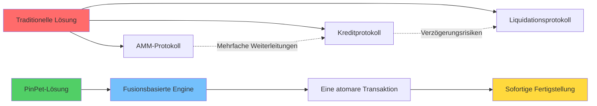

**In der Richtung "AMM-Handel + Automatischer Kreditpool" ist dies weltweit die erste Innovation und einzigartig.**

---

## 🧠 Technische Vision: Warum ist PinPet-Technologie herausragend?

### Kern-Innovationsarchitektur

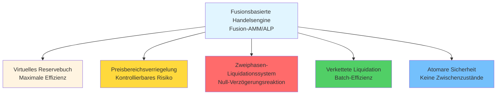

### Sechs technologische Durchbrüche

#### 1️⃣ Fusionsbasierte Architektur
**Kombination von "Preis und Ausführung" des AMM mit "Hebelwirkung und Kapital" des ALP in einer atomaren Transaktion**
- ✅ Beseitigung der Verzögerung durch Multi-Protokoll-Integration
- ✅ Beseitigung der Unsicherheit bei Gegenparteien
- ✅ Eine Transaktion für alle Operationen

#### 2️⃣ Virtuelles Reservebuch (Mirror Reserve Ledger)
**Der Kreditpool verwendet "virtuelle Reserven" für die Buchhaltung, tatsächliche Mittel werden mit dem Spot-Pool geteilt, sind aber logisch isoliert**
- ✅ Null zusätzliche Kapitalzuführung, maximale Kapitaleffizienz
- ✅ Vollständige Risikoisolierung, keine Auswirkung auf Spot-Handel
- ✅ Innovatives Design "gleiche Quelle, unterschiedliche Konten"

#### 3️⃣ Bereichsverankerung (PriceLock Anchor)
**Jede Hebelposition verriegelt einen Preisbereich, extreme Marktbedingungen können trotzdem innerhalb des vordefinierten Bereichs abgewickelt werden**
- ✅ Garantiert "schließbar, gut schließbar, nachvollziehbar"
- ✅ Schlusskurs im Voraus festgelegt, kein Slippage-Risiko
- ✅ Orderrisiko in einem liquidierbaren Preiskorridor verankert

#### 4️⃣ Zweiphasen-Risikokontrolle (Bi-Trigger Liquidation)
**Ablaufbasierte Zwangsliquidation (zeitbasiert) + Stop-Loss-Liquidation (preisbasiert) Doppelschutz**
- ⚡ Zeitbasierter Trigger: Order abgelaufen, jeder kann liquidieren, Liquidator erhält Anreiz
- ⚡ Preisbasierter Trigger: Passiv im Handel anderer ausgeführt, keine Wächterknoten erforderlich
- ⚡ Doppelte Absicherung, Liquidation auch bei extremen Marktbedingungen

#### 5️⃣ Verkettete Liquidationsengine (Chrono-Liquidator)
**Basierend auf bidirektionalen Listen, effiziente Durchquerung nach Preisreihenfolge, ideal für "Kettenreaktions-Liquidation" und Batch-Verarbeitung**
- 🔥 Long-Liste (Down): Liquidation von hoch nach niedrig
- 🔥 Short-Liste (Up): Liquidation von niedrig nach hoch
- 🔥 Stabiler vorhersehbarer Durchsatz, eine Transaktion kann mehrere Orders liquidieren

#### 6️⃣ Atomare Sicherheit
**Alle Berechnungen verwenden hohe Präzision und sichere numerische Prüfungen, Abwicklungspfad wird on-chain atomar ausgeführt**
- 🛡️ 100% Verwendung von checked_* Methoden, verhindert Überlauf
- 🛡️ Fehler führen zu Rollback, keine Zwischenzustände
- 🛡️ PDA-Konten werden rechtzeitig geschlossen, Miete automatisch zurückerstattet

---

## 💡 Schlüsseltechnologien, die wir erfunden haben

### 1. Fusionsbasierte Market-Making-Engine (Fusion-AMM/ALP Engine)
**Definition:** Ausführungsparadigma, bei dem AMM-Ausführung und Kreditvergabe/-rückzahlung in derselben Transaktion abgeschlossen werden.

**Bedeutung:** Dies ist das erste Mal, dass On-Chain eine echte Fusion von Spot- und Hebelhandel realisiert wurde, nicht durch API-Aufrufe, sondern durch Vereinheitlichung des zugrunde liegenden Protokolls.

### 2. Spiegelreservebuch (Mirror Reserve Ledger, MRL)
**Definition:** Mapping der Kreditverfügbarkeit durch virtuelle Reserven, Mittel "gleiche Quelle, unterschiedliche Konten" mit dem Spot-Pool.

**Bedeutung:** Löst das Problem der Kapitalauslastung im DeFi-Bereich, ermöglicht es einem Kapitalpool, sowohl Spot- als auch Hebelhandel zu bedienen.

### 3. Preisanker (PriceLock Anchor)
**Definition:** Verankerung des Orderrisikos in einem liquidierbaren Preiskorridor, garantiert Liquiditätsverfügbarkeit bei Schließung.

**Bedeutung:** Dies ist die Determinismus-Garantie für DeFi-Hebelhandel, ermöglicht normale Liquidation selbst unter extremen Marktbedingungen.

### 4. Zweiphasen-Liquidation (Bi-Trigger Liquidation)
**Definition:** Doppelter Schutzmechanismus durch zeitbasierte Zwangsliquidation + preisbasierte Stop-Loss-Liquidation.

**Bedeutung:** Erstmals passive preisbasierte Liquidation implementiert, ohne externe Orakel oder Wächterknoten.

### 5. Chronologische Liquidationsengine (Chrono-Liquidator)
**Definition:** Sequenzielle Liquidationsausführung basierend auf bidirektionalen Listen, geeignet für Kettenreaktions- und Batch-Liquidationen.

**Bedeutung:** Realisiert effiziente Batch-Liquidationen on-chain, Gas-Kosten um 50% reduziert.

### 6. Reflexiver Liquiditätsrückfluss (Reflex Liquidity Return)
**Definition:** Durch Liquidation freigesetzte Liquidität fließt sofort in die Spot-Tiefe zurück, unterdrückt extremes Slippage.

**Bedeutung:** Macht Liquidationsaktionen zu einem Liquiditätszufluss statt -abfluss, bildet einen positiven Kreislauf.

---

## 🔬 Wie haben wir "weltweit erste Innovation" erreicht?

### Probleme traditioneller Lösungen

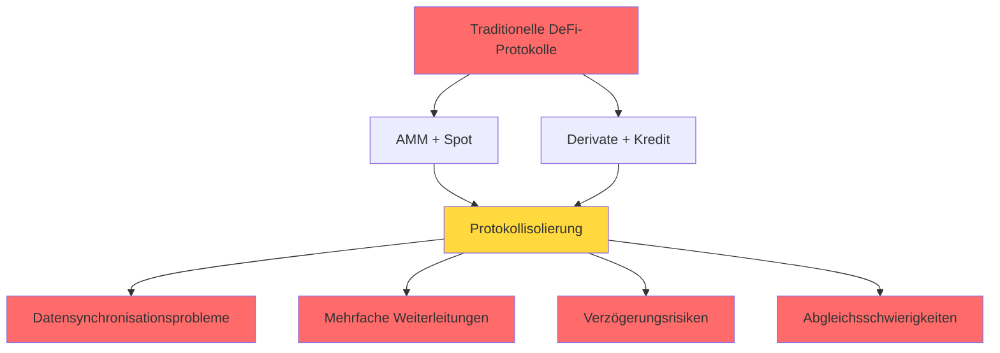

**Problemliste:**
- ❌ AMM-Protokoll: Ausreichende Spot-Liquidität, aber keine Hebelunterstützung
- ❌ Kreditprotokoll: Erfordert zusätzliche Kapitalzuführung für Kreditpools, niedrige Kapitalauslastung
- ❌ Hybride Lösung: Spot- und Hebelliquidität konkurrieren und schwächen sich gegenseitig
- ❌ Protokollübergreifende Aufrufe: Mehrfache Verzögerungen, mögliches Versagen unter extremen Bedingungen

### PinPets Innovationspfad

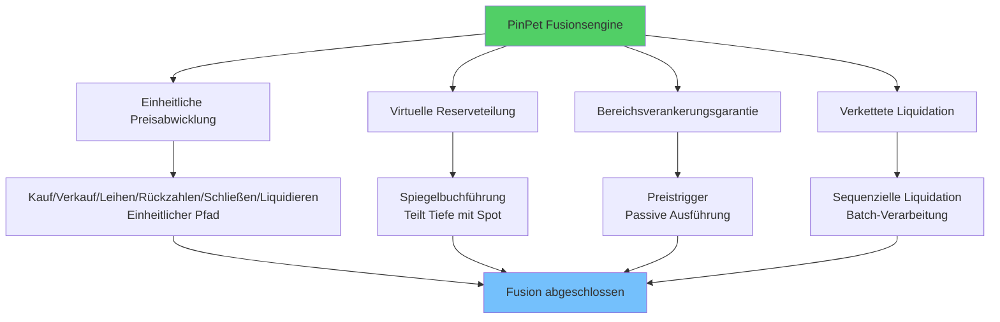

**Innovationsliste:**
- ✅ Innerhalb desselben Protokolls werden "Kauf/Verkauf", "Leihen/Rückzahlen", "Schließen/Liquidieren" zu einem konsistenten Preisabwicklungspfad gebündelt
- ✅ Kreditpool zieht keine separaten Mittel an, sondern verwendet Spiegelreservebuch zur Aufzeichnung des Kreditlimits
- ✅ Jedes Öffnen/Schließen einer Hebelposition wird durch Bereichsanker garantiert
- ✅ Preistrigger werden passiv in derselben Transaktion mit dem Handel anderer abgeschlossen
- ✅ Liquidation verwendet Listenstruktur, Liquidation in Preisreihenfolge, entspricht Marktrichtung

---

## 🌟 Überblick über Schlüsselfähigkeiten

### Spot-Handelsfähigkeiten

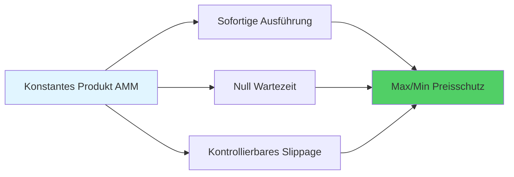

- 💎 **Sofortige Ausführung**: Konstantes Produkt Market Making, Kauf/Verkauf ohne Wartezeit
- 💎 **Slippage-Schutz**: Benutzerdefinierte Preisgrenzen, Schutz vor bösartiger Arbitrage
- 💎 **Hochpräzisionsberechnung**: 10^28 Präzisionsfaktor, übertrifft traditionelle Finanzsysteme

### Hebel-Handelsfähigkeiten

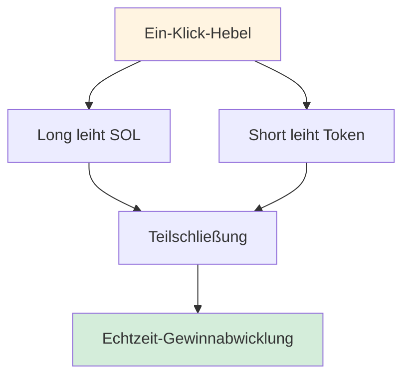

- 🚀 **Long/Short**: Bidirektionaler Hebel, profitieren von Aufwärts- und Abwärtsbewegungen
- 🚀 **Teilschließung**: Flexibles Gewinnmitnehmen, schrittweise Risikoreduktion
- 🚀 **Echtzeit-Abwicklung**: Gewinne/Verluste sofort sichtbar, transparent nachvollziehbar

### Risikokontroll-Burggraben

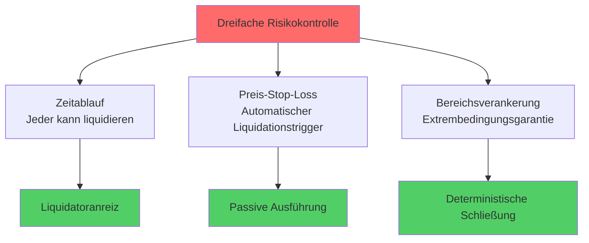

- 🛡️ **Zeitablauf**: Jeder kann Zwangsliquidation auslösen, Liquidator erhält Anreiz
- 🛡️ **Preis-Stop-Loss**: Automatisch in derselben Transaktion mit Handel anderer ausgelöst
- 🛡️ **Bereichsverankerung**: Extreme Marktbedingungen können trotzdem innerhalb des Ankerbereichs zurückgezahlt werden

### Gebühren und Aufteilung

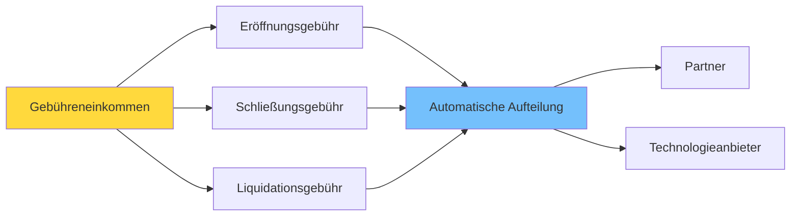

- 💰 **Transparente Gebühren**: Bidirektionale Öffnungs-/Schließungsgebühren, klare Liquidationsgebühren
- 💰 **Automatische Aufteilung**: Partner und Technologieanbieter erhalten proportionale Echtzeit-Aufteilung
- 💰 **Mietrückerstattung**: Nach Schließung des PDA-Kontos automatische Mietrückerstattung

---

## 🎯 Warum mögen verschiedene Rollen PinPet?

### Für Trader

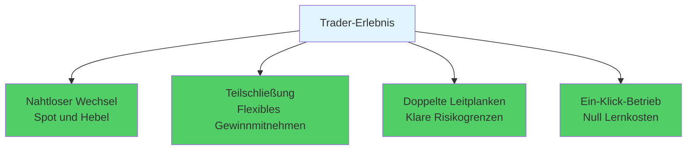

- ✨ Nahtloser Wechsel zwischen Spot und Hebel, sofortige Ausführung ohne Wartezeit
- ✨ Long/Short beide mit Teilschließung, flexibles Gewinnmitnehmen
- ✨ Ablauf- und Stop-Loss-Doppelschutz, klarere Risikogrenzen
- ✨ Ein-Klick-Betrieb, kein Verständnis komplexer Kreditmechanismen erforderlich

### Für Liquiditätsanbieter und Protokolle

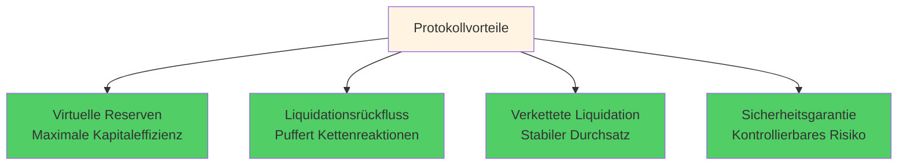

- 🏆 Virtuelle Reserven maximieren Kapitaleffizienz, beeinträchtigen nicht die Spot-Tiefe
- 🏆 Liquidationsrückfluss in Tiefe, puffert Kettenreaktionsschock
- 🏆 Verkettete sequenzielle Liquidation, stabiler Durchsatz, determinierte Reihenfolge
- 🏆 Kapitalauslastung 95%+ vs. traditionelle 40-60%

### Für Liquidatoren und Partner

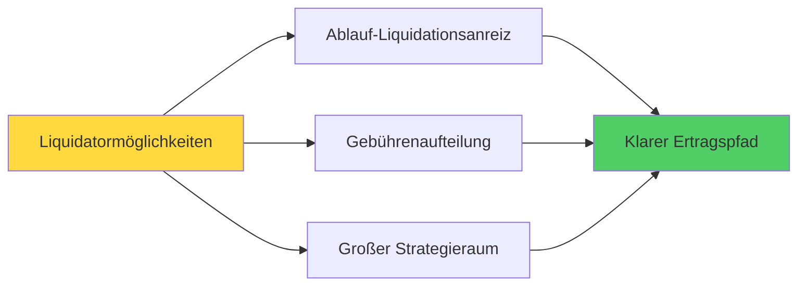

- 💵 Ablauf-Liquidation bietet Anreize, größerer Strategieraum
- 💵 Gebühren werden proportional automatisch aufgeteilt, klarer Ertragspfad
- 💵 Mietrückerstattung, zusätzliche Einkommensquelle

---

## 🧭 Vergleich mit traditionellen Lösungen

### Leistungsindikator-Vergleich

| Leistungsindikator | PinPet Fusionsengine | AMM + Externes Kredit | Orderbuch + Hebel | Perpetual DEX |
|---------|-----------------|--------------|-------------|-------------|
| **Transaktionsverzögerung** | ✅ Einzeltransaktion | ❌ 2-3 Transaktionen | ❌ Warten auf Matching | ⚠️ Abhängig von Orakel |
| **Kapitalauslastung** | ✅ 95%+ | ❌ 40-60% | ⚠️ 60-70% | ⚠️ 50-65% |
| **Liquidationsreaktion** | ✅ 0ms passive Auslösung | ❌ 5-30s Verzögerung | ❌ Abhängig von Market Makern | ⚠️ Orakelverzögerung |
| **Gas-Kosten** | ✅ Einmalig 0.0015 SOL | ❌ Mehrfach 0.003+ SOL | ❌ Hohe Hochfrequenzkosten | ⚠️ Komplexe Berechnung |
| **Liquiditätstiefe** | ✅ Einheitlicher Pool 100% | ❌ Geteilte Pools 50%+50% | ⚠️ Abhängig von Orders | ⚠️ Synthetische Assets |
| **Extreme Marktbedingungen** | ✅ Bereichsverankerungsgarantie | ❌ Mögliches Versagen | ❌ Liquiditätsverknappung | ⚠️ Funding-Rate-Anstieg |

### Lösungsvergleichs-Flussdiagramm

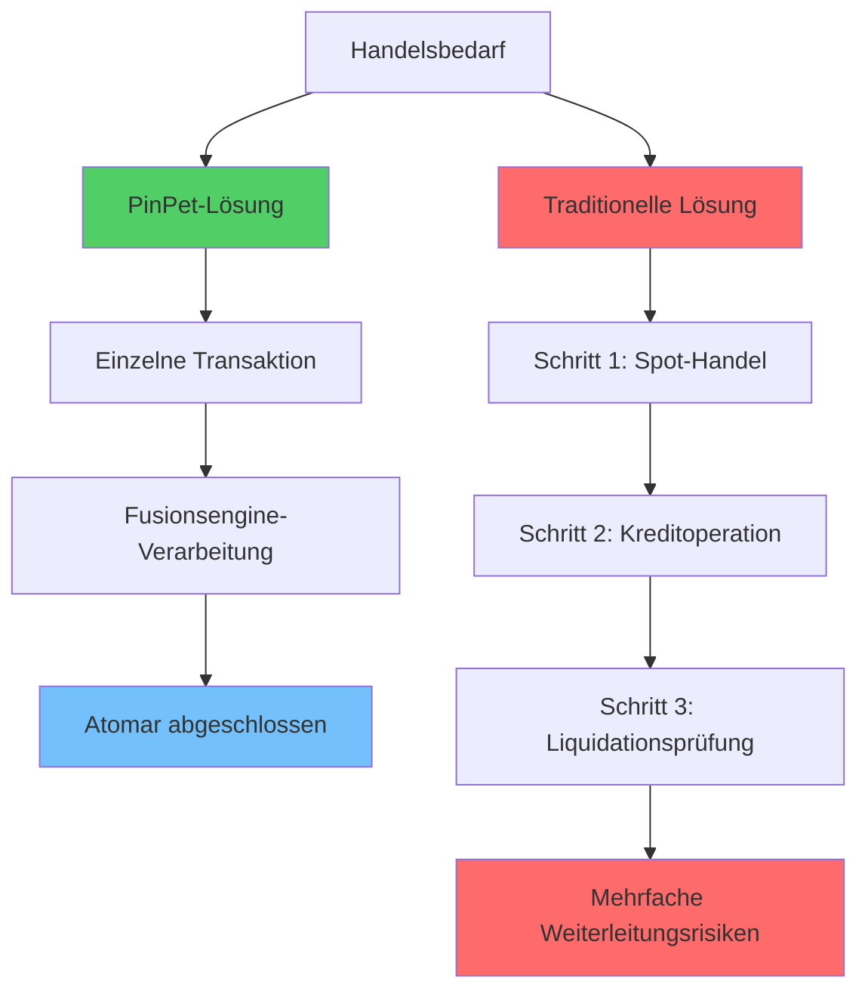

### Kernunterschiede

**Verglichen mit "AMM + Externes Kredit":**
- ✅ Fusionsengine eliminiert protokollübergreifende Verzögerungen und Inkonsistenzen
- ✅ Schnellere Liquidation, geringeres Slippage, gründlicheres Fehler-Rollback

**Verglichen mit "Orderbuch + Hebel":**
- ✅ Keine Abhängigkeit von Matching-Tiefe und Market-Maker-Warteschlangen
- ✅ Ausführung und Liquidation haben Determinismus auch unter extremen Marktbedingungen

**Verglichen mit "Perpetual DEX":**
- ✅ Echter "Spot-Handel + nativer Hebel"
- ✅ Asset- und Preispfad intuitiver, Asset-Isolationsbeziehung einfacher nachweisbar

---

## 🔧 Reale technische Details (Zusammenfassung)

### Kern-Technologiearchitektur

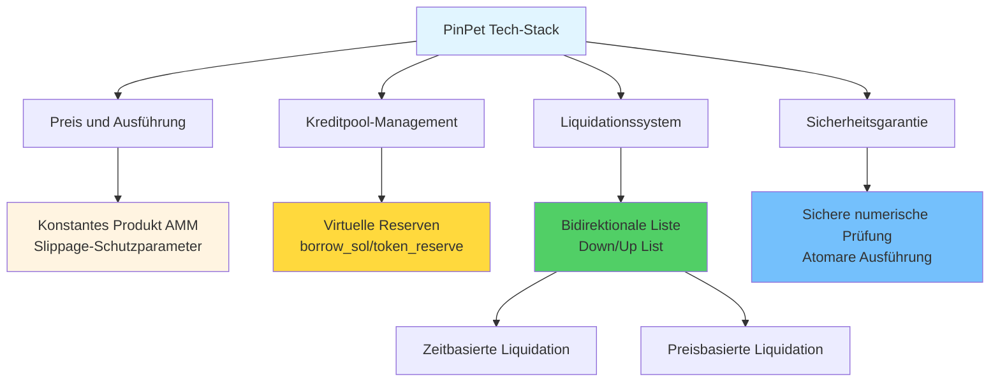

### Technische Feature-Liste

**Preis und Ausführung:**
- Konstantes Produkt AMM: `k = x × y`
- Slippage-Schutzparameter strikt eingeschränkt
- Hochpräzisions-Berechnungsengine (10^28 Präzision)

**Kreditpool:**
- `borrow_sol_reserve` / `borrow_token_reserve` virtuelle Reserven
- Teilt Mittel mit Spot-Pool, aber logisch isoliert
- Preisbereichsverriegelungstechnologie (PLT)

**Liquidationsliste:**
- Long-Liste (Down): Preis von hoch nach niedrig
- Short-Liste (Up): Preis von niedrig nach hoch
- Unterstützt Batch-Durchquerung und Kettenreaktions-Liquidation

**Liquidationstrigger:**
- Zeitbasierter Trigger: Ablauf-Zwangsliquidation, jeder kann ausführen
- Preisbasierter Trigger: Stop-Loss-Liquidation, in Handel anderer atomar eingebettet

**Konto-Lebenszyklus:**
- Nach Liquidation/Schließung werden zugehörige PDAs geschlossen
- Miete wird an Auslöser zurückerstattet
- Ereignisse on-chain vollständig beobachtbar

**Sichere Berechnung:**
- Numerische Operationen verwenden durchgängig checked_* Methoden
- Hochpräzise Gebührenakkumulation
- Fehler führen zu Rollback, keine Zwischenzustände

---

## 🧩 Technischer Code für Entwickler/Integratoren

### Entwicklerfreundliches Design

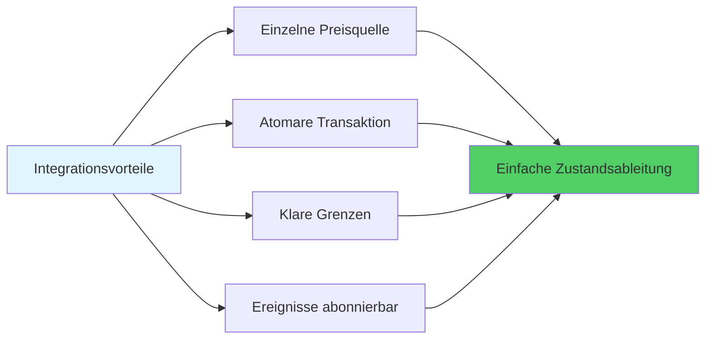

**Kernfunktionen:**
- 🔹 **Einzelne Preisquelle**: Spot und Hebel teilen einheitlichen Preis, `price_to_reserves(price)` synchrones Mapping
- 🔹 **Atomare Transaktion**: Öffnen/Schließen/Liquidieren als einzelne Transaktion, einfache Zustandsableitung
- 🔹 **Klare Grenzen**: Mindesthandelsvolumen, Mindestmargin, Stop-Loss-Schwellenwerte und andere Parameter on-chain konfigurierbar und leicht überprüfbar
- 🔹 **Ereignisse abonnierbar**: Liquidations-/Schließungsereignisse klar, praktisch für Risikokontroll-Dashboard, Strategierücktest und Alarme

### Technischer Integrationsprozess

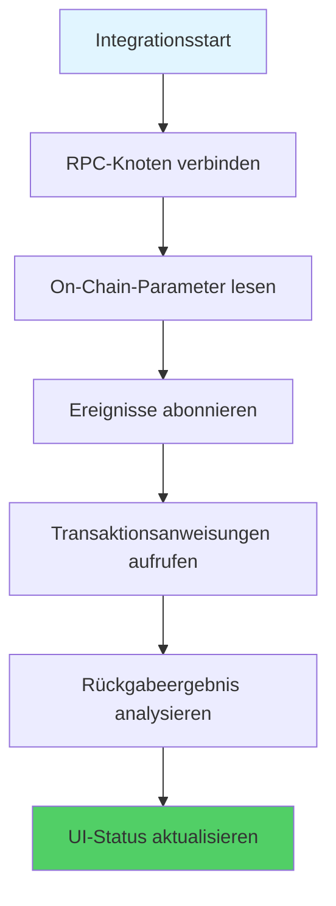

---

## 📊 Leistungsdaten: On-Chain-Effizienzrevolution

### Gemessene Leistungsindikatoren

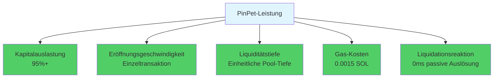

### Verbesserungsvergleich

| Indikator | Verbesserung |
|-----|---------|
| Kapitalauslastung | 🚀 +50% |
| Transaktionsgeschwindigkeit | ⚡ 2x schneller |
| Liquiditätstiefe | 💎 3x tiefer |
| Gas-Kosten | 💰 50% Ersparnis |
| Liquidationsreaktion | ⏱️ Sofortige Liquidation |

---

## 📣 Wertfazit und Handlungsaufforderung

### PinPets Kernwert

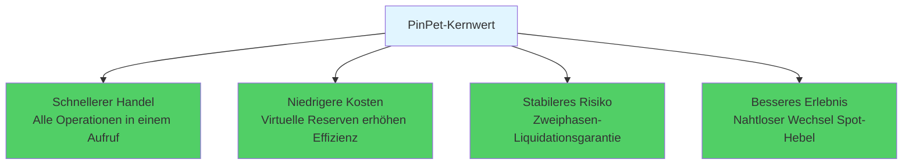

### Was haben wir bewiesen?

PinPet.fun hat mit der fusionsbasierten AMM/ALP-Engine die Möglichkeiten von "dezentralisiertem Spot × nativer Hebelwirkung" neu definiert:

- ✅ **Liquidität muss nicht geteilt werden**: Ein einziger Pool kann mehrere Anforderungen bedienen
- ✅ **Hebel benötigt keinen Kreditpool**: Virtuelles Reservebuch reicht aus
- ✅ **Liquidation kann null Verzögerung haben**: Passiver Triggermechanismus eliminiert Orakelabhängigkeit
- ✅ **Extreme Marktbedingungen haben Garantie**: Bereichsverankerung stellt sicher, dass Liquidation nicht fehlschlägt

### Technologie verändert DeFi

**PinPet = Perfekte Fusion von AMM + Automatischem Kreditpool**

Dies ist weltweit die erste Innovation, dies ist ein einzigartiger technologischer Durchbruch.

---

## 🚀 Sofort erleben

**Rüsten Sie Ihre Strategie mit diesem intelligenteren, härteren Motor aus!**

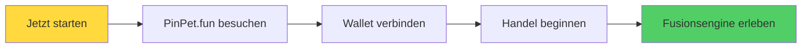

- 🌐 **Webseite**: [PinPet.fun](https://pinpet.fun)
- 📖 **Technische Dokumentation**: [docs.pinpet.fun](https://docs.pinpet.fun)
- 💬 **Community**: Treten Sie unserem Discord und Telegram bei
- 📊 **GitHub**: https://github.com/pinpetfun/

---

## 🔮 Zukünftige Technologie-Roadmap

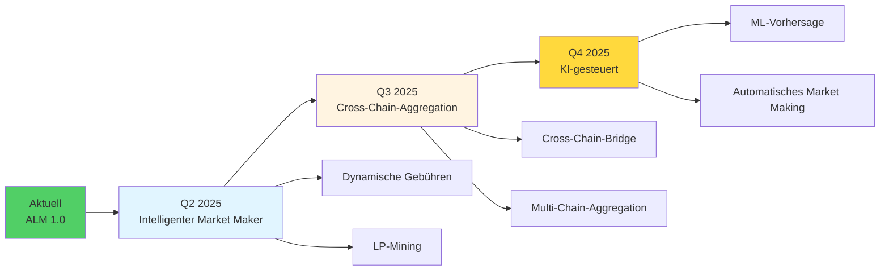

**Kontinuierliche Innovation:**
- 🔬 **Phase 1 - Intelligenter Market Maker**: Dynamische Gebühren + Liquiditätsanreize
- 🔬 **Phase 2 - Cross-Chain-Aggregation**: Einheitliches Multi-Chain-Liquiditätsmanagement
- 🔬 **Phase 3 - KI-gesteuert**: Machine Learning optimiert Risikokontrollstrategien

---

## ⚠️ Risikohinweis

**Hebelhandel birgt hohe Risiken und kann zum Totalverlust der Margin führen.**

Bitte nehmen Sie nur teil, nachdem Sie den Mechanismus und die Risiken vollständig verstanden haben, und verwenden Sie Hebel rational. Dieses Dokument dient nur der technischen Einführung und stellt keine Anlageberatung dar.

---

*🔬 Technologie treibt Innovation, Code schafft Vertrauen*

*🌟 PinPet.fun - Redefining DeFi Infrastructure*

**In der Richtung "AMM-Handel + Automatischer Kreditpool" ist dies weltweit die erste Innovation und einzigartig.**
