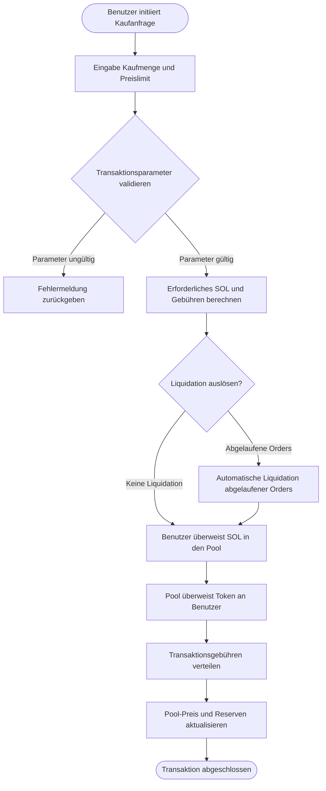
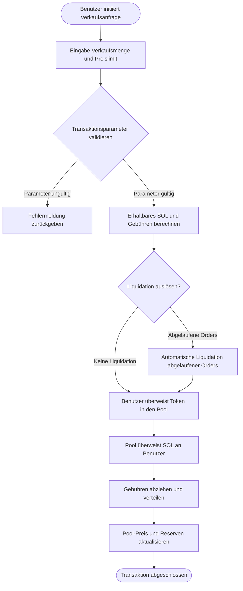

# 💱 Einführung in die PinPet Spot-Trading-Funktion

## 📊 Funktionsübersicht

Der Spot-Handel ist eine der Kernfunktionen der PinPet-Plattform und ermöglicht es Nutzern, Token direkt in dezentralen Liquiditätspools zu kaufen und zu verkaufen. Anders als das traditionelle Orderbuch-Modell verwendet PinPet einen Automated Market Maker (AMM)-Mechanismus, der auf dem Constant Product Formula (x × y = k) basiert, um Handelspreise automatisch zu bestimmen.

**✨ Kernmerkmale:**
- **⚡ Sofortige Ausführung**: Keine Notwendigkeit, auf die Übereinstimmung von Käufern und Verkäufern zu warten, Transaktionen werden sofort abgeschlossen
- **🔍 Transparente Preisgestaltung**: Preise werden automatisch durch Algorithmen berechnet, offen und transparent
- **🌊 Kontinuierliche Liquidität**: Solange ausreichend Vermögenswerte im Pool vorhanden sind, kann jederzeit gehandelt werden
- **🛡️ Slippage-Schutz**: Benutzer können maximale/minimale Preislimits festlegen, um abnormale Preisschwankungen zu verhindern

---

## 🛒 Kauftransaktionsprozess (Buy)

### 👤 Benutzer-Operationsschritte

Kauftransaktionen ermöglichen es Benutzern, SOL (Solanas nativer Token) zu verwenden, um Projekt-Token zu kaufen.

### 🔑 Wichtige Parameterbeschreibung

| Parametername | Verwendungszweck | Beispielwert | Hinweise |
|---------|---------|--------|------|
| buy_token_amount | Gewünschte Token-Kaufmenge | 1000000 (1 Token) | Mindestwert: 1000000 (1 Token) |
| max_sol_amount | Maximale SOL-Zahlungsbereitschaft | 50000000 (0,05 SOL) | Zum Schutz vor übermäßigem Preis-Slippage |
| lp_pairs | Liquiditätspool-Status-Snapshot | [{sol: 30, token: 1000000}] | Automatisch vom Frontend bereitgestellt |

### ⚙️ Transaktionsausführungslogik

1. **Parametervalidierung**
   - Überprüfung, ob die Kaufmenge das Mindesthandelsvolumen erreicht (1 Token)
   - Überprüfung, ob der Liquiditätspool-Status mit der On-Chain konsistent ist

2. **Preisberechnung**
   - Basierend auf den aktuellen Pool-Reserven wird mit der Constant Product Formula das erforderliche SOL berechnet
   - Berechnung des tatsächlichen Zahlungsbetrags einschließlich Gebühren
   - Überprüfung, ob der tatsächliche Ausführungspreis den vom Benutzer festgelegten Höchstwert überschreitet

3. **Automatischer Liquidationsmechanismus**
   - Wenn die Transaktion dazu führt, dass der Preis den Liquidationspreis bestimmter Hebel-Orders überschreitet, liquidiert das System diese Orders automatisch
   - Die durch die Liquidation entstehenden Gebühren werden auf die Plattform und Partner verteilt

4. **Geldüberweisung**
   - Benutzerkonto → Liquiditätspool: Überweisung von SOL (inkl. Gebühren)
   - Liquiditätspool → Benutzerkonto: Überweisung von Token

5. **Gebührenverteilung**
   - Verteilung nach voreingestellten Verhältnissen an Partner und Technologieanbieter
   - Standard-Gebührensatz kann vom Administrator konfiguriert werden

6. **Statusaktualisierung**
   - Aktualisierung des aktuellen Preises des Liquiditätspools
   - Neuberechnung der SOL- und Token-Reserven des Pools
   - Überprüfung, ob Gebührenrabatte ausgelöst werden

---

## 💸 Verkaufstransaktionsprozess (Sell)

### 👤 Benutzer-Operationsschritte

Verkaufstransaktionen ermöglichen es Benutzern, gehaltene Token zu verkaufen und SOL zurückzuerhalten.

### 🔑 Wichtige Parameterbeschreibung

| Parametername | Verwendungszweck | Beispielwert | Hinweise |
|---------|---------|--------|------|
| sell_token_amount | Gewünschte Token-Verkaufsmenge | 1000000 (1 Token) | Mindestwert: 1000000 (1 Token) |
| min_sol_output | Erwartete minimale SOL-Menge | 20000000 (0,02 SOL) | Zum Schutz vor übermäßigem Preis-Slippage |
| lp_pairs | Liquiditätspool-Status-Snapshot | [{sol: 30, token: 1000000}] | Automatisch vom Frontend bereitgestellt |

### ⚙️ Transaktionsausführungslogik

1. **Parametervalidierung**
   - Überprüfung, ob die Verkaufsmenge das Mindesthandelsvolumen erreicht (1 Token)
   - Überprüfung, ob das Token-Kontoguthaben des Benutzers ausreichend ist
   - Bestätigung, dass der Liquiditätspool-Status gültig ist

2. **Preisberechnung**
   - Basierend auf den aktuellen Pool-Reserven wird mit der Constant Product Formula das erhaltbare SOL berechnet
   - Berechnung des tatsächlichen Empfangsbetrags nach Abzug der Gebühren
   - Überprüfung, ob der tatsächliche Ausführungspreis unter dem vom Benutzer festgelegten Mindestwert liegt

3. **Automatischer Liquidationsmechanismus**
   - Wenn die Transaktion dazu führt, dass der Preis den Liquidationspreis bestimmter Hebel-Orders überschreitet, liquidiert das System diese Orders automatisch
   - Verteilung der durch die Liquidation entstandenen Gebühren und Liquidationsbelohnungen

4. **Geldüberweisung**
   - Benutzerkonto → Liquiditätspool: Überweisung von Token
   - Liquiditätspool → Benutzerkonto: Überweisung von SOL (bereits Gebühren abgezogen)

5. **Gebührenbearbeitung**
   - Abzug der Gebühren vom zu erhaltenden SOL
   - Anteilige Verteilung an Partner und Technologieanbieter

6. **Statusaktualisierung**
   - Aktualisierung des aktuellen Preises des Liquiditätspools (Preis sinkt)
   - Neuberechnung der SOL- und Token-Reserven des Pools
   - Überprüfung, ob Gebührenrabatte ausgelöst werden

---

## 💡 Anwendungsbeispiele

### 📈 Szenario 1: Normaler Kaufhandel

**Hintergrund:**
- Aktueller Preis: 1 Token = 0,03 SOL
- Benutzer möchte 10 Token kaufen
- Gebührensatz: 1%

**Ablauf:**
1. Benutzer legt Kaufmenge fest: 10.000.000 (10 Token)
2. Benutzer legt maximale Zahlung fest: 0,35 SOL (350.000.000)
3. System berechnet tatsächlichen Bedarf: 0,303 SOL (inkl. Gebühren)
4. Preisüberprüfung bestanden (Höchstgrenze nicht überschritten)
5. Transaktion ausgeführt:
   - Benutzer zahlt 0,303 SOL
   - Erhält 10 Token
   - Gebühr 0,003 SOL wird an Plattform verteilt
6. Preis nach Ausführung steigt auf: 0,0303 SOL/Token

---

### 📉 Szenario 2: Verkauf löst automatische Liquidation aus

**Hintergrund:**
- Aktueller Preis: 1 Token = 0,05 SOL
- Es existiert eine Long-Order mit Liquidationspreis bei 0,048 SOL
- Benutzer möchte 50 Token verkaufen

**Ablauf:**
1. Benutzer legt Verkaufsmenge fest: 50.000.000 (50 Token)
2. Benutzer legt minimalen Erlös fest: 2,3 SOL
3. System erkennt, dass Verkauf den Preis unter 0,048 SOL senken wird
4. System liquidiert automatisch die Long-Order:
   - Berechnung von Gewinn/Verlust der Order
   - Erhebung von Liquidationsgebühren
   - Schließung des Order-Kontos, Rückerstattung der Miete
5. Weiterführung der Verkaufstransaktion:
   - Benutzer überweist 50 Token
   - Erhält 2,4 SOL (nach Gebührenabzug)
6. Preis nach Ausführung sinkt auf: 0,047 SOL/Token

---

### 🛡️ Szenario 3: Slippage-Schutz aktiviert

**Hintergrund:**
- Aktueller Preis: 1 Token = 0,02 SOL
- Benutzer möchte 1000 Token kaufen
- Liquiditätspool ist klein, große Transaktion verursacht erheblichen Slippage

**Ablauf:**
1. Benutzer legt Kaufmenge fest: 1.000.000.000 (1000 Token)
2. Benutzer legt maximale Zahlung fest: 21 SOL
3. System berechnet tatsächlichen Bedarf: 22,5 SOL (inkl. Gebühren)
4. Preisüberprüfung fehlgeschlagen (Höchstgrenze des Benutzers überschritten)
5. Transaktion abgelehnt, Fehlermeldung zurückgegeben
6. Benutzer kann wählen:
   - Maximale Zahlungsgrenze erhöhen
   - Kaufmenge reduzieren
   - In mehreren Chargen kaufen

---

## ⚠️ Hinweise und Einschränkungen

### 🚫 Handelsbeschränkungen

| Beschränkung | Anforderung | Begründung |
|---------|---------|---------|
| Mindesthandelsvolumen | 1.000.000 (1 Token) | Verhinderung, dass zu kleine Transaktionen die Systemeffizienz beeinträchtigen |
| Gebührensatz-Obergrenze | 10% | Schutz der Benutzer vor übermäßigen Gebühren |
| Liquiditätsprüfung | Aktueller Pool-Status-Snapshot erforderlich | Sicherstellung der Konsistenz zwischen On-Chain- und Off-Chain-Status |
| Preis-Slippage-Schutz | max_sol_amount / min_sol_output erforderlich | Verhinderung von Verlusten durch abnormale Preisschwankungen |

### ⚠️ Risikohinweise

1. **📊 Preisvolatilitätsrisiko**
   - Große Transaktionen verursachen erheblichen Preis-Slippage
   - Es wird empfohlen, große Transaktionen in mehreren Chargen durchzuführen, um die Auswirkungen zu reduzieren
   - Festlegung einer angemessenen Slippage-Toleranz

2. **💰 Gebührenkosten**
   - Jede Transaktion verursacht Gebühren
   - Häufige kleine Transaktionen führen zu höheren kumulierten Gebührenkosten
   - Es wird empfohlen, Transaktionen zu konsolidieren, um Kosten zu senken

3. **💧 Liquiditätsrisiko**
   - Bei unzureichender Liquidität können große Transaktionen möglicherweise nicht abgeschlossen werden
   - Die Poolreserven beeinflussen den Ausführungspreis
   - Beachtung der SOL- und Token-Reserven des Pools

4. **🔄 Auswirkungen automatischer Liquidation**
   - Transaktionen können die automatische Liquidation von Hebel-Orders auslösen
   - Liquidation verbraucht einen Teil der Liquidität
   - Kann den endgültigen Ausführungspreis beeinflussen

### 🔧 Technische Anforderungen

**👛 Benutzeranforderungen:**
- Besitz einer Solana-Wallet (z.B. Phantom, Solflare)
- Ausreichend SOL im Konto für Handel und Transaktionsgebühren
- Token-Konto muss vor dem Handel erstellt werden (normalerweise automatisch vom Frontend verarbeitet)

**💵 Transaktionsgebühren:**
- Solana-Netzwerkgebühren: ca. 0,000005 SOL (Transaktionssignaturgebühr)
- Handelsgebühren: Prozentsatz des Transaktionsbetrags (vom Administrator konfiguriert)
- Kontomiete: Einmalzahlung bei Erstellung eines neuen Kontos (erstattungsfähig)

### ❓ Häufig gestellte Fragen

**F: Verliere ich Gebühren, wenn die Transaktion fehlschlägt?**
A: ✅ Nein. Wenn die Transaktion aufgrund fehlgeschlagener Parameterüberprüfung abgelehnt wird, werden keine Gebühren erhoben, es fallen nur geringe Solana-Netzwerkgebühren an (ca. 0,000005 SOL).

**F: Wie erhalte ich den besten Ausführungspreis?**
A: 💡 Handel in Zeiten ausreichender Liquidität, Vermeidung übermäßig großer Einzeltransaktionen, Beachtung des SOL/Token-Verhältnisses des Pools, Wahl des richtigen Zeitpunkts für den Handel.

**F: Beeinflusst die automatische Liquidation meinen Handel?**
A: ⚠️ Möglicherweise. Wenn Ihre Transaktion die Liquidation von Hebel-Orders anderer auslöst, wird ein Teil der Liquidität verbraucht, was zu einem geringfügigen Unterschied zwischen dem tatsächlichen Ausführungspreis und der Erwartung führen kann, aber immer noch innerhalb Ihres festgelegten Slippage-Bereichs liegt.

**F: Häufige Gründe für abgelehnte Transaktionen?**
A: ❌ Häufige Gründe sind:
- Kauf- oder Verkaufsmenge unter dem Mindesthandelsvolumen (1 Token)
- Tatsächlicher Ausführungspreis überschreitet Ihren festgelegten Slippage-Schutzbereich
- Unzureichendes Kontoguthaben (SOL oder Token)
- Liquiditätspool-Status-Snapshot abgelaufen (Frontend muss neu abrufen)

**F: Wie werden Gebühren berechnet und verteilt?**
A: 💰 Gebühren werden als Prozentsatz des Transaktionsbetrags erhoben (Standard 1%, vom Administrator anpassbar) und nach Erhebung im voreingestellten Verhältnis auf Partner und Technologieanbieter verteilt. In einigen Fällen können Gebührenrabatte gewährt werden.

---

## 🔗 Verwandte Funktionen

- **📊 Hebelhandel**: Verwendung von Kreditmechanismen für Long-/Short-Handel
- **💧 Liquiditätsmanagement**: Anzeige und Verwaltung des Liquiditätspool-Status
- **🪙 Token-Erstellung**: Erstellung neuer Handels-Token-Paare
- **📋 Orderverwaltung**: Anzeige und Verwaltung von Hebelhandels-Orders

---

*📝 Hinweis: Dieses Dokument ist eine Produktfunktionsbeschreibung und enthält keine technischen Implementierungsdetails. Für entwicklungsbezogene Informationen konsultieren Sie bitte die technische Dokumentation des Projekts.*
