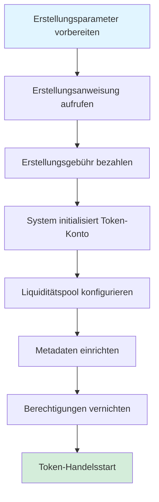
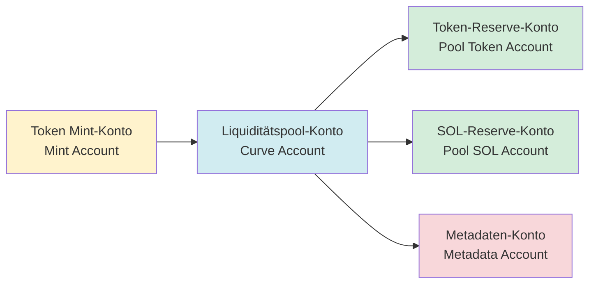
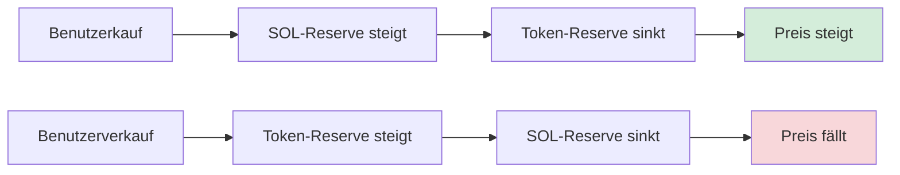

# 🪙 Einführung in die PinPet Token-Erstellungsfunktion

## 1. 📋 Funktionsübersicht

### 💎 Was ist Token-Erstellung

Die Token-Erstellung ist eine der Kernfunktionen der PinPet-Plattform, die es Benutzern ermöglicht, mit einem Klick neue SPL-Token (Solana Blockchain Standard Token) auszugeben und automatisch einen Handelsmarkt zu konfigurieren. Mit dieser Funktion können Benutzer schnell Token mit vollständigen Metadaten, automatischer Liquiditätsunterstützung und sofortiger Handelsfähigkeit erstellen, ohne tiefgreifende Kenntnisse komplexer Blockchain-Technologie zu benötigen.

### ❓ Warum Token erstellen

**⚠️ Probleme bei der traditionellen Token-Ausgabe:**
- Erfordert professionelle technische Kenntnisse (Solana-Programmierung, SPL-Token-Standard)
- Manuelle Konfiguration von Mint-Berechtigungen, Liquiditätspools, Metadaten und anderen Schritten
- Fehlende sofortige Liquidität und Handelsmarkt
- Komplexe Sicherheitseinstellungen (Berechtigungsvernichtung, Schutz vor Nachprägung usw.)

**✅ Vorteile der PinPet Token-Erstellung:**
- **⚡ Ein-Klick-Ausgabe**: Erfordert nur drei grundlegende Informationen: Token-Name, Symbol und Icon
- **🚀 Sofortiger Start**: Nach der Erstellung sofort handelbar, keine Wartezeit für Liquiditätsaufbau
- **🔒 Automatische Sicherheitskonfiguration**: Automatische Vernichtung von Mint- und Freeze-Berechtigungen, Schutz vor böswilliger Nachprägung
- **🏦 Integrierter Handelsmarkt**: Basiert auf Constant Product AMM-Algorithmus, unterstützt Spot- und Hebelhandel
- **✔️ Konforme Metadaten**: Entspricht dem Metaplex-Standard, automatische Erkennung durch Wallets und Börsen

### ⭐ Kernfunktionen

| Funktion | Beschreibung |
|------|------|
| Token-Standard | SPL Token (offizieller Solana-Standard) |
| Genauigkeit | 6 Dezimalstellen (1 Token = 1.000.000 kleinste Einheiten) |
| Gesamtversorgung | 1.609.500.000.000.000 Einheiten (feste Versorgung, nicht nachprägbar) |
| Metadaten-Standard | Metaplex Token Metadata |
| Anfangspreis | ca. 0,0000000000279589934762 SOL/Token |
| Liquiditätsmodell | Constant Product AMM (x × y = k) |

---

## 2. 🔄 Token-Erstellungsprozess

### 👤 Benutzer-Schritte



### 📊 Detaillierte Prozessbeschreibung

#### 📝 Phase 1: Parameter vorbereiten
Benutzer müssen drei grundlegende Parameter bereitstellen:

| Parameter | Typ | Beschreibung | Beispiel |
|------|------|------|------|
| name | String | Vollständiger Token-Name | "PinPet Token" |
| symbol | String | Token-Symbol (3-10 Zeichen) | "PINPET" |
| uri | String | Link zur Metadaten-JSON-Datei | "https://example.com/metadata.json" |

#### 🔧 Phase 2: Kontoinitialisierung
Das System erstellt und konfiguriert automatisch folgende Konten:



#### 💧 Phase 3: Liquiditätspool-Initialisierung
Das System konfiguriert automatisch zwei Liquiditätspools:

**1. Spot-Liquiditätspool (LP Pool)**
- Token-Reserve: 1.073.000.000.000.000 Einheiten
- SOL-Reserve: 30 SOL (virtuelles Guthaben)
- Tatsächliches SOL: 10.000 Lamports (Schutz vor unzureichendem Guthaben)
- Zweck: Unterstützung des Spothandels (Kauf/Verkauf)

**2. Hebel-Kreditpool (Borrow Pool)**
- Token-Reserve: 536.500.000.000.000 Einheiten
- SOL-Reserve: 10.000.000 SOL (virtuelles Guthaben)
- Zweck: Unterstützung des Margin-Handels (Long/Short)

**📊 Kapitalverteilungsdiagramm:**
```
💰 Gesamtversorgung: 1.609.500.000.000.000 Einheiten
├── Spot-Liquiditätspool: 1.073.000.000.000.000 (66,67%)
└── Hebel-Kreditpool:     536.500.000.000.000 (33,33%)
```

#### 📄 Phase 4: Metadaten-Erstellung
Das System ruft das Metaplex Token Metadata-Programm auf, um Token-Metadaten zu erstellen:

| Metadaten-Feld | Inhalt | Beschreibung |
|-----------|------|------|
| name | Vom Benutzer bereitgestellter Name | In der Wallet angezeigter Token-Name |
| symbol | Vom Benutzer bereitgestelltes Symbol | Token-Kurzbezeichnung |
| uri | Vom Benutzer bereitgestellter Link | Verweist auf JSON mit Icon, Beschreibung usw. |
| creators | Ersteller-Adresse | Kennzeichnet Token-Ersteller, unverifizierter Status |
| seller_fee_basis_points | 0 | Lizenzgebührensatz (auf 0 gesetzt) |
| is_mutable | true | Erlaubt Metadaten-Updates |

**📋 Beispiel für Standard-Metadaten-JSON-Format:**
```json
{
  "name": "PinPet Token",
  "symbol": "PINPET",
  "description": "Auf der PinPet-Plattform ausgegebener Token",
  "image": "https://example.com/logo.png",
  "attributes": [],
  "properties": {
    "files": [
      {
        "uri": "https://example.com/logo.png",
        "type": "image/png"
      }
    ]
  }
}
```

#### 🔒 Phase 5: Berechtigungsvernichtung
Um die Sicherheit und Unveränderlichkeit des Tokens zu gewährleisten, führt das System automatisch aus:

| Aktion | Zweck | Wirkung |
|------|------|------|
| Mint-Berechtigung vernichten | Nachprägung verhindern | Gesamtversorgung dauerhaft gesperrt |
| Freeze-Berechtigung vernichten | Einfrieren von Benutzerkonten verhindern | Token dauerhaft handelbar |

#### 💵 Phase 6: Gebührenkonfiguration
Das System liest Gebühreneinstellungen aus dem Partner-Parameter-Konto:

| Gebührenart | Standardwert | Beschreibung |
|---------|--------|------|
| Spot-Handelsgebühr | 1% | Abzug bei Kauf-/Verkaufstransaktionen |
| Margin-Handelsgebühr | 0,25% | Abzug bei Hebelgeschäften |
| Gebührenrabatt-Flag | 0 (regulärer Preis) | Kann automatisch nach Handelsvolumen angepasst werden |
| Gebührenverteilungsverhältnis | 20%/80% | Technologie-/Partneranteil |

---

## 3. 💧 Liquiditätspool-Mechanismus

### 🔢 Constant Product-Formel

PinPet verwendet ein Automated Market Maker (AMM)-Modell mit der Kernformel:

```
x × y = k
```

Wobei:
- **x**: SOL-Reserve
- **y**: Token-Reserve
- **k**: Konstantes Produkt (Anfangswert = 30 × 1.073.000.000 = 32.190.000.000)

### 💰 Anfangspreisberechnung

```
Anfangspreis = SOL-Reserve ÷ Token-Reserve
            = 30 ÷ 1.073.000.000
            ≈ 0,0000000279589934762 SOL/Token
```

### 📈 Preisänderungsmechanismus



### 🛡️ Preis-Slippage-Schutz

Zum Schutz des Liquiditätspools verwendet das System mehrere Sicherheitsmechanismen:

| Schutzmaßnahme | Beschreibung |
|---------|------|
| Genauigkeitsfaktor | Preise verwenden 10^26 Genauigkeitsfaktor, vermeidet Rundungsfehler |
| Überlaufprüfung | Alle Berechnungen verwenden `checked_*`-Methoden zur Überlaufprävention |
| Preisobergrenze | Maximaler Preis begrenzt auf 50.000.000.000.000.000.000.000.000.000 |
| Preisuntergrenze | Minimaler Preis begrenzt auf 0,000000001 (verhindert Division durch Null) |

---

## 4. 📝 Token-Metadaten-Beschreibung

### ✅ Metaplex-Standard

PinPet verwendet den Metaplex Token Metadata v5.1.1-Standard, um die Kompatibilität des Tokens im Solana-Ökosystem sicherzustellen:

**✨ Standard-Vorteile:**
- 💳 Automatische Erkennung durch führende Wallets (Phantom, Solflare)
- 🔄 Automatisches Abrufen von Informationen durch DEX-Plattformen (Jupiter, Raydium)
- 🎨 Automatische Indexierung durch NFT-Marktplätze und Aggregatoren
- 🔍 Vollständige Anzeige in Blockchain-Explorern (Solscan, Solana Explorer)

### 🗂️ Metadaten-Kontostruktur

```
Metadaten-Kontoadresse (PDA)
├── Ableitungs-Seeds: ["metadata", Metaplex Program ID, Mint Address]
├── Gespeicherter Inhalt:
│   ├── Token-Name
│   ├── Token-Symbol
│   ├── URI (Metadaten-JSON-Link)
│   ├── Ersteller-Information
│   ├── Lizenzgebühren-Einstellung
│   └── Sammlungsinformation (optional)
└── Berechtigungen:
    ├── Update-Berechtigung: Liquiditätspool-Konto (PDA)
    └── Veränderbarkeit: true (erlaubt Updates)
```

### 🌐 URI-Hosting-Empfehlungen

| Hosting-Methode | Vorteile | Nachteile | Anwendungsfall |
|---------|------|------|---------|
| IPFS | Dezentralisiert, permanente Speicherung | Langsamerer Zugriff | Langfristige Projekte |
| Arweave | Permanente Speicherung, schnell | Kostenpflichtig | Hochwertige Token |
| Cloud-Speicher (AWS S3/CDN) | Schnell, günstig | Zentralisiert, kann ausfallen | Test- oder Kurzzeitprojekte |

---

## 5. 🎯 Anwendungsbeispiele

### 🚀 Szenario 1: Startup-Team gibt Projekt-Token aus

**Anforderung:**
Ein Web3-Startup-Team möchte einen Governance-Token für sein DeFi-Projekt ausgeben

**Arbeitsablauf:**
1. Token-Icon und Beschreibungsdokument entwerfen
2. Metadaten-JSON auf IPFS hochladen
3. Parameter vorbereiten:
   - name: "SuperDeFi Governance Token"
   - symbol: "SDEFI"
   - uri: "https://ipfs.io/ipfs/QmXXX..."
4. PinPet-Erstellungsanweisung aufrufen, geringe Erstellungsgebühr bezahlen
5. Token startet sofort, Teammitglieder und Community können sofort handeln

**✅ Vorteile:**
- ⚡ Kein Smart-Contract-Schreiben erforderlich
- 💧 Integrierter Liquiditätsmarkt
- 🔒 Sicherheit durch Protokoll garantiert

---

### 🎉 Szenario 2: Community-Meme-Token-Ausgabe

**Anforderung:**
Community möchte einen Themen-Meme-Token für Unterhaltung und Handel ausgeben

**Arbeitsablauf:**
1. Community stimmt über Token-Name und Icon ab
2. Kostenlosen Bild-Hosting-Dienst verwenden
3. Parameter vorbereiten:
   - name: "Doge to the Moon"
   - symbol: "DMOON"
   - uri: "https://cloudinary.com/dmoon.json"
4. Ein Community-Mitglied initiiert die Erstellung
5. Community-Mitglieder beginnen sofort zu handeln

**✅ Vorteile:**
- 💰 Kostengünstige schnelle Ausgabe
- 👥 Kein technischer Hintergrund erforderlich
- 🔒 Automatischer Schutz vor Nachprägung

---

### 🎨 Szenario 3: NFT-Projekt gibt Utility-Token aus

**Anforderung:**
NFT-Projektpartei möchte einen begleitenden Utility-Token für Ökosystem-Anreize ausgeben

**Arbeitsablauf:**
1. Token-Image im NFT-Stil entwerfen
2. Detailliertes Token-Whitepaper vorbereiten
3. Arweave für permanente Metadaten-Speicherung verwenden
4. Parameter vorbereiten:
   - name: "CryptoArt Utility Token"
   - symbol: "CART"
   - uri: "ar://abc123..."
5. Token erstellen und Gebührenempfangskonto einrichten
6. NFT-Inhaber können durch Staking Token-Belohnungen erhalten

**✅ Vorteile:**
- 💾 Permanente Metadaten-Speicherung
- 🔗 Nahtlose Integration mit NFT-Ökosystem
- 📊 Unterstützt komplexe Wirtschaftsmodelle

---

## 6. ⚠️ Hinweise und Einschränkungen

### 📝 Vorbereitungen vor der Erstellung

| Prüfpunkt | Beschreibung |
|--------|------|
| Wallet-Guthaben | Ausreichend SOL für Erstellungsgebühr sicherstellen (ca. 0,01-0,05 SOL) |
| Metadaten-Vorbereitung | JSON-Datei hochgeladen und zugänglich |
| Token-Information | Name und Symbol entsprechen den Normen, eindeutig |
| Partner-Konto | Partner-Parameter-Konto erstellt (erstmalige Erstellung erforderlich) |

### 🚫 Token-Erstellungseinschränkungen

**⚙️ Technische Einschränkungen:**
- Token-Genauigkeit fest auf 6 Dezimalstellen, nach Erstellung nicht änderbar
- Gesamtversorgung fest, keine Nachprägung nach Mint-Berechtigungsvernichtung möglich
- Anfangsliquiditätskonfiguration fest, nicht anpassbar

**🔒 Sicherheitseinschränkungen:**
- Gebührensatz-Obergrenze bei 10%, Überschreitung führt zu Erstellungsfehler
- Metadaten-Update-Berechtigung gehört dem Liquiditätspool-Konto
- Freeze-Berechtigung vernichtet, Benutzerkonten können nicht eingefroren werden

**💰 Wirtschaftliche Einschränkungen:**
- Anfangspreis durch Algorithmus berechnet, nicht anpassbar
- Liquiditätsverteilungsverhältnis fest (Spot 66,67%, Hebel 33,33%)
- SOL-Reserve ist virtuelles Guthaben, kann nicht direkt abgehoben werden

### ❓ Häufig gestellte Fragen

**💵 F1: Wie viel kostet die Token-Erstellung?**
A: Hauptkosten umfassen Kontomiete (ca. 0,01-0,03 SOL) und Transaktionsgebühren (ca. 0,00001 SOL), insgesamt ca. 0,01-0,05 SOL.

**✏️ F2: Kann der Token-Name oder das Symbol nach der Erstellung geändert werden?**
A: Ja, durch Aktualisierung des JSON-Dateiinhalts, auf den die Metadaten-URI verweist, aber die On-Chain-Aufzeichnungen von name und symbol sind unveränderlich.

**🔒 F3: Wie wird die Token-Sicherheit gewährleistet?**
A: Das System vernichtet automatisch Mint- und Freeze-Berechtigungen, um feste Versorgung und Unveränderlichkeit sicherzustellen. Es wird empfohlen, dezentralen Speicher (IPFS/Arweave) für Metadaten-Hosting zu verwenden.

**❗ F4: Was tun bei Erstellungsfehler?**
A: Wallet-Guthaben, Parameterformat und Partner-Kontostatus überprüfen. Häufige Fehler umfassen Gebührensatzüberschreitung, ungültige URI usw.

**🗑️ F5: Können Token vernichtet werden?**
A: Das Token-Konto selbst kann nicht vernichtet werden, aber Token können durch Übertragung an eine Blackhole-Adresse (0x000...) dauerhaft gesperrt werden.

### 💡 Best-Practice-Empfehlungen

1. **Metadaten-Hosting**: Bevorzugen Sie dezentralen Speicher wie IPFS oder Arweave, um Link-Ausfall zu vermeiden
2. **Token-Benennung**: Prägnant und klar, Verwechslung mit bekannten Projekten vermeiden, Rechtsverletzung verhindern
3. **Icon-Design**: Hochwertige Bilder verwenden (empfohlen 512x512 Pixel), entspricht Token-Positionierung
4. **Whitepaper-Vorbereitung**: Detaillierte Projektbeschreibung und Roadmap im JSON der URI enthalten
5. **Community-Aufbau**: Nach Erstellung zeitnah Social-Media-Konten erstellen, Token-Bekanntheit steigern
6. **Compliance**: Token-Verwendung rechtmäßig sicherstellen, lokale Gesetze und Vorschriften beachten

---

## 7. 🔧 Technischer Support

### 📍 Relevante Kontoadressen

| Kontotyp | Ableitungsregel | Beschreibung |
|---------|---------|------|
| Liquiditätspool-Konto | `["borrowing_curve", mint_address]` | Verwaltet Liquidität und Handelsparameter |
| Token-Reserve-Konto | `["pool_token", mint_address]` | Speichert Token im Liquiditätspool |
| SOL-Reserve-Konto | `["pool_sol", mint_address]` | Speichert SOL im Liquiditätspool |
| Metadaten-Konto | Metaplex-Standard-PDA | Speichert Token-Metadaten |

### 🖥️ Programmschnittstelle

**✨ Erstellungsanweisung:**
```
Funktionsname: create
Parameter:
  - name: String (Token-Name)
  - symbol: String (Token-Symbol)
  - uri: String (Metadaten-URI)
```

**📡 Event-Überwachung:**
Nach erfolgreicher Erstellung wird ein `TokenCreatedEvent`-Event ausgegeben, das folgende Informationen enthält:
- Mint-Kontoadresse
- Liquiditätspool-Kontoadresse
- Gebühreneinstellungen
- Token-Name, Symbol, URI

---

## 🎯 Zusammenfassung

Die PinPet Token-Erstellungsfunktion bietet Benutzern eine 🔒 sichere, ⚡ bequeme und 💰 kostengünstige Token-Ausgabelösung. Durch automatisierte Liquiditätskonfiguration und standardisierte Metadaten-Verwaltung können Benutzer innerhalb weniger Minuten die Token-Erstellung abschließen und sofort mit dem Handel beginnen, ohne sich um technische Details und Sicherheitsprobleme kümmern zu müssen.

Ob 🚀 Startup-Teams Projekt-Token ausgeben, 🎉 Communities Meme-Token erstellen oder 🎨 NFT-Projekte Utility-Token bereitstellen – PinPet bietet vollständige Unterstützung und macht die Token-Ausgabe einfach und effizient.
