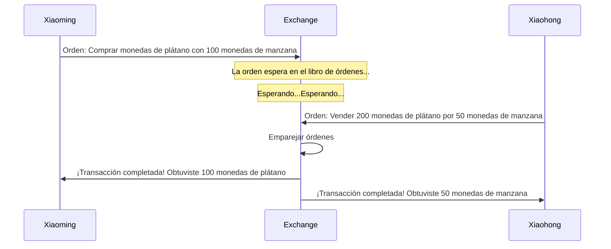
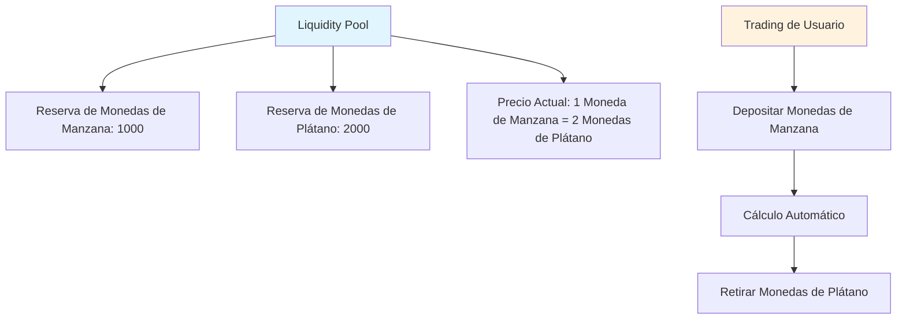
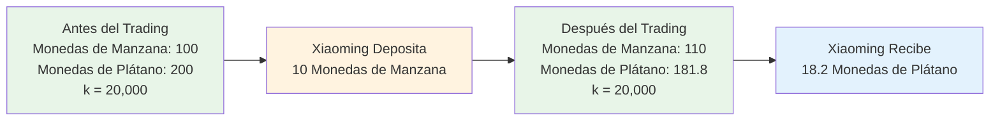
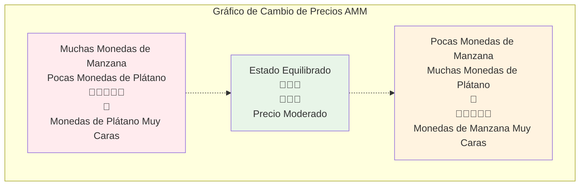
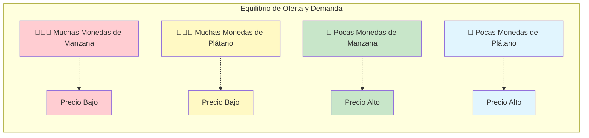
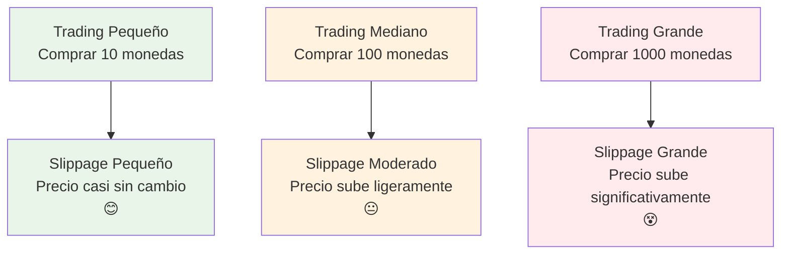
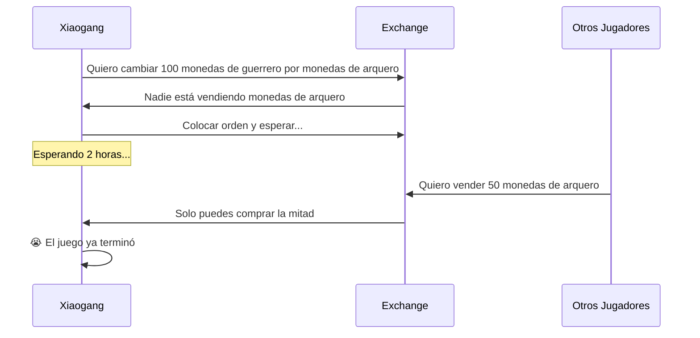
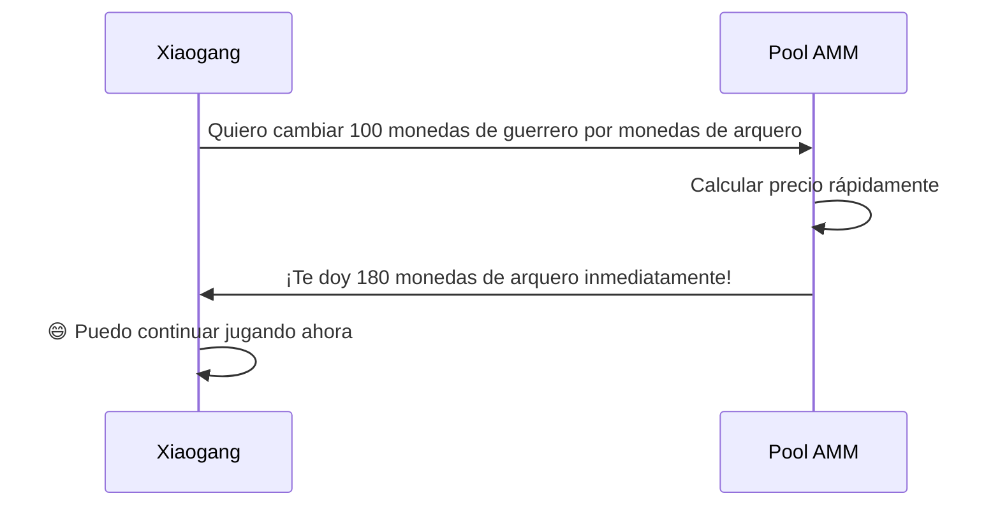
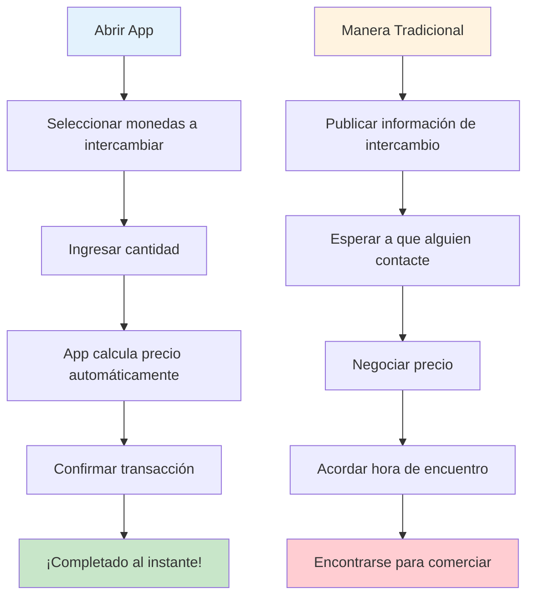

# Guía del Mecanismo AMM - Entendiendo los Creadores de Mercado Automatizados desde Cero

## Índice
1. [¿Qué es un AMM?](#qué-es-un-amm)
2. [La Historia de los Exchanges Tradicionales](#la-historia-de-los-exchanges-tradicionales)
3. [El Mundo Mágico de AMM](#el-mundo-mágico-de-amm)
4. [Principios Matemáticos Simplificados](#principios-matemáticos-simplificados)
5. [Funcionamiento de AMM Ilustrado](#funcionamiento-de-amm-ilustrado)
6. [¿Qué es el Slippage?](#qué-es-el-slippage)
7. [¿Por Qué Usar AMM?](#por-qué-usar-amm)
8. [Análisis de Casos Reales](#análisis-de-casos-reales)
9. [Resumen](#resumen)

---

## ¿Qué es un AMM?

Imagina que quieres cambiar manzanas por plátanos, pero no encuentras a nadie que quiera exactamente tus manzanas. Ahora, si hubiera una "máquina de jugos mágica" donde pones manzanas y automáticamente te da la cantidad correspondiente de plátanos, ¡ese es el concepto básico de un AMM (Creador de Mercado Automatizado)!

**AMM = Automated Market Maker (Creador de Mercado Automatizado)**

En términos simples, un AMM es un "robot de trading" inteligente que nunca descansa y te permite intercambiar diferentes tokens en cualquier momento y lugar, sin necesidad de esperar a que otra persona comercie contigo.

---

## La Historia de los Exchanges Tradicionales

### 📖 Los Problemas de Trading de Xiaoming

Xiaoming quiere cambiar sus 100 monedas de manzana por algunas monedas de plátano. En un exchange tradicional:

1. **Colocar una Orden**: Xiaoming coloca una orden "Quiero comprar monedas de plátano con 100 monedas de manzana, precio 1:2"
2. **Esperar un Comprador**: Xiaoming debe esperar hasta que alguien quiera vender monedas de plátano al precio adecuado
3. **Posiblemente Esperar Mucho Tiempo**: Si nadie quiere vender, Xiaoming podría esperar horas o incluso días
4. **Fluctuaciones de Precio**: Durante la espera, el precio puede cambiar y Xiaoming podría perder el mejor momento

### Problemas de los Exchanges Tradicionales:
- ⏰ **Necesidad de Esperar**: Debes esperar a que alguien quiera comerciar
- 📊 **Liquidez Insuficiente**: Tokens menos populares difíciles de intercambiar
- 💰 **Precio Inestable**: Órdenes grandes pueden causar fluctuaciones de precio violentas
- 🌙 **Limitaciones de Tiempo**: Los exchanges tienen horarios de operación

---

## El Mundo Mágico de AMM

### 🏪 La Tienda Automática Mágica

Ahora, imagina que hay una tienda automática mágica (AMM) que funciona así:

1. **Siempre Abierta**: Opera 24 horas, nunca cierra
2. **Trading Instantáneo**: Lo que quieras, puedes comprarlo de inmediato
3. **Precio Automático**: El precio se ajusta automáticamente según el inventario
4. **Sin Espera**: No necesitas esperar a otros clientes

### 🏦 Liquidity Pool = Almacén Súper

El núcleo del AMM es el "liquidity pool" (pool de liquidez), como un almacén gigante de dos compartimentos:

### 🤖 Robot de Precios Automático

El AMM tiene un robot de precios súper inteligente que sigue una regla simple:

**🔢 Fórmula Mágica: Cantidad de Monedas de Manzana × Cantidad de Monedas de Plátano = Valor Fijo (k)**

Esta fórmula asegura que:
- Cuantos más compren, más alto será el precio
- Cuantos más vendan, más bajo será el precio
- Siempre hay inventario para comprar y precio para vender

---

## Principios Matemáticos Simplificados

### 🧮 Fórmula del Producto Constante

¡No te asustes con las "matemáticas" — en realidad es muy simple!

Supongamos que en nuestro almacén mágico tenemos:
- Monedas de Manzana: 100
- Monedas de Plátano: 200
- Número Mágico k = 100 × 200 = 20,000

**Regla: ¡No importa cómo se comercie, el valor k debe permanecer en 20,000!**

### 📊 Ejemplo de Trading

**Xiaoming quiere cambiar 10 monedas de manzana por monedas de plátano:**

1. **Antes del Trading**:
   - Monedas de Manzana: 100
   - Monedas de Plátano: 200
   - k = 100 × 200 = 20,000

2. **Xiaoming deposita 10 monedas de manzana**:
   - Nueva cantidad de monedas de manzana: 100 + 10 = 110
   - Debe mantenerse k = 20,000
   - Entonces: 110 × Nueva cantidad de monedas de plátano = 20,000
   - Nueva cantidad de monedas de plátano = 20,000 ÷ 110 = 181.8

3. **Xiaoming recibe**:
   - Monedas de Plátano: 200 - 181.8 = 18.2
   - Cambió 10 monedas de manzana por 18.2 monedas de plátano

---

## Funcionamiento de AMM Ilustrado

### 🎢 Gráfico de Curva de Precios

El cambio de precio de AMM es como una montaña rusa, sigue una curva especial:

### 📈 Gráfico de Oferta y Demanda

Imagina los dos lados de una balanza:

---

## ¿Qué es el Slippage?

### 🛒 Analogía de Compras en el Supermercado

Imagina que vas al supermercado a comprar manzanas:

**Supermercado Tradicional (Exchange Centralizado):**
- Precio: 5 yuan/jin
- Comprar 1 jin: 5 yuan
- Comprar 100 jin: Todavía 5 yuan/jin
- ¡Pero puede que no haya tanto inventario!

**Supermercado Mágico (AMM):**
- 1er jin: 5 yuan
- 2do jin: 5.1 yuan (inventario disminuye, precio sube)
- 3er jin: 5.2 yuan
- ¡Cuanto más compres, más rápido sube el precio!

### 📊 Gráfico de Impacto del Slippage

### 🎯 Ejemplo de Cálculo de Slippage

Supongamos que el pool tiene 1000 monedas de manzana y 2000 monedas de plátano:

1. **Comprar 10 monedas de plátano**: Slippage aproximadamente 0.25%
2. **Comprar 100 monedas de plátano**: Slippage aproximadamente 2.5%
3. **Comprar 500 monedas de plátano**: Slippage aproximadamente 14%

**Conclusión: ¡Cuanto más compres, más alto será el precio promedio por moneda!**

---

## ¿Por Qué Usar AMM?

### 🌟 Súper Ventajas de AMM

#### 1. 🚀 Trading Instantáneo
- **Manera Tradicional**: Podrías esperar horas para encontrar una contraparte
- **Manera AMM**: Completa el trading en segundos

#### 2. 🌍 24/7 Todo el Día
- **Exchange Tradicional**: Tiene horarios de operación, cierra en festivos
- **AMM**: Nunca cierra, puedes comerciar en cualquier momento

#### 3. 🎯 Sin Necesidad de Emparejamiento
- **Manera Tradicional**: Necesita que compradores y vendedores coincidan en precio
- **AMM**: Puedes comerciar mientras haya monedas en el pool

#### 4. 💎 Soporte para Tokens de Nicho
- **Exchange Tradicional**: Tokens impopulares pueden no tener traders
- **AMM**: Puedes comerciar una vez que se cree el pool

### 📊 Tabla Comparativa

| Característica | Exchange Tradicional | AMM |
|------|-----------|-----|
| Velocidad de Trading | Necesita esperar emparejamiento ⏳ | Completado al instante ⚡ |
| Horario de Operación | Limitado 🕐 | 24/7 🌍 |
| Liquidez | Depende de órdenes de usuarios 👥 | Garantizado por algoritmo 🤖 |
| Descubrimiento de Precio | Libro de órdenes 📋 | Fórmula matemática 🧮 |
| Slippage | Depende de profundidad de órdenes 📊 | Depende del volumen de trading 📈 |

---

## Análisis de Casos Reales

### 🎮 Historia de Trading de Tokens de Juego

#### Configuración del Contexto
Xiaogang, en un juego blockchain, quiere intercambiar tokens del juego:
- 🗡️ Monedas de Guerrero (para comprar armas)
- 🏹 Monedas de Arquero (para comprar arcos)

#### Escenario Uno: Exchange Tradicional

#### Escenario Dos: AMM

### 🍕 Analogía de la Pizzería

**Modo Tradicional (encontrar amigos para intercambiar monedas):**
- Quieres Bitcoin, necesitas encontrar a alguien que quiera exactamente tu Ethereum
- Podrías tener que gritar en un grupo: ¿Alguien quiere cambiar Bitcoin por Ethereum?
- Podrías esperar medio día sin respuesta

**Modo AMM (máquina expendedora automática):**
- Como una máquina expendedora súper inteligente
- Depositas Ethereum, obtienes Bitcoin inmediatamente
- El precio se calcula automáticamente, sin necesidad de negociar

### 📱 Analogía de App Móvil

Imagina una app mágica de intercambio de monedas:

---

## Resumen

### 🎯 Revisión de Puntos Clave

1. **AMM es como una máquina expendedora mágica**
   - Depositas un tipo de moneda, obtienes inmediatamente otro tipo
   - Funciona 24 horas, nunca descansa

2. **La fórmula del producto constante es el núcleo**
   - x × y = k (número mágico que nunca cambia)
   - Esta fórmula hace que el precio se ajuste automáticamente

3. **El slippage es un fenómeno normal**
   - Cuanto más compres, más sube el precio
   - Como en el supermercado, comprar más cuesta más

4. **AMM es más conveniente que los exchanges tradicionales**
   - No necesitas esperar a nadie, trading instantáneo
   - Soporta todos los tipos de monedas
   - Siempre hay liquidez

### 🌈 Perspectiva Futura

La tecnología AMM sigue evolucionando:
- Algoritmos de precios más inteligentes
- Menor slippage
- Más funciones innovadoras

### 🎓 Consejos para Principiantes

1. **Comienza con Cantidades Pequeñas**: Practica primero con fondos pequeños
2. **Entiende el Slippage**: Ten cuidado con el slippage en trades grandes
3. **Compara Múltiples**: Diferentes AMM pueden tener precios diferentes
4. **Aprendizaje Continuo**: El mundo DeFi cambia rápidamente

---

## Apéndice: Preguntas Frecuentes

### ❓ FAQ

**P1: ¿Se acabarán las monedas en el AMM?**
R1: ¡Teóricamente no! Mientras haya monedas en el pool, puedes comerciar. Pero el precio podría ser muy alto.

**P2: ¿Por qué a veces hay grandes diferencias de precio?**
R2: Porque el tamaño del pool es diferente. Pools pequeños tienen grandes fluctuaciones de precio, pools grandes son relativamente estables.

**P3: ¿Es seguro AMM?**
R3: El código es de código abierto, pero ten cuidado de elegir plataformas auditadas.

**P4: ¿Cómo se calculan las comisiones?**
R4: Usualmente 0.1-1% del monto de la transacción, deducido automáticamente del resultado de la transacción.

**P5: ¿Puedo cancelar una transacción?**
R5: Puedes cancelar antes de la confirmación en cadena, pero tendrás que pagar una tarifa de cancelación.

Recuerda: ¡La inversión tiene riesgos, el trading requiere precaución! ¡Primero aprende, luego practica, comienza con cantidades pequeñas! 🚀
