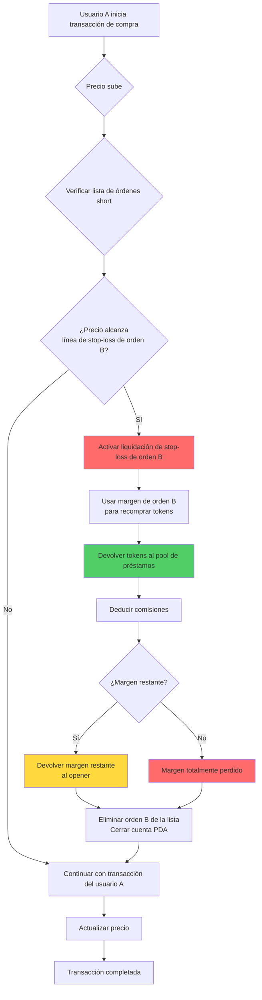
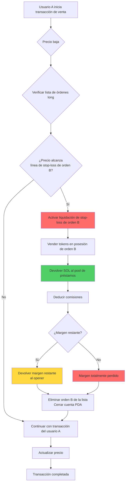
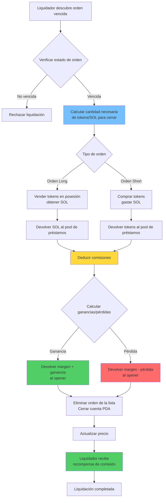
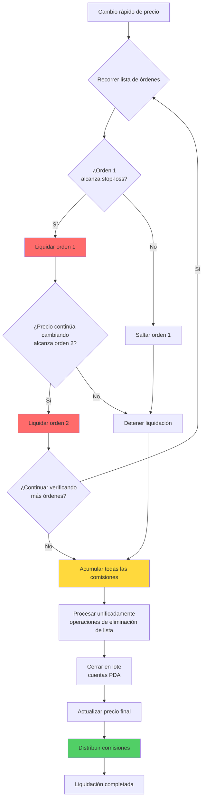

# ⚡ Función de Liquidación Forzosa (Liquidación) de PinPet

## 📋 Descripción General de la Función

La liquidación forzosa es un mecanismo central de control de riesgo en el protocolo PinPet para proteger la estabilidad del sistema. El sistema proporciona dos formas de activar la liquidación forzosa:

1. **⏰ Activación por Tiempo**: Cuando una orden de trading apalancado excede el tiempo de retención estipulado, cualquier persona puede activar la liquidación forzosa
2. **🎯 Activación por Precio**: Cuando el precio del mercado alcanza la línea de precio de stop-loss de la orden, se activa automáticamente la liquidación de stop-loss

Este mecanismo de doble protección asegura la liquidez y la seguridad de los fondos del protocolo, al mismo tiempo que protege al opener de pérdidas excesivas.

## ⚙️ Características Principales

### 1. 🔄 Mecanismo de Doble Activación

#### ⏰ Activación por Tiempo
- **✅ Cierre Normal**: Durante el período de retención de la orden, solo el opener puede cerrar la posición activamente
- **⏱️ Liquidación al Vencimiento**: Después del vencimiento de la orden, cualquier persona puede realizar la operación de liquidación forzosa
- **🔍 Verificación de Tiempo**: El sistema determina automáticamente si la orden ha vencido a través del timestamp en cadena

#### 🎯 Activación por Precio (Liquidación de Stop-Loss)
- **📉 Stop-Loss Long**: Cuando el precio cae y alcanza la línea de precio de stop-loss de la orden long, se cierra automáticamente
- **📈 Stop-Loss Short**: Cuando el precio sube y alcanza la línea de precio de stop-loss de la orden short, se cierra automáticamente
- **🔄 Activación Pasiva**: La liquidación de stop-loss activada por precio se ejecuta automáticamente cuando otros usuarios realizan transacciones
- **⚠️ Agotamiento del Margen**: Al ejecutar el stop-loss, el margen se usa para devolver el préstamo, el opener generalmente no tiene ganancias o pierde todo el margen

### 2. 📊 Soporte de Tipos de Órdenes

| Tipo de Orden | Condición de Activación por Precio | Condición de Activación por Tiempo | Dirección de Lista | Procesamiento de Activos |
|---------|------------|------------|---------|---------|
| 📈 Orden Long | Precio cae y alcanza la línea de stop-loss | Vencimiento de orden | Down | Devolver SOL prestado |
| 📉 Orden Short | Precio sube y alcanza la línea de stop-loss | Vencimiento de orden | Up | Devolver tokens prestados |

### 3. 👥 Roles de Participantes

- **👤 Opener**: Usuario que crea la orden apalancada, tiene derecho exclusivo de cierre antes del vencimiento de la orden
- **🔨 Liquidador**: Cualquier usuario tercero, puede ejecutar liquidación activa después del vencimiento de la orden
- **💼 Trader**: Las transacciones de compra-venta de otros usuarios pueden activar la liquidación de stop-loss por precio
- **🤖 Protocolo**: Gestiona automáticamente los fondos del pool de préstamos, asegurando el flujo normal de fondos

## 🔄 Flujo de Trabajo

### 📊 Tabla Comparativa de Flujos

| Etapa del Flujo | ⏰ Cierre por Activación de Tiempo | 🎯 Stop-Loss por Activación de Precio |
|---------|------------|------------|
| Condición de Activación | Vencimiento de orden | Precio alcanza línea de stop-loss |
| Momento de Activación | Iniciado activamente por liquidador | Activado pasivamente durante trading |
| Verificación de Permisos | Cualquiera puede ejecutar | Ejecución automática (sin permisos) |
| Liquidación de Ganancias/Pérdidas | Posible ganancia o pérdida | Generalmente pérdida total del margen |
| Procesamiento del Margen | Devolver margen restante | Usado para devolver préstamo |

### 📉 Flujo de Liquidación de Stop-Loss para Orden Short (Activación por Precio)



### 📈 Flujo de Liquidación de Stop-Loss para Orden Long (Activación por Precio)



### ⏰ Flujo de Liquidación al Vencimiento de Orden (Activación por Tiempo)



### 💥 Flujo de Liquidación en Cadena por Lotes



## 💰 Mecanismo de Comisiones

### 💵 Composición de Comisiones

| Tipo de Comisión | Objeto de Cobro | Tasa | Propósito |
|---------|---------|------|------|
| Comisión de Trading | Opener | Según tasa de orden | Compensar proveedores de liquidez |
| Comisión de Liquidación | Opener | Según tasa de orden | Recompensar ejecutores de liquidación |

### 🤝 Distribución de Comisiones

Todas las comisiones se distribuyen entre dos partes según la proporción de distribución configurada en el protocolo (fee_split):

- **🤝 Socios**: Reciben una cierta proporción de las comisiones
- **🔧 Proveedor Técnico**: Recibe las comisiones restantes

La proporción de distribución es establecida por el administrador al crear el pool de liquidez, con un rango de valores de 0-100.

## 💸 Reglas de Liquidación de Fondos

### ⏰ Liquidación Activada por Tiempo (Vencimiento de Orden)

#### ✅ Situación de Ganancia
Cuando la orden tiene ganancias:
- El opener recupera margen + parte de ganancia
- Se deducen comisión de trading y comisión de liquidación
- La dirección de liquidación debe ser la dirección del opener

#### ❌ Situación de Pérdida
Cuando la orden tiene pérdidas:
- La pérdida se deduce del margen
- El margen restante se devuelve al opener
- Se deducen comisión de trading y comisión de liquidación

#### 🧮 Fórmulas de Liquidación
**📈 Ganancias/Pérdidas de Orden Long**:
```
Ganancia = SOL obtenido de venta + Margen - SOL prestado - Comisiones
```

**📉 Ganancias/Pérdidas de Orden Short**:
```
Ganancia = SOL bloqueado - SOL gastado en recompra - Comisiones
```

### 🎯 Stop-Loss Activado por Precio (Liquidación Automática)

#### 🛡️ Procesamiento del Margen
- El margen se usa prioritariamente para devolver al pool de préstamos
- El saldo después de deducir la comisión de trading se usa completamente para cerrar la posición
- Normalmente el opener no tiene ganancias o pierde todo el margen

#### 🧮 Fórmulas de Liquidación
**📈 Stop-Loss de Orden Long**:
```
Margen restante = Margen - SOL prestado devuelto - Comisiones
Si margen restante > 0, devolver al opener
Si margen restante ≤ 0, margen totalmente perdido
```

**📉 Stop-Loss de Orden Short**:
```
Costo de recompra = SOL gastado en recompra de tokens + Comisiones
Margen restante = Margen - Costo de recompra
Si margen restante > 0, devolver al opener
Si margen restante ≤ 0, margen totalmente perdido
```

### 📊 Comparación de Escenarios de Liquidación

| Tipo de Escenario | Momento de Liquidación | Posibilidad de Ganancia | Devolución de Margen | Fuente de Comisiones |
|---------|---------|----------|----------|----------|
| ✅ Cierre Activo | Operación del opener | Puede ganar o perder | Principal + ganancia o deducir pérdida | Pagado por opener |
| ⏰ Liquidación al Vencimiento | Vencimiento de orden | Puede ganar o perder | Principal + ganancia o deducir pérdida | Pagado por opener |
| 🎯 Liquidación de Stop-Loss | Activación por precio | Generalmente pérdida | Saldo después de deducir margen | Deducido del margen |

## 🔗 Gestión de Listas Enlazadas

### 📋 Estructura de Lista de Órdenes

El sistema utiliza listas doblemente enlazadas para gestionar órdenes pendientes de cierre:

- **📈 Lista de Órdenes Long (Down)**: Ordenadas por precio de alto a bajo
- **📉 Lista de Órdenes Short (Up)**: Ordenadas por precio de bajo a alto

### 🔧 Operaciones de Lista

```
Verificación de nodo cabeza → Confirmar posición de orden
    ↓
Verificar relación entre nodos anterior y siguiente
    ↓
Eliminar nodo actual → Actualizar punteros de nodos anterior y siguiente
    ↓
Actualizar puntero de cabeza de lista
```

### 💥 Liquidación por Lotes

Cuando una transacción activa múltiples stops-loss de órdenes:
1. Recorrer la lista de órdenes en orden
2. Ejecutar cierre para cada orden vencida en secuencia
3. Acumular todas las comisiones de cierre
4. Realizar liquidación de fondos unificada

## 🛡️ Mecanismo de Seguridad

### 🔐 Verificación de Permisos

| Verificación | Condición de Tiempo | Requisito de Permisos |
|-------|---------|---------|
| Cierre Activo | Orden no vencida | Debe ser el opener |
| Liquidación Forzosa | Orden vencida | Cualquiera puede ejecutar |
| Dirección de Liquidación | En cualquier momento | Debe ser dirección del opener |

### 🔢 Seguridad Numérica

- Todos los cálculos utilizan métodos checked_* seguros, previenen desbordamiento
- El cálculo de comisiones adopta algoritmo de alta precisión, asegura exactitud
- Verificación de integridad de lista de órdenes, previene corrupción de datos

### 💎 Seguridad de Fondos

- Verificación automática de devolución de fondos del pool de préstamos
- Verificación de suficiencia de fondos del pool
- Protección contra cierre duplicado

## 🎬 Escenarios de Aplicación Real

### 🎯 Escenario Uno: Liquidación Normal al Vencimiento (Activación por Tiempo)

1. Usuario A abre posición long 5x a precio 100, margen 1 SOL, tiempo de retención 24 horas
2. Después de 24 horas el precio sube a 120, la orden tiene ganancia de aproximadamente 1 SOL
3. Usuario B descubre que la orden ha vencido, ejecuta liquidación forzosa
4. El sistema vende automáticamente tokens, devuelve préstamo, deduce comisión 0.1 SOL
5. Usuario A recibe principal 1 SOL + ganancia 1 SOL - comisión 0.1 SOL = 1.9 SOL

### 🚨 Escenario Dos: Liquidación de Stop-Loss Activada por Precio

1. Usuario C abre posición short 3x a precio 100, margen 2 SOL
2. Línea de precio de stop-loss establecida en 130 (calculada automáticamente al abrir)
3. Usuario D compra gran cantidad de tokens, precio sube rápidamente a 135
4. Precio alcanza línea de stop-loss de usuario C, el sistema liquida automáticamente orden C
5. Usa margen 2 SOL para recomprar tokens y devolver al pool de préstamos
6. Deduce comisión 0.1 SOL, devuelve 0.2 SOL restantes al usuario C
7. Usuario C pierde 1.8 SOL, la transacción de compra del usuario D continúa completándose

### 💥 Escenario Tres: Liquidación de Stop-Loss en Cadena

1. Precio sube rápidamente, activa línea de stop-loss de múltiples órdenes short
2. Usuario E envía transacción de compra, precio sube de 100 a 150
3. Sistema detecta necesidad de liquidar 5 órdenes short
4. Ejecuta operaciones de cierre de stop-loss en orden de precio en secuencia
5. Cada orden usa margen para recomprar tokens, devolver préstamo
6. Finalmente deduce comisiones acumuladas unificadamente, devuelve margen restante
7. Transacción de compra del usuario E finalmente se completa

### 📊 Escenario Cuatro: Liquidación de Stop-Loss Después de Cierre Parcial

1. Usuario F abre posición long de 1000 tokens, margen 5 SOL
2. Cierra activamente 500 tokens con ganancia de 2 SOL, quedan 500 tokens en posición
3. Precio continúa bajando, alcanza línea de stop-loss de posición restante
4. Sistema ejecuta automáticamente liquidación de stop-loss de 500 tokens restantes
5. Después de deducir préstamo y comisiones, usuario F tiene ganancia total de 0.5 SOL

## ❓ Preguntas Frecuentes

### Q1: ⏰ ¿Cuál es la diferencia entre activación por tiempo y 🎯 activación por precio?

A:
- **⏰ Activación por Tiempo**: Después del vencimiento de la orden, requiere que el liquidador inicie activamente la transacción para ejecutar el cierre, el opener puede tener ganancias o pérdidas
- **🎯 Activación por Precio**: Cuando el precio alcanza la línea de stop-loss, se ejecuta automáticamente durante las transacciones de otros usuarios, el opener generalmente pierde el margen

Ambos mecanismos son independientes, la orden puede activar primero el stop-loss por precio o puede ser liquidada primero al vencimiento.

### Q2: 🎯 ¿Cómo se determina la línea de precio de stop-loss?

A: La línea de precio de stop-loss se calcula automáticamente al abrir la posición según el apalancamiento y el margen:
- **📈 Orden Long**: Precio de stop-loss = Precio de apertura × (1 - 1/apalancamiento)
- **📉 Orden Short**: Precio de stop-loss = Precio de apertura × (1 + 1/apalancamiento)

Por ejemplo: 5x long, precio de apertura 100, stop-loss aproximadamente 80; 3x short, precio de apertura 100, stop-loss aproximadamente 133.

### Q3: 🔔 ¿Recibiré notificación cuando se active el stop-loss por precio?

A: ❌ No. La liquidación de stop-loss se activa pasivamente durante las transacciones de otros usuarios, el sistema no notificará con anticipación. Se sugiere:
- 🔍 Monitorear el estado de sus órdenes a través de eventos en cadena
- 📊 Usar herramientas de terceros para monitorear el riesgo de posiciones
- ⚠️ Establecer apalancamiento razonable, evitar activar fácilmente el stop-loss

### Q4: ⏰ ¿Cuánto tiempo después del vencimiento de la orden será liquidada forzosamente?

A: Después del vencimiento de la orden, puede ser liquidada forzosamente inmediatamente por cualquiera, no hay período de gracia adicional. Pero requiere que el liquidador inicie activamente la transacción. Se sugiere cerrar activamente la posición antes del vencimiento de la orden para retener más iniciativa.

### Q5: 💰 ¿La liquidación forzosa cobrará comisiones adicionales?

A: ✅ No cobrará comisiones adicionales. Ya sea activación por tiempo o por precio, las comisiones se cobran según la tasa establecida al abrir la orden, igual que el cierre normal.

### Q6: ⚠️ ¿Se perderá todo el margen al ejecutar liquidación de stop-loss?

A: No necesariamente. Aunque normalmente en la liquidación de stop-loss el margen se pierde en su mayoría, pero si:
- ✅ El precio justo alcanza la línea de stop-loss al activar el stop-loss
- 📊 La volatilidad del mercado no es grande, el costo de liquidación es bajo
- 💵 Las comisiones son bajas

Entonces puede haber un pequeño saldo de margen devuelto al opener. Pero en la mayoría de los casos, la liquidación de stop-loss significa pérdida significativa.

### Q7: 🔢 ¿Cuántas órdenes pueden liquidarse en una transacción?

A: Teóricamente, una transacción puede liquidar un máximo de 6 órdenes (longitud máxima del array de órdenes del sistema). La cantidad real de liquidación depende de:
- **🎯 Activación por Precio**: Depende de cuántas órdenes alcancen la línea de stop-loss dentro del rango de cambio de precio
- **⏰ Activación por Tiempo**: Depende de cuántas órdenes vencidas elija liquidar el liquidador

### Q8: 🔀 ¿Cómo se determina el orden de liquidación?

A: El orden de liquidación está determinado por la estructura de la lista de órdenes:
- **📈 Órdenes Long**: Liquidar en secuencia de precio alto a bajo (cuando el precio baja)
- **📉 Órdenes Short**: Liquidar en secuencia de precio bajo a alto (cuando el precio sube)

Este orden asegura que las órdenes que primero alcanzan la línea de stop-loss se liquiden primero, conforme al orden natural del cambio de precio.

### Q9: 🛡️ ¿Cómo evitar ser liquidado por stop-loss?

A: Se sugiere tomar las siguientes medidas:
- **⚙️ Apalancamiento Razonable**: Usar apalancamiento más bajo (2-3x), dejar más espacio para volatilidad de precio
- **💰 Tomar Ganancias Oportunamente**: Cuando la orden tiene ganancias, cerrar activamente la posición oportunamente, asegurar beneficios
- **👀 Atender al Mercado**: Prestar mucha atención a los cambios de precio, cerrar activamente la posición antes de acercarse a la línea de stop-loss
- **📊 Construir Posiciones por Partes**: No abrir toda la posición de una vez, reservar espacio de ajuste

### Q10: ❓ ¿Qué pasa si los fondos son insuficientes al liquidar?

A: El sistema verificará la suficiencia de fondos del pool antes de la liquidación. Si los fondos son insuficientes, la transacción fallará y se revertirá, no se ejecutará ninguna operación. Esta situación ocurre raramente, porque el diseño del protocolo asegura el balance de fondos.

### Q11: 🔓 ¿Se cerrará la cuenta PDA después de la liquidación forzosa?

A: ✅ Sí, después de completar la liquidación forzosa, la cuenta PDA relacionada se cerrará automáticamente, el alquiler se devolverá al pagador. Para:
- **⏰ Activación por Tiempo**: El alquiler se devuelve al ejecutor de liquidación
- **🎯 Activación por Precio**: El alquiler se devuelve al usuario que activa la transacción

### Q12: 🔄 ¿Cambiará el precio de stop-loss de la orden después del cierre parcial?

A: Sí. Después del cierre parcial, el precio de stop-loss de la orden se recalculará según la posición restante. Debido a que la posición se reduce, el precio de stop-loss estará más cerca del precio actual, el riesgo aumenta relativamente.

### Q13: 💥 ¿Puede ocurrir liquidación en cadena cuando el precio fluctúa dramáticamente?

A: ⚠️ Sí. Cuando el precio fluctúa rápidamente, puede activar liquidación de stop-loss en cadena:
1. El precio rompe cierta línea de stop-loss
2. Se activa la liquidación del primer lote de órdenes
3. La liquidación misma impulsa que el precio continúe cambiando
4. Se activa la liquidación del siguiente lote de órdenes

Esta situación es más fácil que ocurra en áreas con alto apalancamiento y órdenes densas, por lo tanto se sugiere usar apalancamiento alto con precaución.

### Q14: ❌ ¿Cuáles son las consecuencias si falla la liquidación?

A: Si la transacción de liquidación falla por alguna razón (como error de parámetros, fondos insuficientes, etc.), la transacción se revertirá, no causará ningún impacto en el sistema. La orden del opener permanecerá en su estado original, puede:
- ⏳ Esperar el siguiente intento de liquidación
- ✅ Cerrar la posición activamente por sí mismo
- 🎯 Esperar que otras transacciones activen stop-loss por precio

### Q15: 🚫 ¿Se puede cancelar una liquidación de stop-loss ya activada?

A: ❌ No se puede. La liquidación de stop-loss se ejecuta automáticamente en las transacciones de otros usuarios, una vez que el precio alcanza la línea de stop-loss, el proceso de liquidación comenzará inmediatamente, no se puede interrumpir o cancelar. Esto es para proteger la determinación del protocolo y prevenir riesgos sistémicos.
