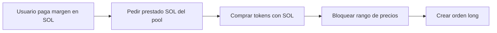
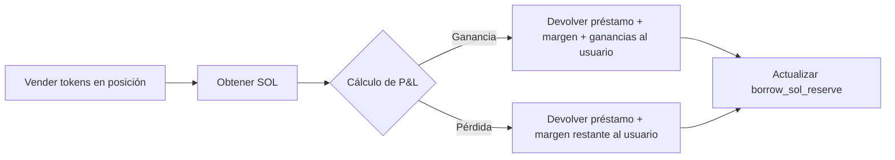
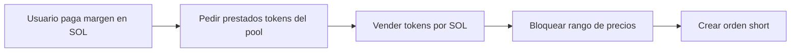
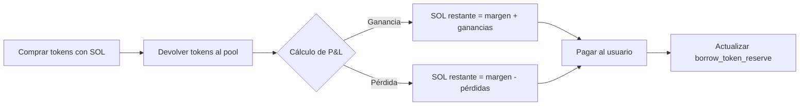
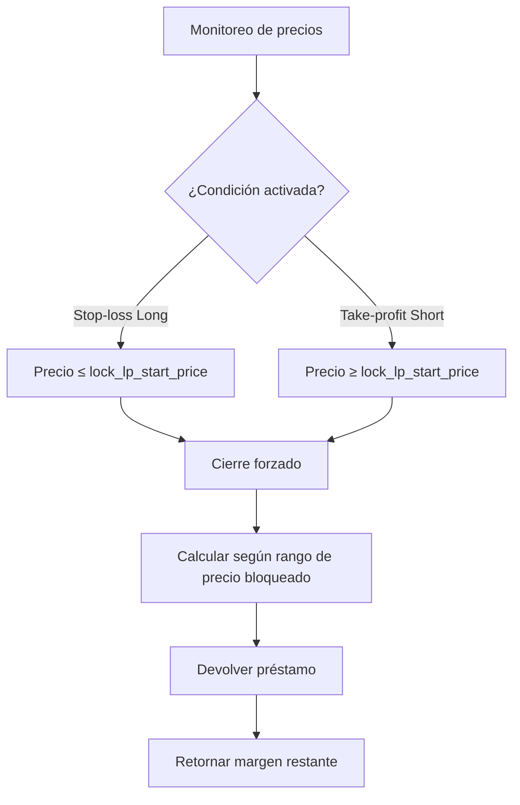
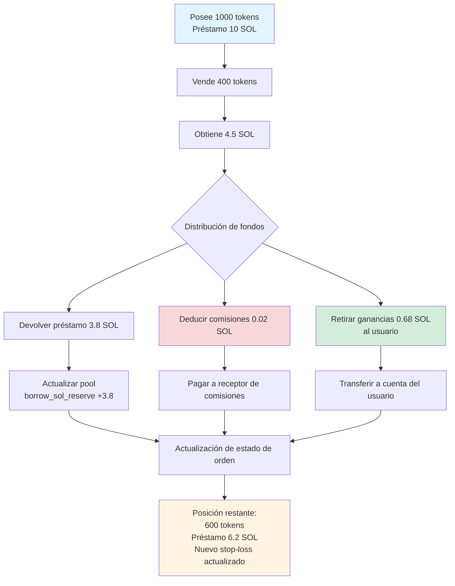
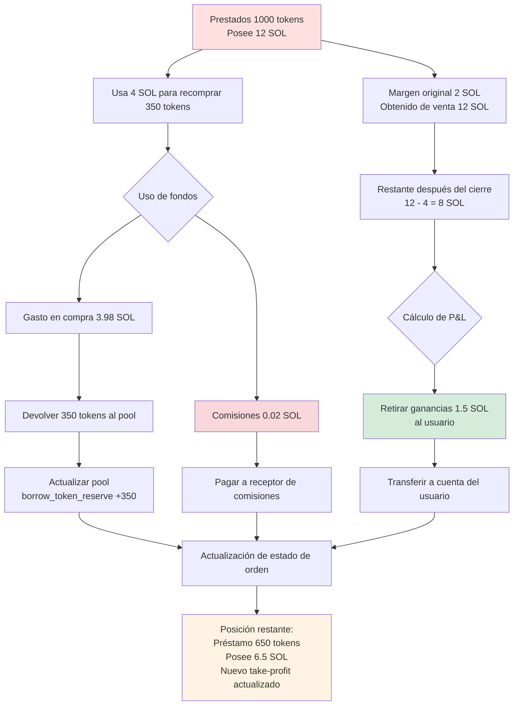

# 🏦 Introducción a la Funcionalidad del Pool de Préstamos

## I. 📋 Resumen General

El pool de préstamos de PinPet es el módulo central que soporta el trading apalancado, proporcionando servicios de préstamo de SOL y tokens a los usuarios, permitiendo funcionalidades de posiciones largas (long) y cortas (short). El pool de préstamos adopta un mecanismo de **reservas virtuales**, independiente del pool de liquidez del trading spot, asegurando que el trading apalancado no afecte el funcionamiento normal del mercado spot.

## II. 🎭 Doble Rol del Pool de Préstamos

### 2.1 💰 Como Pool de Fondos
- **Pool de Préstamos SOL**: Proporciona préstamos de SOL para traders que abren posiciones largas
- **Pool de Préstamos de Tokens**: Proporciona préstamos de tokens para traders que abren posiciones cortas

### 2.2 📦 Gestión de Reservas
El pool de préstamos mantiene dos reservas virtuales independientes:

| Tipo de Reserva | Descripción | Propósito |
|---------|------|------|
| `borrow_sol_reserve` | Reserva virtual de SOL | Para préstamos de traders en posiciones largas |
| `borrow_token_reserve` | Reserva virtual de tokens | Para préstamos de traders en posiciones cortas |

Estas reservas son **libros contables virtuales**, los fondos reales se almacenan en el pool de liquidez spot, logrando aislamiento mediante el mecanismo de bloqueo de rangos de precios.

## III. 🔄 Flujo de Préstamos en Trading Apalancado

### 3.1 📈 Trading Long (Posición Larga) - Pedir prestado SOL para comprar tokens

#### ⬆️ Fase de Apertura


**Flujo Detallado**:
1. **Inversión del usuario**: Pagar margen (ejemplo: 0.5 SOL) 💵
2. **Desembolso del pool**: Tomar prestado SOL de `borrow_sol_reserve` (ejemplo: 4.5 SOL) 💸
3. **Ejecutar transacción**: Comprar tokens en el AMM con un total de 5 SOL ⚙️
4. **Bloqueo de rango de precios**: Registrar el rango de precios al momento de compra, usado para cálculos de cierre 🔒
5. **Registro de orden**: Crear `MarginOrder`, registrando monto del préstamo, margen, cantidad de tokens en posición 📝


#### ⬇️ Fase de Cierre


**Liquidación de Fondos**:
- Total de SOL obtenido al vender tokens = `output_sol` 💰
- Deducir comisiones de transacción 💸
- Devolver al pool de préstamos: `borrow_amount` retorna a `borrow_sol_reserve` ⬅️
- Beneficio del usuario = total - préstamo - margen ✅

### 3.2 📉 Trading Short (Posición Corta) - Pedir prestados tokens para vender por SOL

#### ⬆️ Fase de Apertura


**Flujo Detallado**:
1. **Inversión del usuario**: Pagar margen en SOL 💵
2. **Desembolso del pool**: Tomar prestados tokens de `borrow_token_reserve` 💎
3. **Ejecutar transacción**: Vender tokens por SOL, depositar en el pool de fondos ⚙️
4. **Bloqueo de rango de precios**: Registrar el rango de precios al momento de venta 🔒
5. **Registro de orden**: Crear `MarginOrder`, registrando cantidad de tokens prestados, margen, SOL en posición 📝


#### ⬇️ Fase de Cierre


**Liquidación de Fondos**:
- Total de SOL necesario para recomprar tokens = `required_sol` + comisiones 💰
- Devolver al pool de préstamos: `borrow_amount` (tokens) retorna a `borrow_token_reserve` ⬅️
- Beneficio del usuario = SOL obtenido al vender - SOL gastado al comprar - margen ✅

## IV. 💸 Mecanismo de Reembolso del Pool de Préstamos

### 4.1 ✅ Reembolso por Cierre Voluntario
Cuando el usuario cierra una posición voluntariamente, el sistema ejecuta automáticamente el reembolso:

| Tipo de Trading | Activo de Reembolso | Fuente de Reembolso | Reserva Devuelta |
|---------|---------|---------|---------|
| Cerrar Long | SOL | Obtenido de venta de tokens | `borrow_sol_reserve` |
| Cerrar Short | Tokens | Recompra de tokens | `borrow_token_reserve` |

**Prioridad de Reembolso**:
1. Deducir comisiones de transacción 💸
2. Devolver principal del préstamo ⬅️
3. Retornar margen 💰
4. Distribuir ganancias/procesar pérdidas 📊

### 4.2 ⚠️ Reembolso por Liquidación Forzada
Cuando el precio alcanza el nivel de stop-loss/take-profit, el sistema ejecuta automáticamente el cierre forzado:



**Protección de Liquidación** 🛡️:
- Mediante el bloqueo del rango de precios, asegura que incluso con volatilidad extrema del mercado, se pueda cerrar al precio predeterminado
- El diseño del margen asegura la seguridad de los fondos del pool de préstamos

### 4.3 ⏰ Liquidación por Vencimiento
Después del vencimiento de la orden, cualquiera puede activar el cierre:

- Orden Long: tiempo de vencimiento `end_time` = tiempo de apertura + `borrow_duration` ⏱️
- Orden Short: igual que arriba
- Después del vencimiento, cierre forzado al precio de mercado actual, devolución del préstamo ⚡

## V. 🛡️ Mecanismos de Seguridad de Fondos del Pool de Préstamos

### 5.1 💼 Requisitos de Margen
- **Margen Mínimo**: `MIN_MARGIN_SOL_AMOUNT` (parámetro del sistema) 💰
- **Proporción de Margen**: Calculado dinámicamente según el múltiplo de apalancamiento y rango de volatilidad de precios 📊
- **Propósito del Margen**: Cubrir pérdidas cuando el precio se mueve desfavorablemente 🔒

### 5.2 🔐 Bloqueo de Rango de Precios
Cada orden bloquea liquidez en un rango de precios específico:

```
Bloqueo Long: [lock_lp_start_price, lock_lp_end_price] (rango de caída de precio)
Bloqueo Short: [lock_lp_start_price, lock_lp_end_price] (rango de subida de precio)
```

Esto asegura liquidez suficiente para devolver el préstamo al cerrar. ✅

### 5.3 ✔️ Verificación de Reservas
Antes de abrir posición, el sistema verifica:

| Item de Verificación | Condición | Código de Error |
|-------|------|-------|
| Reserva SOL | `required_borrow_sol ≤ borrow_sol_reserve` | `InsufficientBorrowingReserve` |
| Reserva Tokens | `required_borrow_token ≤ borrow_token_reserve` | `InsufficientBorrowingReserve` |


## VI. 💸 Mecanismo de Comisiones

### 6.1 📊 Comisiones de Trading Apalancado
- **Tasa de comisión**: `borrow_fee` (ejemplo: 0.5% = 50 puntos base) 💰
- **Momento de cobro**: Se cobra tanto al abrir como al cerrar posiciones ⏰
- **Distribución de comisiones**:
  - Socio: Proporción `fee_split` (ejemplo: 80%) 🤝
  - Proveedor de tecnología: 100% - `fee_split` (ejemplo: 20%) ⚙️

### 6.2 ⚡ Comisión de Liquidación Forzada
- Al activar liquidación, se cobra un `borrow_fee` adicional como tarifa de liquidación 💸
- Se usa para incentivar a terceros a ejecutar liquidaciones por vencimiento 🎯

## VII. 🎯 Funcionalidad de Cierre Parcial

Los usuarios pueden cerrar parcialmente posiciones, gestionando flexiblemente el riesgo: ⚙️

### 7.1 📈 Cierre Parcial de Long



**Detalles de Actualización de Orden**:

| Campo | Antes del Cierre | Después del Cierre | Descripción |
|-----|-------|-------|------|
| `position_asset_amount` | 1000 tokens | 600 tokens | Posición restante |
| `borrow_amount` | 10 SOL | 6.2 SOL | Préstamo restante |
| `lock_lp_start_price` | Stop-loss original | Nuevo stop-loss | Recalculado según nueva posición |
| `realized_sol_amount` | 0 SOL | 0.68 SOL | Ganancias realizadas acumuladas |

### 7.2 📉 Cierre Parcial de Short



**Detalles de Actualización de Orden**:

| Campo | Antes del Cierre | Después del Cierre | Descripción |
|-----|-------|-------|------|
| `borrow_amount` | 1000 tokens | 650 tokens | Préstamo restante (tokens) |
| `position_asset_amount` | 12 SOL | 6.5 SOL | SOL restante en posesión |
| `lock_lp_start_price` | Take-profit original | Nuevo take-profit | Recalculado según nueva posición |
| `realized_sol_amount` | 0 SOL | 1.5 SOL | Ganancias realizadas acumuladas |

### 7.3 ⚠️ Límite de Posición Mínima
Después del cierre parcial, la posición restante debe ser ≥ `MIN_TRADE_TOKEN_AMOUNT * 2`, para evitar crear posiciones micro que no puedan ser liquidadas.

## VIII. 🔗 Relación entre Pool de Préstamos y Pool de Liquidez

### 8.1 🔒 Aislamiento de Fondos
- **Pool de Liquidez Spot**: `lp_sol_reserve` + `lp_token_reserve`
- **Pool Virtual de Préstamos**: `borrow_sol_reserve` + `borrow_token_reserve`

Aunque los fondos reales están en las mismas cuentas `pool_sol_account` y `pool_token_account`, se logra aislamiento lógico mediante el mecanismo de bloqueo de rango de precios. 🛡️

### 8.2 🔄 Sincronización de Precios
- El trading spot y apalancado comparten el mismo `price` (precio de mercado actual) 💹
- Después de actualizar el precio, el sistema recalcula las reservas de liquidez: `price_to_reserves(price)` ⚙️

### 8.3 🤝 Complementariedad de Liquidez
- El rango de precios bloqueado por el trading apalancado no participa en el trading spot 🔐
- El trading spot puede activar cierres forzados de órdenes apalancadas, liberando liquidez ⚡

## IX. ✨ Ventajas Clave

| Característica | Descripción | Ventaja |
|-----|------|------|
| Reservas Virtuales | El pool de préstamos es un registro contable, no un pool de fondos real | Alta eficiencia de capital, sin necesidad de capitalización adicional |
| Bloqueo de Rango de Precios | Precio de cierre predecible | Reduce riesgo de liquidación, protege el pool de préstamos |
| Préstamos Bidireccionales | Soporta préstamos bidireccionales de SOL y tokens | Funcionalidad completa de long y short |
| Cierre Parcial | Ajusta posiciones flexiblemente | Buena experiencia de usuario, riesgo controlable |
| Liquidación por Vencimiento | Límite de tiempo + incentivo a terceros | Asegura devolución oportuna de fondos |


