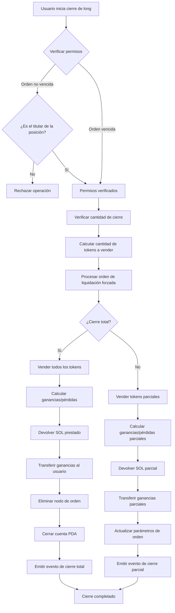
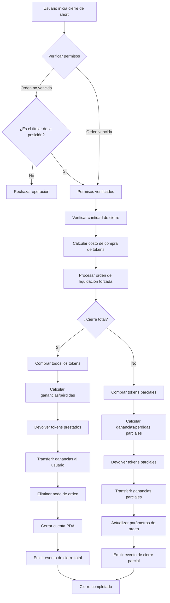

# 💼 Introducción al Producto de Cierre de Posiciones Apalancadas de PinPet

## 1. 📋 Descripción General de Funciones

### 🤔 ¿Qué es el cierre de posición?

El cierre de posición se refiere a la operación mediante la cual un usuario cierra su posición de trading apalancado. En la plataforma PinPet, después de abrir una posición, se crea una orden de margen que registra la relación de préstamo y la información de la posición. La operación de cierre de posición liquida la orden, devuelve el préstamo y liquida las ganancias o pérdidas al usuario.

### 💡 ¿Por qué es necesario cerrar posiciones?

| Razón para cerrar | Descripción |
|-------------------|-------------|
| **🎯 Take Profit/Stop Loss** | El usuario cierra activamente la posición para asegurar ganancias o limitar pérdidas |
| **⏰ Vencimiento de orden** | Después del vencimiento, cualquier persona puede activar el cierre para devolver los recursos prestados |
| **💰 Gestión de capital** | Liberar margen y ajustar flexiblemente la estrategia de trading |
| **🛡️ Control de riesgos** | Evitar mayores pérdidas causadas por fluctuaciones del mercado |

### 📊 Tipos de cierre de posición

- **🔚 Cierre total**: Cierra toda la posición de una vez, liquidando todas las ganancias/pérdidas
- **✂️ Cierre parcial**: Cierra la posición en lotes, realizando ganancias parciales mientras mantiene la posición restante

## 2. 📈 Función de Cierre de Posición Long (Close Long)

### 📝 Descripción de la función

El cierre de posición long es esencialmente una operación de **venta de tokens**. El usuario previamente pidió prestado SOL para comprar tokens al abrir una posición long, por lo que al cerrar necesita vender tokens para recuperar SOL y devolver el préstamo.

### 🔄 Diagrama de flujo de operación



### ⚙️ Descripción de parámetros clave

| Nombre del parámetro | Descripción | Valor de ejemplo |
|---------------------|-------------|------------------|
| `sell_token_amount` | Cantidad de tokens a vender (valor no exacto, puede tener pequeñas desviaciones) | 1000000 (1 token) |
| `min_sol_output` | Cantidad mínima de SOL esperada después de la venta (protección de slippage) | 50000000 (0.05 SOL) |
| `prev_order_id` | Posición del índice de la orden anterior en la lista enlazada | 2 |
| `close_order_id` | Índice de la orden a cerrar en el array de órdenes | 5 |
| `next_order_id` | Posición del índice de la siguiente orden en la lista enlazada | 7 |
| `close_order_address` | Dirección de la orden a cerrar (para verificación de seguridad) | "Abc123..." |

### 🧮 Explicación del cálculo de ganancias/pérdidas

#### 🔚 Escenario de cierre total

**Fórmula de cálculo**:

```
Ganancia SOL = (SOL obtenido de la venta) + (SOL de margen) - (SOL prestado)
```

**Pasos de cálculo**:
1. Vender todos los tokens retenidos, obtener SOL (ya con comisiones deducidas)
2. Sumar el margen pagado al abrir la posición
3. Restar el SOL prestado al abrir la posición
4. Número positivo = ganancia, número negativo = pérdida

#### ✂️ Escenario de cierre parcial

**Fórmula de cálculo**:

```
Ganancia actual = (SOL de venta actual) + (Margen total) + (SOL potencial de tokens restantes) - (SOL total prestado)
```

**Pasos de cálculo**:
1. Calcular el SOL obtenido de vender tokens esta vez
2. Calcular el SOL que los tokens restantes podrían obtener al nuevo precio de stop loss (después de comisiones)
3. Activos totales = Obtenido esta vez + Margen + Potencial restante
4. Restar el préstamo total para obtener la ganancia parcial
5. Devolver préstamo parcial, el margen restante continúa en posición

### 💹 Comparación de escenarios de ganancias/pérdidas

| Escenario | Precio de apertura | Precio de cierre | Tokens en posición | SOL prestado | Margen | SOL obtenido | Resultado |
|-----------|-------------------|------------------|-------------------|--------------|--------|--------------|-----------|
| **🟢 Escenario de ganancia** | 0.05 SOL | 0.08 SOL | 100 Token | 5 SOL | 0.5 SOL | 8 SOL | +2.5 SOL |
| **🔴 Escenario de pérdida** | 0.05 SOL | 0.03 SOL | 100 Token | 5 SOL | 0.5 SOL | 3 SOL | -1.5 SOL |
| **⚖️ Escenario neutro** | 0.05 SOL | 0.055 SOL | 100 Token | 5 SOL | 0.5 SOL | 5.5 SOL | 0 SOL |

## 3. 📉 Función de Cierre de Posición Short (Close Short)

### 📝 Descripción de la función

El cierre de posición short es esencialmente una operación de **compra de tokens**. El usuario previamente pidió prestados tokens y los vendió para obtener SOL al abrir una posición short, por lo que al cerrar necesita usar SOL para recomprar tokens y devolver el préstamo.

### 🔄 Diagrama de flujo de operación



### ⚙️ Descripción de parámetros clave

| Nombre del parámetro | Descripción | Valor de ejemplo |
|---------------------|-------------|------------------|
| `buy_token_amount` | Cantidad de tokens a comprar | 1000000 (1 token) |
| `max_sol_amount` | Cantidad máxima de SOL dispuesto a pagar (protección de slippage) | 60000000 (0.06 SOL) |
| `prev_order_id` | Posición del índice de la orden anterior en la lista enlazada | 1 |
| `close_order_id` | Índice de la orden a cerrar en el array de órdenes | 3 |
| `next_order_id` | Posición del índice de la siguiente orden en la lista enlazada | 6 |
| `close_order_address` | Dirección de la orden a cerrar (para verificación de seguridad) | "Def456..." |

### 🧮 Explicación del cálculo de ganancias/pérdidas

#### 🔚 Escenario de cierre total

**Fórmula de cálculo**:

```
Ganancia SOL = (SOL obtenido al vender tokens en apertura con comisiones) - (SOL gastado en recomprar tokens) - (comisiones)
```

**Pasos de cálculo**:
1. Usar SOL para recomprar todos los tokens prestados
2. Devolver los tokens prestados al pool de préstamos
3. Calcular: Obtenido en venta de apertura - Costo de compra en cierre - Comisiones
4. Número positivo = ganancia, número negativo = pérdida

#### ✂️ Escenario de cierre parcial

**Fórmula de cálculo**:

```
Ganancia actual = (Rango de recompra actual con comisiones) - (SOL gastado en recompra real) - (comisiones de recompra)
```

**Pasos de cálculo**:
1. Calcular el costo de recomprar tokens parciales esta vez (incluidas comisiones)
2. Calcular el costo de recomprar los tokens restantes en el futuro (incluidas comisiones)
3. Ganancia actual = Debe pagar esta vez - Gasto real
4. Devolver tokens parciales, actualizar parámetros de orden
5. El margen restante continúa en posición

### 💹 Comparación de escenarios de ganancias/pérdidas

| Escenario | Precio de apertura | Precio de cierre | Tokens prestados | SOL obtenido | Margen | Costo de recompra SOL | Resultado |
|-----------|-------------------|------------------|------------------|--------------|--------|----------------------|-----------|
| **🟢 Escenario de ganancia** | 0.08 SOL | 0.05 SOL | 100 Token | 8 SOL | 0.5 SOL | 5 SOL | +2.5 SOL |
| **🔴 Escenario de pérdida** | 0.05 SOL | 0.08 SOL | 100 Token | 5 SOL | 0.5 SOL | 8 SOL | -2.5 SOL |
| **⚖️ Escenario neutro** | 0.06 SOL | 0.06 SOL | 100 Token | 6 SOL | 0.5 SOL | 6 SOL | -0.06 SOL (comisiones) |

## 4. ⏰ Momento y Estrategia de Cierre de Posición

### 🎯 Momento de cierre activo

| Tipo de momento | Escenario aplicable | Estrategia recomendada |
|----------------|---------------------|------------------------|
| **📈 Cierre con take profit** | Precio alcanza objetivo esperado | Cierre parcial para asegurar ganancias, mantener posición restante |
| **🛑 Cierre con stop loss** | Precio cae por debajo del stop loss | Cierre total inmediato para controlar pérdidas |
| **🔧 Ajuste de posición** | Cambio en tendencia del mercado | Reducir o aumentar posición, optimizar estructura de tenencia |
| **⏳ Cierre antes de vencimiento** | Cerca del tiempo de vencimiento de la orden | Cierre activo para evitar liquidación forzada |

### ⚡ Cierre pasivo (liquidación forzada)

**Condiciones de activación**:
- ⏰ Tiempo de vencimiento de la orden ha pasado
- 👥 Cualquier usuario puede activar la liquidación
- 💵 El liquidador puede recibir una recompensa de comisión

**⚠️ Advertencia de riesgo**:
- 📉 Puede ser forzado a cerrar a precios desfavorables después del vencimiento
- 💡 Se recomienda gestionar activamente las posiciones antes del vencimiento

## 5. 📖 Ejemplos de casos de uso

### 🟢 Escenario uno: Cierre de posición long con ganancia

**Contexto**:
- Usuario abre long a 0.05 SOL, comprando 100 tokens
- Pide prestado 4.5 SOL, paga 0.5 SOL de margen
- Precio actual sube a 0.08 SOL

**Operación**:
1. Usuario decide cerrar totalmente para asegurar ganancias
2. Vende 100 tokens, obtiene aproximadamente 8 SOL (después de comisiones)
3. Devuelve 4.5 SOL de préstamo
4. Recupera 0.5 SOL de margen
5. Ganancia neta: 8 - 4.5 + 0.5 (margen ya contado en apertura) = aproximadamente 3 SOL

**✅ Resultado**: Logra exitosamente una rentabilidad del 60%

### 🔴 Escenario dos: Cierre de posición short con stop loss

**Contexto**:
- Usuario abre short a 0.05 SOL, pide prestado y vende 100 tokens, obteniendo 5 SOL
- Paga 0.5 SOL de margen
- Precio sube a 0.08 SOL, alcanzando el precio de stop loss

**Operación**:
1. Usuario cierra urgentemente por stop loss
2. Usa 8 SOL para recomprar 100 tokens (incluidas comisiones)
3. Devuelve 100 tokens al pool de préstamos
4. Margen 0.5 SOL + Obtenido en apertura 5 SOL = 5.5 SOL de fondos disponibles
5. Pérdida neta: 5.5 - 8 = -2.5 SOL

**✅ Resultado**: Stop loss oportuno, evita mayores pérdidas

### ✂️ Escenario tres: Ajuste de posición con cierre parcial

**Contexto**:
- Usuario mantiene posición long de 200 tokens
- Precio ha subido 30%
- Usuario desea asegurar ganancias parciales pero continuar manteniendo por perspectivas alcistas

**Operación**:
1. Cierre parcial de 100 tokens
2. Devuelve préstamo parcial de SOL
3. Obtiene ganancia parcial transferida a cuenta
4. Continúa manteniendo 100 tokens restantes
5. Parámetros de orden actualizados, precio de stop loss ajustado

**✅ Resultado**: Implementa estrategia flexible de gestión de posición

## 6. ⚠️ Notas y Limitaciones

### 🚫 Limitaciones operativas

| Tipo de limitación | Requisito específico | Descripción |
|-------------------|---------------------|-------------|
| **🔐 Verificación de permisos** | Solo el titular puede cerrar cuando la orden no ha vencido | Protege la seguridad de los activos del usuario |
| **💳 Dirección de liquidación** | Debe ser la dirección de billetera del titular | Los fondos solo pueden regresar a la dirección original |
| **📏 Volumen mínimo de trading** | No menos de 2 veces el volumen mínimo en cierre parcial | Evita órdenes insignificantes |
| **📊 Cantidad restante** | No menos del volumen mínimo después de cierre parcial | Garantiza validez de la orden |

### ⚠️ Advertencias de riesgo

#### 📉 Riesgo de slippage
- El precio de ejecución real al cerrar puede diferir del esperado
- Se recomienda establecer parámetros razonables de protección de slippage
- El slippage tiene mayor impacto en cierres de gran volumen

#### 💸 Costo de comisiones
- Cada cierre requiere pago de comisiones de transacción
- Cierres frecuentes aumentan los costos
- El cierre parcial requiere dos comisiones (actual + cierre total futuro)

#### ⏰ Riesgo temporal
- Después del vencimiento, cualquiera puede activar el cierre
- Puede ser liquidado a precios desfavorables
- Se recomienda gestionar órdenes próximas a vencer con anticipación

#### 🌊 Riesgo de mercado
- Fluctuaciones rápidas de precio pueden resultar en mal momento de cierre
- Mercados extremos pueden causar liquidación
- Se recomienda establecer stop loss razonables

### 💡 Recomendaciones de mejores prácticas

1. **🛡️ Establecer stop loss razonables**: Planificar precios de stop loss al abrir, ejecutar estrictamente
2. **✂️ Cierre en lotes**: Para grandes posiciones se recomienda cerrar en lotes, reduciendo impacto de mercado
3. **⏰ Atención al tiempo de vencimiento**: Gestionar activamente órdenes próximas a vencer 1-2 días antes
4. **💰 Controlar comisiones**: Evitar operaciones de cierre parcial demasiado frecuentes
5. **📊 Monitorear profundidad de mercado**: Verificar liquidez del mercado antes de cierres grandes

### 🔒 Garantías de seguridad técnica

- **✅ Verificación de dirección**: Verifica dirección de orden al cerrar, previene operación en orden incorrecta
- **🔐 Verificación de permisos**: Verificación de permisos múltiple, asegura que solo usuarios autorizados puedan operar
- **🛡️ Protección contra desbordamiento**: Todos los cálculos numéricos usan métodos checked seguros
- **⚛️ Operaciones atómicas**: Todos los pasos en el proceso de cierre se ejecutan atómicamente, previniendo inconsistencia de estado

---

## 📚 Apéndice: Glosario de términos

| Término | Explicación |
|---------|-------------|
| **PDA** | Program Derived Address, dirección derivada del programa, usada para almacenar datos de órdenes |
| **Margen** | SOL pagado por el usuario al abrir posición, como garantía de riesgo |
| **Pool de préstamos** | Pool virtual que proporciona fondos de apalancamiento |
| **Precio de stop loss** | Umbral de precio en el que la orden es forzosamente cerrada |
| **Descuento de comisiones** | Descuento en comisiones disfrutado después de cumplir condiciones |
| **Liquidación forzada** | Mecanismo de cierre automático después del vencimiento de la orden |
| **Nodo de lista enlazada** | Posición de la orden en la lista enlazada, usada para gestionar múltiples órdenes eficientemente |

---

*Este documento es una introducción al producto y no incluye detalles de implementación técnica. Para información sobre implementación técnica, consulte el código del proyecto y la documentación técnica.*
