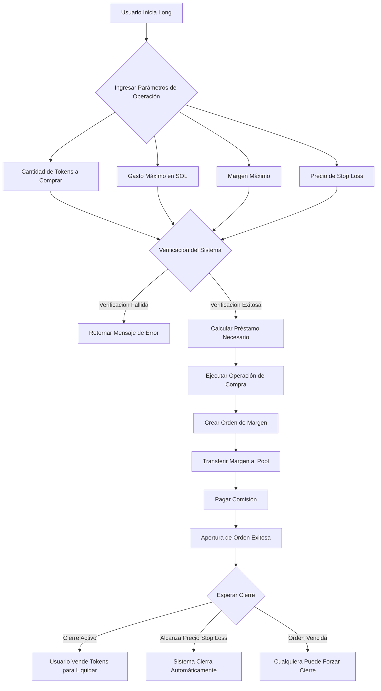
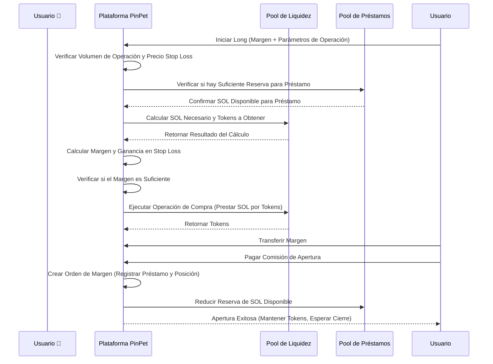
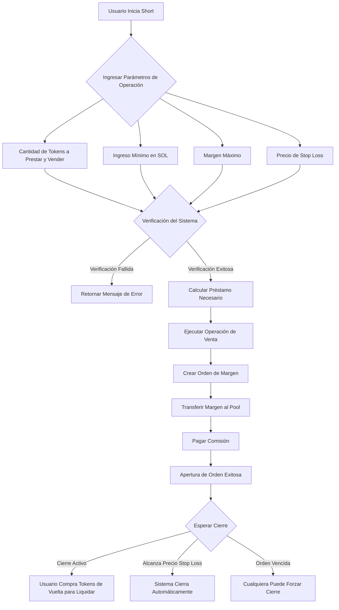
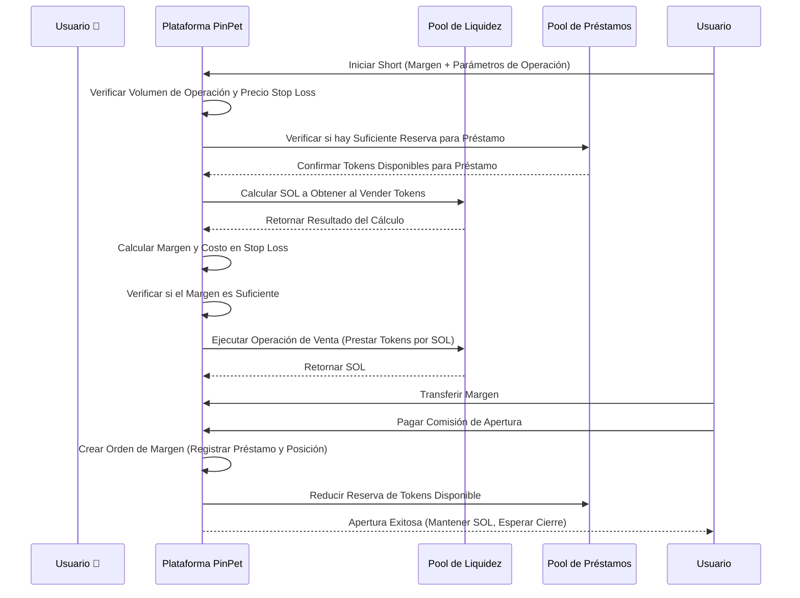
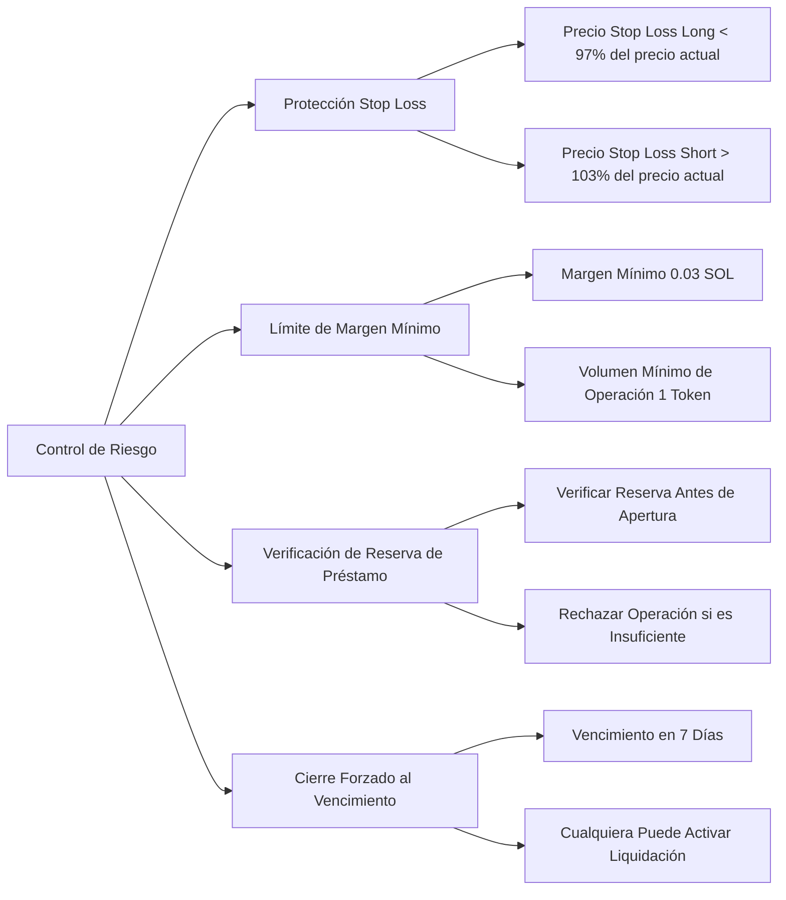

# 📊 Introducción al Producto de Apertura de Posiciones Apalancadas de PinPet

## 1. Descripción General de la Función 🎯

### Qué es el Trading Apalancado 💹

El trading apalancado es un instrumento financiero que utiliza fondos prestados para amplificar el tamaño de las operaciones, permitiendo a los usuarios controlar activos de mayor valor con menos margen. La plataforma PinPet ofrece dos métodos de trading apalancado: posiciones largas (long) y posiciones cortas (short), permitiendo a los usuarios obtener ganancias tanto cuando el precio del token sube como cuando baja.

### Conceptos Fundamentales 💡

- **Margen (Margin)** 💰: Fondos en SOL aportados por el usuario como garantía de la operación
- **Préstamo (Borrow)** 💵: Activos prestados de la plataforma (SOL para posiciones largas, tokens para posiciones cortas)
- **Precio de Stop Loss** 🛡️: Cuando el precio alcanza este nivel, el sistema cierra automáticamente la posición para controlar el riesgo
- **Cierre de Posición (Close Position)** 🔄: Operación de devolución del préstamo y liquidación de ganancias/pérdidas

### Tipos de Apalancamiento 📈📉

| Tipo de Operación | Expectativa de Mercado | Activo Prestado | Activo Mantenido | Condición de Ganancia |
|-------------------|------------------------|-----------------|------------------|----------------------|
| Long (Posición Larga) 🟢 | Alcista ⬆️ | Prestar SOL | Mantener tokens | Precio del token sube |
| Short (Posición Corta) 🔴 | Bajista ⬇️ | Prestar tokens | Mantener SOL | Precio del token baja |

---

## 2. Operación Long (Posición Larga) 🟢📈

### Descripción de la Función ✨

Una posición larga significa que el usuario es optimista sobre el precio futuro del token, tomando prestado SOL de la plataforma para comprar más tokens, y luego vendiendo los tokens para devolver el préstamo y obtener ganancias cuando el precio sube.

### Flujo de Operación del Usuario 🔄



### Diagrama de Flujo de Operación Long 📋



### Descripción de Parámetros Clave 📝

| Nombre del Parámetro | Descripción | Valor de Ejemplo | Restricciones |
|----------------------|-------------|------------------|---------------|
| buy_token_amount | Cantidad de tokens que se desea comprar | 1,000,000 (1 token) | No menor al volumen mínimo de operación (1 token) |
| max_sol_amount | Cantidad máxima de SOL dispuesto a pagar | 100,000,000 (0.1 SOL) | Puede ser menor en realidad (protección contra deslizamiento) |
| margin_sol_max | Margen máximo que el usuario está dispuesto a invertir | 50,000,000 (0.05 SOL) | No menor a 0.03 SOL |
| close_price | Precio de stop loss (precio de activación de cierre automático) | 95% del precio actual | Debe ser menor al 97% del precio actual |
| borrow_amount | Cantidad real de préstamo calculada por el sistema | 50,000,000 (0.05 SOL) | No excede la reserva del pool de préstamos |
| position_asset_amount | Cantidad de tokens en posición | 1,000,000 (1 token) | Igual a la cantidad de tokens comprados |

### Lógica de Cálculo del Margen 🧮

El margen asegura que el usuario pueda devolver el préstamo al cerrar en stop loss. La fórmula de cálculo es la siguiente:

```
Margen Real = Costo Total de Compra de Tokens - Ganancia al Cerrar en Stop Loss (después de comisiones)
```

**Ejemplo:**

Suponiendo que el precio actual del token es 0.1 SOL/Token:

1. El usuario quiere comprar 1 token, necesita aproximadamente 0.1 SOL
2. El usuario aporta un margen de 0.05 SOL, pide prestado 0.05 SOL
3. Establece precio de stop loss en 0.095 SOL/Token (95% del precio actual)
4. El sistema calcula: si vende 1 token al precio de 0.095, después de comisiones obtiene aproximadamente 0.0945 SOL
5. Cálculo del margen: 0.1 - 0.0945 = 0.0055 SOL (margen real requerido)
6. Los 0.05 SOL proporcionados por el usuario son mayores a 0.0055 SOL, cumple con la condición de apertura

### Advertencias de Riesgo ⚠️

- **Activación de Stop Loss** 🛑: Cuando el precio del token cae al precio de stop loss, el sistema vende automáticamente los tokens para devolver el préstamo, el usuario perderá el margen
- **Vencimiento de Orden** ⏰: Si no se cierra después del período de préstamo (por defecto 7 días), cualquiera puede forzar el cierre, el usuario debe cerrar activamente lo antes posible
- **Costo de Préstamo** 💸: Tanto la apertura como el cierre requieren el pago de comisiones (por defecto 0.25%)

---

## 3. Operación Short (Posición Corta) 🔴📉

### Descripción de la Función ✨

Una posición corta significa que el usuario es bajista sobre el precio futuro del token, tomando prestados tokens de la plataforma para venderlos inmediatamente por SOL, y luego comprando tokens de vuelta para devolver el préstamo y obtener ganancias cuando el precio baja.

### Flujo de Operación del Usuario 🔄



### Diagrama de Flujo de Operación Short 📋



### Descripción de Parámetros Clave 📝

| Nombre del Parámetro | Descripción | Valor de Ejemplo | Restricciones |
|----------------------|-------------|------------------|---------------|
| borrow_sell_token_amount | Cantidad de tokens que se desea prestar y vender | 1,000,000 (1 token) | No menor al volumen mínimo de operación (1 token) |
| min_sol_output | SOL mínimo esperado después de vender | 90,000,000 (0.09 SOL) | Puede ser mayor en realidad (protección contra deslizamiento) |
| margin_sol_max | Margen máximo que el usuario está dispuesto a invertir | 50,000,000 (0.05 SOL) | No menor a 0.03 SOL |
| close_price | Precio de stop loss (precio de activación de cierre automático) | 105% del precio actual | Debe ser mayor al 103% del precio actual |
| borrow_amount | Cantidad real de préstamo calculada por el sistema | 1,000,000 (1 token) | No excede la reserva del pool de préstamos |
| position_asset_amount | Cantidad de SOL en posición | 95,000,000 (0.095 SOL) | Igual al SOL obtenido después de vender (después de comisiones) |

### Lógica de Cálculo del Margen 🧮

El margen para posiciones cortas asegura que el usuario pueda comprar tokens de vuelta para devolver el préstamo al cerrar en stop loss. La fórmula de cálculo es la siguiente:

```
Margen Real = Costo de Recompra al Cerrar en Stop Loss (incluidas comisiones) - Ganancia de Venta (después de comisiones)
```

**Ejemplo:**

Suponiendo que el precio actual del token es 0.1 SOL/Token:

1. El usuario pide prestado 1 token y lo vende, después de comisiones obtiene aproximadamente 0.0975 SOL
2. Establece precio de stop loss en 0.105 SOL/Token (105% del precio actual)
3. El sistema calcula: si compra de vuelta 1 token al precio de 0.105, con comisiones necesita aproximadamente 0.1053 SOL
4. Cálculo del margen: 0.1053 - 0.0975 = 0.0078 SOL (margen real requerido)
5. El usuario debe invertir al menos 0.0078 SOL como margen
6. El usuario proporciona 0.05 SOL de margen, mayor que 0.0078 SOL, cumple con la condición de apertura

### Advertencias de Riesgo ⚠️

- **Activación de Stop Loss** 🛑: Cuando el precio del token sube al precio de stop loss, el sistema compra automáticamente tokens de vuelta para devolver el préstamo, el usuario perderá el margen
- **Riesgo Ilimitado** ⛔: Teóricamente el precio del token puede subir indefinidamente, el riesgo de posiciones cortas es mayor que el de posiciones largas
- **Vencimiento de Orden** ⏰: Si no se cierra después del período de préstamo (por defecto 7 días), cualquiera puede forzar el cierre
- **Costo de Préstamo** 💸: Tanto la apertura como el cierre requieren el pago de comisiones (por defecto 0.25%)

---

## 4. Riesgo y Retorno del Trading Apalancado 📊💰

### Efecto de Amplificación de Retornos 📈💎

La ventaja principal del trading apalancado es controlar una escala de activos mayor con menos capital, amplificando así los retornos.

**Ejemplo de Retorno Long:**

Suponiendo que el usuario invierte 0.05 SOL de margen en una posición larga de 1 token:

| Escenario | Precio de Apertura | Precio de Cierre | Valor de Posición | Monto de Reembolso | Ganancia Neta | Tasa de Retorno |
|-----------|-------------------|------------------|-------------------|--------------------|---------------|-----------------|
| Subida Pequeña | 0.1 | 0.11 | 0.11 SOL | 0.05 SOL | 0.06 SOL | +120% |
| Subida Grande | 0.1 | 0.15 | 0.15 SOL | 0.05 SOL | 0.10 SOL | +200% |
| Bajada Pequeña | 0.1 | 0.095 | 0.095 SOL | 0.05 SOL | 0.045 SOL | -10% |
| Activación Stop Loss | 0.1 | 0.095 | 0.095 SOL | 0.05 SOL | 0.045 SOL | -10% |

**Ejemplo de Retorno Short:**

Suponiendo que el usuario invierte 0.05 SOL de margen en una posición corta de 1 token:

| Escenario | Precio de Apertura | Precio de Cierre | Valor de Posición | Costo de Recompra | Ganancia Neta | Tasa de Retorno |
|-----------|-------------------|------------------|-------------------|-------------------|---------------|-----------------|
| Bajada Pequeña | 0.1 | 0.09 | 0.0975 SOL | 0.09 SOL | 0.0075 SOL | +15% |
| Bajada Grande | 0.1 | 0.05 | 0.0975 SOL | 0.05 SOL | 0.0475 SOL | +95% |
| Subida Pequeña | 0.1 | 0.105 | 0.0975 SOL | 0.105 SOL | -0.0075 SOL | -15% |
| Activación Stop Loss | 0.1 | 0.105 | 0.0975 SOL | 0.1053 SOL | -0.0078 SOL | -16% |

### Factores de Riesgo ⚠️

#### 1. Riesgo de Volatilidad de Precios 📉📈

- **Riesgo Long** 🟢: Si el precio del token cae más allá del precio de stop loss, se pierde todo el margen
- **Riesgo Short** 🔴: Si el precio del token sube más allá del precio de stop loss, se pierde todo el margen
- **Volatilidad Extrema** ⚡: Las fluctuaciones bruscas de precio en corto tiempo pueden llevar a un stop loss rápido

#### 2. Riesgo de Liquidez 💧

- **Agotamiento del Pool de Préstamos** 📛: Si la reserva del pool de préstamos es insuficiente, no se puede abrir posición
- **Pérdida por Deslizamiento** 📊: Un volumen de operación muy grande puede llevar a que el precio real de ejecución se desvíe de lo esperado

#### 3. Riesgo de Tiempo ⏰

- **Vencimiento de Orden** 🔔: Si no se cierra después de 7 días, cualquiera puede forzar el cierre, pudiendo ser liquidado a un precio desfavorable
- **Costo de Mantener Posición** 💸: Mantener posiciones a largo plazo implica costos de tiempo e incertidumbre del mercado

#### 4. Riesgo de Sistema 🔧

- **Cálculo de Precios** 🧮: Basado en el algoritmo de producto constante, las operaciones grandes pueden enfrentar un deslizamiento considerable
- **Acumulación de Comisiones** 💰: Las comisiones acumuladas de múltiples aperturas y cierres erosionarán las ganancias

### Medidas de Control de Riesgo 🛡️

La plataforma PinPet proporciona múltiples mecanismos de control de riesgo:



---

## 5. Ejemplos de Casos de Uso 💼

### Caso Uno: Posición Larga en Mercado Alcista 🟢⬆️

**Contexto** 📖: Xiaoming ve que un token Meme tiene tendencia alcista, precio actual 0.1 SOL

**Pasos de Operación** 🎯:
1. Xiaoming invierte 0.1 SOL de margen
2. Pide prestado 0.1 SOL (la plataforma presta a Xiaoming)
3. Usa un total de 0.2 SOL para comprar 2 tokens
4. Establece precio de stop loss en 0.095 SOL (si cae por debajo, stop loss automático)

**Situación de Ganancia** 💰📈: El token sube a 0.15 SOL
- Vende 2 tokens obteniendo 0.3 SOL (después de comisiones aproximadamente 0.2985 SOL)
- Devuelve préstamo de 0.1 SOL, quedan 0.1985 SOL
- Resta margen de 0.1 SOL, ganancia neta 0.0985 SOL (aproximadamente +98.5%)

**Situación de Stop Loss** 🛑📉: El token cae a 0.095 SOL (activa stop loss)
- Vende automáticamente 2 tokens obteniendo 0.19 SOL (después de comisiones aproximadamente 0.1895 SOL)
- Devuelve préstamo de 0.1 SOL, quedan 0.0895 SOL
- Pérdida de margen 0.1 - 0.0895 = 0.0105 SOL (aproximadamente -10.5%)

### Caso Dos: Posición Corta en Mercado Bajista 🔴⬇️

**Contexto** 📖: Xiaohong considera que el precio de cierto token está sobrevalorado, precio actual 0.2 SOL, prepara posición corta

**Pasos de Operación** 🎯:
1. Xiaohong invierte 0.15 SOL de margen
2. Pide prestado 1 token (la plataforma presta a Xiaohong)
3. Vende inmediatamente 1 token obteniendo 0.2 SOL (después de comisiones aproximadamente 0.195 SOL)
4. Establece precio de stop loss en 0.21 SOL (si sube por encima, stop loss automático)

**Situación de Ganancia** 💰📉: El token cae a 0.15 SOL
- Usa 0.15 SOL para comprar de vuelta 1 token (con comisiones aproximadamente 0.1504 SOL)
- Devuelve préstamo de 1 token
- Quedan 0.195 - 0.1504 = 0.0446 SOL
- Más el margen de 0.15 SOL, total 0.1946 SOL (ganancia neta 0.0446 SOL, aproximadamente +29.7%)

**Situación de Stop Loss** 🛑📈: El token sube a 0.21 SOL (activa stop loss)
- Compra automáticamente de vuelta 1 token con 0.21 SOL (con comisiones aproximadamente 0.2105 SOL)
- Devuelve préstamo de 1 token
- Gasto de 0.2105 SOL, pero al vender solo obtuvo 0.195 SOL
- Pérdida de 0.0155 SOL, se resta del margen (aproximadamente -10.3%)

### Caso Tres: Operación de Rango 🔄📊

**Contexto** 📖: Xiaogang es hábil en trading de corto plazo, opera repetidamente cuando el precio del token fluctúa en el rango de 0.08 - 0.12 SOL

**Estrategia** 🎯:
- Cuando el precio se acerca a 0.08 SOL, abre posición larga, establece stop loss en 0.075 SOL
- Cuando el precio se acerca a 0.12 SOL, abre posición corta, establece stop loss en 0.125 SOL
- Cierra activamente la posición cuando obtiene ganancias del 5-10% cada vez

**Ventaja** ✅: Usa apalancamiento para amplificar ganancias de fluctuaciones en el rango

**Riesgo** ⚠️: Puede activar stop loss al romper el rango, requiere disciplina estricta

---

## 6. Consideraciones y Limitaciones 📌

### Restricciones de Operación 🔒

| Ítem de Restricción | Valor | Descripción |
|---------------------|-------|-------------|
| Cantidad Mínima de Tokens de Operación | 1 Token (1,000,000 unidades mínimas) | Evita volumen de operación muy pequeño |
| Margen Mínimo | 0.03 SOL (30,000,000 lamports) | Asegura una escala significativa de operación |
| Precio Stop Loss Long | Por debajo del 97% del precio actual | Al menos 3% de espacio para stop loss |
| Precio Stop Loss Short | Por encima del 103% del precio actual | Al menos 3% de espacio para stop loss |
| Período Máximo de Préstamo | 7 días (604,800 segundos) | Puede ser forzado al cierre si vence |
| Límite del Pool de Préstamos | Ajuste dinámico según escala del pool de liquidez | Rechaza operación si la reserva es insuficiente |

### Descripción de Comisiones 💸

**Tipos de Comisiones** 📊:
- Comisión de Apertura: Por defecto 0.25% (borrow_fee)
- Comisión de Cierre: Por defecto 0.25% (borrow_fee)
- Distribución de Comisiones: Socios y proveedores técnicos comparten proporcionalmente

**Cálculo de Comisiones** 🧮:
- Apertura Long: Se cobra comisión sobre el monto de SOL para comprar
- Apertura Short: Se cobra comisión sobre el monto de SOL de venta
- Cierre: Se cobra comisión sobre el monto de operación

### Sugerencias de Mejores Prácticas 💡

#### 1. Establecer Stop Loss Razonablemente 🛡️

- **No Ser Demasiado Codicioso**: El precio de stop loss no debe establecerse demasiado cerca (cerca del límite del 3%)
- **Dejar Espacio de Amortiguación**: Considerar fluctuaciones a corto plazo, un espacio de stop loss del 5-10% es más seguro
- **Tomar Ganancias Oportunamente**: Cerrar activamente la posición cuando se alcanza la ganancia esperada, no esperar al cierre forzado

#### 2. Controlar Tamaño de Posición 📊

- **Diversificar Inversión** 🎯: No invertir todos los fondos en una sola orden
- **Construir Posición Gradualmente** ➡️: Puede abrir múltiples posiciones pequeñas para reducir el riesgo único
- **Reservar Fondos** 💰: Mantener parte de los fondos para responder a necesidades de margen adicional (función futura)

#### 3. Elegir Momento Adecuado ⏰

- **Liquidez Suficiente** 💧: Abrir posición cuando la reserva del pool de préstamos sea suficiente
- **Evitar Volatilidad Extrema** ⚡: Las fluctuaciones bruscas de precio pueden activar fácilmente stop loss
- **Atención al Tiempo de Vencimiento** 🔔: El tiempo de mantener posición previsto no debe acercarse al límite de 7 días

#### 4. Monitorear Estado de Orden 👀

- **Verificar Regularmente** 🔍: Revisar el estado de la orden al menos una vez al día
- **Alerta de Precio** 🚨: Tomar decisiones oportunamente cuando el precio se acerca al stop loss
- **Cierre Activo** ✅: No esperar al stop loss automático del sistema, el cierre activo puede evitar deslizamiento

### Preguntas Frecuentes ❓

**P1: ¿Se devolverá el margen?**

R: Sí. Al cerrar activamente, si hay ganancias, el margen más las ganancias se devuelven juntos; si se activa stop loss, el margen restante se devuelve (puede ser cero).

**P2: ¿Se puede cerrar antes del vencimiento?**

R: Sí. Antes del vencimiento de la orden, el usuario puede cerrar activamente en cualquier momento, sin penalización adicional.

**P3: ¿Qué sucede después del vencimiento de la orden?**

R: Después del vencimiento de la orden, cualquiera puede activar el cierre forzado. Se recomienda cerrar activamente antes del vencimiento para evitar ser liquidado a un precio desfavorable.

**P4: ¿Qué hacer si la reserva del pool de préstamos es insuficiente?**

R: Si la reserva del pool de préstamos es insuficiente, el sistema rechazará la apertura. Se sugiere esperar a que otros usuarios cierren posiciones para liberar reservas, o elegir otros pares de operación.

**P5: ¿Cómo se calculan las comisiones?**

R: Las comisiones se cobran según un cierto porcentaje del monto de operación (por defecto 0.25%). Se cobra una vez en la apertura y una vez en el cierre, aproximadamente 0.5% de costo total.

**P6: ¿Se puede ajustar el precio de stop loss?**

R: La versión actual no admite ajustar el precio de stop loss. Se recomienda establecer cuidadosamente el precio de stop loss al abrir.

---

## 7. Resumen 📝

La función de apertura de posiciones apalancadas de PinPet proporciona a los usuarios herramientas flexibles para posiciones largas y cortas, permitiendo obtener ganancias tanto cuando el precio del token sube como cuando baja. Mediante el uso razonable de mecanismos de margen y stop loss, los usuarios pueden amplificar retornos mientras controlan riesgos.

**Ventajas Principales** ✨:
- **Trading Bidireccional** 🔄: Se puede ganar tanto con posiciones largas como cortas
- **Amplificación por Apalancamiento** 📈: Pequeño capital genera grandes retornos
- **Stop Loss Automático** 🛡️: Mecanismo de protección de precios reduce riesgos
- **Cierre Flexible** ✅: Liquidación activa en cualquier momento

**Advertencia de Riesgo** ⚠️:
- ⛔ El trading apalancado tiene alto riesgo, puede perder todo el margen
- 📚 Por favor comprenda completamente el mecanismo de operación antes de operar
- 💡 Se recomienda empezar con pequeñas cantidades, acumular experiencia gradualmente
- 🚫 No invierta más fondos de los que puede permitirse perder

¡Le deseamos un trading exitoso! 🎉
