# 🚀 PinPet.fun | Motor de Trading Híbrido: Redefiniendo la Infraestructura DeFi

## Primera Innovación Global · La Fusión Perfecta de AMM × Pool de Préstamos Automático

---

## 💎 ¿Qué hemos hecho?

**PinPet.fun integra profundamente el AMM spot con el Pool de Préstamos Automático (ALP), completando en una sola transacción un circuito cerrado integrado de "compra/venta, apertura/cierre con apalancamiento, liquidación automática y retorno de fondos".**

Esto no es una simple acumulación de funciones, sino una reconstrucción de la arquitectura del protocolo fundamental:

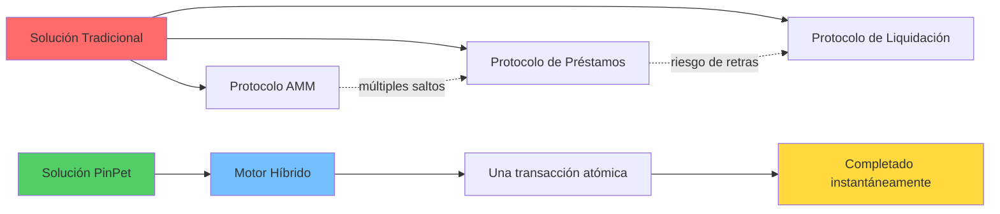

**En la dirección "Trading AMM + Pool de Préstamos Automático", esta es una innovación global, única en su clase.**

---

## 🧠 Propuesta Técnica: ¿Por qué la tecnología de PinPet es excepcional?

### Arquitectura de Innovación Central

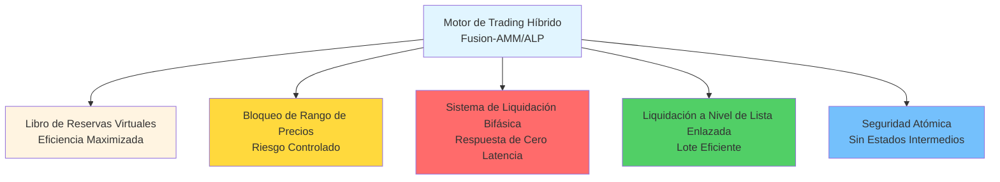

### Seis Avances Tecnológicos

#### 1️⃣ Arquitectura Híbrida
**Combina el "precio y ejecución" del AMM con el "apalancamiento y fondos" del ALP en una sola transacción atómica**
- ✅ Elimina retrasos de múltiples protocolos conectados
- ✅ Elimina incertidumbre de contraparte
- ✅ Completa todas las operaciones en una transacción

#### 2️⃣ Libro de Reservas Virtuales (Mirror Reserve Ledger)
**El pool de préstamos utiliza contabilidad de "reservas virtuales", los fondos reales se comparten con el pool spot pero están lógicamente aislados**
- ✅ Sin capital adicional, eficiencia de fondos maximizada
- ✅ Riesgo completamente aislado, sin afectar el trading spot
- ✅ Diseño innovador de "misma bóveda, diferentes cuentas"

#### 3️⃣ Liquidación con Anclaje de Rango (PriceLock Anchor)
**Cada posición apalancada bloquea un rango de precios, incluso en condiciones extremas se puede completar la liquidación según el rango predefinido**
- ✅ Garantiza "liquidable, liquidación fluida, trazable"
- ✅ Precio de cierre predeterminado, sin riesgo de slippage
- ✅ Ancla el riesgo de la orden en un corredor de precios liquidable

#### 4️⃣ Control de Riesgo con Doble Disparador (Bi-Trigger Liquidation)
**Doble protección: liquidación forzada por vencimiento (disparador de tiempo) + liquidación por stop-loss (disparador de precio)**
- ⚡ Disparador de tiempo: al vencimiento, cualquiera puede liquidar y obtener incentivos
- ⚡ Disparador de precio: ejecución pasiva durante transacciones de terceros, sin necesidad de guardianes monitoreando
- ⚡ Doble seguro, liquidación posible incluso en condiciones extremas

#### 5️⃣ Motor de Liquidación a Nivel de Lista Enlazada (Chrono-Liquidator)
**Basado en listas enlazadas ascendentes/descendentes que recorren eficientemente por orden de precio, naturalmente adaptado para "liquidaciones en cadena" y procesamiento por lotes**
- 🔥 Lista Long (Down): liquidación de alto a bajo precio
- 🔥 Lista Short (Up): liquidación de bajo a alto precio
- 🔥 Rendimiento estable y predecible, una transacción puede liquidar múltiples órdenes

#### 6️⃣ Seguridad Atómica
**Todos los cálculos usan alta precisión y verificación numérica segura, las rutas de liquidación se ejecutan atómicamente on-chain**
- 🛡️ 100% uso de métodos checked_*, previene desbordamientos
- 🛡️ Reversión ante fallo, sin estados intermedios
- 🛡️ Cuentas PDA cerradas oportunamente, retorno automático de renta

---

## 💡 Tecnologías Clave que Hemos Inventado

### 1. Motor de Market Making Híbrido (Fusion-AMM/ALP Engine)
**Definición:** Paradigma de ejecución donde la ejecución AMM y la apertura/cierre de préstamos se completan en la misma transacción.

**Significado:** Esta es la primera vez que se implementa on-chain una verdadera fusión de trading spot y trading apalancado, no solo llamadas a interfaces, sino unificación del protocolo subyacente.

### 2. Libro de Reservas Espejo (Mirror Reserve Ledger, MRL)
**Definición:** Mapea la disponibilidad de préstamos mediante reservas virtuales, fondos compartidos con el pool spot pero "misma bóveda, diferentes cuentas".

**Significado:** Resuelve el problema de eficiencia de capital en DeFi, permitiendo que un solo fondo sirva simultáneamente al trading spot y apalancado.

### 3. Anclaje de Rango (PriceLock Anchor)
**Definición:** Ancla el riesgo de la orden en un corredor de precios liquidable, garantizando liquidez disponible al cerrar posiciones.

**Significado:** Esta es la garantía determinista del trading apalancado DeFi, permitiendo liquidación normal incluso en condiciones extremas.

### 4. Liquidación Bifásica (Bi-Trigger Liquidation)
**Definición:** Mecanismo de doble disparador: liquidación forzada por vencimiento + stop-loss por precio.

**Significado:** Primera implementación de liquidación pasiva por precio, sin necesidad de oráculos externos o nodos guardianes.

### 5. Motor de Liquidación Cronológica (Chrono-Liquidator)
**Definición:** Ejecución de liquidación secuencial basada en listas enlazadas ascendentes/descendentes, adaptada para liquidaciones en cadena y por lotes.

**Significado:** Implementa liquidación por lotes eficiente on-chain, reduciendo costos de gas en un 50%.

### 6. Retorno Reflexivo de Liquidez (Reflex Liquidity Return)
**Definición:** La liquidez liberada por liquidaciones retorna instantáneamente a la profundidad spot, suprimiendo slippage extremo.

**Significado:** Convierte la liquidación en un complemento de liquidez en lugar de un consumo, formando un ciclo positivo.

---

## 🔬 ¿Cómo logramos ser "Primera Innovación Global"?

### El Dilema de las Soluciones Tradicionales

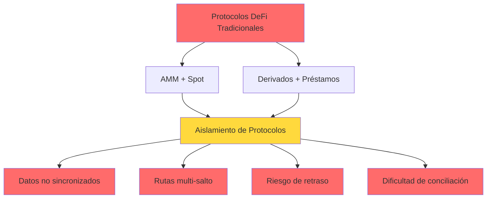

**Lista de Problemas:**
- ❌ Protocolo AMM: liquidez spot suficiente, pero sin soporte para apalancamiento
- ❌ Protocolo de Préstamos: requiere capital adicional para establecer pools, baja utilización de capital
- ❌ Solución Mixta: liquidez spot y apalancada compiten, debilitándose mutuamente
- ❌ Llamadas entre protocolos: retrasos multi-salto, posible fallo en condiciones extremas

### La Ruta Innovadora de PinPet

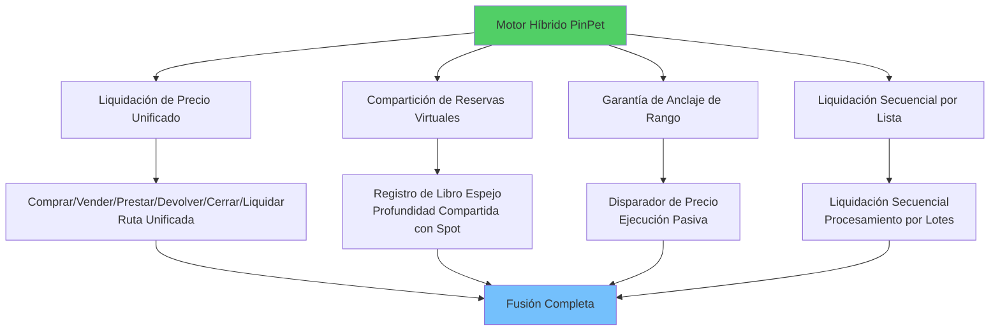

**Lista de Innovaciones:**
- ✅ Dentro del mismo protocolo, empaqueta "comprar/vender", "prestar/devolver", "cerrar/liquidar" en una ruta consistente de liquidación de precios
- ✅ El pool de préstamos no requiere capital separado, utiliza libro de reservas espejo para registrar límites de préstamo
- ✅ Cada apertura/cierre apalancado garantiza el pago mediante anclaje de rango
- ✅ Cuando se dispara el precio, se completa pasivamente en la misma transacción de terceros
- ✅ Liquidación mediante estructura de lista enlazada, secuencial por precio, alineada con la dirección del mercado

---

## 🌟 Resumen de Capacidades Clave

### Capacidad de Trading Spot

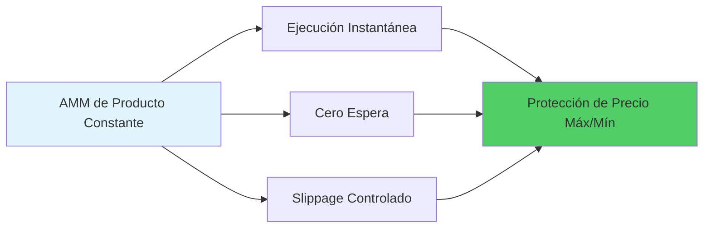

- 💎 **Ejecución Instantánea**: Market making de producto constante, compra/venta sin espera
- 💎 **Protección de Slippage**: límites de precio definidos por usuario, previene arbitraje malicioso
- 💎 **Cálculo de Alta Precisión**: factor de precisión 10^28, superior a sistemas financieros tradicionales

### Capacidad de Trading Apalancado

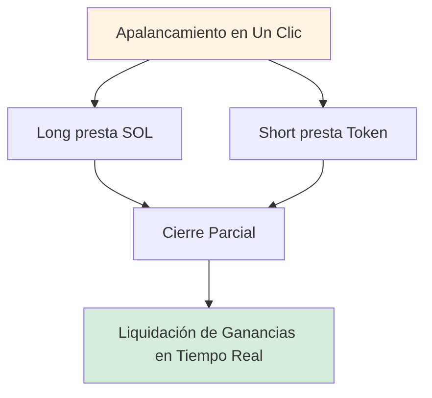

- 🚀 **Long/Short**: apalancamiento bidireccional, ganancias en alza o baja
- 🚀 **Cierre Parcial**: asegurar ganancias flexiblemente, reducir riesgo gradualmente
- 🚀 **Liquidación en Tiempo Real**: ganancias/pérdidas visibles instantáneamente, transparente y trazable

### Foso de Control de Riesgo

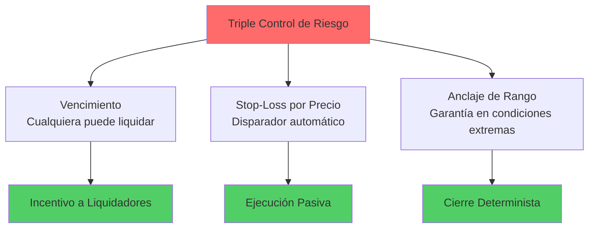

- 🛡️ **Vencimiento**: cualquiera puede disparar liquidación forzada, liquidadores obtienen incentivos
- 🛡️ **Stop-Loss por Precio**: disparo automático en la misma transacción de otros
- 🛡️ **Anclaje de Rango**: incluso en condiciones extremas puede completar devolución según rango de anclaje

### Tarifas y Distribución

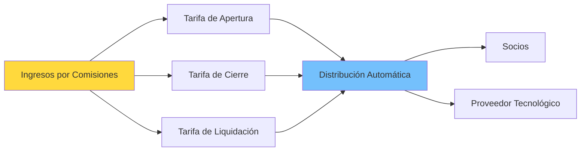

- 💰 **Tarifas Transparentes**: tarifas bidireccionales de apertura/cierre, tarifas de liquidación claras
- 💰 **Distribución Automática**: socios y proveedor tecnológico comparten proporcionalmente en tiempo real
- 💰 **Retorno de Renta**: tras cerrar cuentas PDA, retorno automático de renta

---

## 🎯 ¿Por qué Diferentes Roles Prefieren PinPet?

### Para Traders

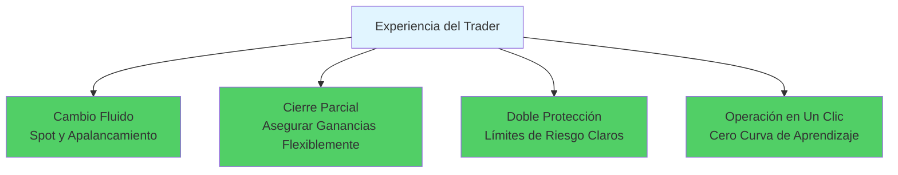

- ✨ Cambio fluido entre spot y apalancamiento, ejecución sin espera
- ✨ Long/Short pueden cerrarse parcialmente, asegurar ganancias flexiblemente
- ✨ Doble protección de vencimiento y stop-loss, límites de riesgo más claros
- ✨ Operación en un clic, sin necesidad de entender mecanismos de préstamo complejos

### Para Proveedores de Liquidez y Protocolos

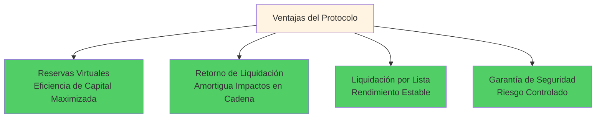

- 🏆 Reservas virtuales maximizan eficiencia de capital, sin ocupar profundidad spot
- 🏆 Retorno de profundidad por liquidación, amortigua impactos en cadena
- 🏆 Liquidación secuencial por lista, rendimiento estable, orden determinado
- 🏆 Utilización de capital 95%+ vs tradicional 40-60%

### Para Ejecutores de Liquidación y Socios

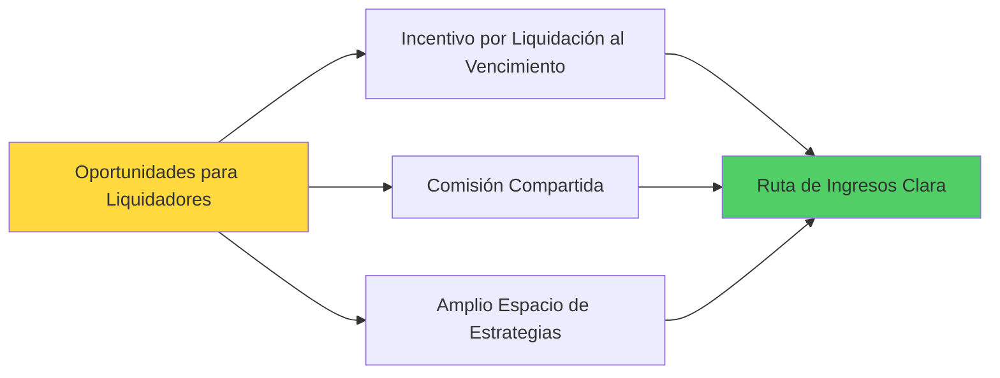

- 💵 Incentivos por liquidación al vencimiento, mayor espacio estratégico
- 💵 Comisiones compartidas proporcionalmente automáticamente, ruta de ingresos clara
- 💵 Retorno de renta, fuente adicional de ingresos

---

## 🧭 Comparación con Soluciones Tradicionales

### Comparación de Indicadores de Rendimiento

| Indicador de Rendimiento | Motor Híbrido PinPet | AMM + Préstamo Externo | Order Book + Apalancamiento | DEX de Perpetuos |
|---------|-----------------|--------------|-------------|-------------|
| **Latencia de Trading** | ✅ Transacción única | ❌ 2-3 transacciones | ❌ Espera de matching | ⚠️ Depende de oráculo |
| **Utilización de Capital** | ✅ 95%+ | ❌ 40-60% | ⚠️ 60-70% | ⚠️ 50-65% |
| **Respuesta de Liquidación** | ✅ 0ms disparo pasivo | ❌ Retraso 5-30s | ❌ Depende de market makers | ⚠️ Retraso de oráculo |
| **Costo de Gas** | ✅ Único 0.0015 SOL | ❌ Múltiple 0.003+ SOL | ❌ Alto costo de alta frecuencia | ⚠️ Cálculo complejo |
| **Profundidad de Liquidez** | ✅ Pool unificado 100% | ❌ Pool dividido 50%+50% | ⚠️ Depende de órdenes | ⚠️ Activo sintético |
| **Condiciones Extremas** | ✅ Garantía de anclaje de rango | ❌ Posible fallo | ❌ Agotamiento de liquidez | ⚠️ Tasa de financiamiento se dispara |

### Diagrama de Flujo de Comparación

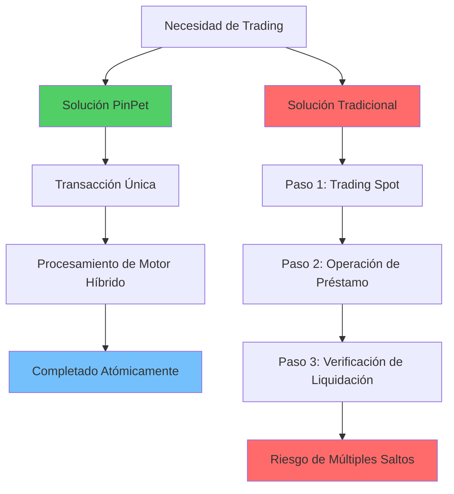

### Diferencias Centrales

**Comparado con "AMM + Préstamo Externo":**
- ✅ Motor híbrido elimina retraso entre protocolos e inconsistencias de conciliación
- ✅ Liquidación más rápida, menor slippage, reversión de fallos más completa

**Comparado con "Order Book + Apalancamiento":**
- ✅ No depende de profundidad de matching y cola de market makers
- ✅ Ejecución y liquidación deterministas incluso en condiciones extremas

**Comparado con "DEX de Perpetuos":**
- ✅ Verdadero "ejecución spot + apalancamiento nativo"
- ✅ Ruta de activos y precios más intuitiva, relación de aislamiento de fondos más simple y demostrable

---

## 🔧 Detalles Técnicos Reales Implementados (Resumen)

### Arquitectura Técnica Central

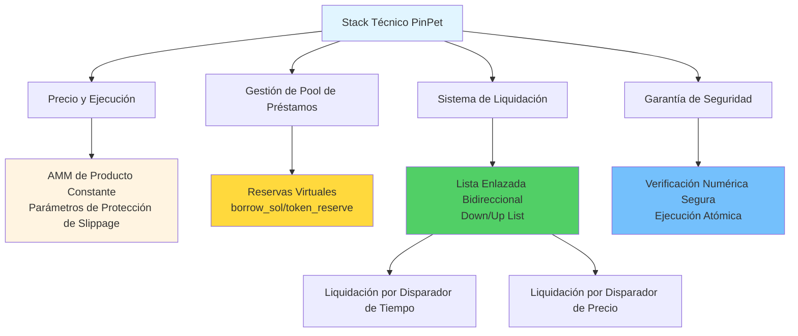

### Lista de Características Técnicas

**Precio y Ejecución:**
- AMM de Producto Constante: `k = x × y`
- Restricción fuerte de parámetros de protección de slippage
- Motor de cálculo de alta precisión (precisión 10^28)

**Pool de Préstamos:**
- Reservas virtuales `borrow_sol_reserve` / `borrow_token_reserve`
- Fondos compartidos con pool spot pero lógicamente aislados
- Tecnología de Bloqueo de Rango de Precios (PLT)

**Lista de Liquidación:**
- Lista Long (Down): de precio alto a bajo
- Lista Short (Up): de precio bajo a alto
- Soporta recorrido por lotes y liquidación en cadena

**Disparadores de Liquidación:**
- Disparador de tiempo: liquidación forzada al vencimiento, ejecutable por cualquiera
- Disparador de precio: liquidación por stop-loss, ejecución atómica integrada en transacciones de otros

**Ciclo de Vida de Cuentas:**
- Cierre de PDA relacionados tras liquidación/cierre
- Retorno de renta a quien disparó
- Eventos observables completamente on-chain

**Cálculo Seguro:**
- Uso completo de métodos checked_* para valores
- Acumulación de alta precisión de comisiones
- Reversión ante fallo, sin estados intermedios

---

## 🧩 Código Técnico para Desarrolladores/Integradores

### Diseño Amigable para Desarrolladores

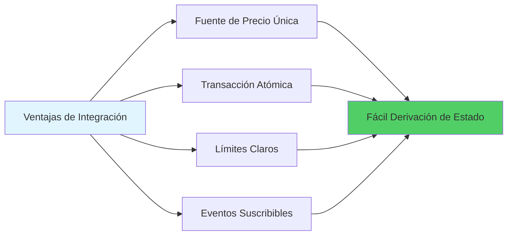

**Características Centrales:**
- 🔹 **Fuente de Precio Única**: spot y apalancamiento comparten precio unificado, mapeo sincrónico `price_to_reserves(price)`
- 🔹 **Transacción Atómica**: apertura/cierre/liquidación se completan en transacción única, fácil derivar estado final
- 🔹 **Límites Claros**: volumen mínimo de trading, margen mínimo, umbrales de stop-loss etc., parámetros on-chain configurables y verificables
- 🔹 **Eventos Suscribibles**: eventos de liquidación/cierre claros, conveniente para paneles de control de riesgo, backtesting de estrategias y alertas

### Flujo de Integración Técnica

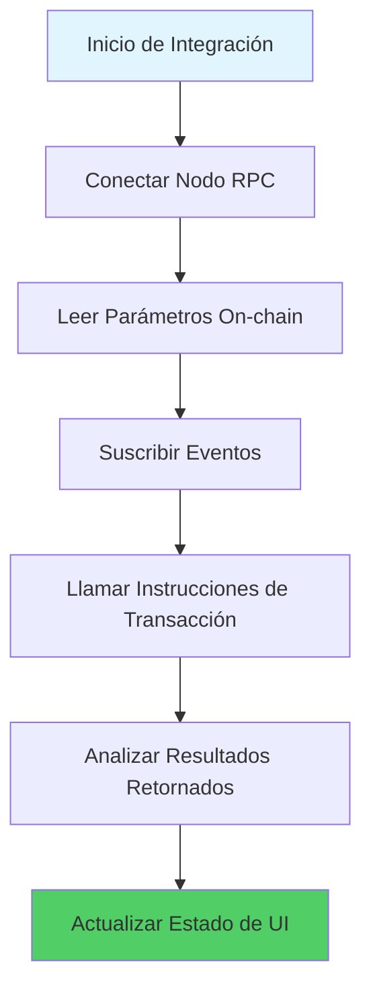

---

## 📊 Datos de Rendimiento: Revolución de Eficiencia On-Chain

### Indicadores de Rendimiento Medidos

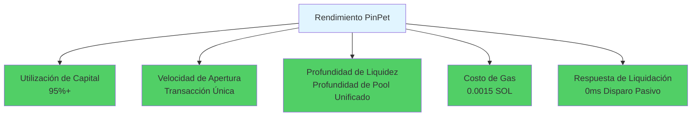

### Comparación de Mejoras

| Indicador | Magnitud de Mejora |
|-----|---------|
| Utilización de Capital | 🚀 +50% |
| Velocidad de Trading | ⚡ 2x más rápido |
| Profundidad de Liquidez | 💎 3x más profundo |
| Costo de Gas | 💰 50% de ahorro |
| Respuesta de Liquidación | ⏱️ Liquidación instantánea |

---

## 📣 Conclusión de Valor y Llamado a la Acción

### Valor Central de PinPet

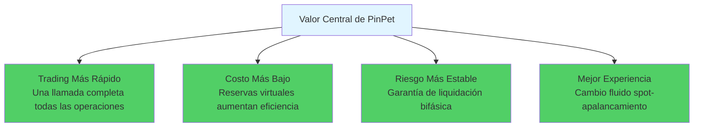

### ¿Qué hemos demostrado?

PinPet.fun con su motor híbrido AMM/ALP redefine la posibilidad de "spot descentralizado × apalancamiento nativo":

- ✅ **Liquidez no necesita fragmentarse**: un solo pool puede servir múltiples necesidades
- ✅ **Apalancamiento no necesita pool de préstamos**: libro de reservas virtuales es suficiente
- ✅ **Liquidación puede ser de cero latencia**: mecanismo de disparo pasivo elimina dependencia de oráculos
- ✅ **Condiciones extremas tienen garantía**: anclaje de rango asegura que liquidación no falle

### La Tecnología Cambia DeFi

**PinPet = Fusión Perfecta de AMM + Pool de Préstamos Automático**

Esta es una innovación global, este es un avance tecnológico único.

---

## 🚀 Experimenta Ahora

**¡Equipa tu estrategia con este motor más inteligente y más robusto!**

- 🌐 **Sitio Oficial**: [PinPet.fun](https://pinpet.fun)
- 📖 **Documentación Técnica**: [docs.pinpet.fun](https://docs.pinpet.fun)
- 💬 **Comunidad**: Únete a nuestro Discord y Telegram
- 📊 **GitHub**: https://github.com/pinpetfun/

---

## 🔮 Hoja de Ruta Técnica Futura

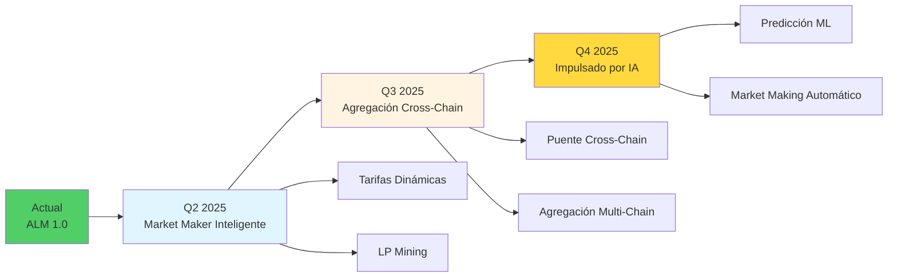

**Innovación Continua:**
- 🔬 **Fase 1 - Market Maker Inteligente**: tarifas dinámicas + incentivos de liquidez
- 🔬 **Fase 2 - Agregación Cross-Chain**: gestión unificada de liquidez multi-chain
- 🔬 **Fase 3 - Impulsado por IA**: optimización de estrategias de control de riesgo con machine learning

---

## ⚠️ Advertencia de Riesgo

**El trading apalancado conlleva alto riesgo, pudiendo resultar en pérdida total del margen.**

Por favor participa tras comprender completamente los mecanismos y riesgos, usa apalancamiento racionalmente. Este documento es solo para introducción técnica, no constituye asesoramiento de inversión.

---

*🔬 La tecnología impulsa la innovación, el código forja la confianza*

*🌟 PinPet.fun - Redefining DeFi Infrastructure*

**En la dirección "Trading AMM + Pool de Préstamos Automático", esta es una innovación global, única en su clase.**
