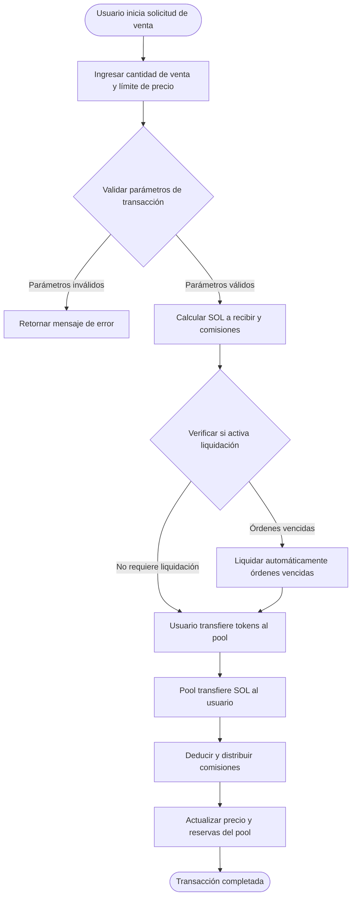

# 💱 Introducción al Trading Spot de PinPet

## 📊 Descripción General de la Funcionalidad

El trading spot es una de las funcionalidades principales de la plataforma PinPet, permitiendo a los usuarios comprar y vender tokens directamente en pools de liquidez descentralizados. A diferencia del modelo tradicional de libro de órdenes, PinPet utiliza un mecanismo de creador de mercado automatizado (AMM), basado en el algoritmo de producto constante (x × y = k) para determinar automáticamente los precios de trading.

**✨ Características Principales:**
- **⚡ Ejecución Instantánea**: No es necesario esperar a que coincidan compradores y vendedores, las transacciones se completan inmediatamente
- **🔍 Precios Transparentes**: Los precios son calculados automáticamente por algoritmos, de manera pública y transparente
- **🌊 Liquidez Continua**: Mientras el pool tenga activos suficientes, se puede operar en cualquier momento
- **🛡️ Protección contra Slippage**: Los usuarios pueden establecer límites de precio máximo/mínimo para prevenir fluctuaciones de precio anormales

---

## 🛒 Flujo de Transacción de Compra (Buy)

### 👤 Pasos de Operación del Usuario

La transacción de compra permite a los usuarios utilizar SOL (el token nativo de Solana) para comprar tokens del proyecto.

### 🔑 Descripción de Parámetros Clave

| Nombre del Parámetro | Descripción | Valor de Ejemplo | Notas |
|---------|---------|--------|------|
| buy_token_amount | Cantidad de tokens que desea comprar | 1000000 (1 token) | Valor mínimo: 1000000 (1 token) |
| max_sol_amount | Cantidad máxima de SOL dispuesto a pagar | 50000000 (0.05 SOL) | Utilizado para prevenir slippage excesivo |
| lp_pairs | Snapshot del estado del pool de liquidez | [{sol: 30, token: 1000000}] | Proporcionado automáticamente por el frontend |

### ⚙️ Lógica de Ejecución de Transacción

1. **Validación de Parámetros**
   - Verificar si la cantidad de compra alcanza el volumen mínimo de trading (1 token)
   - Validar que el estado del pool de liquidez coincida con el on-chain

2. **Cálculo de Precio**
   - Basado en las reservas actuales del pool, usar la fórmula de producto constante para calcular el SOL requerido
   - Calcular el monto real a pagar incluyendo comisiones
   - Verificar si el precio de ejecución real excede el valor máximo establecido por el usuario

3. **Mecanismo de Liquidación Automática**
   - Si la transacción causaría que el precio cruce el precio de liquidación de algunas órdenes apalancadas, el sistema liquida automáticamente esas órdenes
   - Las comisiones generadas por la liquidación se distribuyen entre la plataforma y los partners

4. **Transferencia de Fondos**
   - Cuenta del usuario → Pool de liquidez: Transferir SOL (incluidas comisiones)
   - Pool de liquidez → Cuenta del usuario: Transferir tokens

5. **Distribución de Comisiones**
   - Distribuir según proporciones preestablecidas entre partners y proveedores técnicos
   - La tasa de comisión predeterminada puede ser configurada por el administrador

6. **Actualización de Estado**
   - Actualizar el precio actual del pool de liquidez
   - Recalcular las reservas de SOL y tokens del pool
   - Verificar si se activa descuento en comisiones

---

## 💸 Flujo de Transacción de Venta (Sell)

### 👤 Pasos de Operación del Usuario

La transacción de venta permite a los usuarios vender los tokens que poseen a cambio de SOL.

### 🔑 Descripción de Parámetros Clave

| Nombre del Parámetro | Descripción | Valor de Ejemplo | Notas |
|---------|---------|--------|------|
| sell_token_amount | Cantidad de tokens que desea vender | 1000000 (1 token) | Valor mínimo: 1000000 (1 token) |
| min_sol_output | Cantidad mínima de SOL esperada a recibir | 20000000 (0.02 SOL) | Utilizado para prevenir slippage excesivo |
| lp_pairs | Snapshot del estado del pool de liquidez | [{sol: 30, token: 1000000}] | Proporcionado automáticamente por el frontend |

### ⚙️ Lógica de Ejecución de Transacción

1. **Validación de Parámetros**
   - Verificar si la cantidad de venta alcanza el volumen mínimo de trading (1 token)
   - Validar que el saldo de la cuenta de tokens del usuario sea suficiente
   - Confirmar que el estado del pool de liquidez sea válido

2. **Cálculo de Precio**
   - Basado en las reservas actuales del pool, usar la fórmula de producto constante para calcular el SOL a recibir
   - Calcular el monto real acreditado después de deducir comisiones
   - Verificar si el precio de ejecución real está por debajo del valor mínimo establecido por el usuario

3. **Mecanismo de Liquidación Automática**
   - Si la transacción causaría que el precio cruce el precio de liquidación de algunas órdenes apalancadas, el sistema liquida automáticamente esas órdenes
   - Distribución de comisiones de liquidación y recompensas

4. **Transferencia de Fondos**
   - Cuenta del usuario → Pool de liquidez: Transferir tokens
   - Pool de liquidez → Cuenta del usuario: Transferir SOL (con comisiones deducidas)

5. **Procesamiento de Comisiones**
   - Deducir comisiones del SOL a recibir
   - Distribuir según proporciones entre partners y proveedores técnicos

6. **Actualización de Estado**
   - Actualizar el precio actual del pool de liquidez (precio disminuye)
   - Recalcular las reservas de SOL y tokens del pool
   - Verificar si se activa descuento en comisiones

---

## 💡 Ejemplos de Casos de Uso

### 📈 Escenario Uno: Transacción de Compra Normal

**Contexto:**
- Precio actual: 1 token = 0.03 SOL
- El usuario desea comprar 10 tokens
- Tasa de comisión: 1%

**Flujo de Operación:**
1. Usuario establece cantidad de compra: 10,000,000 (10 tokens)
2. Usuario establece pago máximo: 0.35 SOL (350,000,000)
3. Sistema calcula necesidad real: 0.303 SOL (incluidas comisiones)
4. Verificación de precio aprobada (no excede el límite máximo)
5. Ejecución de transacción:
   - Usuario paga 0.303 SOL
   - Recibe 10 tokens
   - Comisión de 0.003 SOL distribuida a la plataforma
6. Precio post-ejecución sube a: 0.0303 SOL/token

---

### 📉 Escenario Dos: Venta que Activa Liquidación Automática

**Contexto:**
- Precio actual: 1 token = 0.05 SOL
- Existe una orden long con precio de liquidación de 0.048 SOL
- El usuario desea vender 50 tokens

**Flujo de Operación:**
1. Usuario establece cantidad de venta: 50,000,000 (50 tokens)
2. Usuario establece ingreso mínimo: 2.3 SOL
3. Sistema detecta que la venta haría caer el precio por debajo de 0.048 SOL
4. Sistema liquida automáticamente la orden long:
   - Calcular ganancias/pérdidas de la orden
   - Cobrar comisión de liquidación
   - Cerrar cuenta de orden, devolver alquiler
5. Continuar con la ejecución de la venta:
   - Usuario transfiere 50 tokens
   - Recibe 2.4 SOL (después de deducir comisiones)
6. Precio post-ejecución cae a: 0.047 SOL/token

---

### 🛡️ Escenario Tres: Activación de Protección contra Slippage

**Contexto:**
- Precio actual: 1 token = 0.02 SOL
- El usuario desea comprar 1000 tokens
- Pool de liquidez pequeño, transacciones grandes causarían slippage significativo

**Flujo de Operación:**
1. Usuario establece cantidad de compra: 1,000,000,000 (1000 tokens)
2. Usuario establece pago máximo: 21 SOL
3. Sistema calcula necesidad real: 22.5 SOL (incluidas comisiones)
4. Verificación de precio falla (excede el límite máximo del usuario)
5. Transacción rechazada, retorna mensaje de error
6. El usuario puede elegir:
   - Aumentar el límite de pago máximo
   - Reducir la cantidad de compra
   - Comprar en lotes

---

## ⚠️ Precauciones y Limitaciones

### 🚫 Restricciones de Trading

| Elemento Restringido | Requisito Específico | Explicación |
|---------|---------|---------|
| Volumen mínimo de trading | 1,000,000 (1 token) | Prevenir que transacciones demasiado pequeñas afecten la eficiencia del sistema |
| Límite superior de tasa de comisión | 10% | Proteger a los usuarios de comisiones excesivas |
| Verificación de liquidez | Debe proporcionar snapshot del estado actual del pool | Asegurar consistencia entre estado on-chain y off-chain |
| Protección contra slippage | Obligatorio max_sol_amount / min_sol_output | Prevenir pérdidas causadas por fluctuaciones de precio anormales |

### ⚠️ Advertencias de Riesgo

1. **📊 Riesgo de Volatilidad de Precios**
   - Transacciones grandes causarán slippage significativo
   - Se recomienda realizar transacciones grandes en lotes para reducir costos de impacto
   - Establecer tolerancia razonable al slippage

2. **💰 Costos de Comisiones**
   - Cada transacción generará comisiones
   - Transacciones pequeñas frecuentes acumularán costos altos de comisiones
   - Se recomienda consolidar transacciones para reducir costos

3. **💧 Riesgo de Liquidez**
   - Cuando la liquidez es insuficiente, las transacciones grandes pueden no completarse
   - Las reservas del pool afectarán el precio de ejecución
   - Prestar atención a las reservas de SOL y tokens del pool

4. **🔄 Impacto de Liquidación Automática**
   - Las transacciones pueden activar liquidación automática de órdenes apalancadas
   - La liquidación consumirá parte de la liquidez
   - Puede afectar el precio de ejecución final

### 🔧 Requisitos Técnicos

**👛 Requisitos del Usuario:**
- Poseer una billetera Solana (como Phantom, Solflare)
- Tener suficiente SOL en la cuenta para trading y pago de tarifas de transacción
- Debe crear cuenta de tokens correspondiente antes de operar tokens (generalmente manejado automáticamente por el frontend)

**💵 Composición de Tarifas de Transacción:**
- Tarifas de red Solana: aproximadamente 0.000005 SOL (tarifa de firma de transacción)
- Comisión de trading: cobrada como porcentaje del monto de transacción (configurada por el administrador)
- Alquiler de cuenta: pago único si se necesita crear nueva cuenta (recuperable)

### ❓ Preguntas Frecuentes

**P: ¿Se pierden comisiones si la transacción falla?**
R: ✅ No. Si la transacción es rechazada debido a falla en la verificación de parámetros, no se deducirá ninguna comisión, solo se consumirá una pequeña tarifa de red Solana (aproximadamente 0.000005 SOL).

**P: ¿Cómo obtener el mejor precio de ejecución?**
R: 💡 Operar en períodos de liquidez suficiente, evitar volúmenes de transacción excesivos en una sola operación, prestar atención a la proporción SOL/Token del pool, elegir el momento adecuado para operar.

**P: ¿La liquidación automática afectará mi transacción?**
R: ⚠️ Posiblemente. Si su transacción activa la liquidación de órdenes apalancadas de otros, consumirá parte de la liquidez, lo que puede causar que el precio de ejecución real difiera ligeramente del esperado, pero aún dentro del rango de slippage que estableció.

**P: ¿Razones comunes para el rechazo de transacciones?**
R: ❌ Las razones comunes incluyen:
- Cantidad de compra o venta por debajo del volumen mínimo de trading (1 token)
- Precio de ejecución real excede el rango de protección contra slippage establecido
- Saldo de cuenta insuficiente (SOL o tokens)
- Snapshot del estado del pool de liquidez expirado (el frontend necesita obtener nuevamente)

**P: ¿Cómo se calculan y distribuyen las comisiones?**
R: 💰 Las comisiones se cobran como un porcentaje del monto de transacción (predeterminado 1%, ajustable por el administrador), después del cobro se distribuyen según proporciones preestablecidas entre partners y proveedores técnicos. En algunos casos puede haber descuentos en comisiones.

---

## 🔗 Funcionalidades Relacionadas

- **📊 Trading Apalancado**: Utilizar mecanismo de préstamo para trading long/short
- **💧 Gestión de Liquidez**: Ver y gestionar estado de pools de liquidez
- **🪙 Creación de Tokens**: Crear nuevos pares de trading de tokens
- **📋 Gestión de Órdenes**: Ver y gestionar órdenes de trading apalancado

---

*📝 Nota: Este documento es una descripción de funcionalidad del producto, no incluye detalles de implementación técnica. Para información relacionada con desarrollo, consulte la documentación técnica del proyecto.*
