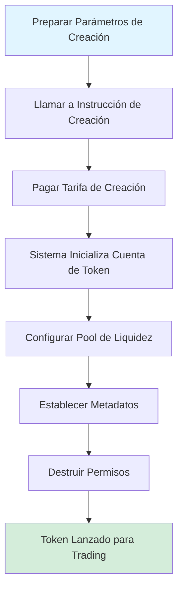
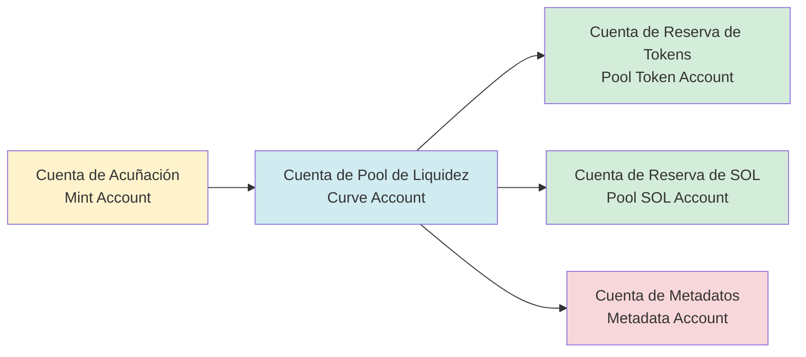
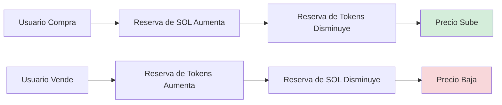

# 🪙 Introducción a la Función de Creación de Tokens de PinPet

## 1. 📋 Descripción General de la Función

### 💎 ¿Qué es la Creación de Tokens?

La creación de tokens es una de las funciones principales de la plataforma PinPet, que permite a los usuarios emitir nuevos tokens SPL (tokens estándar de la blockchain Solana) con un solo clic y configurar automáticamente el mercado de trading. A través de esta función, los usuarios pueden crear rápidamente tokens con metadatos completos, soporte de liquidez automático y capacidad de trading instantáneo sin necesidad de comprender profundamente la compleja tecnología blockchain.

### ❓ ¿Por Qué Necesitas Crear Tokens?

**⚠️ Puntos Críticos de la Emisión Tradicional de Tokens:**
- Requiere conocimientos técnicos profesionales (programación Solana, estándar SPL Token)
- Configuración manual de permisos de acuñación, pools de liquidez, metadatos y otros múltiples pasos
- Falta de liquidez instantánea y mercado de trading
- Configuración de seguridad compleja (destrucción de permisos, prevención de emisión adicional, etc.)

**✅ Ventajas de la Creación de Tokens de PinPet:**
- **⚡ Emisión con un Clic**: Solo requiere proporcionar tres datos básicos: nombre del token, símbolo e icono
- **🚀 Lanzamiento Instantáneo**: Se puede tradear inmediatamente después de la creación, sin esperar acumulación de liquidez
- **🔒 Configuración de Seguridad Automática**: Destrucción automática de permisos de acuñación y congelación para prevenir emisión maliciosa
- **🏦 Mercado de Trading Integrado**: Basado en el algoritmo AMM de producto constante, admite trading spot y apalancado
- **✔️ Metadatos Conformes**: Cumple con el estándar Metaplex, reconocido automáticamente por wallets y exchanges

### ⭐ Características Principales

| Característica | Descripción |
|------|------|
| Estándar de Token | SPL Token (estándar oficial de Solana) |
| Precisión | 6 decimales (1 Token = 1,000,000 unidades mínimas) |
| Suministro Total | 1,609,500,000,000,000 unidades (suministro fijo, no se puede aumentar) |
| Estándar de Metadatos | Metaplex Token Metadata |
| Precio Inicial | Aprox. 0.0000000000279589934762 SOL/Token |
| Modelo de Liquidez | AMM de Producto Constante (x × y = k) |

---

## 2. 🔄 Proceso de Creación de Tokens

### 👤 Pasos de Operación del Usuario



### 📊 Explicación Detallada del Proceso

#### 📝 Etapa 1: Preparación de Parámetros
El usuario necesita proporcionar tres parámetros básicos:

| Parámetro | Tipo | Descripción | Ejemplo |
|------|------|------|------|
| name | String | Nombre completo del token | "PinPet Token" |
| symbol | String | Símbolo del token (3-10 caracteres) | "PINPET" |
| uri | String | Enlace al archivo JSON de metadatos | "https://example.com/metadata.json" |

#### 🔧 Etapa 2: Inicialización de Cuentas
El sistema crea y configura automáticamente las siguientes cuentas:



#### 💧 Etapa 3: Inicialización del Pool de Liquidez
El sistema configura automáticamente dos pools de fondos:

**1. Pool de Liquidez Spot (LP Pool)**
- Reserva de Tokens: 1,073,000,000,000,000 unidades
- Reserva de SOL: 30 SOL (saldo virtual)
- SOL Real: 10,000 lamports (para prevenir saldo insuficiente)
- Propósito: Soportar trading spot (compra/venta)

**2. Pool de Préstamos Apalancados (Borrow Pool)**
- Reserva de Tokens: 536,500,000,000,000 unidades
- Reserva de SOL: 10,000,000 SOL (saldo virtual)
- Propósito: Soportar trading con margen (long/short)

**📊 Diagrama de Distribución de Fondos:**
```
💰 Suministro Total: 1,609,500,000,000,000 unidades
├── Pool de Liquidez Spot: 1,073,000,000,000,000 (66.67%)
└── Pool de Préstamos Apalancados:  536,500,000,000,000 (33.33%)
```

#### 📄 Etapa 4: Creación de Metadatos
El sistema llama al programa Metaplex Token Metadata para crear los metadatos del token:

| Campo de Metadatos | Contenido | Descripción |
|-----------|------|------|
| name | Nombre proporcionado por el usuario | Nombre del token mostrado en la wallet |
| symbol | Símbolo proporcionado por el usuario | Abreviatura del token |
| uri | Enlace proporcionado por el usuario | Apunta a JSON con icono, descripción, etc. |
| creators | Dirección del creador | Marca el creador del token, estado no verificado |
| seller_fee_basis_points | 0 | Tasa de regalías (establecida en 0) |
| is_mutable | true | Permite actualizar metadatos |

**📋 Ejemplo de Formato JSON de Metadatos:**
```json
{
  "name": "PinPet Token",
  "symbol": "PINPET",
  "description": "Token emitido basado en la plataforma PinPet",
  "image": "https://example.com/logo.png",
  "attributes": [],
  "properties": {
    "files": [
      {
        "uri": "https://example.com/logo.png",
        "type": "image/png"
      }
    ]
  }
}
```

#### 🔒 Etapa 5: Destrucción de Permisos
Para garantizar la seguridad e inmutabilidad del token, el sistema ejecuta automáticamente:

| Operación | Propósito | Efecto |
|------|------|------|
| Destruir Permiso de Acuñación | Prevenir emisión adicional | Suministro total bloqueado permanentemente |
| Destruir Permiso de Congelación | Prevenir congelación de cuentas de usuario | Token permanentemente circulable |

#### 💵 Etapa 6: Configuración de Tarifas
El sistema lee la configuración de tarifas desde la cuenta de parámetros del socio:

| Tipo de Tarifa | Valor por Defecto | Descripción |
|---------|--------|------|
| Tarifa de Trading Spot | 1% | Deducida en transacciones de compra/venta |
| Tarifa de Trading con Margen | 0.25% | Deducida en trading apalancado |
| Flag de Descuento en Tarifas | 0 (precio original) | Se puede ajustar automáticamente según el volumen de trading |
| Proporción de Distribución de Tarifas | 20%/80% | Proporción de reparto técnico/socio |

---

## 3. 💧 Mecanismo del Pool de Liquidez

### 🔢 Fórmula del Producto Constante

PinPet adopta el modelo de Creador de Mercado Automatizado (AMM), con la fórmula principal:

```
x × y = k
```

Donde:
- **x**: Reserva de SOL
- **y**: Reserva de Tokens
- **k**: Producto constante (valor inicial = 30 × 1,073,000,000 = 32,190,000,000)

### 💰 Cálculo del Precio Inicial

```
Precio Inicial = Reserva de SOL ÷ Reserva de Tokens
         = 30 ÷ 1,073,000,000
         ≈ 0.0000000279589934762 SOL/Token
```

### 📈 Mecanismo de Cambio de Precio



### 🛡️ Protección contra Slippage de Precio

Para proteger el pool de liquidez, el sistema adopta múltiples mecanismos de seguridad:

| Medida de Protección | Descripción |
|---------|------|
| Factor de Precisión | El precio usa un factor de precisión de 10^26 para evitar errores de redondeo |
| Verificación de Desbordamiento | Todos los cálculos usan métodos `checked_*` para prevenir desbordamiento |
| Límite Superior de Precio | Precio máximo limitado a 50,000,000,000,000,000,000,000,000,000 |
| Límite Inferior de Precio | Precio mínimo limitado a 0.000000001 (previene división por cero) |

---

## 4. 📝 Descripción de Metadatos del Token

### ✅ Estándar Metaplex

PinPet utiliza el estándar Metaplex Token Metadata v5.1.1, asegurando la compatibilidad del token en el ecosistema Solana:

**✨ Ventajas del Estándar:**
- 💳 Reconocimiento automático por wallets principales (Phantom, Solflare)
- 🔄 Extracción automática de información por plataformas DEX (Jupiter, Raydium)
- 🎨 Indexación automática por mercados NFT y agregadores
- 🔍 Visualización completa en exploradores blockchain (Solscan, Solana Explorer)

### 🗂️ Estructura de la Cuenta de Metadatos

```
Dirección de Cuenta de Metadatos (PDA)
├── Semillas de Derivación: ["metadata", Metaplex Program ID, Mint Address]
├── Contenido Almacenado:
│   ├── Nombre del Token
│   ├── Símbolo del Token
│   ├── URI (enlace JSON de metadatos)
│   ├── Información del Creador
│   ├── Configuración de Regalías
│   └── Información de Colección (opcional)
└── Permisos:
    ├── Permiso de Actualización: Cuenta del Pool de Liquidez (PDA)
    └── Mutabilidad: true (permite actualizaciones)
```

### 🌐 Recomendaciones de Alojamiento de URI

| Método de Alojamiento | Ventajas | Desventajas | Escenarios Aplicables |
|---------|------|------|---------|
| IPFS | Descentralizado, almacenamiento permanente | Velocidad de acceso más lenta | Proyectos a largo plazo |
| Arweave | Almacenamiento permanente, rápido | Requiere pago | Tokens de alto valor |
| Almacenamiento en la Nube (AWS S3/CDN) | Rápido, económico | Centralizado, puede fallar | Proyectos de prueba o corto plazo |

---

## 5. 🎯 Ejemplos de Casos de Uso

### 🚀 Escenario 1: Equipo Startup Emite Token de Proyecto

**Necesidad:**
Un equipo startup Web3 desea emitir un token de gobernanza para su proyecto DeFi

**Flujo de Operación:**
1. Diseñar icono del token y documentación descriptiva
2. Subir JSON de metadatos a IPFS
3. Preparar parámetros:
   - name: "SuperDeFi Governance Token"
   - symbol: "SDEFI"
   - uri: "https://ipfs.io/ipfs/QmXXX..."
4. Llamar a la instrucción de creación de PinPet, pagar tarifa de creación pequeña
5. Token lanzado instantáneamente, miembros del equipo y comunidad pueden tradear inmediatamente

**✅ Ventajas:**
- ⚡ No se necesita escribir smart contracts
- 💧 Mercado de liquidez incorporado
- 🔒 Seguridad garantizada por el protocolo

---

### 🎉 Escenario 2: Emisión de Token Meme de la Comunidad

**Necesidad:**
La comunidad desea emitir un token Meme temático para entretenimiento y trading

**Flujo de Operación:**
1. Votación comunitaria para decidir nombre e icono del token
2. Usar hosting de imágenes gratuito para alojar la imagen
3. Preparar parámetros:
   - name: "Doge to the Moon"
   - symbol: "DMOON"
   - uri: "https://cloudinary.com/dmoon.json"
4. Cualquier miembro de la comunidad inicia la creación
5. Miembros de la comunidad comienzan a tradear inmediatamente

**✅ Ventajas:**
- 💰 Emisión rápida y de bajo costo
- 👥 No se requiere experiencia técnica
- 🔒 Mecanismo automático anti-emisión adicional

---

### 🎨 Escenario 3: Proyecto NFT Emite Token Utilitario

**Necesidad:**
Proyecto NFT desea emitir un token utilitario complementario para incentivos del ecosistema

**Flujo de Operación:**
1. Diseñar imagen del token acorde con el estilo NFT
2. Preparar whitepaper detallado del token
3. Usar Arweave para almacenamiento permanente de metadatos
4. Preparar parámetros:
   - name: "CryptoArt Utility Token"
   - symbol: "CART"
   - uri: "ar://abc123..."
5. Crear token y configurar cuenta receptora de tarifas
6. Holders de NFT pueden hacer staking para obtener recompensas de tokens

**✅ Ventajas:**
- 💾 Almacenamiento permanente de metadatos
- 🔗 Integración perfecta con ecosistema NFT
- 📊 Soporta modelos económicos complejos

---

## 6. ⚠️ Consideraciones y Limitaciones

### 📝 Trabajo Preparatorio Antes de la Creación

| Ítem de Verificación | Descripción |
|--------|------|
| Saldo de Wallet | Asegurar suficiente SOL para pagar tarifa de creación (aprox. 0.01-0.05 SOL) |
| Preparación de Metadatos | Archivo JSON subido y accesible |
| Información del Token | Nombre y símbolo cumplen normativas, sin ambigüedad |
| Cuenta de Socio | Cuenta de parámetros de socio creada (necesaria primera vez) |

### 🚫 Limitaciones de la Creación de Tokens

**⚙️ Limitaciones Técnicas:**
- La precisión del token está fija en 6 decimales, no modificable después de la creación
- Suministro total fijo, no se puede aumentar después de destruir permiso de acuñación
- Configuración de liquidez inicial fija, no personalizable

**🔒 Limitaciones de Seguridad:**
- Límite superior de tarifa del 10%, falla la creación si se excede
- Permiso de actualización de metadatos pertenece a la cuenta del pool de liquidez
- Permiso de congelación destruido, no se pueden congelar cuentas de usuario

**💰 Limitaciones Económicas:**
- Precio inicial calculado por algoritmo, no personalizable
- Proporción de distribución de liquidez fija (spot 66.67%, apalancado 33.33%)
- Reserva de SOL es saldo virtual, no se puede extraer directamente

### ❓ Preguntas Frecuentes

**💵 Q1: ¿Cuánto cuesta crear un token?**
R: Las tarifas principales incluyen alquiler de cuenta (aprox. 0.01-0.03 SOL) y tarifas de transacción (aprox. 0.00001 SOL), totalizando aprox. 0.01-0.05 SOL.

**✏️ Q2: ¿Se puede modificar el nombre o símbolo del token después de crearlo?**
R: Se puede modificar actualizando el contenido del archivo JSON al que apunta el URI de metadatos, pero el name y symbol registrados en cadena son inmutables.

**🔒 Q3: ¿Cómo garantizar la seguridad del token?**
R: El sistema destruye automáticamente los permisos de acuñación y congelación, asegurando que el suministro sea fijo e inalterable. Se recomienda usar almacenamiento descentralizado (IPFS/Arweave) para alojar metadatos.

**❗ Q4: ¿Qué hacer si falla la creación?**
R: Verificar saldo de wallet, formato de parámetros, estado de cuenta de socio. Errores comunes incluyen tasa de tarifa excedida, URI inválido, etc.

**🗑️ Q5: ¿Se puede destruir el token?**
R: La cuenta del token en sí no se puede destruir, pero se puede bloquear permanentemente transfiriendo a una dirección de agujero negro (0x000...).

### 💡 Recomendaciones de Mejores Prácticas

1. **Alojamiento de Metadatos**: Priorizar uso de almacenamiento descentralizado como IPFS o Arweave para evitar enlaces rotos
2. **Nomenclatura del Token**: Concisa y clara, evitar confusión con proyectos conocidos, prevenir infracción
3. **Diseño de Icono**: Usar imágenes de alta calidad (se recomienda 512x512 píxeles), acorde con el posicionamiento del token
4. **Preparación de Whitepaper**: Incluir descripción detallada del proyecto y roadmap en el JSON al que apunta el URI
5. **Construcción de Comunidad**: Establecer cuentas de redes sociales oportunamente después de la creación para aumentar visibilidad del token
6. **Cumplimiento**: Asegurar que el propósito del token sea legal, evitar violar leyes y regulaciones locales

---

## 7. 🔧 Soporte Técnico

### 📍 Direcciones de Cuentas Relacionadas

| Tipo de Cuenta | Regla de Derivación | Descripción |
|---------|---------|------|
| Cuenta de Pool de Liquidez | `["borrowing_curve", mint_address]` | Gestiona liquidez y parámetros de trading |
| Cuenta de Reserva de Tokens | `["pool_token", mint_address]` | Almacena tokens en el pool de liquidez |
| Cuenta de Reserva de SOL | `["pool_sol", mint_address]` | Almacena SOL en el pool de liquidez |
| Cuenta de Metadatos | PDA estándar Metaplex | Almacena metadatos del token |

### 🖥️ Interfaz del Programa

**✨ Instrucción de Creación:**
```
Nombre de Función: create
Parámetros:
  - name: String (nombre del token)
  - symbol: String (símbolo del token)
  - uri: String (URI de metadatos)
```

**📡 Escucha de Eventos:**
Después de una creación exitosa se emite el evento `TokenCreatedEvent`, que contiene la siguiente información:
- Dirección de cuenta de acuñación
- Dirección de cuenta de pool de liquidez
- Configuración de tarifas
- Nombre, símbolo, URI del token

---

## 🎯 Resumen

La función de creación de tokens de PinPet proporciona a los usuarios una solución de emisión de tokens 🔒 segura, ⚡ conveniente y 💰 de bajo costo. A través de la configuración automatizada de liquidez y la gestión estandarizada de metadatos, los usuarios pueden completar la creación de tokens en minutos y lanzarlos para trading inmediatamente, sin preocuparse por detalles técnicos ni problemas de seguridad.

Ya sea 🚀 equipos startup emitiendo tokens de proyecto, 🎉 comunidades creando tokens Meme, o 🎨 proyectos NFT con tokens utilitarios complementarios, PinPet puede proporcionar soporte completo, haciendo que la emisión de tokens sea simple y eficiente.
