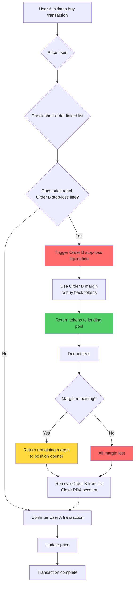
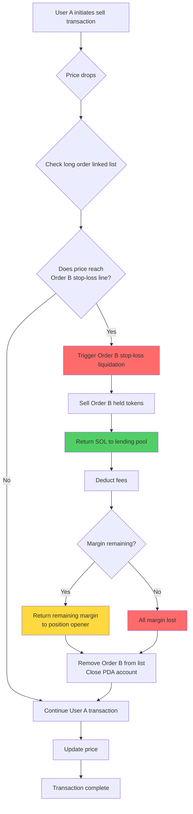
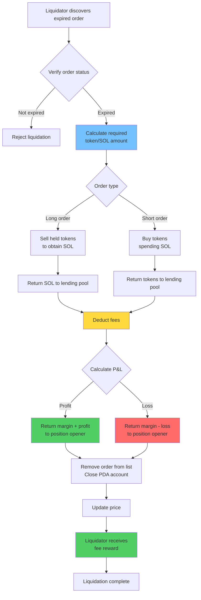
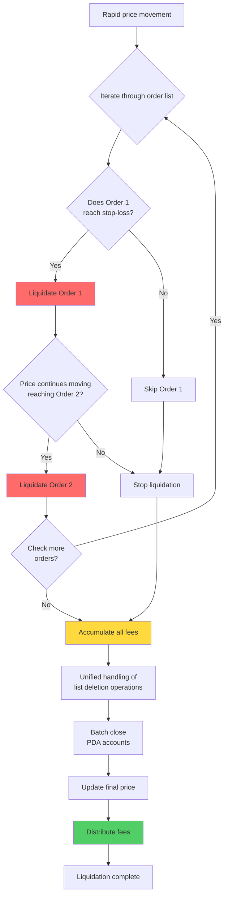

# ⚡ PinPet Forced Liquidation Feature Documentation

## 📋 Feature Overview

Forced liquidation is a core risk control mechanism in the PinPet protocol that protects system stability. The system provides two types of forced liquidation triggers:

1. **⏰ Time-Based Trigger**: When a leveraged trading order exceeds the specified holding period, anyone can trigger forced liquidation
2. **🎯 Price-Based Trigger**: When the market price reaches the order's stop-loss price line, automatic stop-loss liquidation is triggered

This dual protection mechanism ensures the protocol's liquidity and fund safety while protecting position openers from excessive losses.

## ⚙️ Core Features

### 1. 🔄 Dual Trigger Mechanism

#### ⏰ Time-Based Trigger
- **✅ Normal Closure**: During the order holding period, only the position opener can actively close the position
- **⏱️ Expiration Liquidation**: After the order expires, anyone can perform forced liquidation
- **🔍 Time Verification**: The system automatically determines whether an order has expired through on-chain timestamps

#### 🎯 Price-Based Trigger (Stop-Loss Liquidation)
- **📉 Long Position Stop-Loss**: When the price drops to the stop-loss price line of a long order, automatic liquidation occurs
- **📈 Short Position Stop-Loss**: When the price rises to the stop-loss price line of a short order, automatic liquidation occurs
- **🔄 Passive Trigger**: Price-triggered stop-loss liquidation is automatically executed during other users' trades
- **⚠️ Margin Depletion**: Stop-loss margin is used to repay borrowed funds; the position opener typically has no profit or loses all margin

### 2. 📊 Order Type Support

| Order Type | Price Trigger Condition | Time Trigger Condition | Linked List Direction | Asset Handling |
|---------|------------|------------|---------|---------|
| 📈 Long Order | Price drops to stop-loss line | Order expires | Down | Return borrowed SOL |
| 📉 Short Order | Price rises to stop-loss line | Order expires | Up | Return borrowed tokens |

### 3. 👥 Participant Roles

- **👤 Position Opener**: User who creates a leveraged order; has exclusive closing rights before expiration
- **🔨 Liquidator**: Any third-party user who can execute active liquidation after order expiration
- **💼 Trader**: Other users' buy/sell trades may trigger price-based stop-loss liquidation
- **🤖 Protocol**: Automatically manages lending pool funds to ensure proper fund flow

## 🔄 Workflow

### 📊 Workflow Comparison Table

| Process Stage | ⏰ Time-Based Liquidation | 🎯 Price-Based Stop-Loss |
|---------|------------|------------|
| Trigger Condition | Order expires | Price reaches stop-loss line |
| Trigger Timing | Actively initiated by liquidator | Passively triggered during trading |
| Permission Verification | Anyone can execute | Automatic execution (no permission required) |
| P&L Settlement | May profit or loss | Usually loses all margin |
| Margin Handling | Return remaining margin | Used to repay borrowed funds |

### 📉 Short Order Stop-Loss Liquidation Process (Price-Based Trigger)



### 📈 Long Order Stop-Loss Liquidation Process (Price-Based Trigger)



### ⏰ Order Expiration Liquidation Process (Time-Based Trigger)



### 💥 Batch Cascading Liquidation Process



## 💰 Fee Mechanism

### 💵 Fee Structure

| Fee Type | Charged To | Fee Rate | Purpose |
|---------|---------|------|------|
| Trading Fee | Position opener | Per order rate | Compensate liquidity providers |
| Liquidation Fee | Position opener | Per order rate | Reward liquidation executors |

### 🤝 Fee Distribution

All fees are distributed between two parties according to the protocol's configured split ratio (fee_split):

- **🤝 Partner**: Receives a certain proportion of the fees
- **🔧 Technical Provider**: Receives the remaining fees

The distribution ratio is set by the administrator when creating the liquidity pool, ranging from 0-100.

## 💸 Fund Settlement Rules

### ⏰ Time-Based Liquidation (Order Expiration)

#### ✅ Profit Scenario
When an order has profit:
- Position opener receives margin + profit portion
- Trading fees and liquidation fees are deducted
- Settlement address must be the position opener's address

#### ❌ Loss Scenario
When an order has losses:
- Loss is deducted from margin
- Remaining margin returned to position opener
- Trading fees and liquidation fees are deducted

#### 🧮 Settlement Formula
**📈 Long Order P&L**:
```
Profit = SOL from selling + Margin - Borrowed SOL - Fees
```

**📉 Short Order P&L**:
```
Profit = Locked SOL - SOL spent buying back - Fees
```

### 🎯 Price-Based Stop-Loss (Automatic Liquidation)

#### 🛡️ Margin Handling
- Margin is prioritized to repay the lending pool
- Balance after deducting trading fees is used entirely for closing
- Typically, the position opener has no profit or loses all margin

#### 🧮 Settlement Formula
**📈 Long Order Stop-Loss**:
```
Remaining Margin = Margin - Repaid Borrowed SOL - Fees
If Remaining Margin > 0, return to position opener
If Remaining Margin ≤ 0, all margin lost
```

**📉 Short Order Stop-Loss**:
```
Buyback Cost = SOL spent buying back tokens + Fees
Remaining Margin = Margin - Buyback Cost
If Remaining Margin > 0, return to position opener
If Remaining Margin ≤ 0, all margin lost
```

### 📊 Settlement Scenario Comparison

| Scenario Type | Settlement Timing | Profit Possibility | Margin Return | Fee Source |
|---------|---------|----------|----------|----------|
| ✅ Active Closure | Operator action | Can profit or loss | Principal + profit or minus loss | Paid by position opener |
| ⏰ Expiration Liquidation | Order expires | Can profit or loss | Principal + profit or minus loss | Paid by position opener |
| 🎯 Stop-Loss Liquidation | Price trigger | Usually loss | Balance after margin deduction | Deducted from margin |

## 🔗 Linked List Management

### 📋 Order Linked List Structure

The system uses a doubly linked list to manage pending closure orders:

- **📈 Long Order List (Down)**: Arranged from high to low price
- **📉 Short Order List (Up)**: Arranged from low to high price

### 🔧 Linked List Operations

```
Head node check → Confirm order position
    ↓
Verify previous/next node relationships
    ↓
Delete current node → Update previous/next node pointers
    ↓
Update list head pointer
```

### 💥 Batch Liquidation

When a single transaction triggers multiple order stop-losses:
1. Iterate through the order linked list in sequence
2. Execute closure for each expired order in turn
3. Accumulate all closure fees
4. Perform unified fund settlement

## 🛡️ Security Mechanisms

### 🔐 Permission Verification

| Verification Item | Time Condition | Permission Requirement |
|-------|---------|---------|
| Active Closure | Order not expired | Must be the position opener |
| Forced Liquidation | Order expired | Anyone can execute |
| Settlement Address | Anytime | Must be position opener's address |

### 🔢 Numerical Safety

- All calculations use safe checked_* methods to prevent overflow
- Fee calculations use high-precision algorithms to ensure accuracy
- Verify order linked list integrity to prevent data corruption

### 💎 Fund Safety

- Automatic verification of lending pool fund return
- Pool fund sufficiency checks
- Protection against duplicate closure

## 🎬 Real-World Application Scenarios

### 🎯 Scenario 1: Normal Expiration Liquidation (Time-Based Trigger)

1. User A opens a 5x long position at price 100 with 1 SOL margin for 24 hours
2. After 24 hours, the price rises to 120, order profits approximately 1 SOL
3. User B discovers the expired order and executes forced liquidation
4. System automatically sells tokens, repays borrowed funds, deducts 0.1 SOL fee
5. User A receives principal 1 SOL + profit 1 SOL - fee 0.1 SOL = 1.9 SOL

### 🚨 Scenario 2: Price-Based Stop-Loss Liquidation

1. User C opens a 3x short position at price 100 with 2 SOL margin
2. Stop-loss price line is set at 130 (automatically calculated at opening)
3. User D buys large amounts of tokens, price rapidly rises to 135
4. Price reaches User C's stop-loss line, system automatically liquidates Order C
5. Uses 2 SOL margin to buy back tokens and return to lending pool
6. After deducting 0.1 SOL fee, remaining 0.2 SOL returned to User C
7. User C loses 1.8 SOL, User D's buy transaction continues to complete

### 💥 Scenario 3: Cascading Stop-Loss Liquidation

1. Price rapidly rises, triggering stop-loss lines of multiple short orders
2. User E submits a buy transaction, price rises from 100 to 150
3. System detects 5 short orders need liquidation
4. Executes stop-loss closure operations sequentially by price order
5. Each order uses margin to buy back tokens and repay borrowed funds
6. Finally deducts accumulated fees uniformly, returns remaining margin
7. User E's buy transaction ultimately completes

### 📊 Scenario 4: Stop-Loss After Partial Closure

1. User F opens a 1000 token long order with 5 SOL margin
2. Actively closes 500 tokens for 2 SOL profit, 500 tokens remain
3. Price continues to drop, reaching remaining position's stop-loss line
4. System automatically executes stop-loss liquidation for remaining 500 tokens
5. After deducting borrowed funds and fees, User F has total profit of 0.5 SOL

## ❓ Frequently Asked Questions

### Q1: ⏰ What's the difference between time-based and 🎯 price-based triggers?

A:
- **⏰ Time-Based Trigger**: After order expiration, requires liquidator to actively initiate transaction to execute closure; position opener may profit or loss
- **🎯 Price-Based Trigger**: When price reaches stop-loss line, automatically executes during other users' transactions; position opener usually loses margin

The two mechanisms are independent; an order may trigger price-based stop-loss first or expire first.

### Q2: 🎯 How is the stop-loss price line determined?

A: The stop-loss price line is automatically calculated at opening based on leverage and margin:
- **📈 Long Order**: Stop-loss price = Opening price × (1 - 1/leverage)
- **📉 Short Order**: Stop-loss price = Opening price × (1 + 1/leverage)

For example: 5x long, opening price 100, stop-loss approximately 80; 3x short, opening price 100, stop-loss approximately 133.

### Q3: 🔔 Will I be notified when price-based stop-loss triggers?

A: ❌ No. Stop-loss liquidation is passively triggered during other users' transactions; the system won't notify in advance. Recommendations:
- 🔍 Monitor your order status through on-chain event listeners
- 📊 Use third-party tools to monitor position risks
- ⚠️ Set reasonable leverage to avoid easily triggering stop-loss

### Q4: ⏰ How soon after expiration will forced liquidation occur?

A: Orders can be forcibly liquidated by anyone immediately after expiration, with no grace period. However, it requires a liquidator to actively initiate the transaction. It's recommended to actively close positions before expiration to retain more control.

### Q5: 💰 Are additional fees charged for forced liquidation?

A: ✅ No additional fees. Whether time-based or price-based triggered, fees are charged at the rate set when opening the order, same as normal closure.

### Q6: ⚠️ Will all margin be lost during stop-loss liquidation?

A: Not necessarily. While margin is typically mostly lost during stop-loss liquidation, if:
- ✅ Price just reaches the stop-loss line when triggered
- 📊 Market volatility is low, liquidation costs are low
- 💵 Fees are low

Then a small amount of margin balance may be returned to the position opener. But in most cases, stop-loss liquidation means significant losses.

### Q7: 🔢 How many orders can be liquidated in one transaction?

A: Theoretically, a single transaction can liquidate up to 6 orders (system maximum order array length). Actual liquidation quantity depends on:
- **🎯 Price-Based Trigger**: Depends on how many orders reach stop-loss within the price movement range
- **⏰ Time-Based Trigger**: Depends on how many expired orders the liquidator chooses to liquidate

### Q8: 🔀 How is liquidation order determined?

A: Liquidation order is determined by the order linked list structure:
- **📈 Long Orders**: Liquidated sequentially from high to low price (when price drops)
- **📉 Short Orders**: Liquidated sequentially from low to high price (when price rises)

This order ensures orders that first reach stop-loss lines are liquidated first, conforming to the natural order of price movements.

### Q9: 🛡️ How to avoid stop-loss liquidation?

A: Recommended measures:
- **⚙️ Reasonable Leverage**: Use lower leverage (2-3x) to allow more price fluctuation space
- **💰 Timely Profit-Taking**: Actively close positions when profitable to lock in gains
- **👀 Monitor Market**: Closely watch price changes, actively close before approaching stop-loss line
- **📊 Gradual Position Building**: Don't open full positions at once, retain adjustment space

### Q10: ❓ What happens if funds are insufficient during liquidation?

A: The system verifies pool fund sufficiency before liquidation. If funds are insufficient, the transaction will fail and rollback, executing no operations. This rarely occurs as the protocol design ensures fund balance.

### Q11: 🔓 Will PDA accounts be closed after forced liquidation?

A: ✅ Yes, after forced liquidation completes, related PDA accounts are automatically closed, and rent is refunded to the payer. For:
- **⏰ Time-Based Trigger**: Rent refunded to liquidation executor
- **🎯 Price-Based Trigger**: Rent refunded to the user who triggered the transaction

### Q12: 🔄 Does the stop-loss price change after partial closure?

A: Yes. After partial closure, the order's stop-loss price is recalculated based on the remaining position. Since the position decreases, the stop-loss price moves closer to the current price, relatively increasing risk.

### Q13: 💥 Will cascading liquidations occur during severe price volatility?

A: ⚠️ Yes. When prices fluctuate rapidly, cascading stop-loss liquidations may occur:
1. Price breaks through a stop-loss line
2. Triggers first batch of order liquidations
3. Liquidation itself drives further price movement
4. Triggers next batch of order liquidations

This situation is more likely in high-leverage, order-dense areas, so use high leverage cautiously.

### Q14: ❌ What are the consequences of liquidation failure?

A: If a liquidation transaction fails for some reason (such as parameter errors, insufficient funds, etc.), the transaction will rollback without affecting the system. The position opener's order remains unchanged and can:
- ⏳ Wait for the next liquidation attempt
- ✅ Actively close the position themselves
- 🎯 Wait for other transactions to trigger price-based stop-loss

### Q15: 🚫 Can a triggered stop-loss liquidation be cancelled?

A: ❌ No. Stop-loss liquidation is automatically executed during other users' transactions. Once the price reaches the stop-loss line, the liquidation process immediately begins and cannot be interrupted or cancelled. This is to protect protocol determinism and prevent systemic risks.
