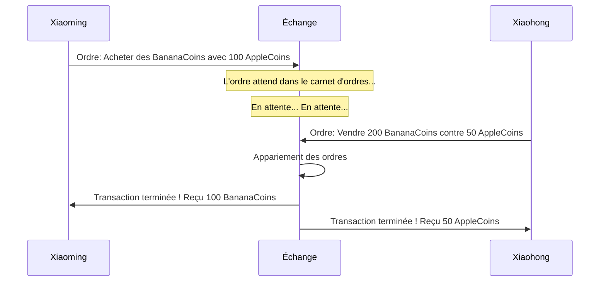
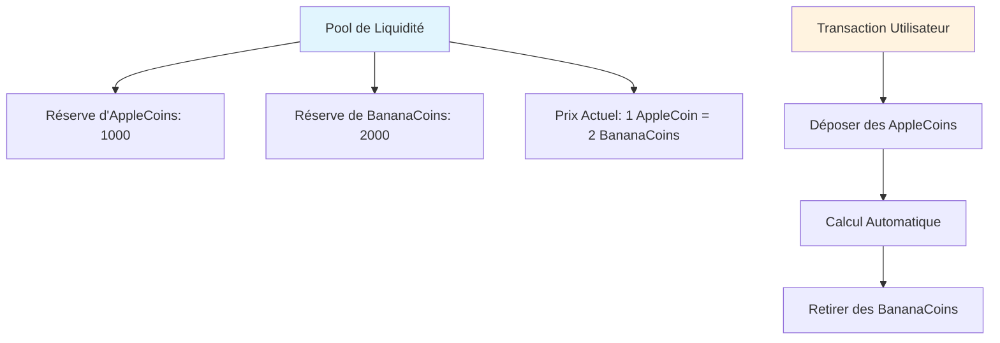
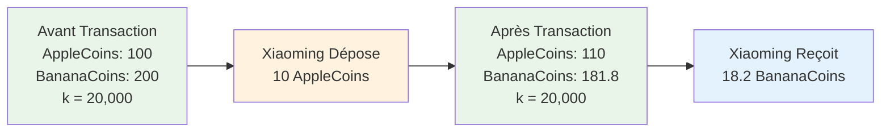
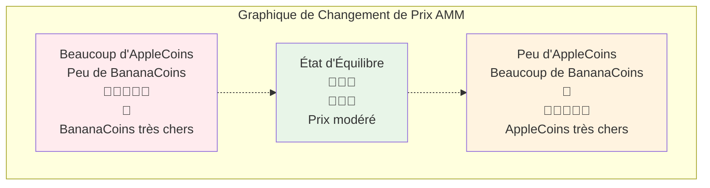
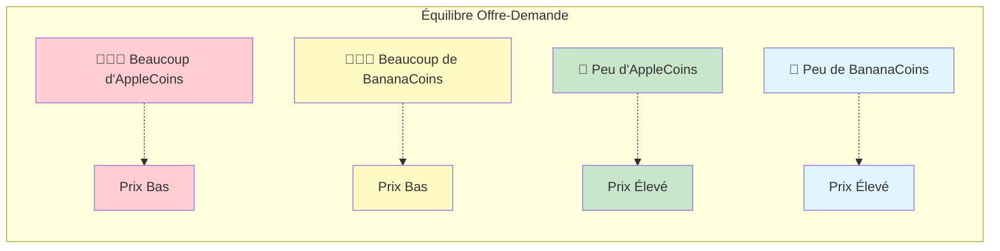
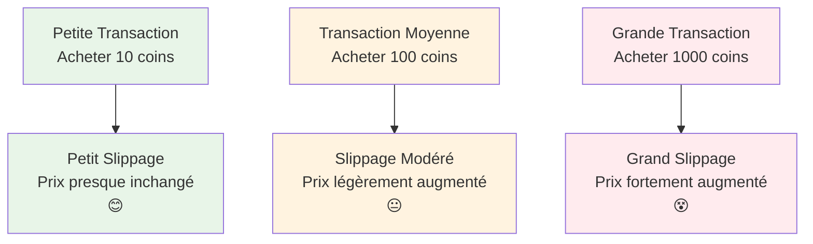
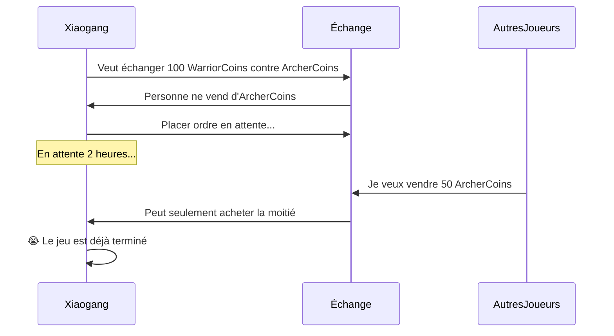
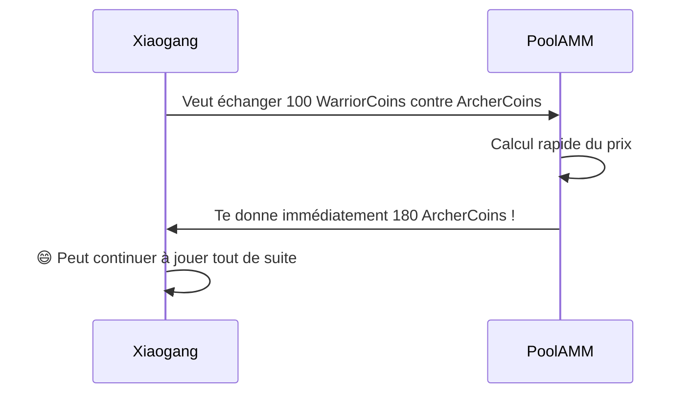
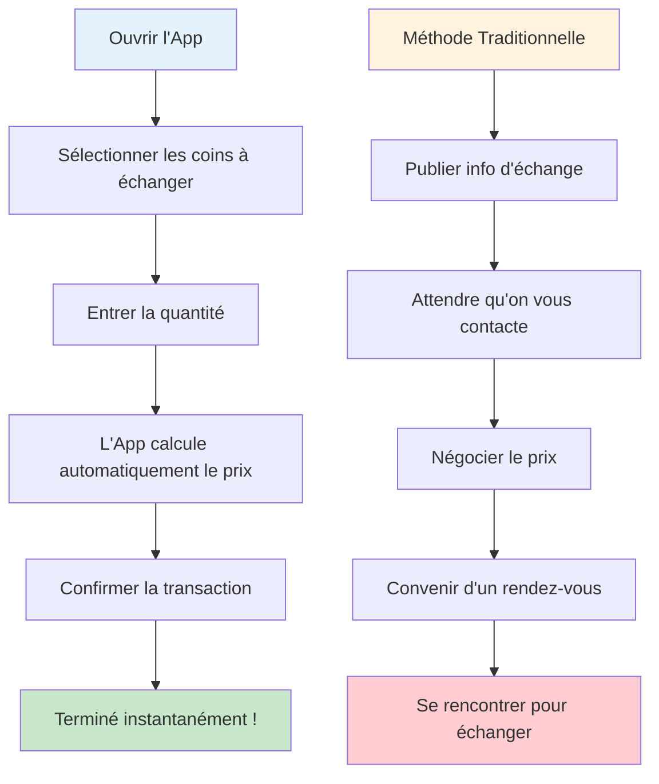

# Guide du Mécanisme de Market Making AMM - Comprendre les Teneurs de Marché Automatisés depuis Zéro

## Table des matières
1. [Qu'est-ce qu'un AMM ?](#quest-ce-quun-amm)
2. [L'Histoire des Échanges Traditionnels](#lhistoire-des-échanges-traditionnels)
3. [Le Monde Magique des AMM](#le-monde-magique-des-amm)
4. [Principes Mathématiques Version Simplifiée](#principes-mathématiques-version-simplifiée)
5. [Illustration du Fonctionnement des AMM](#illustration-du-fonctionnement-des-amm)
6. [Qu'est-ce que le Slippage ?](#quest-ce-que-le-slippage)
7. [Pourquoi Utiliser un AMM ?](#pourquoi-utiliser-un-amm)
8. [Analyse de Cas Pratiques](#analyse-de-cas-pratiques)
9. [Résumé](#résumé)

---

## Qu'est-ce qu'un AMM ?

Imaginez que vous voulez échanger des pommes contre des bananes, mais vous ne trouvez personne qui veut justement des pommes. Maintenant, s'il y avait une "machine à jus magique" où vous mettez des pommes et elle vous donne automatiquement le nombre correspondant de bananes, c'est le concept de base d'un AMM (Automated Market Maker) !

**AMM = Automated Market Maker (Teneur de Marché Automatisé)**

En termes simples, un AMM est un "robot de trading" intelligent qui ne se repose jamais, vous permettant d'échanger différents tokens à tout moment et n'importe où, sans avoir besoin d'attendre que quelqu'un d'autre fasse des échanges avec vous.

---

## L'Histoire des Échanges Traditionnels

### 📖 Les Problèmes de Trading de Xiaoming

Xiaoming veut échanger ses 100 AppleCoins contre des BananaCoins. Sur un échange traditionnel :

1. **Placer un Ordre en Attente** : Xiaoming place un ordre "Je veux acheter des BananaCoins avec 100 AppleCoins, prix 1:2"
2. **Attendre un Acheteur** : Xiaoming doit attendre que quelqu'un veuille vendre des BananaCoins à un prix approprié
3. **Attente Potentiellement Longue** : S'il n'y a personne qui veut vendre, Xiaoming pourrait attendre des heures voire des jours
4. **Fluctuations de Prix** : Pendant l'attente, le prix peut changer, Xiaoming pourrait manquer le meilleur moment

### Problèmes des Échanges Traditionnels :
- ⏰ **Besoin d'Attendre** : Doit attendre que quelqu'un veuille échanger
- 📊 **Liquidité Insuffisante** : Difficile d'échanger des tokens peu populaires
- 💰 **Prix Instable** : Les gros ordres causent facilement de fortes fluctuations de prix
- 🌙 **Contraintes Horaires** : Les échanges ont des heures d'ouverture

---

## Le Monde Magique des AMM

### 🏪 Le Magasin Automatique Magique

Maintenant, imaginez un magasin automatique magique (AMM) qui fonctionne comme ceci :

1. **Toujours Ouvert** : Fonctionne 24 heures sur 24, ne ferme jamais
2. **Trading Instantané** : Vous obtenez ce que vous voulez immédiatement
3. **Prix Automatique** : Les prix s'ajustent automatiquement selon le stock
4. **Pas d'Attente** : Pas besoin d'attendre d'autres clients

### 🏦 Pool de Liquidité = Super Entrepôt

Le cœur d'un AMM est le "pool de liquidité", comme un énorme entrepôt à deux compartiments :

### 🤖 Robot de Tarification Automatique

L'AMM possède un robot de tarification super intelligent qui suit une règle simple :

**🔢 Formule Magique : Quantité d'AppleCoins × Quantité de BananaCoins = Valeur Fixe (k)**

Cette formule garantit que :
- Plus il y a d'acheteurs, plus le prix est élevé
- Plus il y a de vendeurs, plus le prix est bas
- Il y a toujours du stock à acheter et un prix pour vendre

---

## Principes Mathématiques Version Simplifiée

### 🧮 Formule du Produit Constant

Ne soyez pas effrayé par les "mathématiques" — c'est en fait très simple !

Supposons que notre entrepôt magique contienne :
- AppleCoins : 100
- BananaCoins : 200
- Nombre magique k = 100 × 200 = 20 000

**Règle : Peu importe comment vous échangez, la valeur k doit rester à 20 000 !**

### 📊 Exemple de Transaction

**Xiaoming veut échanger 10 AppleCoins contre des BananaCoins :**

1. **Avant la Transaction** :
   - AppleCoins : 100
   - BananaCoins : 200
   - k = 100 × 200 = 20 000

2. **Xiaoming Dépose 10 AppleCoins** :
   - Nouvelle quantité d'AppleCoins : 100 + 10 = 110
   - Doit maintenir k = 20 000
   - Donc : 110 × Nouvelle quantité de BananaCoins = 20 000
   - Nouvelle quantité de BananaCoins = 20 000 ÷ 110 = 181,8

3. **Xiaoming Reçoit** :
   - BananaCoins : 200 - 181,8 = 18,2
   - A échangé 10 AppleCoins contre 18,2 BananaCoins

---

## Illustration du Fonctionnement des AMM

### 🎢 Graphique de la Courbe de Prix

Les changements de prix AMM ressemblent à des montagnes russes, suivant une courbe spéciale :

### 📈 Diagramme Offre et Demande

Imaginez les deux côtés d'une balance :

---

## Qu'est-ce que le Slippage ?

### 🛒 Analogie avec les Courses au Supermarché

Imaginez que vous allez au supermarché acheter des pommes :

**Supermarché Traditionnel (Échange Centralisé) :**
- Prix affiché : 5 €/kg
- Acheter 1 kg : 5 €
- Acheter 100 kg : Toujours 5 €/kg
- Mais il n'y a peut-être pas autant de stock !

**Supermarché Magique (AMM) :**
- 1er kg : 5 €
- 2e kg : 5,1 € (stock diminue, prix augmente)
- 3e kg : 5,2 €
- Plus vous achetez, plus le prix augmente rapidement !

### 📊 Graphique d'Impact du Slippage

### 🎯 Exemple de Calcul du Slippage

Supposons qu'il y ait 1000 AppleCoins et 2000 BananaCoins dans le pool :

1. **Acheter 10 BananaCoins** : Slippage environ 0,25%
2. **Acheter 100 BananaCoins** : Slippage environ 2,5%
3. **Acheter 500 BananaCoins** : Slippage environ 14%

**Conclusion : Plus vous achetez, plus le prix moyen par coin est élevé !**

---

## Pourquoi Utiliser un AMM ?

### 🌟 Super Avantages des AMM

#### 1. 🚀 Trading Instantané
- **Méthode Traditionnelle** : Peut attendre plusieurs heures pour trouver une contrepartie
- **Méthode AMM** : Transaction terminée en quelques secondes

#### 2. 🌍 24/7 en Continu
- **Échange Traditionnel** : Heures d'ouverture, fermé les jours fériés
- **AMM** : Ne ferme jamais, trading possible à tout moment

#### 3. 🎯 Pas Besoin d'Appariement
- **Méthode Traditionnelle** : Besoin que les prix acheteur et vendeur correspondent
- **AMM** : Peut échanger tant qu'il y a des coins dans le pool

#### 4. 💎 Support des Tokens de Niche
- **Échange Traditionnel** : Les coins peu populaires peuvent manquer de traders
- **AMM** : Peut échanger dès qu'un pool est créé

### 📊 Tableau Comparatif

| Caractéristique | Échange Traditionnel | AMM |
|-----------------|---------------------|-----|
| Vitesse de Transaction | Besoin d'attendre l'appariement ⏳ | Instantané ⚡ |
| Heures d'Ouverture | Limitées 🕐 | 24/7 🌍 |
| Liquidité | Dépend des ordres utilisateurs 👥 | Garantie par algorithme 🤖 |
| Découverte de Prix | Carnet d'ordres 📋 | Formule mathématique 🧮 |
| Slippage | Dépend de la profondeur du carnet 📊 | Dépend du volume de transaction 📈 |

---

## Analyse de Cas Pratiques

### 🎮 Histoire de Trading de Tokens de Jeu

#### Contexte
Xiaogang joue à un jeu blockchain et veut échanger des tokens de jeu :
- 🗡️ WarriorCoin (pour acheter des armes)
- 🏹 ArcherCoin (pour acheter des arcs)

#### Scénario 1 : Échange Traditionnel

#### Scénario 2 : AMM

### 🍕 Analogie avec une Pizzeria

**Mode Traditionnel (Échanger des coins avec des amis) :**
- Vous voulez du Bitcoin, vous devez trouver quelqu'un qui veut justement votre Ethereum
- Vous devrez peut-être crier dans un groupe : Quelqu'un veut échanger Bitcoin contre Ethereum ?
- Vous pourriez attendre une demi-journée sans réponse

**Mode AMM (Distributeur Automatique) :**
- Comme un distributeur automatique super intelligent
- Insérez de l'Ethereum, obtenez immédiatement du Bitcoin
- Prix calculé automatiquement, pas de négociation

### 📱 Analogie avec une App Mobile

Imaginez une app magique d'échange de coins :

---

## Résumé

### 🎯 Récapitulatif des Points Clés

1. **L'AMM est comme un Distributeur Automatique Magique**
   - Insérez un type de coin, obtenez immédiatement un autre type
   - Fonctionne 24 heures, ne se repose jamais

2. **La Formule du Produit Constant est le Cœur**
   - x × y = k (nombre magique qui ne change jamais)
   - Cette formule permet l'ajustement automatique des prix

3. **Le Slippage est un Phénomène Normal**
   - Plus vous achetez, plus le prix augmente
   - Comme au supermarché, acheter plus coûte plus cher

4. **L'AMM est Plus Pratique que les Échanges Traditionnels**
   - Pas besoin d'attendre, trading instantané
   - Support de tous les types de coins
   - Liquidité toujours disponible

### 🌈 Perspectives d'Avenir

La technologie AMM continue d'évoluer :
- Algorithmes de tarification plus intelligents
- Slippage plus faible
- Plus de fonctionnalités innovantes

### 🎓 Conseils pour Débutants

1. **Commencer Petit** : Pratiquez d'abord avec de petites sommes
2. **Comprendre le Slippage** : Faites attention au slippage pour les grandes transactions
3. **Comparer** : Différents AMM peuvent avoir des prix différents
4. **Apprentissage Continu** : Le monde DeFi évolue rapidement

---

## Annexe : Questions Fréquemment Posées

### ❓ FAQ

**Q1 : L'AMM peut-il manquer de coins ?**
R1 : Théoriquement non ! Tant qu'il y a des coins dans le pool, vous pouvez échanger. Mais le prix peut être très élevé.

**Q2 : Pourquoi parfois le prix diffère beaucoup ?**
R2 : Parce que la taille des pools est différente. Les petits pools ont de grandes fluctuations de prix, les grands pools sont relativement stables.

**Q3 : L'AMM est-il sûr ?**
R3 : Le code est open source, mais choisissez des plateformes auditées.

**Q4 : Comment sont calculés les frais ?**
R4 : Généralement 0,1-1% du montant de la transaction, automatiquement déduits du résultat de la transaction.

**Q5 : Peut-on annuler une transaction ?**
R5 : Avant la confirmation on-chain, vous pouvez annuler, mais vous devez payer des frais d'annulation.

Rappelez-vous : L'investissement comporte des risques, tradez avec prudence ! Apprenez d'abord, pratiquez ensuite, commencez petit ! 🚀
