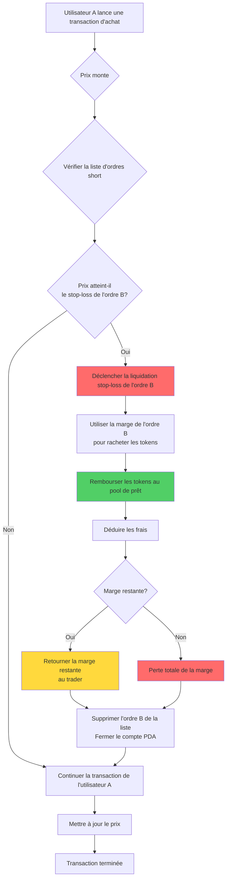
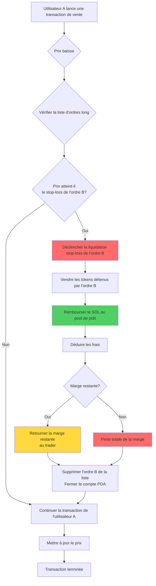
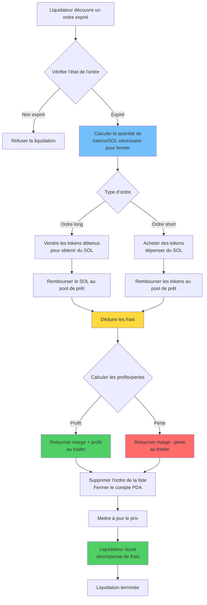
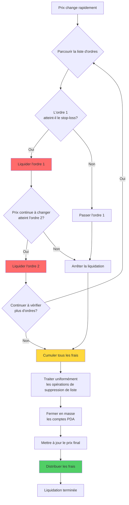

# ⚡ Description de la fonction de liquidation forcée (liquidation) de PinPet

## 📋 Aperçu de la fonctionnalité

La liquidation forcée est un mécanisme central de contrôle des risques dans le protocole PinPet pour protéger la stabilité du système. Le système fournit deux modes de déclenchement de liquidation forcée :

1. **⏰ Déclenchement temporel** : Lorsqu'un ordre de trading à effet de levier dépasse la durée de détention réglementaire, n'importe qui peut déclencher une liquidation forcée
2. **🎯 Déclenchement par prix** : Lorsque le prix du marché atteint la ligne de prix stop-loss de l'ordre, une liquidation stop-loss automatique est déclenchée

Ce double mécanisme de protection garantit la liquidité et la sécurité des fonds du protocole, tout en protégeant les traders contre des pertes excessives.

## ⚙️ Caractéristiques principales

### 1. 🔄 Double mécanisme de déclenchement

#### ⏰ Déclenchement temporel
- **✅ Clôture normale** : Pendant la période de détention de l'ordre, seul le trader qui a ouvert la position peut la fermer activement
- **⏱️ Liquidation à l'expiration** : Après expiration de l'ordre, n'importe qui peut effectuer une opération de liquidation forcée
- **🔍 Vérification temporelle** : Le système détermine automatiquement si l'ordre a expiré via l'horodatage on-chain

#### 🎯 Déclenchement par prix (liquidation stop-loss)
- **📉 Stop-loss long** : Lorsque le prix baisse et atteint la ligne de prix stop-loss de l'ordre long, fermeture automatique
- **📈 Stop-loss short** : Lorsque le prix monte et atteint la ligne de prix stop-loss de l'ordre short, fermeture automatique
- **🔄 Déclenchement passif** : La liquidation stop-loss déclenchée par le prix s'exécute automatiquement lors des transactions d'autres utilisateurs
- **⚠️ Épuisement de la marge** : Lors du stop-loss, la marge est utilisée pour rembourser l'emprunt, le trader n'a généralement pas de profit ou perd toute sa marge

### 2. 📊 Types d'ordres supportés

| Type d'ordre | Condition de déclenchement par prix | Condition de déclenchement temporel | Direction de la liste | Traitement des actifs |
|---------|------------|------------|---------|---------|
| 📈 Ordre long | Prix baisse et atteint le stop-loss | Ordre expiré | Down | Remboursement du SOL emprunté |
| 📉 Ordre short | Prix monte et atteint le stop-loss | Ordre expiré | Up | Remboursement des tokens empruntés |

### 3. 👥 Rôles des participants

- **👤 Trader** : L'utilisateur qui crée un ordre à effet de levier, possède le droit exclusif de fermeture avant l'expiration de l'ordre
- **🔨 Liquidateur** : Tout utilisateur tiers peut exécuter une liquidation active après l'expiration de l'ordre
- **💼 Traders** : Les transactions d'achat/vente d'autres utilisateurs peuvent déclencher une liquidation stop-loss par prix
- **🤖 Protocole** : Gère automatiquement les fonds du pool de prêt pour assurer une circulation normale des fonds

## 🔄 Flux de travail

### 📊 Tableau comparatif des flux

| Phase du flux | ⏰ Liquidation déclenchée par le temps | 🎯 Stop-loss déclenché par le prix |
|---------|------------|------------|
| Condition de déclenchement | Ordre expiré | Prix atteint le stop-loss |
| Moment de déclenchement | Initié activement par le liquidateur | Déclenché passivement lors d'une transaction |
| Vérification des permissions | Exécutable par n'importe qui | Exécution automatique (aucune permission requise) |
| Règlement des profits/pertes | Peut être profitable ou en perte | Généralement perte de toute la marge |
| Traitement de la marge | Retour de la marge restante | Utilisée pour rembourser l'emprunt |

### 📉 Flux de liquidation stop-loss d'ordre short (déclenchement par prix)



### 📈 Flux de liquidation stop-loss d'ordre long (déclenchement par prix)



### ⏰ Flux de liquidation à l'expiration (déclenchement temporel)



### 💥 Flux de liquidation en cascade par lots



## 💰 Mécanisme de frais

### 💵 Composition des frais

| Type de frais | Prélevé sur | Taux | Utilisation |
|---------|---------|------|------|
| Frais de transaction | Trader | Selon le taux de l'ordre | Compenser les fournisseurs de liquidité |
| Frais de liquidation | Trader | Selon le taux de l'ordre | Récompenser les exécuteurs de liquidation |

### 🤝 Distribution des frais

Tous les frais sont distribués entre deux parties selon le ratio de partage (fee_split) configuré dans le protocole :

- **🤝 Partenaire** : Reçoit une certaine proportion des frais
- **🔧 Fournisseur technique** : Reçoit les frais restants

Le ratio de distribution est défini par l'administrateur lors de la création du pool de liquidité, avec une valeur comprise entre 0 et 100.

## 💸 Règles de règlement des fonds

### ⏰ Liquidation déclenchée par le temps (ordre expiré)

#### ✅ Situation profitable
Lorsque l'ordre est profitable :
- Le trader récupère la marge + la partie profitable
- Déduction des frais de transaction et des frais de liquidation
- L'adresse de règlement doit être celle du trader

#### ❌ Situation de perte
Lorsque l'ordre est en perte :
- La perte est déduite de la marge
- La marge restante est retournée au trader
- Déduction des frais de transaction et des frais de liquidation

#### 🧮 Formules de règlement
**📈 Profits/pertes d'ordre long** :
```
Profit = SOL obtenu de la vente + marge - SOL emprunté - frais
```

**📉 Profits/pertes d'ordre short** :
```
Profit = SOL verrouillé - SOL dépensé pour racheter - frais
```

### 🎯 Stop-loss déclenché par le prix (liquidation automatique)

#### 🛡️ Traitement de la marge
- La marge est utilisée en priorité pour rembourser le pool de prêt
- Le solde après déduction des frais de transaction est entièrement utilisé pour la fermeture
- Généralement, le trader n'a pas de profit ou perd toute sa marge

#### 🧮 Formules de règlement
**📈 Stop-loss d'ordre long** :
```
Marge restante = marge - remboursement du SOL emprunté - frais
Si marge restante > 0, retourner au trader
Si marge restante ≤ 0, perte totale de la marge
```

**📉 Stop-loss d'ordre short** :
```
Coût de rachat = SOL dépensé pour racheter les tokens + frais
Marge restante = marge - coût de rachat
Si marge restante > 0, retourner au trader
Si marge restante ≤ 0, perte totale de la marge
```

### 📊 Comparaison des scénarios de règlement

| Type de scénario | Moment du règlement | Possibilité de profit | Retour de la marge | Source des frais |
|---------|---------|----------|----------|----------|
| ✅ Clôture active | Opération du trader | Profit ou perte possible | Principal + profit ou moins la perte | Payé par le trader |
| ⏰ Liquidation à l'expiration | Ordre expiré | Profit ou perte possible | Principal + profit ou moins la perte | Payé par le trader |
| 🎯 Liquidation stop-loss | Déclenchée par le prix | Généralement perte | Solde après déduction de la marge | Déduit de la marge |

## 🔗 Gestion de la liste

### 📋 Structure de la liste d'ordres

Le système utilise une liste doublement chaînée pour gérer les ordres en attente de fermeture :

- **📈 Liste d'ordres long (Down)** : Classée par prix du plus élevé au plus bas
- **📉 Liste d'ordres short (Up)** : Classée par prix du plus bas au plus élevé

### 🔧 Opérations sur la liste

```
Vérification du nœud de tête → Confirmation de la position de l'ordre
    ↓
Vérification des relations entre nœuds précédent et suivant
    ↓
Suppression du nœud actuel → Mise à jour des pointeurs des nœuds précédent et suivant
    ↓
Mise à jour du pointeur de tête de liste
```

### 💥 Liquidation par lots

Lorsqu'une transaction déclenche plusieurs ordres stop-loss :
1. Parcourir la liste d'ordres dans l'ordre
2. Exécuter séquentiellement la fermeture de chaque ordre expiré
3. Cumuler tous les frais de fermeture
4. Effectuer un règlement unifié des fonds

## 🛡️ Mécanismes de sécurité

### 🔐 Vérification des permissions

| Élément de vérification | Condition temporelle | Exigence de permission |
|-------|---------|---------|
| Clôture active | Ordre non expiré | Doit être le trader lui-même |
| Liquidation forcée | Ordre expiré | Exécutable par n'importe qui |
| Adresse de règlement | À tout moment | Doit être l'adresse du trader |

### 🔢 Sécurité numérique

- Tous les calculs utilisent des méthodes checked_* sécurisées pour éviter les débordements
- Le calcul des frais utilise un algorithme haute précision pour garantir l'exactitude
- Vérification de l'intégrité de la liste d'ordres pour éviter la corruption des données

### 💎 Sécurité des fonds

- Vérification automatique du remboursement des fonds du pool de prêt
- Vérification de la suffisance des fonds du pool
- Protection contre la liquidation répétée

## 🎬 Scénarios d'application réels

### 🎯 Scénario 1 : Liquidation normale à l'expiration (déclenchement temporel)

1. L'utilisateur A a ouvert un ordre long 5x au prix de 100, marge de 1 SOL, durée de détention de 24 heures
2. Après 24 heures, le prix monte à 120, l'ordre est profitable d'environ 1 SOL
3. L'utilisateur B découvre que l'ordre a expiré et exécute la liquidation forcée
4. Le système vend automatiquement les tokens, rembourse l'emprunt, déduit les frais de 0,1 SOL
5. L'utilisateur A reçoit principal 1 SOL + profit 1 SOL - frais 0,1 SOL = 1,9 SOL

### 🚨 Scénario 2 : Liquidation stop-loss déclenchée par le prix

1. L'utilisateur C a ouvert un ordre short 3x au prix de 100, marge de 2 SOL
2. La ligne de prix stop-loss est fixée à 130 (calculée automatiquement à l'ouverture)
3. L'utilisateur D achète une grande quantité de tokens, le prix monte rapidement à 135
4. Le prix atteint le stop-loss de l'utilisateur C, le système liquide automatiquement l'ordre C
5. Utilise la marge de 2 SOL pour racheter les tokens et rembourser le pool de prêt
6. Déduit les frais de 0,1 SOL, 0,2 SOL restants retournés à l'utilisateur C
7. L'utilisateur C perd 1,8 SOL, la transaction d'achat de l'utilisateur D se poursuit

### 💥 Scénario 3 : Liquidation stop-loss en cascade

1. Le prix monte rapidement, déclenchant les stop-loss de plusieurs ordres short
2. L'utilisateur E soumet une transaction d'achat, le prix passe de 100 à 150
3. Le système détecte qu'il faut liquider 5 ordres short
4. Exécute séquentiellement les opérations de fermeture stop-loss par ordre de prix
5. Chaque ordre utilise sa marge pour racheter les tokens et rembourser l'emprunt
6. Finalement, déduit les frais cumulés de manière uniforme, retourne la marge restante
7. La transaction d'achat de l'utilisateur E est finalement terminée

### 📊 Scénario 4 : Liquidation stop-loss après fermeture partielle

1. L'utilisateur F a ouvert un ordre long de 1000 tokens, marge de 5 SOL
2. Ferme activement 500 tokens avec un profit de 2 SOL, reste 500 tokens en position
3. Le prix continue de baisser et atteint le stop-loss de la position restante
4. Le système exécute automatiquement la liquidation stop-loss des 500 tokens restants
5. Après déduction de l'emprunt et des frais, l'utilisateur F a un profit total de 0,5 SOL

## ❓ Questions fréquentes

### Q1 : ⏰ Quelle est la différence entre le déclenchement temporel et 🎯 le déclenchement par prix ?

R :
- **⏰ Déclenchement temporel** : Après l'expiration de l'ordre, le liquidateur doit initier activement une transaction pour exécuter la fermeture, le trader peut faire un profit ou une perte
- **🎯 Déclenchement par prix** : Lorsque le prix atteint la ligne de stop-loss, s'exécute automatiquement lors des transactions d'autres utilisateurs, le trader perd généralement sa marge

Les deux mécanismes sont indépendants, l'ordre peut d'abord déclencher le stop-loss par prix ou d'abord être liquidé à l'expiration.

### Q2 : 🎯 Comment la ligne de prix stop-loss est-elle déterminée ?

R : La ligne de prix stop-loss est calculée automatiquement à l'ouverture en fonction de l'effet de levier et de la marge :
- **📈 Ordre long** : Prix stop-loss = prix d'ouverture × (1 - 1/effet de levier)
- **📉 Ordre short** : Prix stop-loss = prix d'ouverture × (1 + 1/effet de levier)

Par exemple : 5x long, prix d'ouverture 100, stop-loss environ 80 ; 3x short, prix d'ouverture 100, stop-loss environ 133.

### Q3 : 🔔 Serai-je notifié lorsque le stop-loss est déclenché par le prix ?

R : ❌ Non. La liquidation stop-loss est déclenchée passivement lors des transactions d'autres utilisateurs, le système ne notifie pas à l'avance. Suggestions :
- 🔍 Surveiller l'état de vos ordres via les événements on-chain
- 📊 Utiliser des outils tiers pour surveiller le risque des positions
- ⚠️ Définir un effet de levier raisonnable pour éviter de déclencher facilement le stop-loss

### Q4 : ⏰ Combien de temps après l'expiration de l'ordre sera-t-il liquidé de force ?

R : Après l'expiration de l'ordre, n'importe qui peut immédiatement le liquider de force, il n'y a pas de période de grâce supplémentaire. Mais cela nécessite qu'un liquidateur initie activement une transaction. Il est recommandé de fermer activement avant l'expiration de l'ordre pour conserver plus de contrôle.

### Q5 : 💰 La liquidation forcée entraîne-t-elle des frais supplémentaires ?

R : ✅ Non, il n'y a pas de frais supplémentaires. Que ce soit un déclenchement temporel ou par prix, les frais sont prélevés selon le taux défini lors de l'ouverture de l'ordre, identique à une fermeture normale.

### Q6 : ⚠️ La marge sera-t-elle entièrement perdue lors de la liquidation stop-loss ?

R : Pas nécessairement. Bien que généralement la marge soit en grande partie perdue lors de la liquidation stop-loss, si :
- ✅ Le prix atteint juste la ligne de stop-loss lors du déclenchement
- 📊 La volatilité du marché n'est pas importante, le coût de liquidation est faible
- 💵 Les frais sont faibles

Il peut y avoir un petit solde de marge retourné au trader. Mais dans la plupart des cas, la liquidation stop-loss signifie une perte importante.

### Q7 : 🔢 Combien d'ordres peuvent être liquidés en une seule transaction ?

R : Théoriquement, une transaction peut liquider jusqu'à 6 ordres (longueur maximale du tableau d'ordres du système). Le nombre réel de liquidations dépend de :
- **🎯 Déclenchement par prix** : Dépend du nombre d'ordres qui atteignent le stop-loss dans la plage de variation des prix
- **⏰ Déclenchement temporel** : Dépend du nombre d'ordres expirés que le liquidateur choisit de liquider

### Q8 : 🔀 Comment l'ordre de liquidation est-il déterminé ?

R : L'ordre de liquidation est déterminé par la structure de la liste d'ordres :
- **📈 Ordres long** : Liquider séquentiellement du prix le plus élevé au plus bas (lorsque le prix baisse)
- **📉 Ordres short** : Liquider séquentiellement du prix le plus bas au plus élevé (lorsque le prix monte)

Cet ordre garantit que les ordres qui atteignent d'abord la ligne de stop-loss sont liquidés en premier, conforme à l'ordre naturel de variation des prix.

### Q9 : 🛡️ Comment éviter la liquidation stop-loss ?

R : Il est recommandé de prendre les mesures suivantes :
- **⚙️ Effet de levier raisonnable** : Utiliser un effet de levier plus faible (2-3x), laisser plus d'espace pour la volatilité des prix
- **💰 Prendre ses profits à temps** : Fermer activement lorsque l'ordre est profitable pour verrouiller les gains
- **👀 Surveiller le marché** : Suivre de près les changements de prix, fermer activement avant de s'approcher de la ligne de stop-loss
- **📊 Construire progressivement** : Ne pas ouvrir toutes les positions en une fois, conserver une marge d'ajustement

### Q10 : ❓ Que se passe-t-il si les fonds sont insuffisants lors de la liquidation ?

R : Le système vérifie la suffisance des fonds du pool avant la liquidation. Si les fonds sont insuffisants, la transaction échoue et est annulée, aucune opération n'est exécutée. Cette situation est très rare car la conception du protocole garantit l'équilibre des fonds.

### Q11 : 🔓 Le compte PDA sera-t-il fermé après la liquidation forcée ?

R : ✅ Oui, après la liquidation forcée, le compte PDA associé sera automatiquement fermé et le loyer sera remboursé au payeur. Pour :
- **⏰ Déclenchement temporel** : Le loyer est remboursé à l'exécuteur de la liquidation
- **🎯 Déclenchement par prix** : Le loyer est remboursé à l'utilisateur qui a déclenché la transaction

### Q12 : 🔄 Le prix stop-loss de l'ordre change-t-il après une fermeture partielle ?

R : Oui. Après une fermeture partielle, le prix stop-loss de l'ordre sera recalculé en fonction de la position restante. Comme la position diminue, le prix stop-loss sera plus proche du prix actuel, augmentant relativement le risque.

### Q13 : 💥 Y aura-t-il des liquidations en cascade lors de fortes volatilités des prix ?

R : ⚠️ Oui. Lorsque le prix fluctue rapidement, des liquidations stop-loss en cascade peuvent se produire :
1. Le prix franchit une ligne de stop-loss
2. Déclenche la liquidation du premier lot d'ordres
3. La liquidation elle-même pousse le prix à continuer de changer
4. Déclenche la liquidation du lot d'ordres suivant

Cette situation est plus susceptible de se produire dans les zones à effet de levier élevé et à forte densité d'ordres, il est donc recommandé d'utiliser l'effet de levier élevé avec prudence.

### Q14 : ❌ Quelles sont les conséquences d'un échec de liquidation ?

R : Si la transaction de liquidation échoue pour une raison quelconque (comme une erreur de paramètre, des fonds insuffisants, etc.), la transaction sera annulée et n'aura aucun impact sur le système. L'ordre du trader reste inchangé et peut :
- ⏳ Attendre la prochaine tentative de liquidation
- ✅ Fermer activement par soi-même
- 🎯 Attendre que d'autres transactions déclenchent le stop-loss par prix

### Q15 : 🚫 Peut-on annuler une liquidation stop-loss déjà déclenchée ?

R : ❌ Non. La liquidation stop-loss est exécutée automatiquement lors des transactions d'autres utilisateurs, une fois que le prix atteint la ligne de stop-loss, le processus de liquidation commence immédiatement et ne peut pas être interrompu ou annulé. Ceci est pour protéger la certitude du protocole et prévenir les risques systémiques.
