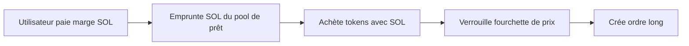
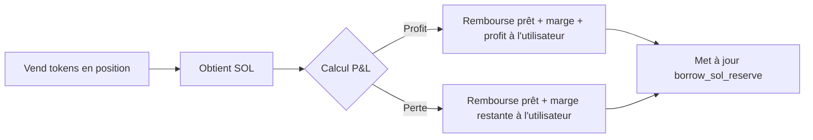
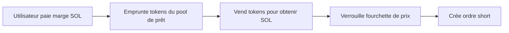
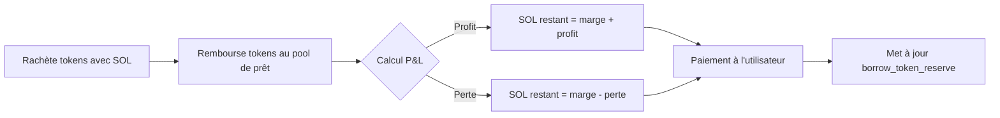
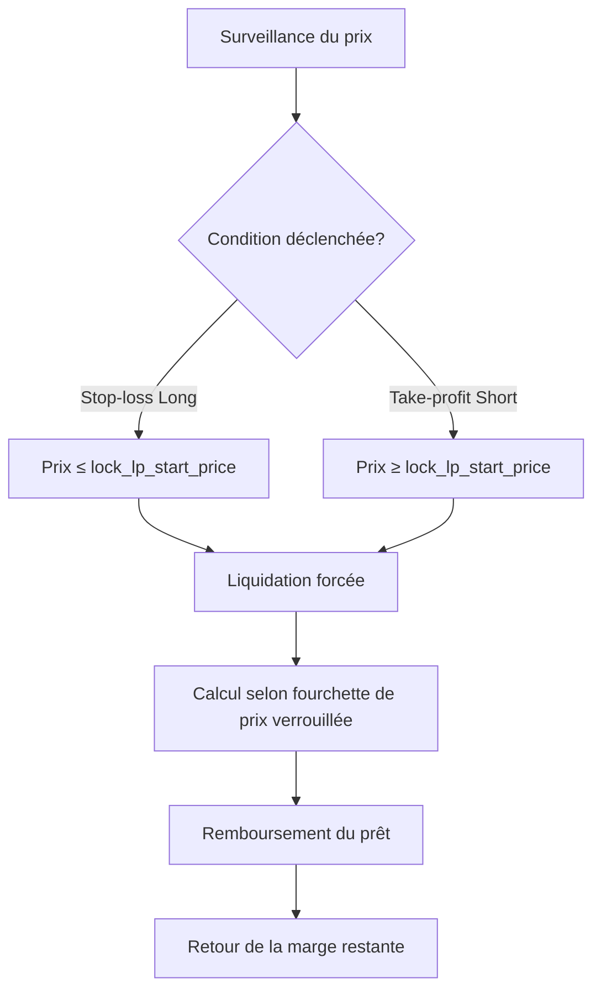
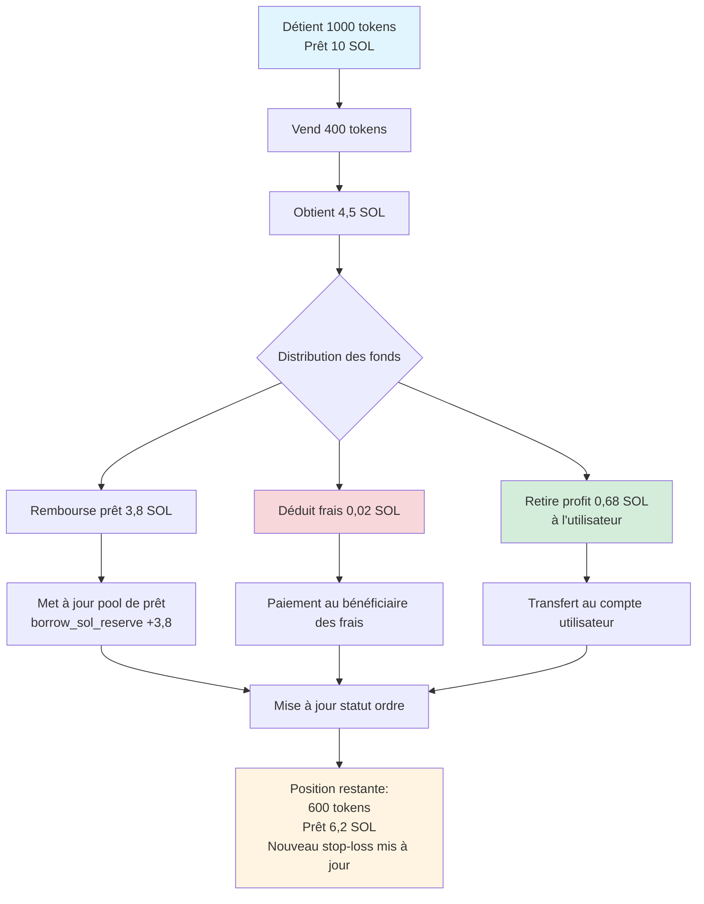
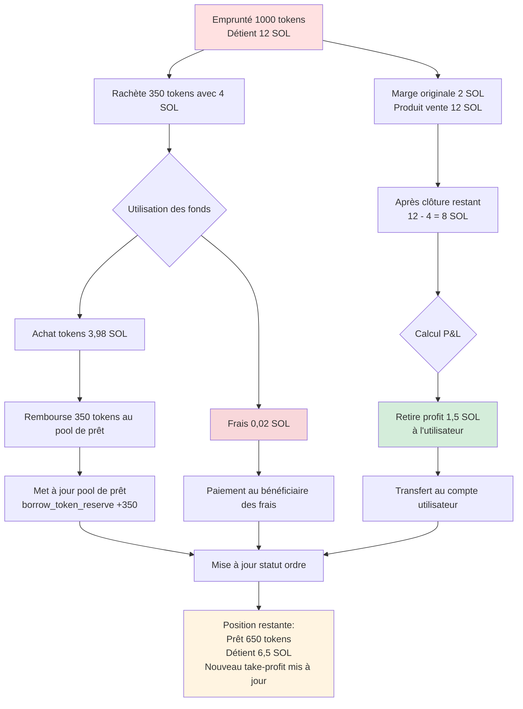

# 🏦 Introduction au Pool de Prêt

## I. 📋 Vue d'ensemble

Le pool de prêt PinPet est le module central qui prend en charge le trading avec effet de levier, offrant aux utilisateurs des services de prêt de SOL et de tokens pour réaliser des fonctions d'achat (long) et de vente à découvert (short). Le pool de prêt adopte un mécanisme de **pool de réserve virtuel**, indépendant du pool de liquidité du trading au comptant, garantissant que le trading avec effet de levier n'affecte pas le fonctionnement normal du marché au comptant.

## II. 🎭 Double Rôle du Pool de Prêt

### 2.1 💰 En tant que Pool de Capital
- **Pool de prêt SOL** : Fournit des prêts SOL aux traders long
- **Pool de prêt de tokens** : Fournit des prêts de tokens aux traders short

### 2.2 📦 Gestion des Réserves
Le pool de prêt maintient deux réserves virtuelles indépendantes :

| Type de Réserve | Description | Usage |
|---------|------|------|
| `borrow_sol_reserve` | Réserve virtuelle SOL | Pour les traders long |
| `borrow_token_reserve` | Réserve virtuelle de tokens | Pour les traders short |

Ces réserves sont des **registres virtuels**, les fonds réels étant stockés dans le pool de liquidité au comptant, isolés par un mécanisme de verrouillage de fourchette de prix.

## III. 🔄 Processus de Prêt pour le Trading avec Effet de Levier

### 3.1 📈 Trading Long - Emprunter SOL pour Acheter des Tokens

#### ⬆️ Phase d'Ouverture de Position


**Processus détaillé** :
1. **Apport utilisateur** : Paiement de la marge (par exemple 0,5 SOL) 💵
2. **Prêt du pool** : Emprunte SOL de `borrow_sol_reserve` (par exemple 4,5 SOL) 💸
3. **Exécution de transaction** : Achète des tokens avec un total de 5 SOL sur l'AMM ⚙️
4. **Verrouillage de fourchette de prix** : Enregistre la fourchette de prix à l'achat, utilisée pour le calcul de clôture 🔒
5. **Enregistrement d'ordre** : Crée `MarginOrder`, enregistre le montant du prêt, la marge, la quantité de tokens en position 📝


#### ⬇️ Phase de Clôture de Position


**Règlement des fonds** :
- Montant total SOL obtenu de la vente de tokens = `output_sol` 💰
- Déduction des frais de transaction 💸
- Remboursement au pool de prêt : `borrow_amount` retourne à `borrow_sol_reserve` ⬅️
- Gain utilisateur = Total - Prêt - Marge ✅

### 3.2 📉 Trading Short - Emprunter des Tokens pour Vendre contre SOL

#### ⬆️ Phase d'Ouverture de Position


**Processus détaillé** :
1. **Apport utilisateur** : Paiement de la marge SOL 💵
2. **Prêt du pool** : Emprunte des tokens de `borrow_token_reserve` 💎
3. **Exécution de transaction** : Vend les tokens pour obtenir SOL, déposé dans le pool de fonds ⚙️
4. **Verrouillage de fourchette de prix** : Enregistre la fourchette de prix à la vente 🔒
5. **Enregistrement d'ordre** : Crée `MarginOrder`, enregistre la quantité de tokens empruntés, la marge, SOL en position 📝


#### ⬇️ Phase de Clôture de Position


**Règlement des fonds** :
- Montant total SOL requis pour racheter les tokens = `required_sol` + frais 💰
- Remboursement au pool de prêt : `borrow_amount` (tokens) retourne à `borrow_token_reserve` ⬅️
- Gain utilisateur = SOL obtenu à l'ouverture - SOL dépensé à la clôture - Marge ✅

## IV. 💸 Mécanisme de Remboursement du Pool de Prêt

### 4.1 ✅ Remboursement par Clôture Active
Lors de la clôture active par l'utilisateur, le système exécute automatiquement le remboursement :

| Type de Transaction | Actif à Rembourser | Source de Remboursement | Réserve Retournée |
|---------|---------|---------|---------|
| Clôture Long | SOL | Produit de la vente de tokens | `borrow_sol_reserve` |
| Clôture Short | Tokens | Rachat de tokens | `borrow_token_reserve` |

**Priorité de remboursement** :
1. Déduction des frais de transaction 💸
2. Remboursement du principal du prêt ⬅️
3. Retour de la marge 💰
4. Distribution des profits/gestion des pertes 📊

### 4.2 ⚠️ Remboursement par Liquidation Forcée
Lorsque le prix atteint le stop-loss/take-profit, le système force automatiquement la clôture :



**Protection contre la liquidation** 🛡️ :
- Grâce au verrouillage de la fourchette de prix, même en cas de forte volatilité du marché, la clôture peut se faire au prix prédéterminé
- La conception de la marge garantit la sécurité des fonds du pool de prêt

### 4.3 ⏰ Liquidation à l'Échéance
Après l'échéance de l'ordre, n'importe qui peut déclencher la clôture :

- Ordre long : Heure d'échéance `end_time` = Heure d'ouverture + `borrow_duration` ⏱️
- Ordre short : Idem
- Après l'échéance, liquidation forcée au prix du marché actuel, remboursement du prêt ⚡

## V. 🛡️ Mécanisme de Sécurité des Fonds du Pool de Prêt

### 5.1 💼 Exigences de Marge
- **Marge minimum** : `MIN_MARGIN_SOL_AMOUNT` (paramètre système) 💰
- **Ratio de marge** : Calculé dynamiquement selon l'effet de levier et la plage de fluctuation des prix 📊
- **Utilisation de la marge** : Couvrir les pertes en cas de mouvement défavorable des prix 🔒

### 5.2 🔐 Verrouillage de Fourchette de Prix
Chaque ordre verrouille la liquidité d'une fourchette de prix spécifique :

```
Verrouillage Long : [lock_lp_start_price, lock_lp_end_price] (fourchette de baisse de prix)
Verrouillage Short : [lock_lp_start_price, lock_lp_end_price] (fourchette de hausse de prix)
```

Cela garantit une liquidité suffisante lors de la clôture pour rembourser le prêt. ✅

### 5.3 ✔️ Vérification des Réserves
Avant l'ouverture, le système vérifie :

| Élément de vérification | Condition | Code d'erreur |
|-------|------|-------|
| Réserve SOL | `required_borrow_sol ≤ borrow_sol_reserve` | `InsufficientBorrowingReserve` |
| Réserve Tokens | `required_borrow_token ≤ borrow_token_reserve` | `InsufficientBorrowingReserve` |


## VI. 💸 Mécanisme de Frais

### 6.1 📊 Frais de Trading avec Effet de Levier
- **Taux de frais** : `borrow_fee` (par exemple 0,5% = 50 points de base) 💰
- **Moment de collecte** : Collecté lors de l'ouverture et de la clôture ⏰
- **Distribution des frais** :
  - Partenaire : Ratio `fee_split` (par exemple 80%) 🤝
  - Fournisseur technique : 100% - `fee_split` (par exemple 20%) ⚙️

### 6.2 ⚡ Frais de Liquidation Forcée
- Lors du déclenchement de la liquidation, `borrow_fee` supplémentaire collecté comme frais de liquidation 💸
- Utilisé pour inciter les tiers à exécuter les liquidations à l'échéance 🎯

## VII. 🎯 Fonction de Clôture Partielle

Les utilisateurs peuvent clôturer partiellement leur position pour gérer le risque de manière flexible : ⚙️

### 7.1 📈 Clôture Partielle Long



**Détails de mise à jour de l'ordre** :

| Champ | Avant clôture | Après clôture | Description |
|-----|-------|-------|------|
| `position_asset_amount` | 1000 tokens | 600 tokens | Position restante |
| `borrow_amount` | 10 SOL | 6,2 SOL | Prêt restant |
| `lock_lp_start_price` | Stop-loss original | Nouveau stop-loss | Recalculé selon nouvelle position |
| `realized_sol_amount` | 0 SOL | 0,68 SOL | Profit réalisé cumulé |

### 7.2 📉 Clôture Partielle Short



**Détails de mise à jour de l'ordre** :

| Champ | Avant clôture | Après clôture | Description |
|-----|-------|-------|------|
| `borrow_amount` | 1000 tokens | 650 tokens | Prêt restant (tokens) |
| `position_asset_amount` | 12 SOL | 6,5 SOL | SOL détenu restant |
| `lock_lp_start_price` | Take-profit original | Nouveau take-profit | Recalculé selon nouvelle position |
| `realized_sol_amount` | 0 SOL | 1,5 SOL | Profit réalisé cumulé |

### 7.3 ⚠️ Limite de Position Minimale
Après clôture partielle, la position restante doit être ≥ `MIN_TRADE_TOKEN_AMOUNT * 2`, pour éviter de créer des positions minuscules non liquidables.

## VIII. 🔗 Relation entre Pool de Prêt et Pool de Liquidité

### 8.1 🔒 Isolation des Fonds
- **Pool de liquidité au comptant** : `lp_sol_reserve` + `lp_token_reserve`
- **Pool virtuel de prêt** : `borrow_sol_reserve` + `borrow_token_reserve`

Bien que les fonds réels soient dans le même `pool_sol_account` et `pool_token_account`, une isolation logique est réalisée grâce au mécanisme de verrouillage de fourchette de prix. 🛡️

### 8.2 🔄 Synchronisation des Prix
- Le trading au comptant et le trading avec effet de levier partagent le même `price` (prix actuel du marché) 💹
- Après la mise à jour du prix, le système recalcule les réserves de liquidité : `price_to_reserves(price)` ⚙️

### 8.3 🤝 Complémentarité de la Liquidité
- Les fourchettes de prix verrouillées par le trading avec effet de levier ne participent pas au trading au comptant 🔐
- Le trading au comptant peut déclencher la liquidation forcée des ordres à effet de levier, libérant ainsi la liquidité ⚡

## IX. ✨ Avantages Clés

| Caractéristique | Description | Avantage |
|-----|------|------|
| Réserves virtuelles | Le pool de prêt est un registre comptable, pas un pool de fonds réel | Efficacité élevée des fonds, pas besoin de capital supplémentaire |
| Verrouillage de fourchette de prix | Prix de clôture prévisible | Réduit le risque de liquidation, protège le pool de prêt |
| Prêt bidirectionnel | Supporte le prêt bidirectionnel de SOL et tokens | Fonctions long/short complètes |
| Clôture partielle | Ajustement flexible de la position | Bonne expérience utilisateur, risque contrôlable |
| Liquidation à l'échéance | Limite de temps + incitation tierce | Garantit le retour rapide des fonds |


