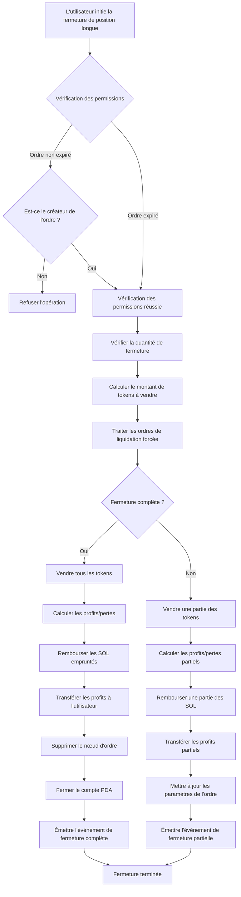
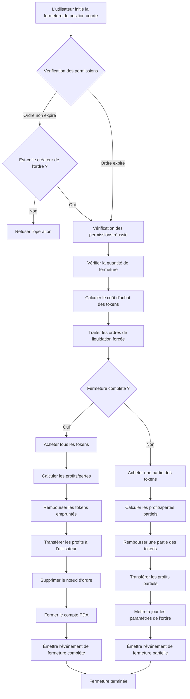

# 💼 Introduction au Produit de Fermeture de Position avec Effet de Levier PinPet

## 1. 📋 Aperçu des Fonctionnalités

### 🤔 Qu'est-ce que la Fermeture de Position ?

La fermeture de position désigne l'opération par laquelle un utilisateur clôture une position de trading avec effet de levier qu'il détient. Sur la plateforme PinPet, lorsqu'un utilisateur ouvre une position, un ordre de marge est créé, enregistrant la relation de prêt et les informations de position. L'opération de fermeture de position règle cet ordre, rembourse l'emprunt et règle les profits et pertes avec l'utilisateur.

### 💡 Pourquoi Fermer une Position ?

| Raison de Fermeture | Description |
|---------|------|
| **🎯 Prise de Profit/Stop Loss** | L'utilisateur ferme activement la position pour verrouiller les profits ou limiter les pertes |
| **⏰ Expiration de l'Ordre** | Après expiration, n'importe qui peut déclencher la fermeture pour restituer les ressources empruntées |
| **💰 Gestion des Fonds** | Libérer la marge pour ajuster flexiblement la stratégie de trading |
| **🛡️ Contrôle des Risques** | Éviter des pertes plus importantes dues aux fluctuations du marché |

### 📊 Types de Fermeture de Position

- **🔚 Fermeture Complète** : Ferme l'intégralité de la position en une seule fois, règle tous les profits et pertes
- **✂️ Fermeture Partielle** : Ferme la position par lots, réalise des profits partiels, conserve la position restante

## 2. 📈 Fonction de Fermeture de Position Longue (Close Long)

### 📝 Description de la Fonction

La fermeture d'une position longue est essentiellement une opération de **vente de tokens**. L'utilisateur avait précédemment emprunté des SOL pour acheter des tokens lors de l'ouverture d'une position longue, et lors de la fermeture, il doit vendre les tokens pour récupérer des SOL afin de rembourser l'emprunt.

### 🔄 Diagramme de Flux Opérationnel



### ⚙️ Description des Paramètres Clés

| Nom du Paramètre | Description | Valeur Exemple |
|---------|---------|--------|
| `sell_token_amount` | Quantité de tokens à vendre (valeur non précise, peut avoir de légères variations) | 1000000 (1 token) |
| `min_sol_output` | Quantité minimale de SOL attendue après la vente (protection contre le slippage) | 50000000 (0.05 SOL) |
| `prev_order_id` | Index de l'ordre précédent dans la liste chaînée | 2 |
| `close_order_id` | Index de l'ordre à fermer dans le tableau d'ordres | 5 |
| `next_order_id` | Index de l'ordre suivant dans la liste chaînée | 7 |
| `close_order_address` | Adresse de l'ordre à fermer (pour vérification de sécurité) | "Abc123..." |

### 🧮 Explication du Calcul des Profits/Pertes

#### 🔚 Scénario de Fermeture Complète

**Formule de calcul** :

```
Profit en SOL = (SOL obtenus de la vente) + (Marge en SOL) - (SOL empruntés)
```

**Étapes de calcul** :
1. Vendre tous les tokens détenus, obtenir des SOL (frais déduits)
2. Ajouter la marge déposée lors de l'ouverture
3. Soustraire les SOL empruntés lors de l'ouverture
4. Positif = profit, négatif = perte

#### ✂️ Scénario de Fermeture Partielle

**Formule de calcul** :

```
Profit actuel = (SOL de la vente actuelle) + (Marge totale) + (SOL vendables futurs des tokens restants) - (SOL totaux empruntés)
```

**Étapes de calcul** :
1. Calculer les SOL obtenus de la vente de tokens actuelle
2. Calculer les SOL que les tokens restants peuvent rapporter au nouveau prix de stop loss (frais déduits)
3. Actifs totaux = Gains actuels + Marge + Gains potentiels restants
4. Soustraire l'emprunt total pour obtenir le profit partiel
5. Rembourser une partie de l'emprunt, la marge restante continue de maintenir la position

### 💹 Comparaison des Scénarios de Profits/Pertes

| Scénario | Prix d'Ouverture | Prix de Fermeture | Tokens en Position | SOL Empruntés | Marge | SOL Obtenus de la Vente | Résultat |
|------|---------|---------|---------|---------|--------|-------------|---------|
| **🟢 Scénario Profitable** | 0.05 SOL | 0.08 SOL | 100 Token | 5 SOL | 0.5 SOL | 8 SOL | +2.5 SOL |
| **🔴 Scénario de Perte** | 0.05 SOL | 0.03 SOL | 100 Token | 5 SOL | 0.5 SOL | 3 SOL | -1.5 SOL |
| **⚖️ Scénario d'Équilibre** | 0.05 SOL | 0.055 SOL | 100 Token | 5 SOL | 0.5 SOL | 5.5 SOL | 0 SOL |

## 3. 📉 Fonction de Fermeture de Position Courte (Close Short)

### 📝 Description de la Fonction

La fermeture d'une position courte est essentiellement une opération d'**achat de tokens**. L'utilisateur avait précédemment emprunté des tokens et les a vendus pour obtenir des SOL lors de l'ouverture d'une position courte, et lors de la fermeture, il doit utiliser des SOL pour racheter les tokens afin de rembourser l'emprunt.

### 🔄 Diagramme de Flux Opérationnel



### ⚙️ Description des Paramètres Clés

| Nom du Paramètre | Description | Valeur Exemple |
|---------|---------|--------|
| `buy_token_amount` | Quantité de tokens à acheter | 1000000 (1 token) |
| `max_sol_amount` | Quantité maximale de SOL prête à payer (protection contre le slippage) | 60000000 (0.06 SOL) |
| `prev_order_id` | Index de l'ordre précédent dans la liste chaînée | 1 |
| `close_order_id` | Index de l'ordre à fermer dans le tableau d'ordres | 3 |
| `next_order_id` | Index de l'ordre suivant dans la liste chaînée | 6 |
| `close_order_address` | Adresse de l'ordre à fermer (pour vérification de sécurité) | "Def456..." |

### 🧮 Explication du Calcul des Profits/Pertes

#### 🔚 Scénario de Fermeture Complète

**Formule de calcul** :

```
Profit en SOL = (SOL obtenus de la vente de tokens à l'ouverture avec frais) - (SOL dépensés pour racheter les tokens à la fermeture) - (Frais)
```

**Étapes de calcul** :
1. Utiliser des SOL pour racheter tous les tokens empruntés
2. Rembourser les tokens empruntés au pool de prêt
3. Calculer : Gains de la vente à l'ouverture - Coût de rachat à la fermeture - Frais
4. Positif = profit, négatif = perte

#### ✂️ Scénario de Fermeture Partielle

**Formule de calcul** :

```
Profit actuel = (Intervalle de rachat actuel avec frais) - (SOL réellement dépensés pour le rachat) - (Frais de rachat)
```

**Étapes de calcul** :
1. Calculer le coût de rachat partiel des tokens actuels (frais inclus)
2. Calculer le coût de rachat futur des tokens restants (frais inclus)
3. Profit actuel = Montant dû actuel - Montant réellement dépensé
4. Rembourser une partie des tokens, mettre à jour les paramètres de l'ordre
5. La marge restante continue de maintenir la position

### 💹 Comparaison des Scénarios de Profits/Pertes

| Scénario | Prix d'Ouverture | Prix de Fermeture | Tokens Empruntés | SOL Obtenus de la Vente | Marge | Coût de Rachat en SOL | Résultat |
|------|---------|---------|---------|-------------|--------|-------------|---------|
| **🟢 Scénario Profitable** | 0.08 SOL | 0.05 SOL | 100 Token | 8 SOL | 0.5 SOL | 5 SOL | +2.5 SOL |
| **🔴 Scénario de Perte** | 0.05 SOL | 0.08 SOL | 100 Token | 5 SOL | 0.5 SOL | 8 SOL | -2.5 SOL |
| **⚖️ Scénario d'Équilibre** | 0.06 SOL | 0.06 SOL | 100 Token | 6 SOL | 0.5 SOL | 6 SOL | -0.06 SOL (frais) |

## 4. ⏰ Timing et Stratégies de Fermeture de Position

### 🎯 Timing de Fermeture Active

| Type de Timing | Scénario Applicable | Stratégie Recommandée |
|---------|---------|---------|
| **📈 Fermeture avec Prise de Profit** | Prix atteint l'objectif prévu | Fermeture partielle pour verrouiller les profits, conserver la position restante |
| **🛑 Fermeture Stop Loss** | Prix passe en dessous du seuil de stop loss | Fermeture complète immédiate, contrôler les pertes |
| **🔧 Ajustement de Position** | Changement de tendance du marché | Réduire ou augmenter la position, optimiser la structure de position |
| **⏳ Fermeture Avant Expiration** | Proche de l'heure d'expiration de l'ordre | Fermeture active pour éviter la liquidation forcée |

### ⚡ Fermeture Passive (Liquidation Forcée)

**Conditions de déclenchement** :
- ⏰ Le délai d'expiration de l'ordre est écoulé
- 👥 N'importe quel utilisateur peut déclencher la liquidation
- 💵 Le liquidateur peut recevoir une certaine récompense de frais

**⚠️ Avertissement de Risque** :
- 📉 Après expiration, la position peut être fermée de force à un prix défavorable
- 💡 Il est recommandé de gérer activement les positions avant expiration

## 5. 📖 Exemples de Scénarios d'Utilisation

### 🟢 Scénario 1 : Fermeture Profitable d'une Position Longue

**Contexte** :
- L'utilisateur ouvre une position longue au prix de 0.05 SOL, achète 100 tokens
- Emprunte 4.5 SOL, dépose une marge de 0.5 SOL
- Le prix actuel monte à 0.08 SOL

**Opération** :
1. L'utilisateur décide de fermer complètement la position pour verrouiller les profits
2. Vend 100 tokens, obtient environ 8 SOL (après déduction des frais)
3. Rembourse 4.5 SOL d'emprunt
4. Récupère 0.5 SOL de marge
5. Profit net : 8 - 4.5 + 0.5 (la marge a déjà été comptée lors de l'ouverture) = environ 3 SOL

**✅ Résultat** : Réalise avec succès un rendement de 60%

### 🔴 Scénario 2 : Fermeture Stop Loss d'une Position Courte

**Contexte** :
- L'utilisateur ouvre une position courte au prix de 0.05 SOL, emprunte et vend 100 tokens, obtient 5 SOL
- Dépose une marge de 0.5 SOL
- Le prix monte à 0.08 SOL, atteint le prix de stop loss

**Opération** :
1. L'utilisateur ferme immédiatement la position en stop loss
2. Utilise 8 SOL pour racheter 100 tokens (frais inclus)
3. Rembourse 100 tokens au pool de prêt
4. Marge 0.5 SOL + Gains d'ouverture 5 SOL = 5.5 SOL de fonds disponibles
5. Perte nette : 5.5 - 8 = -2.5 SOL

**✅ Résultat** : Stop loss opportun, évite des pertes plus importantes

### ✂️ Scénario 3 : Ajustement de Position par Fermeture Partielle

**Contexte** :
- L'utilisateur détient une position longue de 200 tokens
- Le prix a déjà augmenté de 30%
- L'utilisateur souhaite verrouiller une partie des profits, mais continuer à détenir car il est optimiste

**Opération** :
1. Fermeture partielle de 100 tokens
2. Rembourse une partie de l'emprunt en SOL
3. Obtient une partie des profits transférés sur le compte
4. Les 100 tokens restants continuent en position
5. Mise à jour des paramètres de l'ordre, ajustement du prix de stop loss

**✅ Résultat** : Réalise une stratégie flexible de gestion de position

## 6. ⚠️ Avertissements et Limitations

### 🚫 Limitations Opérationnelles

| Type de Limitation | Exigence Spécifique | Description |
|---------|---------|------|
| **🔐 Vérification des Permissions** | Seul le créateur de l'ordre peut fermer avant expiration | Protège la sécurité des actifs de l'utilisateur |
| **💳 Adresse de Règlement** | Doit être l'adresse du portefeuille du créateur | Les fonds ne peuvent retourner qu'à l'adresse d'origine |
| **📏 Volume Minimum de Transaction** | Pas moins de 2 fois le volume minimum lors d'une fermeture partielle | Évite les ordres de poussière |
| **📊 Quantité Restante** | Après fermeture partielle, pas moins que le volume minimum | Garantit la validité de l'ordre |

### ⚠️ Avertissements de Risque

#### 📉 Risque de Slippage
- Le prix d'exécution réel lors de la fermeture peut différer des attentes
- Il est recommandé de définir des paramètres de protection de slippage raisonnables
- L'impact du slippage est plus important pour les fermetures de grande taille

#### 💸 Coût des Frais
- Chaque fermeture nécessite le paiement de frais de transaction
- Les fermetures fréquentes augmentent les coûts
- La fermeture partielle nécessite deux fois des frais (actuel + fermeture complète future)

#### ⏰ Risque de Timing
- Après expiration, n'importe qui peut déclencher la fermeture
- Peut être liquidé à un prix défavorable
- Il est recommandé de gérer à l'avance les ordres sur le point d'expirer

#### 🌊 Risque de Marché
- Les fluctuations rapides des prix peuvent entraîner un mauvais timing de fermeture
- Dans des conditions de marché extrêmes, une liquidation peut survenir
- Il est recommandé de définir des niveaux de stop loss raisonnables

### 💡 Recommandations de Meilleures Pratiques

1. **🛡️ Définir un Stop Loss Raisonnable** : Planifier le prix de stop loss lors de l'ouverture, exécuter strictement
2. **✂️ Fermeture par Lots** : Pour les grandes positions, il est recommandé de fermer par lots pour réduire l'impact sur le marché
3. **⏰ Surveiller le Délai d'Expiration** : Gérer activement les ordres sur le point d'expirer 1-2 jours à l'avance
4. **💰 Contrôler les Frais** : Éviter les opérations de fermeture partielle trop fréquentes
5. **📊 Surveiller la Profondeur du Marché** : Vérifier la liquidité du marché avant une fermeture de grande taille

### 🔒 Garanties de Sécurité Technique

- **✅ Vérification d'Adresse** : Vérification de l'adresse de l'ordre lors de la fermeture, empêche l'opération sur un mauvais ordre
- **🔐 Contrôle des Permissions** : Vérification multiple des permissions, garantit que seuls les utilisateurs autorisés peuvent opérer
- **🛡️ Protection contre le Débordement** : Tous les calculs numériques utilisent la méthode checked sécurisée
- **⚛️ Opérations Atomiques** : Toutes les étapes du processus de fermeture s'exécutent de manière atomique, empêchent les incohérences d'état

---

## 📚 Annexe : Glossaire des Termes

| Terme | Explication |
|------|------|
| **PDA** | Program Derived Address, adresse dérivée du programme, utilisée pour stocker les données d'ordre |
| **Marge** | SOL déposé par l'utilisateur lors de l'ouverture, servant de garantie de risque |
| **Pool de Prêt** | Pool virtuel fournissant des fonds avec effet de levier |
| **Prix de Stop Loss** | Seuil de prix auquel l'ordre est forcé à fermer |
| **Réduction de Frais** | Réduction de frais dont on bénéficie après satisfaction de conditions |
| **Liquidation Forcée** | Mécanisme de fermeture automatique après expiration de l'ordre |
| **Nœud de Liste Chaînée** | Position de l'ordre dans la liste chaînée, utilisée pour gérer efficacement plusieurs ordres |

---

*Ce document est une introduction au produit et ne contient pas de détails d'implémentation technique. Pour en savoir plus sur l'implémentation technique, veuillez consulter le code du projet et la documentation technique.*
