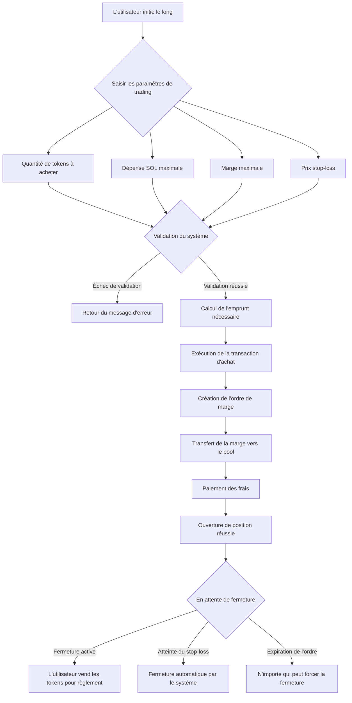
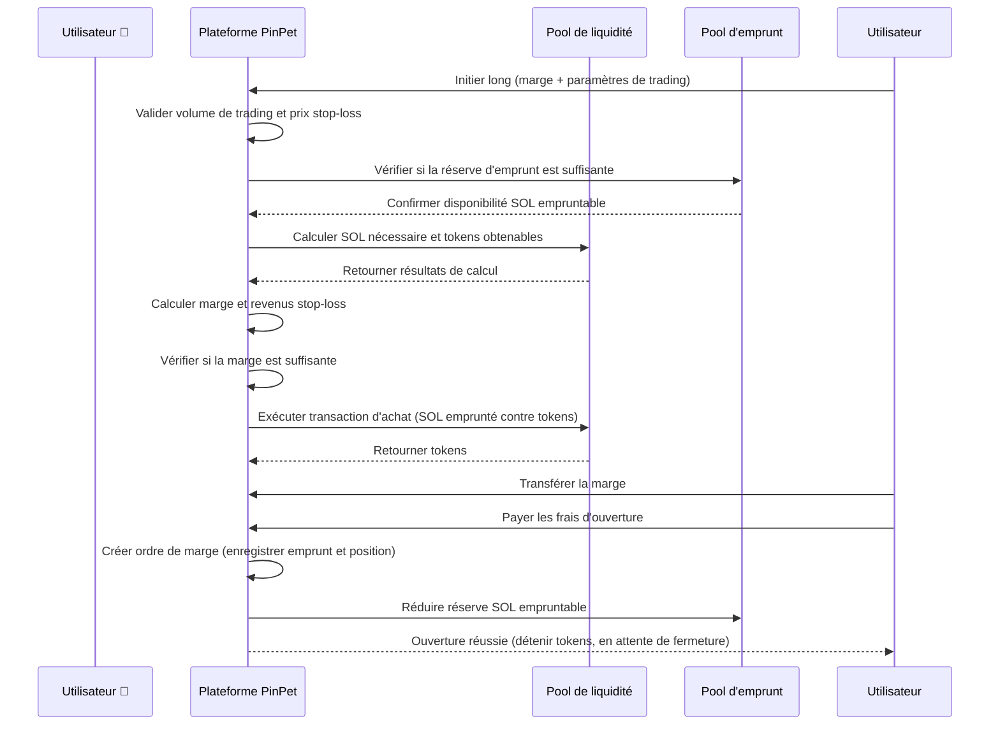
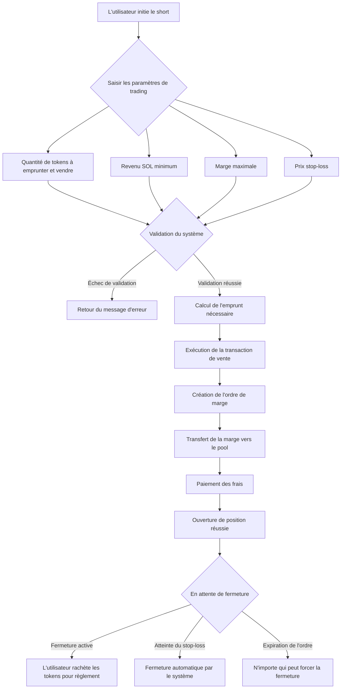
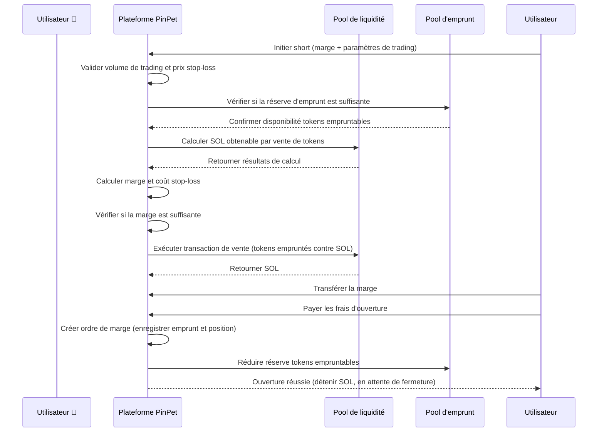
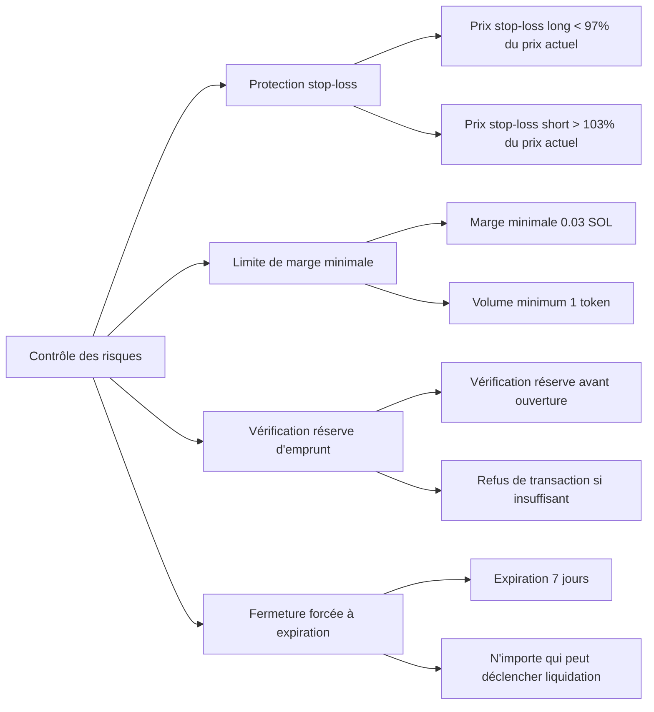

# 📊 Introduction au produit de Trading avec Levier PinPet

## 1. Présentation de la fonctionnalité 🎯

### Qu'est-ce que le trading avec levier 💹

Le trading avec levier est un instrument financier qui utilise des fonds empruntés pour amplifier l'échelle de trading, permettant aux utilisateurs de contrôler des actifs de plus grande valeur avec moins de marge. La plateforme PinPet propose deux types de trading avec levier : long (achat) et short (vente), permettant aux utilisateurs de réaliser des bénéfices que le prix du token augmente ou diminue.

### Concepts fondamentaux 💡

- **Marge (Margin)** 💰 : Fonds SOL investis par l'utilisateur, servant de garantie pour la transaction
- **Emprunt (Borrow)** 💵 : Actifs empruntés à la plateforme (SOL pour le long, tokens pour le short)
- **Prix stop-loss (Stop Loss Price)** 🛡️ : Lorsque le prix atteint ce niveau, le système ferme automatiquement la position pour contrôler le risque
- **Fermeture de position (Close Position)** 🔄 : Opération de remboursement de l'emprunt et de règlement des profits/pertes

### Types de levier 📈📉

| Type de trading | Prévision du marché | Actif emprunté | Actif détenu | Condition de profit |
|---------|---------|---------|---------|---------|
| Long (Long) 🟢 | Haussier ⬆️ | Emprunter SOL | Détenir tokens | Prix du token augmente |
| Short (Short) 🔴 | Baissier ⬇️ | Emprunter tokens | Détenir SOL | Prix du token diminue |

---

## 2. Trading Long (Long) 🟢📈

### Description de la fonctionnalité ✨

Le long signifie que l'utilisateur est optimiste quant à la hausse future du prix du token. Il emprunte du SOL à la plateforme pour acheter plus de tokens, puis les vend lorsque le prix augmente pour rembourser l'emprunt et réaliser un profit.

### Flux d'opérations utilisateur 🔄



### Diagramme de flux du trading Long 📋



### Description des paramètres clés 📝

| Nom du paramètre | Description | Valeur exemple | Contraintes |
|---------|------|--------|---------|
| buy_token_amount | Quantité de tokens à acheter | 1,000,000 (1 token) | Pas moins que le volume minimum (1 token) |
| max_sol_amount | Montant SOL maximum à payer | 100,000,000 (0.1 SOL) | Peut être moins (protection slippage) |
| margin_sol_max | Marge maximale que l'utilisateur souhaite investir | 50,000,000 (0.05 SOL) | Pas moins de 0.03 SOL |
| close_price | Prix stop-loss (prix de déclenchement de fermeture automatique) | 95% du prix actuel | Doit être inférieur à 97% du prix actuel |
| borrow_amount | Montant d'emprunt réel calculé par le système | 50,000,000 (0.05 SOL) | Ne dépasse pas la réserve du pool d'emprunt |
| position_asset_amount | Quantité de tokens en position | 1,000,000 (1 token) | Égale à la quantité de tokens achetés |

### Logique de calcul de la marge 🧮

La marge sert à garantir que l'utilisateur peut rembourser l'emprunt lors d'une fermeture stop-loss. La formule de calcul est la suivante :

```
Marge réelle = Coût total d'achat de tokens - Revenus lors de la fermeture stop-loss (après déduction des frais)
```

**Exemple explicatif :**

Supposons que le prix actuel du token soit 0.1 SOL/Token :

1. L'utilisateur veut acheter 1 token, nécessite environ 0.1 SOL
2. L'utilisateur investit une marge de 0.05 SOL, emprunte 0.05 SOL
3. Définit le prix stop-loss à 0.095 SOL/Token (95% du prix actuel)
4. Le système calcule : si vendu à 0.095, après déduction des frais, environ 0.0945 SOL sont obtenus
5. Calcul de la marge : 0.1 - 0.0945 = 0.0055 SOL (marge réelle nécessaire)
6. Les 0.05 SOL fournis par l'utilisateur sont supérieurs à 0.0055 SOL, la condition d'ouverture est satisfaite

### Avertissement sur les risques ⚠️

- **Déclenchement stop-loss** 🛑 : Lorsque le prix du token chute au prix stop-loss, le système vend automatiquement les tokens pour rembourser l'emprunt, l'utilisateur perdra la marge
- **Expiration de l'ordre** ⏰ : Si la position n'est pas fermée après la période d'emprunt (7 jours par défaut), n'importe qui peut forcer la fermeture, l'utilisateur doit fermer activement dès que possible
- **Coût d'emprunt** 💸 : L'ouverture et la fermeture nécessitent toutes deux le paiement de frais (0.25% par défaut)

---

## 3. Trading Short (Short) 🔴📉

### Description de la fonctionnalité ✨

Le short signifie que l'utilisateur est pessimiste quant à la baisse future du prix du token. Il emprunte des tokens à la plateforme pour les vendre immédiatement contre du SOL, puis rachète les tokens lorsque le prix baisse pour rembourser l'emprunt et réaliser un profit.

### Flux d'opérations utilisateur 🔄



### Diagramme de flux du trading Short 📋



### Description des paramètres clés 📝

| Nom du paramètre | Description | Valeur exemple | Contraintes |
|---------|------|--------|---------|
| borrow_sell_token_amount | Quantité de tokens à emprunter et vendre | 1,000,000 (1 token) | Pas moins que le volume minimum (1 token) |
| min_sol_output | SOL minimum attendu après la vente | 90,000,000 (0.09 SOL) | Peut être plus (protection slippage) |
| margin_sol_max | Marge maximale que l'utilisateur souhaite investir | 50,000,000 (0.05 SOL) | Pas moins de 0.03 SOL |
| close_price | Prix stop-loss (prix de déclenchement de fermeture automatique) | 105% du prix actuel | Doit être supérieur à 103% du prix actuel |
| borrow_amount | Montant d'emprunt réel calculé par le système | 1,000,000 (1 token) | Ne dépasse pas la réserve du pool d'emprunt |
| position_asset_amount | Quantité SOL en position | 95,000,000 (0.095 SOL) | Égale au SOL obtenu après vente (déduction des frais) |

### Logique de calcul de la marge 🧮

La marge du short sert à garantir que l'utilisateur peut racheter les tokens pour rembourser l'emprunt lors d'une fermeture stop-loss. La formule de calcul est la suivante :

```
Marge réelle = Coût de rachat lors de la fermeture stop-loss (frais inclus) - Revenus de la vente (déduction des frais)
```

**Exemple explicatif :**

Supposons que le prix actuel du token soit 0.1 SOL/Token :

1. L'utilisateur emprunte 1 token et le vend, obtenant environ 0.0975 SOL après déduction des frais
2. Définit le prix stop-loss à 0.105 SOL/Token (105% du prix actuel)
3. Le système calcule : si rachat à 0.105, frais inclus environ 0.1053 SOL nécessaires
4. Calcul de la marge : 0.1053 - 0.0975 = 0.0078 SOL (marge réelle nécessaire)
5. L'utilisateur doit investir au moins 0.0078 SOL comme marge
6. L'utilisateur fournit 0.05 SOL de marge, supérieur à 0.0078 SOL, la condition d'ouverture est satisfaite

### Avertissement sur les risques ⚠️

- **Déclenchement stop-loss** 🛑 : Lorsque le prix du token monte au prix stop-loss, le système rachète automatiquement les tokens pour rembourser l'emprunt, l'utilisateur perdra la marge
- **Risque illimité** ⛔ : En théorie, le prix du token peut augmenter indéfiniment, le risque du short est supérieur au long
- **Expiration de l'ordre** ⏰ : Si la position n'est pas fermée après la période d'emprunt (7 jours par défaut), n'importe qui peut forcer la fermeture
- **Coût d'emprunt** 💸 : L'ouverture et la fermeture nécessitent toutes deux le paiement de frais (0.25% par défaut)

---

## 4. Risques et bénéfices du trading avec levier 📊💰

### Effet d'amplification des bénéfices 📈💎

L'avantage principal du trading avec levier est de contrôler une échelle d'actifs plus importante avec moins de capital, amplifiant ainsi les bénéfices.

**Exemple de bénéfices Long :**

Supposons que l'utilisateur investisse 0.05 SOL de marge pour un long sur 1 token :

| Scénario | Prix d'ouverture | Prix de fermeture | Valeur position | Montant remboursement | Bénéfice net | Taux de rendement |
|------|--------|--------|----------|----------|--------|--------|
| Légère hausse | 0.1 | 0.11 | 0.11 SOL | 0.05 SOL | 0.06 SOL | +120% |
| Forte hausse | 0.1 | 0.15 | 0.15 SOL | 0.05 SOL | 0.10 SOL | +200% |
| Légère baisse | 0.1 | 0.095 | 0.095 SOL | 0.05 SOL | 0.045 SOL | -10% |
| Déclenchement stop-loss | 0.1 | 0.095 | 0.095 SOL | 0.05 SOL | 0.045 SOL | -10% |

**Exemple de bénéfices Short :**

Supposons que l'utilisateur investisse 0.05 SOL de marge pour un short sur 1 token :

| Scénario | Prix d'ouverture | Prix de fermeture | Valeur position | Coût rachat | Bénéfice net | Taux de rendement |
|------|--------|--------|----------|----------|--------|--------|
| Légère baisse | 0.1 | 0.09 | 0.0975 SOL | 0.09 SOL | 0.0075 SOL | +15% |
| Forte baisse | 0.1 | 0.05 | 0.0975 SOL | 0.05 SOL | 0.0475 SOL | +95% |
| Légère hausse | 0.1 | 0.105 | 0.0975 SOL | 0.105 SOL | -0.0075 SOL | -15% |
| Déclenchement stop-loss | 0.1 | 0.105 | 0.0975 SOL | 0.1053 SOL | -0.0078 SOL | -16% |

### Facteurs de risque ⚠️

#### 1. Risque de volatilité des prix 📉📈

- **Risque Long** 🟢 : Le prix du token chute au-delà du prix stop-loss, perte totale de la marge
- **Risque Short** 🔴 : Le prix du token monte au-delà du prix stop-loss, perte totale de la marge
- **Volatilité extrême** ⚡ : Des fluctuations importantes de prix à court terme peuvent entraîner un stop-loss rapide

#### 2. Risque de liquidité 💧

- **Épuisement du pool d'emprunt** 📛 : Si la réserve du pool d'emprunt est insuffisante, impossible d'ouvrir une position
- **Perte de slippage** 📊 : Un volume de trading trop important peut entraîner un prix d'exécution déviant des attentes

#### 3. Risque temporel ⏰

- **Expiration de l'ordre** 🔔 : Si la position n'est pas fermée après 7 jours, n'importe qui peut forcer la fermeture, possibilité d'être liquidé à un prix défavorable
- **Coût de détention** 💸 : Détention longue durée implique des coûts temporels et une incertitude du marché

#### 4. Risque système 🔧

- **Calcul de prix** 🧮 : Basé sur l'algorithme de produit constant, les grandes transactions peuvent faire face à un slippage important
- **Accumulation de frais** 💰 : Les frais d'ouvertures et fermetures multiples accumulés érodent les profits

### Mesures de contrôle des risques 🛡️

La plateforme PinPet fournit plusieurs mécanismes de contrôle des risques :



---

## 5. Exemples de scénarios d'utilisation 💼

### Scénario 1 : Long sur tendance haussière 🟢⬆️

**Contexte** 📖 : Xiao Ming voit qu'un token Meme a une tendance haussière, prix actuel 0.1 SOL

**Étapes d'opération** 🎯 :
1. Xiao Ming investit 0.1 SOL de marge
2. Emprunte 0.1 SOL (prêté par la plateforme)
3. Achète 2 tokens avec un total de 0.2 SOL
4. Définit le prix stop-loss à 0.095 SOL (stop-loss automatique si descend en dessous)

**Situation de profit** 💰📈 : Le token monte à 0.15 SOL
- Vend 2 tokens pour obtenir 0.3 SOL (environ 0.2985 SOL après déduction des frais)
- Rembourse l'emprunt de 0.1 SOL, reste 0.1985 SOL
- Déduction de la marge de 0.1 SOL, profit net 0.0985 SOL (environ +98.5%)

**Situation stop-loss** 🛑📉 : Le token descend à 0.095 SOL (déclenchement stop-loss)
- Vend automatiquement 2 tokens pour obtenir 0.19 SOL (environ 0.1895 SOL après déduction des frais)
- Rembourse l'emprunt de 0.1 SOL, reste 0.0895 SOL
- Perte de marge 0.1 - 0.0895 = 0.0105 SOL (environ -10.5%)

### Scénario 2 : Short sur tendance baissière 🔴⬇️

**Contexte** 📖 : Xiao Hong pense que le prix d'un certain token est surévalué, prix actuel 0.2 SOL, se prépare à shorter

**Étapes d'opération** 🎯 :
1. Xiao Hong investit 0.15 SOL de marge
2. Emprunte 1 token (prêté par la plateforme)
3. Vend immédiatement 1 token pour obtenir 0.2 SOL (environ 0.195 SOL après déduction des frais)
4. Définit le prix stop-loss à 0.21 SOL (stop-loss automatique si monte au-dessus)

**Situation de profit** 💰📉 : Le token descend à 0.15 SOL
- Rachète 1 token avec 0.15 SOL (environ 0.1504 SOL frais inclus)
- Rembourse l'emprunt de 1 token
- Reste 0.195 - 0.1504 = 0.0446 SOL
- Plus la marge de 0.15 SOL, total 0.1946 SOL (profit net 0.0446 SOL, environ +29.7%)

**Situation stop-loss** 🛑📈 : Le token monte à 0.21 SOL (déclenchement stop-loss)
- Rachète automatiquement 1 token avec 0.21 SOL (environ 0.2105 SOL frais inclus)
- Rembourse l'emprunt de 1 token
- Dépense 0.2105 SOL, mais n'a obtenu que 0.195 SOL lors de la vente
- Perte de 0.0155 SOL, déduction de la marge (environ -10.3%)

### Scénario 3 : Opération de swing trading 🔄📊

**Contexte** 📖 : Xiao Gang excelle dans le trading court terme, opérant de manière répétée dans la fourchette de prix 0.08 - 0.12 SOL

**Stratégie** 🎯 :
- Long lorsque le prix approche 0.08 SOL, stop-loss à 0.075 SOL
- Short lorsque le prix approche 0.12 SOL, stop-loss à 0.125 SOL
- Fermeture active après profit de 5-10% à chaque fois

**Avantages** ✅ : Utilise le levier pour amplifier les bénéfices de la volatilité dans la fourchette

**Risques** ⚠️ : Risque de stop-loss en cas de rupture de fourchette, nécessite une discipline stricte

---

## 6. Précautions et limitations 📌

### Restrictions de trading 🔒

| Élément de restriction | Valeur | Explication |
|---------|------|------|
| Volume minimum de tokens | 1 Token (1,000,000 unités minimales) | Éviter un volume de trading trop petit |
| Marge minimale | 0.03 SOL (30,000,000 lamports) | Garantir une échelle de trading significative |
| Prix stop-loss long | En dessous de 97% du prix actuel | Au moins 3% d'espace stop-loss |
| Prix stop-loss short | Au-dessus de 103% du prix actuel | Au moins 3% d'espace stop-loss |
| Période d'emprunt maximale | 7 jours (604,800 secondes) | Possibilité de fermeture forcée après expiration |
| Limite du pool d'emprunt | Ajustement dynamique selon l'échelle du pool de liquidité | Refus de transaction si réserve insuffisante |

### Explication des frais 💸

**Types de frais** 📊 :
- Frais d'ouverture : 0.25% par défaut (borrow_fee)
- Frais de fermeture : 0.25% par défaut (borrow_fee)
- Répartition des frais : Partenaires et fournisseurs techniques partagent selon les proportions

**Calcul des frais** 🧮 :
- Ouverture long : Frais prélevés sur le montant SOL d'achat
- Ouverture short : Frais prélevés sur le montant SOL de vente
- Fermeture : Frais prélevés sur le montant de la transaction

### Recommandations de meilleures pratiques 💡

#### 1. Définir le stop-loss de manière raisonnable 🛡️

- **Ne pas être trop avide** : Le prix stop-loss ne doit pas être trop proche (approchant la limite de 3%)
- **Laisser un espace tampon** : Considérer les fluctuations à court terme, un espace stop-loss de 5-10% est plus sûr
- **Prendre des bénéfices en temps opportun** : Fermeture active après avoir atteint les bénéfices attendus, ne pas attendre la fermeture forcée

#### 2. Contrôler la taille de la position 📊

- **Diversifier les investissements** 🎯 : Ne pas investir tous les fonds dans un seul ordre
- **Construction progressive** ➡️ : Possibilité d'ouvrir plusieurs petites positions, réduisant le risque unitaire
- **Réserver des fonds** 💰 : Conserver une partie des fonds pour faire face aux besoins de marge supplémentaire (fonctionnalité future)

#### 3. Choisir le bon moment ⏰

- **Liquidité suffisante** 💧 : Ouvrir position lorsque la réserve du pool d'emprunt est suffisante
- **Éviter la volatilité extrême** ⚡ : Les fluctuations importantes de prix déclenchent facilement le stop-loss
- **Attention au délai d'expiration** 🔔 : La période de détention prévue ne doit pas approcher la limite de 7 jours

#### 4. Surveiller l'état de l'ordre 👀

- **Vérification régulière** 🔍 : Vérifier l'état de l'ordre au moins une fois par jour
- **Alerte de prix** 🚨 : Décision rapide lorsque le prix approche du stop-loss
- **Fermeture active** ✅ : Ne pas attendre le stop-loss automatique du système, la fermeture active peut éviter le slippage

### Questions fréquentes ❓

**Q1 : La marge sera-t-elle remboursée ?**

R : Oui. Lors de la fermeture active, si profit, la marge plus le profit sont remboursés ensemble ; si déclenchement stop-loss, la marge restante est remboursée (peut être zéro).

**Q2 : Peut-on fermer la position en avance ?**

R : Oui. Avant l'expiration de l'ordre, l'utilisateur peut fermer activement à tout moment, sans pénalité supplémentaire.

**Q3 : Que se passe-t-il après l'expiration de l'ordre ?**

R : Après expiration de l'ordre, n'importe qui peut déclencher une fermeture forcée. Il est recommandé de fermer activement avant expiration pour éviter d'être liquidé à un prix défavorable.

**Q4 : Que faire si la réserve du pool d'emprunt est insuffisante ?**

R : Si la réserve du pool d'emprunt est insuffisante, le système refusera l'ouverture. Il est recommandé d'attendre que d'autres utilisateurs ferment leurs positions pour libérer la réserve, ou de choisir une autre paire de trading.

**Q5 : Comment sont calculés les frais ?**

R : Les frais sont prélevés selon un certain pourcentage du montant de la transaction (0.25% par défaut). L'ouverture et la fermeture sont chacune facturées une fois, total environ 0.5% de coût.

**Q6 : Peut-on ajuster le prix stop-loss ?**

R : La version actuelle ne supporte pas l'ajustement du prix stop-loss. Il est recommandé de définir soigneusement le prix stop-loss lors de l'ouverture.

---

## 7. Conclusion 📝

La fonctionnalité de trading avec levier PinPet offre aux utilisateurs des outils flexibles de long et short, permettant de réaliser des profits que le token monte ou descende. En utilisant raisonnablement la marge et les mécanismes stop-loss, les utilisateurs peuvent amplifier les bénéfices tout en contrôlant les risques.

**Avantages principaux** ✨ :
- **Trading bidirectionnel** 🔄 : Profit possible en long et short
- **Amplification par levier** 📈 : Petit capital pour grands bénéfices
- **Stop-loss automatique** 🛡️ : Mécanisme de protection des prix pour réduire les risques
- **Fermeture flexible** ✅ : Règlement actif à tout moment

**Avertissement sur les risques** ⚠️ :
- ⛔ Le trading avec levier comporte des risques élevés, perte totale possible de la marge
- 📚 Veuillez comprendre pleinement le mécanisme de trading avant d'opérer
- 💡 Il est recommandé de commencer avec de petits montants, accumuler progressivement de l'expérience
- 🚫 N'investissez jamais plus que ce que vous pouvez vous permettre de perdre

Nous vous souhaitons un trading réussi ! 🎉
