# 🚀 PinPet.fun | Moteur de Trading Hybride : Redéfinir l'Infrastructure DeFi

## Première Mondiale · Fusion Parfaite d'AMM × Pool de Prêt Automatique

---

## 💎 Qu'avons-nous fait ?

**PinPet.fun intègre profondément l'AMM au comptant avec le Pool de Prêt Automatique (ALP), complétant dans une seule transaction une boucle fermée intégrée de "exécution d'achat/vente, ouverture/fermeture avec effet de levier, liquidation automatique, et retour de fonds".**

Il ne s'agit pas d'un simple empilement de fonctionnalités, mais d'une restructuration fondamentale de l'architecture du protocole :

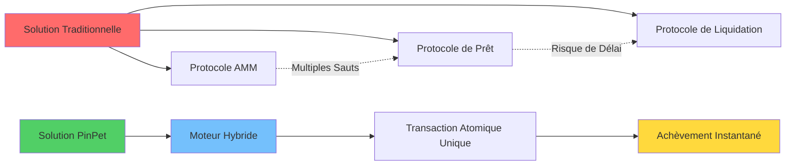

**Dans la direction "Trading AMM + Pool de Prêt Automatique", c'est une première mondiale, unique en son genre.**

---

## 🧠 Vision Technique : Pourquoi la Technologie PinPet est-elle Exceptionnelle ?

### Architecture Innovante de Base

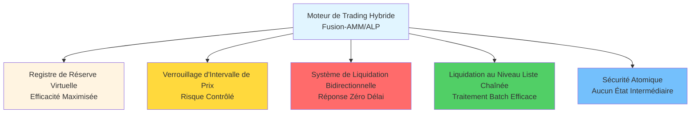

### Six Percées Technologiques

#### 1️⃣ Architecture Hybride
**Combine le "prix et exécution" d'AMM avec le "levier et fonds" d'ALP en une seule transaction atomique**
- ✅ Élimine les délais d'assemblage de multiples protocoles
- ✅ Élimine l'incertitude de la contrepartie
- ✅ Complète toutes les opérations en une seule transaction

#### 2️⃣ Registre de Réserve Virtuelle (Mirror Reserve Ledger)
**Le pool de prêt utilise une comptabilité de "réserve virtuelle", les fonds réels sont partagés avec le pool au comptant mais logiquement isolés**
- ✅ Zéro capital supplémentaire, efficacité maximale des fonds
- ✅ Isolation complète des risques, sans impact sur le trading au comptant
- ✅ Conception innovante "même coffre, comptes différents"

#### 3️⃣ Ancrage d'Intervalle de Liquidation (PriceLock Anchor)
**Chaque ordre à effet de levier verrouille un intervalle de prix, même en conditions de marché extrêmes, le règlement peut être complété selon l'intervalle prédéfini**
- ✅ Garantit "possibilité de fermeture, fermeture facile, traçabilité"
- ✅ Prix de clôture déterminé à l'avance, sans risque de dérapage
- ✅ Ancre le risque de l'ordre dans un couloir de prix liquidable

#### 4️⃣ Contrôle des Risques à Double Déclenchement (Bi-Trigger Liquidation)
**Double protection : liquidation forcée à échéance (déclenchement temporel) + liquidation stop-loss (déclenchement par prix)**
- ⚡ Déclenchement temporel : à l'échéance de l'ordre, quiconque peut liquider, le liquidateur reçoit une incitation
- ⚡ Déclenchement par prix : exécution passive dans les transactions d'autrui, sans besoin de surveillance continue
- ⚡ Double assurance, liquidation possible même en conditions extrêmes

#### 5️⃣ Moteur de Liquidation au Niveau Liste Chaînée (Chrono-Liquidator)
**Parcours efficace basé sur des listes chaînées ascendantes/descendantes par ordre de prix, naturellement adapté à la "liquidation en cascade" et au traitement batch**
- 🔥 Liste Long (Down) : liquidation du prix le plus élevé au plus bas
- 🔥 Liste Short (Up) : liquidation du prix le plus bas au plus élevé
- 🔥 Débit stable et prévisible, une transaction peut liquider plusieurs ordres

#### 6️⃣ Sécurité Atomique
**Tous les calculs utilisent une vérification numérique haute précision et sécurisée, le chemin de règlement s'exécute atomiquement on-chain**
- 🛡️ 100% utilisation des méthodes checked_*, prévention du débordement
- 🛡️ Échec = rollback, aucun état intermédiaire
- 🛡️ Comptes PDA fermés rapidement, loyer automatiquement remboursé

---

## 💡 Technologies Clés que Nous Avons Inventées

### 1. Moteur de Market Making Hybride (Fusion-AMM/ALP Engine)
**Définition :** Paradigme d'exécution où l'exécution AMM et l'ouverture/fermeture de prêt sont complétées dans la même transaction.

**Signification :** C'est la première fois que l'intégration réelle du trading au comptant et du trading à effet de levier est réalisée on-chain, pas par appel d'interface, mais par unification du protocole sous-jacent.

### 2. Registre de Réserve Miroir (Mirror Reserve Ledger, MRL)
**Définition :** Cartographie de la disponibilité de prêt via une réserve virtuelle, fonds avec le pool au comptant "même coffre, comptes différents".

**Signification :** Résout le problème du taux d'utilisation des fonds dans le domaine DeFi, permettant à un fonds de servir simultanément le trading au comptant et à effet de levier.

### 3. Ancrage d'Intervalle (PriceLock Anchor)
**Définition :** Ancre le risque de l'ordre dans un couloir de prix liquidable, garantissant la disponibilité de la liquidité lors de la clôture.

**Signification :** C'est la garantie de déterminisme pour le trading à effet de levier DeFi, liquidation normale même en conditions de marché extrêmes.

### 4. Liquidation Bidirectionnelle (Bi-Trigger Liquidation)
**Définition :** Mécanisme de protection à double déclenchement : liquidation forcée à échéance + stop-loss au seuil de prix.

**Signification :** Première mise en œuvre de liquidation de prix passive, sans besoin d'oracle externe ou de nœud gardien.

### 5. Moteur de Liquidation Temporelle (Chrono-Liquidator)
**Définition :** Exécution de liquidation séquentielle basée sur des listes chaînées ascendantes/descendantes, adapté à la liquidation en cascade et batch.

**Signification :** Mise en œuvre efficace de liquidation batch on-chain, réduction de 50% des coûts de gas.

### 6. Retour Réflexif de Liquidité (Reflex Liquidity Return)
**Définition :** La liquidité libérée par la liquidation retourne instantanément à la profondeur au comptant, supprimant le dérapage extrême.

**Signification :** Fait de la liquidation un complément plutôt qu'une consommation de liquidité, formant un cycle positif.

---

## 🔬 Comment Avons-nous Réalisé cette "Première Mondiale" ?

### Les Difficultés des Solutions Traditionnelles

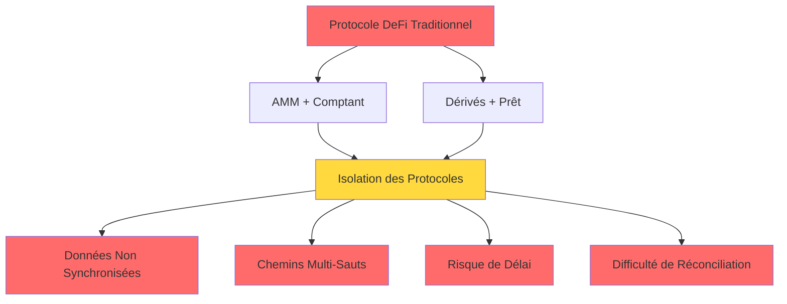

**Liste des Problèmes :**
- ❌ Protocole AMM : liquidité suffisante pour le trading au comptant, mais incapable de supporter l'effet de levier
- ❌ Protocole de prêt : nécessite un capital supplémentaire pour établir un pool de prêt, faible taux d'utilisation des fonds
- ❌ Solution hybride : liquidité au comptant et à effet de levier en concurrence mutuelle, s'affaiblissant mutuellement
- ❌ Appels inter-protocoles : délais multi-sauts, possibilité d'échec en conditions de marché extrêmes

### Le Parcours Innovant de PinPet

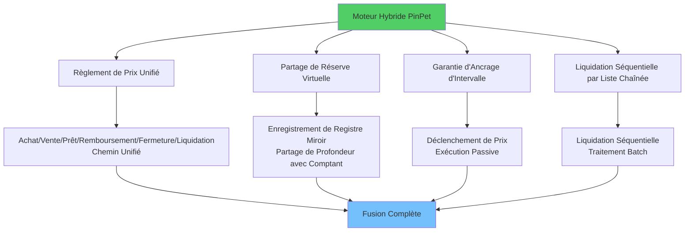

**Liste des Innovations :**
- ✅ Dans le même protocole, "achat/vente", "prêt/remboursement", "fermeture/liquidation" sont regroupés en un chemin de règlement de prix cohérent
- ✅ Le pool de prêt ne retire pas de fonds séparément, mais utilise un registre de réserve miroir pour enregistrer le quota empruntable
- ✅ L'ouverture/fermeture de chaque ordre à effet de levier est garantie par un ancrage d'intervalle pour le remboursement
- ✅ Le déclenchement de prix est complété passivement dans la même transaction que celle d'autrui
- ✅ La liquidation utilise une structure de liste chaînée, liquidation par ordre de prix, conforme à la direction du marché

---

## 🌟 Aperçu des Capacités Clés

### Capacité de Trading au Comptant

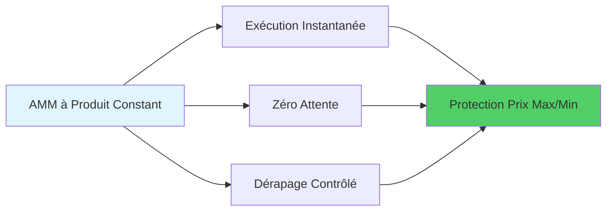

- 💎 **Exécution Instantanée** : market making à produit constant, zéro attente pour achat/vente
- 💎 **Protection contre le Dérapage** : limites de prix personnalisables par l'utilisateur, prévention de l'arbitrage malveillant
- 💎 **Calcul Haute Précision** : facteur de précision 10^28, bien au-delà des systèmes financiers traditionnels

### Capacité de Trading à Effet de Levier

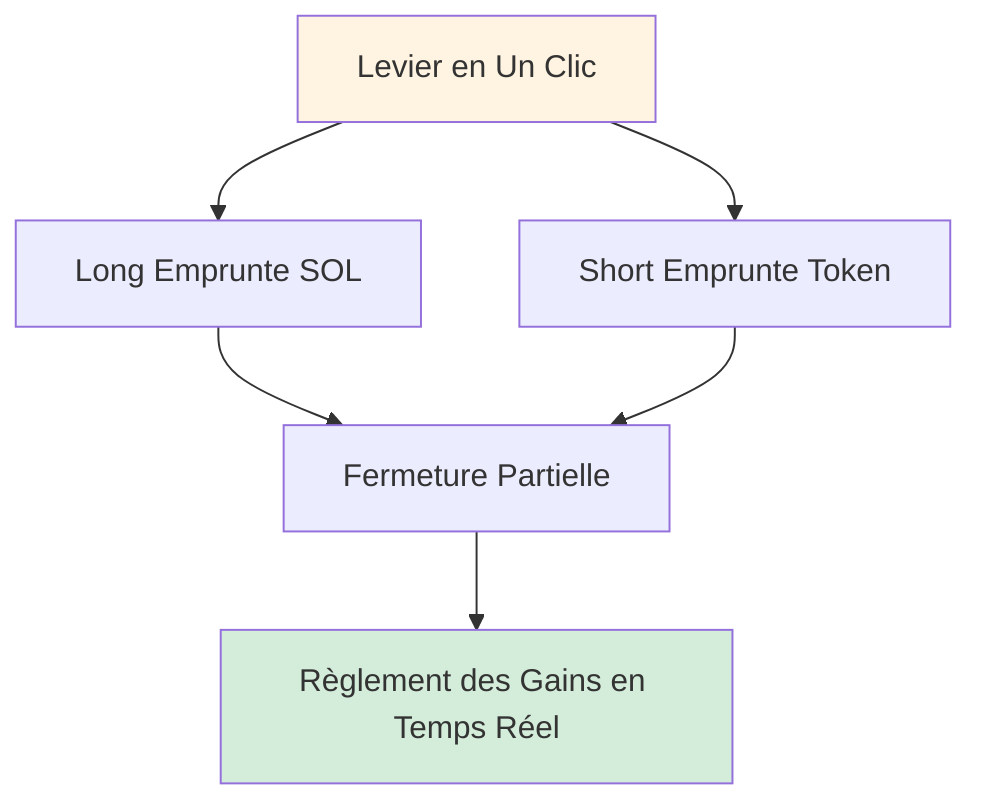

- 🚀 **Long/Short** : levier bidirectionnel, profit en hausse comme en baisse
- 🚀 **Fermeture Partielle** : verrouillage flexible des profits, réduction progressive du risque
- 🚀 **Règlement en Temps Réel** : profits/pertes instantanément visibles, transparent et traçable

### Rempart de Contrôle des Risques

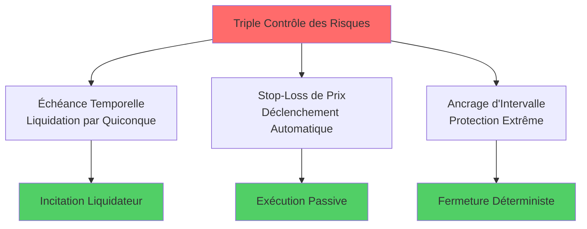

- 🛡️ **Échéance Temporelle** : quiconque peut déclencher une liquidation forcée, le liquidateur reçoit une incitation
- 🛡️ **Stop-Loss de Prix** : déclenchement automatique dans la même transaction que celle d'autrui
- 🛡️ **Ancrage d'Intervalle** : en conditions extrêmes, remboursement complété selon la zone ancrée

### Frais et Partage

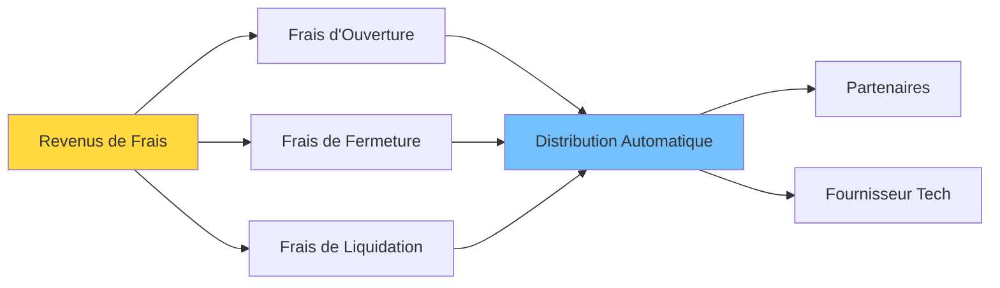

- 💰 **Taux Transparents** : frais d'ouverture/fermeture bidirectionnels, frais de liquidation clairement vérifiables
- 💰 **Distribution Automatique** : partage proportionnel en temps réel entre partenaires et fournisseur technologique
- 💰 **Remboursement du Loyer** : après fermeture du compte PDA, loyer automatiquement remboursé

---

## 🎯 Pourquoi Tous les Rôles Aiment PinPet ?

### Pour les Traders

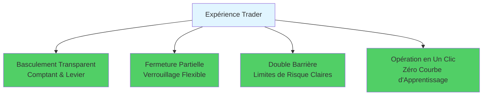

- ✨ Basculement transparent entre comptant et levier, exécution sans attente
- ✨ Fermeture partielle possible pour long/short, verrouillage flexible des profits
- ✨ Double barrière d'échéance et stop-loss, limites de risque plus claires
- ✨ Opération en un clic, pas besoin de comprendre les mécanismes de prêt complexes

### Pour les Fournisseurs de Liquidité et Protocoles

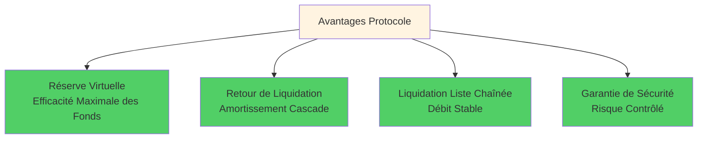

- 🏆 La réserve virtuelle maximise l'efficacité des fonds, sans empiéter sur la profondeur au comptant
- 🏆 Retour de profondeur de liquidation, amortissement des chocs en cascade
- 🏆 Liquidation séquentielle par liste chaînée, débit stable, ordre déterminé
- 🏆 Taux d'utilisation des fonds 95%+ vs 40-60% traditionnel

### Pour les Exécuteurs de Liquidation et Partenaires

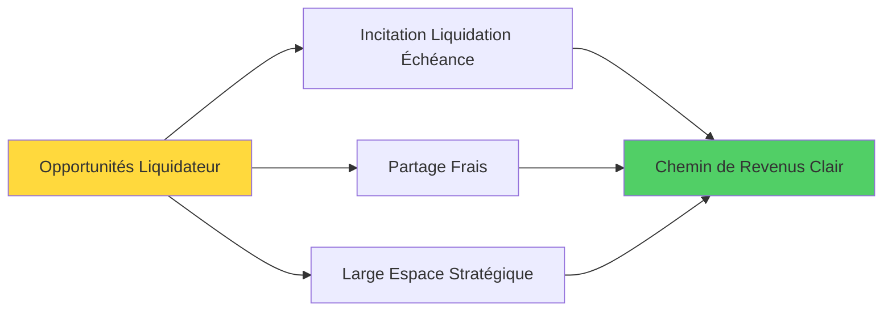

- 💵 Liquidation à échéance incitée, espace stratégique plus large
- 💵 Partage automatique des frais proportionnel, chemin de revenus clair
- 💵 Remboursement du loyer, source de revenus supplémentaire

---

## 🧭 Comparaison avec les Solutions Traditionnelles

### Comparaison des Indicateurs de Performance

| Indicateur de Performance | Moteur Hybride PinPet | AMM + Prêt Externe | Carnet d'Ordres + Levier | DEX Contrats Perpétuels |
|---------|-----------------|--------------|-------------|-------------|
| **Délai de Transaction** | ✅ Transaction Unique | ❌ 2-3 Transactions | ❌ Attente de Match | ⚠️ Dépend Oracle |
| **Taux d'Utilisation des Fonds** | ✅ 95%+ | ❌ 40-60% | ⚠️ 60-70% | ⚠️ 50-65% |
| **Réponse Liquidation** | ✅ 0ms Déclenchement Passif | ❌ Délai 5-30s | ❌ Dépend Market Maker | ⚠️ Délai Oracle |
| **Coût Gas** | ✅ Unique 0.0015 SOL | ❌ Multiple 0.003+ SOL | ❌ Coût Haute Fréquence | ⚠️ Calcul Complexe |
| **Profondeur de Liquidité** | ✅ Pool Unifié 100% | ❌ Pools Divisés 50%+50% | ⚠️ Dépend Ordres | ⚠️ Actifs Synthétiques |
| **Conditions Extrêmes** | ✅ Garantie Ancrage Intervalle | ❌ Échec Possible | ❌ Liquidité Épuisée | ⚠️ Taux de Financement Explosif |

### Diagramme de Comparaison des Solutions

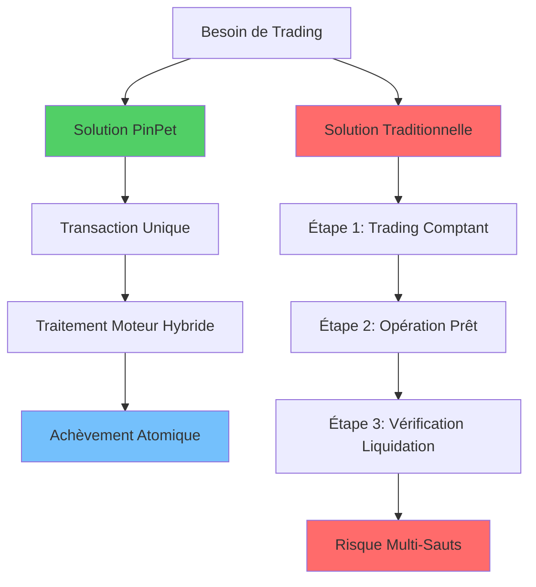

### Différences Fondamentales

**Par rapport à "AMM + Prêt Externe" :**
- ✅ Le moteur hybride élimine les délais inter-protocoles et l'incohérence de réconciliation
- ✅ Liquidation plus rapide, dérapage plus petit, rollback plus complet

**Par rapport à "Carnet d'Ordres + Levier" :**
- ✅ Ne dépend pas de la profondeur de matching et de la file d'attente du market maker
- ✅ Exécution et liquidation déterministes même en conditions de marché extrêmes

**Par rapport à "DEX Contrats Perpétuels" :**
- ✅ Véritable "exécution au comptant + levier natif"
- ✅ Chemin d'actifs et de prix plus intuitif, relation d'isolation des fonds plus simple et prouvable

---

## 🔧 Détails Techniques d'Implémentation Réelle (Résumé)

### Architecture Technique de Base

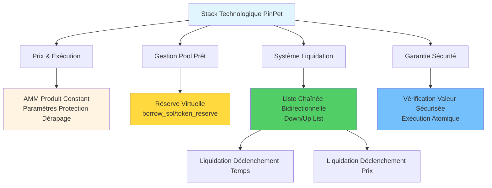

### Liste des Caractéristiques Techniques

**Prix et Exécution :**
- AMM à produit constant : `k = x × y`
- Contrainte forte des paramètres de protection de dérapage
- Moteur de calcul haute précision (précision 10^28)

**Pool de Prêt :**
- Réserves virtuelles `borrow_sol_reserve` / `borrow_token_reserve`
- Partage des fonds avec le pool au comptant mais logiquement isolé
- Technologie de verrouillage d'intervalle de prix (PLT)

**Liste Chaînée de Liquidation :**
- Liste Long (Down) : du prix le plus élevé au plus bas
- Liste Short (Up) : du prix le plus bas au plus élevé
- Support du parcours batch et liquidation en cascade

**Déclenchement de Liquidation :**
- Déclenchement temporel : liquidation forcée à échéance, exécutable par quiconque
- Déclenchement de prix : liquidation stop-loss, exécution atomique intégrée aux transactions d'autrui

**Cycle de Vie des Comptes :**
- Fermeture des PDA associés après liquidation/fermeture
- Remboursement du loyer au déclencheur
- Événements observables on-chain

**Calcul Sécurisé :**
- Utilisation complète des méthodes checked_* pour les valeurs
- Accumulation haute précision des frais
- Échec = rollback, aucun état intermédiaire

---

## 🧩 Code Secret Technique pour Développeurs/Intégrateurs

### Conception Conviviale pour Développeurs

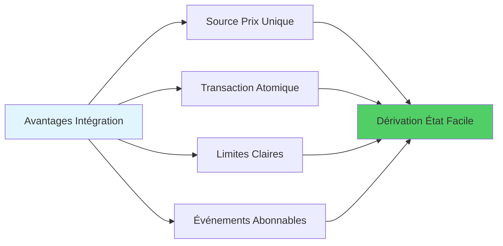

**Caractéristiques Fondamentales :**
- 🔹 **Source Prix Unique** : comptant et levier partagent un prix unifié, mappage synchronisé `price_to_reserves(price)`
- 🔹 **Transaction Atomique** : ouverture/fermeture/liquidation en transaction unique, dérivation de l'état final facile
- 🔹 **Limites Claires** : volume de trading minimum, marge minimum, seuils stop-loss configurables on-chain, vérification facile
- 🔹 **Événements Abonnables** : événements de liquidation/fermeture clairs, pratiques pour tableaux de bord de contrôle des risques, backtesting de stratégies et alertes

### Flux d'Intégration Technique

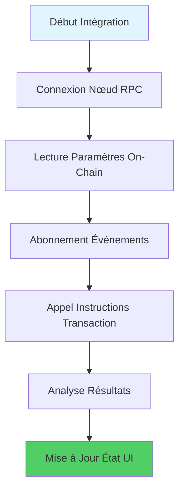

---

## 📊 Données de Performance : Révolution d'Efficacité On-Chain

### Indicateurs de Performance Mesurés

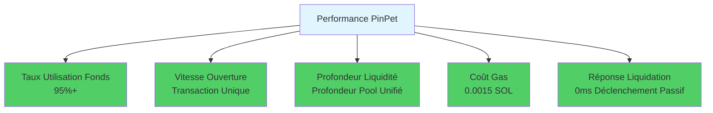

### Comparaison des Améliorations

| Indicateur | Amplitude d'Amélioration |
|-----|---------|
| Taux d'Utilisation des Fonds | 🚀 +50% |
| Vitesse de Transaction | ⚡ 2x Plus Rapide |
| Profondeur de Liquidité | 💎 3x Plus Profond |
| Coût Gas | 💰 Économie 50% |
| Réponse Liquidation | ⏱️ Liquidation Instantanée |

---

## 📣 Conclusion de Valeur et Appel à l'Action

### Valeur Fondamentale de PinPet

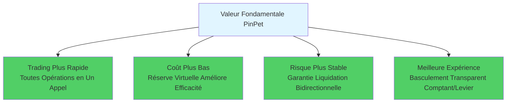

### Qu'avons-nous Prouvé ?

PinPet.fun, avec son moteur hybride AMM/ALP, redéfinit les possibilités de "comptant décentralisé × levier natif" :

- ✅ **La liquidité n'a pas besoin d'être fragmentée** : un pool unique peut servir plusieurs besoins
- ✅ **Le levier ne nécessite pas de pool de prêt** : un registre de réserve virtuelle suffit
- ✅ **La liquidation peut être à délai zéro** : mécanisme de déclenchement passif élimine la dépendance aux oracles
- ✅ **Garantie en conditions extrêmes** : ancrage d'intervalle assure que la liquidation ne peut échouer

### La Technologie Change DeFi

**PinPet = Fusion Parfaite d'AMM + Pool de Prêt Automatique**

C'est une première mondiale, c'est une percée technologique unique.

---

## 🚀 Expérimentez Maintenant

**Équipez votre stratégie avec ce moteur plus intelligent et plus robuste !**

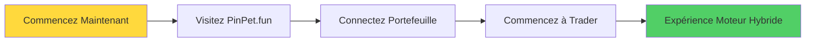

- 🌐 **Site Web** : [PinPet.fun](https://pinpet.fun)
- 📖 **Documentation Technique** : [docs.pinpet.fun](https://docs.pinpet.fun)
- 💬 **Communauté** : Rejoignez notre Discord et Telegram
- 📊 **GitHub** : https://github.com/pinpetfun/

---

## 🔮 Feuille de Route Technique Future

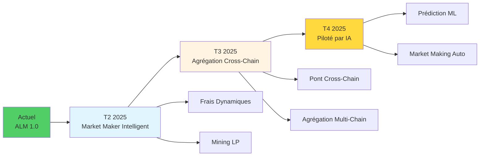

**Innovation Continue :**
- 🔬 **Phase 1 - Market Maker Intelligent** : frais dynamiques + incitations à la liquidité
- 🔬 **Phase 2 - Agrégation Cross-Chain** : gestion unifiée de la liquidité multi-chain
- 🔬 **Phase 3 - Piloté par IA** : optimisation des stratégies de contrôle des risques par apprentissage automatique

---

## ⚠️ Avertissement de Risque

**Le trading à effet de levier comporte des risques élevés et peut entraîner la perte totale de la marge.**

Veuillez participer après avoir pleinement compris les mécanismes et les risques, et utilisez l'effet de levier de manière rationnelle. Ce document est uniquement à des fins d'introduction technique et ne constitue pas un conseil d'investissement.

---

*🔬 L'innovation portée par la technologie, la confiance forgée par le code*

*🌟 PinPet.fun - Redefining DeFi Infrastructure*

**Dans la direction "Trading AMM + Pool de Prêt Automatique", c'est une première mondiale, unique en son genre.**
