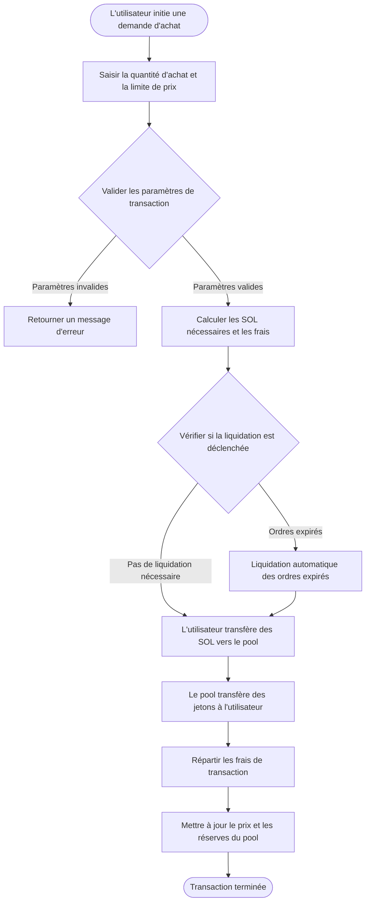
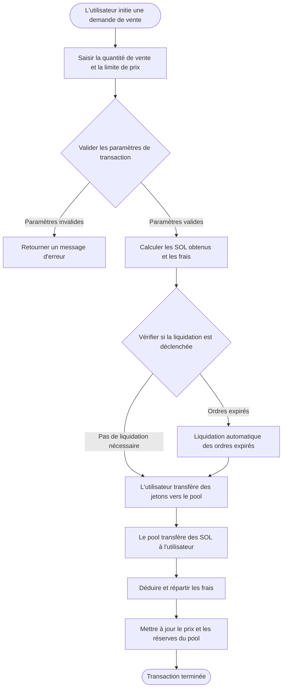

# 💱 Introduction aux fonctionnalités de trading au comptant de PinPet

## 📊 Vue d'ensemble des fonctionnalités

Le trading au comptant est l'une des fonctionnalités principales de la plateforme PinPet, permettant aux utilisateurs d'acheter et de vendre des jetons directement dans des pools de liquidité décentralisés. Contrairement au modèle traditionnel de carnet d'ordres, PinPet utilise un mécanisme de teneur de marché automatisé (AMM) basé sur l'algorithme du produit constant (x × y = k) pour déterminer automatiquement les prix de trading.

**✨ Caractéristiques principales :**
- **⚡ Exécution instantanée** : Pas besoin d'attendre le matching entre acheteurs et vendeurs, les transactions sont complétées immédiatement
- **🔍 Prix transparents** : Les prix sont calculés automatiquement par l'algorithme, de manière ouverte et transparente
- **🌊 Liquidité continue** : Tant qu'il y a suffisamment d'actifs dans le pool, le trading est possible à tout moment
- **🛡️ Protection contre le slippage** : Les utilisateurs peuvent définir des limites de prix maximales/minimales pour se protéger contre les fluctuations de prix anormales

---

## 🛒 Processus de transaction d'achat (Buy)

### 👤 Étapes pour l'utilisateur

La transaction d'achat permet aux utilisateurs d'acheter des jetons de projet en utilisant des SOL (jeton natif de Solana).

### 🔑 Explication des paramètres clés

| Nom du paramètre | Description | Valeur exemple | Remarques |
|------------------|-------------|----------------|-----------|
| buy_token_amount | Quantité de jetons à acheter | 1000000 (1 jeton) | Valeur minimale : 1000000 (1 jeton) |
| max_sol_amount | Montant maximal de SOL à payer | 50000000 (0.05 SOL) | Utilisé pour éviter un slippage de prix excessif |
| lp_pairs | Instantané de l'état du pool de liquidité | [{sol: 30, token: 1000000}] | Fourni automatiquement par le frontend |

### ⚙️ Logique d'exécution de la transaction

1. **Validation des paramètres**
   - Vérifier si la quantité d'achat atteint le volume de transaction minimal (1 jeton)
   - Vérifier si l'état du pool de liquidité est cohérent avec celui on-chain

2. **Calcul du prix**
   - Basé sur les réserves actuelles du pool, utiliser la formule du produit constant pour calculer les SOL nécessaires
   - Calculer le montant de paiement réel incluant les frais
   - Vérifier si le prix d'exécution réel dépasse la valeur maximale définie par l'utilisateur

3. **Mécanisme de liquidation automatique**
   - Si la transaction entraîne un franchissement du prix de liquidation de certains ordres à effet de levier, le système liquide automatiquement ces ordres
   - Les frais générés par la liquidation sont répartis entre la plateforme et les partenaires

4. **Transfert de fonds**
   - Compte utilisateur → Pool de liquidité : Transfert de SOL (frais inclus)
   - Pool de liquidité → Compte utilisateur : Transfert de jetons

5. **Répartition des frais**
   - Répartition selon des proportions prédéfinies aux partenaires et fournisseurs de technologie
   - Le taux de frais par défaut peut être configuré par l'administrateur

6. **Mise à jour de l'état**
   - Mettre à jour le prix actuel du pool de liquidité
   - Recalculer les réserves de SOL et de jetons du pool
   - Vérifier si une réduction de frais est déclenchée

---

## 💸 Processus de transaction de vente (Sell)

### 👤 Étapes pour l'utilisateur

La transaction de vente permet aux utilisateurs de vendre leurs jetons détenus en échange de SOL.

### 🔑 Explication des paramètres clés

| Nom du paramètre | Description | Valeur exemple | Remarques |
|------------------|-------------|----------------|-----------|
| sell_token_amount | Quantité de jetons à vendre | 1000000 (1 jeton) | Valeur minimale : 1000000 (1 jeton) |
| min_sol_output | Montant minimal de SOL attendu | 20000000 (0.02 SOL) | Utilisé pour éviter un slippage de prix excessif |
| lp_pairs | Instantané de l'état du pool de liquidité | [{sol: 30, token: 1000000}] | Fourni automatiquement par le frontend |

### ⚙️ Logique d'exécution de la transaction

1. **Validation des paramètres**
   - Vérifier si la quantité de vente atteint le volume de transaction minimal (1 jeton)
   - Vérifier si le solde du compte de jetons de l'utilisateur est suffisant
   - Confirmer la validité de l'état du pool de liquidité

2. **Calcul du prix**
   - Basé sur les réserves actuelles du pool, utiliser la formule du produit constant pour calculer les SOL obtenus
   - Calculer le montant réel crédité après déduction des frais
   - Vérifier si le prix d'exécution réel est inférieur à la valeur minimale définie par l'utilisateur

3. **Mécanisme de liquidation automatique**
   - Si la transaction entraîne un franchissement du prix de liquidation de certains ordres à effet de levier, le système liquide automatiquement ces ordres
   - Répartition des frais de liquidation et des récompenses de liquidation générés

4. **Transfert de fonds**
   - Compte utilisateur → Pool de liquidité : Transfert de jetons
   - Pool de liquidité → Compte utilisateur : Transfert de SOL (frais déduits)

5. **Traitement des frais**
   - Déduire les frais des SOL dus
   - Répartir proportionnellement aux partenaires et fournisseurs de technologie

6. **Mise à jour de l'état**
   - Mettre à jour le prix actuel du pool de liquidité (baisse du prix)
   - Recalculer les réserves de SOL et de jetons du pool
   - Vérifier si une réduction de frais est déclenchée

---

## 💡 Exemples de cas d'usage

### 📈 Scénario 1 : Transaction d'achat normale

**Contexte :**
- Prix actuel : 1 jeton = 0.03 SOL
- L'utilisateur veut acheter 10 jetons
- Taux de frais : 1%

**Déroulement de l'opération :**
1. L'utilisateur définit la quantité d'achat : 10,000,000 (10 jetons)
2. L'utilisateur définit le paiement maximal : 0.35 SOL (350,000,000)
3. Le système calcule le montant réellement nécessaire : 0.303 SOL (frais inclus)
4. Vérification du prix réussie (ne dépasse pas la limite maximale)
5. Exécution de la transaction :
   - L'utilisateur paie 0.303 SOL
   - Reçoit 10 jetons
   - Frais de 0.003 SOL répartis à la plateforme
6. Prix après transaction augmenté à : 0.0303 SOL/jeton

---

### 📉 Scénario 2 : Vente déclenchant une liquidation automatique

**Contexte :**
- Prix actuel : 1 jeton = 0.05 SOL
- Il existe un ordre long avec un prix de liquidation de 0.048 SOL
- L'utilisateur veut vendre 50 jetons

**Déroulement de l'opération :**
1. L'utilisateur définit la quantité de vente : 50,000,000 (50 jetons)
2. L'utilisateur définit le revenu minimal : 2.3 SOL
3. Le système détecte que la vente fera chuter le prix en dessous de 0.048 SOL
4. Le système liquide automatiquement l'ordre long :
   - Calcul des profits/pertes de l'ordre
   - Prélèvement des frais de liquidation
   - Fermeture du compte d'ordre, remboursement du loyer
5. Poursuite de l'exécution de la transaction de vente :
   - L'utilisateur transfère 50 jetons
   - Reçoit 2.4 SOL (après déduction des frais)
6. Prix après transaction diminué à : 0.047 SOL/jeton

---

### 🛡️ Scénario 3 : Déclenchement de la protection contre le slippage

**Contexte :**
- Prix actuel : 1 jeton = 0.02 SOL
- L'utilisateur veut acheter 1000 jetons
- Le pool de liquidité est petit, une transaction importante causera un slippage significatif

**Déroulement de l'opération :**
1. L'utilisateur définit la quantité d'achat : 1,000,000,000 (1000 jetons)
2. L'utilisateur définit le paiement maximal : 21 SOL
3. Le système calcule le montant réellement nécessaire : 22.5 SOL (frais inclus)
4. Échec de la vérification du prix (dépasse la limite maximale de l'utilisateur)
5. La transaction est rejetée, message d'erreur retourné
6. L'utilisateur peut choisir de :
   - Augmenter la limite de paiement maximal
   - Réduire la quantité d'achat
   - Acheter par lots

---

## ⚠️ Précautions et limitations

### 🚫 Limitations de transaction

| Élément de limitation | Exigence spécifique | Explication |
|-----------------------|---------------------|-------------|
| Volume de transaction minimal | 1,000,000 (1 jeton) | Éviter que des transactions trop petites n'affectent l'efficacité du système |
| Limite de taux de frais | 10% | Protéger les utilisateurs contre des frais excessifs |
| Vérification de liquidité | Doit fournir un instantané de l'état actuel du pool | Assurer la cohérence entre l'état on-chain et off-chain |
| Protection contre le slippage de prix | max_sol_amount / min_sol_output obligatoires | Éviter les pertes causées par des fluctuations de prix anormales |

### ⚠️ Avertissements sur les risques

1. **📊 Risque de fluctuation des prix**
   - Les transactions importantes causeront un slippage de prix significatif
   - Il est recommandé d'effectuer les transactions importantes par lots pour réduire les coûts d'impact
   - Définir une tolérance de slippage raisonnable

2. **💰 Coûts de frais**
   - Chaque transaction génère des frais
   - Les transactions fréquentes de petits montants accumuleront des coûts de frais élevés
   - Il est recommandé de regrouper les transactions pour réduire les coûts

3. **💧 Risque de liquidité**
   - Lorsque la liquidité est insuffisante, les transactions importantes peuvent ne pas être complétées
   - Les réserves du pool affecteront le prix d'exécution
   - Surveiller les réserves de SOL et de jetons du pool

4. **🔄 Impact de la liquidation automatique**
   - Les transactions peuvent déclencher la liquidation automatique d'ordres à effet de levier
   - La liquidation consommera une partie de la liquidité
   - Peut affecter le prix d'exécution final

### 🔧 Exigences techniques

**👛 Exigences côté utilisateur :**
- Posséder un portefeuille Solana (comme Phantom, Solflare)
- Avoir suffisamment de SOL dans le compte pour les transactions et les frais de transaction
- Créer un compte de jetons correspondant avant de trader (généralement géré automatiquement par le frontend)

**💵 Composition des frais de transaction :**
- Frais réseau Solana : environ 0.000005 SOL (frais de signature de transaction)
- Frais de transaction : prélevés en pourcentage du montant de la transaction (configuré par l'administrateur)
- Loyer de compte : paiement unique si un nouveau compte doit être créé (récupérable)

### ❓ Questions fréquentes

**Q : Est-ce que je perds les frais si la transaction échoue ?**
R : ✅ Non. Si la transaction est rejetée en raison d'un échec de vérification des paramètres, aucun frais ne sera déduit, seulement une petite quantité de frais réseau Solana (environ 0.000005 SOL) sera consommée.

**Q : Comment obtenir le meilleur prix d'exécution ?**
R : 💡 Trader pendant les périodes de liquidité suffisante, éviter les volumes de transaction trop importants en une seule fois, surveiller le ratio SOL/Token du pool, choisir le bon moment pour trader.

**Q : La liquidation automatique affectera-t-elle ma transaction ?**
R : ⚠️ Peut-être. Si votre transaction déclenche la liquidation d'un ordre à effet de levier d'autrui, cela consommera une partie de la liquidité, ce qui peut entraîner une légère différence entre le prix d'exécution réel et celui attendu, mais toujours dans la plage de slippage que vous avez définie.

**Q : Quelles sont les raisons courantes du rejet d'une transaction ?**
R : ❌ Les raisons courantes incluent :
- La quantité d'achat ou de vente est inférieure au volume de transaction minimal (1 jeton)
- Le prix d'exécution réel dépasse la plage de protection contre le slippage que vous avez définie
- Solde de compte insuffisant (SOL ou jetons)
- Instantané de l'état du pool de liquidité expiré (le frontend doit le récupérer à nouveau)

**Q : Comment les frais sont-ils calculés et répartis ?**
R : 💰 Les frais sont prélevés en proportion du montant de la transaction (par défaut 1%, ajustable par l'administrateur), puis répartis selon des proportions prédéfinies aux partenaires et fournisseurs de technologie. Dans certains cas, une réduction de frais peut être appliquée.

---

## 🔗 Fonctionnalités connexes

- **📊 Trading à effet de levier** : Effectuer des transactions long/short en utilisant un mécanisme d'emprunt
- **💧 Gestion de liquidité** : Consulter et gérer l'état des pools de liquidité
- **🪙 Création de jetons** : Créer de nouvelles paires de trading de jetons
- **📋 Gestion des ordres** : Consulter et gérer les ordres de trading à effet de levier

---

*📝 Note : Ce document est une description des fonctionnalités du produit et n'inclut pas les détails d'implémentation technique. Pour des informations liées au développement, veuillez consulter la documentation technique du projet.*
