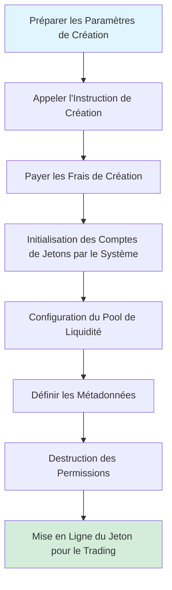
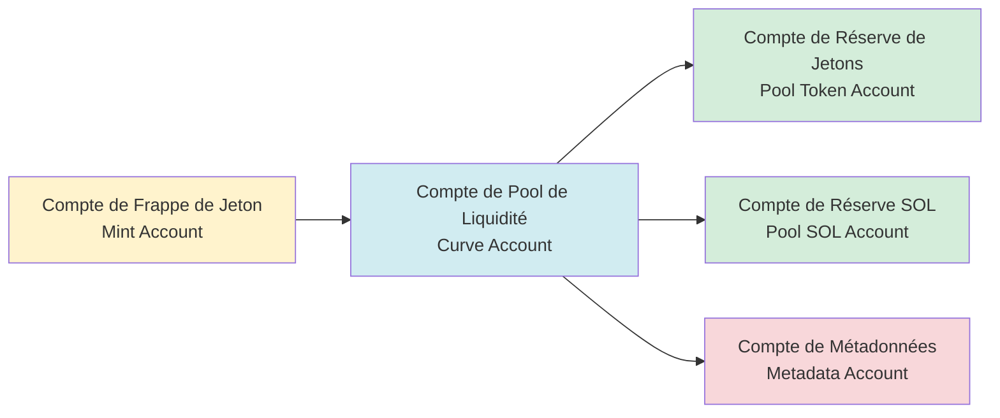
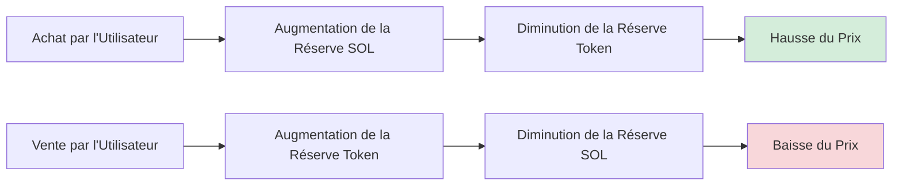

# 🪙 Introduction à la Fonction de Création de Jetons PinPet

## I. 📋 Aperçu de la Fonctionnalité

### 💎 Qu'est-ce que la Création de Jetons

La création de jetons est l'une des fonctionnalités principales de la plateforme PinPet, permettant aux utilisateurs d'émettre en un clic de nouveaux jetons SPL (jetons standards de la blockchain Solana) et de configurer automatiquement un marché de trading. Grâce à cette fonctionnalité, les utilisateurs peuvent rapidement créer des jetons dotés de métadonnées complètes, d'un support automatique de liquidité et de capacités de trading instantané, sans avoir besoin de comprendre en profondeur la technologie blockchain complexe.

### ❓ Pourquoi Créer des Jetons

**⚠️ Points de Friction de l'Émission Traditionnelle de Jetons :**
- Nécessite des connaissances techniques professionnelles (programmation Solana, norme SPL Token)
- Configuration manuelle des permissions de frappe, des pools de liquidité, des métadonnées et de nombreuses autres étapes
- Manque de liquidité et de marché de trading instantanés
- Configuration de sécurité complexe (destruction de permissions, prévention de la sur-émission, etc.)

**✅ Avantages de la Création de Jetons PinPet :**
- **⚡ Émission en Un Clic** : Seules trois informations de base sont nécessaires : nom du jeton, symbole et icône
- **🚀 Mise en Ligne Instantanée** : Trading possible dès la création, sans attendre l'accumulation de liquidité
- **🔒 Configuration de Sécurité Automatique** : Destruction automatique des permissions de frappe et de gel pour prévenir la sur-émission malveillante
- **🏦 Marché de Trading Intégré** : Basé sur l'algorithme AMM à produit constant, support du trading au comptant et à effet de levier
- **✔️ Métadonnées Conformes** : Conforme à la norme Metaplex, reconnaissance automatique par les portefeuilles et les bourses

### ⭐ Caractéristiques Principales

| Caractéristique | Description |
|------|------|
| Norme de Jeton | SPL Token (norme officielle Solana) |
| Précision | 6 décimales (1 Token = 1 000 000 unités minimales) |
| Offre Totale | 1 609 500 000 000 000 unités (offre fixe, non augmentable) |
| Norme de Métadonnées | Metaplex Token Metadata |
| Prix Initial | Environ 0,0000000000279589934762 SOL/Token |
| Modèle de Liquidité | AMM à Produit Constant (x × y = k) |

---

## II. 🔄 Processus de Création de Jetons

### 👤 Étapes d'Utilisation



### 📊 Explication Détaillée du Processus

#### 📝 Phase 1 : Préparation des Paramètres
Les utilisateurs doivent fournir trois paramètres de base :

| Paramètre | Type | Description | Exemple |
|------|------|------|------|
| name | Chaîne | Nom complet du jeton | "PinPet Token" |
| symbol | Chaîne | Symbole du jeton (3-10 caractères) | "PINPET" |
| uri | Chaîne | Lien vers le fichier JSON de métadonnées | "https://example.com/metadata.json" |

#### 🔧 Phase 2 : Initialisation des Comptes
Le système crée et configure automatiquement les comptes suivants :



#### 💧 Phase 3 : Initialisation du Pool de Liquidité
Le système configure automatiquement deux pools de fonds :

**1. Pool de Liquidité au Comptant (LP Pool)**
- Réserve de jetons : 1 073 000 000 000 000 unités
- Réserve SOL : 30 SOL (solde virtuel)
- SOL réel : 10 000 lamports (pour éviter un solde insuffisant)
- Usage : Support du trading au comptant (achat/vente)

**2. Pool de Prêt à Effet de Levier (Borrow Pool)**
- Réserve de jetons : 536 500 000 000 000 unités
- Réserve SOL : 10 000 000 SOL (solde virtuel)
- Usage : Support du trading sur marge (long/short)

**📊 Diagramme de Répartition des Fonds :**
```
💰 Offre Totale : 1 609 500 000 000 000 unités
├── Pool de Liquidité au Comptant : 1 073 000 000 000 000 (66,67%)
└── Pool de Prêt à Effet de Levier :  536 500 000 000 000 (33,33%)
```

#### 📄 Phase 4 : Création des Métadonnées
Le système appelle le programme Metaplex Token Metadata pour créer les métadonnées du jeton :

| Champ de Métadonnées | Contenu | Description |
|-----------|------|------|
| name | Nom fourni par l'utilisateur | Nom du jeton affiché dans le portefeuille |
| symbol | Symbole fourni par l'utilisateur | Abréviation du jeton |
| uri | Lien fourni par l'utilisateur | Pointe vers un JSON contenant icône, description, etc. |
| creators | Adresse du créateur | Marque le créateur du jeton, statut non vérifié |
| seller_fee_basis_points | 0 | Taux de redevance (défini à 0) |
| is_mutable | true | Permet la mise à jour des métadonnées |

**📋 Exemple de Format Standard de JSON de Métadonnées :**
```json
{
  "name": "PinPet Token",
  "symbol": "PINPET",
  "description": "Jeton émis sur la plateforme PinPet",
  "image": "https://example.com/logo.png",
  "attributes": [],
  "properties": {
    "files": [
      {
        "uri": "https://example.com/logo.png",
        "type": "image/png"
      }
    ]
  }
}
```

#### 🔒 Phase 5 : Destruction des Permissions
Pour garantir la sécurité et l'immuabilité du jeton, le système exécute automatiquement :

| Opération | Objectif | Effet |
|------|------|------|
| Destruction de la Permission de Frappe | Prévenir la sur-émission | Offre totale verrouillée de façon permanente |
| Destruction de la Permission de Gel | Empêcher le gel des comptes utilisateurs | Jeton en circulation permanente |

#### 💵 Phase 6 : Configuration des Frais
Le système lit les paramètres de frais depuis le compte de paramètres du partenaire :

| Type de Frais | Valeur par Défaut | Description |
|---------|--------|------|
| Frais de Trading au Comptant | 1% | Déduits lors des transactions d'achat/vente |
| Frais de Trading sur Marge | 0,25% | Déduits lors du trading à effet de levier |
| Indicateur de Réduction de Frais | 0 (prix plein) | Peut s'ajuster automatiquement selon le volume de trading |
| Ratio de Distribution des Frais | 20%/80% | Ratio de partage technique/partenaire |

---

## III. 💧 Mécanisme du Pool de Liquidité

### 🔢 Formule du Produit Constant

PinPet adopte le modèle de teneur de marché automatisé (AMM), avec la formule principale :

```
x × y = k
```

Où :
- **x** : Réserve de SOL
- **y** : Réserve de Tokens
- **k** : Produit constant (valeur initiale = 30 × 1 073 000 000 = 32 190 000 000)

### 💰 Calcul du Prix Initial

```
Prix Initial = Réserve SOL ÷ Réserve Token
            = 30 ÷ 1 073 000 000
            ≈ 0,0000000279589934762 SOL/Token
```

### 📈 Mécanisme de Variation des Prix



### 🛡️ Protection contre le Glissement de Prix

Pour protéger le pool de liquidité, le système adopte plusieurs mécanismes de sécurité :

| Mesure de Protection | Description |
|---------|------|
| Facteur de Précision | Prix utilisant un facteur de précision de 10^26, évitant les erreurs d'arrondi |
| Vérification de Débordement | Tous les calculs utilisent des méthodes `checked_*` pour prévenir le débordement |
| Plafond de Prix | Prix maximum limité à 50 000 000 000 000 000 000 000 000 000 |
| Plancher de Prix | Prix minimum limité à 0,000000001 (prévention de division par zéro) |

---

## IV. 📝 Description des Métadonnées de Jeton

### ✅ Norme Metaplex

PinPet utilise la norme Metaplex Token Metadata v5.1.1, garantissant la compatibilité du jeton dans l'écosystème Solana :

**✨ Avantages de la Norme :**
- 💳 Reconnaissance automatique par les portefeuilles principaux (Phantom, Solflare)
- 🔄 Extraction automatique d'informations par les plateformes DEX (Jupiter, Raydium)
- 🎨 Indexation automatique par les marchés NFT et les agrégateurs
- 🔍 Affichage complet par les explorateurs blockchain (Solscan, Solana Explorer)

### 🗂️ Structure du Compte de Métadonnées

```
Adresse du Compte de Métadonnées (PDA)
├── Graine de Dérivation : ["metadata", Metaplex Program ID, Mint Address]
├── Contenu Stocké :
│   ├── Nom du jeton
│   ├── Symbole du jeton
│   ├── URI (lien JSON de métadonnées)
│   ├── Informations du créateur
│   ├── Paramètres de redevances
│   └── Informations de collection (optionnel)
└── Permissions :
    ├── Permission de Mise à Jour : Compte du pool de liquidité (PDA)
    └── Mutabilité : true (mise à jour autorisée)
```

### 🌐 Recommandations d'Hébergement URI

| Méthode d'Hébergement | Avantages | Inconvénients | Cas d'Usage |
|---------|------|------|---------|
| IPFS | Décentralisé, stockage permanent | Vitesse d'accès relativement lente | Projets à long terme |
| Arweave | Stockage permanent, rapide | Payant | Jetons de haute valeur |
| Stockage Cloud (AWS S3/CDN) | Rapide, bon marché | Centralisé, peut expirer | Projets de test ou à court terme |

---

## V. 🎯 Exemples de Cas d'Usage

### 🚀 Scénario 1 : Équipe de Startup Émettant un Jeton de Projet

**Besoin :**
Une équipe de startup Web3 souhaite émettre un jeton de gouvernance pour son projet DeFi

**Flux Opérationnel :**
1. Concevoir l'icône et la documentation descriptive du jeton
2. Télécharger le JSON de métadonnées sur IPFS
3. Préparer les paramètres :
   - name: "SuperDeFi Governance Token"
   - symbol: "SDEFI"
   - uri: "https://ipfs.io/ipfs/QmXXX..."
4. Appeler l'instruction de création PinPet, payer les frais de création modestes
5. Mise en ligne instantanée du jeton, l'équipe et la communauté peuvent trader immédiatement

**✅ Avantages :**
- ⚡ Pas besoin d'écrire de contrats intelligents
- 💧 Marché de liquidité intégré
- 🔒 Sécurité garantie par le protocole

---

### 🎉 Scénario 2 : Émission de Jeton Meme Communautaire

**Besoin :**
Une communauté souhaite émettre un jeton Meme thématique pour le divertissement et le trading

**Flux Opérationnel :**
1. Vote communautaire pour déterminer le nom et l'icône du jeton
2. Utiliser un hébergeur d'images gratuit pour héberger les images
3. Préparer les paramètres :
   - name: "Doge to the Moon"
   - symbol: "DMOON"
   - uri: "https://cloudinary.com/dmoon.json"
4. Un membre de la communauté initie la création
5. Les membres de la communauté commencent immédiatement à trader

**✅ Avantages :**
- 💰 Émission rapide à faible coût
- 👥 Pas besoin de compétences techniques
- 🔒 Mécanisme automatique de prévention de sur-émission

---

### 🎨 Scénario 3 : Projet NFT Émettant un Jeton Utilitaire

**Besoin :**
L'équipe d'un projet NFT souhaite émettre un jeton utilitaire complémentaire pour les incitations écosystémiques

**Flux Opérationnel :**
1. Concevoir une image de jeton cohérente avec le style NFT
2. Préparer un livre blanc détaillé du jeton
3. Utiliser Arweave pour le stockage permanent des métadonnées
4. Préparer les paramètres :
   - name: "CryptoArt Utility Token"
   - symbol: "CART"
   - uri: "ar://abc123..."
5. Créer le jeton et configurer le compte de réception des frais
6. Les détenteurs de NFT peuvent staker pour obtenir des récompenses en jetons

**✅ Avantages :**
- 💾 Stockage permanent des métadonnées
- 🔗 Intégration transparente avec l'écosystème NFT
- 📊 Support de modèles économiques complexes

---

## VI. ⚠️ Précautions et Limitations

### 📝 Préparation Avant la Création

| Point de Vérification | Description |
|--------|------|
| Solde du Portefeuille | Assurer suffisamment de SOL pour payer les frais de création (environ 0,01-0,05 SOL) |
| Préparation des Métadonnées | Fichier JSON téléchargé et accessible |
| Informations du Jeton | Nom et symbole conformes aux normes, sans ambiguïté |
| Compte Partenaire | Compte de paramètres partenaire créé (nécessaire lors de la première utilisation) |

### 🚫 Limitations de la Création de Jetons

**⚙️ Limitations Techniques :**
- La précision du jeton est fixée à 6 décimales, non modifiable après création
- L'offre totale est fixe, aucune augmentation possible après destruction de la permission de frappe
- Configuration de liquidité initiale fixe, non personnalisable

**🔒 Limitations de Sécurité :**
- Taux de frais plafonné à 10%, l'échec de création si dépassement
- Permission de mise à jour des métadonnées appartient au compte du pool de liquidité
- Permission de gel détruite, impossible de geler les comptes utilisateurs

**💰 Limitations Économiques :**
- Prix initial calculé par algorithme, non personnalisable
- Ratio de distribution de liquidité fixe (comptant 66,67%, effet de levier 33,33%)
- Réserve SOL est un solde virtuel, non retirable directement

### ❓ Questions Fréquemment Posées

**💵 Q1 : Combien coûte la création d'un jeton ?**
R : Les frais principaux incluent le loyer de compte (environ 0,01-0,03 SOL) et les frais de transaction (environ 0,00001 SOL), totalisant environ 0,01-0,05 SOL.

**✏️ Q2 : Peut-on modifier le nom ou le symbole après la création du jeton ?**
R : Il est possible de modifier en mettant à jour le contenu du fichier JSON pointé par l'URI des métadonnées, mais le nom et le symbole enregistrés on-chain sont immuables.

**🔒 Q3 : Comment assurer la sécurité du jeton ?**
R : Le système détruit automatiquement les permissions de frappe et de gel, garantissant une offre fixe et immuable. Il est recommandé d'utiliser un stockage décentralisé (IPFS/Arweave) pour héberger les métadonnées.

**❗ Q4 : Comment gérer l'échec de création ?**
R : Vérifier le solde du portefeuille, le format des paramètres, l'état du compte partenaire. Les erreurs courantes incluent le dépassement du taux de frais, URI invalide, etc.

**🗑️ Q5 : Un jeton peut-il être détruit ?**
R : Le compte de jeton lui-même ne peut pas être détruit, mais il est possible de verrouiller définitivement les jetons en les transférant à une adresse de trou noir (0x000...).

### 💡 Recommandations de Meilleures Pratiques

1. **Hébergement des Métadonnées** : Prioriser l'utilisation de stockage décentralisé comme IPFS ou Arweave pour éviter l'expiration des liens
2. **Nomination du Jeton** : Concis et clair, éviter la confusion avec des projets connus, prévenir la violation de droits
3. **Conception de l'Icône** : Utiliser des images de haute qualité (recommandé 512x512 pixels), conforme au positionnement du jeton
4. **Préparation du Livre Blanc** : Inclure une description détaillée du projet et une feuille de route dans le JSON pointé par l'URI
5. **Construction de la Communauté** : Établir rapidement des comptes de médias sociaux après la création pour accroître la notoriété du jeton
6. **Conformité** : Assurer que l'usage du jeton est légal, éviter de violer les lois et réglementations locales

---

## VII. 🔧 Support Technique

### 📍 Adresses de Comptes Associées

| Type de Compte | Règle de Dérivation | Description |
|---------|---------|------|
| Compte de Pool de Liquidité | `["borrowing_curve", mint_address]` | Gère les paramètres de liquidité et de trading |
| Compte de Réserve de Jetons | `["pool_token", mint_address]` | Stocke les jetons dans le pool de liquidité |
| Compte de Réserve SOL | `["pool_sol", mint_address]` | Stocke les SOL dans le pool de liquidité |
| Compte de Métadonnées | PDA standard Metaplex | Stocke les métadonnées du jeton |

### 🖥️ Interface de Programme

**✨ Instruction de Création :**
```
Nom de Fonction : create
Paramètres :
  - name: String (nom du jeton)
  - symbol: String (symbole du jeton)
  - uri: String (URI de métadonnées)
```

**📡 Écoute d'Événements :**
Après une création réussie, l'événement `TokenCreatedEvent` est émis, contenant les informations suivantes :
- Adresse du compte de frappe
- Adresse du compte du pool de liquidité
- Configuration des frais
- Nom, symbole, URI du jeton

---

## 🎯 Conclusion

La fonctionnalité de création de jetons PinPet offre aux utilisateurs une solution d'émission de jetons 🔒 sécurisée, ⚡ pratique et 💰 à faible coût. Grâce à la configuration automatisée de la liquidité et à la gestion standardisée des métadonnées, les utilisateurs peuvent créer un jeton et le mettre en ligne pour le trading en quelques minutes, sans se soucier des détails techniques et des problèmes de sécurité.

Que ce soit pour 🚀 une équipe de startup émettant un jeton de projet, 🎉 une communauté créant un jeton Meme, ou 🎨 un projet NFT avec un jeton utilitaire complémentaire, PinPet peut fournir un support complet, rendant l'émission de jetons simple et efficace.
