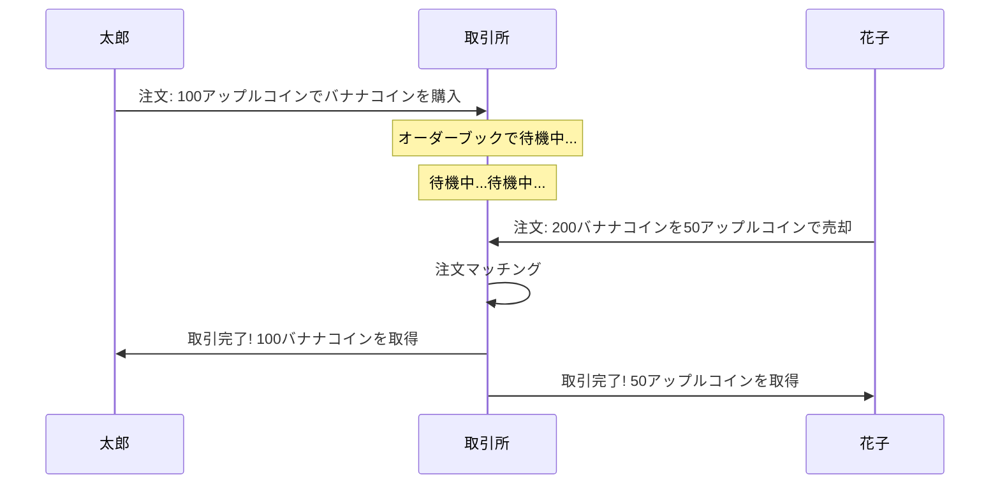
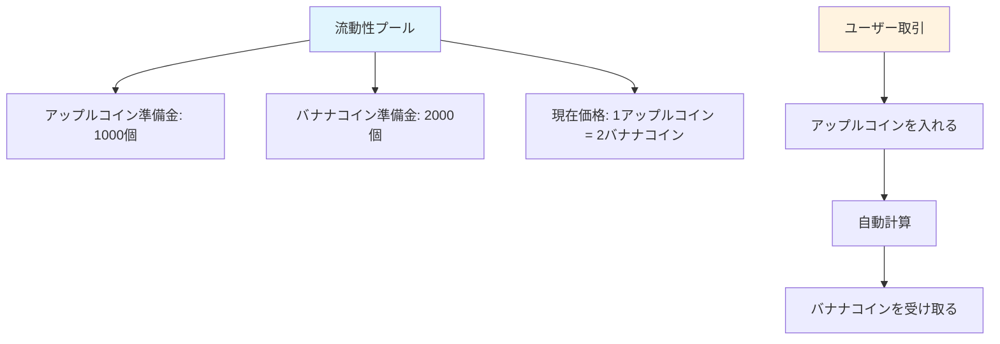
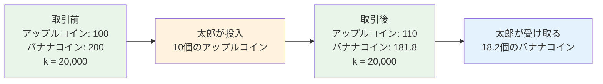
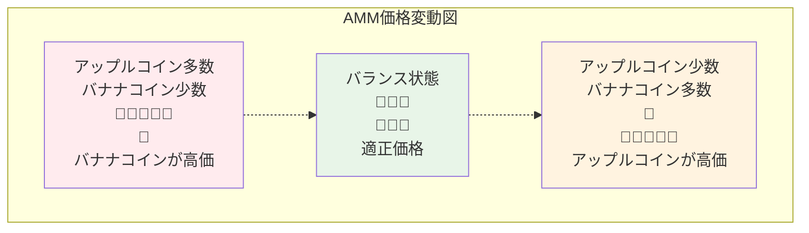
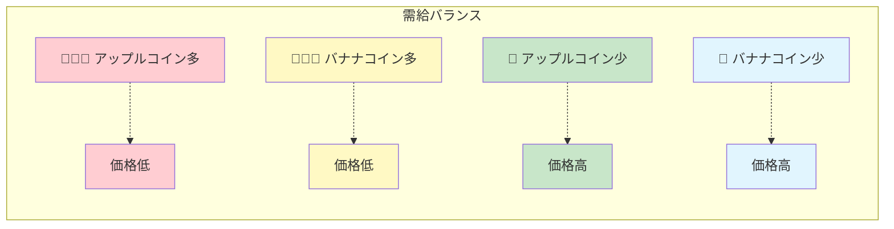
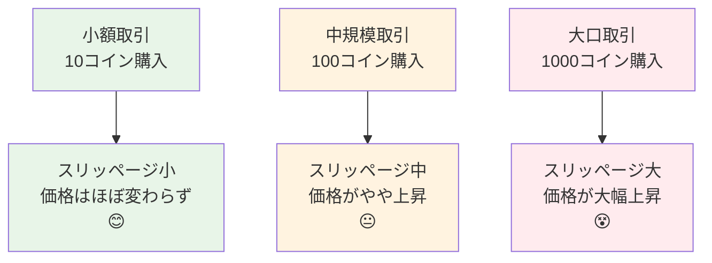
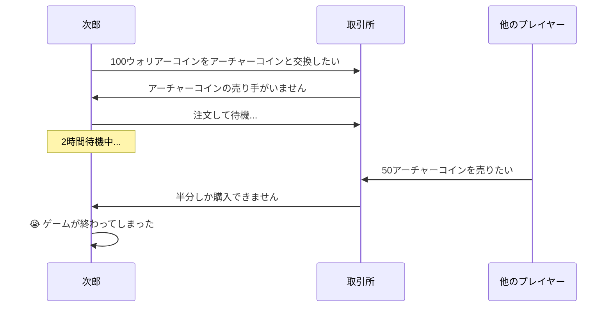
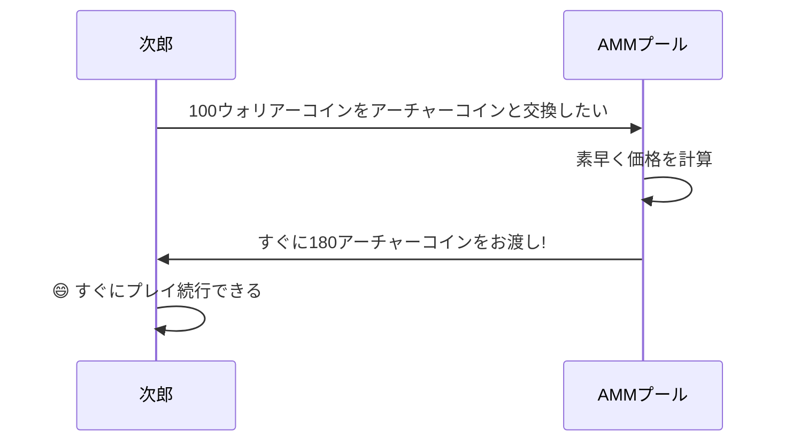
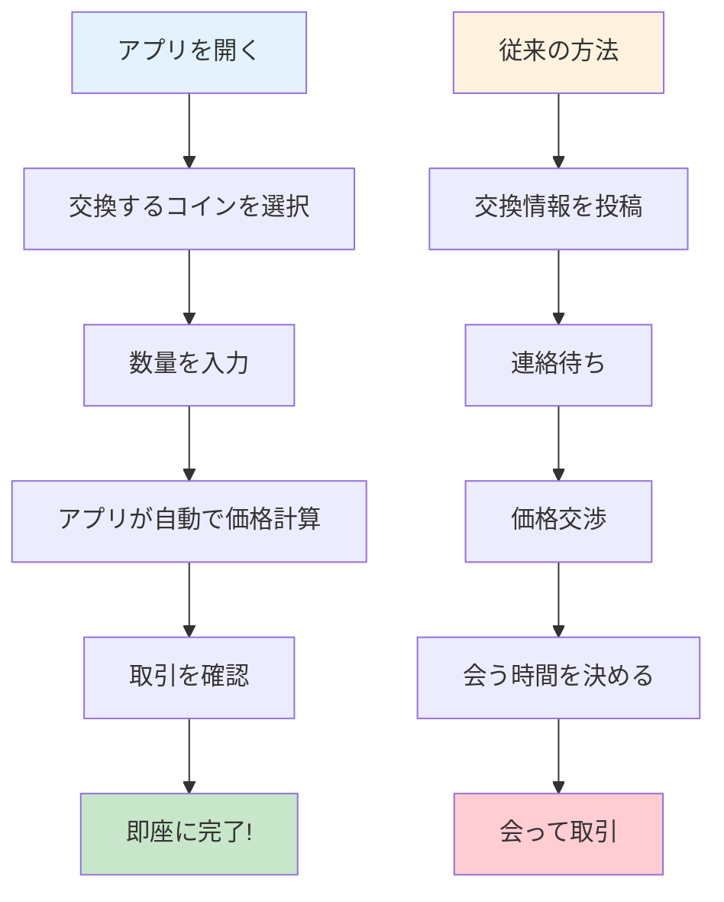

# AMMマーケットメイキングメカニズムガイド - ゼロから理解する自動マーケットメーカー

## 目次
1. [AMMとは?](#ammとは)
2. [従来型取引所の物語](#従来型取引所の物語)
3. [AMMの魔法の世界](#ammの魔法の世界)
4. [数学原理の簡易版](#数学原理の簡易版)
5. [図解AMMの動作原理](#図解ammの動作原理)
6. [スリッページとは?](#スリッページとは)
7. [なぜAMMを使うのか?](#なぜammを使うのか)
8. [実例分析](#実例分析)
9. [まとめ](#まとめ)

---

## AMMとは?

リンゴをバナナと交換したいのに、ちょうどリンゴが欲しい人が見つからない状況を想像してください。そこに「魔法のジュースマシン」があって、リンゴを入れると自動的に相応の量のバナナが出てくる、これがAMM(自動マーケットメーカー)の基本概念です!

**AMM = Automated Market Maker(自動マーケットメーカー)**

簡単に言えば、AMMは賢くて眠らない「取引ロボット」で、いつでもどこでも他の人との取引を待つことなく、異なるトークンを交換できます。

---

## 従来型取引所の物語

### 📖 太郎の取引の悩み

太郎は100個のアップルコインをバナナコインと交換したいと思っています。従来の取引所では:

1. **注文して待つ**: 太郎は「100アップルコインでバナナコインを買いたい、レート1:2」と注文
2. **買い手を待つ**: 適切な価格でバナナコインを売りたい人が現れるまで待つ必要がある
3. **長時間待つ可能性**: 売り手がいなければ、数時間から数日待つことも
4. **価格変動**: 待っている間に価格が変動し、最適なタイミングを逃す可能性がある

### 従来型取引所の問題点:
- ⏰ **待機が必要**: 取引相手を待つ必要がある
- 📊 **流動性不足**: マイナーなトークンは取引が困難
- 💰 **価格不安定**: 大口注文で価格が大きく変動しやすい
- 🌙 **時間制限**: 取引所には営業時間がある

---

## AMMの魔法の世界

### 🏪 魔法の自動ストア

では、魔法の自動ストア(AMM)を想像してみましょう。その仕組みは:

1. **常時営業**: 24時間稼働、決して閉まらない
2. **即時取引**: 欲しいものがすぐに買える
3. **自動価格設定**: 在庫に基づいて価格が自動調整
4. **待機不要**: 他の顧客を待つ必要なし

### 🏦 流動性プール = スーパー倉庫

AMMの核心は「流動性プール」で、巨大な二区画倉庫のようなものです:

### 🤖 自動価格設定ロボット

AMMには超賢い価格設定ロボットがあり、シンプルなルールに従います:

**🔢 魔法の公式: アップルコイン数量 × バナナコイン数量 = 固定値(k)**

この公式により:
- 買う人が増えるほど価格が上がる
- 売る人が増えるほど価格が下がる
- 常に在庫があり、価格が存在する

---

## 数学原理の簡易版

### 🧮 恒積公式

「数学」に怯える必要はありません——実はとてもシンプルです!

魔法の倉庫に以下があると仮定します:
- アップルコイン: 100個
- バナナコイン: 200個
- 魔法の数字 k = 100 × 200 = 20,000

**ルール: どんな取引でも、k値は20,000を保たなければならない!**

### 📊 取引例

**太郎が10個のアップルコインをバナナコインと交換したい:**

1. **取引前**:
   - アップルコイン: 100個
   - バナナコイン: 200個
   - k = 100 × 200 = 20,000

2. **太郎が10個のアップルコインを投入**:
   - 新しいアップルコイン数量: 100 + 10 = 110個
   - k = 20,000を保つ必要がある
   - したがって: 110 × 新バナナコイン数量 = 20,000
   - 新バナナコイン数量 = 20,000 ÷ 110 = 181.8個

3. **太郎が受け取る**:
   - バナナコイン: 200 - 181.8 = 18.2個
   - 10個のアップルコインで18.2個のバナナコインと交換

---

## 図解AMMの動作原理

### 🎢 価格曲線チャート

AMMの価格変動はジェットコースターのように、特別な曲線に従います:

### 📈 需給関係図

天秤の両端を想像してください:

---

## スリッページとは?

### 🛒 スーパーマーケットでの買い物の例え

スーパーマーケットでリンゴを買う場面を想像してください:

**従来型スーパー(中央集権型取引所):**
- 表示価格: 500円/kg
- 1kg購入: 500円
- 100kg購入: まだ500円/kg
- ただし在庫がない可能性がある!

**魔法のスーパー(AMM):**
- 1kg目: 500円
- 2kg目: 510円(在庫減少、価格上昇)
- 3kg目: 520円
- 買えば買うほど価格が上昇!

### 📊 スリッページ影響図

### 🎯 スリッページ計算例

プールに1000個のアップルコインと2000個のバナナコインがあると仮定:

1. **10個のバナナコイン購入**: スリッページ約0.25%
2. **100個のバナナコイン購入**: スリッページ約2.5%
3. **500個のバナナコイン購入**: スリッページ約14%

**結論: 購入量が多いほど、1コインあたりの平均価格が高くなる!**

---

## なぜAMMを使うのか?

### 🌟 AMMの優れた利点

#### 1. 🚀 即時取引
- **従来の方法**: 取引相手を見つけるまで数時間待つ可能性
- **AMM方法**: 数秒で取引完了

#### 2. 🌍 24時間365日
- **従来型取引所**: 営業時間あり、休日は閉鎖
- **AMM**: 決して閉まらず、いつでも取引可能

#### 3. 🎯 マッチング不要
- **従来の方法**: 売買双方の価格マッチングが必要
- **AMM**: プールにコインがあれば取引可能

#### 4. 💎 マイナートークンサポート
- **従来型取引所**: マイナーコインは取引者がいない可能性
- **AMM**: プールを作成すれば取引可能

### 📊 比較表

| 特性 | 従来型取引所 | AMM |
|------|-------------|-----|
| 取引速度 | マッチング待ち ⏳ | 即時完了 ⚡ |
| 営業時間 | 制限あり 🕐 | 24/7 🌍 |
| 流動性 | ユーザーの注文に依存 👥 | アルゴリズムで保証 🤖 |
| 価格発見 | オーダーブック 📋 | 数式 🧮 |
| スリッページ | 注文の深さに依存 📊 | 取引量に依存 📈 |

---

## 実例分析

### 🎮 ゲームトークン取引ストーリー

#### 背景設定
次郎はブロックチェーンゲームで、ゲームトークンを交換したいと考えています:
- 🗡️ ウォリアーコイン(武器購入用)
- 🏹 アーチャーコイン(弓購入用)

#### シナリオ1: 従来型取引所

#### シナリオ2: AMM

### 🍕 ピザショップの例え

**従来モード(友人とのコイン交換):**
- ビットコインが欲しいが、自分のイーサリアムを欲しがる人を見つける必要がある
- グループで叫ぶかも: ビットコインとイーサリアムを交換したい人いる?
- 半日待っても反応がないかも

**AMMモード(自動販売機):**
- 超賢い自動販売機のよう
- イーサリアムを入れれば、すぐにビットコインが出てくる
- 価格は自動計算、交渉不要

### 📱 スマホアプリの例え

魔法のコイン交換アプリを想像してください:

---

## まとめ

### 🎯 重要ポイントの振り返り

1. **AMMは魔法の自動販売機のよう**
   - 1種類のコインを入れると、すぐに別のコインが出てくる
   - 24時間稼働、決して休まない

2. **恒積公式が核心**
   - x × y = k(決して変わらない魔法の数字)
   - この公式で価格が自動調整される

3. **スリッページは正常な現象**
   - 多く買うほど価格が上がる
   - スーパーで買い物するのと同じ

4. **AMMは従来型取引所より便利**
   - 待機不要、即時取引
   - すべてのコインタイプをサポート
   - 常に流動性がある

### 🌈 今後の展望

AMM技術は継続的に発展中:
- より賢い価格設定アルゴリズム
- より低いスリッページ
- より多くの革新的機能

### 🎓 初心者へのアドバイス

1. **小額から始める**: まず少額で練習
2. **スリッページを理解する**: 大口取引ではスリッページに注意
3. **複数を比較する**: 異なるAMMで価格が異なる可能性
4. **継続的に学習**: DeFi世界は急速に変化

---

## 付録: よくある質問

### ❓ FAQ

**Q1: AMMのコインは使い切ってしまう?**
A1: 理論上はありません! プールにコインがある限り取引可能。ただし価格は非常に高くなる可能性があります。

**Q2: なぜ価格差が大きいことがある?**
A2: プールサイズが異なるため。小さなプールは価格変動が大きく、大きなプールは比較的安定。

**Q3: AMMは安全?**
A3: コードはオープンソースですが、監査済みのプラットフォームを選ぶよう注意してください。

**Q4: 手数料はどう計算される?**
A4: 通常、取引額の0.1-1%で、取引結果から自動的に差し引かれます。

**Q5: 取引をキャンセルできる?**
A5: ブロックチェーン確認前ならキャンセル可能ですが、キャンセル手数料がかかります。

覚えておいてください: 投資にはリスクがあり、慎重に取引を! まず学習、次に実践、少額から始めましょう! 🚀
