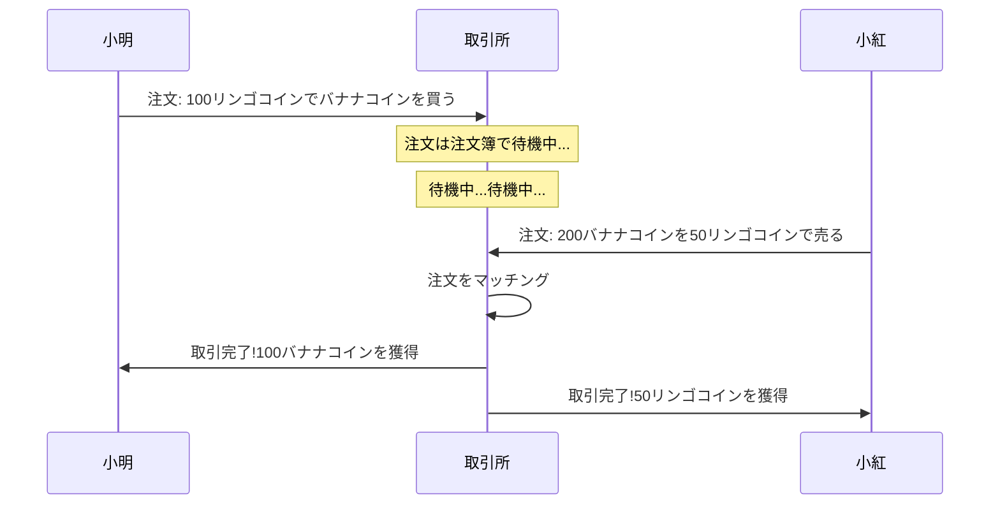
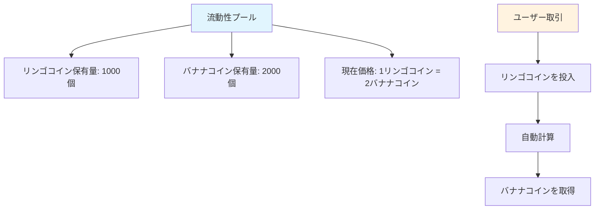
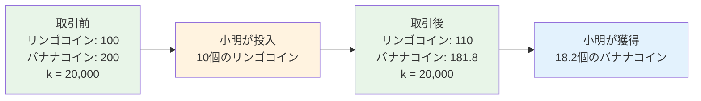
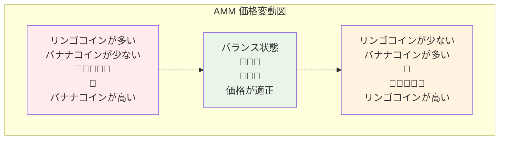
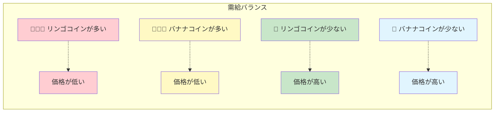
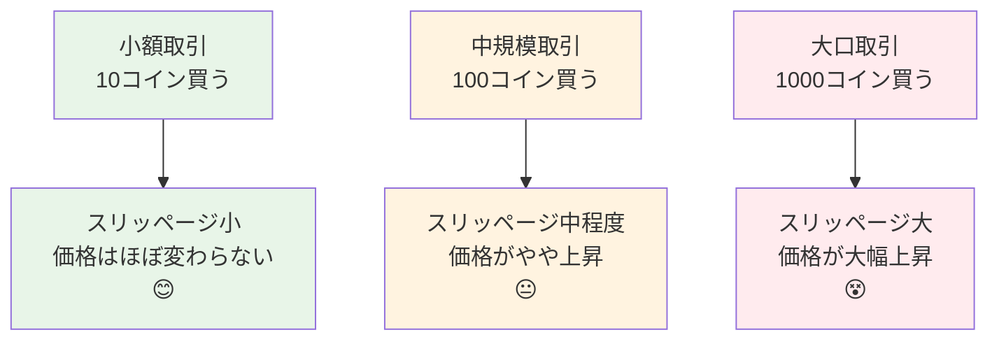
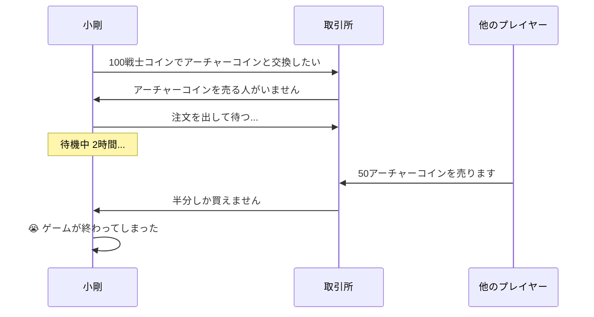
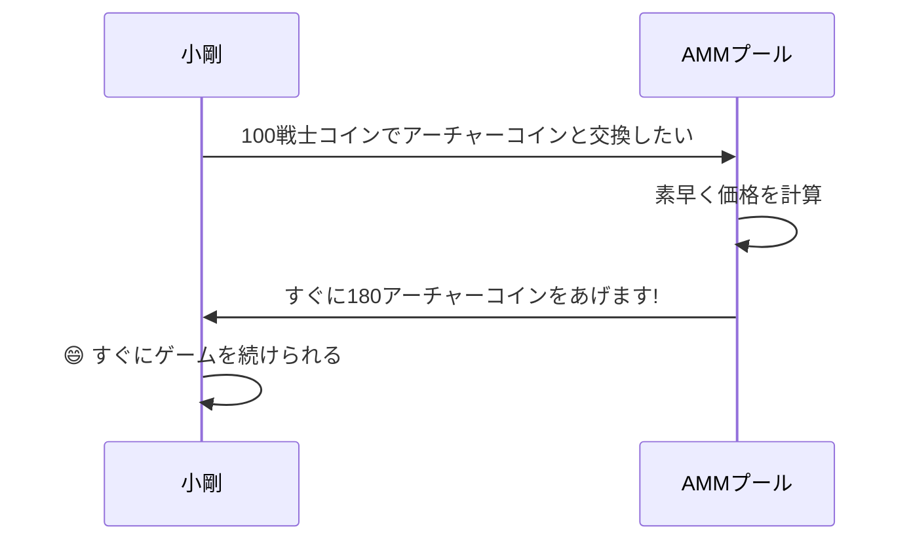
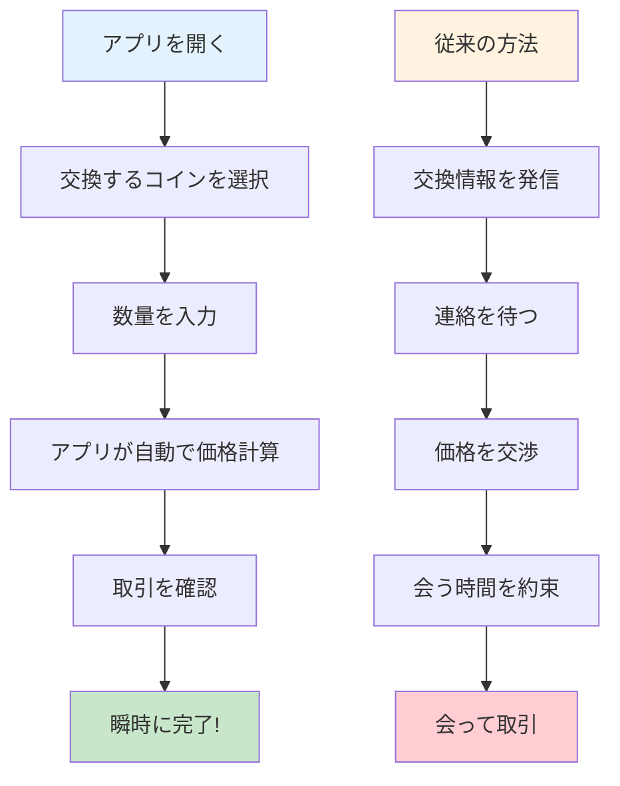

# AMM マーケットメイキング機構ガイド - ゼロから理解する自動マーケットメーカー

## 目次
1. [AMMとは?](#ammとは)
2. [従来の取引所のストーリー](#従来の取引所のストーリー)
3. [AMMの魔法の世界](#ammの魔法の世界)
4. [数学原理の簡易版](#数学原理の簡易版)
5. [図解 AMM 動作原理](#図解-amm-動作原理)
6. [スリッページとは?](#スリッページとは)
7. [なぜAMMを使うのか?](#なぜammを使うのか)
8. [実際のケース分析](#実際のケース分析)
9. [まとめ](#まとめ)

---

## AMMとは?

例えば、あなたがリンゴをバナナと交換したいとします。でも、ちょうどリンゴが欲しい人が見つからない。そんな時、「魔法のジューサー」があったら、リンゴを入れると自動的に相応の数のバナナが出てくる——これがAMM(自動マーケットメーカー)の基本概念です!

**AMM = Automated Market Maker(自動マーケットメーカー)**

簡単に言うと、AMMは賢くて、決して休まない「取引ロボット」です。いつでもどこでも異なるトークンを交換でき、他の人が取引してくれるのを待つ必要がありません。

---

## 従来の取引所のストーリー

### 📖 小明の取引の悩み

小明は自分の100個のリンゴコインをバナナコインと交換したいと考えています。従来の取引所では:

1. **注文を出して待つ**: 小明は「100個のリンゴコインでバナナコインを買いたい、価格1:2」と注文を出します
2. **買い手を待つ**: 小明は適切な価格でバナナコインを売りたい人が現れるのを待たなければなりません
3. **長時間待つかも**: 誰も売りたくなければ、小明は数時間、場合によっては数日待つことになります
4. **価格変動**: 待っている間に価格が変わり、小明は最適なタイミングを逃すかもしれません

### 従来の取引所の問題点:
- ⏰ **待つ必要がある**: 取引してくれる人を待たなければならない
- 📊 **流動性不足**: マイナーなトークンは取引が難しい
- 💰 **価格が不安定**: 大口注文は価格を大きく変動させやすい
- 🌙 **時間制限**: 取引所には営業時間がある

---

## AMMの魔法の世界

### 🏪 魔法の自動ショップ

今、魔法の自動ショップ(AMM)があるとします。その動作方法は次のとおりです:

1. **常に営業中**: 24時間稼働、決して閉店しない
2. **即座に取引**: 欲しいものがあれば、すぐに買える
3. **自動価格設定**: 価格は在庫に応じて自動調整
4. **待つ必要なし**: 他の客を待つ必要がない

### 🏦 流動性プール = 超大型倉庫

AMMの中核は「流動性プール」で、これは2つの区画がある巨大な倉庫のようなものです:

### 🤖 自動価格設定ロボット

AMMには超賢い価格設定ロボットがあり、シンプルなルールに従います:

**🔢 魔法の公式: リンゴコイン数量 × バナナコイン数量 = 固定値(k)**

この公式が保証すること:
- 買う人が増えるほど価格が上がる
- 売る人が増えるほど価格が下がる
- 常に在庫があって買え、価格があって売れる

---

## 数学原理の簡易版

### 🧮 恒常積公式

「数学」に怖がらないでください——実はとても簡単です!

魔法の倉庫に次のものがあるとします:
- リンゴコイン: 100個
- バナナコイン: 200個
- 魔法の数字 k = 100 × 200 = 20,000

**ルール: どんな取引をしても、k値は20,000のまま変わらない!**

### 📊 取引例

**小明が10個のリンゴコインをバナナコインと交換したい:**

1. **取引前**:
   - リンゴコイン: 100個
   - バナナコイン: 200個
   - k = 100 × 200 = 20,000

2. **小明が10個のリンゴコインを投入**:
   - 新しいリンゴコイン数量: 100 + 10 = 110個
   - k = 20,000を維持する必要がある
   - したがって: 110 × 新バナナコイン数量 = 20,000
   - 新バナナコイン数量 = 20,000 ÷ 110 = 181.8個

3. **小明が獲得**:
   - バナナコイン: 200 - 181.8 = 18.2個
   - 10個のリンゴコインで18.2個のバナナコインを獲得

---

## 図解 AMM 動作原理

### 🎢 価格曲線図

AMMの価格変動はジェットコースターのように、特殊な曲線に従います:

### 📈 需給関係図

天秤の両端を想像してください:

---

## スリッページとは?

### 🛒 スーパーマーケットでの買い物の例え

スーパーマーケットでリンゴを買うことを想像してください:

**従来のスーパー(中央集権型取引所):**
- 表示価格: 5元/斤
- 1斤買う: 5元
- 100斤買う: やはり5元/斤
- でも、そんなに在庫がないかも!

**魔法のスーパー(AMM):**
- 1斤目: 5元
- 2斤目: 5.1元(在庫が減り、価格が上昇)
- 3斤目: 5.2元
- たくさん買うほど、価格がどんどん上がる!

### 📊 スリッページ影響図

### 🎯 スリッページ計算例

プールに1000個のリンゴコインと2000個のバナナコインがあるとします:

1. **10個のバナナコインを買う**: スリッページ約0.25%
2. **100個のバナナコインを買う**: スリッページ約2.5%
3. **500個のバナナコインを買う**: スリッページ約14%

**結論: たくさん買うほど、1コインあたりの平均価格が高くなる!**

---

## なぜAMMを使うのか?

### 🌟 AMMの優れた利点

#### 1. 🚀 即座の取引
- **従来の方法**: 取引相手を見つけるまで数時間待つかもしれない
- **AMMの方法**: 数秒で取引完了

#### 2. 🌍 24時間年中無休
- **従来の取引所**: 営業時間があり、祝日は閉鎖
- **AMM**: 決して閉鎖せず、いつでも取引可能

#### 3. 🎯 マッチング不要
- **従来の方法**: 売買双方の価格が一致する必要がある
- **AMM**: プールにコインがあれば取引できる

#### 4. 💎 マイナートークンのサポート
- **従来の取引所**: マイナーコインは取引者がいないかも
- **AMM**: プールが作成されていれば取引できる

### 📊 比較表

| 特性 | 従来の取引所 | AMM |
|------|-----------|-----|
| 取引速度 | マッチングを待つ必要 ⏳ | 即座に完了 ⚡ |
| 営業時間 | 制限あり 🕐 | 24/7 🌍 |
| 流動性 | ユーザー注文に依存 👥 | アルゴリズムで保証 🤖 |
| 価格発見 | 注文簿 📋 | 数式 🧮 |
| スリッページ | 注文の厚みに依存 📊 | 取引量に依存 📈 |

---

## 実際のケース分析

### 🎮 ゲームトークン取引ストーリー

#### 背景設定
小剛はブロックチェーンゲームで、ゲームトークンを交換したいと考えています:
- 🗡️ 戦士コイン(武器を買うため)
- 🏹 アーチャーコイン(弓矢を買うため)

#### シーン1: 従来の取引所

#### シーン2: AMM

### 🍕 ピザ店の例え

**従来モデル(友達とコインを交換):**
- ビットコインが欲しい場合、ちょうどあなたのイーサリアムが欲しい人を見つける必要がある
- グループで叫ぶかも:ビットコインとイーサリアムを交換したい人いますか?
- 半日待っても誰も反応しないかも

**AMMモデル(自動販売機):**
- 超賢い自動販売機のようなもの
- イーサリアムを入れると、すぐにビットコインが出てくる
- 価格は自動計算、値段交渉不要

### 📱 スマートフォンアプリの例え

魔法のコイン交換アプリを想像してください:

---

## まとめ

### 🎯 核心ポイントの復習

1. **AMMは魔法の自動販売機のようなもの**
   - 1つのコインを入れると、すぐに別のコインが出てくる
   - 24時間稼働、決して休まない

2. **恒常積公式が核心**
   - x × y = k(決して変わらない魔法の数字)
   - この公式が価格を自動調整する

3. **スリッページは正常な現象**
   - たくさん買うほど、価格が上がる
   - スーパーで物を買うのと同じで、たくさん買うほど高くなる

4. **AMMは従来の取引所より便利**
   - 人を待つ必要なし、即座に取引
   - すべてのコインをサポート
   - 常に流動性がある

### 🌈 将来の展望

AMM技術は今も進化し続けています:
- より賢い価格設定アルゴリズム
- より低いスリッページ
- より多くの革新的機能

### 🎓 初心者へのアドバイス

1. **小額から始める**: まず少額資金で練習
2. **スリッページを理解する**: 大口取引はスリッページに注意
3. **多く比較する**: 異なるAMMで価格が異なる可能性がある
4. **継続的に学ぶ**: DeFi世界は変化が速い

---

## 付録: よくある質問

### ❓ FAQ

**Q1: AMMはコインがなくなることはないの?**
A1: 理論的にはありません! プールにコインがあれば取引できます。ただし価格が非常に高くなる可能性があります。

**Q2: なぜ時々価格差が大きいの?**
A2: プールのサイズが異なるからです。小さいプールは価格変動が大きく、大きいプールは相対的に安定しています。

**Q3: AMMは安全?**
A3: コードはオープンソースですが、監査済みのプラットフォームを選ぶよう注意してください。

**Q4: 手数料はどう計算される?**
A4: 通常は取引金額の0.1-1%で、取引結果から自動的に差し引かれます。

**Q5: 取引をキャンセルできる?**
A5: オンチェーン確認前ならキャンセルできますが、キャンセル手数料がかかります。

覚えておいてください: 投資にはリスクがあり、取引は慎重に! まず学び、それから実践、小額から始めましょう! 🚀
