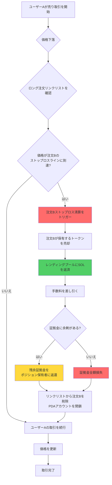
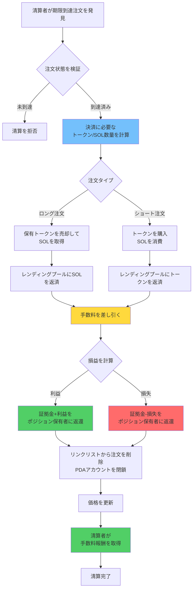
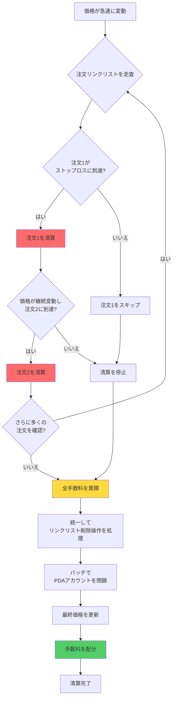

# ⚡ PinPet 強制清算（ロスカット）機能説明

## 📋 機能概要

強制清算は、PinPetプロトコルにおけるシステムの安定性を保護する中核的なリスク管理メカニズムです。システムは2種類の強制清算トリガー方式を提供します：

1. **⏰ 時間トリガー**: レバレッジ取引注文が規定の保有期間を超えた後、誰でも強制清算をトリガーできます
2. **🎯 価格トリガー**: 市場価格が注文のストップロス価格ラインに到達すると、自動的にストップロス清算がトリガーされます

この二重保護メカニズムにより、プロトコルの流動性と資金の安全性が確保され、同時にポジション保有者を過度な損失から保護します。

## ⚙️ コア機能

### 1. 🔄 二重トリガーメカニズム

#### ⏰ 時間トリガー
- **✅ 通常の決済**: 注文保有期間中は、ポジション保有者本人のみが能動的に決済できます
- **⏱️ 期限到達清算**: 注文期限到達後、誰でも強制清算を実行できます
- **🔍 時間検証**: システムはオンチェーンタイムスタンプを通じて注文が期限到達しているかを自動判定します

#### 🎯 価格トリガー（ストップロス清算）
- **📉 ロングのストップロス**: 価格が下落してロング注文のストップロス価格ラインに到達すると、自動的に決済されます
- **📈 ショートのストップロス**: 価格が上昇してショート注文のストップロス価格ラインに到達すると、自動的に決済されます
- **🔄 受動的トリガー**: 価格トリガーのストップロス清算は、他のユーザーの取引時に自動実行されます
- **⚠️ 証拠金消失**: ストップロス時、証拠金は借入返済に使用され、ポジション保有者は通常利益がないか、証拠金全額を損失します

### 2. 📊 注文タイプ対応

| 注文タイプ | 価格トリガー条件 | 時間トリガー条件 | リンクリスト方向 | 資産処理 |
|---------|------------|------------|---------|---------|
| 📈 ロング注文 | 価格下落でストップロスラインに到達 | 注文期限到達 | Down | 借入SOLを返済 |
| 📉 ショート注文 | 価格上昇でストップロスラインに到達 | 注文期限到達 | Up | 借入トークンを返済 |

### 3. 👥 参加者の役割

- **👤 ポジション保有者**: レバレッジ注文を作成したユーザー、注文期限到達前は独占的な決済権を持ちます
- **🔨 清算者**: 任意の第三者ユーザー、注文期限到達後に能動的な清算を実行できます
- **💼 トレーダー**: 他のユーザーの売買取引が価格ストップロス清算をトリガーする可能性があります
- **🤖 プロトコル**: レンディングプールの資金を自動管理し、資金の流動を正常に保ちます

## 🔄 ワークフロー

### 📊 フロー比較表

| フロー段階 | ⏰ 時間トリガー決済 | 🎯 価格トリガーストップロス |
|---------|------------|------------|
| トリガー条件 | 注文期限到達 | 価格がストップロスラインに到達 |
| トリガータイミング | 清算者が能動的に開始 | 取引時に受動的にトリガー |
| 権限検証 | 誰でも実行可能 | 自動実行（権限不要） |
| 損益決済 | 利益または損失の可能性 | 通常は証拠金全額損失 |
| 証拠金処理 | 残余証拠金を返還 | 借入返済に使用 |

### 📉 ショート注文ストップロス清算フロー（価格トリガー）


### 📈 ロング注文ストップロス清算フロー（価格トリガー）



### ⏰ 注文期限到達清算フロー（時間トリガー）



### 💥 バッチ連鎖清算フロー



## 💰 手数料メカニズム

### 💵 手数料構成

| 手数料タイプ | 徴収対象 | 手数料率 | 用途 |
|---------|---------|------|------|
| 取引手数料 | ポジション保有者 | 注文手数料率に基づく | 流動性提供者への補償 |
| 清算手数料 | ポジション保有者 | 注文手数料率に基づく | 清算実行者への報酬 |

### 🤝 手数料配分

すべての手数料は、プロトコルで設定された配分比率（fee_split）に基づいて両者間で配分されます：

- **🤝 パートナー**: 手数料の一定比率を取得
- **🔧 技術提供者**: 残りの手数料を取得

配分比率は、管理者が流動性プールを作成する際に設定され、取値範囲は0-100です。

## 💸 資金決済ルール

### ⏰ 時間トリガー清算（注文期限到達）

#### ✅ 利益がある場合
注文に利益がある場合：
- ポジション保有者は証拠金 + 利益部分を受け取ります
- 取引手数料と清算手数料が差し引かれます
- 決済アドレスはポジション保有者アドレスである必要があります

#### ❌ 損失がある場合
注文に損失がある場合：
- 損失は証拠金から差し引かれます
- 残余証拠金はポジション保有者に返還されます
- 取引手数料と清算手数料が差し引かれます

#### 🧮 決済計算式
**📈 ロング注文損益**:
```
利益 = 売却で得たSOL + 証拠金 - 借入SOL - 手数料
```

**📉 ショート注文損益**:
```
利益 = ロックされたSOL - 買い戻しで消費したSOL - 手数料
```

### 🎯 価格トリガーストップロス（自動清算）

#### 🛡️ 証拠金処理
- 証拠金は優先的にレンディングプールへの返済に使用されます
- 取引手数料を差し引いた後の残高はすべて決済に使用されます
- 通常の場合、ポジション保有者は利益がないか、証拠金全額を損失します

#### 🧮 決済計算式
**📈 ロング注文ストップロス**:
```
残余証拠金 = 証拠金 - 借入SOL返済 - 手数料
残余証拠金 > 0の場合、ポジション保有者に返還
残余証拠金 ≤ 0の場合、証拠金全額損失
```

**📉 ショート注文ストップロス**:
```
買い戻しコスト = トークン買い戻しで消費したSOL + 手数料
残余証拠金 = 証拠金 - 買い戻しコスト
残余証拠金 > 0の場合、ポジション保有者に返還
残余証拠金 ≤ 0の場合、証拠金全額損失
```

### 📊 決済シナリオ比較

| シナリオタイプ | 決済タイミング | 利益の可能性 | 証拠金返還 | 手数料源泉 |
|---------|---------|----------|----------|----------|
| ✅ 能動的決済 | ポジション保有者の操作 | 利益/損失の可能性 | 元本+利益または損失差し引き | ポジション保有者が支払い |
| ⏰ 期限到達清算 | 注文期限到達 | 利益/損失の可能性 | 元本+利益または損失差し引き | ポジション保有者が支払い |
| 🎯 ストップロス清算 | 価格トリガー | 通常損失 | 証拠金差し引き後の残高 | 証拠金から差し引き |

## 🔗 リンクリスト管理

### 📋 注文リンクリスト構造

システムは双方向リンクリストを使用して決済待ち注文を管理します：

- **📈 ロング注文リンクリスト（Down）**: 価格が高いものから低いものへ順に配列
- **📉 ショート注文リンクリスト（Up）**: 価格が低いものから高いものへ順に配列

### 🔧 リンクリスト操作

```
ヘッドノード確認 → 注文位置を確認
    ↓
前後ノード関係を検証
    ↓
現在のノードを削除 → 前後ノードポインタを更新
    ↓
リンクリストヘッドポインタを更新
```

### 💥 バッチ清算

一回の取引で複数の注文のストップロスがトリガーされた場合：
1. 注文リンクリストを順に走査
2. 各期限到達注文に対して順次決済を実行
3. すべての決済手数料を累積
4. 統一して資金決済を行う

## 🛡️ セキュリティメカニズム

### 🔐 権限検証

| 検証項目 | 時間条件 | 権限要件 |
|-------|---------|---------|
| 能動的決済 | 注文未到達 | ポジション保有者本人である必要 |
| 強制清算 | 注文到達済み | 誰でも実行可能 |
| 決済アドレス | いつでも | ポジション保有者アドレスである必要 |

### 🔢 数値セキュリティ

- すべての計算はセーフなchecked_*メソッドを使用し、オーバーフローを防ぎます
- 手数料計算は高精度アルゴリズムを採用し、正確性を確保します
- 注文リンクリストの完全性を検証し、データ破損を防ぎます

### 💎 資金セキュリティ

- レンディングプール資金の自動返済検証
- プール資金充足性チェック
- 重複決済防止保護

## 🎬 実際の応用シナリオ

### 🎯 シナリオ1: 通常の期限到達清算（時間トリガー）

1. ユーザーAが価格100で5倍ロングポジションを開設、証拠金1 SOL、保有時間24時間
2. 24時間後、価格が120に上昇し、注文は約1 SOLの利益
3. ユーザーBが注文の期限到達を発見し、強制清算を実行
4. システムは自動的にトークンを売却し、借入を返済し、手数料0.1 SOLを差し引く
5. ユーザーAは元本1 SOL + 利益1 SOL - 手数料0.1 SOL = 1.9 SOLを受け取る

### 🚨 シナリオ2: 価格トリガーストップロス清算

1. ユーザーCが価格100で3倍ショートポジションを開設、証拠金2 SOL
2. ストップロス価格ラインは130に設定（開設時に自動計算）
3. ユーザーDが大量のトークンを購入し、価格が急速に135まで上昇
4. 価格がユーザーCのストップロスラインに到達し、システムが自動的に注文Cを清算
5. 証拠金2 SOLを使用してトークンを買い戻しレンディングプールに返済
6. 手数料0.1 SOLを差し引き、残り0.2 SOLをユーザーCに返還
7. ユーザーCは1.8 SOL損失、ユーザーDの購入取引は完了を続ける

### 💥 シナリオ3: 連鎖ストップロス清算

1. 価格が急速に上昇し、複数のショート注文のストップロスラインをトリガー
2. ユーザーEが購入取引を提出し、価格が100から150に上昇
3. システムは5つのショート注文を清算する必要があることを検出
4. 価格順に順次ストップロス決済操作を実行
5. 各注文はそれぞれ証拠金でトークンを買い戻し、借入を返済
6. 最後に統一して累積手数料を差し引き、残余証拠金を返還
7. ユーザーEの購入取引が最終的に完了

### 📊 シナリオ4: 部分決済後のストップロス清算

1. ユーザーFが1000トークンのロングポジションを開設、証拠金5 SOL
2. 能動的に500トークンを決済して2 SOLの利益を得て、残り500トークンを保有
3. 価格が継続して下落し、残りポジションのストップロスラインに到達
4. システムは自動的に残りの500トークンに対してストップロス清算を実行
5. 借入と手数料を差し引いた後、ユーザーFは合計0.5 SOLの利益

## ❓ よくある質問

### Q1: ⏰ 時間トリガーと 🎯 価格トリガーの違いは何ですか？

A:
- **⏰ 時間トリガー**: 注文期限到達後、清算者が能動的に取引を開始して決済を実行し、ポジション保有者は利益または損失の可能性があります
- **🎯 価格トリガー**: 価格がストップロスラインに到達したときに、他のユーザーの取引過程で自動実行され、ポジション保有者は通常証拠金を損失します

両メカニズムは相互に独立しており、注文は先に価格ストップロスをトリガーする可能性もあれば、先に期限到達して清算される可能性もあります。

### Q2: 🎯 ストップロス価格ラインはどのように決定されますか？

A: ストップロス価格ラインは開設時にレバレッジ倍率と証拠金に基づいて自動計算されます：
- **📈 ロング注文**: ストップロス価格 = 開設価格 × (1 - 1/レバレッジ倍率)
- **📉 ショート注文**: ストップロス価格 = 開設価格 × (1 + 1/レバレッジ倍率)

例：5倍ロング、開設価格100、ストップロス価格約80；3倍ショート、開設価格100、ストップロス価格約133。

### Q3: 🔔 価格トリガーストップロス時、通知を受け取りますか？

A: ❌ いいえ。ストップロス清算は他のユーザーの取引時に受動的にトリガーされるため、システムは事前に通知しません。推奨事項：
- 🔍 オンチェーンイベントを通じて自分の注文状態を監視
- 📊 第三者ツールを使用してポジションリスクを監視
- ⚠️ 適切なレバレッジ倍率を設定し、簡単にストップロスがトリガーされないようにする

### Q4: ⏰ 注文期限到達後どのくらいで強制清算されますか？

A: 注文期限到達後すぐに誰でも強制清算できます、追加の猶予期間はありません。ただし、清算者が能動的に取引を開始する必要があります。注文期限到達前に能動的に決済してより多くの主導権を保持することをお勧めします。

### Q5: 💰 強制清算で追加料金がかかりますか？

A: ✅ いいえ、追加料金はかかりません。時間トリガーでも価格トリガーでも、手数料は注文開設時に設定された手数料率に基づいて徴収され、通常の決済と同じです。

### Q6: ⚠️ ストップロス清算時に証拠金は全額損失しますか？

A: 必ずしもそうではありません。通常の場合、ストップロス清算時に証拠金は大部分損失しますが、もし：
- ✅ ストップロストリガー時に価格がちょうどストップロスラインに到達
- 📊 市場の変動が大きくなく、清算コストが低い
- 💵 手数料が低い

場合は、少量の証拠金残高がポジション保有者に返還される可能性があります。ただし、ほとんどの場合、ストップロス清算は重大な損失を意味します。

### Q7: 🔢 一回の取引で何件の注文を清算できますか？

A: 理論上、一回の取引で最大6件の注文を清算できます（システム最大注文配列長）。実際の清算数は以下に依存します：
- **🎯 価格トリガー**: 価格変動範囲内でどれだけの注文がストップロスラインに到達するかに依存
- **⏰ 時間トリガー**: 清算者がどれだけの期限到達注文を清算するかを選択するかに依存

### Q8: 🔀 清算順序はどのように決定されますか？

A: 清算順序は注文リンクリスト構造によって決定されます：
- **📈 ロング注文**: 高価格から低価格へ順に清算（価格下落時）
- **📉 ショート注文**: 低価格から高価格へ順に清算（価格上昇時）

この順序により、最初にストップロスラインに到達した注文が最初に清算されることが保証され、価格変動の自然な順序に合致します。

### Q9: 🛡️ ストップロス清算を回避するにはどうすればよいですか？

A: 以下の措置を採ることをお勧めします：
- **⚙️ 適切なレバレッジ**: 低いレバレッジ倍率（2-3倍）を使用し、より大きな価格変動スペースを残す
- **💰 タイムリーな利益確定**: 注文が利益を上げたときにタイムリーに能動的に決済し、収益を確定
- **👀 市場に注目**: 価格変化に密接に注意し、ストップロスラインに近づく前に能動的に決済
- **📊 分割建玉**: 一度に全ポジションを開設せず、調整余地を残す

### Q10: ❓ 清算時に資金不足の場合どうなりますか？

A: システムは清算前にプール資金の充足性を検証します。資金不足の場合、取引は失敗してロールバックされ、いかなる操作も実行されません。この状況は極めて稀で、プロトコル設計上資金バランスが確保されています。

### Q11: 🔓 強制清算後、PDAアカウントは閉鎖されますか？

A: ✅ はい、強制清算完了後、関連するPDAアカウントは自動的に閉鎖され、レントは支払者に返還されます：
- **⏰ 時間トリガー**: レントは清算実行者に返還
- **🎯 価格トリガー**: レントは取引をトリガーしたユーザーに返還

### Q12: 🔄 部分決済後の注文のストップロス価格は変化しますか？

A: はい。部分決済後、注文のストップロス価格は残りポジションに基づいて再計算されます。ポジションが減少するため、ストップロス価格は現在の価格により近くなり、リスクは相対的に高まります。

### Q13: 💥 価格が激しく変動する時、連鎖ロスカットは発生しますか？

A: ⚠️ はい。価格が急速に変動する時、連鎖ストップロス清算がトリガーされる可能性があります：
1. 価格があるストップロスラインを突破
2. 第一陣の注文清算をトリガー
3. 清算自体が価格の継続変動を推進
4. 次の注文清算をトリガー

この状況は高レバレッジ、注文が密集している領域でより発生しやすいため、高レバレッジの慎重な使用をお勧めします。

### Q14: ❌ 清算失敗の場合、どのような結果になりますか？

A: 清算取引が何らかの理由で失敗した場合（パラメータエラー、資金不足など）、取引はロールバックされ、システムに影響を与えません。ポジション保有者の注文は元の状態を維持し、以下が可能です：
- ⏳ 次回の清算試行を待つ
- ✅ 自ら能動的に決済
- 🎯 他の取引が価格ストップロスをトリガーするのを待つ

### Q15: 🚫 すでにトリガーされたストップロス清算をキャンセルできますか？

A: ❌ いいえ。ストップロス清算は他のユーザーの取引中に自動実行され、価格がストップロスラインに到達すると、清算プロセスは即座に開始され、中断またはキャンセルできません。これはプロトコルの確定性を保護し、システミックリスクを防ぐためです。
