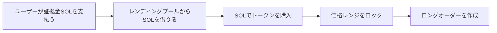
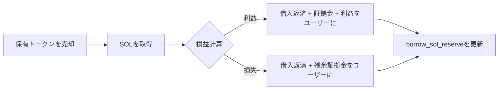
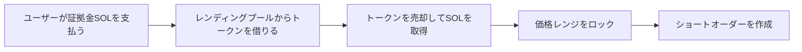
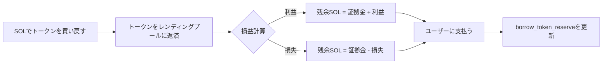
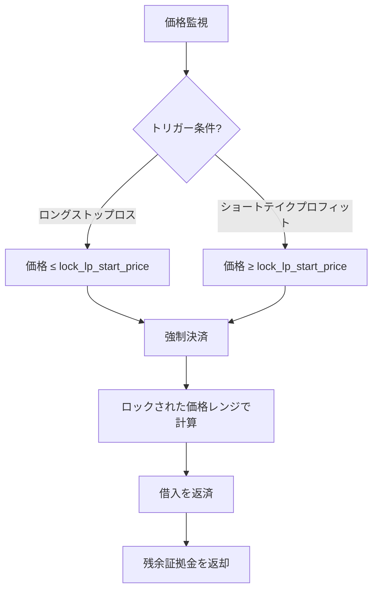
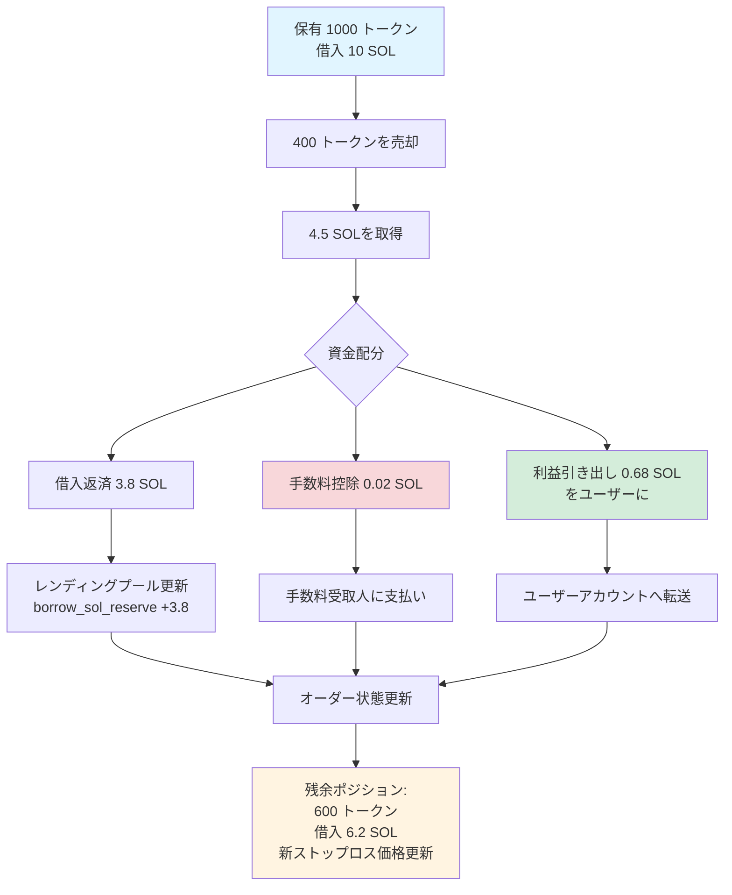
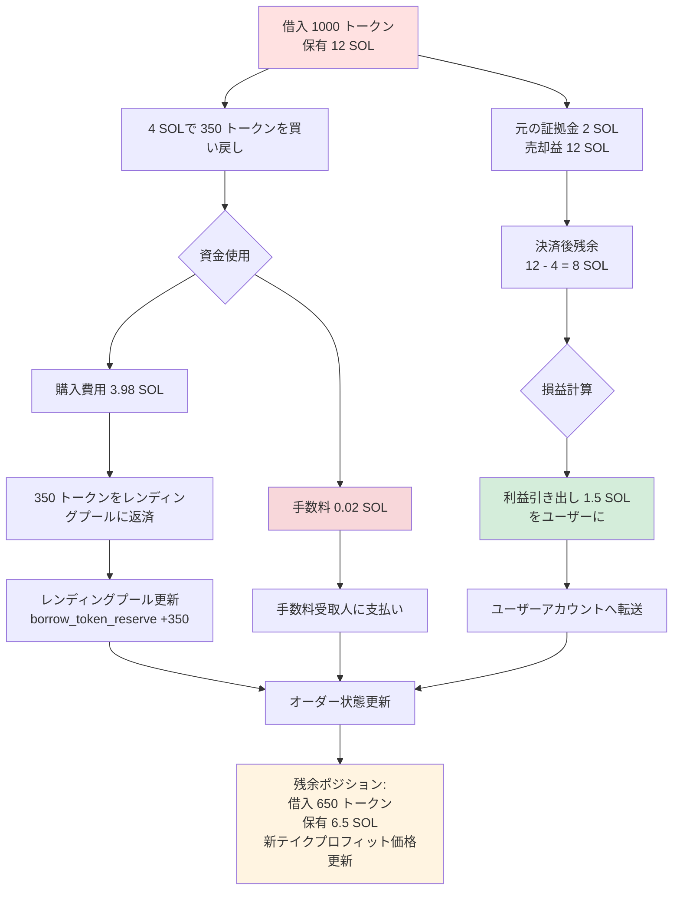

# 🏦 レンディングプール機能の紹介

## 一、📋 概要

PinPetレンディングプールは、レバレッジ取引をサポートする核心モジュールであり、ユーザーにSOLとトークンの貸借サービスを提供し、ロング（買い）とショート（売り）の機能を実現します。レンディングプールは**仮想準備金プール**メカニズムを採用し、スポット取引の流動性プールとは独立しており、レバレッジ取引がスポット市場の正常な運営に影響を与えないことを保証します。

## 二、🎭 レンディングプールの二重の役割

### 2.1 💰 資金プールとして
- **SOLレンディングプール**: ロング取引者にSOLの借入を提供
- **トークンレンディングプール**: ショート取引者にトークンの借入を提供

### 2.2 📦 準備金管理
レンディングプールは2つの独立した仮想準備金を維持します：

| 準備金タイプ | 説明 | 用途 |
|---------|------|------|
| `borrow_sol_reserve` | SOL仮想準備金 | ロング取引者が借用 |
| `borrow_token_reserve` | トークン仮想準備金 | ショート取引者が借用 |

これらの準備金は**仮想台帳**であり、実際の資金はスポット流動性プールに保管され、価格レンジロックメカニズムによって分離が実現されます。

## 三、🔄 レバレッジ取引の貸借フロー

### 3.1 📈 ロング取引 (Long) - SOLを借りてトークンを購入

#### ⬆️ ポジション開設段階


**詳細フロー**:
1. **ユーザー投入**: 証拠金を支払う（例：0.5 SOL）💵
2. **レンディングプール融資**: `borrow_sol_reserve`からSOLを借りる（例：4.5 SOL）💸
3. **取引実行**: 合計5 SOLでAMM上でトークンを購入 ⚙️
4. **価格レンジロック**: 購入時の価格レンジを記録し、決済計算に使用 🔒
5. **オーダー記録**: `MarginOrder`を作成し、借入金額、証拠金、保有トークン数量を記録 📝


#### ⬇️ ポジション決済段階


**資金決済**:
- トークン売却で得たSOL総額 = `output_sol` 💰
- 取引手数料を控除 💸
- レンディングプールへ返済: `borrow_amount`を`borrow_sol_reserve`に返却 ⬅️
- ユーザー収益 = 総額 - 借入 - 証拠金 ✅

### 3.2 📉 ショート取引 (Short) - トークンを借りて売却しSOLに交換

#### ⬆️ ポジション開設段階


**詳細フロー**:
1. **ユーザー投入**: 証拠金SOLを支払う 💵
2. **レンディングプール融資**: `borrow_token_reserve`からトークンを借りる 💎
3. **取引実行**: トークンを売却してSOLを取得し、資金プールに入金 ⚙️
4. **価格レンジロック**: 売却時の価格レンジを記録 🔒
5. **オーダー記録**: `MarginOrder`を作成し、借入トークン数量、証拠金、保有SOLを記録 📝


#### ⬇️ ポジション決済段階


**資金決済**:
- トークン買い戻しに必要なSOL総額 = `required_sol` + 手数料 💰
- レンディングプールへ返済: `borrow_amount`（トークン）を`borrow_token_reserve`に返却 ⬅️
- ユーザー収益 = ポジション開設時の売却SOL - 決済時の購入SOL - 証拠金 ✅

## 四、💸 レンディングプールの返済メカニズム

### 4.1 ✅ 自主決済による返済
ユーザーが自主的に決済する際、システムは自動的に返済を実行します：

| 取引タイプ | 返済資産 | 返済源 | 返却準備金 |
|---------|---------|---------|---------|
| ロング決済 | SOL | トークン売却益 | `borrow_sol_reserve` |
| ショート決済 | トークン | トークン買い戻し | `borrow_token_reserve` |

**返済優先順位**:
1. 取引手数料を控除 💸
2. 借入元本を返済 ⬅️
3. 証拠金を返却 💰
4. 利益を分配/損失を処理 📊

### 4.2 ⚠️ 強制清算による返済
価格がストップロス/テイクプロフィット価格に達した場合、システムは自動的に強制決済します：



**清算保護** 🛡️:
- 価格レンジをロックすることで、市場価格が激しく変動しても、予定価格で決済できることを保証
- 証拠金設計により、レンディングプールの資金安全を確保

### 4.3 ⏰ 期限清算
オーダーの期限後、誰でも決済をトリガーできます：

- ロングオーダー: 満期時刻 `end_time` = ポジション開設時刻 + `borrow_duration` ⏱️
- ショートオーダー: 同上
- 満期後は現在の市場価格で強制決済し、借入を返済 ⚡

## 五、🛡️ レンディングプール資金安全メカニズム

### 5.1 💼 証拠金要件
- **最低証拠金**: `MIN_MARGIN_SOL_AMOUNT`（システムパラメータ）💰
- **証拠金比率**: レバレッジ倍率と価格変動範囲に基づいて動的に計算 📊
- **証拠金用途**: 価格の不利な変動時の損失をカバー 🔒

### 5.2 🔐 価格レンジロック
各オーダーは特定の価格レンジの流動性をロックします：

```
ロングロック: [lock_lp_start_price, lock_lp_end_price]（価格下落レンジ）
ショートロック: [lock_lp_start_price, lock_lp_end_price]（価格上昇レンジ）
```

これにより、決済時に借入を返済するための十分な流動性が確保されます。✅

### 5.3 ✔️ 準備金チェック
ポジション開設前にシステムがチェックします：

| チェック項目 | 条件 | エラーコード |
|-------|------|-------|
| SOL準備金 | `required_borrow_sol ≤ borrow_sol_reserve` | `InsufficientBorrowingReserve` |
| トークン準備金 | `required_borrow_token ≤ borrow_token_reserve` | `InsufficientBorrowingReserve` |


## 六、💸 手数料メカニズム

### 6.1 📊 レバレッジ取引手数料
- **手数料率**: `borrow_fee`（例：0.5% = 50ベーシスポイント）💰
- **徴収タイミング**: ポジション開設時と決済時の両方で徴収 ⏰
- **費用配分**:
  - パートナー: `fee_split`比率（例：80%）🤝
  - 技術提供者: 100% - `fee_split`（例：20%）⚙️

### 6.2 ⚡ 強制清算手数料
- 清算トリガー時に追加で`borrow_fee`を清算手数料として徴収 💸
- 第三者による期限清算の実行を促すインセンティブとして使用 🎯

## 七、🎯 部分決済機能

ユーザーは部分決済により、柔軟にリスクを管理できます：⚙️

### 7.1 📈 ロング部分決済



**オーダー更新詳細**:

| フィールド | 決済前 | 決済後 | 説明 |
|-----|-------|-------|------|
| `position_asset_amount` | 1000 トークン | 600 トークン | 残余ポジション |
| `borrow_amount` | 10 SOL | 6.2 SOL | 残余借入 |
| `lock_lp_start_price` | 元のストップロス価格 | 新ストップロス価格 | 新ポジションに基づいて再計算 |
| `realized_sol_amount` | 0 SOL | 0.68 SOL | 実現利益の累計 |

### 7.2 📉 ショート部分決済



**オーダー更新詳細**:

| フィールド | 決済前 | 決済後 | 説明 |
|-----|-------|-------|------|
| `borrow_amount` | 1000 トークン | 650 トークン | 残余借入（トークン）|
| `position_asset_amount` | 12 SOL | 6.5 SOL | 残余保有SOL |
| `lock_lp_start_price` | 元のテイクプロフィット価格 | 新テイクプロフィット価格 | 新ポジションに基づいて再計算 |
| `realized_sol_amount` | 0 SOL | 1.5 SOL | 実現利益の累計 |

### 7.3 ⚠️ 最小ポジション制限
部分決済後の残余ポジションは `MIN_TRADE_TOKEN_AMOUNT * 2` 以上でなければならず、清算不可能な微小ポジションの発生を防ぎます。

## 八、🔗 レンディングプールと流動性プールの関係

### 8.1 🔒 資金分離
- **スポット流動性プール**: `lp_sol_reserve` + `lp_token_reserve`
- **貸借仮想プール**: `borrow_sol_reserve` + `borrow_token_reserve`

実際の資金は同じ`pool_sol_account`と`pool_token_account`にありますが、価格レンジロックメカニズムによって論理的に分離されています。🛡️

### 8.2 🔄 価格同期
- スポット取引とレバレッジ取引は同じ`price`（現在の市場価格）を共有 💹
- 価格更新後、システムは流動性準備金を再計算：`price_to_reserves(price)` ⚙️

### 8.3 🤝 流動性の相互補完
- レバレッジ取引でロックされた価格レンジはスポット取引に参加しない 🔐
- スポット取引はレバレッジオーダーの強制決済をトリガーし、流動性を解放できる ⚡

## 九、✨ 主な利点

| 特徴 | 説明 | 利点 |
|-----|------|------|
| 仮想準備金 | レンディングプールは台帳記録であり、実際の資金プールではない | 資金効率が高く、追加資金投入不要 |
| 価格レンジロック | 決済価格が予測可能 | 清算リスクを低減し、レンディングプールを保護 |
| 双方向貸借 | SOLとトークンの双方向貸借をサポート | ロングとショート機能が完全 |
| 部分決済 | 柔軟にポジションを調整 | ユーザー体験が良く、リスク管理可能 |
| 期限清算 | 時間制限 + 第三者インセンティブ | 資金の適時返済を確保 |


