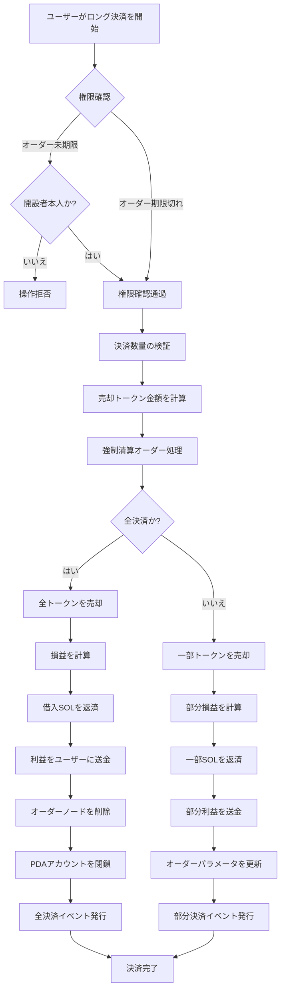
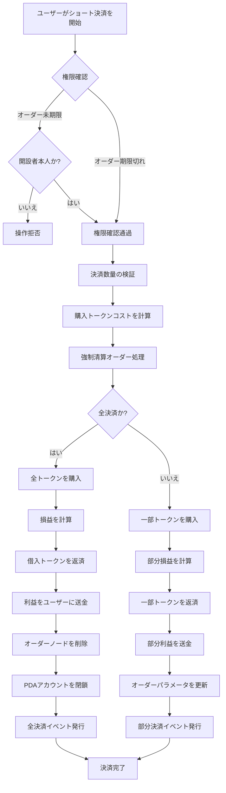

# 💼 PinPet レバレッジポジション決済機能製品紹介

## 1. 📋 機能概要

### 🤔 ポジション決済とは？

ポジション決済とは、ユーザーが保有しているレバレッジ取引のポジションを閉じる操作のことです。PinPetプラットフォームでは、ユーザーがポジションを開くと証拠金オーダーが作成され、貸借関係とポジション情報が記録されます。ポジション決済操作により、そのオーダーが決済され、借入金が返済され、損益がユーザーに清算されます。

### 💡 なぜポジション決済が必要か？

| 決済理由 | 説明 |
|---------|------|
| **🎯 利益確定/損切り** | ユーザーが自発的にポジションを決済し、利益を確保または損失を制限 |
| **⏰ オーダー期限切れ** | 期限切れ後は誰でも決済をトリガーでき、貸借リソースを返還 |
| **💰 資金管理** | 証拠金を解放し、取引戦略を柔軟に調整 |
| **🛡️ リスク管理** | 市場変動によるより大きな損失を回避 |

### 📊 決済タイプ

- **🔚 全決済**：一度にポジション全体を閉じ、全損益を清算
- **✂️ 部分決済**：ポジションを分割して閉じ、部分的に利益を実現し、残りのポジションを保持

## 2. 📈 ロングポジション決済機能 (Close Long)

### 📝 機能説明

ロングポジション決済の本質は**トークンを売却する**操作です。ユーザーは以前にロングポジションを開く際にSOLを借りてトークンを購入しました。決済時にはトークンを売却してSOLに交換し、借入金を返済する必要があります。

### 🔄 操作フロー図



### ⚙️ 主要パラメータ説明

| パラメータ名 | 用途説明 | 例 |
|---------|---------|--------|
| `sell_token_amount` | 売却したいトークン数量（非正確値、わずかな誤差の可能性あり） | 1000000 (1 トークン) |
| `min_sol_output` | 売却後に期待する最小SOL数量（スリッページ保護） | 50000000 (0.05 SOL) |
| `prev_order_id` | リンクリスト内の前のオーダーのインデックス位置 | 2 |
| `close_order_id` | 決済するオーダーのオーダー配列内のインデックス | 5 |
| `next_order_id` | リンクリスト内の次のオーダーのインデックス位置 | 7 |
| `close_order_address` | 決済オーダーのアドレス（セキュリティ検証用） | "Abc123..." |

### 🧮 損益計算説明

#### 🔚 全決済シナリオ

**計算式**：

```
利益 SOL = (売却で得たSOL) + (証拠金SOL) - (借入SOL)
```

**計算手順**：
1. 保有する全トークンを売却し、SOLを取得（手数料控除後）
2. ポジション開設時に納付した証拠金を加算
3. ポジション開設時に借入したSOLを減算
4. 正数は利益、負数は損失

#### ✂️ 部分決済シナリオ

**計算式**：

```
当回利益 = (当回売却SOL) + (総証拠金) + (残存トークン将来売却可能SOL) - (総借入SOL)
```

**計算手順**：
1. 今回売却したトークンで得たSOLを計算
2. 残存トークンが新しい損切り価格で売却できるSOLを計算（手数料控除後）
3. 総資産 = 今回の収入 + 証拠金 + 残存可能収入
4. 総借入金を減算し、部分利益を算出
5. 部分的に借入金を返済し、残りの証拠金でポジションを継続

### 💹 損益シナリオ比較

| シナリオ | 開設価格 | 決済価格 | 保有トークン | 借入SOL | 証拠金 | 売却収入SOL | 損益結果 |
|------|---------|---------|---------|---------|--------|-------------|---------|
| **🟢 利益シナリオ** | 0.05 SOL | 0.08 SOL | 100 Token | 5 SOL | 0.5 SOL | 8 SOL | +2.5 SOL |
| **🔴 損失シナリオ** | 0.05 SOL | 0.03 SOL | 100 Token | 5 SOL | 0.5 SOL | 3 SOL | -1.5 SOL |
| **⚖️ 均衡シナリオ** | 0.05 SOL | 0.055 SOL | 100 Token | 5 SOL | 0.5 SOL | 5.5 SOL | 0 SOL |

## 3. 📉 ショートポジション決済機能 (Close Short)

### 📝 機能説明

ショートポジション決済の本質は**トークンを購入する**操作です。ユーザーは以前にショートポジションを開く際にトークンを借りて売却しSOLを取得しました。決済時にはSOLでトークンを買い戻して借入金を返済する必要があります。

### 🔄 操作フロー図



### ⚙️ 主要パラメータ説明

| パラメータ名 | 用途説明 | 例 |
|---------|---------|--------|
| `buy_token_amount` | 購入したいトークン数量 | 1000000 (1 トークン) |
| `max_sol_amount` | 支払いを希望する最大SOL数量（スリッページ保護） | 60000000 (0.06 SOL) |
| `prev_order_id` | リンクリスト内の前のオーダーのインデックス位置 | 1 |
| `close_order_id` | 決済するオーダーのオーダー配列内のインデックス | 3 |
| `next_order_id` | リンクリスト内の次のオーダーのインデックス位置 | 6 |
| `close_order_address` | 決済オーダーのアドレス（セキュリティ検証用） | "Def456..." |

### 🧮 損益計算説明

#### 🔚 全決済シナリオ

**計算式**：

```
利益 SOL = (開設時トークン売却収入SOL 手数料含む) - (決済時トークン買戻しコストSOL) - (手数料)
```

**計算手順**：
1. SOLで借入した全トークンを買い戻す
2. 借入トークンを貸借プールに返済
3. 計算：開設時売却収入 - 決済時購入コスト - 手数料
4. 正数は利益、負数は損失

#### ✂️ 部分決済シナリオ

**計算式**：

```
当回利益 = (今回買戻し区間 手数料含む) - (実際買戻しコストSOL) - (買戻し手数料)
```

**計算手順**：
1. 今回部分的にトークンを買い戻すコストを計算（手数料含む）
2. 残存トークンの将来の買戻しコストを計算（手数料含む）
3. 当回利益 = 今回支払うべき - 実際のコスト
4. 部分的にトークンを返済し、オーダーパラメータを更新
5. 残りの証拠金でポジションを継続

### 💹 損益シナリオ比較

| シナリオ | 開設価格 | 決済価格 | 借入トークン | 売却収入SOL | 証拠金 | 買戻しコストSOL | 損益結果 |
|------|---------|---------|---------|-------------|--------|-------------|---------|
| **🟢 利益シナリオ** | 0.08 SOL | 0.05 SOL | 100 Token | 8 SOL | 0.5 SOL | 5 SOL | +2.5 SOL |
| **🔴 損失シナリオ** | 0.05 SOL | 0.08 SOL | 100 Token | 5 SOL | 0.5 SOL | 8 SOL | -2.5 SOL |
| **⚖️ 均衡シナリオ** | 0.06 SOL | 0.06 SOL | 100 Token | 6 SOL | 0.5 SOL | 6 SOL | -0.06 SOL (手数料) |

## 4. ⏰ 決済タイミングと戦略

### 🎯 自発的決済タイミング

| タイミングタイプ | 適用シナリオ | 推奨戦略 |
|---------|---------|---------|
| **📈 利益確定決済** | 価格が期待目標に到達 | 部分決済で利益を確保し、残りのポジションを継続保有 |
| **🛑 損切り決済** | 価格が損切りラインを下回る | 速やかに全決済し、損失を抑制 |
| **🔧 ポジション調整** | 市場トレンドの変化 | 減仓または増仓で、ポジション構造を最適化 |
| **⏳ 期限前決済** | オーダー期限が近づく | 自発的に決済し、強制清算を回避 |

### ⚡ 受動的決済（強制清算）

**トリガー条件**：
- ⏰ オーダーの期限が過ぎた
- 👥 任意のユーザーが清算をトリガー可能
- 💵 清算者は一定の手数料報酬を獲得可能

**⚠️ リスク警告**：
- 📉 期限切れ後、不利な価格で強制決済される可能性
- 💡 期限前にポジションを自発的に管理することを推奨

## 5. 📖 使用シナリオ例

### 🟢 シナリオ1：ロング利益決済

**背景**：
- ユーザーが0.05 SOLの価格でロングし、100トークンを購入
- 4.5 SOLを借入し、0.5 SOLの証拠金を納付
- 現在価格が0.08 SOLに上昇

**操作**：
1. ユーザーが全決済で利益を確保することを決定
2. 100トークンを売却し、約8 SOL（手数料控除後）を取得
3. 4.5 SOLの借入金を返済
4. 0.5 SOLの証拠金を回収
5. 純利益：8 - 4.5 + 0.5（証拠金は開設時に計上済み） = 約3 SOL

**✅ 結果**：60%の収益率を成功裏に実現

### 🔴 シナリオ2：ショート損切り決済

**背景**：
- ユーザーが0.05 SOLの価格でショートし、100トークンを借りて売却し、5 SOLを取得
- 0.5 SOLの証拠金を納付
- 価格が0.08 SOLに上昇し、損切り価格に到達

**操作**：
1. ユーザーが緊急損切り決済
2. 8 SOLで100トークンを買い戻す（手数料含む）
3. 100トークンを貸借プールに返済
4. 証拠金0.5 SOL + 開設時収入5 SOL = 5.5 SOL利用可能資金
5. 純損失：5.5 - 8 = -2.5 SOL

**✅ 結果**：適時損切りで、より大きな損失を回避

### ✂️ シナリオ3：部分決済によるポジション調整

**背景**：
- ユーザーがロングで200トークンを保有
- 価格が既に30%上昇
- ユーザーは部分的に利益を確保したいが、後市に期待して継続保有

**操作**：
1. 100トークンを部分決済
2. 部分的にSOL借入金を返済
3. 部分利益をアカウントに取得
4. 残り100トークンでポジションを継続
5. オーダーパラメータを更新し、損切り価格を調整

**✅ 結果**：柔軟なポジション管理戦略を実現

## 6. ⚠️ 注意事項と制限

### 🚫 操作制限

| 制限タイプ | 具体的要件 | 説明 |
|---------|---------|------|
| **🔐 権限検証** | オーダー未期限時は開設者のみが決済可能 | ユーザー資産のセキュリティを保護 |
| **💳 決済アドレス** | 開設者のウォレットアドレスである必要がある | 資金は元のアドレスにのみ戻る |
| **📏 最小取引量** | 部分決済時は最小取引量の2倍以上 | ダストオーダーを回避 |
| **📊 残存数量** | 部分決済後の残存は最小取引量以上 | オーダーの有効性を保証 |

### ⚠️ リスク警告

#### 📉 スリッページリスク
- 決済時の実際の約定価格が期待と異なる可能性
- 合理的なスリッページ保護パラメータの設定を推奨
- 大口決済時はスリッページの影響がより顕著

#### 💸 手数料コスト
- 決済毎に取引手数料が必要
- 頻繁な決済はコストを増加させる
- 部分決済は2回の手数料が必要（今回 + 将来の全決済）

#### ⏰ 時間リスク
- 期限切れ後は誰でも決済をトリガー可能
- 不利な価格で清算される可能性
- 期限が近づくオーダーの事前管理を推奨

#### 🌊 市場リスク
- 価格の急激な変動により決済タイミングが不適切になる可能性
- 極端な相場では強制決済が発生する可能性
- 合理的な損切りラインの設定を推奨

### 💡 ベストプラクティス推奨

1. **🛡️ 合理的な損切り設定**：開設時に損切り価格を計画し、厳格に実行
2. **✂️ 分割決済**：大口ポジションは分割決済を推奨し、市場への影響を軽減
3. **⏰ 期限時間の注意**：期限が近づくオーダーは1-2日前に自発的に管理
4. **💰 手数料管理**：過度に頻繁な部分決済操作を回避
5. **📊 市場深度の監視**：大口決済前に市場流動性を確認

### 🔒 技術セキュリティ保証

- **✅ アドレス検証**：決済時にオーダーアドレスを検証し、誤操作を防止
- **🔐 権限チェック**：多重権限検証により、承認されたユーザーのみが操作可能
- **🛡️ オーバーフロー保護**：全数値計算は安全なcheckedメソッドを使用
- **⚛️ アトミック操作**：決済プロセス中の全ステップをアトミックに実行し、状態の不整合を防止

---

## 📚 付録：用語解説

| 用語 | 解説 |
|------|------|
| **PDA** | Program Derived Address、プログラム派生アドレス、オーダーデータの保存に使用 |
| **証拠金** | ユーザーが開設時に納付するSOL、リスク保証として機能 |
| **貸借プール** | レバレッジ資金を提供する仮想プール |
| **損切り価格** | オーダーが強制決済される価格閾値 |
| **手数料割引** | 条件を満たした後に享受する手数料優遇 |
| **強制清算** | オーダー期限切れ後に自動決済されるメカニズム |
| **リンクリストノード** | オーダーがリンクリスト内にある位置、複数のオーダーを効率的に管理するために使用 |

---

*本ドキュメントは製品機能紹介であり、技術実装の詳細は含まれていません。技術実装について詳しく知りたい場合は、プロジェクトコードおよび技術ドキュメントを参照してください。*
