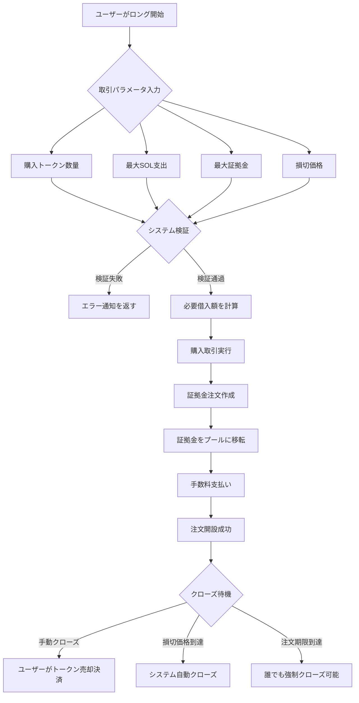
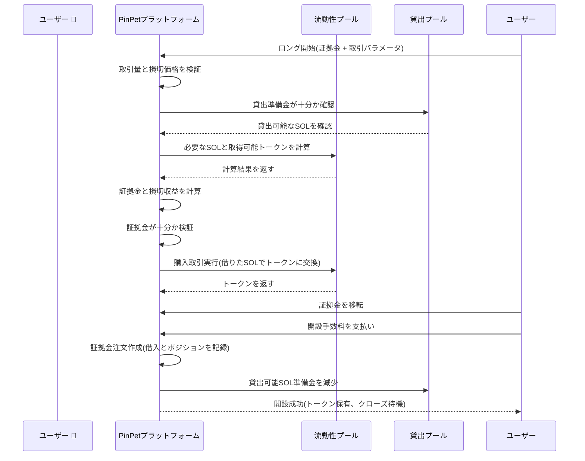
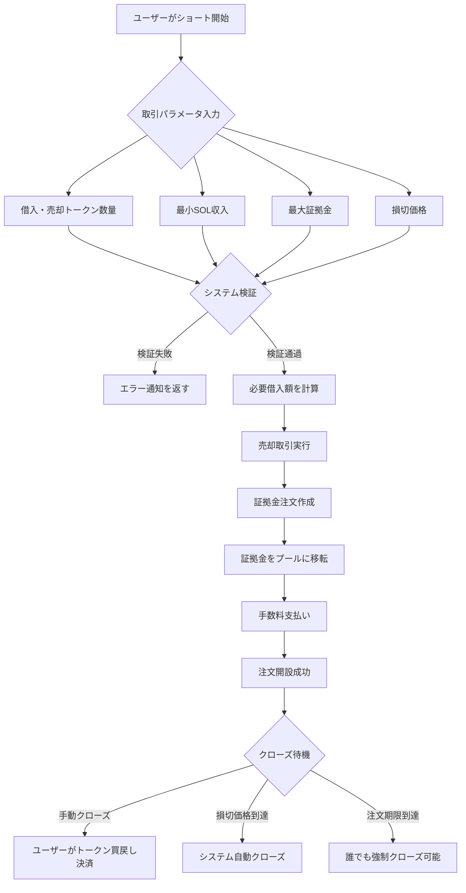
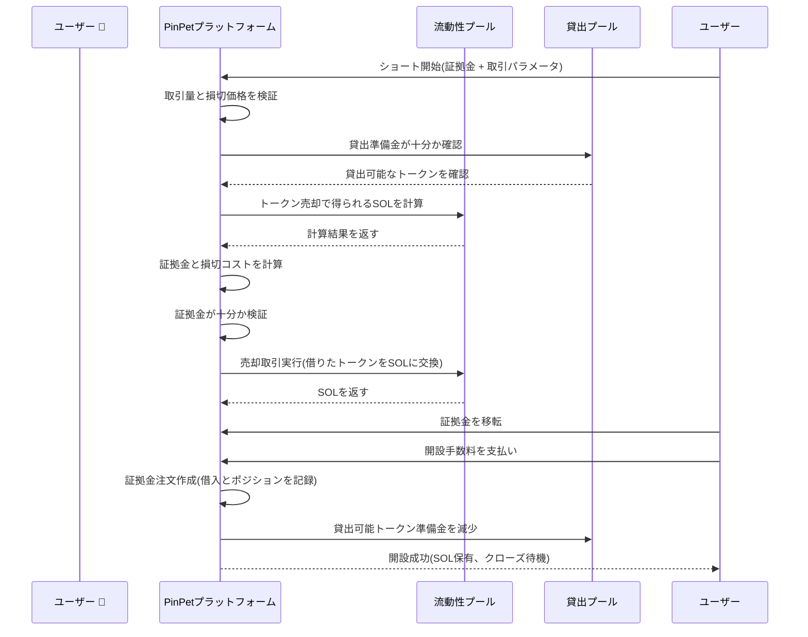
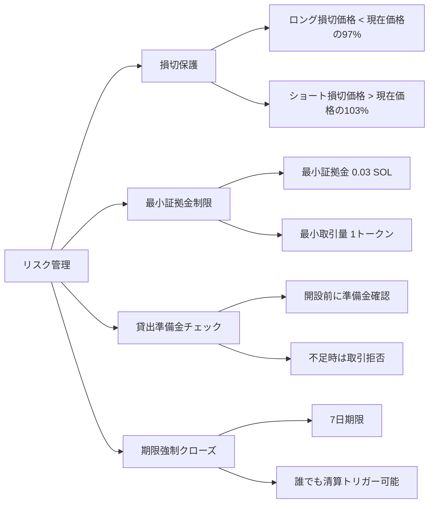

# 📊 PinPet レバレッジ開設機能製品紹介

## 1. 機能概要 🎯

### レバレッジ取引とは 💹

レバレッジ取引は、借入資金を利用して取引規模を拡大する金融ツールであり、ユーザーが少ない証拠金でより大きな価値の資産を制御できるようにします。PinPetプラットフォームは、ロング(買い)とショート(売り)の2種類のレバレッジ取引方法を提供し、ユーザーがトークン価格の上昇または下落時に利益を得ることができます。

### 核心概念 💡

- **証拠金(Margin)** 💰: ユーザー自身が投入するSOL資金で、取引の担保となる
- **借入(Borrow)** 💵: プラットフォームから借り入れる資産(ロングはSOLを借り、ショートはトークンを借りる)
- **損切価格(Stop Loss Price)** 🛡️: 価格がこのレベルに達すると、システムが自動的にポジションをクローズしてリスクを制御する
- **ポジションクローズ(Close Position)** 🔄: 借入を返済し、損益を決済する操作

### レバレッジタイプ 📈📉

| 取引タイプ | 市場予測 | 借入資産 | 保有資産 | 利益条件 |
|---------|---------|---------|---------|---------|
| ロング(Long) 🟢 | 上昇予測 ⬆️ | SOLを借りる | トークンを保有 | トークン価格上昇 |
| ショート(Short) 🔴 | 下落予測 ⬇️ | トークンを借りる | SOLを保有 | トークン価格下落 |

---

## 2. ロング取引(Long)🟢📈

### 機能説明 ✨

ロングとは、ユーザーがトークンの将来価格上昇を予測し、プラットフォームからSOLを借りてより多くのトークンを購入し、価格上昇後にトークンを売却して借入を返済し利益を得ることです。

### ユーザー操作フロー 🔄



### ロング取引フロー図 📋



### 主要パラメータ説明 📝

| パラメータ名 | 説明 | 例示値 | 制約条件 |
|---------|------|--------|---------|
| buy_token_amount | 購入希望トークン数量 | 1,000,000(1トークン) | 最小取引量(1トークン)以上 |
| max_sol_amount | 支払う最大SOL数量 | 100,000,000(0.1 SOL) | 実際はより少ない可能性あり(スリッページ保護) |
| margin_sol_max | ユーザーが投入する最大証拠金 | 50,000,000(0.05 SOL) | 0.03 SOL以上 |
| close_price | 損切価格(自動クローズトリガー価格) | 現在価格の95% | 現在価格の97%以下でなければならない |
| borrow_amount | システムが計算する実際の借入量 | 50,000,000(0.05 SOL) | 貸出プール準備金を超えない |
| position_asset_amount | ポジショントークン数量 | 1,000,000(1トークン) | 購入したトークン数量と同じ |

### 証拠金計算ロジック 🧮

証拠金の役割は、ユーザーが損切クローズ時に借入を返済できることを保証することです。計算式は以下の通りです:

```
実際の証拠金 = トークン購入総費用 - 損切クローズ時の収益(手数料控除後)
```

**例示説明:**

現在のトークン価格が0.1 SOL/Tokenと仮定:

1. ユーザーは1トークンを購入したい、約0.1 SOLが必要
2. ユーザーは証拠金0.05 SOLを投入し、0.05 SOLを借り入れる
3. 損切価格を0.095 SOL/Token(現在価格の95%)に設定
4. システム計算: 0.095価格で1トークンを売却すると、手数料控除後約0.0945 SOLを得る
5. 証拠金計算: 0.1 - 0.0945 = 0.0055 SOL(実際に必要な証拠金)
6. ユーザーが提供する0.05 SOLは0.0055 SOLより大きく、開設条件を満たす

### リスク警告 ⚠️

- **損切トリガー** 🛑: トークン価格が損切価格まで下落すると、システムが自動的にトークンを売却して借入を返済し、ユーザーは証拠金を失う
- **注文期限** ⏰: 貸出期間(デフォルト7日)を超えてクローズしない場合、誰でも強制クローズでき、ユーザーは速やかに手動でクローズする必要がある
- **借入コスト** 💸: 開設とクローズの両方で手数料が発生(デフォルト0.25%)

---

## 3. ショート取引(Short)🔴📉

### 機能説明 ✨

ショートとは、ユーザーがトークンの将来価格下落を予測し、プラットフォームからトークンを借りて即座に売却してSOLに交換し、価格下落後にトークンを買い戻して借入を返済し利益を得ることです。

### ユーザー操作フロー 🔄



### ショート取引フロー図 📋



### 主要パラメータ説明 📝

| パラメータ名 | 説明 | 例示値 | 制約条件 |
|---------|------|--------|---------|
| borrow_sell_token_amount | 借入・売却希望トークン数量 | 1,000,000(1トークン) | 最小取引量(1トークン)以上 |
| min_sol_output | 売却後に得る最小SOL | 90,000,000(0.09 SOL) | 実際はより多い可能性あり(スリッページ保護) |
| margin_sol_max | ユーザーが投入する最大証拠金 | 50,000,000(0.05 SOL) | 0.03 SOL以上 |
| close_price | 損切価格(自動クローズトリガー価格) | 現在価格の105% | 現在価格の103%以上でなければならない |
| borrow_amount | システムが計算する実際の借入量 | 1,000,000(1トークン) | 貸出プール準備金を超えない |
| position_asset_amount | ポジションSOL数量 | 95,000,000(0.095 SOL) | 売却後に得たSOL(手数料控除後)と同じ |

### 証拠金計算ロジック 🧮

ショートの証拠金は、ユーザーが損切クローズ時にトークンを買い戻して借入を返済できることを保証するために使用されます。計算式は以下の通りです:

```
実際の証拠金 = 損切クローズ時の買戻しコスト(手数料含む) - 売却時の収益(手数料控除後)
```

**例示説明:**

現在のトークン価格が0.1 SOL/Tokenと仮定:

1. ユーザーは1トークンを借りて売却し、手数料控除後約0.0975 SOLを得る
2. 損切価格を0.105 SOL/Token(現在価格の105%)に設定
3. システム計算: 0.105価格で1トークンを買い戻すと、手数料込みで約0.1053 SOLが必要
4. 証拠金計算: 0.1053 - 0.0975 = 0.0078 SOL(実際に必要な証拠金)
5. ユーザーは少なくとも0.0078 SOLの証拠金を投入する必要がある
6. ユーザーが提供する0.05 SOL証拠金は0.0078 SOLより大きく、開設条件を満たす

### リスク警告 ⚠️

- **損切トリガー** 🛑: トークン価格が損切価格まで上昇すると、システムが自動的にトークンを買い戻して借入を返済し、ユーザーは証拠金を失う
- **無限リスク** ⛔: 理論上、トークン価格は無限に上昇する可能性があり、ショートのリスクはロングより大きい
- **注文期限** ⏰: 貸出期間(デフォルト7日)を超えてクローズしない場合、誰でも強制クローズ可能
- **借入コスト** 💸: 開設とクローズの両方で手数料が発生(デフォルト0.25%)

---

## 4. レバレッジ取引のリスクと収益 📊💰

### 収益拡大効果 📈💎

レバレッジ取引の核心的な利点は、少ない元本でより大きな資産規模を制御し、収益を拡大できることです。

**ロング収益例:**

ユーザーが0.05 SOL証拠金を投入して1トークンをロングすると仮定:

| シナリオ | 開設価格 | クローズ価格 | ポジション価値 | 返済額 | 純収益 | 収益率 |
|------|--------|--------|----------|----------|--------|--------|
| 小幅上昇 | 0.1 | 0.11 | 0.11 SOL | 0.05 SOL | 0.06 SOL | +120% |
| 大幅上昇 | 0.1 | 0.15 | 0.15 SOL | 0.05 SOL | 0.10 SOL | +200% |
| 小幅下落 | 0.1 | 0.095 | 0.095 SOL | 0.05 SOL | 0.045 SOL | -10% |
| 損切トリガー | 0.1 | 0.095 | 0.095 SOL | 0.05 SOL | 0.045 SOL | -10% |

**ショート収益例:**

ユーザーが0.05 SOL証拠金を投入して1トークンをショートすると仮定:

| シナリオ | 開設価格 | クローズ価格 | ポジション価値 | 買戻しコスト | 純収益 | 収益率 |
|------|--------|--------|----------|----------|--------|--------|
| 小幅下落 | 0.1 | 0.09 | 0.0975 SOL | 0.09 SOL | 0.0075 SOL | +15% |
| 大幅下落 | 0.1 | 0.05 | 0.0975 SOL | 0.05 SOL | 0.0475 SOL | +95% |
| 小幅上昇 | 0.1 | 0.105 | 0.0975 SOL | 0.105 SOL | -0.0075 SOL | -15% |
| 損切トリガー | 0.1 | 0.105 | 0.0975 SOL | 0.1053 SOL | -0.0078 SOL | -16% |

### リスク要因 ⚠️

#### 1. 価格変動リスク 📉📈

- **ロングリスク** 🟢: トークン価格が損切価格を超えて下落すると、全証拠金を失う
- **ショートリスク** 🔴: トークン価格が損切価格を超えて上昇すると、全証拠金を失う
- **激しい変動** ⚡: 短時間での大幅な価格変動により迅速な損切が発生する可能性がある

#### 2. 流動性リスク 💧

- **貸出プール枯渇** 📛: 貸出プール準備金が不足すると、開設できない
- **スリッページ損失** 📊: 取引量が過大だと実際の約定価格が予想から乖離する可能性がある

#### 3. 時間リスク ⏰

- **注文期限** 🔔: 7日を超えてクローズしない場合、誰でも強制クローズでき、不利な価格で清算される可能性がある
- **ポジション保有コスト** 💸: 長期保有には時間コストと市場の不確実性を負担する必要がある

#### 4. システムリスク 🔧

- **価格計算** 🧮: 定数積アルゴリズムに基づいており、大口取引は大きなスリッページに直面する可能性がある
- **手数料累積** 💰: 複数回の開閉で手数料が累積し、利益を侵食する

### リスク管理措置 🛡️

PinPetプラットフォームは複数のリスク管理メカニズムを提供します:



---

## 5. 使用シナリオ例 💼

### シナリオ1: 上昇予測でロング 🟢⬆️

**背景** 📖: 太郎さんはあるMemeトークンに上昇トレンドを見て、現在価格は0.1 SOL

**操作手順** 🎯:
1. 太郎さんは0.1 SOL証拠金を投入
2. 0.1 SOLを借り入れる(プラットフォームから借りる)
3. 合計0.2 SOLで2トークンを購入
4. 損切価格を0.095 SOL(この価格を下回ると自動損切)に設定

**利益状況** 💰📈: トークンが0.15 SOLに上昇
- 2トークンを売却して0.3 SOLを得る(手数料控除後約0.2985 SOL)
- 借入0.1 SOLを返済、残り0.1985 SOL
- 証拠金0.1 SOLを差し引き、純利益0.0985 SOL(約+98.5%)

**損切状況** 🛑📉: トークンが0.095 SOLに下落(損切トリガー)
- 自動的に2トークンを売却して0.19 SOLを得る(手数料控除後約0.1895 SOL)
- 借入0.1 SOLを返済、残り0.0895 SOL
- 証拠金損失 0.1 - 0.0895 = 0.0105 SOL(約-10.5%)

### シナリオ2: 下落予測でショート 🔴⬇️

**背景** 📖: 花子さんはあるトークン価格が高すぎると考え、現在価格は0.2 SOL、ショートを準備

**操作手順** 🎯:
1. 花子さんは0.15 SOL証拠金を投入
2. 1トークンを借り入れる(プラットフォームから借りる)
3. 即座に1トークンを売却して0.2 SOLを得る(手数料控除後約0.195 SOL)
4. 損切価格を0.21 SOL(この価格を上回ると自動損切)に設定

**利益状況** 💰📉: トークンが0.15 SOLに下落
- 0.15 SOLで1トークンを買い戻す(手数料込みで約0.1504 SOL)
- 借入1トークンを返済
- 残り 0.195 - 0.1504 = 0.0446 SOL
- 証拠金0.15 SOLを加えて、合計0.1946 SOL(純利益0.0446 SOL、約+29.7%)

**損切状況** 🛑📈: トークンが0.21 SOLに上昇(損切トリガー)
- 自動的に0.21 SOLで1トークンを買い戻す(手数料込みで約0.2105 SOL)
- 借入1トークンを返済
- 支出0.2105 SOL、しかし売却時は0.195 SOLしか得ていない
- 損失0.0155 SOL、証拠金から差し引き(約-10.3%)

### シナリオ3: スイングトレード 🔄📊

**背景** 📖: 次郎さんは短期トレードが得意で、トークン価格が0.08 - 0.12 SOLの範囲で変動する際に繰り返し操作

**戦略** 🎯:
- 価格が0.08 SOL付近の時にロング、損切を0.075 SOLに設定
- 価格が0.12 SOL付近の時にショート、損切を0.125 SOLに設定
- 毎回5-10%の利益が出たら手動でクローズ

**利点** ✅: レバレッジを利用して範囲変動収益を拡大

**リスク** ⚠️: 範囲を突破すると損切される可能性があり、厳格な規律執行が必要

---

## 6. 注意事項と制限 📌

### 取引制限 🔒

| 制限項目 | 数値 | 説明 |
|---------|------|------|
| 最小取引トークン量 | 1 Token(1,000,000最小単位) | 取引量が小さすぎるのを防ぐ |
| 最小証拠金 | 0.03 SOL(30,000,000 lamports) | 意味のある規模の取引を保証 |
| ロング損切価格 | 現在価格の97%以下 | 少なくとも3%の損切スペース |
| ショート損切価格 | 現在価格の103%以上 | 少なくとも3%の損切スペース |
| 最大貸出期間 | 7日(604,800秒) | 期限超過で強制クローズされる可能性 |
| 貸出プール上限 | 流動性プール規模に応じて動的調整 | 準備金不足時は取引拒否 |

### 手数料説明 💸

**手数料タイプ** 📊:
- 開設手数料: デフォルト0.25%(borrow_fee)
- クローズ手数料: デフォルト0.25%(borrow_fee)
- 手数料配分: パートナーと技術プロバイダーが比例配分

**手数料計算** 🧮:
- ロング開設: 購入SOL金額に対して手数料徴収
- ショート開設: 売却SOL金額に対して手数料徴収
- クローズ: 取引額に対して手数料徴収

### ベストプラクティス推奨 💡

#### 1. 適切な損切設定 🛡️

- **過度な欲張りは禁物**: 損切価格を近すぎる(3%下限に近い)設定は避ける
- **バッファスペースを確保**: 短期変動を考慮し、5-10%の損切スペースがより安全
- **タイムリーに利益確定**: 利益が予想に達したら手動でクローズ、強制クローズを待たない

#### 2. ポジションサイズ管理 📊

- **分散投資** 🎯: すべての資金を単一注文に投入しない
- **段階的建玉** ➡️: 複数回小額で開設し、単一リスクを低減
- **資金留保** 💰: 追加証拠金需要に対応するため一部資金を留保(将来機能)

#### 3. 適切なタイミング選択 ⏰

- **流動性充足** 💧: 貸出プール準備金が十分な時に開設を選択
- **激しい変動を避ける** ⚡: 価格の大幅変動時は損切が発生しやすい
- **期限時間に注意** 🔔: 予想保有時間が7日上限に近づかないように

#### 4. 注文状態監視 👀

- **定期チェック** 🔍: 毎日少なくとも一度注文状態を確認
- **価格アラート** 🚨: 価格が損切価格に近づいたら速やかに意思決定
- **手動クローズ** ✅: システム自動損切を待たず、手動クローズでスリッページを回避

### よくある質問 ❓

**Q1: 証拠金は返還されますか?**

A: はい。手動クローズ時、利益があれば証拠金に利益を加えて返還されます。損切がトリガーされた場合、残りの証拠金が返還されます(ゼロの可能性あり)。

**Q2: 事前にクローズできますか?**

A: できます。注文期限前、ユーザーはいつでも手動でクローズでき、追加のペナルティはありません。

**Q3: 注文期限後はどうなりますか?**

A: 注文期限後、誰でも強制クローズをトリガーできます。期限前に手動でクローズして、不利な価格での清算を避けることをお勧めします。

**Q4: 貸出プール準備金不足の場合はどうすればいいですか?**

A: 貸出プール準備金が不足すると、システムは開設を拒否します。他のユーザーがクローズして準備金が解放されるのを待つか、他の取引ペアを選択することをお勧めします。

**Q5: 手数料はどのように計算されますか?**

A: 手数料は取引金額の一定比率(デフォルト0.25%)で徴収されます。開設とクローズでそれぞれ1回徴収され、合計約0.5%のコストになります。

**Q6: 損切価格を調整できますか?**

A: 現在のバージョンでは損切価格の調整をサポートしていません。開設時に慎重に損切価格を設定することをお勧めします。

---

## 7. まとめ 📝

PinPetレバレッジ開設機能は、ユーザーに柔軟なロング・ショートツールを提供し、トークン上昇または下落時に利益を得ることができます。証拠金と損切メカニズムを適切に使用することで、ユーザーは収益を拡大しながらリスクを管理できます。

**核心的利点** ✨:
- **双方向取引** 🔄: ロングもショートも利益を得られる
- **レバレッジ拡大** 📈: 小資金で大きな収益を動かす
- **自動損切** 🛡️: 価格保護メカニズムでリスクを低減
- **柔軟なクローズ** ✅: いつでも手動決済可能

**リスク警告** ⚠️:
- ⛔ レバレッジ取引は高リスクであり、全証拠金を失う可能性があります
- 📚 取引メカニズムを十分に理解してから操作してください
- 💡 小額から始めて、徐々に経験を積むことをお勧めします
- 🚫 許容範囲を超える資金を投入しないでください

取引の成功を祈ります!🎉
