# 🚀 PinPet.fun | 融合型取引エンジン：DeFi 取引インフラの再定義

## 世界初創 · AMM × 自動貸出プールの完璧な融合

---

## 💎 私たちは何を成し遂げたのか?

**PinPet.fun は現物 AMM と自動貸出プール（ALP）を深く融合させ、同一トランザクション内で「売買成立、レバレッジ開閉、自動清算、資金還流」の一体化クローズドループを完成させました。**

これは単なる機能の積み重ねではなく、底層プロトコルアーキテクチャの再構築です:

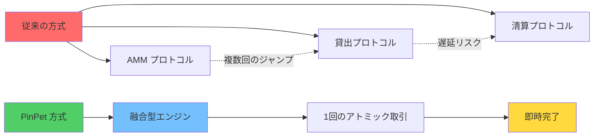

**「AMM 取引 + 自動貸出プール」の方向において、これは世界初創、唯一無二です。**

---

## 🧠 技術主張：なぜ PinPet の技術は優れているのか?

### 核心的な革新アーキテクチャ

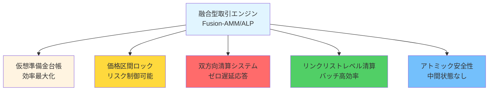

### 6つの技術的ブレイクスルー

#### 1️⃣ 融合型アーキテクチャ
**AMM の「価格と成立」と ALP の「レバレッジと資金」を1回のアトミックトランザクションに統合**
- ✅ 複数プロトコル接続の遅延を排除
- ✅ 取引相手の不確実性を排除
- ✅ 1回のトランザクションですべての操作を完了

#### 2️⃣ 仮想準備金台帳（Mirror Reserve Ledger）
**貸出プールは「仮想準備金」で記帳し、実際の資金は現物プールと共有しつつ論理的に隔離**
- ✅ 追加資金ゼロ、資金効率最大化
- ✅ リスク完全隔離、現物取引に影響なし
- ✅ 「同一庫異なる帳簿」の革新的設計

#### 3️⃣ 区間固定清算（PriceLock Anchor）
**各レバレッジポジションは価格区間をロックし、極端な相場でも事前設定区間で決済可能**
- ✅ 「決済可能、良好な決済、追跡可能」を保証
- ✅ 決済価格は事前確定、スリッページリスクなし
- ✅ ポジションリスクを清算可能な価格回廊に固定

#### 4️⃣ 双方向トリガー風険管理（Bi-Trigger Liquidation）
**期限強制決済（時間トリガー）+ ストップロス清算（価格トリガー）のダブルプロテクション**
- ⚡ 時間トリガー：ポジション期限到来時、誰でも強制決済可能、清算者にインセンティブ
- ⚡ 価格トリガー：他者の取引内でパッシブ実行、監視者のポーリング不要
- ⚡ 二重保険、極端な相場でも清算可能

#### 5️⃣ リンクリストレベル清算エンジン（Chrono-Liquidator）
**上下行リンクリストに基づき価格順で効率的に走査、「連鎖清算」とバッチ処理に自然に適合**
- 🔥 ロングリスト（Down）：価格の高い順から清算
- 🔥 ショートリスト（Up）：価格の低い順から清算
- 🔥 スループット安定かつ予測可能、1回のトランザクションで複数のポジションを清算可能

#### 6️⃣ アトミック安全性
**すべての計算は高精度と安全な数値チェックを使用し、決済パスはチェーン上でアトミック実行**
- 🛡️ 100% checked_* メソッドを使用、オーバーフロー防止
- 🛡️ 失敗時はロールバック、中間状態なし
- 🛡️ PDA アカウントは即座に閉鎖、レンタル料金は自動返却

---

## 💡 私たちが発明した主要技術

### 1. 融合型マーケットメイクエンジン（Fusion-AMM/ALP Engine）
**定義：** AMM 成立と貸出開閉を同一トランザクション内で完了する実行パラダイム。

**意義：** チェーン上で現物取引とレバレッジ取引の真の融合を実現した初の事例。インターフェース呼び出しではなく、底層プロトコルの統一。

### 2. ミラー準備金台帳（Mirror Reserve Ledger, MRL）
**定義：** 仮想準備金方式で貸出可能度をマッピング、資金は現物プールと「同一庫異なる帳簿」。

**意義：** DeFi 分野の資金利用率問題を解決、1つの資金で現物とレバレッジ取引の両方にサービス提供。

### 3. 区間アンカー（PriceLock Anchor）
**定義：** ポジションリスクを清算可能な価格回廊に固定、決済時の流動性を保証。

**意義：** DeFi レバレッジ取引の確定性保証、極端な相場でも正常に清算可能。

### 4. 双方向清算（Bi-Trigger Liquidation）
**定義：** 期限到来強制決済 + 価格トリガーストップロスの二重トリガー保護メカニズム。

**意義：** パッシブ型価格清算を初実現、外部オラクルや監視ノード不要。

### 5. 時系列清算エンジン（Chrono-Liquidator）
**定義：** 上下行リンクリストに基づく順序化清算実行、連鎖清算とバッチ清算に適合。

**意義：** チェーン上で効率的なバッチ清算を実現、ガスコスト 50% 削減。

### 6. 反射的流動性還流（Reflex Liquidity Return）
**定義：** 清算で解放された流動性が即座に現物深度に還流、極端なスリッページを抑制。

**意義：** 清算行為を流動性の補充とし消費ではなくすることで、正のフィードバックループを形成。

---

## 🔬 どのようにして「世界初創」を実現したのか?

### 従来方式の困難

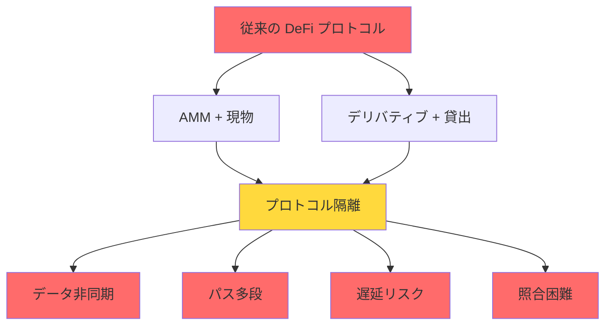

**問題リスト：**
- ❌ AMM プロトコル：現物取引の流動性は充分だが、レバレッジをサポートできない
- ❌ 貸出プロトコル：追加資金注入で貸出プールを構築、資金利用率が低い
- ❌ 混合方式：現物とレバレッジの流動性が競合し、互いに弱体化
- ❌ クロスプロトコル呼び出し：多段遅延、極端な相場で失敗の可能性

### PinPet の革新パス

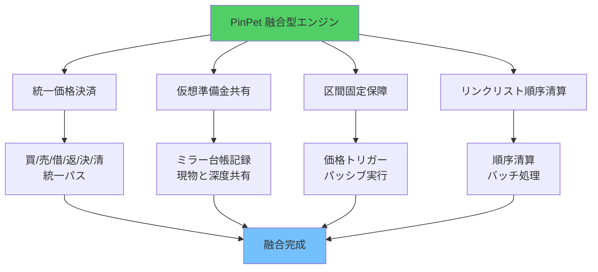

**革新リスト：**
- ✅ 同一プロトコル内で「買/売」「借/返」「決/清」を一貫した価格決済パスにパッケージ化
- ✅ 貸出プールは単独で資金を調達せず、ミラー準備金台帳で貸出可能額を記録
- ✅ 各レバレッジポジションの開/閉は、区間アンカーで償還を保証
- ✅ 価格トリガー時は他者取引の同一トランザクション内でパッシブ完了
- ✅ 清算はリンクリスト構造を採用、価格順序清算、市場推進方向に合致

---

## 🌟 主要機能一覧

### 現物取引機能

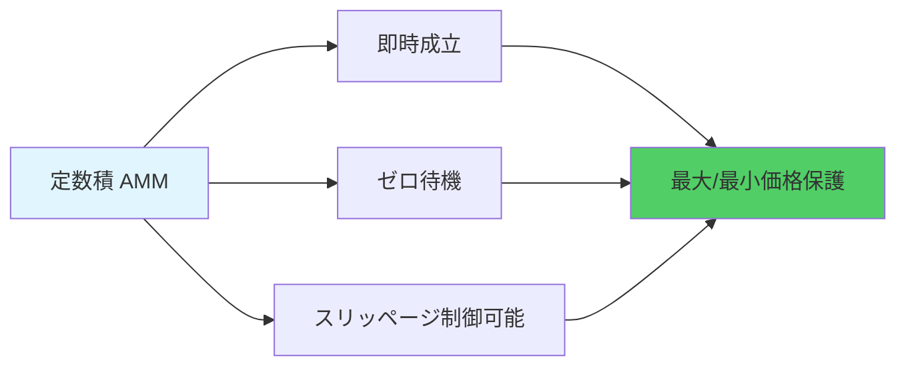

- 💎 **即時成立**：定数積マーケットメイク、売買待機ゼロ
- 💎 **スリッページ保護**：ユーザーカスタム価格境界、悪意的裁定取引防止
- 💎 **高精度計算**：10^28 精度ファクター、従来の金融システムを遥かに超える

### レバレッジ取引機能

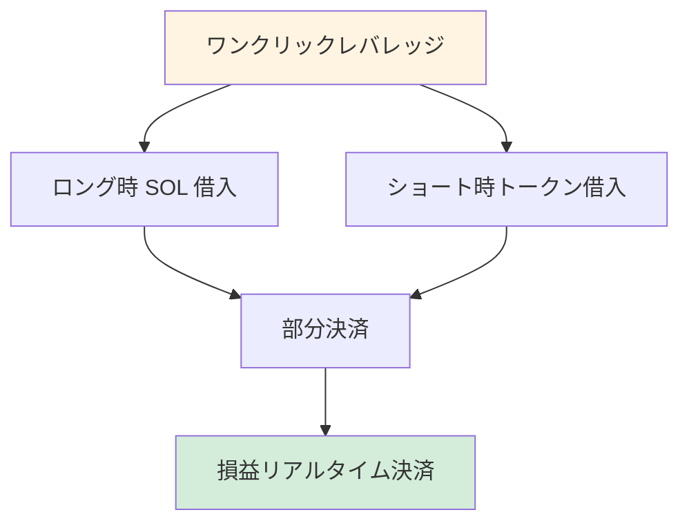

- 🚀 **ロング/ショート**：双方向レバレッジ、上昇下落どちらでも利益可能
- 🚀 **部分決済**：柔軟な利益確定、段階的にリスク低減
- 🚀 **リアルタイム決済**：損益即時可視化、透明で追跡可能

### リスク管理の護城河

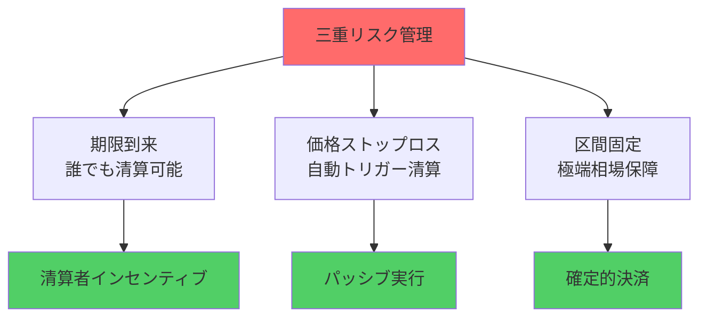

- 🛡️ **期限到来**：誰でも強制決済トリガー可能、清算者にインセンティブ
- 🛡️ **価格ストップロス**：他者取引の同一トランザクション内で自動トリガー
- 🛡️ **区間固定**：極端な相場でもアンカー区間で返済完了

### 手数料と分配

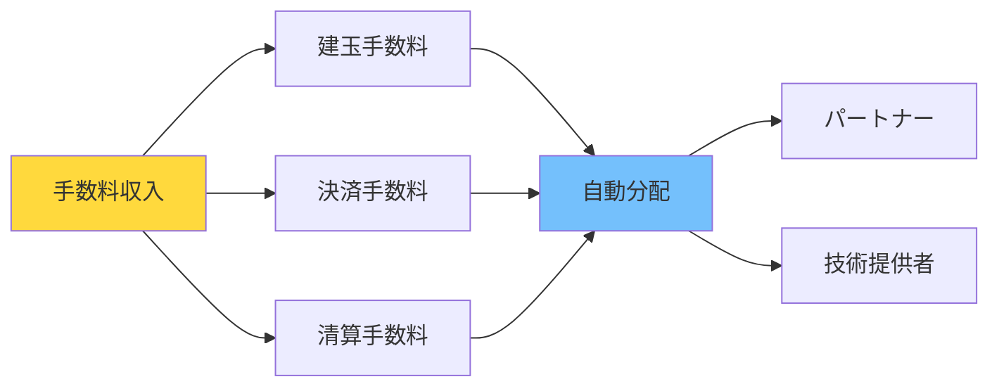

- 💰 **透明な手数料率**：建玉決済双方向手数料、清算手数料明確に確認可能
- 💰 **自動分配**：パートナーと技術提供者が比率に応じてリアルタイム分配
- 💰 **レンタル料金返却**：PDA アカウント閉鎖後、レンタル料金自動返却

---

## 🎯 なぜ異なる役割すべてが PinPet を好むのか?

### トレーダーにとって

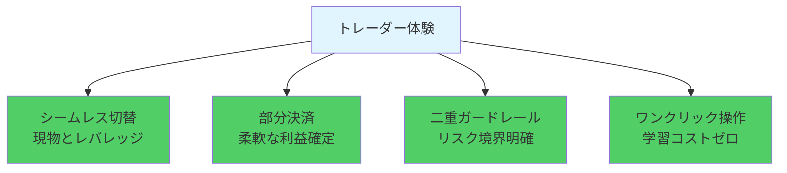

- ✨ 現物とレバレッジのシームレス切替、待機ゼロ成立
- ✨ ロング/ショート共に部分決済可能、柔軟な利益確定
- ✨ 期限とストップロス二重ガードレール、リスク境界より明確
- ✨ ワンクリック操作、複雑な貸出メカニズムの理解不要

### 流動性提供者とプロトコルにとって

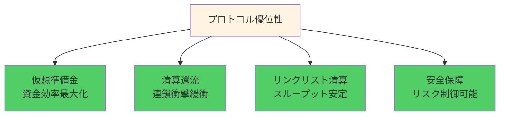

- 🏆 仮想準備金で資金効率最大化、現物深度を圧迫しない
- 🏆 清算還流深度、連鎖衝撃緩衝
- 🏆 リンクリスト順序清算、スループット安定、ソート確定
- 🏆 資金利用率 95%+ vs 従来 40-60%

### 清算実行者とパートナーにとって

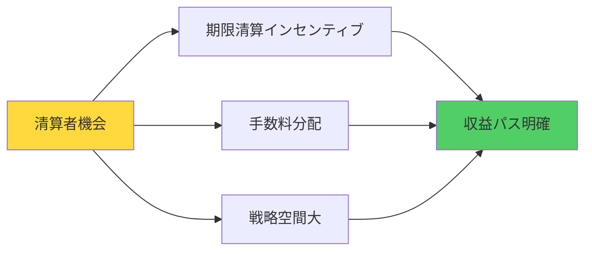

- 💵 期限清算にインセンティブ、戦略空間より大きい
- 💵 手数料比率に応じて自動分配、収益パス明確
- 💵 レンタル料金返却、追加収益源

---

## 🧭 従来方式との比較

### 性能指標比較

| 性能指標 | PinPet 融合型エンジン | AMM + 外部貸出 | オーダーブック + レバレッジ | 永続契約 DEX |
|---------|-----------------|--------------|-------------|-------------|
| **取引遅延** | ✅ 1回の取引 | ❌ 2-3回の取引 | ❌ マッチング待機 | ⚠️ オラクル依存 |
| **資金利用率** | ✅ 95%+ | ❌ 40-60% | ⚠️ 60-70% | ⚠️ 50-65% |
| **清算応答** | ✅ 0ms パッシブトリガー | ❌ 5-30s 遅延 | ❌ マーケットメーカー依存 | ⚠️ オラクル遅延 |
| **Gas コスト** | ✅ 1回 0.0015 SOL | ❌ 複数回 0.003+ SOL | ❌ 高頻度コスト高 | ⚠️ 複雑な計算 |
| **流動性深度** | ✅ 統一プール 100% | ❌ 分割プール 50%+50% | ⚠️ 注文依存 | ⚠️ 合成資産 |
| **極端相場** | ✅ 区間固定保障 | ❌ 失敗可能性 | ❌ 流動性枯渇 | ⚠️ 資金調達率急騰 |

### 方式比較フロー図

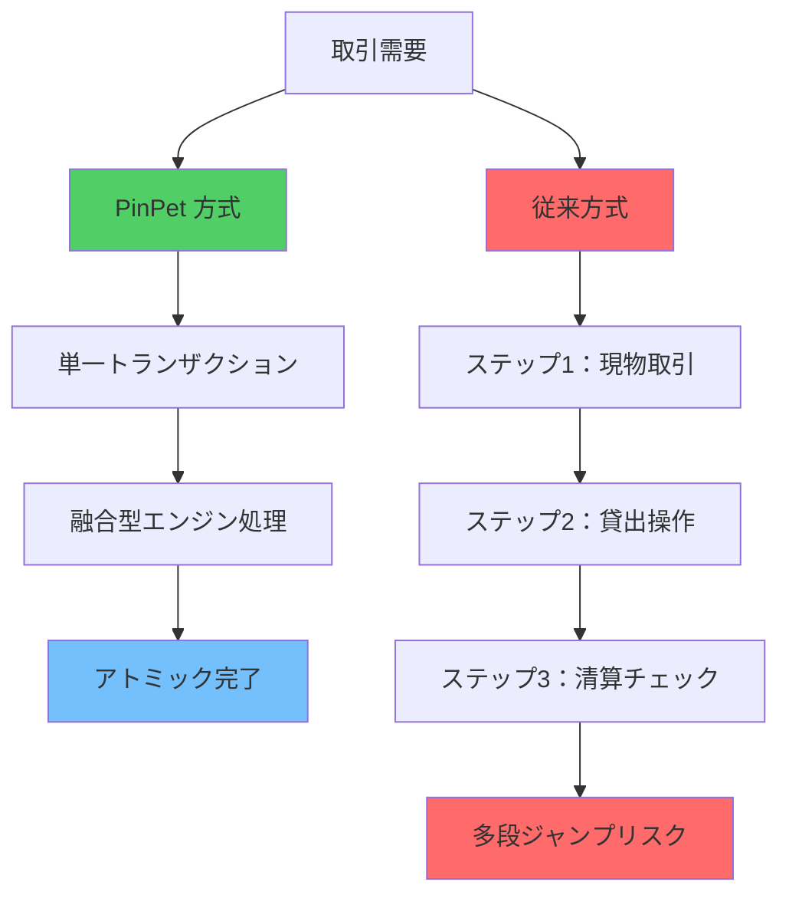

### 核心的差異

**「AMM + 外部貸出」との比較：**
- ✅ 融合型エンジンがクロスプロトコル遅延と照合不一致を排除
- ✅ より速い清算、より小さいスリッページ、より徹底した失敗ロールバック

**「オーダーブック + レバレッジ」との比較：**
- ✅ マッチング深度とマーケットメーカー待ち行列に依存しない
- ✅ 極端な相場下での成立と清算に確定性あり

**「永続契約 DEX」との比較：**
- ✅ 真の「現物成立 + ネイティブレバレッジ」
- ✅ 資産と価格パスがより直感的、資金隔離関係がより単純で証明可能

---

## 🔧 実際に実装された技術詳細（要約）

### 核心技術アーキテクチャ

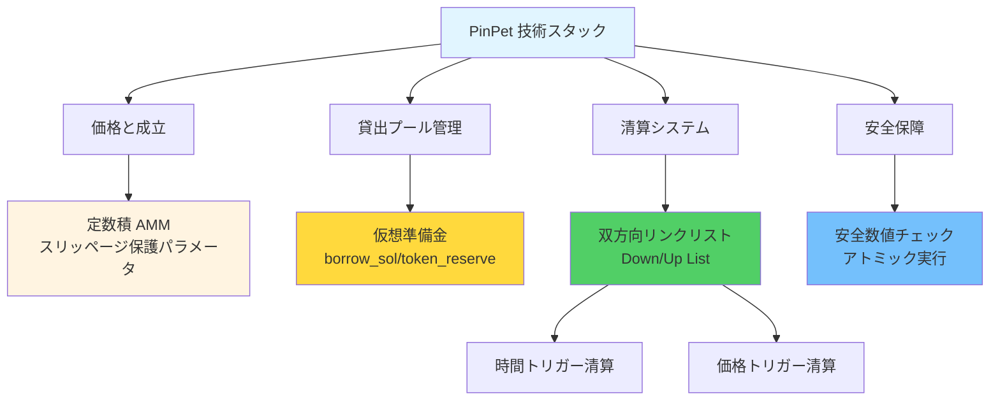

### 技術特性リスト

**価格と成立：**
- 定数積 AMM：`k = x × y`
- スリッページ保護パラメータ強制約
- 高精度計算エンジン（10^28 精度）

**貸出プール：**
- `borrow_sol_reserve` / `borrow_token_reserve` 仮想準備金
- 現物プールと資金共有しつつ論理的隔離
- 価格区間ロック技術（PLT）

**清算リンクリスト：**
- ロングリスト（Down）：価格の高い順から
- ショートリスト（Up）：価格の低い順から
- バッチ走査と連鎖清算をサポート

**清算トリガー：**
- 時間トリガー：期限強制決済、誰でも実行可能
- 価格トリガー：ストップロス清算、他者取引にアトミック実行埋め込み

**アカウントライフサイクル：**
- 清算/決済後に関連 PDA を閉鎖
- レンタル料金をトリガー者に返却
- イベント全てチェーン上で観測可能

**安全な計算：**
- 数値全て checked_* メソッドを使用
- 手数料高精度累算
- 失敗時はロールバック、中間状態なし

---

## 🧩 開発者/統合者への技術暗号

### 開発者フレンドリー設計

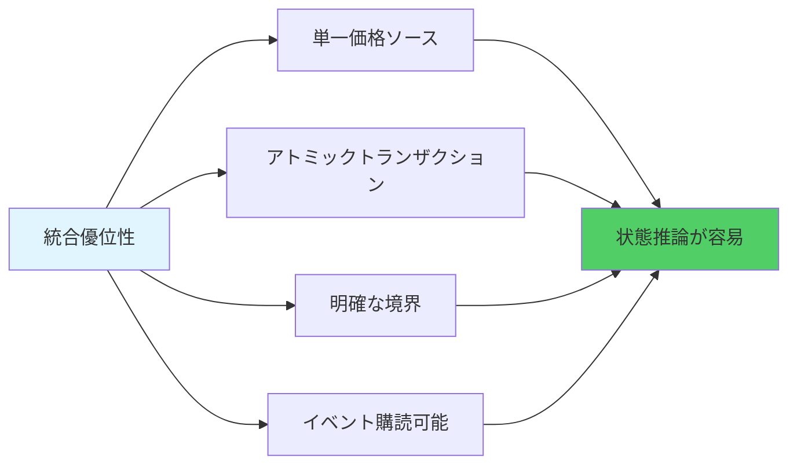

**核心特性：**
- 🔹 **単一価格ソース**：現物とレバレッジが統一価格を共有、`price_to_reserves(price)` 同期マッピング
- 🔹 **アトミックトランザクション**：建玉/決済/清算が単一トランザクションで完了、最終状態推論が容易
- 🔹 **明確な境界**：最小取引量、最小証拠金、ストップロス閾値などのパラメータはチェーン上で設定可能、検証容易
- 🔹 **イベント購読可能**：清算/決済イベント明確、リスク管理ダッシュボード、戦略バックテスト、アラートに便利

### 技術統合フロー

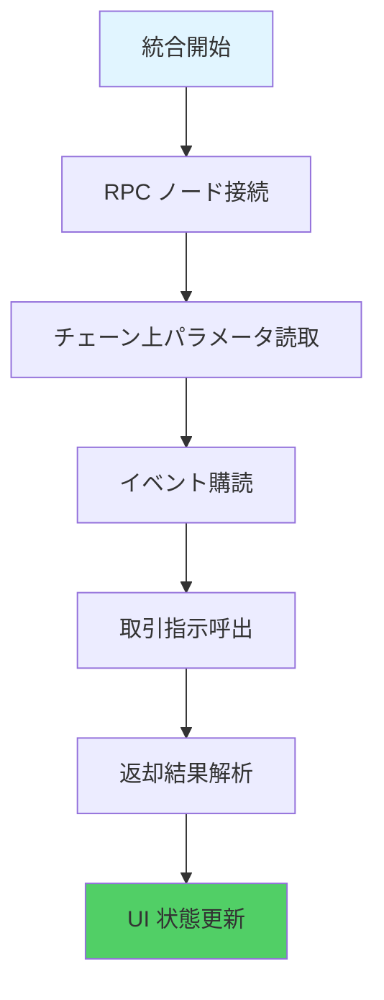

---

## 📊 性能データ：チェーン上効率革命

### 実測性能指標

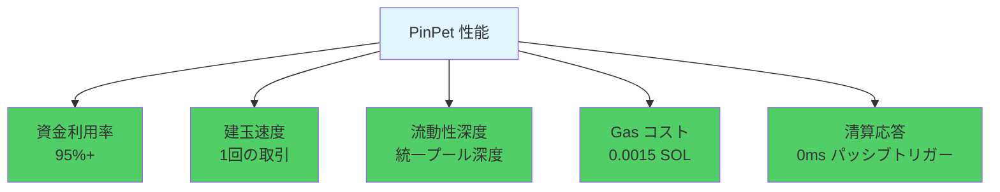

### 改善比較

| 指標 | 改善幅 |
|-----|---------|
| 資金利用率 | 🚀 +50% |
| 取引速度 | ⚡ 2倍速 |
| 流動性深度 | 💎 3倍深 |
| Gas コスト | 💰 50%削減 |
| 清算応答 | ⏱️ 即時清算 |

---

## 📣 価値結論と行動喚起

### PinPet の核心価値

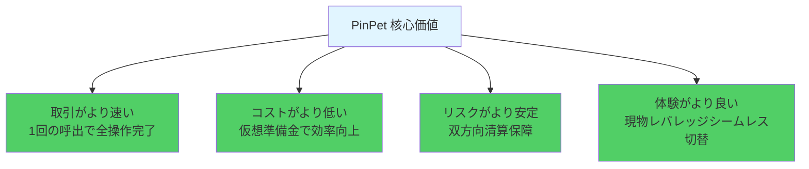

### 私たちは何を証明したのか?

PinPet.fun は融合型 AMM/ALP エンジンで、「分散型現物 × ネイティブレバレッジ」の可能性を再定義しました:

- ✅ **流動性は分裂する必要なし**：単一プールで複数需要にサービス提供可能
- ✅ **レバレッジに貸出プール不要**：仮想準備金台帳で実現可能
- ✅ **清算はゼロ遅延可能**：パッシブトリガーメカニズムでオラクル依存排除
- ✅ **極端相場に保障あり**：区間固定で清算失敗なし

### 技術が DeFi を変える

**PinPet = AMM + 自動貸出プールの完璧な融合**

これは世界初創、これは唯一無二の技術的ブレイクスルーです。

---

## 🚀 今すぐ体験

**あなたの戦略をこのよりスマートで、よりハードコアなエンジンに搭載しましょう！**

- 🌐 **公式サイト**：[PinPet.fun](https://pinpet.fun)
- 📖 **技術ドキュメント**：[docs.pinpet.fun](https://docs.pinpet.fun)
- 💬 **コミュニティ**：Discord と Telegram に参加
- 📊 **GitHub**：https://github.com/pinpetfun/

---

## 🔮 将来技術ロードマップ

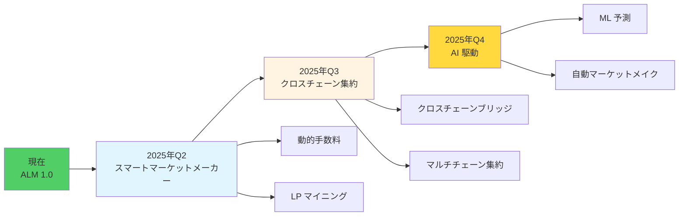

**継続的革新：**
- 🔬 **Phase 1 - スマートマーケットメーカー**：動的手数料 + 流動性インセンティブ
- 🔬 **Phase 2 - クロスチェーン集約**：マルチチェーン流動性統一管理
- 🔬 **Phase 3 - AI 駆動**：機械学習でリスク管理戦略最適化

---

## ⚠️ リスク警告

**レバレッジ取引には高リスクがあり、全証拠金を失う可能性があります。**

メカニズムとリスクを十分理解した上で参加し、レバレッジは理性的に使用してください。本文書は技術紹介のみを目的とし、投資助言を構成するものではありません。

---

*🔬 技術が革新を駆動し、コードが信頼を築く*

*🌟 PinPet.fun - Redefining DeFi Infrastructure*

**「AMM 取引 + 自動貸出プール」の方向において、これは世界初創、唯一無二です。**
