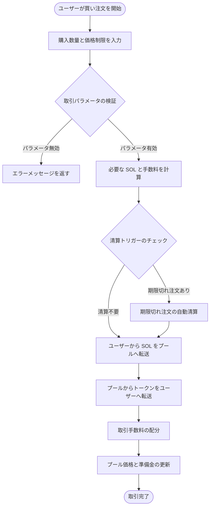
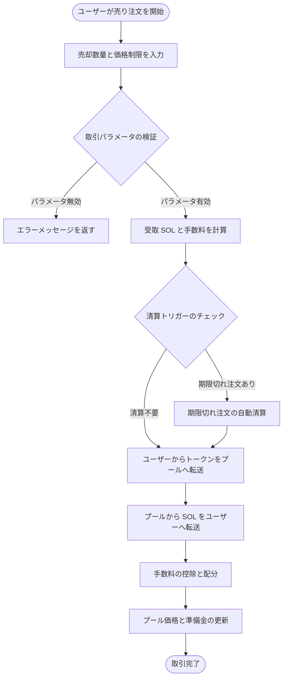

# 💱 PinPet スポット取引機能の紹介

## 📊 機能概要

スポット取引は PinPet プラットフォームのコア機能の一つで、ユーザーが分散型流動性プールで直接トークンを売買できます。従来のオーダーブック方式とは異なり、PinPet は自動マーケットメーカー（AMM）メカニズムを採用し、定数積アルゴリズム（x × y = k）に基づいて取引価格を自動的に決定します。

**✨ コア機能：**
- **⚡ 即時約定**：買い手と売り手のマッチングを待つ必要なく、取引は即座に完了
- **🔍 透明な価格設定**：価格はアルゴリズムによって自動的に計算され、公開・透明
- **🌊 継続的な流動性**：プールに十分な資産がある限り、いつでも取引可能
- **🛡️ スリッページ保護**：ユーザーは最大/最小価格制限を設定でき、価格の異常な変動を防止

---

## 🛒 買い取引フロー (Buy)

### 👤 ユーザー操作手順

買い取引により、ユーザーは SOL（Solana ネイティブトークン）を使用してプロジェクトトークンを購入できます。

### 🔑 主要パラメータ説明

| パラメータ名 | 用途説明 | 例 | 備考 |
|---------|---------|--------|------|
| buy_token_amount | 購入したいトークン数量 | 1000000（1トークン） | 最小値：1000000（1トークン） |
| max_sol_amount | 支払い可能な最大 SOL 数量 | 50000000（0.05 SOL） | 価格スリッページが大きすぎるのを防ぐ |
| lp_pairs | 流動性プールの状態スナップショット | [{sol: 30, token: 1000000}] | フロントエンドが自動提供 |

### ⚙️ 取引実行ロジック

1. **パラメータ検証**
   - 購入数量が最小取引量（1トークン）に達しているか確認
   - 流動性プールの状態がオンチェーンと一致しているか検証

2. **価格計算**
   - 現在のプール準備金に基づき、定数積公式を使用して必要な SOL を計算
   - 手数料を含む実際の支払額を計算
   - 実際の約定価格がユーザー設定の最大値を超えていないか確認

3. **自動清算メカニズム**
   - 取引により価格がレバレッジ注文の清算価格を越える場合、システムが自動的にこれらの注文を清算
   - 清算で発生した手数料をプラットフォームとパートナーに配分

4. **資金移動**
   - ユーザーアカウント → 流動性プール：SOL（手数料含む）を転送
   - 流動性プール → ユーザーアカウント：トークンを転送

5. **手数料配分**
   - 事前設定された比率でパートナーと技術プロバイダーに配分
   - デフォルトの手数料率は管理者が設定可能

6. **状態更新**
   - 流動性プールの現在価格を更新
   - プールの SOL とトークン準備金を再計算
   - 手数料割引のトリガーをチェック

---

## 💸 売り取引フロー (Sell)

### 👤 ユーザー操作手順

売り取引により、ユーザーは保有するトークンを売却し、SOL と交換できます。

### 🔑 主要パラメータ説明

| パラメータ名 | 用途説明 | 例 | 備考 |
|---------|---------|--------|------|
| sell_token_amount | 売却したいトークン数量 | 1000000（1トークン） | 最小値：1000000（1トークン） |
| min_sol_output | 期待する最小 SOL 数量 | 20000000（0.02 SOL） | 価格スリッページが大きすぎるのを防ぐ |
| lp_pairs | 流動性プールの状態スナップショット | [{sol: 30, token: 1000000}] | フロントエンドが自動提供 |

### ⚙️ 取引実行ロジック

1. **パラメータ検証**
   - 売却数量が最小取引量（1トークン）に達しているか確認
   - ユーザーのトークンアカウント残高が十分か検証
   - 流動性プールの状態が有効か確認

2. **価格計算**
   - 現在のプール準備金に基づき、定数積公式を使用して受取可能な SOL を計算
   - 手数料控除後の実際の入金額を計算
   - 実際の約定価格がユーザー設定の最小値を下回っていないか確認

3. **自動清算メカニズム**
   - 取引により価格がレバレッジ注文の清算価格を越える場合、システムが自動的にこれらの注文を清算
   - 清算で発生した手数料と清算報酬を配分

4. **資金移動**
   - ユーザーアカウント → 流動性プール：トークンを転送
   - 流動性プール → ユーザーアカウント：SOL（手数料控除済み）を転送

5. **手数料処理**
   - 受取 SOL から手数料を控除
   - 比率に応じてパートナーと技術プロバイダーに配分

6. **状態更新**
   - 流動性プールの現在価格を更新（価格下落）
   - プールの SOL とトークン準備金を再計算
   - 手数料割引のトリガーをチェック

---

## 💡 使用シナリオ例

### 📈 シナリオ1：通常の買い取引

**背景：**
- 現在価格：1トークン = 0.03 SOL
- ユーザーは 10 トークンを購入希望
- 手数料率：1%

**操作フロー：**
1. ユーザーが購入数量を設定：10,000,000（10トークン）
2. ユーザーが最大支払額を設定：0.35 SOL（350,000,000）
3. システムが実際の必要額を計算：0.303 SOL（手数料含む）
4. 価格チェック通過（最大制限を超えていない）
5. 取引実行：
   - ユーザーが 0.303 SOL を支払い
   - 10 トークンを受取
   - 手数料 0.003 SOL がプラットフォームに配分
6. 約定後の価格上昇：0.0303 SOL/トークン

---

### 📉 シナリオ2：売却による自動清算トリガー

**背景：**
- 現在価格：1トークン = 0.05 SOL
- ロング注文が存在し、清算価格は 0.048 SOL
- ユーザーは 50 トークンを売却希望

**操作フロー：**
1. ユーザーが売却数量を設定：50,000,000（50トークン）
2. ユーザーが最小受取額を設定：2.3 SOL
3. システムが売却により価格が 0.048 SOL を下回ることを検知
4. システムがロング注文を自動清算：
   - 注文の損益を計算
   - 清算手数料を徴収
   - 注文アカウントを閉鎖し、レント返還
5. 売却取引を継続実行：
   - ユーザーが 50 トークンを転送
   - 2.4 SOL（手数料控除後）を受取
6. 約定後の価格下落：0.047 SOL/トークン

---

### 🛡️ シナリオ3：スリッページ保護トリガー

**背景：**
- 現在価格：1トークン = 0.02 SOL
- ユーザーは 1000 トークンを購入希望
- 流動性プールが小さく、大口取引で大きなスリッページが発生

**操作フロー：**
1. ユーザーが購入数量を設定：1,000,000,000（1000トークン）
2. ユーザーが最大支払額を設定：21 SOL
3. システムが実際の必要額を計算：22.5 SOL（手数料含む）
4. 価格チェック失敗（ユーザーの最大制限を超過）
5. 取引が拒否され、エラーメッセージを返す
6. ユーザーの選択肢：
   - 最大支払額制限を引き上げる
   - 購入数量を減らす
   - 分割購入する

---

## ⚠️ 注意事項と制限

### 🚫 取引制限

| 制限項目 | 具体的要件 | 理由説明 |
|---------|---------|---------|
| 最小取引量 | 1,000,000（1トークン） | 過小な取引がシステム効率に影響するのを防ぐ |
| 手数料率上限 | 10% | 過度に高い手数料からユーザーを保護 |
| 流動性チェック | 現在のプール状態スナップショットを提供必須 | オンチェーンとオフチェーンの状態一致を確保 |
| 価格スリッページ保護 | max_sol_amount / min_sol_output は必須 | 価格の異常な変動による損失を防ぐ |

### ⚠️ リスク警告

1. **📊 価格変動リスク**
   - 大口取引は大きな価格スリッページを引き起こす
   - 大口取引は分割実行し、インパクトコストを削減することを推奨
   - 合理的なスリッページ許容度を設定

2. **💰 手数料コスト**
   - 各取引で手数料が発生
   - 頻繁な小口取引は高額な手数料コストを累積
   - コスト削減のため取引を統合することを推奨

3. **💧 流動性リスク**
   - 流動性不足時、大口取引が完了しない可能性
   - プール準備金が約定価格に影響
   - プールの SOL とトークン準備金の状況に注意

4. **🔄 自動清算の影響**
   - 取引がレバレッジ注文の自動清算をトリガーする可能性
   - 清算により一部の流動性が消費
   - 最終約定価格に影響する可能性

### 🔧 技術要件

**👛 ユーザー側要件：**
- Solana ウォレットを所有（Phantom、Solflare など）
- アカウントに取引と取引手数料支払いのための十分な SOL
- トークン取引前に対応するトークンアカウントを作成（通常フロントエンドが自動処理）

**💵 取引手数料の構成：**
- Solana ネットワーク手数料：約 0.000005 SOL（トランザクション署名料）
- 取引手数料：取引金額の一定割合で徴収（管理者が設定）
- アカウントレント：新規アカウント作成時に一度支払い（回収可能）

### ❓ よくある質問

**Q: 取引失敗時に手数料を損失しますか？**
A: ✅ いいえ。パラメータチェック失敗により取引が拒否された場合、手数料は一切控除されず、わずかな Solana ネットワーク手数料（約 0.000005 SOL）のみ消費されます。

**Q: 最適な約定価格を得るには？**
A: 💡 流動性が十分な時間帯に取引し、単一の過大な取引量を避け、プールの SOL/トークン比率に注目し、適切なタイミングで取引を行ってください。

**Q: 自動清算は自分の取引に影響しますか？**
A: ⚠️ 可能性があります。あなたの取引が他のレバレッジ注文の清算をトリガーする場合、一部の流動性が消費され、実際の約定価格が予想とわずかに異なる可能性がありますが、設定したスリッページ範囲内に収まります。

**Q: 取引が拒否される一般的な理由は？**
A: ❌ 一般的な理由：
- 購入数量または売却数量が最小取引量（1トークン）未満
- 実際の約定価格が設定したスリッページ保護範囲を超過
- アカウント残高不足（SOL またはトークン）
- 流動性プール状態スナップショットが期限切れ（フロントエンドで再取得が必要）

**Q: 手数料はどのように計算・配分されますか？**
A: 💰 手数料は取引金額の一定割合で徴収され（デフォルト 1%、管理者が調整可能）、徴収後は事前設定された比率でパートナーと技術プロバイダーに配分されます。場合によっては手数料割引が適用されることがあります。

---

## 🔗 関連機能

- **📊 レバレッジ取引**：借入メカニズムを使用したロング/ショート取引
- **💧 流動性管理**：流動性プールの状態の確認と管理
- **🪙 トークン作成**：新しい取引トークンペアの作成
- **📋 注文管理**：レバレッジ取引注文の確認と管理

---

*📝 注：本ドキュメントは製品機能説明であり、技術実装の詳細は含みません。開発関連情報については、プロジェクトの技術ドキュメントを参照してください。*
