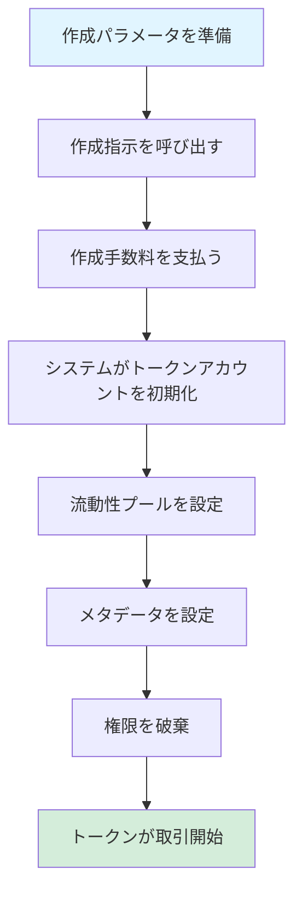
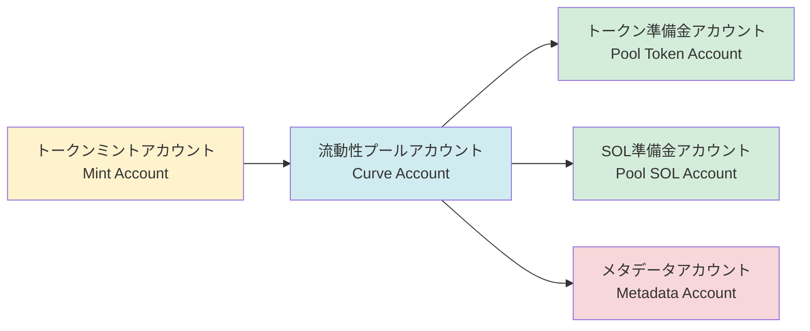
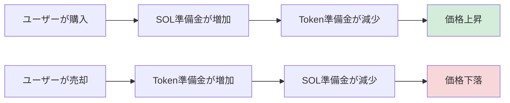

# 🪙 PinPet トークン作成機能の概要

## 一、📋 機能概要

### 💎 トークン作成とは

トークン作成は、PinPetプラットフォームのコア機能の一つで、ユーザーがワンクリックで新しいSPLトークン（Solanaブロックチェーン標準トークン)を発行し、取引市場を自動設定できる機能です。この機能により、ユーザーは複雑なブロックチェーン技術を深く理解することなく、完全なメタデータ、自動流動性サポート、即時取引機能を備えたトークンを迅速に作成できます。

### ❓ なぜトークンを作成する必要があるのか

**⚠️ 従来のトークン発行の課題：**
- 専門的な技術知識が必要（Solanaプログラミング、SPL Token標準）
- ミント権限、流動性プール、メタデータなど複数の工程を手動で設定
- 即時の流動性と取引市場がない
- セキュリティ設定が複雑（権限破棄、増発防止など）

**✅ PinPetトークン作成の優位性：**
- **⚡ ワンクリック発行**：トークン名、シンボル、アイコンの3つの基本情報のみ提供
- **🚀 即時上場**：作成完了後すぐに取引可能、流動性の蓄積を待つ必要なし
- **🔒 自動セキュリティ設定**：ミント権限とフリーズ権限を自動破棄し、悪意のある増発を防止
- **🏦 内蔵取引市場**：定数積AMM アルゴリズムに基づき、現物取引とレバレッジ取引をサポート
- **✔️ 準拠メタデータ**：Metaplex標準に準拠し、ウォレットと取引所が自動認識

### ⭐ コア機能

| 機能 | 説明 |
|------|------|
| トークン標準 | SPL Token（Solana公式標準） |
| 精度 | 6桁の小数点（1 Token = 1,000,000 最小単位） |
| 総供給量 | 1,609,500,000,000,000 単位（固定供給、増発不可） |
| メタデータ標準 | Metaplex Token Metadata |
| 初期価格 | 約 0.0000000000279589934762 SOL/Token |
| 流動性モデル | 定数積AMM（x × y = k） |

---

## 二、🔄 トークン作成フロー

### 👤 ユーザー操作手順



### 📊 詳細フロー説明

#### 📝 フェーズ1：パラメータ準備
ユーザーは3つの基本パラメータを提供する必要があります：

| パラメータ | タイプ | 説明 | 例 |
|------|------|------|------|
| name | 文字列 | トークンの正式名称 | "PinPet Token" |
| symbol | 文字列 | トークンシンボル（3-10文字） | "PINPET" |
| uri | 文字列 | メタデータJSONファイルのリンク | "https://example.com/metadata.json" |

#### 🔧 フェーズ2：アカウント初期化
システムは以下のアカウントを自動作成・設定します：



#### 💧 フェーズ3：流動性プール初期化
システムは2つの資金プールを自動設定します：

**1. 現物流動性プール（LP Pool）**
- トークン準備金：1,073,000,000,000,000 単位
- SOL準備金：30 SOL（仮想残高）
- 実際のSOL：10,000 lamports（残高不足を防ぐため）
- 用途：現物取引（買い/売り）をサポート

**2. レバレッジ貸出プール（Borrow Pool）**
- トークン準備金：536,500,000,000,000 単位
- SOL準備金：10,000,000 SOL（仮想残高）
- 用途：証拠金取引（ロング/ショート）をサポート

**📊 資金配分図：**
```
💰 総供給量：1,609,500,000,000,000 単位
├── 現物流動性プール：1,073,000,000,000,000 (66.67%)
└── レバレッジ貸出プール：  536,500,000,000,000 (33.33%)
```

#### 📄 フェーズ4：メタデータ作成
システムはMetaplex Token Metadataプログラムを呼び出してトークンメタデータを作成します：

| メタデータフィールド | 内容 | 説明 |
|-----------|------|------|
| name | ユーザー提供の名称 | ウォレットに表示されるトークン名 |
| symbol | ユーザー提供のシンボル | トークンの略称 |
| uri | ユーザー提供のリンク | アイコン、説明などの情報を含むJSONへのリンク |
| creators | 作成者アドレス | トークン作成者を示す、未検証状態 |
| seller_fee_basis_points | 0 | ロイヤリティ率（0に設定） |
| is_mutable | true | メタデータの更新を許可 |

**📋 メタデータJSON標準フォーマット例：**
```json
{
  "name": "PinPet Token",
  "symbol": "PINPET",
  "description": "PinPetプラットフォームで発行されたトークン",
  "image": "https://example.com/logo.png",
  "attributes": [],
  "properties": {
    "files": [
      {
        "uri": "https://example.com/logo.png",
        "type": "image/png"
      }
    ]
  }
}
```

#### 🔒 フェーズ5：権限破棄
トークンのセキュリティと不変性を確保するため、システムは自動的に以下を実行します：

| 操作 | 目的 | 効果 |
|------|------|------|
| ミント権限を破棄 | 増発を防止 | 総供給量が永久にロック |
| フリーズ権限を破棄 | ユーザーアカウントの凍結を防止 | トークンが永久に流通可能 |

#### 💵 フェーズ6：手数料設定
システムはパートナーパラメータアカウントから手数料設定を読み取ります：

| 手数料タイプ | デフォルト値 | 説明 |
|---------|--------|------|
| 現物取引手数料 | 1% | 売買取引時に控除 |
| 証拠金取引手数料 | 0.25% | レバレッジ取引時に控除 |
| 手数料割引フラグ | 0（通常価格） | 取引量に応じて自動調整可能 |
| 手数料配分比率 | 20%/80% | テクノロジー側/パートナー配分比率 |

---

## 三、💧 流動性プールメカニズム

### 🔢 定数積公式

PinPetは自動マーケットメーカー（AMM）モデルを採用し、コア公式は以下の通り：

```
x × y = k
```

ここで：
- **x**：SOL準備金量
- **y**：Token準備金量
- **k**：定数積（初期値 = 30 × 1,073,000,000 = 32,190,000,000）

### 💰 初期価格計算

```
初期価格 = SOL準備金 ÷ Token準備金
         = 30 ÷ 1,073,000,000
         ≈ 0.0000000279589934762 SOL/Token
```

### 📈 価格変動メカニズム



### 🛡️ 価格スリッページ保護

流動性プールを保護するため、システムは複数のセキュリティメカニズムを採用しています：

| 保護措置 | 説明 |
|---------|------|
| 精度係数 | 価格は10^26精度係数を使用し、丸め誤差を回避 |
| オーバーフローチェック | すべての計算で`checked_*`メソッドを使用してオーバーフローを防止 |
| 価格上限 | 最高価格制限は50,000,000,000,000,000,000,000,000,000 |
| 価格下限 | 最低価格制限は0.000000001（ゼロ除算を防止） |

---

## 四、📝 トークンメタデータ説明

### ✅ Metaplex標準

PinPetはMetaplex Token Metadata v5.1.1標準を使用し、Solanaエコシステム内でのトークンの互換性を保証します：

**✨ 標準の利点：**
- 💳 主要ウォレット（Phantom、Solflare）が自動認識
- 🔄 DEXプラットフォーム（Jupiter、Raydium）が情報を自動取得
- 🎨 NFTマーケットプレイスとアグリゲーターが自動インデックス
- 🔍 ブロックチェーンエクスプローラー（Solscan、Solana Explorer）が完全表示

### 🗂️ メタデータアカウント構造

```
メタデータアカウントアドレス (PDA)
├── 派生シード：["metadata", Metaplex Program ID, Mint Address]
├── 保存内容：
│   ├── トークン名
│   ├── トークンシンボル
│   ├── URI（メタデータJSONリンク）
│   ├── 作成者情報
│   ├── ロイヤリティ設定
│   └── コレクション情報（オプション）
└── 権限：
    ├── 更新権限：流動性プールアカウント（PDA）
    └── 可変性：true（更新を許可）
```

### 🌐 URIホスティング推奨

| ホスティング方法 | 利点 | 欠点 | 適用シーン |
|---------|------|------|---------|
| IPFS | 分散型、永久保存 | アクセス速度が遅い | 長期プロジェクト |
| Arweave | 永久保存、高速 | 有料 | 高価値トークン |
| クラウドストレージ（AWS S3/CDN） | 高速、安価 | 中央集権的、失効の可能性 | テストまたは短期プロジェクト |

---

## 五、🎯 使用シナリオ例

### 🚀 シナリオ1：スタートアップチームがプロジェクトトークンを発行

**ニーズ：**
あるWeb3スタートアップチームが、自社のDeFiプロジェクトのガバナンストークンを発行したい

**操作フロー：**
1. トークンアイコンと説明ドキュメントをデザイン
2. メタデータJSONをIPFSにアップロード
3. パラメータを準備：
   - name: "SuperDeFi Governance Token"
   - symbol: "SDEFI"
   - uri: "https://ipfs.io/ipfs/QmXXX..."
4. PinPet作成指示を呼び出し、少額の作成手数料を支払う
5. トークンが即座に上場、チームメンバーとコミュニティがすぐに取引可能

**✅ 優位性：**
- ⚡ スマートコントラクトを書く必要なし
- 💧 流動性市場が標準装備
- 🔒 セキュリティがプロトコルによって保証される

---

### 🎉 シナリオ2：コミュニティMemeトークン発行

**ニーズ：**
コミュニティが娯楽と取引用のテーマMemeトークンを発行したい

**操作フロー：**
1. コミュニティ投票でトークン名とアイコンを決定
2. 無料画像ホスティングサービスで画像をホスティング
3. パラメータを準備：
   - name: "Doge to the Moon"
   - symbol: "DMOON"
   - uri: "https://cloudinary.com/dmoon.json"
4. いずれかのコミュニティメンバーが作成を開始
5. コミュニティメンバーがすぐに取引開始

**✅ 優位性：**
- 💰 低コストで迅速に発行
- 👥 技術的背景不要
- 🔒 自動増発防止メカニズム

---

### 🎨 シナリオ3：NFTプロジェクトがユーティリティトークンを発行

**ニーズ：**
NFTプロジェクト側が、エコシステムインセンティブ用の関連ユーティリティトークンを発行したい

**操作フロー：**
1. NFTスタイルに合ったトークンイメージをデザイン
2. 詳細なトークンホワイトペーパーを準備
3. Arweaveを使用してメタデータを永久保存
4. パラメータを準備：
   - name: "CryptoArt Utility Token"
   - symbol: "CART"
   - uri: "ar://abc123..."
5. トークンを作成し手数料受取アカウントを設定
6. NFT保有者がステーキングでトークン報酬を獲得可能

**✅ 優位性：**
- 💾 メタデータの永久保存
- 🔗 NFTエコシステムとシームレスに統合
- 📊 複雑な経済モデルをサポート

---

## 六、⚠️ 注意事項と制限

### 📝 作成前の準備作業

| チェック項目 | 説明 |
|--------|------|
| ウォレット残高 | 作成手数料を支払うのに十分なSOLがあることを確認（約0.01-0.05 SOL） |
| メタデータ準備 | JSONファイルがアップロード済みでアクセス可能 |
| トークン情報 | 名前とシンボルが規範に準拠し、曖昧さがない |
| パートナーアカウント | パートナーパラメータアカウントが作成済み（初回は作成が必要） |

### 🚫 トークン作成の制限

**⚙️ 技術的制限：**
- トークン精度は6桁の小数点に固定され、作成後は変更不可
- 総供給量は固定され、ミント権限破棄後は増発不可
- 初期流動性設定は固定され、カスタマイズ不可

**🔒 セキュリティ制限：**
- 手数料率の上限は10%、超過すると作成失敗
- メタデータ更新権限は流動性プールアカウントに帰属
- フリーズ権限は破棄済み、ユーザーアカウントを凍結不可

**💰 経済的制限：**
- 初期価格はアルゴリズムで計算され、カスタマイズ不可
- 流動性配分比率は固定（現物66.67%、レバレッジ33.33%）
- SOL準備金は仮想残高で、直接引き出し不可

### ❓ よくある質問

**💵 Q1：トークン作成にはどれくらいの費用がかかりますか？**
A：主な費用にはアカウントレント（約0.01-0.03 SOL）と取引手数料（約0.00001 SOL）が含まれ、合計約0.01-0.05 SOLです。

**✏️ Q2：トークン作成後に名前やシンボルを変更できますか？**
A：メタデータURIが指すJSONファイルの内容を更新することで変更できますが、オンチェーン記録のnameとsymbolは不変です。

**🔒 Q3：トークンのセキュリティをどのように確保しますか？**
A：システムは自動的にミント権限とフリーズ権限を破棄し、供給量が固定され改ざん不可能であることを保証します。分散型ストレージ（IPFS/Arweave）でメタデータをホスティングすることを推奨します。

**❗ Q4：作成が失敗した場合どう対処しますか？**
A：ウォレット残高、パラメータフォーマット、パートナーアカウントステータスを確認してください。一般的なエラーには手数料率超過、URI無効などがあります。

**🗑️ Q5：トークンを破棄できますか？**
A：トークンアカウント自体は破棄できませんが、ブラックホールアドレス（0x000...）に転送することでトークンを永久にロックできます。

### 💡 ベストプラクティス推奨

1. **メタデータホスティング**：IPFSやArweaveなどの分散型ストレージを優先使用し、リンク失効を回避
2. **トークン命名**：簡潔明瞭で、有名プロジェクトとの混同を避け、権利侵害を防止
3. **アイコンデザイン**：高品質の画像を使用（推奨512x512ピクセル）、トークンの位置付けに準拠
4. **ホワイトペーパー準備**：URIが指すJSONに詳細なプロジェクト説明とロードマップを含める
5. **コミュニティ構築**：作成後速やかにソーシャルメディアアカウントを作成し、トークンの知名度を向上
6. **コンプライアンス**：トークンの用途が合法であることを確認し、現地の法規制違反を回避

---

## 七、🔧 技術サポート

### 📍 関連アカウントアドレス

| アカウントタイプ | 派生ルール | 説明 |
|---------|---------|------|
| 流動性プールアカウント | `["borrowing_curve", mint_address]` | 流動性と取引パラメータを管理 |
| トークン準備金アカウント | `["pool_token", mint_address]` | 流動性プール内のトークンを保存 |
| SOL準備金アカウント | `["pool_sol", mint_address]` | 流動性プール内のSOLを保存 |
| メタデータアカウント | Metaplex標準PDA | トークンメタデータを保存 |

### 🖥️ プログラムインターフェース

**✨ 作成指示：**
```
関数名：create
パラメータ：
  - name: String（トークン名）
  - symbol: String（トークンシンボル）
  - uri: String（メタデータURI）
```

**📡 イベント監視：**
作成成功後、`TokenCreatedEvent`イベントが発行され、以下の情報が含まれます：
- ミントアカウントアドレス
- 流動性プールアカウントアドレス
- 手数料設定
- トークン名、シンボル、URI

---

## 🎯 まとめ

PinPetトークン作成機能は、ユーザーに🔒安全で、⚡便利で、💰低コストなトークン発行ソリューションを提供します。自動化された流動性設定と標準化されたメタデータ管理により、ユーザーは数分でトークン作成を完了し、すぐに取引を開始でき、技術的な詳細やセキュリティ問題を心配する必要がありません。

🚀スタートアップチームのプロジェクトトークン発行、🎉コミュニティのMemeトークン作成、🎨NFTプロジェクトの関連ユーティリティトークンなど、PinPetは完全なサポートを提供し、トークン発行をシンプルで効率的にします。
