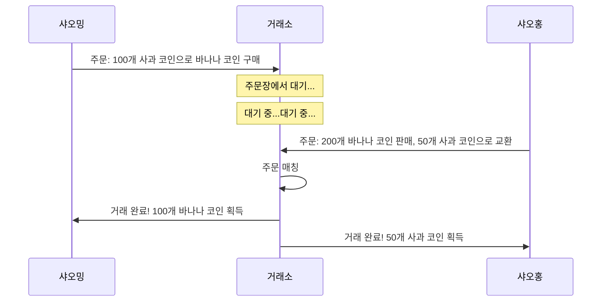
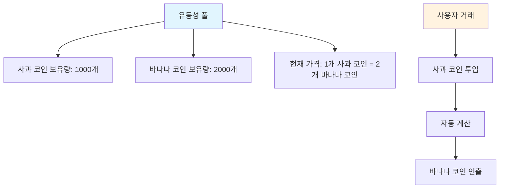
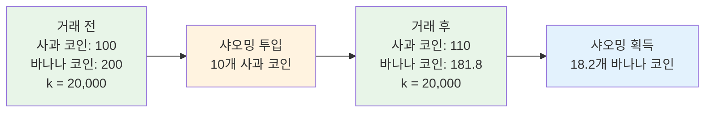
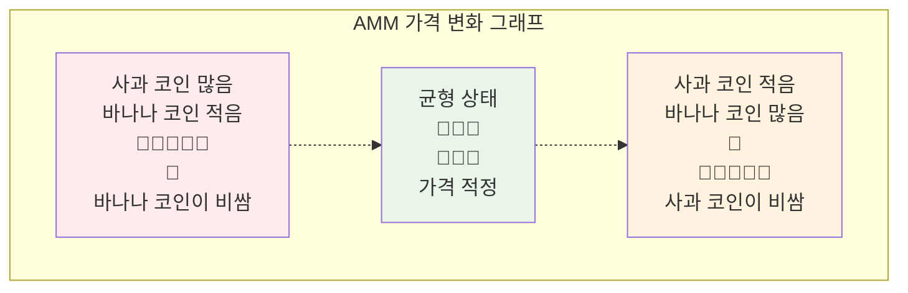
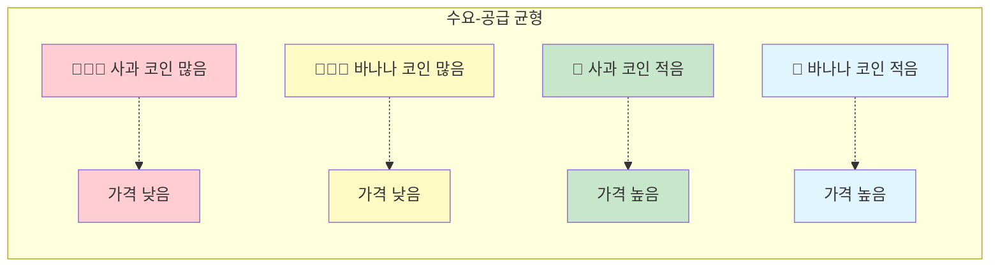
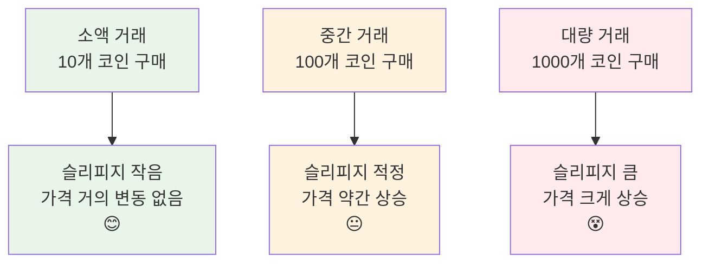
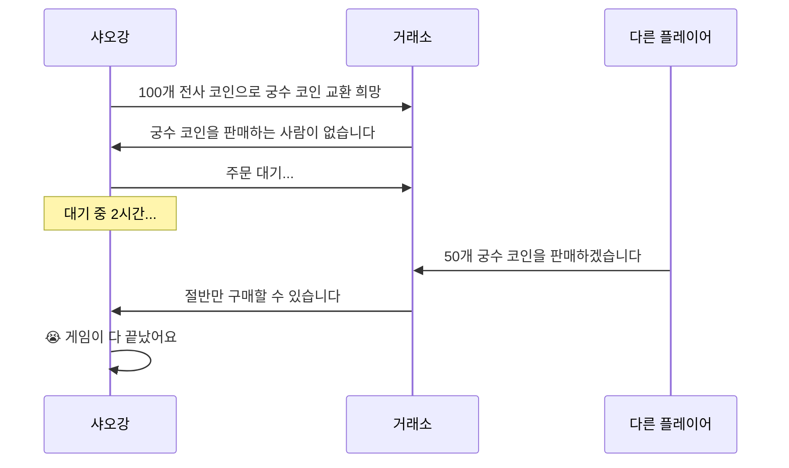
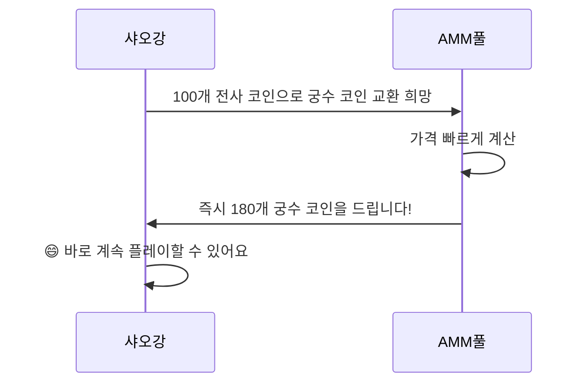
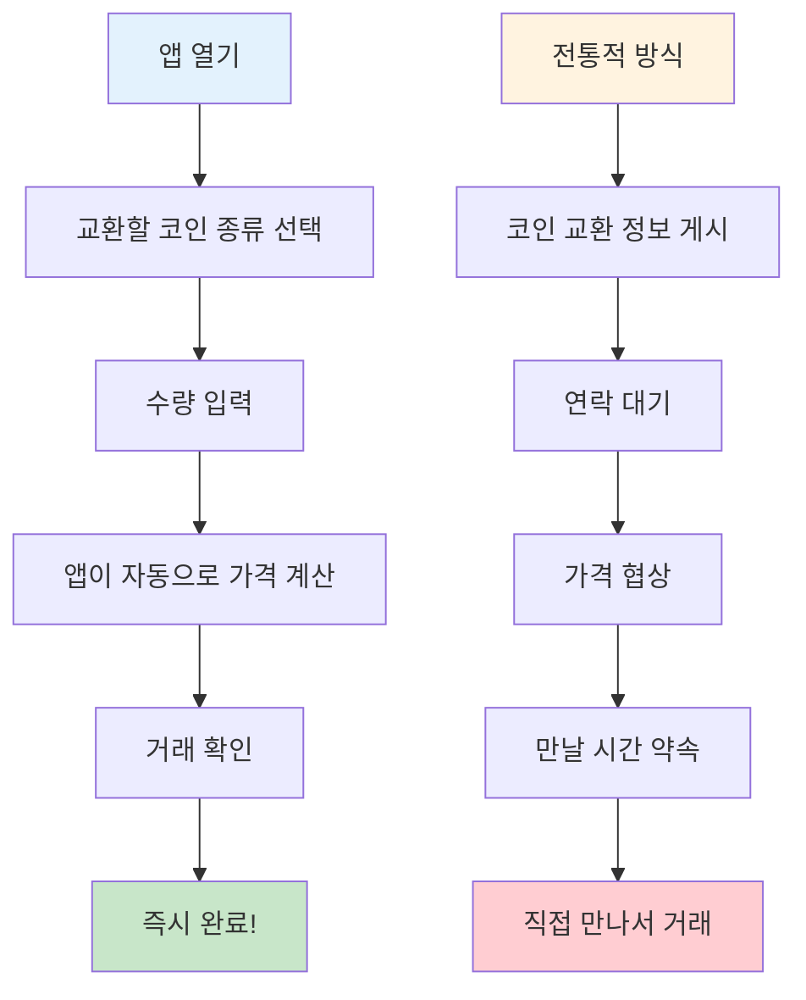

# AMM 마켓 메이킹 메커니즘 가이드 - 처음부터 이해하는 자동 마켓 메이커

## 목차
1. [AMM이란 무엇인가?](#amm이란-무엇인가)
2. [전통적 거래소의 이야기](#전통적-거래소의-이야기)
3. [AMM의 놀라운 세계](#amm의-놀라운-세계)
4. [수학 원리 간소화 버전](#수학-원리-간소화-버전)
5. [AMM 작동 원리 도해](#amm-작동-원리-도해)
6. [슬리피지란 무엇인가?](#슬리피지란-무엇인가)
7. [왜 AMM을 사용하는가?](#왜-amm을-사용하는가)
8. [실제 사례 분석](#실제-사례-분석)
9. [요약](#요약)

---

## AMM이란 무엇인가?

사과로 바나나를 교환하고 싶은데, 마침 사과를 원하는 사람을 찾을 수 없다고 상상해보세요. 이제 "마법의 믹서기"가 있다면, 사과를 넣으면 자동으로 상응하는 양의 바나나를 제공합니다. 이것이 바로 AMM(자동 마켓 메이커)의 기본 개념입니다!

**AMM = Automated Market Maker(자동 마켓 메이커)**

간단히 말해, AMM은 스마트하고 쉬지 않는 "거래 로봇"으로, 다른 사람의 거래를 기다릴 필요 없이 언제 어디서나 다양한 토큰을 교환할 수 있게 해줍니다.

---

## 전통적 거래소의 이야기

### 📖 샤오밍의 거래 고민

샤오밍은 자신의 100개 사과 코인으로 바나나 코인을 교환하고 싶어합니다. 전통적인 거래소에서는:

1. **주문 대기**: 샤오밍이 "100개 사과 코인으로 바나나 코인을 사고 싶습니다, 가격은 1:2"라고 주문을 걸습니다
2. **구매자 대기**: 샤오밍은 적절한 가격에 바나나 코인을 팔고 싶어하는 사람을 기다려야 합니다
3. **긴 대기 시간**: 팔고 싶어하는 사람이 없으면 샤오밍은 몇 시간 또는 며칠을 기다려야 할 수도 있습니다
4. **가격 변동**: 대기 기간 동안 가격이 변할 수 있어, 샤오밍이 최적의 시기를 놓칠 수 있습니다

### 전통적 거래소의 문제점:
- ⏰ **대기 필요**: 거래를 원하는 사람을 기다려야 함
- 📊 **유동성 부족**: 인기 없는 토큰은 거래하기 어려움
- 💰 **가격 불안정**: 대량 주문은 가격의 급격한 변동을 초래하기 쉬움
- 🌙 **시간 제약**: 거래소에는 영업 시간이 있음

---

## AMM의 놀라운 세계

### 🏪 마법의 자동 상점

이제, 이런 방식으로 작동하는 마법의 자동 상점(AMM)이 있다고 상상해보세요:

1. **항상 영업**: 24시간 운영, 절대 닫지 않음
2. **즉시 거래**: 원하는 것을 즉시 구매할 수 있음
3. **자동 가격 책정**: 재고에 따라 가격이 자동으로 조정됨
4. **대기 불필요**: 다른 고객을 기다릴 필요가 없음

### 🏦 유동성 풀 = 슈퍼 창고

AMM의 핵심은 "유동성 풀"로, 거대한 이중 구획 창고와 같습니다:

### 🤖 자동 가격 책정 로봇

AMM에는 간단한 규칙을 따르는 슈퍼 스마트 가격 책정 로봇이 있습니다:

**🔢 마법의 공식: 사과 코인 수량 × 바나나 코인 수량 = 고정 값(k)**

이 공식은 다음을 보장합니다:
- 구매자가 많을수록 가격이 높아짐
- 판매자가 많을수록 가격이 낮아짐
- 항상 구매할 재고가 있고, 판매할 가격이 있음

---

## 수학 원리 간소화 버전

### 🧮 항등 곱 공식

"수학"에 겁먹지 마세요 — 사실 매우 간단합니다!

마법의 창고에 다음이 있다고 가정해봅시다:
- 사과 코인: 100개
- 바나나 코인: 200개
- 마법의 숫자 k = 100 × 200 = 20,000

**규칙: 어떻게 거래하든 k 값은 반드시 20,000으로 유지되어야 합니다!**

### 📊 거래 예시

**샤오밍이 10개 사과 코인으로 바나나 코인을 교환하려고 합니다:**

1. **거래 전**:
   - 사과 코인: 100개
   - 바나나 코인: 200개
   - k = 100 × 200 = 20,000

2. **샤오밍이 10개 사과 코인 투입**:
   - 새로운 사과 코인 수량: 100 + 10 = 110개
   - k = 20,000을 유지해야 함
   - 따라서: 110 × 새로운 바나나 코인 수량 = 20,000
   - 새로운 바나나 코인 수량 = 20,000 ÷ 110 = 181.8개

3. **샤오밍이 획득**:
   - 바나나 코인: 200 - 181.8 = 18.2개
   - 10개 사과 코인으로 18.2개 바나나 코인을 교환

---

## AMM 작동 원리 도해

### 🎢 가격 곡선 그래프

AMM의 가격 변화는 롤러코스터처럼 특별한 곡선을 따릅니다:

### 📈 수요-공급 관계 그래프

양팔 저울의 양쪽을 상상해보세요:

---

## 슬리피지란 무엇인가?

### 🛒 슈퍼마켓 쇼핑 비유

슈퍼마켓에서 사과를 산다고 상상해보세요:

**전통적 슈퍼마켓(중앙화 거래소):**
- 표시 가격: 5원/근
- 1근 구매: 5원
- 100근 구매: 여전히 5원/근
- 하지만 그만큼의 재고가 없을 수 있습니다!

**마법의 슈퍼마켓(AMM):**
- 첫 1근: 5원
- 두 번째 1근: 5.1원(재고 감소, 가격 상승)
- 세 번째 1근: 5.2원
- 많이 살수록 가격이 빠르게 오릅니다!

### 📊 슬리피지 영향 그래프

### 🎯 슬리피지 계산 예시

풀에 1000개 사과 코인과 2000개 바나나 코인이 있다고 가정:

1. **10개 바나나 코인 구매**: 슬리피지 약 0.25%
2. **100개 바나나 코인 구매**: 슬리피지 약 2.5%
3. **500개 바나나 코인 구매**: 슬리피지 약 14%

**결론: 많이 살수록 코인당 평균 가격이 높아집니다!**

---

## 왜 AMM을 사용하는가?

### 🌟 AMM의 슈퍼 장점

#### 1. 🚀 즉시 거래
- **전통적 방식**: 거래 상대를 찾기까지 몇 시간이 걸릴 수 있음
- **AMM 방식**: 몇 초 안에 거래 완료

#### 2. 🌍 연중무휴 24/7
- **전통적 거래소**: 영업 시간이 있고, 공휴일에 닫음
- **AMM**: 절대 닫지 않으며, 언제든지 거래 가능

#### 3. 🎯 매칭 불필요
- **전통적 방식**: 매수자와 매도자의 가격이 일치해야 함
- **AMM**: 풀에 코인만 있으면 거래 가능

#### 4. 💎 소수 토큰 지원
- **전통적 거래소**: 인기 없는 코인은 거래자가 없을 수 있음
- **AMM**: 풀만 생성되면 거래 가능

### 📊 비교 표

| 특성 | 전통적 거래소 | AMM |
|------|-----------|-----|
| 거래 속도 | 매칭 대기 필요 ⏳ | 즉시 완료 ⚡ |
| 영업 시간 | 제한 있음 🕐 | 24/7 🌍 |
| 유동성 | 사용자 주문에 의존 👥 | 알고리즘 보장 🤖 |
| 가격 발견 | 주문장 📋 | 수학 공식 🧮 |
| 슬리피지 | 주문 깊이에 의존 📊 | 거래량에 의존 📈 |

---

## 실제 사례 분석

### 🎮 게임 토큰 거래 이야기

#### 배경 설정
샤오강은 블록체인 게임에서 게임 토큰을 교환하려고 합니다:
- 🗡️ 전사 코인(무기 구매용)
- 🏹 궁수 코인(활과 화살 구매용)

#### 시나리오 1: 전통적 거래소

#### 시나리오 2: AMM

### 🍕 피자가게 비유

**전통적 방식(친구와 코인 교환):**
- 비트코인을 원하면, 정확히 당신의 이더리움을 원하는 사람을 찾아야 합니다
- 그룹 채팅에서 물어봐야 할 수도: 비트코인으로 이더리움을 교환할 사람?
- 반나절을 기다려도 응답이 없을 수 있습니다

**AMM 방식(자동 판매기):**
- 슈퍼 스마트한 자동 판매기처럼
- 이더리움을 넣으면 즉시 비트코인을 받습니다
- 가격이 자동으로 계산되어 흥정할 필요가 없습니다

### 📱 모바일 앱 비유

마법의 코인 교환 앱을 상상해보세요:

---

## 요약

### 🎯 핵심 요점 복습

1. **AMM은 마법의 자동 판매기와 같습니다**
   - 한 종류의 코인을 넣으면 즉시 다른 코인을 받습니다
   - 24시간 작동, 절대 쉬지 않습니다

2. **항등 곱 공식이 핵심입니다**
   - x × y = k(절대 변하지 않는 마법의 숫자)
   - 이 공식으로 가격이 자동으로 조정됩니다

3. **슬리피지는 정상적인 현상입니다**
   - 많이 살수록 가격이 더 많이 오릅니다
   - 슈퍼마켓에서 물건을 많이 살수록 비싸지는 것과 같습니다

4. **AMM은 전통적 거래소보다 더 편리합니다**
   - 사람을 기다릴 필요 없이 즉시 거래
   - 모든 코인 종류 지원
   - 항상 유동성이 있습니다

### 🌈 미래 전망

AMM 기술은 계속 발전하고 있습니다:
- 더 스마트한 가격 책정 알고리즘
- 더 낮은 슬리피지
- 더 많은 혁신 기능

### 🎓 초보자 조언

1. **소액으로 시작**: 먼저 소액 자금으로 연습하세요
2. **슬리피지 이해**: 대량 거래 시 슬리피지에 주의하세요
3. **여러 곳 비교**: 서로 다른 AMM의 가격이 다를 수 있습니다
4. **지속적인 학습**: DeFi 세계는 매우 빠르게 변합니다

---

## 부록: 자주 묻는 질문

### ❓ FAQ

**Q1: AMM에서 코인이 다 떨어질 수 있나요?**
A1: 이론적으로는 아닙니다! 풀에 코인만 있으면 거래가 가능합니다. 하지만 가격이 매우 높을 수 있습니다.

**Q2: 왜 가격 차이가 클 때가 있나요?**
A2: 풀의 크기가 다르기 때문입니다. 작은 풀은 가격 변동이 크고, 큰 풀은 상대적으로 안정적입니다.

**Q3: AMM은 안전한가요?**
A3: 코드는 오픈 소스이지만, 감사를 거친 플랫폼을 선택하는 것에 주의해야 합니다.

**Q4: 수수료는 어떻게 계산되나요?**
A4: 일반적으로 거래 금액의 0.1-1%이며, 거래 결과에서 자동으로 차감됩니다.

**Q5: 거래를 취소할 수 있나요?**
A5: 온체인 확인 전에는 취소할 수 있지만, 취소 수수료를 지불해야 합니다.

기억하세요: 투자에는 위험이 따르며, 거래는 신중해야 합니다! 먼저 학습하고, 실천하고, 소액으로 시작하세요! 🚀
