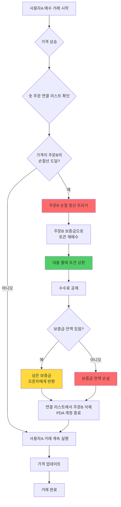
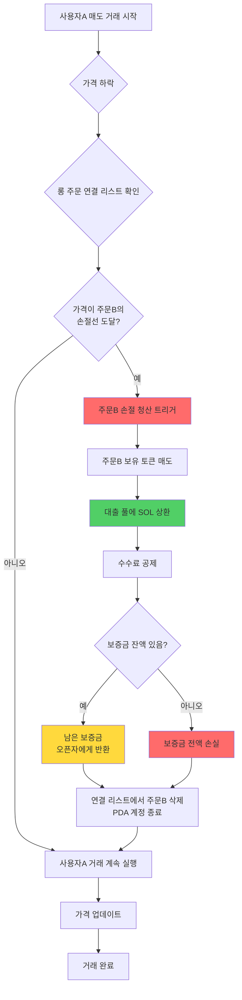
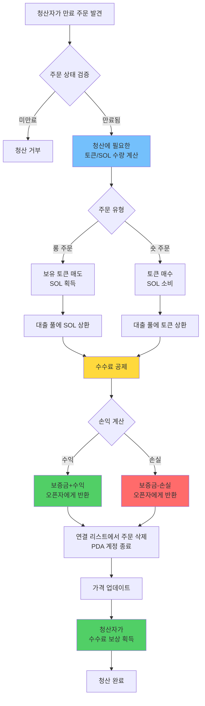
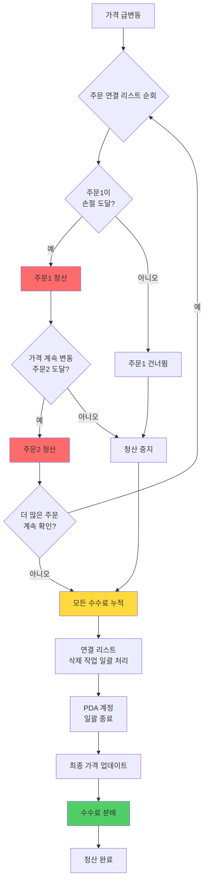

# ⚡ PinPet 강제청산(리퀴데이션) 기능 설명

## 📋 기능 개요

강제청산은 PinPet 프로토콜의 시스템 안정성을 보호하는 핵심 리스크 관리 메커니즘입니다. 시스템은 두 가지 강제청산 트리거 방식을 제공합니다:

1. **⏰ 시간 트리거**: 레버리지 거래 주문이 규정된 보유 시간을 초과하면 누구나 강제청산을 트리거할 수 있습니다
2. **🎯 가격 트리거**: 시장 가격이 주문의 손절 가격선에 도달하면 자동으로 손절 청산이 트리거됩니다

이러한 이중 보호 메커니즘은 프로토콜의 유동성과 자금 안전을 보장하는 동시에 포지션 오픈자를 과도한 손실로부터 보호합니다.

## ⚙️ 핵심 기능

### 1. 🔄 이중 트리거 메커니즘

#### ⏰ 시간 트리거
- **✅ 정상 청산**: 주문 보유 기간 내에는 포지션 오픈자만 직접 청산할 수 있습니다
- **⏱️ 만료 청산**: 주문 만료 후에는 누구나 강제청산을 실행할 수 있습니다
- **🔍 시간 검증**: 시스템은 온체인 타임스탬프를 통해 자동으로 주문 만료 여부를 판단합니다

#### 🎯 가격 트리거(손절 청산)
- **📉 롱 손절**: 가격이 하락하여 롱 주문의 손절 가격선에 도달하면 자동 청산됩니다
- **📈 숏 손절**: 가격이 상승하여 숏 주문의 손절 가격선에 도달하면 자동 청산됩니다
- **🔄 패시브 트리거**: 가격 트리거 손절 청산은 다른 사용자의 거래 시 자동으로 실행됩니다
- **⚠️ 보증금 소진**: 손절 시 보증금은 대출 상환에 사용되며, 포지션 오픈자는 일반적으로 수익이 없거나 보증금을 전부 손실합니다

### 2. 📊 주문 유형 지원

| 주문 유형 | 가격 트리거 조건 | 시간 트리거 조건 | 연결 리스트 방향 | 자산 처리 |
|---------|------------|------------|---------|---------|
| 📈 롱 주문 | 가격 하락으로 손절선 도달 | 주문 만료 | Down | 빌린 SOL 상환 |
| 📉 숏 주문 | 가격 상승으로 손절선 도달 | 주문 만료 | Up | 빌린 토큰 상환 |

### 3. 👥 참여자 역할

- **👤 포지션 오픈자**: 레버리지 주문을 생성한 사용자, 주문 만료 전 독점 청산 권한 보유
- **🔨 청산자**: 제3자 사용자, 주문 만료 후 능동적인 청산 실행 가능
- **💼 트레이더**: 다른 사용자의 매수/매도 거래가 가격 손절 청산을 트리거할 수 있습니다
- **🤖 프로토콜**: 대출 풀 자금을 자동 관리하여 자금 흐름의 정상 작동을 보장합니다

## 🔄 작동 프로세스

### 📊 프로세스 비교표

| 프로세스 단계 | ⏰ 시간 트리거 청산 | 🎯 가격 트리거 손절 |
|---------|------------|------------|
| 트리거 조건 | 주문 만료 | 가격이 손절선 도달 |
| 트리거 시점 | 청산자가 능동적으로 시작 | 거래 시 패시브 트리거 |
| 권한 검증 | 누구나 실행 가능 | 자동 실행(권한 불필요) |
| 손익 정산 | 수익 또는 손실 가능 | 일반적으로 보증금 전액 손실 |
| 보증금 처리 | 남은 보증금 반환 | 대출 상환에 사용 |

### 📉 숏 주문 손절 청산 프로세스(가격 트리거)



### 📈 롱 주문 손절 청산 프로세스(가격 트리거)



### ⏰ 주문 만료 청산 프로세스(시간 트리거)



### 💥 일괄 연쇄 청산 프로세스



## 💰 수수료 메커니즘

### 💵 수수료 구성

| 수수료 유형 | 청구 대상 | 요율 | 용도 |
|---------|---------|------|------|
| 거래 수수료 | 포지션 오픈자 | 주문 요율에 따름 | 유동성 공급자 보상 |
| 청산 수수료 | 포지션 오픈자 | 주문 요율에 따름 | 청산 실행자 보상 |

### 🤝 수수료 배분

모든 수수료는 프로토콜 설정의 분배 비율(fee_split)에 따라 양측에 배분됩니다:

- **🤝 파트너**: 수수료의 일정 비율 획득
- **🔧 기술 제공자**: 나머지 수수료 획득

분배 비율은 관리자가 유동성 풀 생성 시 설정하며, 값 범위는 0-100입니다.

## 💸 자금 정산 규칙

### ⏰ 시간 트리거 청산(주문 만료)

#### ✅ 수익 상황
주문에 수익이 있을 때:
- 포지션 오픈자는 보증금 + 수익 부분 회수
- 거래 수수료 및 청산 수수료 공제
- 정산 주소는 반드시 오픈자 주소

#### ❌ 손실 상황
주문이 손실일 때:
- 손실은 보증금에서 공제
- 남은 보증금은 오픈자에게 반환
- 거래 수수료 및 청산 수수료 공제

#### 🧮 정산 공식
**📈 롱 주문 손익**:
```
수익 = 매도로 얻은 SOL + 보증금 - 빌린 SOL - 수수료
```

**📉 숏 주문 손익**:
```
수익 = 락업 SOL - 재매수 소비 SOL - 수수료
```

### 🎯 가격 트리거 손절(자동 청산)

#### 🛡️ 보증금 처리
- 보증금은 대출 풀 상환에 우선 사용
- 거래 수수료 공제 후 잔액은 전액 청산에 사용
- 일반적으로 포지션 오픈자는 수익이 없거나 보증금 전액 손실

#### 🧮 정산 공식
**📈 롱 주문 손절**:
```
남은 보증금 = 보증금 - 상환 빌린SOL - 수수료
남은 보증금 > 0이면, 오픈자에게 반환
남은 보증금 ≤ 0이면, 보증금 전액 손실
```

**📉 숏 주문 손절**:
```
재매수 비용 = 토큰 재매수 소비SOL + 수수료
남은 보증금 = 보증금 - 재매수 비용
남은 보증금 > 0이면, 오픈자에게 반환
남은 보증금 ≤ 0이면, 보증금 전액 손실
```

### 📊 정산 시나리오 비교

| 시나리오 유형 | 정산 시점 | 수익 가능성 | 보증금 반환 | 수수료 출처 |
|---------|---------|----------|----------|----------|
| ✅ 능동 청산 | 오픈자 조작 | 수익/손실 가능 | 원금+수익 또는 손실 공제 | 오픈자 지불 |
| ⏰ 만료 청산 | 주문 만료 | 수익/손실 가능 | 원금+수익 또는 손실 공제 | 오픈자 지불 |
| 🎯 손절 청산 | 가격 트리거 | 일반적으로 손실 | 보증금 공제 후 잔액 | 보증금에서 공제 |

## 🔗 연결 리스트 관리

### 📋 주문 연결 리스트 구조

시스템은 청산 대기 주문을 이중 연결 리스트로 관리합니다:

- **📈 롱 주문 연결 리스트(Down)**: 가격이 높은 순에서 낮은 순으로 정렬
- **📉 숏 주문 연결 리스트(Up)**: 가격이 낮은 순에서 높은 순으로 정렬

### 🔧 연결 리스트 작업

```
헤드 노드 확인 → 주문 위치 확인
    ↓
앞뒤 노드 관계 검증
    ↓
현재 노드 삭제 → 앞뒤 노드 포인터 업데이트
    ↓
리스트 헤드 포인터 업데이트
```

### 💥 일괄 청산

한 번의 거래가 여러 주문의 손절을 트리거할 때:
1. 순서대로 주문 연결 리스트 순회
2. 차례대로 각 만료 주문 청산 실행
3. 모든 청산 수수료 누적
4. 일괄 자금 정산

## 🛡️ 보안 메커니즘

### 🔐 권한 검증

| 검증 항목 | 시간 조건 | 권한 요구사항 |
|-------|---------|---------|
| 능동 청산 | 주문 미만료 | 반드시 오픈자 본인 |
| 강제 청산 | 주문 만료됨 | 누구나 실행 가능 |
| 정산 주소 | 언제든지 | 반드시 오픈자 주소 |

### 🔢 수치 안전

- 모든 계산은 안전한 checked_* 메서드를 사용하여 오버플로우 방지
- 수수료 계산은 고정밀 알고리즘을 사용하여 정확성 보장
- 주문 연결 리스트 무결성 검증으로 데이터 손상 방지

### 💎 자금 안전

- 대출 풀 자금 자동 상환 검증
- 풀 자금 충분성 확인
- 중복 청산 방지 보호

## 🎬 실제 응용 시나리오

### 🎯 시나리오 1: 정상 만료 청산(시간 트리거)

1. 사용자A가 가격 100에 5배 롱 포지션 오픈, 보증금 1 SOL, 보유 시간 24시간
2. 24시간 후 가격이 120으로 상승, 주문 수익 약 1 SOL
3. 사용자B가 만료 주문을 발견하여 강제청산 실행
4. 시스템이 자동으로 토큰 매도, 대출 상환, 수수료 0.1 SOL 공제
5. 사용자A가 원금 1 SOL + 수익 1 SOL - 수수료 0.1 SOL = 1.9 SOL 수령

### 🚨 시나리오 2: 가격 트리거 손절 청산

1. 사용자C가 가격 100에 3배 숏 포지션 오픈, 보증금 2 SOL
2. 손절 가격선은 130으로 설정(오픈 시 자동 계산)
3. 사용자D가 대량 토큰 매수, 가격이 급속히 135로 상승
4. 가격이 사용자C의 손절선 도달, 시스템이 자동으로 주문C 청산
5. 보증금 2 SOL로 토큰 재매수하여 대출 풀에 상환
6. 수수료 0.1 SOL 공제, 남은 0.2 SOL을 사용자C에게 반환
7. 사용자C는 1.8 SOL 손실, 사용자D의 매수 거래는 계속 완료

### 💥 시나리오 3: 연쇄 손절 청산

1. 가격 급상승으로 여러 숏 주문의 손절선 트리거
2. 사용자E가 매수 거래 제출, 가격이 100에서 150으로 상승
3. 시스템이 5개 숏 주문 청산 필요 감지
4. 가격 순서대로 차례로 손절 청산 작업 실행
5. 각 주문은 각각 보증금으로 토큰 재매수, 대출 상환
6. 최종적으로 누적 수수료 일괄 공제, 남은 보증금 반환
7. 사용자E의 매수 거래 최종 완료

### 📊 시나리오 4: 부분 청산 후 손절 청산

1. 사용자F가 1000토큰 롱 포지션 오픈, 보증금 5 SOL
2. 500토큰 능동 청산으로 2 SOL 수익, 남은 500토큰 보유
3. 가격 계속 하락하여 남은 포지션의 손절선 도달
4. 시스템이 자동으로 남은 500토큰에 대해 손절 청산 실행
5. 대출 및 수수료 공제 후, 사용자F는 총 0.5 SOL 수익

## ❓ FAQ

### Q1: ⏰ 시간 트리거와 🎯 가격 트리거의 차이점은?

A:
- **⏰ 시간 트리거**: 주문 만료 후 청산자가 능동적으로 거래를 시작하여 청산 실행, 오픈자는 수익 또는 손실 가능
- **🎯 가격 트리거**: 가격이 손절선에 도달하면 다른 사용자 거래 과정에서 자동 실행, 오픈자는 일반적으로 보증금 손실

두 메커니즘은 서로 독립적이며, 주문은 먼저 가격 손절이 트리거되거나 먼저 만료로 청산될 수 있습니다.

### Q2: 🎯 손절 가격선은 어떻게 결정되나요?

A: 손절 가격선은 포지션 오픈 시 레버리지 배수와 보증금에 따라 자동 계산됩니다:
- **📈 롱 주문**: 손절 가격 = 오픈 가격 × (1 - 1/레버리지 배수)
- **📉 숏 주문**: 손절 가격 = 오픈 가격 × (1 + 1/레버리지 배수)

예: 5배 롱, 오픈 가격 100, 손절 가격 약 80; 3배 숏, 오픈 가격 100, 손절 가격 약 133.

### Q3: 🔔 가격 트리거 손절 시 알림을 받나요?

A: ❌ 아니요. 손절 청산은 다른 사용자 거래 시 패시브로 트리거되므로 시스템이 사전 알림을 보내지 않습니다. 권장사항:
- 🔍 온체인 이벤트를 통해 본인 주문 상태 모니터링
- 📊 제3자 도구를 사용하여 포지션 리스크 모니터링
- ⚠️ 적절한 레버리지 배수 설정으로 손절 쉽게 트리거 방지

### Q4: ⏰ 주문 만료 후 얼마나 후에 강제청산되나요?

A: 주문 만료 후 즉시 누구나 강제청산할 수 있으며, 추가 유예 기간은 없습니다. 단, 청산자가 능동적으로 거래를 시작해야 합니다. 주문 만료 전에 능동적으로 청산하여 더 많은 주도권을 유지하는 것이 좋습니다.

### Q5: 💰 강제청산 시 추가 수수료가 부과되나요?

A: ✅ 아니요, 추가 수수료는 부과되지 않습니다. 시간 트리거든 가격 트리거든, 수수료는 모두 주문 오픈 시 설정된 요율로 청구되며 정상 청산과 동일합니다.

### Q6: ⚠️ 손절 청산 시 보증금이 전액 손실되나요?

A: 반드시 그런 것은 아닙니다. 일반적으로 손절 청산 시 보증금의 대부분이 손실되지만, 다음과 같은 경우:
- ✅ 손절 트리거 시 가격이 막 손절선에 도달
- 📊 시장 변동이 크지 않아 청산 비용이 낮음
- 💵 수수료가 낮음

소량의 보증금 잔액이 오픈자에게 반환될 수 있습니다. 그러나 대부분의 경우 손절 청산은 큰 손실을 의미합니다.

### Q7: 🔢 한 번의 거래로 몇 개의 주문을 청산할 수 있나요?

A: 이론적으로 한 번의 거래는 최대 6개 주문을 청산할 수 있습니다(시스템 최대 주문 배열 길이). 실제 청산 수량은 다음에 따라 결정됩니다:
- **🎯 가격 트리거**: 가격 변동 범위 내에서 손절선에 도달한 주문 수에 따라
- **⏰ 시간 트리거**: 청산자가 선택한 만료 주문 청산 수에 따라

### Q8: 🔀 청산 순서는 어떻게 결정되나요?

A: 청산 순서는 주문 연결 리스트 구조에 따라 결정됩니다:
- **📈 롱 주문**: 고가에서 저가 순으로 차례로 청산(가격 하락 시)
- **📉 숏 주문**: 저가에서 고가 순으로 차례로 청산(가격 상승 시)

이러한 순서는 손절선에 가장 먼저 도달한 주문이 가장 먼저 청산되도록 보장하며, 가격 변동의 자연스러운 순서에 부합합니다.

### Q9: 🛡️ 손절 청산을 피하는 방법은?

A: 다음 조치를 권장합니다:
- **⚙️ 적절한 레버리지**: 낮은 레버리지 배수(2-3배) 사용으로 더 큰 가격 변동 여유 확보
- **💰 적시 익절**: 주문 수익 시 적시에 능동 청산하여 수익 확정
- **👀 시장 주시**: 가격 변화를 면밀히 관찰하고 손절선 근접 전에 능동 청산
- **📊 분할 포지션**: 한 번에 전체 포지션 오픈하지 말고 조정 여지 확보

### Q10: ❓ 청산 시 자금이 부족하면 어떻게 되나요?

A: 시스템은 청산 전에 풀 자금 충분성을 검증합니다. 자금이 부족하면 거래는 실패하고 롤백되며, 어떤 작업도 실행되지 않습니다. 이러한 상황은 프로토콜 설계상 자금 균형을 보장하므로 거의 발생하지 않습니다.

### Q11: 🔓 강제청산 후 PDA 계정이 종료되나요?

A: ✅ 네, 강제청산 완료 후 관련 PDA 계정은 자동으로 종료되며, 렌트는 지불자에게 반환됩니다:
- **⏰ 시간 트리거**: 렌트는 청산 실행자에게 반환
- **🎯 가격 트리거**: 렌트는 트리거 거래 사용자에게 반환

### Q12: 🔄 부분 청산 후 주문 손절 가격이 변경되나요?

A: 네. 부분 청산 후 주문의 손절 가격은 남은 포지션에 따라 재계산됩니다. 포지션이 감소하므로 손절 가격이 현재 가격에 더 가까워지고 리스크가 상대적으로 높아집니다.

### Q13: 💥 가격 변동이 심할 때 연쇄 리퀴데이션이 발생하나요?

A: ⚠️ 네. 가격이 급변할 때 연쇄 손절 청산이 트리거될 수 있습니다:
1. 가격이 특정 손절선 돌파
2. 첫 번째 배치 주문 청산 트리거
3. 청산 자체가 가격을 계속 변동시킴
4. 다음 배치 주문 청산 트리거

이러한 상황은 고레버리지, 주문 밀집 구역에서 더 쉽게 발생하므로 고레버리지 사용에 주의해야 합니다.

### Q14: ❌ 청산 실패 시 어떤 결과가 있나요?

A: 청산 거래가 어떤 이유로 실패하면(매개변수 오류, 자금 부족 등), 거래는 롤백되며 시스템에 영향을 주지 않습니다. 오픈자의 주문은 원래 상태를 유지하며, 다음을 할 수 있습니다:
- ⏳ 다음 청산 시도 대기
- ✅ 직접 능동 청산
- 🎯  다른 거래가 가격 손절 트리거 대기

### Q15: 🚫 이미 트리거된 손절 청산을 취소할 수 있나요?

A: ❌ 아니요. 손절 청산은 다른 사용자 거래에서 자동으로 실행되므로, 가격이 손절선에 도달하면 청산 프로세스가 즉시 시작되어 중단하거나 취소할 수 없습니다. 이는 프로토콜의 확정성을 보호하고 시스템 리스크를 방지하기 위함입니다.
