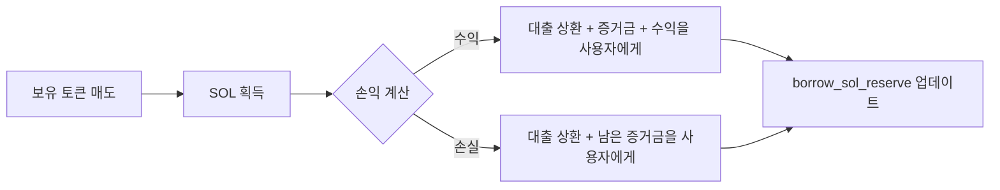
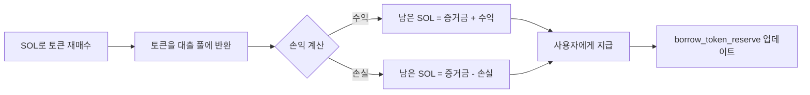
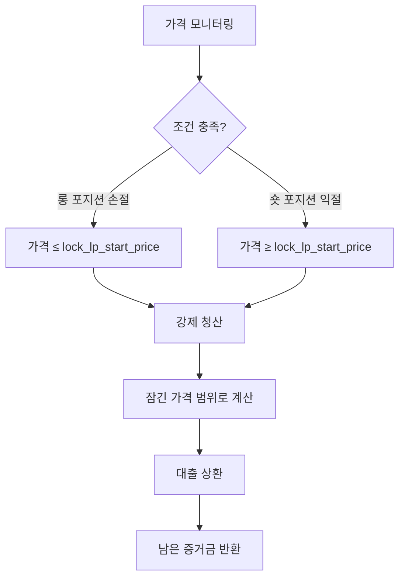
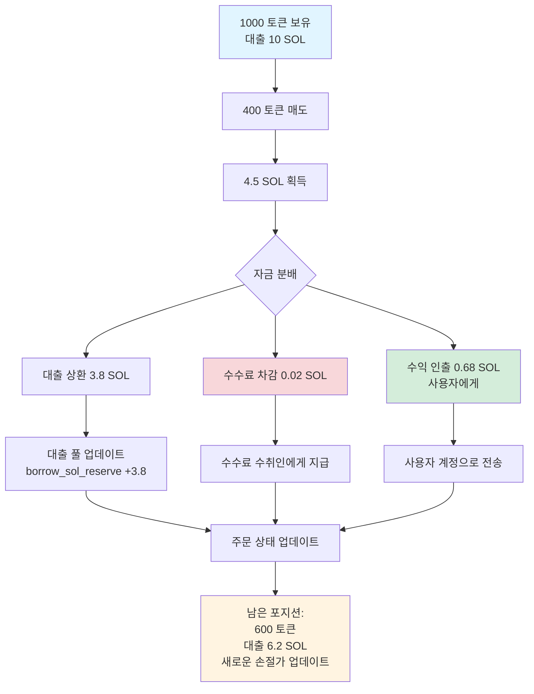
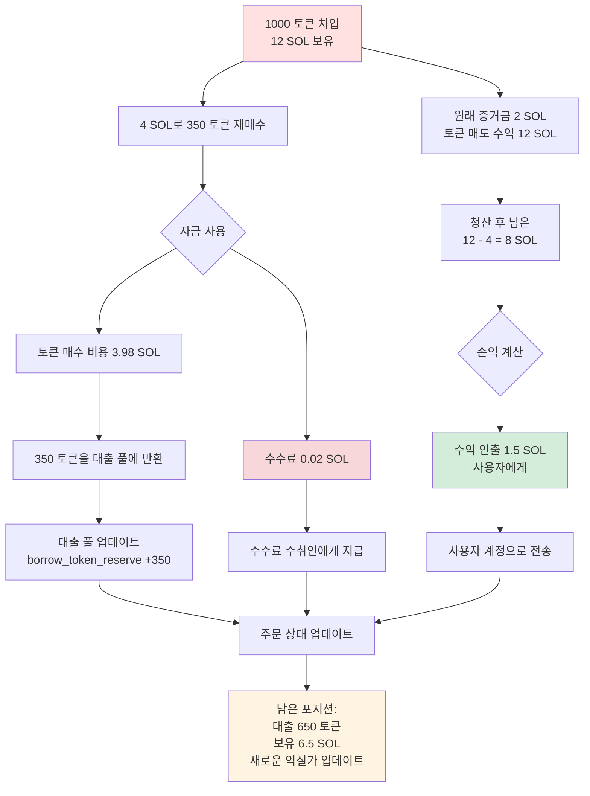

# 🏦 대출 풀 기능 소개

## 일、📋 개요

PinPet 대출 풀은 레버리지 거래를 지원하는 핵심 모듈로, 사용자에게 SOL과 토큰의 대출 서비스를 제공하여 롱 포지션과 숏 포지션 기능을 실현합니다. 대출 풀은 **가상 준비금 풀** 메커니즘을 채택하여 현물 거래의 유동성 풀과 독립적으로 운영되므로, 레버리지 거래가 현물 시장의 정상적인 운영에 영향을 미치지 않도록 보장합니다.

## 이、🎭 대출 풀의 이중 역할

### 2.1 💰 자금 풀로서
- **SOL 대출 풀**: 롱 포지션 거래자에게 SOL 대출 제공
- **토큰 대출 풀**: 숏 포지션 거래자에게 토큰 대출 제공

### 2.2 📦 준비금 관리
대출 풀은 두 개의 독립적인 가상 준비금을 유지합니다:

| 준비금 유형 | 설명 | 용도 |
|---------|------|------|
| `borrow_sol_reserve` | SOL 가상 준비금 | 롱 포지션 거래자에게 대출 |
| `borrow_token_reserve` | 토큰 가상 준비금 | 숏 포지션 거래자에게 대출 |

이러한 준비금은 **가상 장부**이며, 실제 자금은 현물 유동성 풀에 저장되고, 가격 범위 잠금 메커니즘을 통해 격리를 실현합니다.

## 삼、🔄 레버리지 거래 대출 프로세스

### 3.1 📈 롱 포지션 거래 (Long) - SOL을 빌려 토큰 구매

#### ⬆️ 포지션 오픈 단계


**상세 프로세스**:
1. **사용자 투입**: 증거금 지불(예: 0.5 SOL) 💵
2. **대출 풀 대출**: `borrow_sol_reserve`에서 SOL 차입(예: 4.5 SOL) 💸
3. **거래 실행**: 총 5 SOL로 AMM에서 토큰 매수 ⚙️
4. **가격 범위 잠금**: 매수 시 가격 범위를 기록하여 청산 계산에 사용 🔒
5. **주문 기록**: `MarginOrder` 생성, 대출 금액, 증거금, 보유 토큰 수량 기록 📝


#### ⬇️ 포지션 청산 단계


**자금 정산**:
- 토큰 매도로 획득한 SOL 총액 = `output_sol` 💰
- 거래 수수료 차감 💸
- 대출 풀에 상환: `borrow_amount`를 `borrow_sol_reserve`로 반환 ⬅️
- 사용자 수익 = 총액 - 대출 - 증거금 ✅

### 3.2 📉 숏 포지션 거래 (Short) - 토큰을 빌려 매도하여 SOL 획득

#### ⬆️ 포지션 오픈 단계


**상세 프로세스**:
1. **사용자 투입**: 증거금 SOL 지불 💵
2. **대출 풀 대출**: `borrow_token_reserve`에서 토큰 차입 💎
3. **거래 실행**: 토큰 매도하여 SOL 획득, 자금 풀에 입금 ⚙️
4. **가격 범위 잠금**: 매도 시 가격 범위 기록 🔒
5. **주문 기록**: `MarginOrder` 생성, 대출 토큰 수량, 증거금, 보유 SOL 기록 📝


#### ⬇️ 포지션 청산 단계


**자금 정산**:
- 토큰 재매수에 필요한 SOL 총액 = `required_sol` + 수수료 💰
- 대출 풀에 상환: `borrow_amount`(토큰)를 `borrow_token_reserve`로 반환 ⬅️
- 사용자 수익 = 포지션 오픈 시 토큰 매도로 얻은 SOL - 포지션 청산 시 토큰 매수에 사용한 SOL - 증거금 ✅

## 사、💸 대출 풀의 상환 메커니즘

### 4.1 ✅ 능동적 청산 상환
사용자가 능동적으로 포지션을 청산할 때, 시스템이 자동으로 상환을 실행합니다:

| 거래 유형 | 상환 자산 | 상환 출처 | 반환 준비금 |
|---------|---------|---------|---------|
| 롱 포지션 청산 | SOL | 토큰 매도 수익 | `borrow_sol_reserve` |
| 숏 포지션 청산 | 토큰 | 토큰 재매수 | `borrow_token_reserve` |

**상환 우선순위**:
1. 거래 수수료 차감 💸
2. 대출 원금 상환 ⬅️
3. 증거금 반환 💰
4. 수익 분배/손실 처리 📊

### 4.2 ⚠️ 강제 청산 상환
가격이 손절/익절 가격에 도달하면, 시스템이 자동으로 강제 청산을 실행합니다:



**청산 보호** 🛡️:
- 가격 범위 잠금을 통해, 시장 가격이 급격히 변동하더라도 사전 결정된 가격으로 청산 가능
- 증거금 설계로 대출 풀 자금 안전 보장

### 4.3 ⏰ 만기 청산
주문 만기 후 누구나 청산을 트리거할 수 있습니다:

- 롱 포지션 주문: 만기 시간 `end_time` = 포지션 오픈 시간 + `borrow_duration` ⏱️
- 숏 포지션 주문: 동일
- 만기 후 현재 시장 가격으로 강제 청산, 대출 상환 ⚡

## 오、🛡️ 대출 풀 자금 안전 메커니즘

### 5.1 💼 증거금 요구사항
- **최소 증거금**: `MIN_MARGIN_SOL_AMOUNT` (시스템 파라미터) 💰
- **증거금 비율**: 레버리지 배율과 가격 변동 범위에 따라 동적 계산 📊
- **증거금 용도**: 가격 불리한 변동 시 손실 커버 🔒

### 5.2 🔐 가격 범위 잠금
각 주문은 특정 가격 범위의 유동성을 잠급니다:

```
롱 포지션 잠금: [lock_lp_start_price, lock_lp_end_price] (가격 하락 구간)
숏 포지션 잠금: [lock_lp_start_price, lock_lp_end_price] (가격 상승 구간)
```

이는 청산 시 대출을 상환할 충분한 유동성을 보장합니다. ✅

### 5.3 ✔️ 준비금 검사
포지션 오픈 전 시스템 검사:

| 검사 항목 | 조건 | 에러 코드 |
|-------|------|-------|
| SOL 준비금 | `required_borrow_sol ≤ borrow_sol_reserve` | `InsufficientBorrowingReserve` |
| 토큰 준비금 | `required_borrow_token ≤ borrow_token_reserve` | `InsufficientBorrowingReserve` |


## 육、💸 수수료 메커니즘

### 6.1 📊 레버리지 거래 수수료
- **수수료율**: `borrow_fee` (예: 0.5% = 50 베이시스 포인트) 💰
- **수수료 징수 시기**: 포지션 오픈 및 청산 시 모두 징수 ⏰
- **수수료 분배**:
  - 파트너: `fee_split` 비율 (예: 80%) 🤝
  - 기술 제공자: 100% - `fee_split` (예: 20%) ⚙️

### 6.2 ⚡ 강제 청산 수수료
- 청산 트리거 시 추가로 `borrow_fee`를 청산 수수료로 징수 💸
- 제3자의 만기 청산 실행을 인센티브화 🎯

## 칠、🎯 부분 청산 기능

사용자는 부분 청산을 통해 리스크를 유연하게 관리할 수 있습니다: ⚙️

### 7.1 📈 롱 포지션 부분 청산



**주문 업데이트 세부사항**:

| 필드 | 청산 전 | 청산 후 | 설명 |
|-----|-------|-------|------|
| `position_asset_amount` | 1000 토큰 | 600 토큰 | 남은 포지션 |
| `borrow_amount` | 10 SOL | 6.2 SOL | 남은 대출 |
| `lock_lp_start_price` | 원래 손절가 | 새로운 손절가 | 새로운 포지션에 따라 재계산 |
| `realized_sol_amount` | 0 SOL | 0.68 SOL | 실현 수익 누적 |

### 7.2 📉 숏 포지션 부분 청산



**주문 업데이트 세부사항**:

| 필드 | 청산 전 | 청산 후 | 설명 |
|-----|-------|-------|------|
| `borrow_amount` | 1000 토큰 | 650 토큰 | 남은 대출(토큰) |
| `position_asset_amount` | 12 SOL | 6.5 SOL | 남은 보유 SOL |
| `lock_lp_start_price` | 원래 익절가 | 새로운 익절가 | 새로운 포지션에 따라 재계산 |
| `realized_sol_amount` | 0 SOL | 1.5 SOL | 실현 수익 누적 |

### 7.3 ⚠️ 최소 포지션 제한
부분 청산 후 남은 포지션은 `MIN_TRADE_TOKEN_AMOUNT * 2` 이상이어야 하며, 청산할 수 없는 미세한 포지션 발생을 방지합니다.

## 팔、🔗 대출 풀과 유동성 풀의 관계

### 8.1 🔒 자금 격리
- **현물 유동성 풀**: `lp_sol_reserve` + `lp_token_reserve`
- **대출 가상 풀**: `borrow_sol_reserve` + `borrow_token_reserve`

실제 자금은 모두 동일한 `pool_sol_account`와 `pool_token_account`에 있지만, 가격 범위 잠금 메커니즘을 통해 논리적 격리를 실현합니다. 🛡️

### 8.2 🔄 가격 동기화
- 현물 거래와 레버리지 거래는 동일한 `price` (현재 시장 가격)를 공유합니다 💹
- 가격 업데이트 후, 시스템은 유동성 준비금을 재계산합니다: `price_to_reserves(price)` ⚙️

### 8.3 🤝 유동성 상호 보완
- 레버리지 거래로 잠긴 가격 범위는 현물 거래에 참여하지 않습니다 🔐
- 현물 거래는 레버리지 주문의 강제 청산을 트리거하여 유동성을 해제할 수 있습니다 ⚡

## 구、✨ 핵심 장점

| 특징 | 설명 | 장점 |
|-----|------|------|
| 가상 준비금 | 대출 풀은 장부 기록이며, 실제 자금 풀이 아님 | 자금 효율성이 높고, 추가 자본금 불필요 |
| 가격 범위 잠금 | 청산 가격 예측 가능 | 청산 리스크 감소, 대출 풀 보호 |
| 양방향 대출 | SOL과 토큰 양방향 대출 지원 | 롱/숏 포지션 기능 완비 |
| 부분 청산 | 포지션 유연한 조정 | 우수한 사용자 경험, 리스크 통제 가능 |
| 만기 청산 | 시간 제한 + 제3자 인센티브 | 자금의 적시 상환 보장 |


