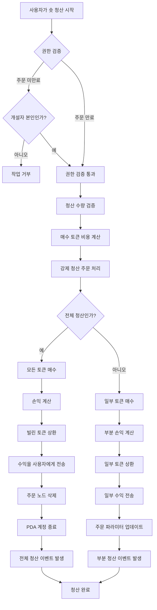

# 💼 PinPet 레버리지 포지션 청산 기능 제품 소개

## 1. 📋 기능 개요

### 🤔 포지션 청산이란?

포지션 청산은 사용자가 보유한 레버리지 거래 포지션을 종료하는 작업입니다. PinPet 플랫폼에서 사용자가 포지션을 개설하면 마진 주문이 생성되어 대출 관계 및 포지션 정보가 기록됩니다. 청산 작업은 해당 주문을 정산하고, 대출금을 상환하며, 손익을 사용자에게 정산합니다.

### 💡 왜 포지션 청산이 필요한가요?

| 청산 이유 | 설명 |
|---------|------|
| **🎯 익절/손절** | 사용자가 능동적으로 청산하여 수익을 확정하거나 손실을 제한 |
| **⏰ 주문 만료** | 만료 후 누구나 청산을 트리거하여 대출 자원 반환 가능 |
| **💰 자금 관리** | 마진을 해제하여 거래 전략을 유연하게 조정 |
| **🛡️ 위험 관리** | 시장 변동으로 인한 더 큰 손실 방지 |

### 📊 청산 유형

- **🔚 전체 청산**: 한 번에 전체 포지션을 종료하고 모든 손익을 정산
- **✂️ 부분 청산**: 포지션을 나누어 종료하여 일부 수익을 실현하고 나머지 포지션 유지

## 2. 📈 롱 포지션 청산 기능 (Close Long)

### 📝 기능 설명

롱 포지션 청산은 본질적으로 **토큰을 매도**하는 작업입니다. 사용자가 이전에 롱 포지션 개설 시 SOL을 빌려 토큰을 구매했고, 청산 시에는 토큰을 매도하여 SOL로 교환하여 대출금을 상환해야 합니다.

### 🔄 작업 흐름도


### ⚙️ 주요 파라미터 설명

| 파라미터명 | 용도 설명 | 예시 값 |
|---------|---------|--------|
| `sell_token_amount` | 매도하려는 토큰 수량 (정확한 값 아님, 약간의 오차 있을 수 있음) | 1000000 (1 토큰) |
| `min_sol_output` | 매도 후 얻을 것으로 예상되는 최소 SOL 수량 (슬리피지 보호) | 50000000 (0.05 SOL) |
| `prev_order_id` | 연결 리스트에서 이전 주문의 인덱스 위치 | 2 |
| `close_order_id` | 청산할 주문의 주문 배열 내 인덱스 | 5 |
| `next_order_id` | 연결 리스트에서 다음 주문의 인덱스 위치 | 7 |
| `close_order_address` | 청산 주문의 주소 (보안 검증용) | "Abc123..." |

### 🧮 손익 계산 설명

#### 🔚 전체 청산 시나리오

**계산 공식**:

```
수익 SOL = (매도로 얻은 SOL) + (마진 SOL) - (빌린 SOL)
```

**계산 단계**:
1. 보유한 모든 토큰을 매도하여 SOL 획득 (수수료 차감 후)
2. 개설 시 납부한 마진 추가
3. 개설 시 빌린 SOL 차감
4. 양수면 수익, 음수면 손실

#### ✂️ 부분 청산 시나리오

**계산 공식**:

```
당회 수익 = (당회 매도 SOL) + (총 마진) + (남은 토큰의 미래 매도 가능 SOL) - (총 대출 SOL)
```

**계산 단계**:
1. 이번 토큰 매도로 얻은 SOL 계산
2. 남은 토큰을 새로운 손절가에서 매도할 경우의 SOL 계산 (수수료 차감 후)
3. 총 자산 = 이번 수익 + 마진 + 남은 매도 가능액
4. 총 대출금을 차감하여 부분 수익 산출
5. 일부 대출금 상환, 나머지 마진으로 포지션 유지

### 💹 손익 시나리오 비교

| 시나리오 | 개설 가격 | 청산 가격 | 보유 토큰 | 빌린 SOL | 마진 | 매도 수익 SOL | 손익 결과 |
|------|---------|---------|---------|---------|--------|-------------|---------|
| **🟢 수익 시나리오** | 0.05 SOL | 0.08 SOL | 100 Token | 5 SOL | 0.5 SOL | 8 SOL | +2.5 SOL |
| **🔴 손실 시나리오** | 0.05 SOL | 0.03 SOL | 100 Token | 5 SOL | 0.5 SOL | 3 SOL | -1.5 SOL |
| **⚖️ 손익분기 시나리오** | 0.05 SOL | 0.055 SOL | 100 Token | 5 SOL | 0.5 SOL | 5.5 SOL | 0 SOL |

## 3. 📉 숏 포지션 청산 기능 (Close Short)

### 📝 기능 설명

숏 포지션 청산은 본질적으로 **토큰을 매수**하는 작업입니다. 사용자가 이전에 숏 포지션 개설 시 토큰을 빌려 매도하여 SOL을 획득했고, 청산 시에는 SOL로 토큰을 재매수하여 대출금을 상환해야 합니다.

### 🔄 작업 흐름도



### ⚙️ 주요 파라미터 설명

| 파라미터명 | 용도 설명 | 예시 값 |
|---------|---------|--------|
| `buy_token_amount` | 매수하려는 토큰 수량 | 1000000 (1 토큰) |
| `max_sol_amount` | 지불할 의향이 있는 최대 SOL 수량 (슬리피지 보호) | 60000000 (0.06 SOL) |
| `prev_order_id` | 연결 리스트에서 이전 주문의 인덱스 위치 | 1 |
| `close_order_id` | 청산할 주문의 주문 배열 내 인덱스 | 3 |
| `next_order_id` | 연결 리스트에서 다음 주문의 인덱스 위치 | 6 |
| `close_order_address` | 청산 주문의 주소 (보안 검증용) | "Def456..." |

### 🧮 손익 계산 설명

#### 🔚 전체 청산 시나리오

**계산 공식**:

```
수익 SOL = (개설 시 토큰 매도 수익 SOL 수수료 포함) - (청산 시 토큰 재매수 비용 SOL) - (수수료)
```

**계산 단계**:
1. SOL로 빌린 모든 토큰 재매수
2. 빌린 토큰을 대출 풀에 상환
3. 계산: 개설 시 매도 수익 - 청산 시 매수 비용 - 수수료
4. 양수면 수익, 음수면 손실

#### ✂️ 부분 청산 시나리오

**계산 공식**:

```
당회 수익 = (이번 재매수 구간 수수료 포함) - (실제 재매수 비용 SOL) - (매수 수수료)
```

**계산 단계**:
1. 이번 일부 토큰 재매수 비용 계산 (수수료 포함)
2. 남은 토큰의 미래 재매수 비용 계산 (수수료 포함)
3. 당회 수익 = 이번 지불 예정액 - 실제 지출액
4. 일부 토큰 상환, 주문 파라미터 업데이트
5. 나머지 마진으로 포지션 유지

### 💹 손익 시나리오 비교

| 시나리오 | 개설 가격 | 청산 가격 | 빌린 토큰 | 매도 수익 SOL | 마진 | 재매수 비용 SOL | 손익 결과 |
|------|---------|---------|---------|-------------|--------|-------------|---------|
| **🟢 수익 시나리오** | 0.08 SOL | 0.05 SOL | 100 Token | 8 SOL | 0.5 SOL | 5 SOL | +2.5 SOL |
| **🔴 손실 시나리오** | 0.05 SOL | 0.08 SOL | 100 Token | 5 SOL | 0.5 SOL | 8 SOL | -2.5 SOL |
| **⚖️ 손익분기 시나리오** | 0.06 SOL | 0.06 SOL | 100 Token | 6 SOL | 0.5 SOL | 6 SOL | -0.06 SOL (수수료) |

## 4. ⏰ 청산 타이밍 및 전략

### 🎯 능동적 청산 타이밍

| 타이밍 유형 | 적용 시나리오 | 권장 전략 |
|---------|---------|---------|
| **📈 익절 청산** | 가격이 목표 도달 | 부분 청산으로 수익 확정, 나머지 포지션 유지 |
| **🛑 손절 청산** | 가격이 손절가 돌파 | 신속히 전체 청산하여 손실 통제 |
| **🔧 포지션 조정** | 시장 추세 변화 | 포지션 축소 또는 확대, 포지션 구조 최적화 |
| **⏳ 만료 전 청산** | 주문 만료 시간 임박 | 능동적 청산으로 강제 청산 방지 |

### ⚡ 수동적 청산 (강제 청산)

**트리거 조건**:
- ⏰ 주문 만료 시간 경과
- 👥 모든 사용자가 청산 트리거 가능
- 💵 청산자는 일정 수수료 보상 획득

**⚠️ 위험 알림**:
- 📉 만료 후 불리한 가격으로 강제 청산될 수 있음
- 💡 만료 전 능동적 포지션 관리 권장

## 5. 📖 사용 시나리오 예시

### 🟢 시나리오 1: 롱 포지션 수익 청산

**배경**:
- 사용자가 0.05 SOL 가격으로 롱 포지션 개설, 100 토큰 매수
- 4.5 SOL 대출, 0.5 SOL 마진 납부
- 현재 가격이 0.08 SOL로 상승

**작업**:
1. 사용자가 전체 청산하여 수익 확정 결정
2. 100 토큰 매도, 약 8 SOL 획득 (수수료 차감 후)
3. 4.5 SOL 대출금 상환
4. 0.5 SOL 마진 회수
5. 순수익: 8 - 4.5 + 0.5(마진은 개설 시 이미 계산됨) = 약 3 SOL

**✅ 결과**: 60% 수익률 달성 성공

### 🔴 시나리오 2: 숏 포지션 손절 청산

**배경**:
- 사용자가 0.05 SOL 가격으로 숏 포지션 개설, 100 토큰 빌려 매도, 5 SOL 획득
- 0.5 SOL 마진 납부
- 가격이 0.08 SOL로 상승하여 손절가 도달

**작업**:
1. 사용자가 긴급 손절 청산
2. 8 SOL로 100 토큰 재매수 (수수료 포함)
3. 100 토큰을 대출 풀에 상환
4. 마진 0.5 SOL + 개설 시 수익 5 SOL = 5.5 SOL 사용 가능 자금
5. 순손실: 5.5 - 8 = -2.5 SOL

**✅ 결과**: 적시 손절로 더 큰 손실 방지

### ✂️ 시나리오 3: 부분 청산으로 포지션 조정

**배경**:
- 사용자가 롱 포지션으로 200 토큰 보유
- 가격이 이미 30% 상승
- 사용자가 일부 수익을 확정하되 상승 전망으로 계속 보유 희망

**작업**:
1. 100 토큰 부분 청산
2. 일부 SOL 대출금 상환
3. 일부 수익을 계정으로 전송
4. 나머지 100 토큰으로 포지션 유지
5. 주문 파라미터 업데이트, 손절가 조정

**✅ 결과**: 유연한 포지션 관리 전략 실현

## 6. ⚠️ 주의사항 및 제한

### 🚫 작업 제한

| 제한 유형 | 구체적 요구사항 | 설명 |
|---------|---------|------|
| **🔐 권한 검증** | 주문 미만료 시 개설자만 청산 가능 | 사용자 자산 보안 보호 |
| **💳 정산 주소** | 개설자의 지갑 주소여야 함 | 자금은 원래 주소로만 반환 |
| **📏 최소 거래량** | 부분 청산 시 최소 거래량의 2배 이상 | 먼지 주문 방지 |
| **📊 잔여 수량** | 부분 청산 후 잔여량이 최소 거래량 이상 | 주문 유효성 보장 |

### ⚠️ 위험 알림

#### 📉 슬리피지 위험
- 청산 시 실제 체결 가격이 예상과 다를 수 있음
- 합리적인 슬리피지 보호 파라미터 설정 권장
- 대량 청산 시 슬리피지 영향이 더 큼

#### 💸 수수료 비용
- 매번 청산 시 거래 수수료 지불 필요
- 빈번한 청산은 비용 증가
- 부분 청산은 두 번의 수수료 필요 (이번 + 향후 전체 청산)

#### ⏰ 시간 위험
- 만료 후 누구나 청산 트리거 가능
- 불리한 가격으로 청산될 가능성
- 만료 임박 주문의 사전 관리 권장

#### 🌊 시장 위험
- 급격한 가격 변동으로 청산 타이밍이 불리할 수 있음
- 극단적 시장 상황에서 청산 발생 가능
- 합리적인 손절가 설정 권장

### 💡 모범 사례 권장사항

1. **🛡️ 합리적인 손절가 설정**: 개설 시 손절가를 계획하고 엄격히 실행
2. **✂️ 분할 청산**: 대규모 포지션은 분할 청산하여 시장 충격 감소
3. **⏰ 만료 시간 주의**: 만료 1-2일 전 능동적으로 주문 관리
4. **💰 수수료 통제**: 지나치게 빈번한 부분 청산 작업 지양
5. **📊 시장 깊이 모니터링**: 대량 청산 전 시장 유동성 확인

### 🔒 기술 보안 보장

- **✅ 주소 검증**: 청산 시 주문 주소 검증으로 잘못된 주문 작업 방지
- **🔐 권한 확인**: 다중 권한 검증으로 승인된 사용자만 작업 가능 보장
- **🛡️ 오버플로 보호**: 모든 수치 계산에 안전한 checked 메서드 사용
- **⚛️ 원자성 작업**: 청산 과정의 모든 단계를 원자적으로 실행하여 상태 불일치 방지

---

## 📚 부록: 용어 해설

| 용어 | 설명 |
|------|------|
| **PDA** | Program Derived Address, 프로그램 파생 주소, 주문 데이터 저장용 |
| **마진** | 사용자가 개설 시 납부한 SOL, 위험 담보로 사용 |
| **대출 풀** | 레버리지 자금을 제공하는 가상 풀 |
| **손절가** | 주문이 강제 청산되는 가격 임계값 |
| **수수료 할인** | 조건 충족 시 누리는 수수료 혜택 |
| **강제 청산** | 주문 만료 후 자동으로 청산되는 메커니즘 |
| **연결 리스트 노드** | 주문의 연결 리스트 내 위치, 다중 주문의 효율적 관리용 |

---

*본 문서는 제품 기능 소개이며 기술 구현 세부사항은 포함하지 않습니다. 기술 구현에 대해 알아보려면 프로젝트 코드 및 기술 문서를 참조하시기 바랍니다.*
