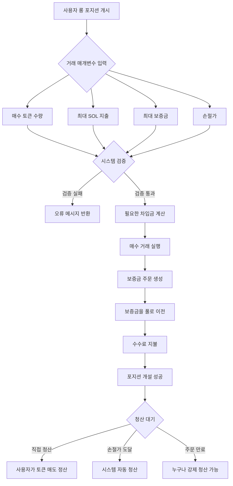
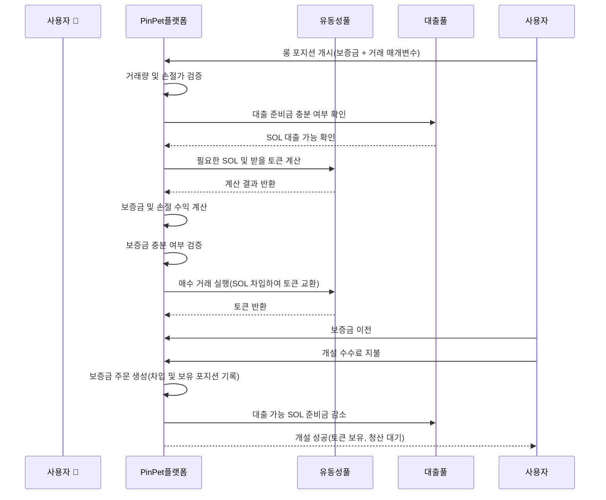
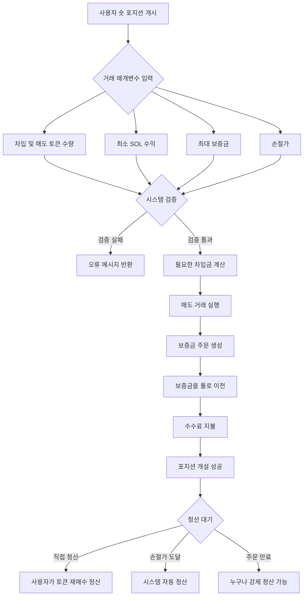
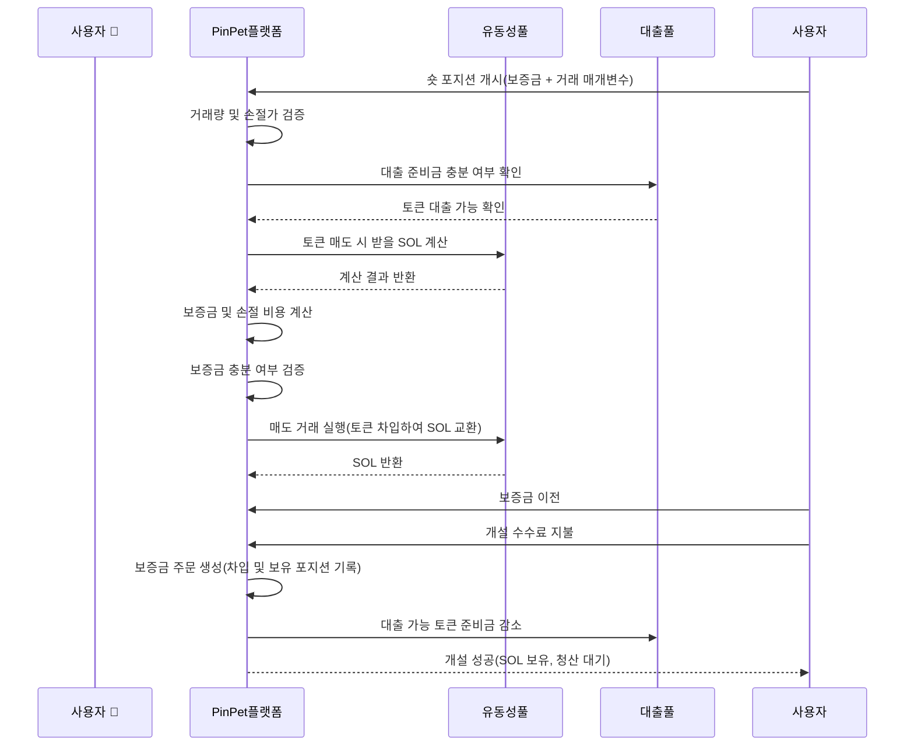
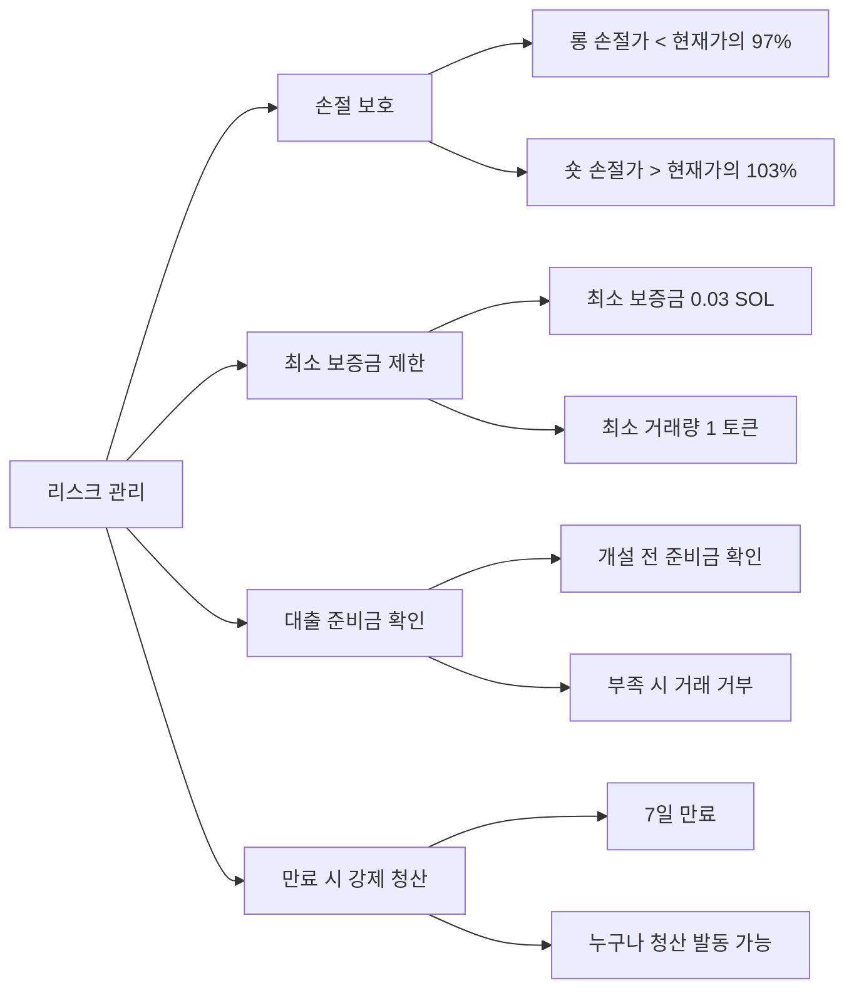

# 📊 PinPet 레버리지 포지션 개설 기능 제품 소개

## 1. 기능 개요 🎯

### 레버리지 거래란 💹

레버리지 거래는 차입 자금을 활용하여 거래 규모를 확대하는 금융 도구로, 사용자가 적은 보증금으로 더 큰 가치의 자산을 통제할 수 있게 합니다. PinPet 플랫폼은 롱(매수)과 숏(매도) 두 가지 레버리지 거래 방식을 제공하여 사용자가 토큰 가격의 상승 또는 하락 시 모두 수익을 얻을 수 있도록 합니다.

### 핵심 개념 💡

- **보증금(Margin)** 💰: 사용자가 직접 투입하는 SOL 자금으로, 거래의 담보 역할
- **차입(Borrow)** 💵: 플랫폼에서 빌리는 자산(롱의 경우 SOL 차입, 숏의 경우 토큰 차입)
- **손절가(Stop Loss Price)** 🛡️: 가격이 이 수준에 도달하면 시스템이 자동으로 포지션을 청산하여 리스크 통제
- **포지션 청산(Close Position)** 🔄: 차입금을 상환하고 손익을 정산하는 작업

### 레버리지 유형 📈📉

| 거래 유형 | 시장 전망 | 차입 자산 | 보유 자산 | 수익 조건 |
|---------|---------|---------|---------|---------|
| 롱(Long) 🟢 | 상승 예상 ⬆️ | SOL 차입 | 토큰 보유 | 토큰 가격 상승 |
| 숏(Short) 🔴 | 하락 예상 ⬇️ | 토큰 차입 | SOL 보유 | 토큰 가격 하락 |

---

## 2. 롱 포지션(Long)🟢📈

### 기능 설명 ✨

롱 포지션은 사용자가 토큰의 미래 가격 상승을 예상하여 플랫폼에서 SOL을 빌려 더 많은 토큰을 구매하고, 가격 상승 후 토큰을 매도하여 차입금을 상환하고 수익을 얻는 방식입니다.

### 사용자 작업 흐름 🔄



### 롱 거래 흐름도 📋



### 주요 매개변수 설명 📝

| 매개변수명 | 설명 | 예시값 | 제약 조건 |
|---------|------|--------|---------|
| buy_token_amount | 매수하려는 토큰 수량 | 1,000,000(1개 토큰) | 최소 거래량(1개 토큰) 이상 |
| max_sol_amount | 지불 의향이 있는 최대 SOL 수량 | 100,000,000(0.1 SOL) | 실제로는 더 적을 수 있음(슬리피지 보호) |
| margin_sol_max | 사용자가 투입 의향이 있는 최대 보증금 | 50,000,000(0.05 SOL) | 0.03 SOL 이상 |
| close_price | 손절가(자동 청산 발동 가격) | 현재 가격의 95% | 현재 가격의 97% 미만이어야 함 |
| borrow_amount | 시스템이 계산한 실제 차입량 | 50,000,000(0.05 SOL) | 대출 풀 준비금을 초과할 수 없음 |
| position_asset_amount | 보유 토큰 수량 | 1,000,000(1개 토큰) | 매수한 토큰 수량과 동일 |

### 보증금 계산 로직 🧮

보증금의 역할은 사용자가 손절 청산 시 차입금을 상환할 수 있도록 보장하는 것입니다. 계산 공식은 다음과 같습니다:

```
실제 보증금 = 매수 총 비용 - 손절 청산 시 수익(수수료 차감 후)
```

**예시:**

현재 토큰 가격이 0.1 SOL/Token인 경우:

1. 사용자가 1개 토큰을 구매하려면 약 0.1 SOL 필요
2. 사용자가 보증금 0.05 SOL 투입, 0.05 SOL 차입
3. 손절가를 0.095 SOL/Token(현재 가격의 95%)으로 설정
4. 시스템 계산: 0.095 가격에 1개 토큰 매도 시 수수료 차감 후 약 0.0945 SOL 획득
5. 보증금 계산: 0.1 - 0.0945 = 0.0055 SOL(실제 필요 보증금)
6. 사용자가 제공한 0.05 SOL이 0.0055 SOL보다 크므로 개설 조건 충족

### 리스크 안내 ⚠️

- **손절 발동** 🛑: 토큰 가격이 손절가까지 하락하면 시스템이 자동으로 토큰을 매도하여 차입금을 상환하며, 사용자는 보증금을 잃게 됩니다
- **주문 만료** ⏰: 대출 기간(기본 7일)을 초과하여 청산하지 않으면 누구나 강제 청산할 수 있으므로, 사용자는 가능한 한 빨리 직접 청산해야 합니다
- **차입 비용** 💸: 개설 및 청산 시 각각 수수료 부과(기본 0.25%)

---

## 3. 숏 포지션(Short)🔴📉

### 기능 설명 ✨

숏 포지션은 사용자가 토큰의 미래 가격 하락을 예상하여 플랫폼에서 토큰을 빌려 즉시 매도하여 SOL을 획득하고, 가격 하락 후 토큰을 다시 구매하여 차입금을 상환하고 수익을 얻는 방식입니다.

### 사용자 작업 흐름 🔄



### 숏 거래 흐름도 📋



### 주요 매개변수 설명 📝

| 매개변수명 | 설명 | 예시값 | 제약 조건 |
|---------|------|--------|---------|
| borrow_sell_token_amount | 차입 및 매도하려는 토큰 수량 | 1,000,000(1개 토큰) | 최소 거래량(1개 토큰) 이상 |
| min_sol_output | 매도 후 기대하는 최소 SOL | 90,000,000(0.09 SOL) | 실제로는 더 많을 수 있음(슬리피지 보호) |
| margin_sol_max | 사용자가 투입 의향이 있는 최대 보증금 | 50,000,000(0.05 SOL) | 0.03 SOL 이상 |
| close_price | 손절가(자동 청산 발동 가격) | 현재 가격의 105% | 현재 가격의 103% 초과해야 함 |
| borrow_amount | 시스템이 계산한 실제 차입량 | 1,000,000(1개 토큰) | 대출 풀 준비금을 초과할 수 없음 |
| position_asset_amount | 보유 SOL 수량 | 95,000,000(0.095 SOL) | 매도 후 받은 SOL과 동일(수수료 차감) |

### 보증금 계산 로직 🧮

숏 포지션의 보증금은 사용자가 손절 청산 시 토큰을 재매수하여 차입금을 상환할 수 있도록 보장하는 데 사용됩니다. 계산 공식은 다음과 같습니다:

```
실제 보증금 = 손절 청산 시 재매수 비용(수수료 포함) - 매도 시 수익(수수료 차감 후)
```

**예시:**

현재 토큰 가격이 0.1 SOL/Token인 경우:

1. 사용자가 1개 토큰을 빌려 매도하여 수수료 차감 후 약 0.0975 SOL 획득
2. 손절가를 0.105 SOL/Token(현재 가격의 105%)으로 설정
3. 시스템 계산: 0.105 가격에 1개 토큰 재매수 시 수수료 포함 약 0.1053 SOL 필요
4. 보증금 계산: 0.1053 - 0.0975 = 0.0078 SOL(실제 필요 보증금)
5. 사용자는 최소 0.0078 SOL을 보증금으로 투입해야 함
6. 사용자가 0.05 SOL 보증금 제공, 0.0078 SOL보다 크므로 개설 조건 충족

### 리스크 안내 ⚠️

- **손절 발동** 🛑: 토큰 가격이 손절가까지 상승하면 시스템이 자동으로 토큰을 재매수하여 차입금을 상환하며, 사용자는 보증금을 잃게 됩니다
- **무한 리스크** ⛔: 이론적으로 토큰 가격은 무한정 상승할 수 있어 숏 포지션의 리스크가 롱 포지션보다 큽니다
- **주문 만료** ⏰: 대출 기간(기본 7일)을 초과하여 청산하지 않으면 누구나 강제 청산할 수 있습니다
- **차입 비용** 💸: 개설 및 청산 시 각각 수수료 부과(기본 0.25%)

---

## 4. 레버리지 거래의 리스크와 수익 📊💰

### 수익 확대 효과 📈💎

레버리지 거래의 핵심 장점은 적은 원금으로 더 큰 자산 규모를 통제하여 수익을 확대하는 것입니다.

**롱 포지션 수익 예시:**

사용자가 0.05 SOL 보증금으로 1개 토큰 롱 포지션을 개설한 경우:

| 시나리오 | 개설가 | 청산가 | 보유 가치 | 상환 금액 | 순수익 | 수익률 |
|------|--------|--------|----------|----------|--------|--------|
| 소폭 상승 | 0.1 | 0.11 | 0.11 SOL | 0.05 SOL | 0.06 SOL | +120% |
| 대폭 상승 | 0.1 | 0.15 | 0.15 SOL | 0.05 SOL | 0.10 SOL | +200% |
| 소폭 하락 | 0.1 | 0.095 | 0.095 SOL | 0.05 SOL | 0.045 SOL | -10% |
| 손절 발동 | 0.1 | 0.095 | 0.095 SOL | 0.05 SOL | 0.045 SOL | -10% |

**숏 포지션 수익 예시:**

사용자가 0.05 SOL 보증금으로 1개 토큰 숏 포지션을 개설한 경우:

| 시나리오 | 개설가 | 청산가 | 보유 가치 | 재매수 비용 | 순수익 | 수익률 |
|------|--------|--------|----------|----------|--------|--------|
| 소폭 하락 | 0.1 | 0.09 | 0.0975 SOL | 0.09 SOL | 0.0075 SOL | +15% |
| 대폭 하락 | 0.1 | 0.05 | 0.0975 SOL | 0.05 SOL | 0.0475 SOL | +95% |
| 소폭 상승 | 0.1 | 0.105 | 0.0975 SOL | 0.105 SOL | -0.0075 SOL | -15% |
| 손절 발동 | 0.1 | 0.105 | 0.0975 SOL | 0.1053 SOL | -0.0078 SOL | -16% |

### 리스크 요인 ⚠️

#### 1. 가격 변동 리스크 📉📈

- **롱 포지션 리스크** 🟢: 토큰 가격이 손절가 이하로 하락하면 전체 보증금 손실
- **숏 포지션 리스크** 🔴: 토큰 가격이 손절가 이상으로 상승하면 전체 보증금 손실
- **급격한 변동** ⚡: 단시간 내 가격 급변으로 빠른 손절 발생 가능

#### 2. 유동성 리스크 💧

- **대출 풀 고갈** 📛: 대출 풀 준비금이 부족하면 포지션 개설 불가
- **슬리피지 손실** 📊: 거래량이 너무 크면 실제 체결 가격이 예상과 다를 수 있음

#### 3. 시간 리스크 ⏰

- **주문 만료** 🔔: 7일을 초과하여 청산하지 않으면 누구나 강제 청산할 수 있으며, 불리한 가격에 청산될 수 있음
- **보유 비용** 💸: 장기 보유 시 시간 비용 및 시장 불확실성 부담

#### 4. 시스템 리스크 🔧

- **가격 계산** 🧮: 상수 곱 알고리즘 기반으로, 대량 거래 시 큰 슬리피지 발생 가능
- **수수료 누적** 💰: 여러 차례 개설 및 청산 시 수수료 누적으로 수익 감소

### 리스크 관리 조치 🛡️

PinPet 플랫폼은 다중 리스크 관리 메커니즘을 제공합니다:



---

## 5. 사용 사례 예시 💼

### 사례 1: 상승 전망 롱 포지션 🟢⬆️

**배경** 📖: 소명이 특정 밈 토큰의 상승 추세를 보고 현재 가격 0.1 SOL

**작업 단계** 🎯:
1. 소명이 0.1 SOL 보증금 투입
2. 0.1 SOL 차입(플랫폼에서 소명에게 대출)
3. 총 0.2 SOL로 2개 토큰 매수
4. 손절가 0.095 SOL로 설정(하락 시 자동 손절)

**수익 상황** 💰📈: 토큰이 0.15 SOL까지 상승
- 2개 토큰 매도하여 0.3 SOL 획득(수수료 차감 후 약 0.2985 SOL)
- 차입금 0.1 SOL 상환, 잔액 0.1985 SOL
- 보증금 0.1 SOL 차감, 순이익 0.0985 SOL(약 +98.5%)

**손절 상황** 🛑📉: 토큰이 0.095 SOL까지 하락(손절 발동)
- 자동으로 2개 토큰 매도하여 0.19 SOL 획득(수수료 차감 후 약 0.1895 SOL)
- 차입금 0.1 SOL 상환, 잔액 0.0895 SOL
- 보증금 손실 0.1 - 0.0895 = 0.0105 SOL(약 -10.5%)

### 사례 2: 하락 전망 숏 포지션 🔴⬇️

**배경** 📖: 소홍이 특정 토큰 가격이 고평가되었다고 판단, 현재 가격 0.2 SOL, 숏 포지션 준비

**작업 단계** 🎯:
1. 소홍이 0.15 SOL 보증금 투입
2. 1개 토큰 차입(플랫폼에서 소홍에게 대출)
3. 즉시 1개 토큰 매도하여 0.2 SOL 획득(수수료 차감 후 약 0.195 SOL)
4. 손절가 0.21 SOL로 설정(상승 시 자동 손절)

**수익 상황** 💰📉: 토큰이 0.15 SOL까지 하락
- 0.15 SOL로 1개 토큰 재매수(수수료 포함 약 0.1504 SOL)
- 차입금 1개 토큰 상환
- 잔액 0.195 - 0.1504 = 0.0446 SOL
- 보증금 0.15 SOL 포함, 총 0.1946 SOL(순이익 0.0446 SOL, 약 +29.7%)

**손절 상황** 🛑📈: 토큰이 0.21 SOL까지 상승(손절 발동)
- 자동으로 0.21 SOL로 1개 토큰 재매수(수수료 포함 약 0.2105 SOL)
- 차입금 1개 토큰 상환
- 지출 0.2105 SOL, 매도 시 획득 0.195 SOL
- 손실 0.0155 SOL, 보증금 차감(약 -10.3%)

### 사례 3: 구간 매매 🔄📊

**배경** 📖: 소강이 단타 매매에 능숙하며 토큰 가격이 0.08 - 0.12 SOL 구간에서 변동할 때 반복 거래

**전략** 🎯:
- 가격이 0.08 SOL에 근접하면 롱 포지션 개설, 손절가 0.075 SOL 설정
- 가격이 0.12 SOL에 근접하면 숏 포지션 개설, 손절가 0.125 SOL 설정
- 매번 5-10% 수익 시 직접 청산

**장점** ✅: 레버리지를 활용하여 구간 변동 수익 확대

**리스크** ⚠️: 구간 돌파 시 손절 가능, 엄격한 규율 필요

---

## 6. 주의사항 및 제한 📌

### 거래 제한 🔒

| 제한 항목 | 값 | 설명 |
|---------|------|------|
| 최소 거래 토큰량 | 1 Token(1,000,000 최소 단위) | 너무 작은 거래량 방지 |
| 최소 보증금 | 0.03 SOL(30,000,000 lamports) | 의미 있는 거래 규모 보장 |
| 롱 손절가 | 현재 가격의 97% 이하 | 최소 3% 손절 공간 |
| 숏 손절가 | 현재 가격의 103% 이상 | 최소 3% 손절 공간 |
| 최대 대출 기간 | 7일(604,800초) | 기간 초과 시 강제 청산 가능 |
| 대출 풀 상한 | 유동성 풀 규모에 따라 동적 조정 | 준비금 부족 시 거래 거부 |

### 수수료 안내 💸

**수수료 유형** 📊:
- 개설 수수료: 기본 0.25%(borrow_fee)
- 청산 수수료: 기본 0.25%(borrow_fee)
- 수수료 배분: 파트너와 기술 제공자가 비율에 따라 분배

**수수료 계산** 🧮:
- 롱 개설: 매수 SOL 금액에 대해 수수료 부과
- 숏 개설: 매도 SOL 금액에 대해 수수료 부과
- 청산: 거래액에 대해 수수료 부과

### 모범 사례 권장 💡

#### 1. 합리적인 손절 설정 🛡️

- **과도한 욕심 금지**: 손절가를 너무 가깝게 설정하지 않기(3% 하한 근처)
- **여유 공간 확보**: 단기 변동을 고려하여 5-10% 손절 공간 확보가 더 안전
- **적시 익절**: 목표 수익 달성 시 직접 청산, 강제 청산 대기하지 않기

#### 2. 포지션 규모 통제 📊

- **분산 투자** 🎯: 모든 자금을 단일 주문에 투입하지 않기
- **단계별 진입** ➡️: 여러 번 소액 개설로 단일 리스크 감소
- **자금 예비** 💰: 추가 보증금 요구에 대비하여 일부 자금 보유(향후 기능)

#### 3. 적절한 시기 선택 ⏰

- **충분한 유동성** 💧: 대출 풀 준비금이 충분할 때 개설
- **급격한 변동 회피** ⚡: 가격 급변 시 손절 발동 쉬움
- **만료 시간 주의** 🔔: 예상 보유 기간이 7일 상한에 가깝지 않도록

#### 4. 주문 상태 모니터링 👀

- **정기적 확인** 🔍: 최소 하루에 한 번 주문 상태 확인
- **가격 경보** 🚨: 가격이 손절가에 근접하면 적시 결정
- **직접 청산** ✅: 시스템 자동 손절 대기하지 않고 직접 청산으로 슬리피지 회피

### 자주 묻는 질문 ❓

**Q1: 보증금은 반환되나요?**

A: 네. 직접 청산 시 수익이 있으면 보증금과 수익이 함께 반환되며, 손절 발동 시 잔여 보증금이 반환됩니다(0일 수 있음).

**Q2: 조기 청산 가능한가요?**

A: 가능합니다. 주문 만료 전 사용자는 언제든지 직접 청산할 수 있으며 추가 페널티가 없습니다.

**Q3: 주문 만료 후에는 어떻게 되나요?**

A: 주문 만료 후 누구나 강제 청산을 발동할 수 있습니다. 만료 전 직접 청산하여 불리한 가격에 청산되는 것을 피하는 것을 권장합니다.

**Q4: 대출 풀 준비금이 부족하면 어떻게 하나요?**

A: 대출 풀 준비금이 부족하면 시스템이 개설을 거부합니다. 다른 사용자가 청산하여 준비금이 해제되기를 기다리거나 다른 거래 쌍을 선택하시기 바랍니다.

**Q5: 수수료는 어떻게 계산되나요?**

A: 수수료는 거래 금액의 일정 비율(기본 0.25%)로 부과됩니다. 개설 및 청산 시 각각 한 번씩 부과되어 총 약 0.5%의 비용이 발생합니다.

**Q6: 손절가를 조정할 수 있나요?**

A: 현재 버전은 손절가 조정을 지원하지 않습니다. 개설 시 신중하게 손절가를 설정하시기 바랍니다.

---

## 7. 요약 📝

PinPet 레버리지 포지션 개설 기능은 사용자에게 유연한 롱/숏 도구를 제공하여 토큰 상승 또는 하락 시 모두 수익을 얻을 수 있습니다. 보증금과 손절 메커니즘을 합리적으로 사용하면 사용자는 수익을 확대하면서 리스크를 통제할 수 있습니다.

**핵심 장점** ✨:
- **양방향 거래** 🔄: 롱과 숏 모두 수익 가능
- **레버리지 확대** 📈: 적은 자금으로 큰 수익 창출
- **자동 손절** 🛡️: 가격 보호 메커니즘으로 리스크 감소
- **유연한 청산** ✅: 언제든지 직접 정산 가능

**리스크 경고** ⚠️:
- ⛔ 레버리지 거래는 고위험이며 전체 보증금을 잃을 수 있습니다
- 📚 거래 메커니즘을 충분히 이해한 후 거래하시기 바랍니다
- 💡 소액부터 시작하여 점진적으로 경험을 쌓으시기 바랍니다
- 🚫 감당할 수 있는 능력을 초과하는 자금을 투입하지 마십시오

거래에 행운을 빕니다! 🎉
