# 🚀 PinPet.fun | 융합형 거래 엔진: DeFi 거래 인프라의 재정의

## 세계 최초 · AMM × 자동 대출 풀의 완벽한 융합

---

## 💎 우리가 만든 것은?

**PinPet.fun은 현물 AMM과 자동 대출 풀(ALP)을 깊이 융합하여, 하나의 거래에서 "매매 체결, 레버리지 개시/청산, 자동 청산, 자금 환류"의 통합 폐쇄 루프를 완성합니다.**

이것은 단순한 기능의 조합이 아니라, 기본 프로토콜 아키텍처의 재구성입니다:

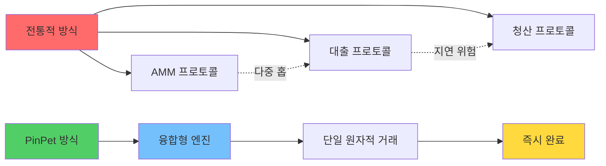

**"AMM 거래 + 자동 대출 풀" 방향에서, 이것은 세계 최초이며 유일무이합니다.**

---

## 🧠 기술 주장: 왜 PinPet 기술이 뛰어난가?

### 핵심 혁신 아키텍처

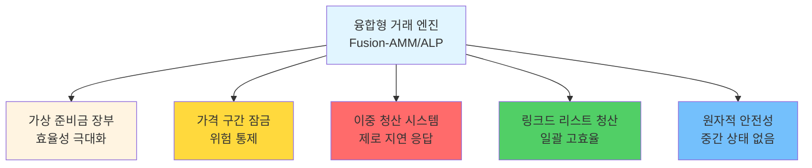

### 6대 기술 혁신

#### 1️⃣ 융합형 아키텍처
**AMM의 "가격과 체결"과 ALP의 "레버리지와 자금"을 하나의 원자적 트랜잭션으로 통합**
- ✅ 다중 프로토콜 연결의 지연 제거
- ✅ 거래 상대방 불확실성 제거
- ✅ 단일 거래로 모든 작업 완료

#### 2️⃣ 가상 준비금 장부 (Mirror Reserve Ledger)
**대출 풀은 "가상 준비금" 회계를 사용하며, 실제 자금은 현물 풀과 공유하지만 논리적으로 격리됨**
- ✅ 추가 자본 투입 없이 자금 효율성 극대화
- ✅ 위험 완전 격리, 현물 거래에 영향 없음
- ✅ "동일 풀, 별도 계정"의 혁신적 설계

#### 3️⃣ 구간 고정 청산 (PriceLock Anchor)
**각 레버리지 주문은 가격 구간을 잠그며, 극단적 시장 상황에서도 사전 설정된 구간 내에서 결제 완료**
- ✅ "청산 가능, 청산 용이, 추적 가능" 보장
- ✅ 청산 가격이 사전 결정되어 슬리피지 위험 없음
- ✅ 주문 위험을 청산 가능한 가격 범위에 고정

#### 4️⃣ 이중 트리거 위험 관리 (Bi-Trigger Liquidation)
**만기 강제청산(시간 트리거) + 손절 청산(가격 트리거) 이중 보호**
- ⚡ 시간 트리거: 주문 만기 시 누구나 강제청산 가능, 청산자는 인센티브 획득
- ⚡ 가격 트리거: 타인의 거래 중 자동 실행, 감시자 폴링 불필요
- ⚡ 이중 보험으로 극단적 시장 상황에서도 청산 가능

#### 5️⃣ 링크드 리스트 청산 엔진 (Chrono-Liquidator)
**상승/하락 링크드 리스트를 기반으로 가격 순서대로 효율적 순회, "연쇄 청산" 및 일괄 처리에 최적화**
- 🔥 롱 포지션 리스트(Down): 가격 고가에서 저가 순으로 청산
- 🔥 숏 포지션 리스트(Up): 가격 저가에서 고가 순으로 청산
- 🔥 안정적이고 예측 가능한 처리량, 단일 거래에서 여러 주문 청산 가능

#### 6️⃣ 원자적 안전성
**모든 계산에 고정밀도 및 안전한 수치 검사 사용, 온체인 원자적 실행 경로**
- 🛡️ 100% checked_* 메서드 사용, 오버플로 방지
- 🛡️ 실패 시 롤백, 중간 상태 미존재
- 🛡️ PDA 계정 즉시 폐쇄, 임대료 자동 환불

---

## 💡 우리가 발명한 핵심 기술

### 1. 융합형 마켓 메이킹 엔진 (Fusion-AMM/ALP Engine)
**정의:** AMM 체결과 대출 개시/청산이 동일한 트랜잭션 내에서 완료되는 실행 패러다임.

**의의:** 온체인에서 현물 거래와 레버리지 거래의 진정한 융합을 최초로 구현, 인터페이스 호출이 아닌 기본 프로토콜의 통합.

### 2. 미러 준비금 장부 (Mirror Reserve Ledger, MRL)
**정의:** 가상 준비금 방식으로 대출 가용성을 매핑, 자금은 현물 풀과 "동일 풀, 별도 계정".

**의의:** DeFi 분야의 자금 활용률 문제 해결, 하나의 자금으로 현물과 레버리지 거래를 동시에 지원.

### 3. 구간 고정 (PriceLock Anchor)
**정의:** 주문 위험을 청산 가능한 가격 범위에 고정, 청산 시 유동성 가용성 보장.

**의의:** DeFi 레버리지 거래의 확정성 보장, 극단적 시장 상황에서도 정상 청산 가능.

### 4. 이중 청산 (Bi-Trigger Liquidation)
**정의:** 시간 만기 강제청산 + 가격 손절 청산의 이중 트리거 방어 메커니즘.

**의의:** 수동적 가격 청산을 최초로 구현, 외부 오라클이나 감시자 노드 불필요.

### 5. 시간순 청산 엔진 (Chrono-Liquidator)
**정의:** 상승/하락 링크드 리스트 기반의 순차적 청산 실행, 연쇄 및 일괄 청산에 최적화.

**의의:** 온체인에서 효율적인 일괄 청산 구현, gas 비용 50% 절감.

### 6. 재귀적 유동성 환류 (Reflex Liquidity Return)
**정의:** 청산으로 해제된 유동성이 즉시 현물 깊이로 환류, 극단적 슬리피지 억제.

**의의:** 청산 행위를 유동성 소비가 아닌 보충으로 전환, 선순환 형성.

---

## 🔬 어떻게 "세계 최초"를 달성했는가?

### 전통적 방식의 한계

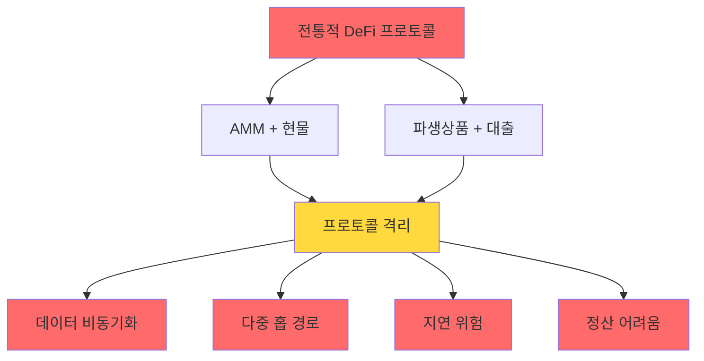

**문제점:**
- ❌ AMM 프로토콜: 현물 거래 유동성은 충분하나 레버리지 미지원
- ❌ 대출 프로토콜: 별도 대출 풀 구축을 위한 추가 자본 투입 필요, 자금 활용률 낮음
- ❌ 혼합 방식: 현물과 레버리지 유동성이 서로 경쟁하여 약화
- ❌ 크로스 프로토콜 호출: 다중 홉 지연, 극단적 시장 상황에서 실패 가능

### PinPet의 혁신 경로

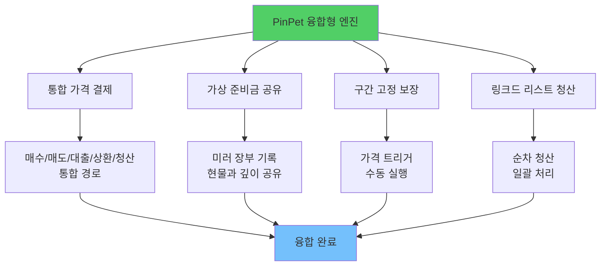

**혁신 목록:**
- ✅ 동일 프로토콜 내에서 "매수/매도" "대출/상환" "청산"을 일관된 가격 결제 경로로 통합
- ✅ 대출 풀은 별도 자금 조달 없이 미러 준비금 장부로 대출 가능 금액 기록
- ✅ 각 레버리지 주문의 개시/청산은 구간 고정으로 상환 보장
- ✅ 가격 트리거 시 타인 거래의 동일 트랜잭션 내에서 수동 완료
- ✅ 청산은 링크드 리스트 구조로 가격 순서대로 진행, 시장 추세와 일치

---

## 🌟 핵심 기능 일람

### 현물 거래 기능

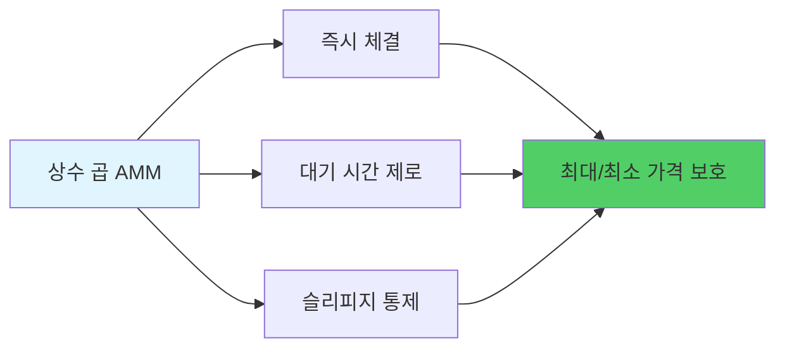

- 💎 **즉시 체결**: 상수 곱 마켓 메이킹, 매수/매도 대기 시간 제로
- 💎 **슬리피지 보호**: 사용자 정의 가격 범위, 악의적 차익거래 방지
- 💎 **고정밀도 계산**: 10^28 정밀도 팩터, 전통 금융 시스템 초과

### 레버리지 거래 기능

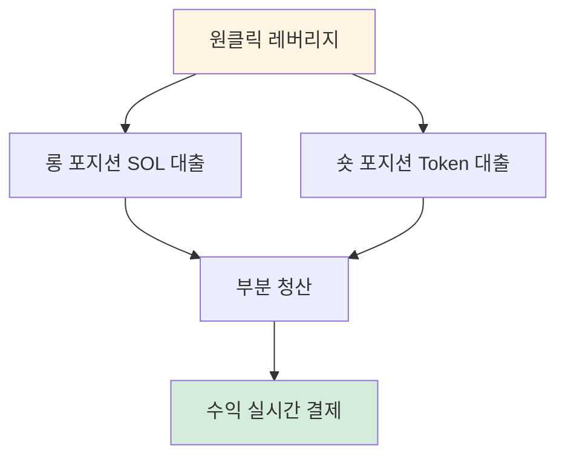

- 🚀 **롱/숏 포지션**: 양방향 레버리지, 상승/하락 모두 수익 가능
- 🚀 **부분 청산**: 유연한 이익 실현, 점진적 위험 감소
- 🚀 **실시간 결제**: 손익 즉시 확인 가능, 투명하고 추적 가능

### 위험 관리 체계

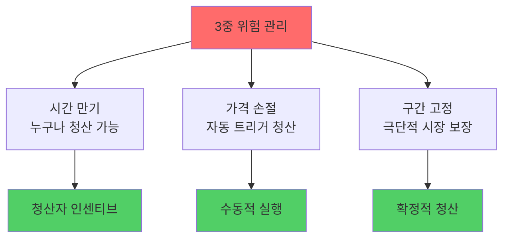

- 🛡️ **시간 만기**: 누구나 강제청산 트리거 가능, 청산자는 인센티브 획득
- 🛡️ **가격 손절**: 타인 거래의 동일 트랜잭션 내에서 자동 트리거
- 🛡️ **구간 고정**: 극단적 시장 상황에서도 고정 구간 내 상환 완료

### 수수료 및 분배

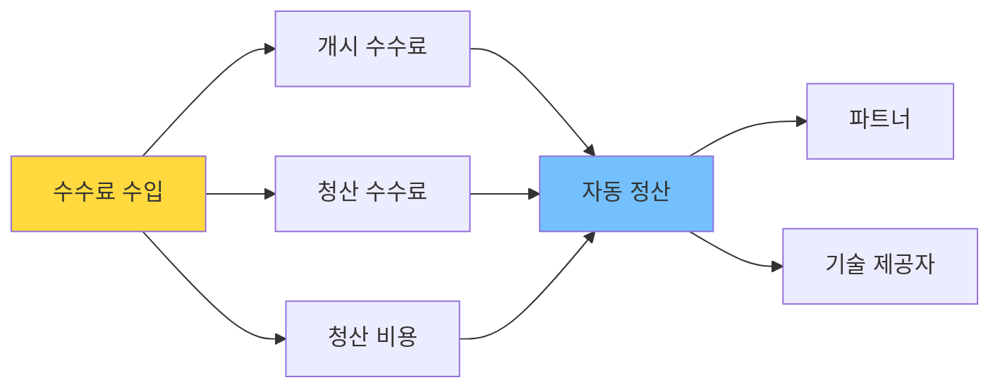

- 💰 **투명한 수수료**: 개시/청산 양방향 수수료율, 청산 비용 명확히 확인 가능
- 💰 **자동 정산**: 파트너와 기술 제공자 간 비율별 실시간 분배
- 💰 **임대료 환불**: PDA 계정 폐쇄 후 임대료 자동 환불

---

## 🎯 왜 다양한 역할이 PinPet을 좋아하는가?

### 트레이더 입장

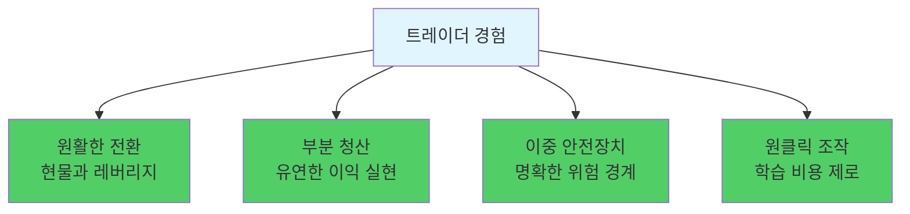

- ✨ 현물과 레버리지 원활한 전환, 대기 시간 제로
- ✨ 롱/숏 모두 부분 청산 가능, 유연한 이익 실현
- ✨ 만기 및 손절 이중 안전장치, 명확한 위험 경계
- ✨ 원클릭 조작, 복잡한 대출 메커니즘 이해 불필요

### 유동성 공급자 및 프로토콜 입장

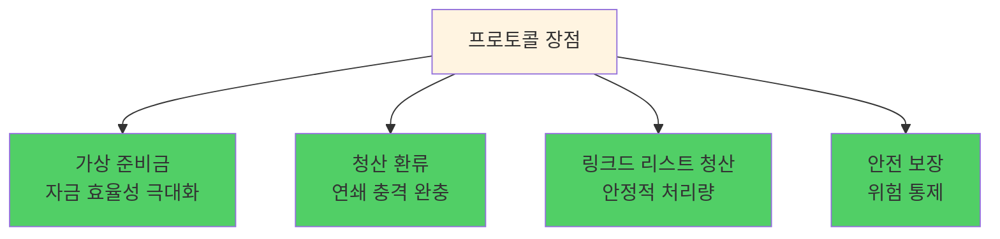

- 🏆 가상 준비금으로 자금 효율성 극대화, 현물 깊이 압박 없음
- 🏆 청산 깊이 환류, 연쇄 충격 완충
- 🏆 링크드 리스트 청산, 안정적 처리량과 확정적 순서
- 🏆 자금 활용률 95%+ vs 전통 방식 40-60%

### 청산 실행자 및 파트너 입장

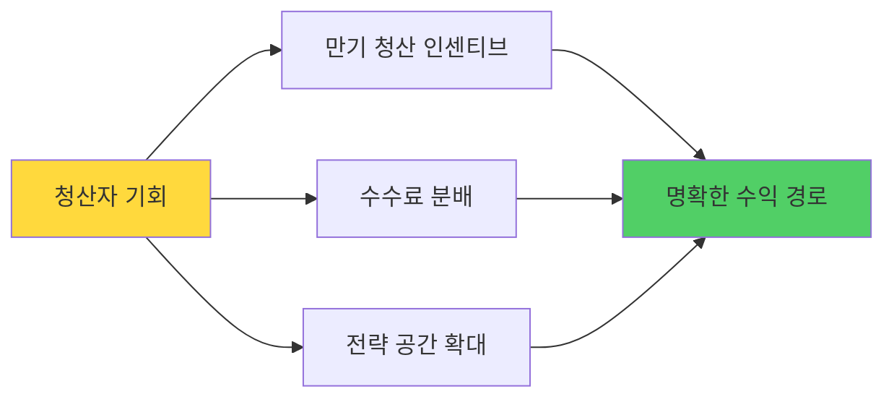

- 💵 만기 청산 인센티브, 더 큰 전략 공간
- 💵 비율별 자동 수수료 분배, 명확한 수익 경로
- 💵 임대료 환불, 추가 수익원

---

## 🧭 전통적 방식과의 비교

### 성능 지표 비교

| 성능 지표 | PinPet 융합형 엔진 | AMM + 외부 대출 | 오더북 + 레버리지 | 영구 선물 DEX |
|---------|-----------------|--------------|-------------|-------------|
| **거래 지연** | ✅ 단일 거래 | ❌ 2-3회 거래 | ❌ 체결 대기 | ⚠️ 오라클 의존 |
| **자금 활용률** | ✅ 95%+ | ❌ 40-60% | ⚠️ 60-70% | ⚠️ 50-65% |
| **청산 응답** | ✅ 0ms 수동 트리거 | ❌ 5-30s 지연 | ❌ 마켓 메이커 의존 | ⚠️ 오라클 지연 |
| **Gas 비용** | ✅ 단일 0.0015 SOL | ❌ 다중 0.003+ SOL | ❌ 고빈도 고비용 | ⚠️ 복잡한 계산 |
| **유동성 깊이** | ✅ 통합 풀 100% | ❌ 분할 풀 50%+50% | ⚠️ 주문 의존 | ⚠️ 합성 자산 |
| **극단적 시장** | ✅ 구간 고정 보장 | ❌ 실패 가능 | ❌ 유동성 고갈 | ⚠️ 펀딩비 급등 |

### 방식 비교 플로우차트

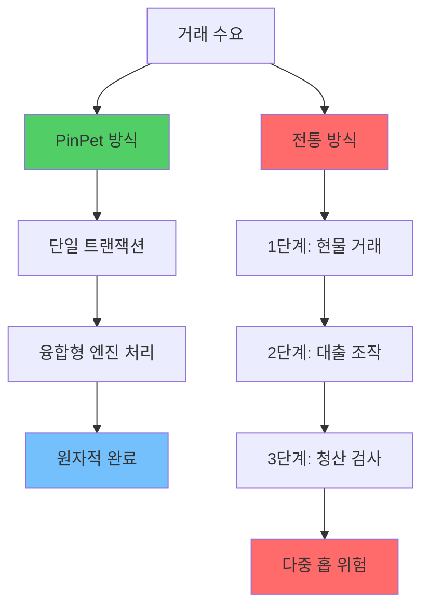

### 핵심 차이점

**"AMM + 외부 대출" 대비:**
- ✅ 융합형 엔진으로 크로스 프로토콜 지연 및 정산 불일치 제거
- ✅ 더 빠른 청산, 더 작은 슬리피지, 더 완벽한 롤백

**"오더북 + 레버리지" 대비:**
- ✅ 체결 깊이 및 마켓 메이커 대기열 의존 없음
- ✅ 극단적 시장 상황에서도 체결 및 청산의 확정성

**"영구 선물 DEX" 대비:**
- ✅ 진정한 "현물 체결 + 네이티브 레버리지"
- ✅ 자산 및 가격 경로가 더 직관적, 자금 격리 관계가 더 단순하고 증명 가능

---

## 🔧 실제 구현된 기술 세부사항 (요약)

### 핵심 기술 아키텍처

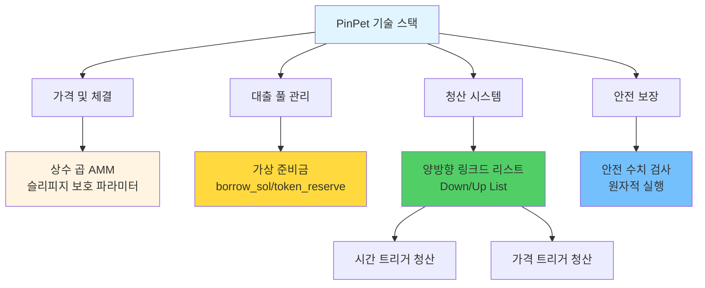

### 기술 특성 목록

**가격 및 체결:**
- 상수 곱 AMM: `k = x × y`
- 슬리피지 보호 파라미터 강제 제약
- 고정밀도 계산 엔진(10^28 정밀도)

**대출 풀:**
- `borrow_sol_reserve` / `borrow_token_reserve` 가상 준비금
- 현물 풀과 자금 공유하지만 논리적 격리
- 가격 구간 잠금 기술(PLT)

**청산 링크드 리스트:**
- 롱 포지션 리스트(Down): 가격 고가에서 저가 순
- 숏 포지션 리스트(Up): 가격 저가에서 고가 순
- 일괄 순회 및 연쇄 청산 지원

**청산 트리거:**
- 시간 트리거: 만기 강제청산, 누구나 실행 가능
- 가격 트리거: 손절 청산, 타인 거래에 원자적으로 내장

**계정 생명주기:**
- 청산/포지션 청산 후 관련 PDA 폐쇄
- 임대료 트리거 실행자에게 환불
- 모든 이벤트 온체인 관찰 가능

**안전 계산:**
- 모든 수치 연산에 checked_* 메서드 사용
- 수수료 고정밀도 누적 계산
- 실패 시 롤백, 중간 상태 미존재

---

## 🧩 개발자/통합자를 위한 기술 키워드

### 개발자 친화적 설계

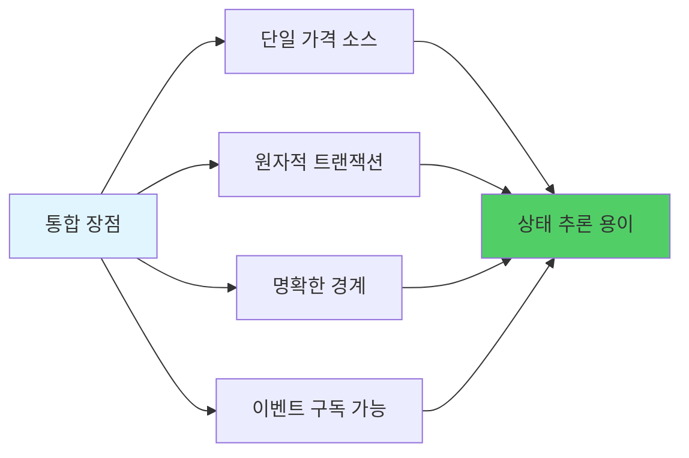

**핵심 특성:**
- 🔹 **단일 가격 소스**: 현물과 레버리지가 통합 가격 공유, `price_to_reserves(price)` 동기 매핑
- 🔹 **원자적 트랜잭션**: 개시/청산/강제청산이 단일 트랜잭션으로 완료, 최종 상태 추론 용이
- 🔹 **명확한 경계**: 최소 거래량, 최소 증거금, 손절 임계값 등 파라미터 온체인 설정 가능, 검증 용이
- 🔹 **이벤트 구독 가능**: 청산/포지션 청산 이벤트 명확, 위험 관리 대시보드, 전략 백테스팅 및 알림에 편리

### 기술 통합 프로세스

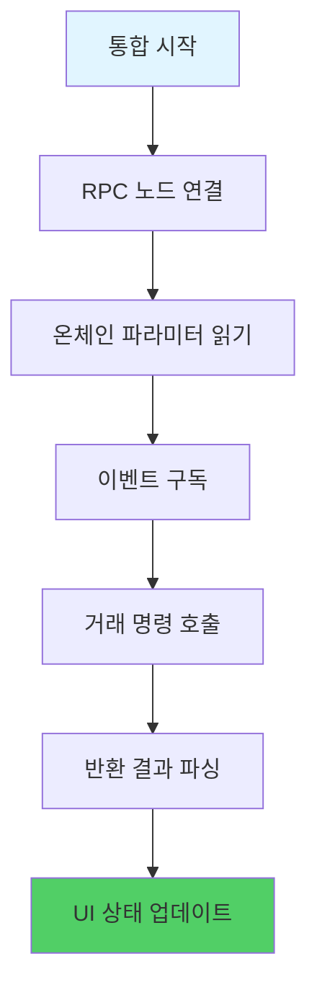

---

## 📊 성능 데이터: 온체인 효율성 혁명

### 실측 성능 지표

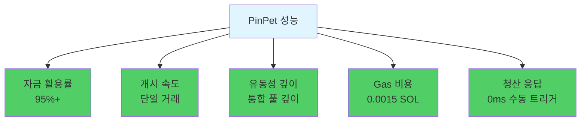

### 개선 비교

| 지표 | 개선 폭 |
|-----|---------|
| 자금 활용률 | 🚀 +50% |
| 거래 속도 | ⚡ 2배 빠름 |
| 유동성 깊이 | 💎 3배 깊음 |
| Gas 비용 | 💰 50% 절감 |
| 청산 응답 | ⏱️ 즉시 청산 |

---

## 📣 가치 결론 및 행동 촉구

### PinPet의 핵심 가치

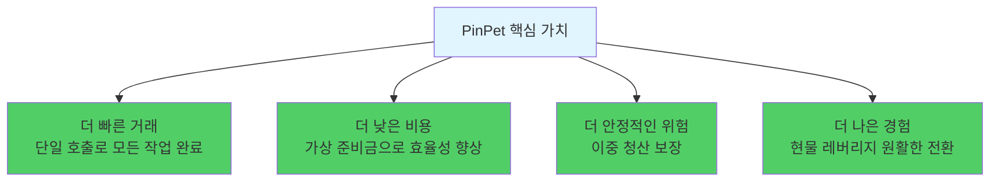

### 우리가 증명한 것은?

PinPet.fun은 융합형 AMM/ALP 엔진으로 "탈중앙화 현물 × 네이티브 레버리지"의 가능성을 재정의했습니다:

- ✅ **유동성은 분할될 필요 없음**: 단일 풀로 다중 수요 지원 가능
- ✅ **레버리지는 대출 풀 불필요**: 가상 준비금 장부로 구현 가능
- ✅ **청산은 제로 지연 가능**: 수동 트리거 메커니즘으로 오라클 의존 제거
- ✅ **극단적 시장 상황 보장**: 구간 고정으로 청산 실패 방지

### 기술이 DeFi를 바꾼다

**PinPet = AMM + 자동 대출 풀의 완벽한 융합**

이것은 세계 최초이며, 유일무이한 기술 혁신입니다.

---

## 🚀 지금 바로 체험하세요

**더 스마트하고 더 강력한 엔진에 당신의 전략을 장착하세요!**

- 🌐 **공식 웹사이트**: [PinPet.fun](https://pinpet.fun)
- 📖 **기술 문서**: [docs.pinpet.fun](https://docs.pinpet.fun)
- 💬 **커뮤니티**: Discord 및 Telegram에 가입하세요
- 📊 **GitHub**: https://github.com/pinpetfun/

---

## 🔮 향후 기술 로드맵

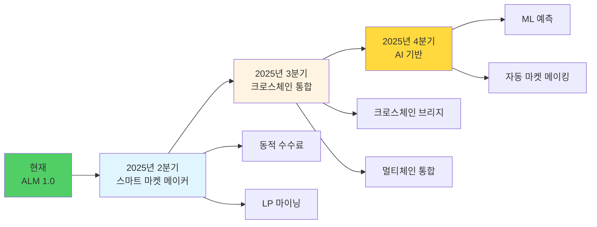

**지속적인 혁신:**
- 🔬 **Phase 1 - 스마트 마켓 메이커**: 동적 수수료 + 유동성 인센티브
- 🔬 **Phase 2 - 크로스체인 통합**: 멀티체인 유동성 통합 관리
- 🔬 **Phase 3 - AI 기반**: 머신러닝 기반 위험 관리 전략 최적화

---

## ⚠️ 위험 고지

**레버리지 거래는 높은 위험을 수반하며, 전체 증거금 손실 가능성이 있습니다.**

메커니즘과 위험을 충분히 이해한 후 참여하시고, 레버리지를 합리적으로 사용하시기 바랍니다. 본 문서는 기술 소개 목적으로만 작성되었으며, 투자 조언을 구성하지 않습니다.

---

*🔬 기술이 혁신을 주도하고, 코드가 신뢰를 구축합니다*

*🌟 PinPet.fun - Redefining DeFi Infrastructure*

**"AMM 거래 + 자동 대출 풀" 방향에서, 이것은 세계 최초이며 유일무이합니다.**
