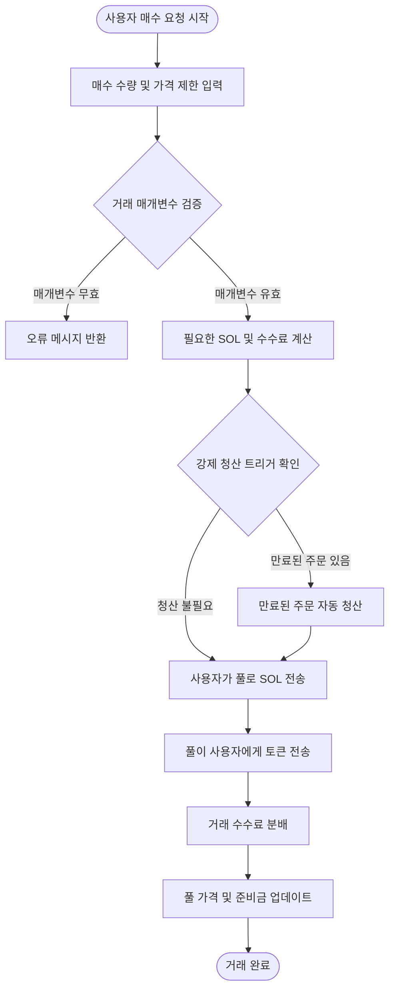
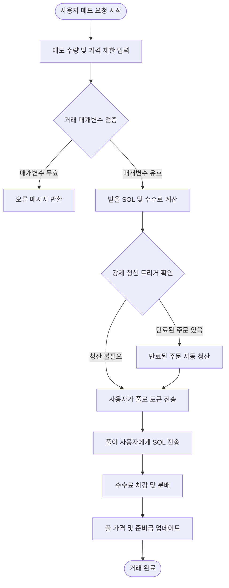

# 💱 PinPet 현물 거래 기능 소개

## 📊 기능 개요

현물 거래는 PinPet 플랫폼의 핵심 기능 중 하나로, 사용자가 탈중앙화 유동성 풀에서 직접 토큰을 사고 팔 수 있습니다. 전통적인 오더북 방식과 달리, PinPet은 자동화 마켓 메이커(AMM) 메커니즘을 채택하여 상수 곱 알고리즘(x × y = k)을 기반으로 거래 가격을 자동으로 결정합니다.

**✨ 핵심 특징:**
- **⚡ 즉시 체결**: 매수자와 매도자의 매칭을 기다릴 필요 없이 거래가 즉시 완료됩니다
- **🔍 투명한 가격 책정**: 가격은 알고리즘에 의해 자동으로 계산되어 공개적이고 투명합니다
- **🌊 지속적인 유동성**: 풀에 충분한 자산이 있는 한 언제든지 거래할 수 있습니다
- **🛡️ 슬리피지 보호**: 사용자가 최대/최소 가격 제한을 설정하여 비정상적인 가격 변동을 방지할 수 있습니다

---

## 🛒 매수 거래 흐름 (Buy)

### 👤 사용자 조작 단계

매수 거래는 사용자가 SOL(Solana 네이티브 토큰)을 사용하여 프로젝트 토큰을 구매할 수 있습니다.

### 🔑 주요 매개변수 설명

| 매개변수명 | 용도 설명 | 예시 값 | 비고 |
|---------|---------|--------|------|
| buy_token_amount | 구매하려는 토큰 수량 | 1000000 (1개 토큰) | 최소값: 1000000 (1개 토큰) |
| max_sol_amount | 지불할 최대 SOL 수량 | 50000000 (0.05 SOL) | 과도한 가격 슬리피지 방지용 |
| lp_pairs | 유동성 풀 상태 스냅샷 | [{sol: 30, token: 1000000}] | 프론트엔드에서 자동 제공 |

### ⚙️ 거래 실행 로직

1. **매개변수 검증**
   - 매수 수량이 최소 거래량(1개 토큰)에 도달하는지 확인
   - 유동성 풀 상태가 온체인과 일치하는지 검증

2. **가격 계산**
   - 현재 풀 준비금을 기반으로 상수 곱 공식을 사용하여 필요한 SOL 계산
   - 수수료를 포함한 실제 지불 금액 계산
   - 실제 체결 가격이 사용자 설정 최대값을 초과하는지 확인

3. **자동 청산 메커니즘**
   - 거래가 일부 레버리지 주문의 청산 가격을 넘어서는 가격 변동을 초래하는 경우, 시스템이 자동으로 해당 주문을 청산
   - 청산으로 발생한 수수료는 플랫폼과 파트너에게 분배

4. **자금 이체**
   - 사용자 계정 → 유동성 풀: SOL 전송(수수료 포함)
   - 유동성 풀 → 사용자 계정: 토큰 전송

5. **수수료 분배**
   - 사전 설정된 비율에 따라 파트너와 기술 제공자에게 분배
   - 기본 수수료율은 관리자가 구성할 수 있음

6. **상태 업데이트**
   - 유동성 풀의 현재 가격 업데이트
   - 풀의 SOL 및 토큰 준비금 재계산
   - 수수료 할인 트리거 여부 확인

---

## 💸 매도 거래 흐름 (Sell)

### 👤 사용자 조작 단계

매도 거래는 사용자가 보유한 토큰을 판매하여 SOL로 교환할 수 있습니다.

### 🔑 주요 매개변수 설명

| 매개변수명 | 용도 설명 | 예시 값 | 비고 |
|---------|---------|--------|------|
| sell_token_amount | 판매하려는 토큰 수량 | 1000000 (1개 토큰) | 최소값: 1000000 (1개 토큰) |
| min_sol_output | 받기를 기대하는 최소 SOL 수량 | 20000000 (0.02 SOL) | 과도한 가격 슬리피지 방지용 |
| lp_pairs | 유동성 풀 상태 스냅샷 | [{sol: 30, token: 1000000}] | 프론트엔드에서 자동 제공 |

### ⚙️ 거래 실행 로직

1. **매개변수 검증**
   - 매도 수량이 최소 거래량(1개 토큰)에 도달하는지 확인
   - 사용자 토큰 계정 잔액이 충분한지 검증
   - 유동성 풀 상태가 유효한지 확인

2. **가격 계산**
   - 현재 풀 준비금을 기반으로 상수 곱 공식을 사용하여 받을 SOL 계산
   - 수수료 차감 후 실제 입금 금액 계산
   - 실제 체결 가격이 사용자 설정 최소값보다 낮은지 확인

3. **자동 청산 메커니즘**
   - 거래가 일부 레버리지 주문의 청산 가격을 넘어서는 가격 변동을 초래하는 경우, 시스템이 자동으로 해당 주문을 청산
   - 청산으로 발생한 수수료 및 청산 보상 분배

4. **자금 이체**
   - 사용자 계정 → 유동성 풀: 토큰 전송
   - 유동성 풀 → 사용자 계정: SOL 전송(수수료 차감 후)

5. **수수료 처리**
   - 받을 SOL에서 수수료 차감
   - 비율에 따라 파트너와 기술 제공자에게 분배

6. **상태 업데이트**
   - 유동성 풀의 현재 가격 업데이트(가격 하락)
   - 풀의 SOL 및 토큰 준비금 재계산
   - 수수료 할인 트리거 여부 확인

---

## 💡 사용 시나리오 예시

### 📈 시나리오 1: 일반 매수 거래

**배경:**
- 현재 가격: 1개 토큰 = 0.03 SOL
- 사용자가 10개 토큰 구매 희망
- 수수료율: 1%

**조작 흐름:**
1. 사용자가 매수 수량 설정: 10,000,000 (10개 토큰)
2. 사용자가 최대 지불액 설정: 0.35 SOL (350,000,000)
3. 시스템이 실제 필요 금액 계산: 0.303 SOL (수수료 포함)
4. 가격 확인 통과(최대 제한 초과하지 않음)
5. 거래 실행:
   - 사용자가 0.303 SOL 지불
   - 10개 토큰 수령
   - 수수료 0.003 SOL이 플랫폼에 분배됨
6. 체결 후 가격 상승: 0.0303 SOL/토큰

---

### 📉 시나리오 2: 매도로 자동 청산 트리거

**배경:**
- 현재 가격: 1개 토큰 = 0.05 SOL
- 롱 포지션 주문 하나 존재, 청산 가격 0.048 SOL
- 사용자가 50개 토큰 매도 희망

**조작 흐름:**
1. 사용자가 매도 수량 설정: 50,000,000 (50개 토큰)
2. 사용자가 최소 수익 설정: 2.3 SOL
3. 시스템이 매도로 인해 가격이 0.048 SOL 아래로 떨어질 것을 감지
4. 시스템이 롱 포지션 주문 자동 청산:
   - 주문 손익 계산
   - 청산 수수료 징수
   - 주문 계정 폐쇄, 임대료 반환
5. 매도 거래 계속 실행:
   - 사용자가 50개 토큰 전송
   - 2.4 SOL 수령(수수료 차감 후)
6. 체결 후 가격 하락: 0.047 SOL/토큰

---

### 🛡️ 시나리오 3: 슬리피지 보호 트리거

**배경:**
- 현재 가격: 1개 토큰 = 0.02 SOL
- 사용자가 1000개 토큰 구매 희망
- 유동성 풀이 작아서 대량 거래 시 상당한 슬리피지 발생

**조작 흐름:**
1. 사용자가 매수 수량 설정: 1,000,000,000 (1000개 토큰)
2. 사용자가 최대 지불액 설정: 21 SOL
3. 시스템이 실제 필요 금액 계산: 22.5 SOL (수수료 포함)
4. 가격 확인 실패(사용자 최대 제한 초과)
5. 거래 거부, 오류 메시지 반환
6. 사용자 선택 가능:
   - 최대 지불액 한도 상향
   - 매수 수량 감소
   - 분할 매수

---

## ⚠️ 주의사항 및 제한사항

### 🚫 거래 제한

| 제한 항목 | 구체적 요구사항 | 이유 설명 |
|---------|---------|---------|
| 최소 거래량 | 1,000,000 (1개 토큰) | 과도하게 작은 거래가 시스템 효율성에 영향을 미치는 것을 방지 |
| 수수료율 상한 | 10% | 과도한 수수료로부터 사용자 보호 |
| 유동성 확인 | 현재 풀 상태 스냅샷 필수 제공 | 온체인과 오프체인 상태 일치 보장 |
| 가격 슬리피지 보호 | max_sol_amount / min_sol_output 필수 입력 | 비정상적인 가격 변동으로 인한 손실 방지 |

### ⚠️ 위험 경고

1. **📊 가격 변동 위험**
   - 대량 거래는 상당한 가격 슬리피지를 초래합니다
   - 대량 거래는 분할 진행을 권장하여 시장 충격 비용을 낮춥니다
   - 합리적인 슬리피지 허용 범위를 설정하세요

2. **💰 수수료 비용**
   - 모든 거래는 수수료가 발생합니다
   - 빈번한 소액 거래는 높은 수수료 비용을 누적합니다
   - 비용 절감을 위해 거래를 통합하는 것을 권장합니다

3. **💧 유동성 위험**
   - 유동성이 부족할 때 대량 거래가 완료되지 않을 수 있습니다
   - 풀 준비금이 체결 가격에 영향을 미칩니다
   - 풀의 SOL 및 토큰 준비금 상황에 주목하세요

4. **🔄 자동 청산 영향**
   - 거래가 레버리지 주문의 자동 청산을 트리거할 수 있습니다
   - 청산이 일부 유동성을 소비합니다
   - 최종 체결 가격에 영향을 미칠 수 있습니다

### 🔧 기술 요구사항

**👛 사용자 측 요구사항:**
- Solana 지갑 보유 필요(예: Phantom, Solflare)
- 계정에 거래 및 거래 수수료 지불을 위한 충분한 SOL 보유
- 토큰 거래 전 해당 토큰 계정 생성 필요(일반적으로 프론트엔드에서 자동 처리)

**💵 거래 수수료 구성:**
- Solana 네트워크 수수료: 약 0.000005 SOL(거래 서명 수수료)
- 거래 수수료: 거래 금액의 백분율로 징수(관리자 구성)
- 계정 임대료: 새 계정 생성 시 일회성 지불(회수 가능)

### ❓ 자주 묻는 질문

**Q: 거래 실패 시 수수료가 손실되나요?**
A: ✅ 아니요. 거래가 매개변수 확인 실패로 거부되는 경우 수수료는 전혀 차감되지 않으며, 소량의 Solana 네트워크 수수료(약 0.000005 SOL)만 소비됩니다.

**Q: 최적의 체결 가격을 얻으려면 어떻게 해야 하나요?**
A: 💡 유동성이 충분한 시간대에 거래하고, 단일 거래량이 과도하지 않도록 하며, 풀의 SOL/Token 비율에 주목하여 적절한 시기를 선택하여 거래하세요.

**Q: 자동 청산이 내 거래에 영향을 미치나요?**
A: ⚠️ 영향을 미칠 수 있습니다. 거래가 타인의 레버리지 주문 청산을 트리거하면 일부 유동성을 소비하여 실제 체결 가격이 예상과 약간 차이가 날 수 있지만, 여전히 설정한 슬리피지 범위 내에 있습니다.

**Q: 거래가 거부되는 일반적인 이유는 무엇인가요?**
A: ❌ 일반적인 이유:
- 매수 또는 매도 수량이 최소 거래량(1개 토큰) 미만
- 실제 체결 가격이 설정한 슬리피지 보호 범위를 초과
- 계정 잔액 부족(SOL 또는 토큰)
- 유동성 풀 상태 스냅샷 만료(프론트엔드에서 재획득 필요)

**Q: 수수료는 어떻게 계산하고 분배하나요?**
A: 💰 수수료는 거래 금액의 일정 비율(기본 1%, 관리자가 조정 가능)로 징수되며, 징수 후 사전 설정된 비율에 따라 파트너와 기술 제공자에게 분배됩니다. 경우에 따라 수수료 할인을 받을 수 있습니다.

---

## 🔗 관련 기능

- **📊 레버리지 거래**: 대출 메커니즘을 사용한 롱/숏 거래
- **💧 유동성 관리**: 유동성 풀 상태 조회 및 관리
- **🪙 토큰 생성**: 새로운 거래 토큰 페어 생성
- **📋 주문 관리**: 레버리지 거래 주문 조회 및 관리

---

*📝 참고: 본 문서는 제품 기능 설명이며 기술 구현 세부사항은 포함하지 않습니다. 개발 관련 정보가 필요한 경우 프로젝트의 기술 문서를 참조하시기 바랍니다.*
